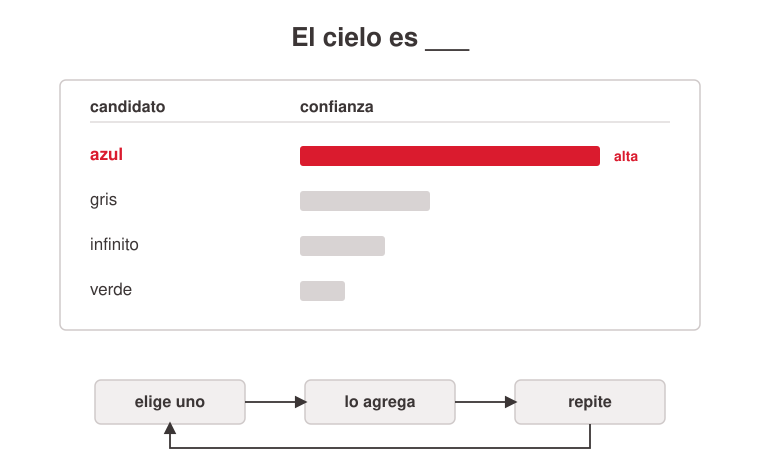
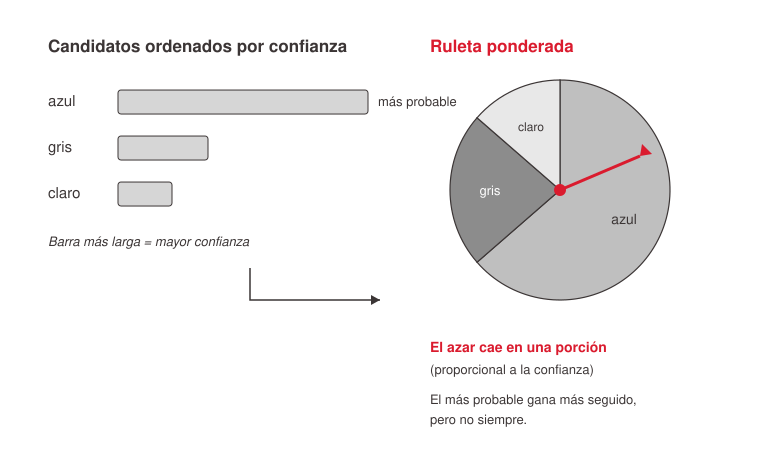
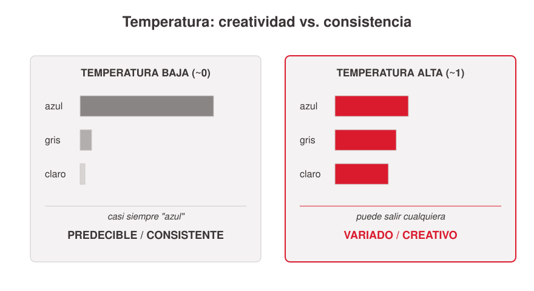

# Cómo genera texto un LLM

La mecánica interna sobre la que se apoyan las perillas de inferencia. Este archivo cura el **substrato técnico** (cómo se produce cada palabra y dónde "engancha" cada parámetro). La lectura de negocio de las perillas vive en [`../parametros-inferencia-llm/index.md`](../parametros-inferencia-llm/index.md); el detalle del razonamiento/effort en [`../razonamiento-y-effort-en-llms/index.md`](../razonamiento-y-effort-en-llms/index.md).

## El modelo mental mínimo (sin fórmulas)

Un LLM hace una sola cosa, muchas veces: **predecir la siguiente palabra (token)**. En cada paso arma una **lista de candidatos con un puntaje de confianza** (los `logits`, puntajes crudos por token). Elige uno, lo agrega al texto y vuelve a empezar leyendo todo lo escrito hasta ahí. La clave conceptual: el modelo no tiene *una* respuesta, tiene una *lista rankeada* de opciones; todas las perillas de sampling intervienen en esa lista (cuánto respetarla, cuánto cortarla).



**Elegir no es siempre el más probable.** La selección tiene un componente de azar: es una **ruleta ponderada** donde cada candidato ocupa una tajada proporcional a su confianza. El más probable gana más seguido, pero no siempre — y esa es la razón por la que la misma pregunta da respuestas distintas.



## La mecánica: logits, softmax y temperatura

Los `logits` (puntajes crudos) se convierten en probabilidades vía **softmax**, que incorpora la **temperatura `T`** dividiendo cada logit:

```
P(token_i) = exp(logit_i / T) / Σ exp(logit_j / T)
```

- **T → 0:** los logits se agrandan; el token top se lleva casi toda la probabilidad → salida casi determinista (*greedy* / argmax).
- **T = 1:** distribución tal cual la produjo el modelo.
- **T > 1:** aplana la distribución (más variedad, más riesgo de incoherencia).

Punto conceptual importante: **la temperatura NO selecciona el token** — arma/deforma la distribución; quien *elige* es el **sampler**, mediante muestreo aleatorio ponderado (la ruleta, vía la CDF / suma acumulada; el número aleatorio — donde entra el `seed` — cae en la porción correspondiente).

**Ejemplo numérico** (logits `[2.0, 1.0, 0.5]`):

| Token | logit | T=0.5 | T=1.0 | T=2.0 |
|-------|-------|-------|-------|-------|
| A | 2.0 | ~0.84 | ~0.63 | ~0.48 |
| B | 1.0 | ~0.11 | ~0.23 | ~0.29 |
| C | 0.5 | ~0.05 | ~0.14 | ~0.23 |

A T=0.5 el token A domina (84%) → predecible; a T=2.0 la distribución se aplana.



**Ejemplo de la ruleta / CDF** (probabilidades A=0.48, B=0.29, C=0.23):

```
A: 0.00 – 0.48
B: 0.48 – 0.77
C: 0.77 – 1.00
```

El random (ej. 0.63) cae en el rango de B → se elige B. "Cada uno gana proporcional a su tajada", no "el más probable gana siempre".

## El pipeline completo del sampling

```
logits → [temperature deforma] → [top_k / top_p / min_p recortan] →
       → normalizar → muestreo aleatorio ponderado (con seed) → token elegido
```

Los recortes (todos alternativos entre sí, en la práctica se usa uno): **`top_p`** (nucleus) conserva el conjunto mínimo de tokens que suma la probabilidad p y descarta la cola; **`top_k`** deja solo los K más probables (más crudo); **`min_p`** descarta lo que esté por debajo de un umbral relativo al token top (buen balance a temperaturas altas).

## Reproducibilidad: por qué `seed` es "best effort"

Mismo seed **no** garantiza misma salida. Cuatro razones: (1) hardware/paralelización GPU — el punto flotante no es perfectamente asociativo; el orden de acumulación de sumas cambia mínimamente los logits y puede voltear un empate cercano; (2) batching en servidores compartidos; (3) cambios del provider (actualización de modelo/infra rompe el mapeo — OpenAI acompaña el seed con `system_fingerprint`); (4) `temperature=0` (greedy) no es lo mismo que seed y tampoco es 100% determinista por (1). Determinismo real solo corriendo el modelo uno mismo con hardware fijo, batch de tamaño 1 y kernels deterministas.

## Test-time compute: por qué "razonar más" = "generar más tokens"

Un transformer hace una cantidad **FIJA** de cómputo por token (mismo forward pass); un token "fácil" y uno "difícil" consumen exactamente lo mismo. La única forma de gastar más cómputo en un problema es **generar más tokens**. Los "reasoning tokens" son tokens comunes (mismo mecanismo next-token: logits → temperature → sampler → token; indistinguibles a nivel de máquina). El **contexto funciona como memoria de trabajo**: cada token generado se appendea y los siguientes lo leen vía self-attention → un problema difícil se convierte en una secuencia de muchos forward passes. Esto es **test-time compute** (cómputo en serie; el contexto como "la cinta de una máquina de Turing improvisada"). Es el fundamento mecánico del razonamiento/"effort" — desarrollado en [`../razonamiento-y-effort-en-llms/index.md`](../razonamiento-y-effort-en-llms/index.md).

## Definiciones

- **logits:** puntajes crudos sin normalizar por token candidato.
- **softmax:** convierte logits en probabilidades (fórmula arriba).
- **temperature (T):** factor que divide los logits antes del softmax; reescala la distribución. No selecciona el token.
- **sampler / sampling:** mecanismo que *elige* un token de la distribución final vía muestreo aleatorio ponderado.
- **greedy / argmax:** caso límite T=0; siempre el token más probable.
- **top_p / top_k / min_p:** recortes de la lista de candidatos (ver pipeline).
- **seed / system_fingerprint:** reproducibilidad "best effort"; el fingerprint señala si cambió el backend.
- **test-time compute:** ganar capacidad generando más tokens, usando el contexto como scratchpad.

## References

- `../../talks/hiperparametros-ai/research/corpus/parametros-llm.md.md` — record único (transcripción Q&A con un LLM, 2025+). Secciones fuente: "Key claims" (mecánica de temperature, sampler, seed, transformer y test-time compute), "Definitions and terminology", "Evidence and examples" (ejemplo numérico, ruleta/CDF, pipeline), y "Raw / preserved excerpts" (fórmula del softmax verbatim, "Resumen encadenado — transformer, effort y tokens").
