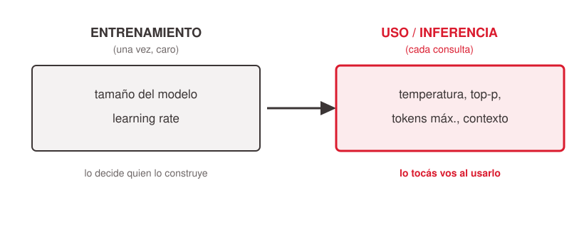
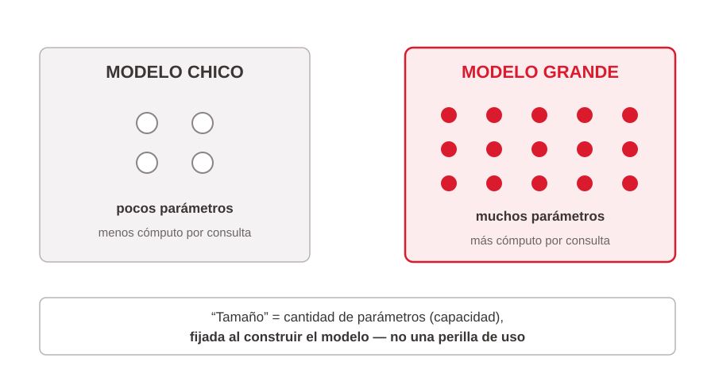
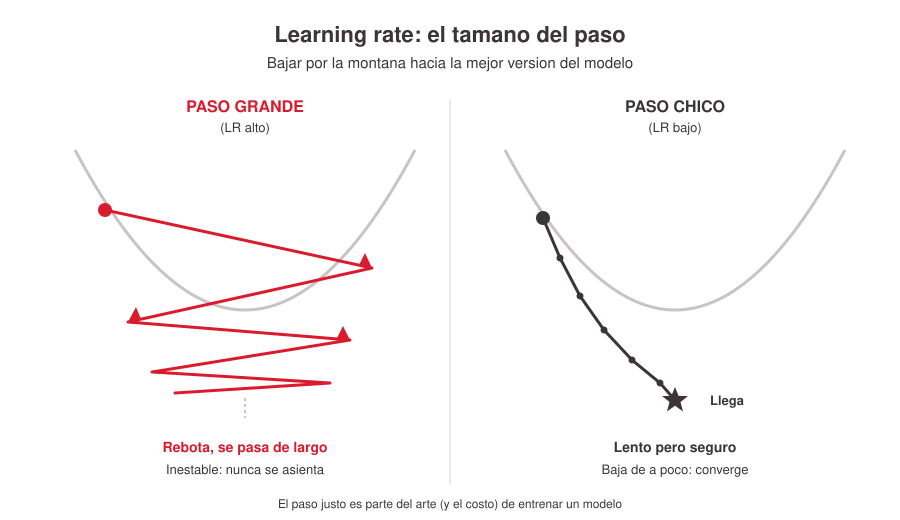

# Parámetros que se deciden al construir el modelo

Los parámetros anteriores de esta biblioteca ([`../parametros-inferencia-llm/index.md`](../parametros-inferencia-llm/index.md)) se tocan al **usar** el modelo (inferencia, cada consulta). Los dos de este archivo se deciden al **construirlo** (entrenamiento, una sola vez) y vienen "horneados" en lo que un negocio compra. El negocio no los tunea — no entrena modelos de cero, es carísimo — pero *elige entre* modelos que difieren en ellos y los paga. Por eso se tratan a nivel conceptual: para entender qué comprás, no para ajustarlos.

> Nota de encuadre: el corpus de esta charla (una transcripción Q&A sobre parámetros de *inferencia*) **no cubre** ni el tamaño del modelo ni el learning rate como parámetros. El contenido de este archivo es **conocimiento de dominio del presenter**, tratado conceptualmente; no está respaldado por un record del corpus. La *elección* entre modelos sí está respaldada (Tabla 1 del corpus) y vive en [`../parametros-inferencia-llm/index.md`](../parametros-inferencia-llm/index.md).

## Tamaño del modelo: qué es "grande" por dentro

Cuando se habla de un modelo "grande" o "chico" (la decisión de selección de modelo), lo que efectivamente cambia por dentro es la **cantidad de parámetros**: cuánta capacidad de aprender y capturar patrones tiene el modelo. La analogía imperfecta pero útil para un público no técnico es "la cantidad de neuronas".

- Más parámetros → más capacidad de representar patrones complejos, **pero también más cómputo por consulta** — de ahí que el modelo grande sea más lento y más caro por consulta.
- Es una decisión de *construcción*: la fija quien entrena el modelo; el negocio no la toca, solo elige entre modelos ya construidos.

Es puro andamiaje conceptual para que "grande/chico" deje de ser una etiqueta opaca y se conecte con el eje capacidad-vs-costo de la selección de modelo.

## Learning rate: cómo aprende el modelo

El learning rate es el **"tamaño del paso"** con que el modelo ajusta lo que aprende en cada corrección durante el entrenamiento.

- **Muy grande:** aprende rápido pero inestable — "se pasa de largo", rebota y no converge.
- **Muy chico:** estable pero lentísimo y caro de entrenar (en cómputo, "eternidad = mucha plata").

Metáfora reusable: bajar por una montaña con niebla hacia el punto más bajo (la "mejor versión" del modelo); el learning rate es el tamaño de cada paso. Pasos gigantes rebotan y nunca se asientan; pasos minúsculos llegan seguro pero tardan una eternidad. Encontrar el paso justo es parte del **arte — y del costo — de entrenar**.

**Por qué le importa a un manager:** cuando un proveedor ofrece "afinamos un modelo con tus datos" (*fine-tuning*), estas decisiones están detrás del precio y del riesgo de que salga mal. El learning rate es la razón conceptual de por qué "hacé tu propio modelo" nunca es tan simple ni tan barato como suena.

## Cómo conecta con el resto de la biblioteca

Al elegir un modelo (perilla siempre expuesta — ver [`../parametros-inferencia-llm/index.md`](../parametros-inferencia-llm/index.md)) estás fijando implícitamente su tamaño y su entrenamiento. Estos dos parámetros son el "detrás de escena" de esa elección: no se ajustan al usar, se compran al elegir.

## References

- `../../talks/hiperparametros-ai/final.md` — Sección 6 "Lo que se decide al construir el modelo" (slides "Dos momentos: entrenar vs. usar", "Tamaño del modelo", "Learning rate"). Fuente conceptual y de las metáforas (neuronas, descenso por la montaña).
- El record del corpus `../../talks/hiperparametros-ai/research/corpus/parametros-llm.md.md` **no** trata estos dos parámetros; aporta solo la distinción implícita entrenamiento-vs-inferencia. Contenido marcado en el deck como conocimiento de dominio del presenter, no citado del corpus.
