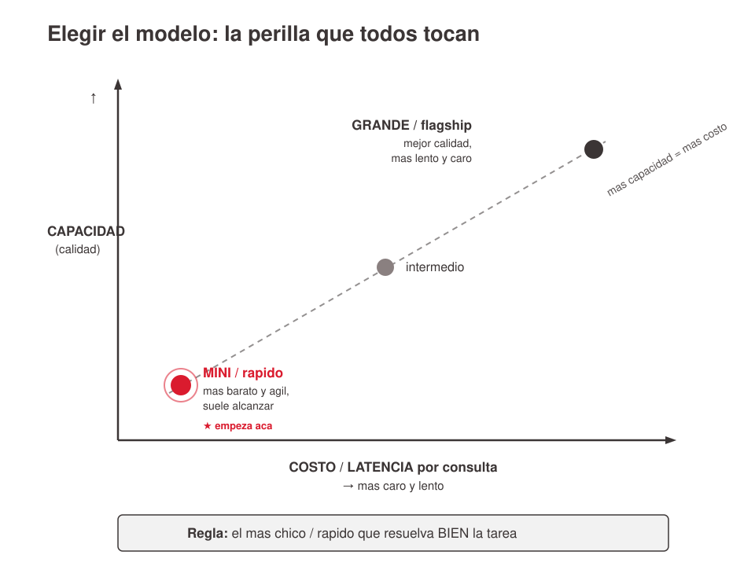
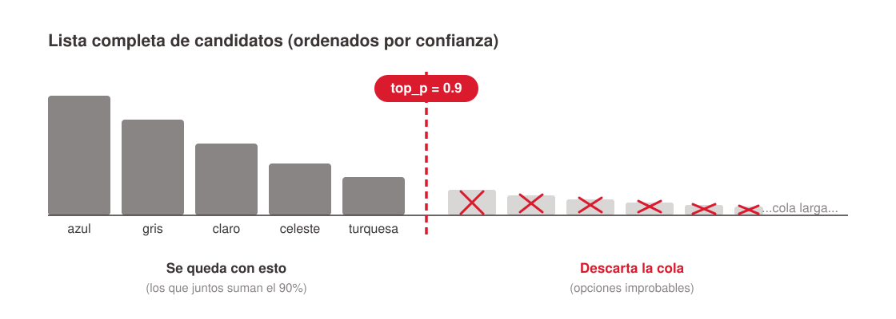
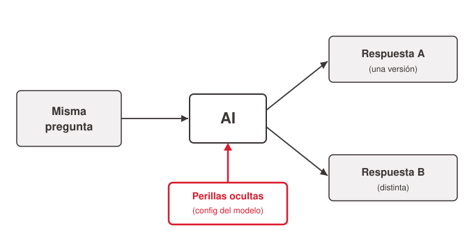

# Parámetros de inferencia de LLMs para managers

Entrada al tema de las **"perillas" configurables de un modelo de AI**: los parámetros que, para la misma pregunta al mismo modelo, cambian la respuesta — más creativa o más precisa, más cara o más barata, más larga o más corta. Este archivo cura la capa de **negocio** (qué palanca cambia qué y cómo decidir), pensada para un público no técnico. La mecánica interna vive en los archivos hermanos:

- Cómo un LLM genera texto (candidatos, ruleta ponderada, softmax con temperatura, *test-time compute*): [`../como-genera-texto-un-llm/index.md`](../como-genera-texto-un-llm/index.md).
- El razonamiento/"effort" en detalle (Thinking vs effort, extended thinking vs agente, por qué se deshabilita temperature): [`../razonamiento-y-effort-en-llms/index.md`](../razonamiento-y-effort-en-llms/index.md).
- Los parámetros que se fijan al *construir* el modelo (tamaño, learning rate): [`../parametros-de-entrenamiento/index.md`](../parametros-de-entrenamiento/index.md).

## Tesis reusable

No existe una configuración universalmente "buena": existe una **apropiada a cada tarea**. Un profesional de negocios no tunea modelos — *elige, compra y supervisa* herramientas que otros configuran — pero necesita saber qué perilla cambia qué para pedir lo correcto, entender una factura y diagnosticar cuando algo falla. Tres preguntas de negocio ordenan la evaluación de cualquier perilla: **¿es consistente? ¿cuánto cuesta? ¿es suficientemente buena para esta tarea?**

Un hecho de encuadre que reordena todo: **en los chats web casi no se expone nada.** En claude.ai, ChatGPT o Gemini el usuario prácticamente solo elige el *modelo*; temperatura y el resto vienen con defaults internos. Estas perillas aparecen cuando una empresa integra la AI **vía API** — que es exactamente el contexto en que un manager las encontrará en una propuesta o factura. (Respaldo: Tabla 1 del corpus — `model selection` es la única fila con "X" en las cuatro columnas incluidas las web.)

## La perilla cero: selección de modelo

Es la primera y más consecuente decisión, y la **única perilla siempre expuesta** hasta en el chat web. Fija de entrada el eje **capacidad vs. costo/velocidad**:

- Modelos más capaces (*grande / flagship*): mejor calidad, pero más lentos y caros por consulta.
- Modelos más chicos/rápidos (*mini*): más baratos y ágiles, y muchas veces alcanzan de sobra — sobre todo en tareas simples de alto volumen.

**Regla de gestión:** el más chico/rápido que resuelva bien la tarea. Empezá por el mini; subí al grande solo si la calidad no alcanza. Al elegir el modelo fijás implícitamente su tamaño y su entrenamiento (ver [`../parametros-de-entrenamiento/index.md`](../parametros-de-entrenamiento/index.md)): elegir el modelo es comprar todo ese paquete de una.

> Nota de verificación: los nombres y defaults de versión por proveedor (qué modelo, qué default) cambian seguido y **no están verificados en el corpus**. Hablar de familias/niveles (grande vs. mini), no de nombres puntuales.

## Perilla 1 — Temperatura: creatividad vs. consistencia

La temperatura regula *cuánto azar* hay en la elección de cada palabra (la "ruleta ponderada" — ver mecánica en [`../como-genera-texto-un-llm/index.md`](../como-genera-texto-un-llm/index.md)).

- **Baja (≈0):** casi siempre el candidato más probable → respuestas predecibles, repetibles, "aburridas pero seguras". Ideal para extracción de datos, clasificación, compliance.
- **Alta (≈0.8–1.2):** más variedad → respuestas creativas, con más riesgo de incoherencia o error. Ideal para brainstorming, copy, nombres de producto.

Los valores exactos son referencias típicas, no números mágicos, y cambian según la herramienta.

## Perilla 2 — Top-p (nucleus): la otra forma de dar variedad

Top-p persigue el mismo objetivo que la temperatura (controlar variedad) con otro mecanismo: en vez de subir el azar, **recorta la lista** de candidatos. `top_p = 0.9` → el modelo solo considera los candidatos que juntos suman el 90% de la confianza y descarta la cola improbable.

**Regla práctica clave:** se ajusta *una u otra* — temperatura **o** top-p — nunca las dos a la vez; combinarlas suele ser contraproducente. Para un público de negocios: si un proveedor te habla de "top-p", es la misma decisión de variedad-vs-control que ya entendiste con temperatura.

**Disponibilidad de top-p por proveedor** (verificar contra la doc vigente — cambia seguido):

| Proveedor | top-p en la API | En modelos de razonamiento |
|---|---|---|
| OpenAI (GPT) | Sí | Deshabilitado (queda fijo) |
| Anthropic (Claude) | Sí — se ajusta temperatura *o* top-p, no ambos | Deshabilitado con *extended thinking* |
| Google (Gemini) | Sí (`topP`) | Disponible |

> En los **modelos de razonamiento** varios proveedores deshabilitan temperatura y top-p: el modelo las fija internamente y no se tocan. El porqué está en [`../razonamiento-y-effort-en-llms/index.md`](../razonamiento-y-effort-en-llms/index.md) (el ruido del sampling descarrila una trayectoria de razonamiento aprendida por RL).

## Perilla 3 — Razonamiento: Thinking / Deep Thinking (calidad vs. costo y velocidad)

Perilla nueva y muy actual, hoy expuesta de frente al usuario como **modos con nombre**. Pensala como una progresión de tres escalones, no un interruptor sí/no:

- **Respuesta directa** (sin pensar): rápido y barato; default para tareas simples.
- **"Thinking"** (pensar): razona un poco; buen equilibrio para tareas no triviales del día a día.
- **"Deep Thinking"** (*extended thinking*): razona mucho más; lo mejor para análisis, planificación o problemas multi-paso — notablemente más lento y caro (pagás el razonamiento interno que no ves).

**Trade-off de negocio:** al subir de escalón, **calidad, latencia y costo suben juntos**. No hay modo "bueno"; hay uno apropiado a la dificultad. **Guía:** emparejá el modo con la dificultad. Pensar de más en una tarea fácil es tirar plata (y a veces empeora la respuesta por *overthinking*). Analogía útil del corpus: "¿que piense 5 segundos o 5 minutos?".

## El hook y la tabla de bolsillo

**Hook de apertura reusable:** hacé la misma pregunta al mismo chat dos veces y obtené dos respuestas distintas. ¿Se equivocó? No: hay una perilla de aleatoriedad (temperatura) activada por defecto. Lo que parece magia o error muchas veces es configuración. Ejemplo de negocio que aterriza la idea: un asistente que redacta emails a clientes — ¿querés que suene siempre igual (marca consistente) o que proponga variantes creativas? Esa decisión es una perilla.

**Tabla de bolsillo — qué perilla para qué** (el entregable que la audiencia fotografía):

| Perilla | Qué controla | Subir | Bajar |
|---|---|---|---|
| Temperatura | Variedad / azar | Más creativo, menos consistente | Más predecible, ideal control |
| Top-p | Variedad (alternativa) | Más opciones consideradas | Solo lo más seguro |
| Razonamiento (Thinking / Deep Thinking) | Cuánto "piensa" antes de responder | Deep Thinking: mejor en tareas difíciles, más lento y caro | Respuesta directa / Thinking: más rápido y barato |

**Regla de oro:** elegí la perilla por la *tarea*, no por defecto. Un mismo equipo puede tener temperatura baja para su bot de soporte y alta para su generador de campañas, y razonamiento alto para el análisis jurídico y bajo para el FAQ.

## Orden de decisión para un negocio

1. **Modelo** (siempre expuesto; fija capacidad vs. costo/velocidad) → el más chico que alcance.
2. **Tres perillas de inferencia** que se tocan al usar (vía API/herramientas): temperatura, top-p, razonamiento.
3. **Dos parámetros que se compran horneados** al elegir el modelo: su tamaño y su learning rate (no se tunean; se pagan — ver [`../parametros-de-entrenamiento/index.md`](../parametros-de-entrenamiento/index.md)).

## Otros parámetros de inferencia (referencia rápida, no cubiertos en la charla)

El corpus documenta muchas más perillas de API que no llegaron al deck de negocio pero son útiles como referencia: `max_tokens` / `max_output_tokens` (techo de la respuesta, clave para costo), `stop` / `stop_sequences`, `seed` (reproducibilidad "best effort", no determinismo garantizado), penalizaciones de repetición (`frequency_penalty`, `presence_penalty`, `repetition_penalty`), `response_format` / structured outputs (JSON Schema, fundamental para agentes), `tools` / `tool_choice`, `logit_bias`, `logprobs` / `top_logprobs` (confidence scoring, detección de alucinaciones), `n` (best-of-n), `top_k` y `min_p` (recortes alternativos a top-p), y `cache_control` (no cambia la salida, sí costo/latencia). Ver el registro completo con la tabla de exposición por proveedor en el corpus.

## References

- `../../talks/hiperparametros-ai/research/corpus/parametros-llm.md.md` — record único del tema (transcripción Q&A con un LLM, 2025+). Contiene: Key claims, la fórmula del softmax, las tablas de exposición por proveedor (Tablas 1–4), la tabla de trade-offs de effort, y las tablas comparativas Thinking vs Effort / extended thinking vs agente. Fuente de casi todo lo curado aquí.
- `../../talks/hiperparametros-ai/final.md` — deck de 2 h "Parámetros críticos en AI: las perillas que cambian la respuesta" (MiM, IAE). Fuente del encuadre de negocio, las tres preguntas rectoras y la tabla de bolsillo.
- Los nombres/defaults de versión por modelo (GPT-5.x, Claude 4.7/4.8, niveles UI) del corpus están marcados como **no verificados** — contrastar contra doc oficial antes de citar como hecho.
