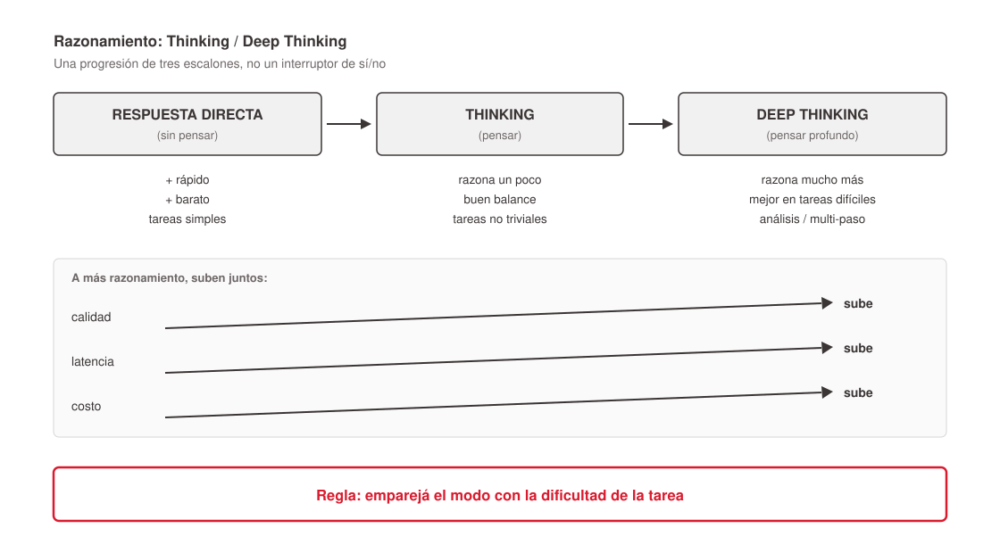

# Razonamiento y "effort" en LLMs

Lo más "de hoy" de los parámetros de un LLM (modelos 2024–2025 en adelante): cuánto **razona** el modelo internamente antes de responder. Este archivo cura el detalle mecánico y las distinciones que se confunden fácil. La lectura de negocio (la progresión Respuesta directa → Thinking → Deep Thinking y su trade-off) vive en [`../parametros-inferencia-llm/index.md`](../parametros-inferencia-llm/index.md); el substrato de por qué razonar = generar más tokens está en [`../como-genera-texto-un-llm/index.md`](../como-genera-texto-un-llm/index.md).

## Qué es "thinking"

Razonamiento interno del modelo antes de la respuesta final: dedica tokens a desglosar el problema, explorar caminos y chequear su propio razonamiento, sin mostrar el proceso crudo completo; luego da la respuesta limpia. Mejora mucho la calidad en tareas complejas (matemática, lógica, código, análisis multi-paso); para preguntas simples aporta poco. **Cada token de thinking se factura aparte** (a menudo el doble que un token normal) y aumenta la latencia. El "Thinking" que se ve en la UI es una **versión mostrada** del proceso, no necesariamente el razonamiento crudo completo — cada empresa decide cuánto exponer.

## Thinking vs Effort — dos niveles distintos

- **Thinking = el mecanismo** (la capacidad de razonar internamente; on/off).
- **Effort (`reasoning_effort`) = la perilla que regula** cuánto de ese mecanismo se usa (low/medium/high…).

Analogía: Thinking es "el modelo puede pensar antes de hablar"; Effort es "¿que piense 5 segundos o 5 minutos?". OpenAI usa `reasoning_effort` explícito por niveles; Anthropic lo maneja como **presupuesto de tokens** (`thinking_budget`); Gemini tiene su propio control de presupuesto — misma familia de idea.

| | Thinking | Effort |
|---|---|---|
| Qué es | El proceso de razonar | El nivel de intensidad de ese proceso |
| Tipo | Capacidad on/off | Perilla graduable |
| Equivalente | "pensar" | "cuánto pensar" |

## `reasoning_effort` en detalle

Le decís al modelo cuántos *tokens de razonamiento* ocultos gastar antes de la respuesta final; no toca el prompt ni el formato de salida. Niveles típicos (según doc OpenAI): `none, minimal, low, medium, high, xhigh`. Menos effort = velocidad y menos tokens; más effort = piensa más completo, mayor calidad. Mecánicamente: en `low` puede podar caminos temprano y devolver la primera solución razonable; en `high` explora múltiples ramas, hace backtrack y verifica su trabajo.

- **Adaptativo:** no es un presupuesto fijo y ciego — el modelo modula dentro de cada nivel (menos tokens en tareas simples, más en complejas); el effort pone el techo/intensidad.
- **Contra-intuitivo:** más razonamiento **no siempre es mejor** — en tareas fáciles un effort alto puede llevar a *overthinking* y empeorar la respuesta.
- Los tokens de razonamiento se facturan como tokens de salida aunque no se vean.

Trade-off (verbatim del corpus):

| Effort | Calidad (tareas difíciles) | Latencia | Costo |
|--------|---------------------------|----------|-------|
| minimal | baja | mínima | mínimo |
| low | media | baja | bajo |
| medium | buena | media | medio |
| high | máxima | alta | alto |

Dónde entra mecánicamente: el modelo tiene un **token especial de fin-de-thinking** que compite con los demás en cada paso; el RL lo entrenó a emitirlo según la dificultad. El `effort` es una **señal de condicionamiento** metida en el contexto: condicionar en "high" baja la probabilidad de "ya terminé" temprano y sube la de seguir generando pasos. No es un mecanismo aparte: es un sesgo sobre la decisión next-token de "sigo pensando vs. respondo ya".

## API vs UI (dos capas de lo mismo)

`reasoning_effort` (API) = valor crudo directo (`minimal/low/medium/high…`). El "effort" en la UI (ChatGPT) = selector con etiquetas en lenguaje humano (Instant / Medium / High / Extra High), renombrado seguido. Diferencias: (1) granularidad; (2) **auto-routing** — en API `high` es `high`, en el chat hay una capa de ruteo que puede pisar la elección; (3) trace visible solo en UI; (4) en la UI el effort viene acoplado a la selección de modelo.

Importante: **API vs UI ≠ agente vs modelo.** API vs UI = quién configura y cómo se presenta (en ambos casos *ejecuta* el modelo). Agente vs modelo = el **modelo** es quien razona; el **agente / capa que llama** solo *setea* el parámetro, no razona. La UI de ChatGPT es un caso particular de "capa que llama".

## Las tres cosas llamadas "think"

1. **Extended thinking** — razonamiento interno, una sola pasada, antes de responder (regulado por `thinking_budget`).
2. **`think` tool** (Anthropic) — una tool literalmente llamada `think`: un scratchpad que el modelo invoca *entre pasos* de un flujo con tools para parar a anotar/estructurar (no busca nada afuera, no cambia estado).
3. **"Thinking" en la UI** — lo que te muestran del #1 (bloque desplegable).

Extended thinking sirve para razonar *antes* de arrancar; la think tool para reflexionar *entre pasos* de un flujo agéntico.

## Extended thinking vs agente iterando

**Extended thinking = una sola pasada** del modelo (monólogo interno lineal, sin loop). Un **agente iterando** es un loop *alrededor* del modelo (llama → mira resultado → decide si vuelve a llamar), orquestado por código externo. Ejes independientes que se combinan: un agente puede, en cada iteración, llamar a un modelo con extended thinking. `thinking_budget` = tokens de razonamiento por llamada; iteraciones del agente = cuántas llamadas hace el orquestador.

## Deep Research NO es un parámetro

Es un **modo/feature agéntica** (toggle), no una perilla tipo temperature. Loop: (1) construye un plan/outline; (2) el usuario lo acepta o modifica; (3) navega la web iterativamente (busca → encuentra → lanza nueva búsqueda según lo aprendido); (4) entrega un reporte con citas. Suele tardar 5–10 minutos. Equivalentes: Gemini "Deep Research", ChatGPT "Deep Research" (sobre o3), Claude modo "Research".

## Por qué se deshabilita `temperature` (y penalties) en reasoning models

El razonamiento es una **trayectoria aprendida, no texto libre**: cada token condiciona el siguiente y el RL entrenó esa trayectoria para que sea correcta. La temperatura mete ruido que **se acumula y propaga**: un token de razonamiento raro elegido por azar es un paso de cálculo equivocado que queda escrito en el contexto y que los pasos siguientes *leen* → error compuesto, no creatividad. Además: (1) los parámetros se calibraron durante el RL a un régimen de sampling específico; (2) las penalties son dañinas — el razonamiento *repite a propósito* (reformula, re-chequea) y `frequency/presence_penalty` lo penalizarían; (3) evitan que el usuario se dispare en el pie subiendo temperature esperando "creatividad" y degradando la precisión.

| | Generación normal | Razonamiento |
|---|---|---|
| Cada token es | una palabra de la salida | un paso de cálculo que se relee |
| Un token "raro" | variación estilística inocua | posible error que contamina la cadena |
| La exploración | la inducís con temperature (afuera) | está en la política RL, escrita como texto (adentro) |

**Gotchas de la doc OpenAI:** con reasoning models quedan deshabilitados `temperature`, `top_p`, `presence_penalty`, `frequency_penalty`, `logprobs`, `top_logprobs`, `logit_bias` y `max_tokens` (se usa `max_completion_tokens` / `max_output_tokens`); las tools en paralelo no se soportan con `reasoning_effort` en `minimal`.

**En Claude:** temperature nunca se "deprecó" globalmente — se vuelve incompatible al activar extended thinking (desde Claude 3.7 Sonnet). Con thinking activado solo se puede tocar `top_p` entre 0.95 y 1, y la temperature debe quedar en 1 (otro valor → el request falla). Regla general de Claude (independiente del thinking): alterar temperature *o* top_p, no ambos.

## RL / RLHF (por qué el modelo razona sin que nadie le enseñe cómo)

**RL (Reinforcement Learning):** aprende por prueba y error a partir de recompensas, no copiando ejemplos. Ciclo: produce algo → se evalúa y recibe recompensa → ajusta pesos → repite millones de veces → aprende una **política (policy)**. **RLHF:** humanos rankean respuestas, se entrena un modelo de recompensa que aprende el gusto humano, y RL optimiza el LLM contra ese juez (convirtió modelos crudos en asistentes útiles). En reasoning models la recompensa suele ser **automática y verificable** (ej. matemática con respuesta conocida — se chequea si el resultado es correcto). Lo potente: nadie le enseñó *cómo* razonar paso a paso; el modelo descubrió solo, a fuerza de recompensa, que le conviene desglosar, explorar ramas, hacer backtracking y verificar.

## Nota de verificación

Los defaults y nombres de versión por modelo del corpus (gpt-5.5=medium, gpt-5.1=none, gpt-5-pro=high, gpt-5.1-codex-max=xhigh; Claude Opus 4.7/4.8 con adaptive thinking; niveles UI "Instant/Medium/High/Extra High") provienen de la respuesta de un LLM y **no están verificados** contra doc oficial. Contrastar antes de citarlos como hecho. Las distinciones conceptuales de este archivo (thinking vs effort, las tres "think", RL) sí son robustas.

## References

- `../../talks/hiperparametros-ai/research/corpus/parametros-llm.md.md` — record único (transcripción Q&A, 2025+). Secciones fuente: Key claims sobre razonamiento/effort, las auto-correcciones "agente vs modelo" y "extended thinking vs agente iterando", y las tablas verbatim en "Raw / preserved excerpts" (Thinking vs Effort; effort UI vs API; quién setea el effort; extended thinking vs agente; extended thinking vs think tool; opción B — exposición por proveedor; generación normal vs razonamiento; pre-entrenamiento vs RL; cuándo temperature deja de estar disponible en Claude).
