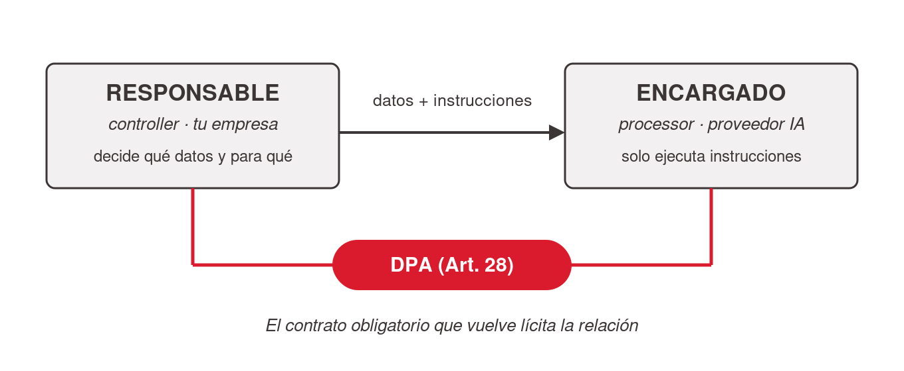

# GDPR — explicado para managers

## Qué es y por qué existe

- **GDPR — General Data Protection Regulation** (Reglamento (UE) 2016/679): regula cómo cualquier organización puede recolectar, usar, guardar y compartir datos personales. En aplicación desde el **25 de mayo de 2018**; estándar de referencia global de privacidad.
- Idea central — cambio de dueño: **"tus datos personales son tuyos, no de la empresa que los recolecta."** La empresa los "toma prestados" bajo condiciones estrictas y debe **rendir cuentas**.
- **Extraterritorial**: alcanza a organizaciones fuera de la UE (p. ej. en Argentina) si tratan datos de personas en la UE. Por el "efecto Bruselas" inspiró CCPA/CPRA (California), LGPD (Brasil) y los proyectos de reforma argentinos.
- Evolución en una línea: Hesse 1970 → Suecia 1973 → Directrices OCDE 1980 → Convenio 108 (1981) → Directiva 95/46/CE (1995) → GDPR (adopción 2016, aplicación 2018). El salto clave: al ser **reglamento** (no directiva), aplica directo e igual en toda la UE.

## Conceptos mínimos

- **Datos personales** — *cualquier* información sobre una persona identificada o **identificable**: email, IP, ubicación, cookies, comportamiento, incluso inferencias. Mucho más amplio que la noción de "PII" (PII ⊂ datos personales).
- **Categorías especiales** — salud, origen étnico, opiniones políticas, religión, orientación sexual, biometría, genética; protección reforzada.
- **Responsable (*controller*)** — decide *qué* datos y *para qué*; responsabilidad principal. Prueba para distinguir roles: *¿quién decide para qué se usan los datos?*
- **Encargado (*processor*)** — trata datos *en nombre* del responsable (nube, SaaS… y **una herramienta de IA**); solo ejecuta instrucciones.
- **DPA — Data Processing Agreement** (Art. 28) — contrato obligatorio responsable↔encargado; **sin DPA el tratamiento es directamente ilícito**.
- **Los 7 principios (Art. 5)** — licitud/lealtad/transparencia; limitación de finalidad; minimización; exactitud; limitación de conservación; integridad y confidencialidad; **accountability** (poder *demostrar* que se cumple).
- Otras siglas: **DPO** (delegado de protección de datos), **DPIA** (evaluación de impacto para alto riesgo), **SCCs** (cláusulas tipo para transferencias internacionales).

## Controller, processor y el DPA

Con IA: **tu empresa es el responsable, el proveedor de IA es el encargado** — y esa relación *legalmente requiere un DPA*. Sin DPA (como en la mayoría de las herramientas de consumo) la relación existe de hecho, pero **sin el marco legal que la vuelve lícita**.

> *"El DPA es el contrato que convierte 'confío en que el proveedor se porte bien' en 'el proveedor está legalmente obligado a portarse bien — y puedo auditarlo'."*

**"¿Tiene DPA?" es la línea que separa una herramienta de IA gobernada de una shadow AI** — una de las primeras preguntas antes de habilitar cualquier herramienta.

## Derechos del titular (la tabla "desde tu lado")

| Como persona podés pedir… | La empresa está obligada a… |
|---|---|
| Que me digan qué tienen (acceso) | Darte una copia y explicar los usos |
| Que lo corrijan (rectificación) | Corregirlo sin demora |
| Que lo borren (supresión / olvido) | Borrarlo si no hay razón legal para conservarlo |
| Que frenen el uso (limitación) | Congelar el tratamiento |
| Que me los den (portabilidad) | Entregarlos en formato reutilizable |
| Que no los usen para X (oposición) | Dejar de usarlos para ese fin |
| Que decida un humano | Ofrecer intervención humana |

Plazo general de respuesta: **1 mes** (extensible a tres si es complejo). Ejercer los derechos es **gratis**.

El "clic" para el manager: todo lo que te gustaría exigir como usuario es exactamente lo que tu empresa le debe a sus clientes. Si un empleado pegó datos de un cliente en un chatbot no gobernado, **no podés cumplir ninguno de estos pedidos** — el derecho existe; tu capacidad de cumplirlo, no.

## Sanciones y enforcement

- Dos niveles: hasta €10M o 2% de facturación global (incumplimientos administrativos); hasta **€20M o 4%** (violaciones de principios, bases legales o derechos). El cálculo sobre facturación global es lo que hace que las multinacionales lo tomen en serio.
- Notificación de brechas: **72 horas**.
- Enforcement real: **Meta €1.200 millones (mayo 2023)** — la mayor multa individual, por transferencias a EE. UU. sin garantías; Amazon €746M (2021); Meta €390M (enero 2023).
- ⚠️ **Sin verificar**: la cifra acumulada "~€5.880M en multas 2023–24" proviene de fuentes secundarias (Data Privacy Manager, Forbes) — no fijar en lámina sin verificación; el estado procesal de la multa de Amazon también requiere confirmación.

## GDPR + IA: por qué el shadow AI rompe el cumplimiento *estructuralmente*

Cuando un empleado pega datos personales en una herramienta no gobernada, el incumplimiento no es un descuido puntual — se rompen varios artículos a la vez:

- Sin contrato de tratamiento → **DPA, Art. 28** (tratamiento ilícito).
- Dato en servidores fuera de la región sin garantías → **transferencia internacional ilícita, Arts. 44–49**.
- Imposibilidad de borrar → **derecho de supresión (Art. 17) incumplible**.
- Además: Art. 5 (minimización, accountability), Art. 30 (registro), Art. 32 (seguridad), Art. 22 (decisiones automatizadas), Arts. 33–34 (brecha no detectable → no notificable en 72 h).

Ejemplo insignia: *un cliente ejerce su derecho y pide que borres sus datos; estás legalmente obligado — pero el dato lo pegó un empleado en un chatbot no gobernado: no sabés en qué servidor quedó ni podés borrarlo.* El único momento para evitarlo era **antes**, gobernando la herramienta.

> *"Como responsable del tratamiento, no podés delegar el cumplimiento en el buen criterio del empleado. Si la herramienta no está gobernada, el incumplimiento ya ocurrió — aunque nada se filtre."*

Este mapeo es el "callback Samsung" de la charla de origen: las tres carencias del caso ("sin NDA / sin control de residencia / sin posibilidad de borrar") traducidas a Arts. 28 / 44–49 / 17 — ver el tópico [`../caso-samsung-chatgpt-2023/index.md`](../caso-samsung-chatgpt-2023/index.md).

## Consumo vs. enterprise

La herramienta de IA de consumo/gratuita normalmente **no ofrece DPA** (y puede entrenar con tus datos — justo lo que un DPA prohibiría); el plan empresarial normalmente **sí** (no entrenar, controles de acceso, borrado, a veces elección de región/residencia).

## References

- [`../../talks/seguridad-governance-ai/research/corpus/gdpr-explicado.md.md`](../../talks/seguridad-governance-ai/research/corpus/gdpr-explicado.md.md) — documento de estudio fuente (historia completa, tabla de derechos íntegra, glosario, enforcement).
- [`../../talks/seguridad-governance-ai/research/corpus/security-ai-managers-agenda.md.md`](../../talks/seguridad-governance-ai/research/corpus/security-ai-managers-agenda.md.md) — anexo IA + GDPR (incumplimiento estructural, callback Samsung).
- European Commission — Data protection under GDPR: https://commission.europa.eu/law/law-topic/data-protection_en
