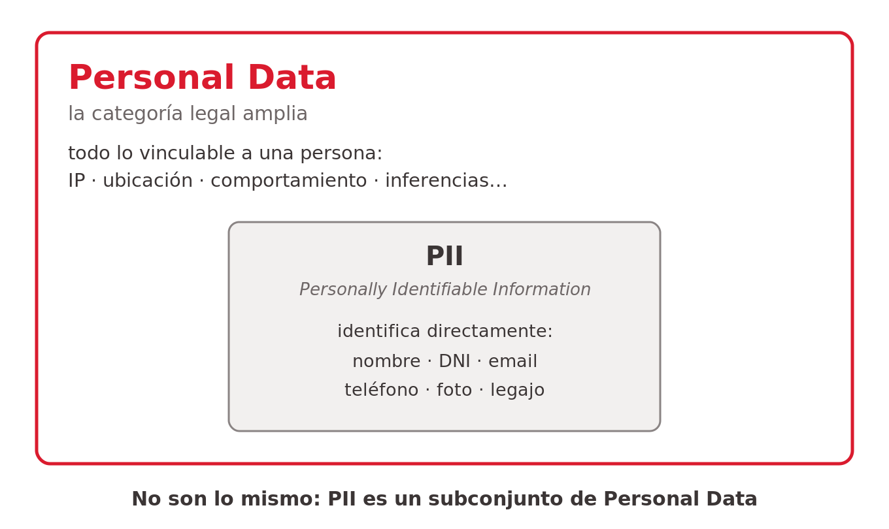
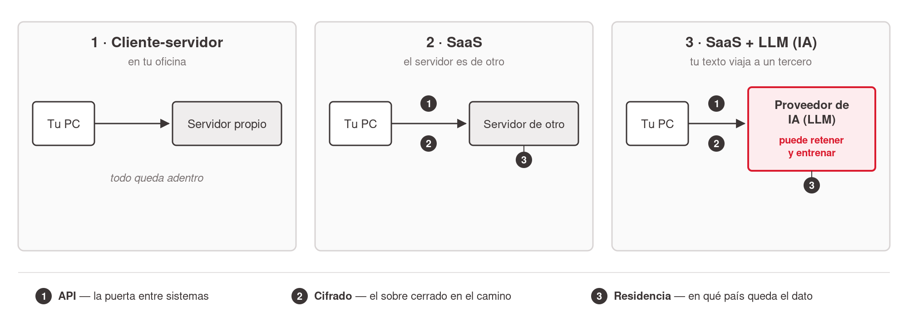
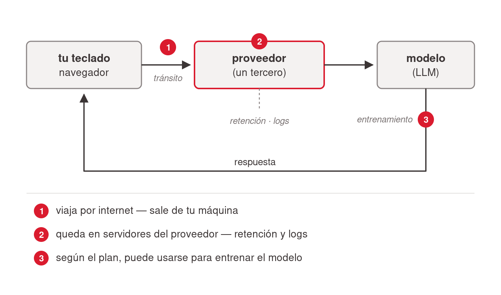
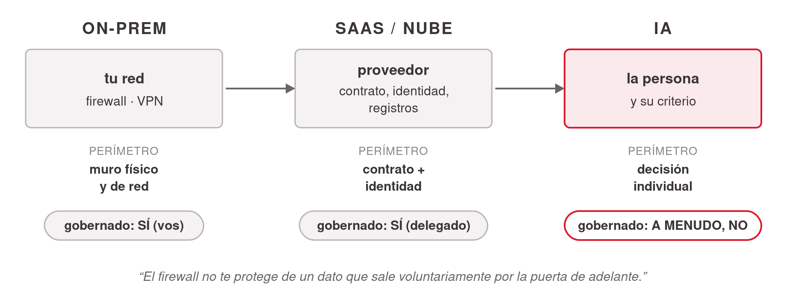

# Conceptos fundamentales — el vocabulario mínimo

Puñado de conceptos con los que un manager no técnico puede razonar los riesgos de la IA con precisión. Pocos conceptos, cero matemática. Cada uno viene con su diagrama didáctico ya renderizado.

## PII vs. Personal Data

- **PII — Personally Identifiable Information**: lo que identifica a una persona **directamente** (nombre, DNI/pasaporte, email, teléfono, foto del rostro, legajo).
- **Personal Data** (la categoría legal amplia, GDPR): **todo lo vinculable** a una persona — IP, ubicación, comportamiento, inferencias.
- **No son sinónimos: PII ⊂ Personal Data.**
- ⚠️ Error típico del manager: *"le saqué el nombre, ya no es personal"* → **falso** si se puede reidentificar; sigue siendo Personal Data y sigue protegido.
- Decisión didáctica: los dos términos quedan en inglés porque así aparecen en las herramientas y contratos que la audiencia va a manejar.

## Tres términos en 30 segundos (API, cifrado, residencia)

- 🔑 **API**: el canal estándar por el que dos sistemas se hablan. Analogía: **el mesero** — pedís, la cocina prepara, el mesero trae la respuesta. (La analogía se extiende luego: MCP es el mesero que consigue las llaves de la oficina.)
- 🔒 **Cifrado**: el sobre cerrado — protege el dato **en tránsito** y **en reposo**. Matiz clave: si vos mismo le entregás el dato al destinatario equivocado, el cifrado funcionó perfecto — y el dato igual está afuera. **La tecnología no reemplaza el criterio.**
- 📍 **Residencia de datos**: **en qué país viven físicamente los datos** — y por lo tanto **qué leyes los rigen**. Pregunta de manager: *"¿en qué país quedan mis datos cuando uso esta herramienta?"*

## La arquitectura, en tres saltos

1. **Cliente-servidor** (en tu oficina) — todo queda adentro; ninguna pregunta se plantea.
2. **SaaS** — el servidor es de otro: aparecen la API (puerta), el cifrado (sobre) y la residencia (el dato vive en otro país).
3. **SaaS + LLM** — igual que SaaS **más** algo nuevo: el tercero puede además **retener tu texto y entrenar con él**.

## El camino del dato (qué pasa cuando uso una IA)

La sensación de "le hablo a un programa en mi compu" es falsa — el LLM es **un servicio remoto de un tercero**. Tres puntos de exposición: **[1]** el texto sale de tu máquina y viaja por internet; **[2]** queda en servidores del proveedor (logs, historial, retención); **[3]** según el plan, puede usarse para entrenar. Implicancia directa: **lo que pegás, viaja — y puede quedar.**

Las tres preguntas que estructuran todo lo demás (consumo vs. enterprise, checklist del comprador): ¿dónde queda? (**residencia**) · ¿cuánto tiempo? (**retención**) · ¿para qué se usa? (**entrenamiento**).

## Clasificación de datos: 3 niveles

| Nivel | Qué es | ¿Dónde puede ir? |
|---|---|---|
| 🟢 **Público** | Ya es o puede ser público | Cualquier herramienta |
| 🟡 **Interno** | De la empresa, no público | Solo herramientas autorizadas con contrato |
| 🔴 **Confidencial / Regulado** | Clientes, PII, salud, IP, secretos | **Nunca** en herramientas de consumo |

Es una convención con respaldo en ISO 27001 / NIST, no un estándar único — cada empresa la adapta. Lo importante es tener *alguna* clasificación y el hábito: **"antes de pegar, preguntá de qué nivel es este dato"** (una pregunta de 3 segundos). Ejemplos: lista de precios pública → verde; forecast del trimestre → amarillo; lista de clientes con contactos → rojo.

## El perímetro de seguridad: de on-prem a la IA

| Etapa | Dónde viven los datos | Qué es el "perímetro" | ¿Gobernado? |
|---|---|---|---|
| On-prem | Tu edificio / tu red | Muro físico y de red (firewall, VPN) | Sí — vos controlás todo |
| SaaS / nube | Servidores del proveedor | Contrato + identidad (DPA, SSO/MFA, logs) | Sí — de forma delegada ("la identidad es el nuevo perímetro") |
| IA | Servidores del modelo | **La persona y su criterio** | **A menudo, no** |

**La idea estructural: el salto peligroso de la IA no es ceder control (eso ya lo hacíamos con SaaS) — es hacerlo *sin gobernanza*: individual, invisible e irreversible.** En el caso Samsung el perímetro no se rompió: fue **esquivado**. Gobernar la IA = devolverle lo que la etapa SaaS ya tenía (DPA, accesos, logs, borrado).

> *"El firewall no te protege de un dato que sale voluntariamente por la puerta de adelante."*

## References

- [`../../talks/seguridad-governance-ai/research/corpus/security-ai-managers-agenda.md.md`](../../talks/seguridad-governance-ai/research/corpus/security-ai-managers-agenda.md.md) — tabla del perímetro, clasificación, glosario.
- [`../../talks/seguridad-governance-ai/research/corpus/registro-sesion-chat.md.md`](../../talks/seguridad-governance-ai/research/corpus/registro-sesion-chat.md.md) — el perímetro en tres etapas y PI vs. PII como conceptos rectores de la sesión.
- [`../../talks/seguridad-governance-ai/research/corpus/gdpr-explicado.md.md`](../../talks/seguridad-governance-ai/research/corpus/gdpr-explicado.md.md) — definición amplia de datos personales.
- Fuentes ASCII de los diagramas: sidecars `.ascii` en `../../talks/seguridad-governance-ai/images/`.
