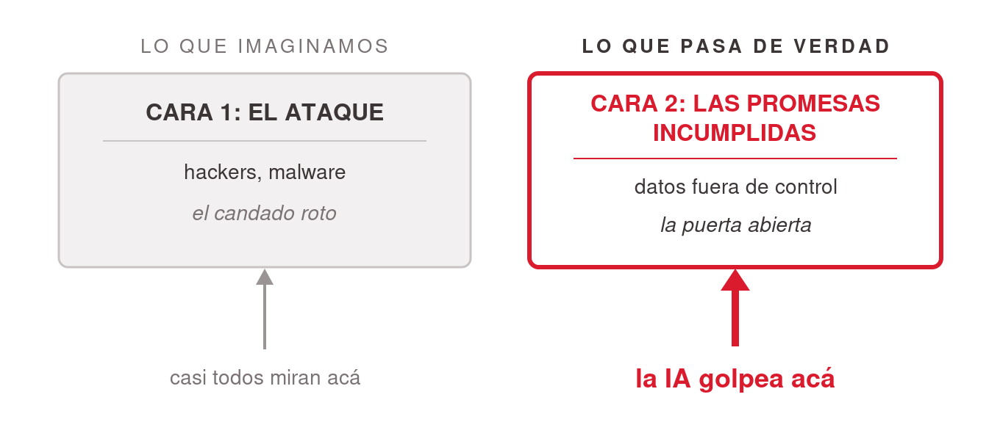

# Seguridad e IA para managers — la charla como plantilla

Plantilla pedagógica probada para enseñar seguridad y gobernanza de IA a una audiencia de negocios no técnica (2 horas: 110 min de contenido + 10 de pausa). El vocabulario conceptual que la sostiene vive en [`conceptos-fundamentales.md`](conceptos-fundamentales.md).

## La tesis: las dos caras de la seguridad

- **Cara 1** — protección frente a atacantes (hackers, malware — el candado roto).
- **Cara 2** — **cumplir lo que le prometiste a tus clientes** sobre el manejo de sus datos (compliance — la puerta abierta).
- *"Podés no tener ningún hacker y aun así fallar en seguridad."* **La IA golpea sobre todo la Cara 2 — y esa es la que casi nadie está mirando.**

Formulación completa de la tesis (del Talk de origen): *el mayor riesgo de la IA para un manager no es que lo ataquen, sino perder el control de los datos de su organización y romper lo que le prometió a sus clientes — y eso se previene gobernando qué herramienta se usa, no "teniendo cuidado".*

## El arco narrativo (validado contra el mercado)

Secuencia de la charla — caso ancla → vocabulario → mecánica → impacto → prácticas → consolidación → marco legal → contexto local → amenazas → cierre:

1. **Caso Samsung** — apertura por capas, teaser de números, tesis y mapa (~13 min) — ver [`../caso-samsung-chatgpt-2023/index.md`](../caso-samsung-chatgpt-2023/index.md).
2. **Fundamentos** — el vocabulario mínimo (~12 min).
3. **Detrás de escena** — qué pasa cuando uso una IA (~7 min).
4. **MCP y agentes** — de contestar a hacer (~6 min).
5. **Impacto y responsables** (~12 min + pausa) — ver [`../shadow-ai-e-impacto/index.md`](../shadow-ai-e-impacto/index.md).
6. **Shadow AI** (~8 min).
7. **Buenas prácticas** (~12 min).
8. **Rompemitos** (~10 min).
9. **Estándares y leyes** (~11 min) — ver [`../regulaciones-datos-e-ia/index.md`](../regulaciones-datos-e-ia/index.md).
10. **Argentina** (~5 min).
11. **La era de los agentes** (~10 min) — ver [`../amenazas-era-agentes/index.md`](../amenazas-era-agentes/index.md).
12. **Cierre** — la hoja de una página (~4 min) + 5 slides de backup para Q&A.

Técnicas estructurales que funcionaron y son reutilizables:

- **Teaser de números en la apertura** — mostrar las cifras *sin explicar el porqué*; la explicación es el resto de la charla. Los mismos números vuelven después ("¿se acuerdan de este número?") con el corte profundo.
- **Siembra y callback** — sembrar términos sin definirlos (las tres palabras tachadas de Samsung) y pagarlos después "con nombre y apellido" (artículos GDPR). Idem: analogía del mesero (API) que vuelve como "el mesero con llaves" (MCP); mínimo privilegio sembrado en MCP y pagado en prácticas y amenazas.
- **El mapa en 4 preguntas** — cerrar la apertura con estructura y agencia: cómo funciona / cómo se rompe / qué te obliga / qué hacer. *"Esto se puede manejar."*
- **Cerrar cada bloque de riesgo con agencia**, no con miedo.
- Ritmo: ~2–2,5 min por slide de contenido; divisores de segundos; la apertura por capas admite ~1,2 min/slide.

**Validaciones del benchmark (julio 2026)**: la duración de 2 h está alineada con formatos certificados equivalentes (Securiti ~2–2,5 h); la secuencia cubre los 4 dominios del IAPP AIGP a nivel introductorio; el rompemitos con votación es práctica pedagógica destacada; Samsung como caso ancla está recomendado por la literatura de training corporativo. Programas de referencia para comparar: Carnegie Mellon "Future of Secure AI", Johns Hopkins "AI for Senior Leaders", Wharton "AI Strategy and Governance", IAPP AIGP, Securiti AI Security & Governance.

## El rompemitos (dinámica + 6 mitos)

Dinámica: leer la afirmación → **la sala vota primero** (a mano alzada, sin excepciones — la pequeña incomodidad de equivocarse en público fija el aprendizaje) → revelar. ~90 s por mito. Cada mito refuerza con callback un concepto ya visto:

1. **"Todo lo que escribo entrena la IA"** → en parte cierto: **depende del plan** (consumo suele entrenar; enterprise, no).
2. **"Proveedor grande = seguro y compliant"** → falso: su seguridad no es tu cumplimiento; **vos seguís siendo responsable**.
3. **"On-prem siempre es más seguro"** → parcialmente cierto para *un* riesgo, engañoso en general: on-prem devuelve toda la carga (parches, accesos, hardening), un modelo descargado puede venir manipulado, y no protege de inyección ni de fugas por otra vía. **"Seguro" no es una propiedad del lugar — es una propiedad de la gobernanza.** Un SaaS gobernado puede ser más seguro que un on-prem descuidado.
4. **"Borrar los nombres alcanza"** → mayormente falso: si se puede **reidentificar**, sigue siendo Personal Data. Bonus: "borrar" en la interfaz del chat ≠ borrado en el proveedor.
5. **"Si cita fuentes, es correcto"** → falso: alucina y **fabrica citas** con total confianza. El tono seguro es estilo, no evidencia.
6. **"Tenemos Enterprise, estamos cubiertos"** → falso (el más desafiante — la sala suele votar "verdadero"): el tier correcto es condición **necesaria, no suficiente**; no gobierna el shadow AI en cuentas personales, ni los conectores mal permisionados, ni la verificación de salidas.

## Buenas prácticas — "qué hacer el lunes a la mañana"

Cinco hábitos, cero presupuesto: (1) clasificá antes de pegar (los 3 niveles — pregunta de 3 segundos); (2) mínimo privilegio para cada conector/agente; (3) higiene de cuenta y secretos (MFA/SSO, no compartir cuentas, **nunca** pegar contraseñas/claves/tokens — quedan en el historial); (4) verificá la salida (*"la IA redacta, los humanos deciden"* — verificar todo lo que tenga consecuencias); (5) reportá rápido cuando algo sale mal.

## La hoja de una página (6 reglas para llevar)

1. **Clasificá antes de pegar** — público / interno / confidencial.
2. **Usá herramientas autorizadas y con contrato** para todo lo que no sea público.
3. **Mínimo privilegio** para cada conector y agente.
4. **Vos sos responsable, no el proveedor** — "la IA lo hizo" no es una defensa.
5. **Verificá la salida de la IA** que tenga consecuencias.
6. **Reportá los incidentes rápido** — la velocidad es el control más barato que tenés.

## Frases de lámina (colección reutilizable)

- *"Una falla de seguridad no siempre tiene un atacante. A veces sos vos incumpliendo lo que prometiste."*
- *"El firewall no te protege de un dato que sale voluntariamente por la puerta de adelante."*
- *"El daño no fue que alguien lo usara. El daño fue que ya no podían controlarlo."*
- *"GDPR y HIPAA te dicen qué cumplir. SOC 2 es cómo un proveedor te prueba que puede ayudarte a cumplirlo."*
- *"Como responsable del tratamiento, no podés delegar el cumplimiento en el buen criterio del empleado. Si la herramienta no está gobernada, el incumplimiento ya ocurrió — aunque nada se filtre."*
- *"Las herramientas no causan filtraciones; los hábitos sí."*
- *"Antes de pegar, preguntá de qué nivel es este dato."*

## Temas identificados y no cubiertos (candidatos a futuras charlas)

Del reporte de gaps del benchmark, quedaron deliberadamente fuera de las 2 horas:

- **Sesgo algorítmico y decisiones automatizadas** — núcleo de cursos MBA de responsible AI; riesgo legal directo (GDPR Art. 22, EU AI Act alto riesgo). Candidato natural a **otra clase del ciclo** (~2–3 slides / 6 min si se integra).
- **Propiedad intelectual** (titularidad del output, IP propia/ajena) — los MBAs lo tratan como tema principal; esta charla lo dejó en backup.
- **Política de Uso Aceptable de IA (AUP)** — mencionada como "el artefacto más útil que un manager puede impulsar"; sin slide propio.

## References

- [`../../talks/seguridad-governance-ai/final.md`](../../talks/seguridad-governance-ai/final.md) — el deck completo (66 slides con speaker notes).
- [`../../talks/seguridad-governance-ai/research/corpus/security-ai-managers-agenda.md.md`](../../talks/seguridad-governance-ai/research/corpus/security-ai-managers-agenda.md.md) — agenda de 2 h, rompemitos original, hoja de una página, frases de lámina, mapa completo de concerns.
- [`../../talks/seguridad-governance-ai/research/corpus/presenter-outline-esquema-slides-2026-07-06.md.md`](../../talks/seguridad-governance-ai/research/corpus/presenter-outline-esquema-slides-2026-07-06.md.md) — outline del presenter con notas de diseño (un concepto por slide; historias y frases, no bullets densos).
- [`../../talks/seguridad-governance-ai/research/corpus/benchmark-programas-similares-2026-07-06.md.md`](../../talks/seguridad-governance-ai/research/corpus/benchmark-programas-similares-2026-07-06.md.md) — validaciones del enfoque y los 7 gaps contra el mercado 2026.
