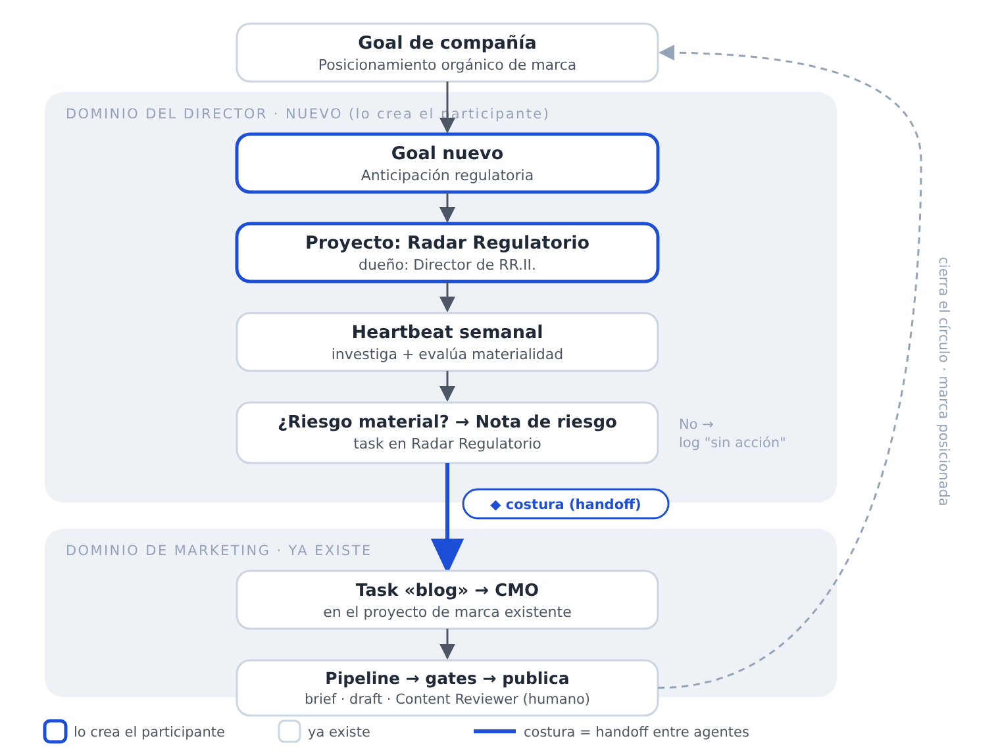
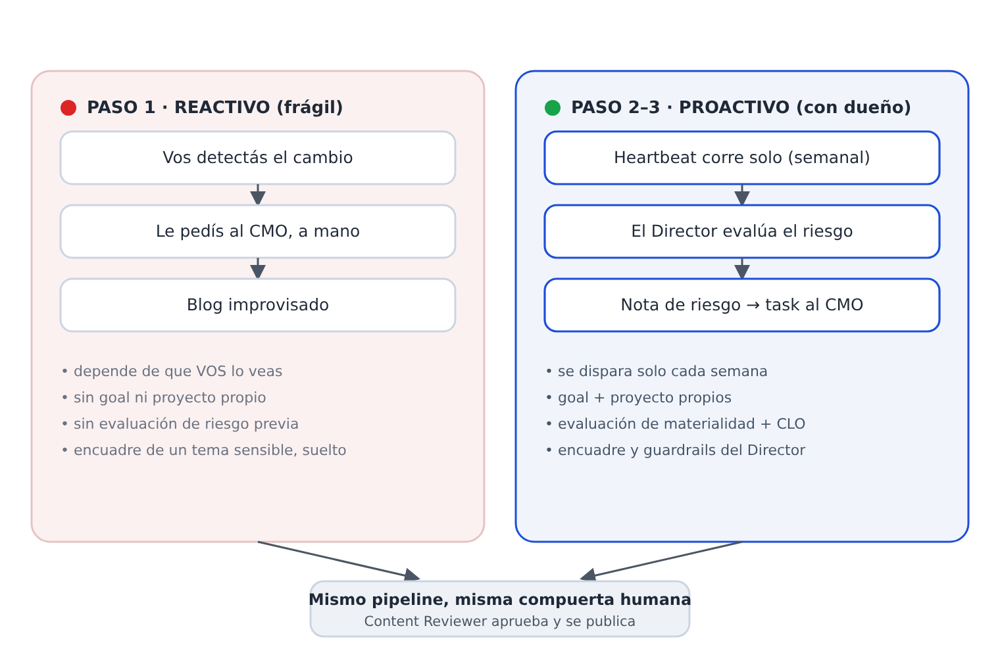

# 🏛️ Misión: "El vigía regulatorio de Atlas"

> **Tu desafío como CEO:** dirigís **Atlas**, una empresa de insumos de perforación para Vaca Muerta, y querés **escalar sin llenar la empresa de gente**. Ya automatizaste una parte en **Paperclip**: un equipo de agentes de IA que produce tu contenido de marca. Pero un cambio regulatorio se te coló por el costado y te costó caro. En vez de sumar personas, vas a **enseñarle a esa automatización a vigilar el riesgo por su cuenta**: sumás un agente nuevo. Tres pasos. Sin escribir una línea de código. **Empezamos.**

---

## 🎬 La situación

Sos **CEO de Atlas**, insumos de perforación para **Vaca Muerta**. Para crecer sin duplicar la nómina, automatizaste una parte de la empresa en **Paperclip**: un equipo de **agentes de IA** —marketing, contenido, legales— que publica contenido técnico y posiciona la marca, con vos como la firma final.

Funcionaba. Hasta que, el trimestre pasado, un cliente grande —ligado a YPF— te avisó: *"Desde el próximo trimestre solo contratamos proveedores que certifiquen su programa de integridad (Ley 27.401)."* Venía en una reforma que se discutía hacía semanas. **Nadie en Atlas la vio venir.**

Traducción: te enteraste tarde, **quedaste afuera de una preselección**, y cuando le pediste al **agente de marketing** un blog para reaccionar, salió sin revisión legal, **sonó a denuncia política y lo tuviste que bajar**. Dos golpes, una sola causa.

Hasta ahora, tu automatización en Paperclip **solo escribe lo que le pedís**: cada pedido es una **task** que marketing lleva por un pipeline, con tu visto bueno al final. Nadie —ni humano ni agente— **vigila el horizonte regulatorio**. Ese es el hueco. **A menos que…**

A menos que la escales. Vas a sumar un **Director de Relaciones Institucionales**: un agente que cada semana vigila el riesgo regulatorio y, cuando algo aparece, le pasa el trabajo —bien encuadrado— al agente de marketing. Lo configurás una vez. Después, vigila solo.

El verdadero premio no es el Director: **sos vos, dominando Paperclip** — orquestando agentes que hacen crecer a Atlas sin sumar cabezas.

> 🧩 **Estado inicial (facilitador):** la org automatizada es la de `atlas-org-setup.md`, **sin el Director de Relaciones Institucionales** (lo recrea el participante). Dejá abierto el **proyecto** *«Aumentar el reconocimiento de marca»*.

---

## 🎯 Lo que vamos a hacer

Escalar esa automatización: que la IA **también vigile el riesgo**, no solo escriba. En tres pasos:

1. **A mano:** le pedís al **agente de marketing (CMO)** que reaccione — y chocás con el límite (es cómo nació el blog que hubo que bajar).
2. **Automatizado:** sumás un **Director de Relaciones Institucionales** —un agente, con su **goal** y su **proyecto**— y un **heartbeat semanal** que detecta el riesgo y le pasa el trabajo al agente de marketing.
3. **Una corrida:** lo disparás una vez y ves el ciclo completo.

Todo sin código: creás y conectás piezas de Paperclip (agentes, goals, proyectos, tasks, heartbeats).

---

## 🎓 Qué enseña esta misión (conceptos de Paperclip)

| Concepto | Dónde aparece |
|---|---|
| **Delegar en un agente existente** | Paso 1: le pedís al agente de marketing un blog |
| **El pipeline con compuertas humanas** | El blog fluye CMO → Blog Content Manager → gates del Content Reviewer |
| **Crear un goal y ladderarlo al de compañía** | Paso 2: creás el goal «Anticipación regulatoria» |
| **Crear un proyecto como casa del agente** | Paso 2: creás el proyecto «Radar Regulatorio» |
| **Contratar un agente** (Board Direct Hire) | Paso 2: levantás al Director de Relaciones Institucionales |
| **Escribir las `capabilities` de un agente** | Paso 2: le escribís la rutina del heartbeat y las reglas de delegación |
| **Heartbeats** (corridas autónomas recurrentes) | Paso 2–3: el Director investiga cada semana |
| **Delegación entre agentes vía tasks** | Paso 3: el Director crea una task de blog asignada al CMO |
| **Observar una corrida autónoma** | Paso 3: un ciclo, de punta a punta |

---

## 🧵 Cómo se conecta la historia

Tres piezas enganchan todo — una **escalera de goals** y una **costura**:

1. **Escalera de goals (el porqué).** El goal nuevo del Director —*Anticipación regulatoria*— es un **sub-goal del goal de compañía** (posicionamiento de marca): los riesgos regulatorios son materia prima para el contenido. Sin esta escalera, el Director sería un agente suelto.
2. **El proyecto como casa (el dónde).** El goal vive en un **proyecto propio, «Radar Regulatorio»**: ahí corre el heartbeat y quedan las notas de riesgo. Es donde el Director *piensa y trabaja*.
3. **La task como costura (el cómo cruza).** Cuando hay riesgo material, el Director **crea una task de blog en el proyecto de marca existente, asignada al CMO**. Ese es el único punto donde los dos dominios se tocan.

**El pago:** el círculo se cierra. Un riesgo entra por el radar del Director → sale como blog publicado en el proyecto de marca → cumple el goal de compañía.

---

## 🪜 La misión, paso a paso

### Paso 1 — La forma manual (la línea de base reactiva)

Te enterás del cambio legislativo y hacés lo obvio: le **pedís al agente de marketing (CMO)** que escriba un blog sobre el tema.

**Hacé esto:**
1. En el proyecto **«Aumentar el reconocimiento de marca»**, creá una **task** de blog sobre el tema sensible y **asignásela al agente de marketing (CMO)** (ver *Ejemplo de trabajo* abajo).
2. Dejá que fluya por el pipeline normal: CMO → Blog Content Manager (concept brief → draft) → compuertas del **Content Reviewer** → publicación.

**Qué tenés que notar:** funciona, pero es *reactivo, frágil y encima riesgoso*. Pasó solo porque **vos** detectaste el cambio y lo pediste. Nadie vigila el horizonte de forma sistemática; el encuadre de un tema sensible quedó **improvisado por Marketing**, que no tiene la expertise regulatoria ni la conciencia del riesgo reputacional; y no hubo evaluación de riesgo ni chequeo legal antes de escribir. En un tema de **corrupción / transparencia**, improvisar así es peligroso — es, palabra por palabra, cómo nació el blog que hubo que bajar el trimestre pasado. **Esa es la limitación que arregla el Paso 2.**

> 🏁 **Éxito:** un blog sobre el tema legislativo llega al menos a la compuerta del concept brief, y podés explicar *por qué* hacerlo a mano no escala (y por qué es riesgoso).

*El Paso 1 funciona, pero depende de vos y no tiene dueño. El Paso 2 le pone un agente, un goal y un proyecto detrás.*

---

### Paso 2 — Crear al vigía: el Director de Relaciones Institucionales

En lugar de pedir blogs uno por uno, **contratás al agente cuyo trabajo es verlos venir** — y le das un **goal** y un **proyecto** propios para que la historia quede conectada (ver *Cómo se conecta la historia*).

**Hacé esto:**
1. **Creá el goal** del Director: *«Anticipación regulatoria»*, y ladderálo explícitamente al goal de compañía (los riesgos regulatorios son materia prima del contenido de marca).
2. **Creá el proyecto** *«Radar Regulatorio»*, propiedad del Director: es la casa del heartbeat y de las notas de riesgo.
3. **Contratá el agente** con la definición de rol existente (abajo). Como sos el **board**, es contratación directa (**Board Direct Hire**): no hace falta approval. Confirmá que reporta al **CEO**, junto al CMO y el CLO.
4. **Escribí sus `capabilities` / instrucciones** con la rutina del heartbeat y las reglas de delegación (abajo) — el detalle nuevo de "qué tiene que hacer".

#### 2a. Definición de rol base (la existente — pegar tal cual)

> **Director de Relaciones Institucionales** — Asuntos gubernamentales en el sector de petróleo y gas de Argentina: monitoreo regulatorio, vínculo con actores clave (stakeholders) y posicionamiento institucional ante organismos de gobierno y cámaras del sector.

#### 2b. Sus instrucciones / `capabilities` (el detalle nuevo)

> **Heartbeat semanal — Barrido de riesgo regulatorio.** Cada semana, de forma automática:
> 1. **Investigá** los desarrollos regulatorios y legislativos —vigentes y en trámite— relevantes para el negocio de Atlas: actividad de perforación en Vaca Muerta, régimen de hidrocarburos y RIGI, normativa provincial (Neuquén / Río Negro), regulación ambiental / de emisiones, estándares de certificación técnica (IRAM / API / ISO) e **integridad y transparencia en la cadena de suministro**.
> 2. **Evaluá la materialidad** de cada uno: ¿un cambio propuesto o sancionado **impacta los intereses comerciales de Atlas o la actividad de perforación de sus clientes** —como riesgo *o* como oportunidad—? Asignale un nivel (bajo / medio / alto) con una línea de justificación.
> 3. **Si hay algo material:** creá una **task «nota de riesgo»** en el proyecto *Radar Regulatorio* y **proponé un blog** creando una **task en el proyecto «Aumentar el reconocimiento de marca», asignada al CMO**, con un brief acotado (plantilla abajo). En temas de **alta sensibilidad** (corrupción/transparencia), la revisión del **CLO es obligatoria** antes de que el blog avance; en baja/media, opcional.
> 4. **Si no hay nada material esta semana:** dejá una **task visible de "sin acción"** y cerrá la corrida.
>
> **Barreras (guardrails):** el contenido es *técnico y factual*, nunca militancia partidaria ni lobby, y **no acusa a personas ni empresas puntuales**; posiciona a Atlas como autoridad técnica y de cumplimiento (consistente con el objetivo SEO de marca); el **Content Reviewer** humano sigue siendo la compuerta final; el Director **propone y arma el brief**, no escribe ni publica el blog.

#### 2c. Plantilla de brief del blog (lo que el Director pone en la descripción de la task)

- **Título tentativo**
- **Por qué ahora** — el cambio regulatorio y su estado
- **Impacto en Atlas** — interés comercial / clientes / ángulo Vaca Muerta
- **Ángulo editorial recomendado** — técnico, no partidario
- **Puntos clave a cubrir**
- **Audiencia objetivo** — ingenieros de perforación, compras, operadores
- **Sensibilidad / urgencia** — y si requiere revisión del CLO

> 🏁 **Éxito:** existen el **goal** «Anticipación regulatoria» (colgado del goal de compañía) y el **proyecto** «Radar Regulatorio»; el Director está en el organigrama (Board Direct Hire) y reporta al CEO; y sus `capabilities` incluyen el heartbeat semanal, el test de materialidad y la regla de "crear una task para el CMO en el proyecto de marca".

---

### Paso 3 — Correr un ciclo y verlo funcionar

Disparás una única corrida del heartbeat y seguís la cadena.

**Hacé esto:**
1. Dispará una corrida del heartbeat del Director a mano (**Run heartbeat now** / on-demand).
2. Miralo: **investiga → encuentra el riesgo legislativo → crea la task «nota de riesgo» en Radar → crea la task de blog en el proyecto de marca, asignada al CMO.**
3. Dejá que el CMO la tome y arranque el pipeline normal (concept brief → draft → compuertas del Content Reviewer).

> 🏁 **Éxito:** un solo heartbeat produjo (a) una task «nota de riesgo» y (b) una **task de blog en el proyecto de marca, a cargo del CMO**, y el blog entró al pipeline — **sin ningún pedido manual de tu parte.** El flujo reactivo del Paso 1 ahora es proactivo y lo posee el agente correcto.

---

## 📄 Ejemplo de trabajo (el tema legislativo)

*Podés cambiarlo por el tema que prefieras.*

> **Proyecto de reforma de integridad y transparencia en la cadena de suministro de hidrocarburos.** Exigiría a los proveedores que contratan con operadores ligados al Estado (como YPF) declarar **beneficiarios finales**, adoptar **programas de integridad** (en línea con la Ley 27.401 de responsabilidad penal empresaria) y certificar cumplimiento para poder facturar en Vaca Muerta. Es **sensible**: toca corrupción y transparencia, un terreno políticamente cargado. Y es **directamente material** para Atlas: sus programas de compliance y su trazabilidad se vuelven una ventaja de acceso, pero el tema debe tratarse como una historia de **estándares e integridad** —qué necesita saber un proveedor, cómo cumple Atlas— y **nunca** como una denuncia ni una toma de posición política. Exactamente el tipo de encuadre que corresponde a Relaciones Institucionales, no a una improvisación de Marketing.

**Temas alternativos** por si preferís:
- Un cambio al **RIGI** (régimen de incentivo a grandes inversiones) que afecte el capex y la demanda de perforación en Vaca Muerta.
- Nueva regulación de **metano / venteo y quema** que suba las exigencias de cumplimiento a los operadores.
- Reforma de **certificación técnica obligatoria** (IRAM / API / ISO) para insumos de perforación.

---

## 🪞 Reflexión final (para el participante)

Cerrá la misión respondiendo estas tres preguntas — son el verdadero aprendizaje:

1. **De reactivo a proactivo.** ¿Qué tarea de tu trabajo real hoy es *reactiva* —depende de que alguien la detecte y la pida— y podría convertirse en un agente con *heartbeat* que la vigile solo? ¿Qué tendría que investigar en cada corrida?
2. **El rol que falta.** En tu organización, ¿qué expertise termina hoy "improvisada" por el equipo equivocado —como Marketing encuadrando un tema regulatorio sin conciencia del riesgo—? ¿Qué agente (o persona) debería ser dueño de eso, y qué barreras le pondrías?
3. **Delegación con compuertas.** Ver a un agente delegar en otro (Director → CMO) sin que intervengas, ¿qué te sugiere para tu trabajo? ¿Dónde una cadena así de traspasos automáticos te ahorraría tiempo — y dónde querrías mantener, sí o sí, una **compuerta humana** antes de publicar o ejecutar?

---

## 🧭 Decisiones tomadas

- **Cadencia:** heartbeat **semanal**; una semana sin riesgo material igual deja una **task de "sin acción"** visible (para ver el caso negativo).
- **CLO:** en temas de **alta sensibilidad** (corrupción/transparencia), la revisión del **CLO es obligatoria** antes de pasar el blog al CMO; en baja/media, opcional.
- **Handoff:** el Director **asigna la task directo al CMO** (asignación entre pares, permitida por la doc).

El detalle de implementación en Paperclip está en `mission-res.md` (verificado contra la documentación oficial). **La misión está lista para correr.**
