<!--
Style decisions (persisted in draft):
- Las láminas que definen una pieza de Cowork pueden usar una imagen en aside a la izquierda o derecha + ítems, para que la visual acompañe sin competir con el contenido.
- Las comparaciones usan una tabla con una primera columna de rótulos, para alinear criterios y conceptos.
- Los diagramas se entregan como SVG y se usan como SVG en HTML.
- Las láminas de Demo son solamente "Demo", excepto “Memoria en la interfaz”, que usa la demostración completa `memory-demo.gif`.
- Los videos en láminas `image-full` se muestran contenidos, con márgenes blanco laterales e inferior; nunca recortan ni desbordan el marco.
-->

# Thesis

**Claim:** Cowork funciona como un entorno de trabajo cuando el equipo ubica cada pieza de contexto en su lugar, conserva en Artifacts los resultados que va a consultar de nuevo, evalúa las extensiones que instala y delega la construcción de software con plan y revisión.

**Why it matters:** Los alumnos salen con cuatro criterios de decisión aplicables a su trabajo: dónde guardar cada pieza de contexto, qué tipo de Artifact crear, cuándo instalar un plugin y qué construcción encargar a Claude Code.

**Presenter feedback:**

- [closed] 2026-08-03 — "Los slides realmente estan bastante pobres en contenido y visuales. Esforzate mas."
  Resolution: Pasada de enriquecimiento deck-wide: ejemplos concretos y tablas comparativas en 2.1/2.4/2.5/2.6/2.7/2.8/3.1/3.2/3.3/3.6/4.3/4.4/4.5/4.6/5.2/5.5, ASCII nuevo de autenticación en 3.7, asides generate-image nuevos en 5.1 y Conclusiones 2, cifras con fuente corta visible (11 plugins - Anthropic 2026; +100 - claude.com/plugins 2026) y notas de orador ampliadas con preguntas a la sala y transiciones.

---

# Agenda

**Narrative arc:** El quiz inicial recupera las distinciones de las clases anteriores. Sobre esa base, la clase organiza el contexto que Cowork necesita para trabajar, muestra cómo conservar resultados en Artifacts, amplía capacidades con plugins y cierra con una introducción a Claude Code.

**Sections (in delivery order):**

- 1. Quiz
- 2. Conocimiento Persistente
- 3. Artifacts
- 4. Plugins
- 5. Claude Code

**Presenter feedback:**

- [closed] 2026-08-03 — "En cada una de las secciones agrega un slide demo."
  Resolution: Se agregaron demos al cierre de Quiz, Conocimiento Persistente, Artifacts y Plugins. Claude Code ya incluía la demo del tracker mínimo.

---

# 1. Quiz

**Goal of this section:** Recuperar cinco distinciones de las clases anteriores y detectar cuáles necesitan repaso antes de avanzar.

**Presenter feedback:**

---

## 1. Cómo responder el quiz

### Content

1. Elegir una opción por pregunta, sin discutirla.
2. Anotar el motivo de la elección.
3. Comparar respuestas en parejas antes de la puesta en común.

### Sources

- corpus/chat-export-2026-08-03.zip.md

### Speaker notes

Dar un minuto por pregunta. El bloque completo toma unos quince minutos: cinco preguntas más la puesta en común. Pedir una elección individual antes de conversar en parejas. El objetivo consiste en recuperar las distinciones que sostienen el resto de la clase. No puntuar el resultado. Escuchar las razones detrás de cada opción, porque una respuesta correcta por intuición puede esconder una confusión conceptual. Revelar la respuesta desde las notas luego de escuchar dos argumentos del grupo.

### Presenter feedback

---

## 2. Quiz 1 - Delegar

<!-- layout: image-left -->

### Content

**¿Qué cambia al pasar de chatear con IA a delegar a un agente?**

- **A.** El agente accede a más contexto, pero la persona sigue indicando y ejecutando cada paso.
- **B.** La persona define el resultado; el agente organiza y ejecuta el trabajo bajo revisión.
- **C.** El agente define el objetivo y los criterios de éxito después de leer los archivos.

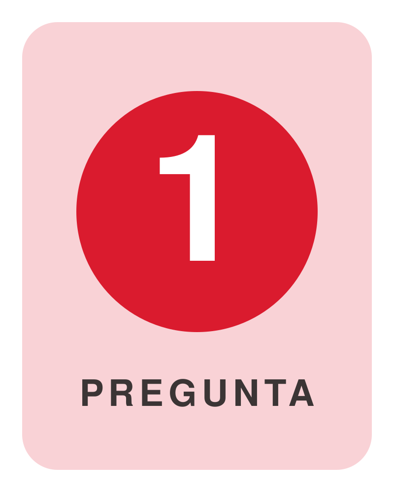

### Sources

- corpus/chat-export-2026-08-03.zip.md

### Speaker notes

Respuesta correcta: B. La persona define el resultado y conserva el criterio. El agente organiza pasos, usa herramientas y ejecuta el trabajo. La opción A mantiene a la persona en la ejecución paso por paso. La opción C entrega al agente una decisión que corresponde a quien delega: fijar el objetivo y el criterio de éxito.

### Presenter feedback

---

## 3. Quiz 2 - Archivos .md

<!-- layout: image-left -->

### Content

**¿Por qué conviene usar archivos `.md` para conocimiento e instrucciones?**

- **A.** Tienen prioridad automática sobre Memory e Instructions cuando existe una contradicción.
- **B.** Cowork los actualiza después de cada tarea para conservar lo aprendido.
- **C.** Guardan texto estructurado que personas y agentes pueden revisar y reutilizar.

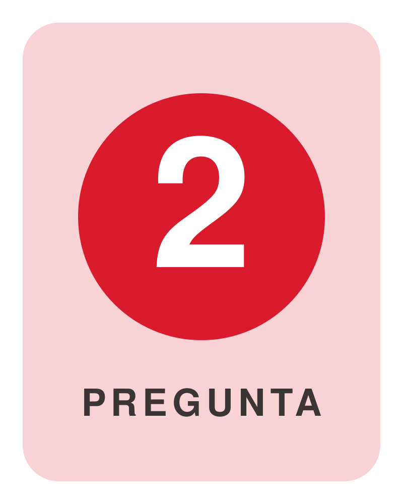

### Sources

- corpus/chat-export-2026-08-03.zip.md

### Speaker notes

Respuesta correcta: C. Markdown conserva texto, títulos, listas y tablas en un formato portable. Cowork puede leerlo dentro de la carpeta del trabajo. Una persona también puede editarlo y versionarlo. El formato no recibe prioridad automática sobre otras fuentes y Cowork no lo actualiza sin una instrucción.

### Presenter feedback

---

## 4. Quiz 3 - Connectors

<!-- layout: image-left -->

### Content

**¿Qué diferencia mejor una búsqueda web de un Connector?**

- **A.** La web consulta información actual; un Connector accede a un sistema y puede ejecutar acciones autorizadas.
- **B.** Ambos consultan fuentes públicas; el Connector sólo conserva una copia dentro del Project.
- **C.** Un Connector sólo puede leer; la búsqueda web puede ejecutar acciones después de iniciar sesión.

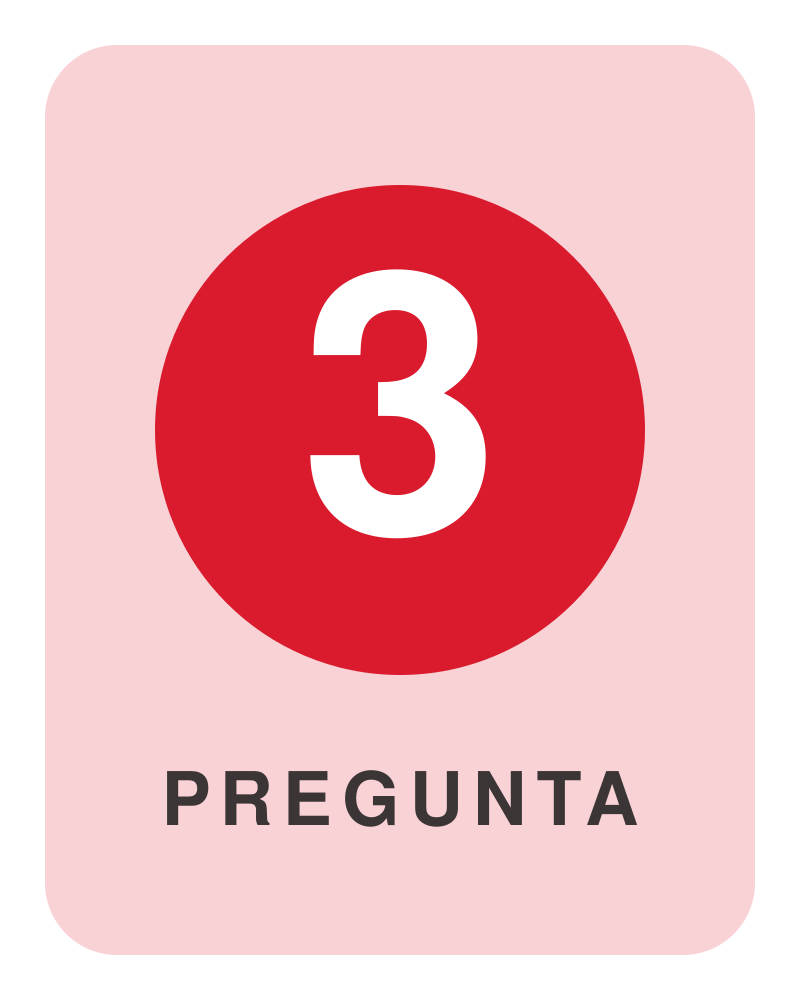

### Sources

- corpus/chat-export-2026-08-03.zip.md

### Speaker notes

Respuesta correcta: A. La búsqueda web trae páginas públicas y fuentes actuales. Un Connector vincula Claude con un sistema concreto, por ejemplo Drive, Slack o un calendario. Según el permiso concedido, puede leer datos o ejecutar acciones. La posibilidad de actuar depende del Connector y de sus permisos.

### Presenter feedback

---

## 5. Quiz 4 - Espacio de trabajo

<!-- layout: image-left -->

### Content

**¿Sobre qué trabaja Cowork cuando recibe una tarea?**

- **A.** Sobre el historial del Project y cualquier chat anterior de la cuenta, aunque no se haya vinculado.
- **B.** Sobre los recursos disponibles para la organización, aunque la tarea no los incluya.
- **C.** Sobre el contexto del Project y los recursos que la persona incorpora o autoriza.

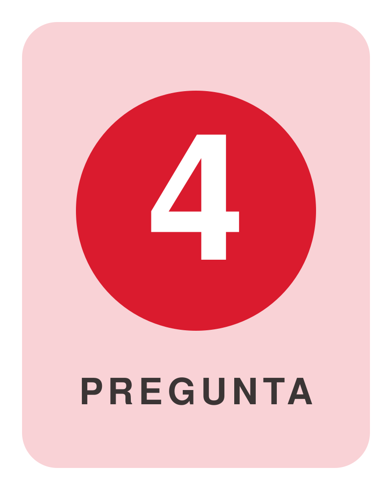

### Sources

- corpus/chat-export-2026-08-03.zip.md

### Speaker notes

Respuesta correcta: C. Cowork usa el contexto del Project y los accesos que la persona autoriza. Los archivos, las Instructions y los Connectors delimitan el trabajo. Cowork no incorpora cada chat de la cuenta ni todos los recursos de la organización en forma automática.

### Presenter feedback

---

## 6. Quiz 5 - Skills

<!-- layout: text-left -->

### Content

**¿Cuándo conviene crear una Skill?**

- **A.** Cuando una tarea necesita acceder a un servicio externo mediante autenticación.
- **B.** Cuando una tarea se repite y requiere el mismo proceso, criterio y formato.
- **C.** Cuando una regla debe aplicarse a cada tarea dentro de un Project.

### Sources

- corpus/chat-export-2026-08-03.zip.md

### Speaker notes

Respuesta correcta: B. Una Skill conserva instrucciones reutilizables para un trabajo definido. El acceso a un servicio corresponde a un Connector. Una regla que debe regir cada tarea del Project corresponde a las Instructions. La Skill resulta útil cuando el equipo quiere repetir un proceso reconocible. Cerrar la sección con la transición: si una tarea se repite, la pregunta siguiente es dónde guardar todo lo que Claude necesita saber para hacerla bien.

### Presenter feedback

---

# 2. Conocimiento Persistente

**Goal of this section:** Distinguir Memoria vs Instructions vs Files: mostrar que archivos, Instructions, Memory y Project cumplen funciones distintas y que el equipo decide dónde vive cada pieza de contexto.

**Presenter feedback:**

- [closed] 2026-08-03 — "Borrar"
  Resolution: Lámina 'El Project delimita' movida a Cut material; el alcance del Project queda cubierto en 2.2 y 2.7.
- [closed] 2026-08-03 — "La presentacion no tiene que hablar en absoluto del caso Faro."
  Resolution: Caso Faro eliminado por completo: lámina propia a Cut material y menciones reescritas en genérico (notas de 2.2 y brief de Claude Code 5.3).

---

## 1. Dónde queda el contexto

### Content

**Una regla acordada dentro de un chat puede quedar enterrada en el historial.**

- **Repetición** - volver a explicar lo ya acordado en cada tarea nueva.
- **Inconsistencia** - cada entrega sale con un formato distinto.
- **Búsqueda** - revolver el historial para encontrar la regla original.

<!-- aside: right  -->
<!-- generate-source: conocimiento disperso en fragmentos que cuesta volver a reunir -->

### Sources

- corpus/chat-export-2026-08-03.zip.md

### Speaker notes

Abrir con un caso concreto. El equipo acordó hace dos semanas que cada informe debe incluir fuentes y fecha. Nadie trasladó la regla a las Instructions. La próxima tarea produce un informe distinto y alguien debe buscar la conversación anterior. El costo aparece como repetición, inconsistencia y tiempo de revisión. Una regla puede estar en un mail, una decisión en una reunión y una plantilla en la carpeta de alguien. El contexto útil necesita una ubicación que corresponda a su función.

### Presenter feedback

---

## 2. La arquitectura del contexto

### Content

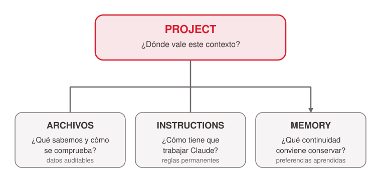
<!-- ascii-source:
                          PROJECT
                 ¿dónde vale este contexto?
                             |
       +---------------------+---------------------+
       |                     |                     |
    ARCHIVOS            INSTRUCTIONS             MEMORY
 ¿qué sabemos y        ¿cómo tiene que       ¿qué continuidad
 cómo se comprueba?    trabajar Claude?     conviene conservar?
-->
<!-- ascii-note:
intent: mostrar al Project como límite de tres componentes, cada uno con su pregunta práctica
emphasize: la pregunta bajo cada rama; las tres ramas al mismo nivel, bajo el Project
labels: Project, archivos, Instructions, Memory, una pregunta por rama
-->

### Sources

- corpus/chat-export-2026-08-03.zip.md

### Speaker notes

Esta es la lámina ancla de la sección. El Project delimita un espacio de trabajo: es el contenedor que define dónde vale el contexto, y conviene desarmar el error frecuente de tratarlo como un tercer tipo de memoria. Recorrer cada rama con su pregunta y un ejemplo: archivos, `competidores.md` con precios, fuentes y fechas; Instructions, "escribir en español y citar fuente y fecha"; Memory, "el equipo prefiere tablas ejecutivas". Ejemplo del límite: el contexto del análisis comercial queda separado del de Finanzas. El error habitual consiste en usar Memory como reemplazo de las demás piezas. Los datos que alguien debe poder auditar van a un archivo. Las reglas que no se negocian van a Instructions. La memoria sirve para continuidad y preferencias.

### Presenter feedback

---

## 3. Archivos: la fuente de verdad

### Content

- **Datos y fuentes** - cifras, políticas y referencias con fecha y origen.
- **Decisiones aprobadas** - criterios que otra persona debe poder auditar.
- **Plantillas** - estructuras que el equipo edita y versiona.

<!-- aside: right 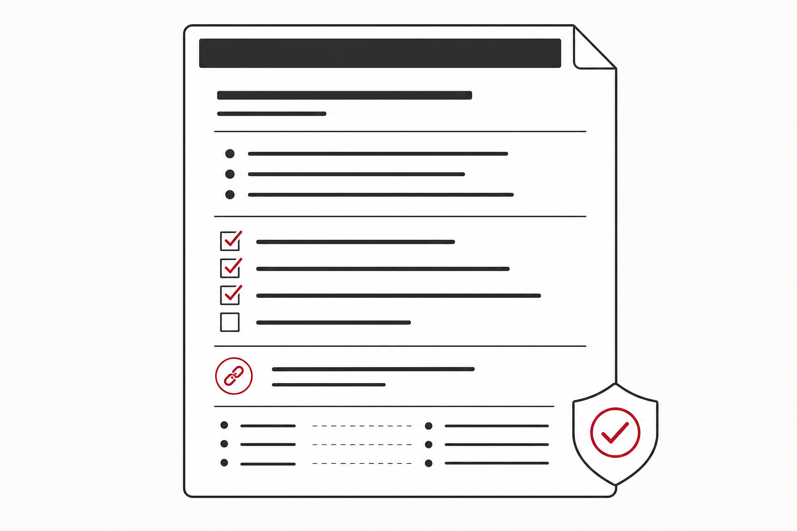 -->

### Sources

- corpus/chat-export-2026-08-03.zip.md

### Speaker notes

Conectar con el caso de apertura: la regla de "fuentes y fecha en cada informe" deja de depender del historial cuando alguien la escribe en un archivo del Project. Retomar lo visto en la clase anterior y en el quiz: Markdown guarda texto estructurado que personas y agentes leen por igual, con títulos, listas y tablas; cualquier editor lo abre y se puede versionar. Recorrer la estructura sugerida como plantilla de partida: fuentes aprobadas primero, datos siempre con fecha y origen, decisiones vigentes separadas de pendientes. Un archivo así permite ver fuente, fecha y autor de cada decisión. Otros formatos siguen valiendo cuando el contenido lo exige, por ejemplo una planilla para datos tabulares. Si una omisión genera riesgo, conflicto o trabajo repetido, ese contenido pertenece a un archivo.

### Presenter feedback

- [closed] 2026-08-03 — "connectando con la introduccion. Volver sobre achivos MD y sugerencia de estrucrura."
  Resolution: Lámina 2.3 conectada al caso de apertura (la regla de fuentes y fecha pasa al archivo), con retorno a los .md de la clase anterior y una estructura sugerida de ejemplo en la lámina.

---

## 4. Instructions: el contrato de trabajo

### Content

**Una Instruction convierte un acuerdo de trabajo en una regla observable que Claude recibe en cada tarea del Project.**

- **Formato** - cómo debe presentarse el resultado: "informes en español, con resumen ejecutivo al inicio".
- **Criterio** - qué condición debe poder verificarse: "toda cifra lleva fuente y fecha".
- **Límites** - qué no está permitido: "no usar datos de clientes ni información bajo NDA".

<!-- aside: right  -->

### Sources

- corpus/chat-export-2026-08-03.zip.md

### Speaker notes

Las Instructions definen cómo trabaja Claude dentro del Project; los tres bloques de la lámina salen de reglas típicas de un equipo comercial. Una regla estable debe quedar escrita allí para que cada tarea la reciba. Recorrer el flujo mental: primero el formato que se espera, después el criterio que permite verificarlo y, por último, los límites que no se deben cruzar. Una regla como "toda cifra lleva fuente y fecha" permite revisar el resultado; "hacer un análisis excelente" no define nada verificable. Ejercicio de un minuto: pedir a la sala una regla de su propio equipo y ubicarla en uno de los tres bloques. Cierre: las Instructions no guardan la evidencia; fijan las reglas sobre cómo usarla.

### Presenter feedback

---

## 5. Memoria: continuidad entre tareas

### Content

**Memory es el contexto útil que Claude aprende de las tareas de un mismo Project y recupera en tareas futuras.**

- **Alcance** - queda dentro de ese Project; no se transfiere a otros.
- **De dónde sale** - de lo conversado y corregido en trabajos anteriores.
- **Qué no es** - ni el historial completo del chat ni un archivo auditable.

<!-- aside: right 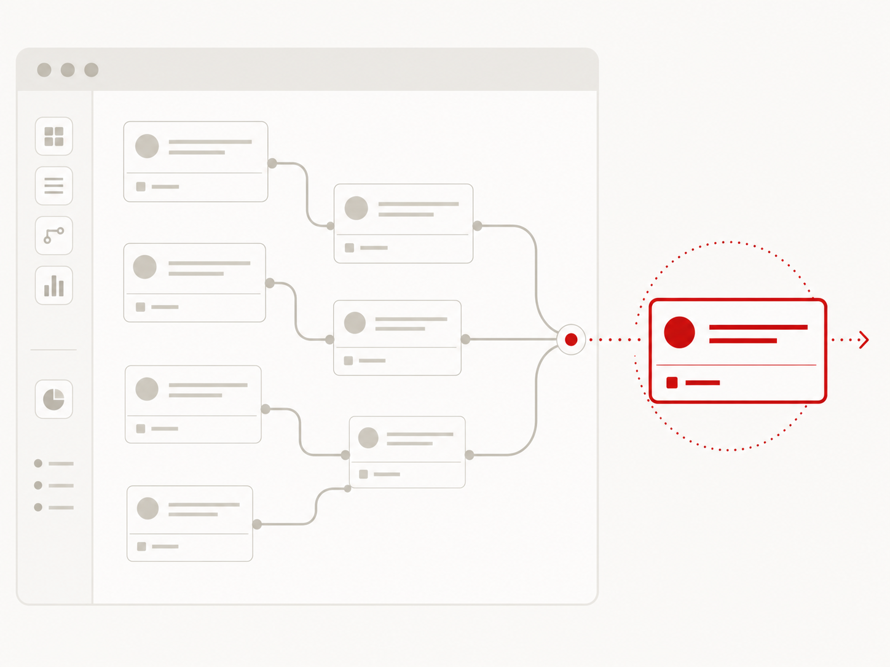 -->

### Sources

- corpus/chat-export-2026-08-03.zip.md

### Speaker notes

Introducir el concepto antes de usarlo. Memory permite que una tarea nueva arranque con lo aprendido en trabajos anteriores del mismo Project, sin repetir explicaciones. Distinguirla del historial: el historial conserva la conversación completa; Memory condensa y recupera el contexto útil. Distinguirla también del archivo: lo recordado no tiene fuente, fecha ni autor visibles, así que no sirve como evidencia. La documentación vigente indica que esa memoria queda acotada a su Project.

### Presenter feedback

- [closed] 2026-08-03 — "Agregar un par de slides sobre que es la memoria, como se usa, como se admistra. Nunca se introduce."
  Resolution: Memory ampliada a tres láminas: 2.5 'Qué es Memory' (introduce el concepto), 2.6 'Cómo se usa' y 2.7 'Cómo se administra'.

---

## 6. Cómo se usa Memory

### Content

- **Preferencias** - "el equipo prefiere tablas ejecutivas y trabaja en dólares".
- **Contexto reciente** - "la revisión de julio quedó inconclusa por falta de datos de Brasil".
- **Continuidad** - la tarea nueva retoma esos puntos sin que nadie los repita.

### Sources

- corpus/chat-export-2026-08-03.zip.md

### Speaker notes

Mostrar el uso con ejemplos chicos: el equipo prefiere tablas ejecutivas; la revisión de julio quedó inconclusa por falta de datos; los informes van en dólares. En la tarea siguiente, esas piezas reaparecen sin pedirlas. Marcar el límite en el mismo movimiento: una política comercial, una cifra aprobada o una regla obligatoria necesitan un archivo o una Instruction. El equipo debe poder revisar esas piezas sin depender de lo que Claude recuerde. Demo corta posible: pedir una tarea, corregir una preferencia, abrir una tarea nueva del mismo Project y comprobar qué contexto reaparece.

### Presenter feedback

---

## 7. Cómo se administra Memory

### Content

<!-- template: process -->

1. **Aprender dentro del Project** - Claude incorpora contexto de las tareas de ese Project y puede usarlo en tareas futuras.
2. **Corregir por prompt** - "Recordá que el informe usa una tabla ejecutiva" agrega o corrige una preferencia.
3. **Revisar y limpiar** - en Settings > Memory se ve lo recordado; el usuario puede editarlo, borrarlo, pausarlo o reiniciarlo.
4. **Promover lo estable** - una regla obligatoria pasa a Instructions o a un archivo; contraseñas y datos sensibles quedan fuera de Memory.

### Sources

- corpus/chat-export-2026-08-03.zip.md
- corpus/memory-projects-cowork.web.md
- corpus/claude-chat-memory.web.md

### Speaker notes

Memory no depende sólo de que alguien escriba "recordá". En un Project de Cowork, Claude puede aprender contexto de las tareas realizadas y usarlo en tareas posteriores del mismo Project. El prompt sirve para incorporar o corregir una preferencia de forma deliberada. Mostrar el ejemplo de la lámina y remarcar que la interfaz puede variar según plan y versión: la documentación de Claude ofrece Settings > Memory para ver, editar y borrar entradas, además de pausar o reiniciar la función. El control es la parte importante: revisar lo recordado, quitar lo que ya no aplica y mover una regla permanente a Instructions o a un archivo. Memory no guarda contraseñas, información financiera ni datos de salud; tampoco debe usarse como repositorio de información sensible. La próxima lámina ordena el destino de una regla o un dato.

### Presenter feedback

- [closed] 2026-08-03 — "Cómo se administra Memory mas descripcion si es algo que le digo en el prompt, lo si lo hace automatico, etc."
  Resolution: Lámina 2.7 reescrita como proceso de cuatro pasos: aprendizaje dentro del Project, corrección por prompt, revisión y limpieza, y promoción de reglas estables a Instructions o archivos. Se añadieron dos fuentes oficiales sobre Memory y Projects de Cowork.

---

## 8. Memoria en la interfaz

### Content

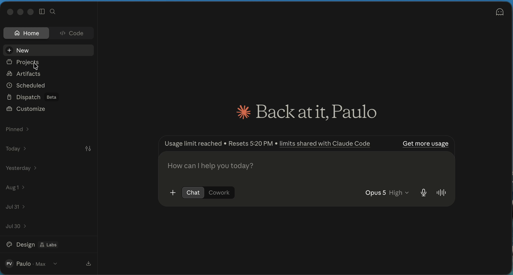

---

## 9. Datos, procedimiento o continuidad

### Content

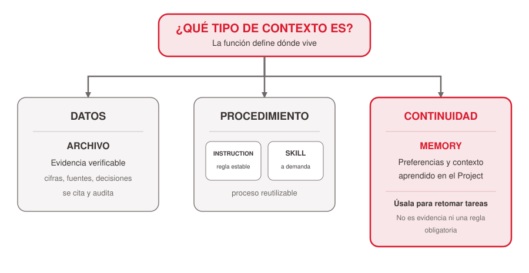
<!-- ascii-source:
                 ¿QUÉ TIPO DE CONTEXTO ES?
                              |
          +-------------------+-------------------+
          |                   |                   |
        DATOS            PROCEDIMIENTO       CONTINUIDAD
          |                   |                   |
      ARCHIVO       INSTRUCTION / SKILL          MEMORY
      evidencia      regla estable o          preferencias y
      verificable    proceso invocable        contexto aprendido
                                              dentro del Project
                                                      |
                                           úsala para retomar
                                           una tarea; no para
                                           evidencia ni reglas
                                           obligatorias
-->
<!-- ascii-note:
intent: completar el criterio para ubicar conocimiento, distinguiendo dato, procedimiento y continuidad entre tareas
emphasize: Memory como continuidad dentro del mismo Project; no reemplaza archivos ni Instructions
labels: datos, procedimiento, continuidad, archivo, Instruction, Skill, Memory
-->

### Sources

- corpus/chat-export-2026-08-03.zip.md
- corpus/memory-projects-cowork.web.md
- corpus/claude-chat-memory.web.md

### Speaker notes

La primera pregunta ante una pieza de contexto es qué función cumple. Un dato que debe poder citarse, comprobarse o auditarse va a un archivo. Un procedimiento estable tiene dos destinos: Instruction si debe regir cada tarea sin invocación, o Skill si es un proceso reutilizable que se llama a demanda. Memory cumple una tercera función: continuidad. Usarla cuando una preferencia o contexto aprendido ayuda a retomar una tarea futura dentro del mismo Project, por ejemplo el formato habitual de un informe o una revisión que quedó pendiente. No usarla como fuente de verdad, para cifras aprobadas ni para reglas obligatorias; esas piezas deben quedar explícitas en archivos o Instructions. Tampoco es lugar para información sensible.

### Presenter feedback

- [closed] 2026-08-03 — "En el diagrama de Datos o procedimiento falta la memoria listada. Y definir cuándo se usa."
  Resolution: La lámina incorpora Memory como tercera rama (continuidad) y define su uso: preferencias y contexto aprendido para retomar tareas dentro del mismo Project, nunca como evidencia ni regla obligatoria.

---

## 10. Comparar: archivos, Instructions, Skills y Memory

### Content

| | **Archivos** | **Instructions** | **Skills** | **Memory** |
|---|---|---|---|---|
| **Para qué sirve** | Guardar evidencia y datos | Fijar una regla estable | Ejecutar un proceso reutilizable | Dar continuidad al trabajo |
| **Úsalo cuando** | Hay que citar, revisar o auditar | Debe aplicarse en cada tarea | El equipo invoca pasos repetibles | Una tarea futura necesita contexto aprendido |
| **No lo uses para** | Definir cómo debe trabajar Claude | Guardar datos o fuentes | Una regla simple siempre activa | Evidencia, reglas obligatorias o datos sensibles |

### Sources

- corpus/chat-export-2026-08-03.zip.md
- corpus/memory-projects-cowork.web.md
- corpus/claude-chat-memory.web.md

### Speaker notes

Usar esta tabla como regla rápida de decisión. Archivos son la fuente de verdad: sirven para evidencia, datos y material que alguien debe poder citar o auditar. Instructions fijan reglas estables que Claude debe recibir en cada tarea. Skills encapsulan procedimientos con pasos reutilizables que el equipo invoca cuando los necesita. Memory aporta continuidad: preferencias y contexto aprendido que ayudan a empezar la próxima tarea del mismo Project. La distinción importante es que Memory no sustituye a ninguno de los otros tres; si una pieza debe ser verificable o obligatoria, debe vivir explícitamente en un archivo o una Instruction.

### Presenter feedback

- [closed] 2026-08-03 — "Al final crea una tabla comparativa de los cuatro conceptos: Skills, archivos, Memory e Instructions."
  Resolution: Nueva lámina de síntesis con propósito, momento de uso y límites de Archivos, Instructions, Skills y Memory.

---

---

# 3. Artifacts

**Goal of this section:** Distinguir un Chat Artifact de un Cowork Artifact y evaluar datos, persistencia, compartición y permisos antes de crear uno.

**Presenter feedback:**

- [closed] 2026-08-03 — "borrar este slide."
  Resolution: Lámina 'Tracker de competidores' (tabla Atlas/Boreal/Cima) movida a Cut material.
- [closed] 2026-08-03 — "Borrar, voy a mostrar ralmente un ejemplo."
  Resolution: Lámina 'Demo de Cowork Artifact' movida a Cut material; el cierre de 3.1 anuncia el ejemplo real en vivo y Open questions registra su preparación (reemplaza la duda 'en vivo o preparado').

---

## 1. Qué es un Artifact

### Content

**Un Artifact es una pieza de trabajo que Claude crea y que se abre fuera de la respuesta del chat para volver a usarla, modificarla o compartirla.**

- **Chat Artifact** - nace de una conversación y sirve para trabajar sobre un contenido o herramienta creada en el chat.
- **Cowork Artifact** - vive en Cowork y puede volver a consultar los datos autorizados cuando se abre.

<!-- aside: left  -->

### Sources

- corpus/chat-export-2026-08-03.zip.md

### Speaker notes

Empezar por la definición: un Artifact no es una respuesta más, sino una pieza de trabajo separada que se vuelve a abrir. Puede ser contenido, una herramienta o una vista. Luego nombrar los dos tipos que ordenan el resto de la sección, sin desarrollar todavía sus reglas: el Chat Artifact nace en una conversación; el Cowork Artifact vive en Cowork y puede volver a consultar las fuentes autorizadas al abrirse. Las dos láminas siguientes explican cada tipo. Recién después volver al caso de cinco competidores: una respuesta puntual sirve para una consulta, pero un tracker que el equipo vuelve a abrir necesita un Artifact.

### Presenter feedback

---

## 2. Chat Artifact

### Content

- **Contenido autosuficiente** - un documento, un diagrama, una calculadora de pricing, una mini aplicación.
- **Datos** - provienen del contexto de la conversación.
- **Uso** - se edita en el chat, se reutiliza, se publica o comparte según el plan.

### Sources

- corpus/chat-export-2026-08-03.zip.md

### Speaker notes

Claude muestra un Chat Artifact fuera del hilo principal para trabajar mejor con el resultado. Los casos típicos incluyen una calculadora, un canvas, un documento o una mini aplicación. El contexto proviene de la conversación y de las funciones usadas allí. Según el plan y la organización, el usuario puede reutilizarlo, compartirlo o publicarlo bajo las reglas disponibles.

### Presenter feedback

---

## 3. Cowork Artifact

### Content

- **Vista persistente** - página HTML interactiva en el sidebar de Cowork.
- **Datos actuales** - consulta Connectors y archivos locales autorizados al abrirse.
- **Versiones** - cada actualización conserva la anterior y se puede restaurar.
- **Local** - vive en la computadora donde se creó; requiere Claude Desktop y plan pago.

### Sources

- corpus/chat-export-2026-08-03.zip.md
- corpus/live-artifacts-cowork.web.md

### Speaker notes

Cowork guarda un Cowork Artifact en su vista de Artifacts con una etiqueta propia. Al abrirlo, vuelve a consultar las aplicaciones conectadas y los archivos locales autorizados, y muestra una vista actualizada; un caché corto acelera la carga. Los ejemplos oficiales incluyen dashboards, trackers, comparadores y briefings. Existe sólo en Claude Desktop, en planes pagos; no aparece en la vista de Artifacts de web ni del teléfono, y queda en esa computadora: cambiar de dispositivo no lo lleva consigo.

### Presenter feedback

---

## 4. Dos tipos de Artifact

### Content

| | Chat Artifact | Cowork Artifact |
|---|---|---|
| Uso | Crear o editar una pieza | Consultar una vista persistente |
| Datos | Contexto de la conversación | Connectors y archivos locales |
| Actualización | Edición dentro del chat | Refresco al abrir |
| Disponibilidad | Chat y vista de Artifacts | Claude Desktop |
| Compartir | Publicación según plan | Sólo Team/Enterprise, dentro de la organización |

### Sources

- corpus/chat-export-2026-08-03.zip.md
- corpus/live-artifacts-cowork.web.md
- corpus/publish-share-artifacts.web.md

### Speaker notes

Esta es la comparación que permite elegir el tipo de Artifact. Un canvas, una calculadora o un documento interactivo encajan como Chat Artifact. Un tablero que consulta el estado actual de proyectos o competidores encaja como Cowork Artifact. La diferencia aparece en la fuente de los datos y en el comportamiento al volver a abrirlo. La lámina siguiente muestra qué pasa después de crearlo.

### Presenter feedback

- [closed] 2026-08-03 — "No veo nigun slide sbore"
  Resolution: Nueva lámina 3.5 «El ciclo de vida de un Artifact»: creación, iteración/versionado, publicación o compartición, apertura y retiro de acceso. Las láminas 3.6–3.8 desarrollan las restricciones, los permisos de refresco y las credenciales de un Cowork Artifact.

---

## 5. Create an Artifact

### Content

<video class="artifact-create-video" src="images/artifact-create.webm" controls muted playsinline></video>

### Speaker notes

Mostrar el flujo de creación de un Artifact en la interfaz. Pausar si hace falta para señalar cuándo el resultado pasa a vivir fuera de la respuesta del chat.

---

## 6. El ciclo de vida de un Artifact

### Content

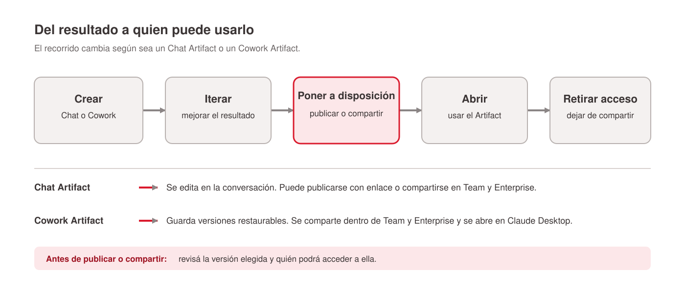
<!-- ascii-source:
 [CREAR] ──> [ITERAR] ──> [PONER A DISPOSICIÓN] ──> [ABRIR] ──> [RETIRAR ACCESO]
     |             |                  |                    |                 |
 Chat o Cowork Chat: editar       Chat: publicar        Chat: enlace      Chat: despublicar
               Cowork: guardar    o compartir            u organización    o dejar de compartir
               versiones           Cowork: compartir      Cowork: Desktop
                                   en Team/Enterprise     con accesos propios
-->
<!-- ascii-note:
intent: mostrar las decisiones que atraviesa un Artifact después de crearlo
emphasize: publicación y compartición cambian según el tipo de Artifact y el plan
labels: crear, iterar, poner a disposición, abrir, retirar acceso
-->

### Sources

- corpus/publish-share-artifacts.web.md
- corpus/live-artifacts-cowork.web.md

### Speaker notes

Recorrer el flujo de izquierda a derecha. Un Chat Artifact se edita dentro de la conversación. Un Cowork Artifact guarda una versión cada vez que se itera con Claude y permite restaurar una anterior. Antes de publicar o compartir, conviene verificar la versión elegida. Los Chat Artifacts se publican con enlace en Free, Pro y Max, o se comparten dentro de Team y Enterprise. Los Cowork Artifacts se comparten sólo dentro de Team y Enterprise; se abren en Claude Desktop y consultan los Connectors de quien los abre. Al retirar un Chat Artifact publicado, ese mismo Artifact no puede publicarse de nuevo; hace falta crear otro. Las tres láminas siguientes separan distribución, permisos y credenciales para que cada decisión quede visible.

### Presenter feedback

---

## 7. Compartir: quién y hasta dónde

### Content

| Acción | Chat Artifact | Cowork Artifact |
|---|---|---|
| Publicar con enlace público | Free, Pro y Max | Ningún plan |
| Compartir dentro de la organización | Team y Enterprise | Team y Enterprise |
| Publicación pública en Team/Enterprise | No | No |
| Quién puede verlo | Cualquiera con el enlace | Sólo cuentas de la organización |

### Sources

- corpus/publish-share-artifacts.web.md
- corpus/live-artifacts-cowork.web.md

### Speaker notes

Las restricciones cambian por tipo de Artifact y por plan (doc oficial de Claude, 2026). Un Chat Artifact se publica con enlace público en los planes individuales; cualquiera con el enlace lo ve, y sólo necesita cuenta para las funciones con IA. En Team y Enterprise no existe la publicación pública: el Artifact se comparte dentro de la organización, con sesión iniciada, y si nació en un Project el visitante también necesita acceso a ese Project. El Cowork Artifact tiene la regla más estricta: sin enlace público en ningún plan, compartible sólo en Team y Enterprise dentro de la organización; en Pro y Max no se comparte. Dos detalles operativos para cerrar: despublicar es de ida (ese mismo Artifact no se puede volver a publicar) y el Cowork Artifact reside en la computadora donde se creó.

### Presenter feedback

- [closed] 2026-08-03 — "Falta todo un slide y research sobre compartir Artifacts, limitaciones, en este caso entre Artifacts y Live has muchas restricciones."
  Resolution: Nueva lámina 3.6 'Compartir: quién y hasta dónde' con la matriz plan por acción para Chat Artifact vs Cowork Artifact, más despublicación de ida y residencia local en notas (fuentes: publish-share-artifacts.web.md, live-artifacts-cowork.web.md).

---

## 8. Permisos al refrescar

### Content

- **Aprobación inicial** - usa los Connectors aprobados al crearlo o actualizarlo.
- **Refresco** - consulta esas fuentes sin pedir una nueva aprobación.
- **Riesgo** - un Connector con permiso de escritura amplía el daño posible.
- **Regla práctica** - el primer Artifact, con fuentes de sólo lectura y privilegios mínimos.

### Sources

- corpus/chat-export-2026-08-03.zip.md
- corpus/live-artifacts-cowork.web.md

### Speaker notes

La documentación oficial lo dice sin vueltas: los Cowork Artifacts usan los Connectors sin preguntar, aunque el modo de la sesión normalmente pediría aprobación. Sólo pueden usar los Connectors aprobados durante la creación o una actualización, y por eso conviene construir el primero con fuentes de lectura y privilegios mínimos. Quien crea el Artifact debe revisar qué Connectors usa y qué permisos tienen antes de dejarlo en el sidebar.

### Presenter feedback

---

## 9. Con qué credenciales se conecta

### Content

- **Connector = MCP** - cada servicio se conecta por un Connector que el usuario autentica una vez, con su propia cuenta.
- **El Artifact hereda** - usa esos Connectors ya autenticados; la autenticación no viaja dentro del Artifact.
- **Compartido** - consulta con las credenciales de quien lo abre, con su propio acceso a los datos.

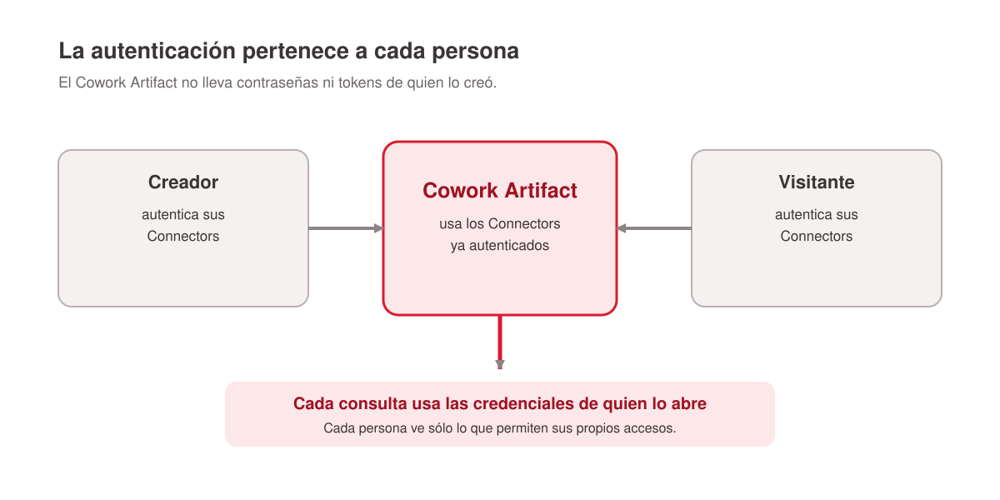
<!-- ascii-source:
   CREADOR                        VISITANTE (misma org)
      |                                   |
 autentica SUS Connectors        autentica LOS SUYOS
      |                                   |
      +---------&gt; COWORK ARTIFACT <-------+
                       |
             consulta con las credenciales
                  de QUIEN LO ABRE
-->
<!-- ascii-note:
intent: mostrar que la autenticación pertenece a la persona y no viaja dentro del Artifact
emphasize: "quien lo abre" como origen de las credenciales en cada consulta
labels: creador, visitante, Cowork Artifact
-->

### Sources

- corpus/live-artifacts-cowork.web.md
- corpus/cowork-plugins-guide.web.md

### Speaker notes

Explicar la cadena de autenticación sin jerga. Un Connector es un servidor MCP, el protocolo con el que Claude se conecta a servicios externos; al activarlo, el usuario inicia sesión en ese servicio una vez, con su cuenta. El Cowork Artifact no guarda contraseñas ni tokens propios: hereda los Connectors ya autenticados de quien lo usa. La consecuencia aparece al compartir en Team o Enterprise: el Artifact consulta con las credenciales del que lo abre. Cada persona ve lo que sus propios accesos permiten, y los datos del creador no viajan con el Artifact. Para la clase, la pregunta de control es simple: ¿con la cuenta de quién se está consultando esta fuente en este momento?

### Presenter feedback

- [closed] 2026-08-03 — "Live y MCP: Explicacion sobre autenticacion de lo que va a estar usando para connectarse."
  Resolution: Nueva lámina 3.8 'Con qué credenciales se conecta': Connector como servidor MCP, autenticación única del usuario, herencia de Connectors en el Artifact y credenciales del que lo abre al compartir (fuentes: live-artifacts-cowork.web.md, cowork-plugins-guide.web.md).

---

## 10. Demo

---

# 4. Plugins

**Goal of this section:** Explicar qué componentes agrupa un plugin y cómo evaluar utilidad, origen y permisos antes de instalarlo.

**Presenter feedback:**

- [closed] 2026-08-03 — "Borrar esto, no dice mucho. Poner primero artifacts antes que Plugins."
  Resolution: Lámina 'Caso: informe comercial' movida a Cut material; sección Artifacts reordenada antes que Plugins, con Agenda, tesis, numeración y referencias actualizadas.

---

## 1. Un paquete de capacidades

### Content

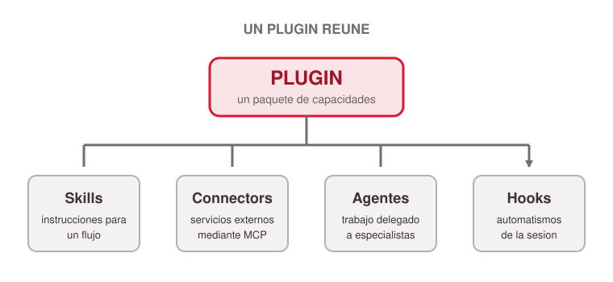
<!-- ascii-source:
                          PLUGIN
                             |
      +-------------+-------------+-------------+
      |             |             |             |
    SKILLS      CONNECTORS      AGENTS        HOOKS
 instrucciones   servicios     trabajo     automatismos
  de un flujo      (MCP)      delegado     de la sesión
-->
<!-- ascii-note:
intent: mostrar que un plugin agrupa cuatro tipos de componente en un solo paquete
emphasize: plugin como paquete; las cuatro ramas al mismo nivel
labels: Skills, Connectors (MCP), Agents, Hooks
-->

### Sources

- corpus/chat-export-2026-08-03.zip.md
- corpus/cowork-plugins-guide.web.md

### Speaker notes

Un plugin agrupa capacidades que antes se configuraban por separado. La documentación de Cowork enumera cuatro componentes: Skills (instrucciones reutilizables que enseñan un flujo), Connectors (servidores MCP que dan acceso a un servicio externo), agentes (subagentes especializados en los que Claude delega) y hooks (scripts que corren en momentos definidos de la sesión). La composición cambia entre plugins; conviene abrir el detalle antes de instalar. Precisión de alcance: los plugins funcionan en Cowork y en Claude Code; en el chat no se usan.

### Presenter feedback

---

## 2. Cada componente responde algo

### Content

| Componente | Pregunta práctica | Ejemplo |
|---|---|---|
| Skill | ¿Cómo se hace el trabajo? | Preparar un brief comercial |
| Connector | ¿Dónde están los datos? | Drive, Slack o CRM |
| Agente | ¿Quién toma una parte? | Revisar fuentes o formato |
| Hook | ¿Qué corre solo y cuándo? | Un control al cerrar la sesión |

### Sources

- corpus/chat-export-2026-08-03.zip.md
- corpus/cowork-plugins-guide.web.md

### Speaker notes

Presentar los componentes desde la tarea y no desde el producto. La Skill contiene instrucciones reutilizables. El Connector da acceso a una fuente o a una acción. El agente ejecuta un tramo delimitado. El hook automatiza un control en un momento fijo de la sesión. Esta lectura evita que "plugin" funcione como una etiqueta opaca: al abrir un plugin instalado se ven sus Skills, Connectors, agentes y hooks, y cada componente se puede habilitar o deshabilitar por separado.

### Presenter feedback

---

## 3. Elegir por trabajo concreto

### Content

- **Tarea repetida** - preparar la reunión comercial de cada semana.
- **Fuentes identificadas** - el CRM y el canal de Slack del equipo.
- **Entrega definida** - un brief de una página, con fuente y fecha por afirmación.

### Sources

- corpus/chat-export-2026-08-03.zip.md

### Speaker notes

Empezar por una tarea concreta, por ejemplo preparar una reunión comercial con datos de CRM y notas de Slack. Luego revisar si el plugin incluye las Skills y Connectors que ese trabajo requiere. La popularidad del plugin no demuestra que encaje en el proceso. Un plugin útil reduce configuración repetida y mantiene un estándar compartido entre los miembros del equipo.

### Presenter feedback

---

## 4. Plugins en acción

### Content

<video class="plugins-video" src="images/plugins.webm" controls muted playsinline></video>

### Speaker notes

Mostrar el flujo de uso de un plugin en la interfaz. Conectar lo que se ve con la tarea, las fuentes y la entrega definida de la lámina anterior antes de pasar a la evaluación de origen y permisos.

---

## 5. Revisar antes de instalar

### Content

- **Origen** - quién mantiene el plugin.
- **Accesos** - qué datos puede leer o modificar.
- **Componentes** - qué Skills, Connectors, agentes y hooks activa.
- **Distribución** - quién decide su uso dentro de la organización.

| Política del administrador | Efecto para el miembro |
|---|---|
| Instalado por defecto | Lo tiene desde el inicio y puede desinstalarlo |
| Disponible | Lo instala si lo necesita |
| No disponible | No lo ve en el catálogo |
| Obligatorio | Se instala solo y no puede removerlo |

### Sources

- corpus/chat-export-2026-08-03.zip.md
- corpus/use-plugins.web.md
- corpus/manage-org-plugins.web.md

### Speaker notes

Revisar el origen y los permisos antes de instalar. Un Connector puede requerir autenticación al instalarse. La documentación oficial advierte que un plugin puede incluir servidores MCP locales que corren en la computadora con los mismos permisos que cualquier otro programa; de ahí la regla de instalar sólo de fuentes confiables. En Team y Enterprise, los administradores gestionan el catálogo con cuatro políticas por plugin: instalado por defecto, disponible, oculto u obligatorio (se instala solo y el miembro no puede removerlo). La evaluación combina utilidad y riesgo: qué trabajo resuelve, qué información toca y quién lo controla. Ejercicio corto posible: auditar un plugin del catálogo e identificar qué instala y qué permisos pide.

### Presenter feedback

---

## 6. Los plugins de Anthropic para Cowork

### Content

| Plugin | Qué resuelve |
|---|---|
| Productivity | Tareas, calendario y flujo diario |
| Enterprise search | Buscar en las herramientas de la empresa |
| Sales | Investigar prospectos y preparar oportunidades |
| Finance | Analizar estados financieros y construir modelos |
| Data | Consultar, visualizar e interpretar datos |
| Legal | Revisar documentos y marcar riesgos |
| Marketing | Redactar contenido y planificar campañas |
| Customer support | Clasificar casos y redactar respuestas |
| Product management | Escribir specs y priorizar roadmaps |
| Biology research | Buscar literatura y planificar experimentos |
| Plugin Create | Construir y modificar plugins propios |

Once plugins open source oficiales, uno por rol (Anthropic, 2026).

### Sources

- corpus/cowork-plugins-blog.web.md

### Speaker notes

Anthropic publica once plugins open source para Cowork, uno por rol de trabajo (blog oficial de Anthropic, 2026). Recorrer la tabla marcando que la lógica es de especialización: cada plugin trae las Skills y Connectors del rol, listos desde la primera conversación. Se instalan desde Cowork (Customize → Plugins), se pueden explorar en el sitio de Anthropic o subir como archivo propio. Están disponibles como research preview para todos los planes pagos.

### Presenter feedback

- [closed] 2026-08-03 — "Mencionar en un slide los plugins existentes de Antropics."
  Resolution: Nueva lámina 4.6 'Los plugins de Anthropic para Cowork' con los 11 plugins open source oficiales y su instalación (fuente: cowork-plugins-blog.web.md).

---

## 7. Por dónde empezar

### Content

- **Sales** - proceso comercial: prospectos, oportunidades, seguimiento.
- **Finance** - análisis financiero y modelos.
- **Marketing** - contenido, campañas y lanzamientos.
- **Legal** - revisión de documentos y riesgos.
- **Productivity** - tareas, calendario y contexto personal.

El directorio completo suma más de cien plugins (claude.com/plugins, 2026).

### Sources

- corpus/cowork-plugins-blog.web.md
- corpus/plugins-directory.web.md

### Speaker notes

Para este perfil de management, los cinco plugins con retorno más directo son los de la lámina: cubren el trabajo comercial, financiero, de marketing y legal que los alumnos ya hacen, más la productividad personal. El directorio completo en claude.com/plugins suma más de cien plugins, con mayoría orientada a desarrollo de software (integración con GitHub, Slack, Figma, Atlassian, revisión de código). Criterio de confianza para elegir ahí: la insignia "Anthropic Verified" marca revisión adicional de calidad y seguridad; los plugins de comunidad pueden instalar software de terceros no verificado. Conectar con la lámina de revisión previa: la evaluación de origen, accesos y componentes aplica igual acá.

### Presenter feedback

- [closed] 2026-08-03 — "Si existe una lista, algunos de los plugins mas utiles."
  Resolution: Nueva lámina 4.7 'Por dónde empezar' con los cinco plugins de mayor retorno para el perfil MiM, el directorio claude.com/plugins y el criterio Anthropic Verified (fuentes: cowork-plugins-blog.web.md, plugins-directory.web.md).

---

# 5. Bonus: Claude Code

**Goal of this section:** Dar una introducción a Claude Code como el mismo patrón de delegación aplicado a software: brief, plan, cambios revisables.

**Presenter feedback:**

- [closed] 2026-08-03 — "Falta una lamina de Claude Code que responda: para quien es y cual es el resultado final."
  Resolution: Nueva lámina 5.1 'Para quién y qué produce' abriendo la sección: tabla quién/qué obtiene (desarrollador, manager que encarga, equipo sin ingeniería) y statement del resultado final como software funcionando; resto de la sección renumerado.

---

## 1. Elegir la superficie

### Content

| Trabajo | Superficie sugerida |
|---|---|
| Conversar o redactar | Chat |
| Investigar y producir entregables | Cowork |
| Construir o modificar software | Claude Code |

### Sources

- corpus/chat-export-2026-08-03.zip.md

### Speaker notes

Abrir el bloque ubicando cada superficie. Chat sirve para pensar y redactar dentro de una conversación. Cowork trabaja con archivos, aplicaciones conectadas y tareas de conocimiento. Claude Code modifica proyectos de software y ejecuta pruebas. La frontera puede moverse según el caso; la naturaleza del entregable ofrece un criterio práctico. Frase de transición: con Cowork delegamos trabajo de conocimiento y con Claude Code podemos delegar parte de la construcción de las herramientas que ese trabajo necesita.

### Presenter feedback

---

## 2. Qué es Claude Code

### Content

**Claude Code es el entorno de Claude para construir o modificar software a partir de un pedido en lenguaje natural.**

- **Trabaja sobre una carpeta de proyecto** - lee archivos, entiende cómo funciona y propone cambios.
- **Convierte un brief en cambios revisables** - puede planear, editar, ejecutar comandos y probar el resultado.
- **La persona conserva el control** - revisa el plan, los cambios y el comportamiento final antes de usarlo.

### Sources

- corpus/chat-export-2026-08-03.zip.md
- corpus/claude-code-desktop.web.md

### Speaker notes

Definir Claude Code antes de describir a quién le sirve. No es un chat que entrega texto: trabaja sobre una carpeta de software, puede leer los archivos relacionados, proponer un plan, modificar código y ejecutar pruebas. El resultado no es una promesa sino cambios visibles y revisables. La persona sigue decidiendo qué encargar, cuándo aprobar el plan y si el comportamiento final responde al pedido. Transición: con la definición clara, la siguiente lámina ubica a la persona objetivo y el trabajo que quiere resolver.

### Presenter feedback

---

## 3. Para quién y qué produce

### Content

**Target persona:** una persona de negocio con fundamentos de programación que conoce un problema de trabajo y puede describir el resultado que necesita.

**Output:** código que implementa una aplicación, un prototipo o una automatización que se puede abrir y probar.

| Job to be done | Código que produce |
|---|---|
| Convertir una tarea manual en una herramienta | Una aplicación interna, prototipo o automatización funcional |
| Mejorar una herramienta existente | Código nuevo o modificado sobre una base de código |
| Validar una idea antes de invertir más | Una primera versión de la aplicación para abrir y probar |

### Sources

- corpus/chat-export-2026-08-03.zip.md
- corpus/claude-code-desktop.web.md

### Speaker notes

La persona objetivo de esta clase tiene fundamentos de programación, aunque no necesariamente trabaje como desarrolladora: conoce un problema, puede describir un resultado útil y puede evaluar si funciona. Hacer explícito el output: Claude Code escribe o modifica código; ese código implementa una aplicación, un prototipo o una automatización que se puede abrir y probar. Presentar el job to be done con tres situaciones: convertir trabajo manual en una herramienta, mejorar un sistema existente o validar una idea con una primera versión. Claude Code también acelera a desarrolladores, pero aquí el foco está en quien encarga y revisa. El resultado queda en una carpeta como software que funciona, con los cambios a la vista para revisarlos. Transición: para poder encargar alcanza un vocabulario mínimo; la próxima lámina lo da.

### Presenter feedback

---

## 4. ¿Qué es un software?

### Content

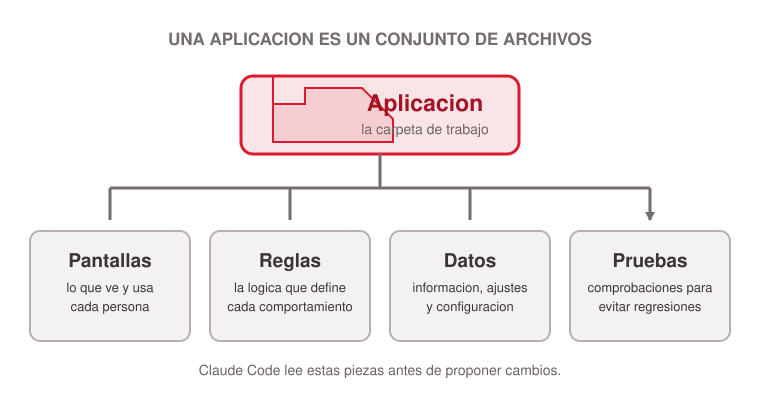
<!-- ascii-source:
APLICACION
   |
   +-- pantallas
   +-- reglas
   +-- datos
   +-- pruebas
-->
<!-- ascii-note:
intent: mostrar que un software es una aplicación compuesta por archivos con funciones distintas
emphasize: una aplicación como conjunto de archivos con funciones distintas
labels: pantallas, reglas, datos, pruebas
-->

Vocabulario mínimo para seguir la conversación:

| Término | Qué significa |
|---|---|
| Lenguaje de programación | El idioma en que se escriben las instrucciones (Python, JavaScript) |
| Código fuente | Los archivos de texto con esas instrucciones |
| Dependencias | Piezas ya hechas por otros que la aplicación reutiliza |
| Repositorio | La carpeta versionada donde vive el código y su historia |

### Sources

- corpus/chat-export-2026-08-03.zip.md

### Speaker notes

Abrir con el puente desde lo ya visto: la lógica de delegar sigue igual y cambia el material de trabajo, que ahora son los archivos de una aplicación. Explicar codebase como la carpeta que contiene esas piezas. Algunos archivos definen las pantallas; otros contienen reglas, datos de configuración y pruebas. Una aplicación no es una caja negra: cada comportamiento sale de un archivo que alguien puede leer y modificar. Recorrer el vocabulario un término por vez: el lenguaje es el idioma de las instrucciones; el código fuente, el texto escrito en ese idioma; las dependencias, piezas de otros que se reutilizan en lugar de reescribirse (un proveedor dentro del producto); el repositorio, la carpeta con historia, que permite ver quién cambió qué y volver atrás. Nadie va a programar en esta clase: el vocabulario sirve para leer el plan y los cambios que Claude Code propone.

### Presenter feedback

- [closed] 2026-08-03 — "Agregar conceptos basicos: que es un lenguaje de programacion, etc."
  Resolution: Lámina 5.2 ampliada con tabla de vocabulario mínimo (lenguaje, código fuente, dependencias, repositorio) y notas que explican cada término para audiencia no técnica; nota de la demo 5.7 ajustada en consecuencia.

---

## 5. Panorama: tipos de software

### Content

**Una misma necesidad puede resolverse con distintas formas de software. La elección depende de dónde se usa y cómo se distribuye.**

| Tipo | Qué resuelve | Dónde se usa |
|---|---|---|
| **Script** | Automatiza una tarea puntual o repetitiva. | Terminal, tarea programada o flujo interno |
| **Mobile app** | Ofrece una experiencia desde el teléfono. | iOS o Android |
| **Web app** | Reúne una herramienta compartida y actualizable. | Navegador, por una URL |
| **Extensión** | Agrega una capacidad a una herramienta existente. | Navegador, editor o plataforma |

### Sources

- corpus/chat-export-2026-08-03.zip.md

### Speaker notes

Presentar la taxonomía como una vista de elección, no como una lista de tecnologías. Un script sirve cuando el resultado es automatizar un paso; una app móvil cuando la interacción ocurre en el teléfono; una web app cuando varias personas necesitan entrar por una URL y recibir actualizaciones; una extensión cuando la tarea vive dentro de otra herramienta. La misma lógica de producto se aplica a cada una: usuario, problema, comportamiento y criterio de aceptación. Claude Code puede ayudar a construir cualquiera de estas formas; el brief debe indicar cuál se necesita y dónde se va a usar.

### Presenter feedback

---

## 6. Claude Code genera código sin que lo sepas

### Content

**Ante un pedido de automatización, Claude Code puede escribir un script en Python, ejecutarlo sobre los archivos del proyecto y dejar el resultado para revisar.**

1. **Pedido en lenguaje natural** - “Cada lunes, consolidá estas planillas y prepará el reporte”.
2. **Código generado** - Claude puede crear Python para leer, transformar y combinar los datos.
3. **Ejecución repetible** - el script corre otra vez sobre el siguiente conjunto de archivos, sin rehacer el trabajo manual.
4. **Resultado revisable** - quedan el código, los archivos producidos y las pruebas para verificar.

### Sources

- corpus/chat-export-2026-08-03.zip.md
- corpus/claude-code-desktop.web.md

### Speaker notes

Enfatizar que la persona no necesita escribir el Python línea por línea para aprovechar una automatización, pero sí debe poder describir la tarea, revisar los cambios y verificar el resultado. Usar un caso sencillo: juntar planillas de ventas, normalizar nombres de columnas y producir un reporte semanal. Claude Code puede generar el script, ejecutarlo sobre los archivos y volver a correrlo la semana siguiente. No presentarlo como una ejecución autónoma sin control: la persona conserva el código y decide cuándo usarlo, qué datos entran y si el resultado es correcto. Transición: cuando ese código crece o lo usan otras personas, importa cómo se ejecuta y se despliega.

### Presenter feedback

---

## 7. Cómo se ejecuta y se despliega un software

### Content

| Etapa | Qué significa | Ejemplo |
|---|---|---|
| **Lenguaje de programación** | El código expresa las instrucciones de la aplicación. | Python, JavaScript, TypeScript |
| **Ejecución** | Un runtime y sus dependencias convierten ese código en algo que se puede correr. | Node.js ejecuta una aplicación web |
| **Deployment** | La aplicación se publica en un entorno para que otras personas puedan usarla. | Un sitio interno disponible por URL |

**La entrega no termina al escribir código:** tiene que ejecutar, verse y quedar disponible en el entorno acordado.

### Sources

- corpus/chat-export-2026-08-03.zip.md

### Speaker notes

Conectar la carpeta de archivos con el resultado que usa una persona. El lenguaje es la forma de escribir las instrucciones; la ejecución ocurre cuando el runtime y las dependencias corren ese código; el deployment lo pone en un entorno accesible, por ejemplo una URL interna. Distinguir los tres porque un cambio de código que no ejecuta o no se despliega todavía no resuelve el trabajo. No hace falta enseñar infraestructura: alcanza con que la audiencia pueda preguntar dónde corre y dónde se usa la aplicación. Transición: ahora que el recorrido del software está claro, la siguiente lámina muestra cómo Claude Code interviene en el ciclo de trabajo.

### Presenter feedback

---

## 8. Qué hace Claude Code

### Content

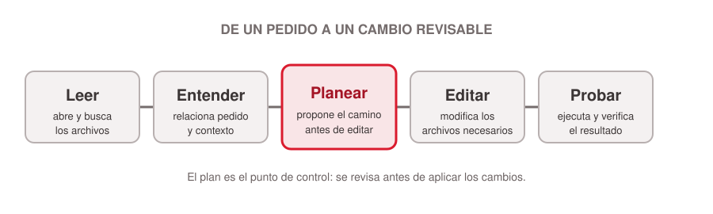
<!-- ascii-source:
LEER  --&gt;  ENTENDER  --&gt;  PLANEAR  --&gt;  EDITAR  --&gt;  PROBAR
-->
<!-- ascii-note:
intent: mostrar el ciclo básico de una tarea en Claude Code
emphasize: planificación antes de edición y prueba al final
labels: leer, entender, planear, editar, probar
-->

### Sources

- corpus/chat-export-2026-08-03.zip.md
- corpus/claude-code-desktop.web.md

### Speaker notes

Claude Code abre una carpeta de proyecto, busca los archivos relacionados con el pedido y propone una forma de resolverlo. Luego puede editar archivos, ejecutar comandos y probar el resultado según los permisos de la sesión. El pedido no requiere lenguaje de programación: se describe un resultado, por ejemplo "agregá una pantalla para comparar competidores", y Claude ubica dónde tocar. En Claude Desktop, la pestaña Code organiza el trabajo en paneles configurables: chat, plan, diferencias, archivos, terminal y navegador con vista previa.

### Presenter feedback

---

## 9. Revisar los cambios

### Content

| Revisión de producto | Revisión técnica |
|---|---|
| ¿Hace lo pedido? | ¿Qué archivos cambiaron? |
| ¿Respeta los límites? | ¿Qué pruebas corrieron? |
| ¿La pantalla resulta usable? | ¿Aparecieron errores? |

### Sources

- corpus/chat-export-2026-08-03.zip.md
- corpus/claude-code-desktop.web.md

### Speaker notes

Cada cambio deja una diferencia visible. La vista de diferencias de Claude Desktop muestra las modificaciones archivo por archivo, permite comentar líneas concretas y Claude aplica esos comentarios como un nuevo cambio revisable. El manager revisa el comportamiento en la vista previa: qué pantalla aparece, qué flujo cambia. Un desarrollador examina el detalle técnico y las pruebas. Ambos revisan el mismo cambio desde responsabilidades distintas. Publicar o fusionar código sigue el proceso de aprobación del equipo; la decisión de producto y de lanzamiento permanece humana.

### Presenter feedback

---

## 10. Demo

---

# Conclusions

## 1. Cuatro decisiones

### Content

- **Conocimiento Persistente** - datos en archivos; procedimientos en Instructions o Skills; Memory para continuidad.
- **Resultados consultables** - tipo de Artifact según datos, compartición y permisos.
- **Extensiones** - plugins con componentes y permisos revisados antes de instalar.
- **Software** - Claude Code con brief, plan y revisión.

### Sources

- corpus/chat-export-2026-08-03.zip.md

### Speaker notes

Recorrer las cuatro decisiones de la clase en el orden en que se vieron. Primero, clasificar cada pieza de contexto: dato o procedimiento, y su lugar. Segundo, elegir el tipo de Artifact según qué datos consulta, quién puede verlo y con qué credenciales. Tercero, instalar un plugin cuando resuelve un trabajo concreto y sus permisos resultan aceptables. Cuarto, encargar una construcción a Claude Code con brief, plan aprobado y cambios revisados. Conectar Skills con Artifacts al pasar: una Skill puede producir el informe y un Cowork Artifact permite consumirlo sin volver al chat.

### Presenter feedback

---

## 2. Aplicación inmediata

### Content

**Elegir una tarea del trabajo propio y definir:**

1. Qué conocimiento necesita y dónde debería vivir.
2. Qué entregable o vista debe producir.
3. Qué capacidad conviene extender con un plugin.
4. Qué revisión mantiene el equipo antes de usar el resultado.

<!-- aside: right  -->
<!-- generate-source: una tarea cotidiana que encuentra su lugar en un sistema de trabajo -->

### Sources

- corpus/chat-export-2026-08-03.zip.md

### Speaker notes

Cerrar con una consigna concreta. Cada alumno elige una tarea de su trabajo y responde las cuatro preguntas. Puede proponer un Project, un plugin, un Artifact o una construcción pequeña con Claude Code. Pedir que indique la fuente de verdad y el punto de aprobación humana. Reservar cinco minutos para compartir dos casos con el grupo.

### Presenter feedback

---

## 3. Q&A

### Content

**Preguntas, casos y dudas para aplicar en el trabajo.**

### Sources

- corpus/chat-export-2026-08-03.zip.md

### Speaker notes

Abrir la conversación final. Pedir preguntas sobre los cinco bloques y, si no aparecen, invitar a que alguien comparta una tarea concreta de su trabajo para ubicarla en Chat, Cowork o Claude Code.

### Presenter feedback

---

# Open questions

- Elegir el plugin que se usará en el ejercicio de auditoría de la sección 4 (lámina 4.4).
- Definir el proyecto mínimo disponible para la demo de Claude Code (sección 5).
- Preparar el ejemplo real de Cowork Artifact que el presenter mostrará en vivo en la sección 3 (reemplaza a la lámina de demo borrada).
- Verificar contra documentación oficial el alcance exacto de la memoria por Project (láminas 2.5 a 2.7): único claim de producto que sigue sin respaldo web propio en el corpus.

# Cut material

- Módulo "Delegar y verificar" (brief en cuatro campos, revisión del plan, verificación en cuatro capas): el presentador lo descartó como bloque independiente; su criterio central reaparece en las notas de las demos y en la conclusión 2.
- Dispatch y Schedule: fuera del recorrido aprobado de cinco secciones. Si vuelven en una clase futura, usar la definición corregida del corpus (Dispatch envía una tarea o sesión de código a la computadora host) y verificar la restricción de Schedule sobre carpetas locales.
- Frase espejada de cierre de Artifacts propuesta en el corpus ("Una Skill repite un proceso; un Cowork Artifact hace visible su resultado"): la idea quedó dicha en prosa llana en las notas de la conclusión 1.
- Temas propuestos en el corpus y no incluidos: computer use y seguridad, y la supervisión como módulo propio.
- Lámina "El Project delimita" (tabla de dos Projects): borrada a pedido del presenter (Review 2026-08-03); la idea del alcance quedó en la lámina de arquitectura (2.2) y en "Cómo se administra Memory" (2.7).
- Caso Faro (lámina propia en Conocimiento Persistente + menciones en notas y en el brief de Claude Code): eliminado por pedido del presenter; los ejemplos quedaron en genérico.
- Lámina "Caso: informe comercial" (Plugins, con ASCII CRM+Slack → plugin → brief): borrada a pedido del presenter ("no dice mucho").
- Lámina "Tracker de competidores" (tabla Atlas/Boreal/Cima): borrada a pedido del presenter.
- Lámina "Demo de Cowork Artifact" (guion de 5 pasos): borrada; el presenter muestra un ejemplo real en vivo. La decisión previa de Open questions sobre "construir en vivo o llevar preparado" queda resuelta en el mismo sentido.
