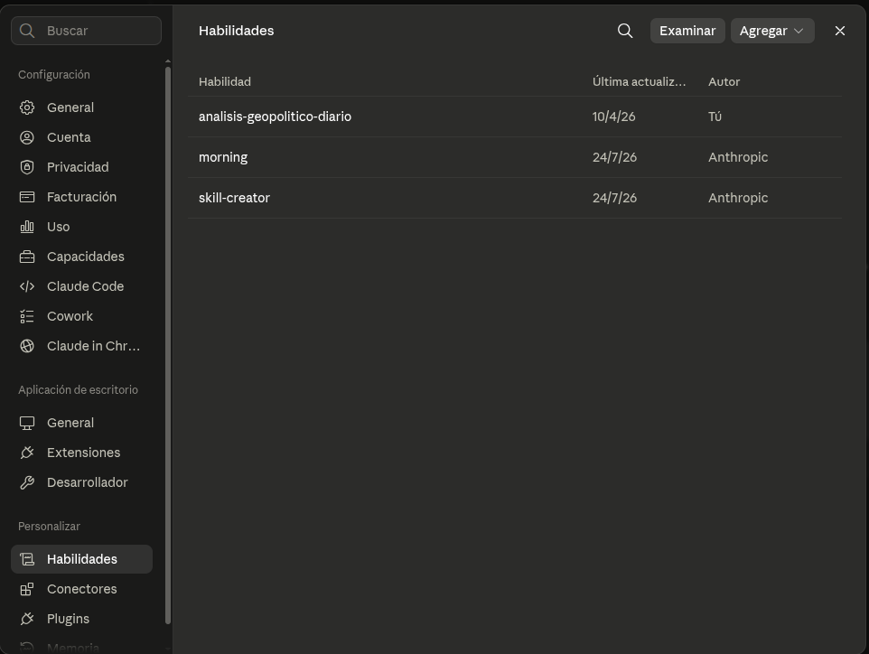
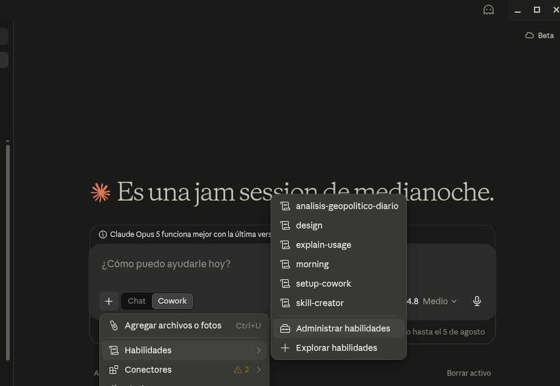

# Thesis

**Claim:** En la clase anterior el chat quedó extendido: conectores para que vea el mundo real y Schedule para que trabaje solo. Esta clase da el salto siguiente, Claude Cowork, donde ese mismo agente baja a la computadora y trabaja sobre carpetas y archivos reales. Eso cambia la forma de trabajar: el usuario delega resultados completos combinando sus piezas (archivos `.md`, Projects, Instrucciones, Skills y Subagentes) sin escribir una línea de código.

**Why it matters:** Un agente se vuelve útil en el trabajo real cuando se le delega un resultado y se guía su proceso, en vez de chatearle un mensaje por vez. Quien domina esa forma de delegar automatiza horas de trabajo manual con la barrera de entrada en cero. La clase asume el chat extendido como punto de partida y no vuelve sobre él: arranca donde terminó la anterior.

**Presenter feedback:**

---

# Agenda

**Narrative arc:** La clase arranca donde terminó la anterior, con el chat ya extendido por conectores y Schedule, y da el salto grande de una: Claude Cowork instalado en la computadora, trabajando sobre carpetas y archivos reales. La primera sección ubica ese salto: Cowork como herramienta de propósito general del knowledge worker, con la analogía del Excel como habilidad base de la oficina; el cambio de rol de chatear a delegar un resultado, el mapa de piezas que se apilan y el primer contacto con la interfaz sobre una captura anotada de la app (1). De ahí las piezas se recorren una por una, en el orden en que se apilan. Los archivos `.md` primero, porque son el formato en el que la IA lee, edita y entrega. La sección abre con el porqué, que lo que hay en una carpeta de trabajo es conocimiento e instrucciones y le hace falta un formato que la máquina lea bien, y sigue con cómo se escriben, cómo se ven una vez formateados y el hábito de trabajar en `.md` y exportar recién al final (2). Después el espacio de trabajo: qué agrupa un Project, cómo se le concede una carpeta real del disco con el explorador del sistema, dónde vive su contexto y cómo las Instrucciones fijan de una vez el comportamiento del agente adentro de ese espacio (3). Con el espacio armado llegan las Skills, la forma de enseñar una tarea una sola vez: qué es una Skill, el panel de Habilidades y el acceso desde el chat, y la grabación de pantalla, el camino con la barrera más baja, donde alguien hace la tarea narrándola en voz alta y Claude arma la Skill con eso; la trampa del Save es la compuerta común de los tres (4). La última pieza, ya de nivel avanzado, son los Subagentes: para qué tipo de sub-tarea conviene delegar en paralelo y cómo aparecen en Cowork, coordinados por debajo y sin panel propio (5). Después de las cinco piezas viene el cierre, que abre con el loop completo de Faro, engancha las piezas de las dos clases y las muestra corriendo solas; sigue con un wrap-up que nombra el cambio de rol y deja una consigna concreta para la semana, y termina en las advertencias de gobernanza. Con la charla ya cerrada, la última lámina es la placa divisoria que manda a resolver la parte 2 de la misión de Faro, el analista de mercado virtual de Atlas, ya en Cowork y sobre la carpeta real del equipo, sin exigir la parte 1 resuelta (6). La clase termina ahí, en la consigna de la misión, con Q&A abierto sobre esa placa.

**Sections (in delivery order):**

- 1. Claude Cowork
- 2. Knowledge & Output
- 3. Projects
- 4. Skills
- 5. Subagentes
- Conclusions (va antes de la Sección 6: las conclusiones cierran la charla)
- 6. La misión · parte 2 (última: después de la misión termina la clase)

**Presenter feedback:**

---

# 1. Claude Cowork

**Goal of this section:** El salto grande de la charla. Cowork es Claude instalado en la computadora, trabajando sobre carpetas y archivos reales; eso cambia la forma de trabajar. Ubica el superpoder de Cowork como herramienta de propósito general, el paso de chatear a delegar resultados, el mapa de piezas que se apilan y el primer contacto con la interfaz.

**Presenter feedback:**

---

## 1. Cowork, de propósito general

### Content

- Cowork = Claude instalado en la computadora, trabajando sobre las carpetas y archivos del usuario.
- La **herramienta de propósito general del knowledge worker**. El "lenguaje de programación" es el español.
- Hay analistas que la llaman **"el nuevo Excel"**: la habilidad base del trabajo de oficina para los próximos años (encuadre de la industria, no de Anthropic).
- Anthropic: **"Claude Code para el resto de tu trabajo"**.

<!-- generate-image: right | el salto de escala del trabajo de oficina cuando la herramienta deja de ser un accesorio y pasa a ser la base -->

### Sources

- corpus/agentic-ai-deck.zip.md, posicionamiento Cowork vs Claude Code ("Same engine. Different surface."; Cowork = la cara para knowledge workers sin terminal; slide 7.1 "Claude Code vs Cowork — the close").
- Anthropic, Claude Cowork (product page): https://www.anthropic.com/product/claude-cowork; encuadre oficial: Cowork como "Claude Code para el resto de tu trabajo"; construido sobre las mismas bases que Claude Code.
- Claude blog, Cowork research preview ("Claude Code power for knowledge work"): https://claude.com/blog/cowork-research-preview; la ambición de llevar el poder de Claude Code al trabajo del conocimiento; Cowork generaliza un éxito probado primero con developers.
- CNBC, Anthropic's Claude Cowork targets the office worker: https://www.cnbc.com/2026/02/24/anthropic-claude-cowork-office-worker.html; encuadre de público general / office worker.
- "Claude Code is the New Excel" (ensayo de analista): https://nextword.substack.com/p/claude-code-is-the-new-excel; origen de la analogía del "nuevo Excel" (atribuir AQUÍ, NO a Anthropic).

### Speaker notes

El beat de "¿y a mí por qué me importa?". Cowork es Claude instalado en la computadora, con acceso a las carpetas y archivos del usuario; eso habilita una forma de trabajar distinta de la del chat. En la clase anterior la audiencia extendió un chat; esta slide anuncia otra categoría de herramienta. Tono motivacional y de alto nivel; la mecánica viene después.

El gancho de la analogía del Excel va acá, dicho con cuidado. Durante unas cuatro décadas Excel fue la habilidad base del trabajo de oficina, la herramienta de propósito general que se usaba sin escribir código. Varios analistas sostienen que las herramientas agénticas van camino a ese mismo lugar, Claude Code para quien programa y Cowork para quien no. Atribuirlo cada vez que se dice: "hay quien lo llama el nuevo Excel" es encuadre de analistas y de la industria, NO de Anthropic.

Lo que sí es de Anthropic, y conviene citarlo como su framing propio, es "Claude Code para el resto de tu trabajo": que cualquier knowledge worker sienta con Cowork lo que los ingenieros ya sienten con Claude Code. Cowork generaliza algo que ya funcionó primero con developers.

Aterrizarlo en la audiencia: son alumnos de management y la mayoría no programa; por eso Cowork les sirve. Después de este beat viene la mecánica, cómo se delega. Tiempo objetivo: ~3 min.

### Presenter feedback

---

## 2. De chatear a delegar

<!-- layout: image-left -->
<!-- intención del presentador (2026-07-31): el diagrama ASCII va a la izquierda y el texto (bullets + tabla) a la derecha. A esta fecha el catálogo de templates no soporta imagen-izquierda (content+image solo admite layout: text-left | image-top), así que el hint queda a la espera del cambio en el plugin. -->

### Content

- Lo que cambia ahora es el rol: **delegar**. ¿Qué delegamos?
- Anthropic: *"menos una sesión de chat, más asignarle tareas a un colega."*
- Chatear vs delegar:

| | Chatear | Delegar a un agente |
|---|---|---|
| La forma de trabajo | Un mensaje a la vez | Se describe un resultado |
| Los pasos | Los hace la persona | El agente planifica y ejecuta |
| La salida | Texto en la ventana | Archivos en el disco |
| El rol humano | Hacer cada paso intermedio | Revisar el plan y corregir el rumbo |

```ascii
ANTES (chat)                    AHORA (agente / Cowork)
+----------+                    +------------------------+
| vos: msg | --> respuesta      | vos: "entrega X"       |
| vos: msg | --> respuesta      |        |               |
| vos: msg | --> respuesta      |        v               |
| vos: msg | --> respuesta      | agente: planifica      |
+----------+                    | agente: toca archivos  |
 paso a paso, lo hacés vos      | vos: leés y guiás      |
                                +------------------------+
                                 entregás un resultado
```
<!-- ascii-note:
intent: contrastar el modo "chat" (un mensaje a la vez, vos hacés cada paso) contra el modo "agente" (delegás un resultado, el agente planifica y ejecuta sobre tus archivos).
emphasize: la flecha de paradigma de izquierda (ANTES) a derecha (AHORA); que en AHORA el agente hace el trabajo y vos guiás.
labels: ANTES (chat) vs AHORA (agente / Cowork).
-->

### Sources

- corpus/agentic-ai-deck.zip.md, "Stop prompting. Start delegating." (slide 2.3 the reframe); tabla "Chatting vs Delegating" (slide 3.16).
- "corpus/mision - auto.zip.md", "el verdadero premio no es Atlas: sos vos, dominando Claude Cowork"; "Conversá, no programes."
- Anthropic, Claude Cowork (product page): https://www.anthropic.com/product/claude-cowork; refuerza el paradigma: trabajar con Cowork "se parece menos a una sesión de chat y más a asignarle tareas a un colega".
- (técnico, opcional) Anthropic Engineering, Building agents with the Claude Agent SDK: https://www.anthropic.com/engineering/building-agents-with-the-claude-agent-sdk; por qué el loop plan→ejecutar→guiar define a un agente frente a un chat.

### Speaker notes

El concepto-ancla de la charla. En la clase anterior, los conectores y Schedule extendieron qué puede hacer el chat; el agente cambia tu rol: en vez de pedir un paso intermedio, se describe un resultado completo que el agente planifica y ejecuta sobre archivos reales mientras vos supervisás. La lámina deja abierta la pregunta "¿qué delegamos?"; contestarla con la tabla y con un ejemplo concreto de ellos, el informe mensual del equipo entero. Pedir un dato suelto sigue siendo chat. Si se llevan una sola idea, que sea esta: el valor está en aprender a delegar un resultado y guiar el proceso. Usar la tabla para hacerlo concreto: la salida son archivos en el disco, no texto en una ventana. Anticipar la misión: vamos a "contratar" a Faro y entrenarlo una vez para que después trabaje solo. Cerrar citando a Anthropic: "menos una sesión de chat, más asignarle tareas a un colega". Tiempo objetivo: ~4 min.

### Presenter feedback

---

## 3. El mapa: piezas que se apilan

### Content

Cada bloque resuelve un problema conocido y se apila sobre el anterior; cada tarea usa solo los que necesita.

```ascii
   +----------------------+  "quiero delegar en paralelo"
   | SUBAGENTES           |
   +----------------------+
   +----------------------+  "no quiero repetir la tarea"
   | SKILLS               |
   +----------------------+
   +----------------------+  "no quiero repetir el contexto"
   | INSTRUCCIONES        |
   +----------------------+
   +----------------------+  "agrupar el trabajo de un tema"
   | PROJECTS             |
   +----------------------+
   +----------------------+  "quiero que la IA entienda mi material"
   | ARCHIVOS .MD         |
   +----------------------+
   +----------------------+  "quiero que trabaje sobre mis archivos"   <== ACA
   | COWORK: carpetas     |
   +----------------------+
   +----------------------+  "quiero que corra solo"                   (visto)
   | SCHEDULE             |
   +----------------------+
   +----------------------+  "quiero info real + que actue"            (visto)
   | CONECTORES           |
   +----------------------+
   +----------------------+  "respondia solo de memoria"               (visto)
   | EL CHAT              |
   +----------------------+

   los bloques se apilan: cada tarea combina solo los que necesita
```
<!-- ascii-note:
intent: presentar el arco completo de las dos clases como bloques que se apilan (no una pirámide/escalera estricta): el chat (base) -> conectores -> Schedule -> Cowork (carpetas/archivos) -> archivos .md -> Projects -> Instrucciones -> Skills -> Subagentes. Los tres bloques de abajo son los de la clase anterior y están marcados "(visto)"; el bloque Cowork lleva el marcador "estamos acá".
emphasize: el marcador "<== ACÁ" en el bloque Cowork; los "(visto)" en chat/conectores/Schedule, que son de la clase anterior; el par bloque↔problema en cada nivel.
labels: bloques apilados (base→cima): El chat · Conectores · Schedule · Cowork: carpetas · Archivos .md · Projects · Instrucciones · Skills · Subagentes, cada uno con su frase-problema a la derecha.
-->

### Sources

- corpus/agentic-ai-deck.zip.md, progresión de building blocks del deck (Instrucciones → Projects → Skills → Connectors/MCP); la idea de "pila" es la lectura ordenada de esa progresión, re-secuenciada al arco chat-primero de esta charla.
- "corpus/mision - auto.zip.md", la misión Atlas arma estas piezas una por una.

### Speaker notes

El mapa del arco completo, que empieza antes de esta clase: la base es el chat que la audiencia ya usa. La lámina es el diagrama y una línea de lead, así que todo lo demás va hablado. La lectura en voz alta es bloque por bloque, cada uno con su frase-problema al lado. La mitad de abajo es la clase anterior y la de arriba lo que queda por recorrer, y ese corte conviene nombrarlo de entrada. De abajo hacia arriba, los tres que trajimos de la clase anterior: el chat respondía solo de memoria, los conectores traen información real y actúan, Schedule hace que corra solo. Un repaso de una línea por bloque alcanza; no volver a enseñarlos. Señalar "estamos acá": Cowork, donde la IA empieza a trabajar sobre carpetas y archivos reales. Los cinco de arriba son el roadmap de esta clase y cada uno tiene su sección: archivos `.md` para que la IA entienda el material (sección 2), Projects para agrupar el trabajo de un tema e Instrucciones para no repetir el contexto (sección 3), Skills para no repetir la tarea (sección 4) y Subagentes para delegar en paralelo (sección 5). Cuidado con la metáfora: los bloques se apilan y se combinan, cada tarea usa solo los que necesita. Decir que pueden volver a esta slide entre secciones para ubicarse. Al final, la pila entera es Faro. Tiempo objetivo: ~3 min.

### Presenter feedback

---

## 4. Dónde se empieza en Cowork

### Content

- **`+ New`**, arriba en la barra lateral, abre la sesión. Los tres círculos marcan el recorrido.


- El toggle **`Chat` / `Cowork`** del compositor elige el modo de trabajo.
- **`Project or folder`** concede la carpeta o el Project sobre el que Cowork va a trabajar.
- Al lado, el **selector de modo**. Ahí se decide si el agente pide permiso en cada acción o corre solo.

### Sources

- Captura propia de los presentadores (`images/cowork.png`, 2026-07-31): la ventana de Claude Desktop en su versión actual, con `+ New`, el toggle `Chat` / `Cowork` y el selector `Project or folder` circulados a mano.
- corpus/agentic-ai-deck.zip.md, slide 3.19 (modelo de aprobación de Cowork); sostiene el beat de control, no los nombres de los modos de la versión actual de la app.

### Speaker notes

Primer contacto con la app, sobre la captura. Recorrer los tres círculos en orden, que es el orden en que se usa la interfaz: `+ New` para abrir una sesión, el toggle `Chat` / `Cowork` para elegir con qué se trabaja, y `Project or folder` para darle la carpeta. Ese tercer paso es el que engancha con todo lo anterior, porque es el momento en que Claude pasa a trabajar sobre archivos reales.

El cuarto elemento de esa fila es el selector de modo, y ahí conviene ser prudente. Decir el beat de control (hay un selector, el usuario elige si aprueba cada acción o deja correr al agente) sin comprometerse con el nombre del modo ni con cuál viene por defecto: la app viene cambiando y en esta captura dice `Auto`. Confirmar contra la app el día de la clase antes de decir nada más preciso.

La barra lateral tiene otras entradas que esta clase no cubre (Artifacts, Scheduled, Dispatch); mencionarlas al pasar solo si preguntan.

Opcional, si sobra tiempo o para el workshop: la carpeta `missions/CoWork/escritorio-del-pasante/` (Misión 0) sirve para mostrar esto vivo. Conceder la carpeta, pedir "¿qué hay acá y en qué estado está?" y un ordenamiento con renombres, aprobando cada acción (ejercicios 1 y 2 de intro-escritorio-pasante.md; 3 a 5 quedan para el workshop). La carpeta es regenerable por script. Fuera del presupuesto de tiempo de la lámina. Tiempo objetivo: ~2 min.

### Presenter feedback

---

# 2. Knowledge & Output

**Goal of this section:** El rol central de los archivos .md en el trabajo con Cowork. Abre con el porqué, que lo que vive en una carpeta de trabajo es conocimiento e instrucciones y necesita un formato que la máquina lea bien, y sigue con cómo se escriben, cómo se ven una vez formateados y por qué conviene trabajar en ese formato y exportar al final al que pida el destinatario.

**Presenter feedback:**

---

## 1. Qué lee el agente en la carpeta

### Content

- Delegar un resultado significa que el agente trabaja sobre la carpeta. **Lee** el material que hay ahí y **escribe** ahí mismo sus entregables y sus notas.
- Y lo que hay en la carpeta es, casi siempre, **conocimiento e instrucciones**. Notas, material de referencia, cómo se hace acá cada tarea.
- Ese material necesita un formato pensado para que **lo lea la máquina**. Las apps de notas están hechas para lectura humana.

> **Nota.** El **"LLM wiki"** de Andrej Karpathy guarda el conocimiento propio en archivos `.md` estructurados que el modelo consulta directo. https://www.mindstudio.ai/blog/andrej-karpathy-llm-wiki-knowledge-base-claude-code

### Sources

- MindStudio (blog del equipo, 6 de abril de 2026), post sobre el "LLM wiki" de Andrej Karpathy: https://www.mindstudio.ai/blog/andrej-karpathy-llm-wiki-knowledge-base-claude-code (verificado 2026-07-31). El post es de MindStudio y RECOGE la propuesta de Karpathy; no es un texto de él, así que la idea se nombra pero no se le atribuye una cita textual. Argumentos de formato que aporta: Markdown es portable y no propietario, los modelos lo leen de forma nativa, obliga a estructurar con claridad y no ata a ninguna plataforma; funciona sin base de datos vectorial ni embeddings. La línea aprovechable es que un wiki así está optimizado para que el modelo lea en tu nombre, a diferencia de las apps de notas, hechas para lectura humana.
- corpus/agentic-ai-deck.zip.md, "Markdown is the lingua franca"; el material y la configuración del mundo LLM son texto plano.
- `missions/CoWork/mission.md`, "la herencia del pasante en `reportes/`": la carpeta con la que arranca la parte 2 son notas y material de referencia en crudo, el caso concreto de lo que esta lámina describe.

### Speaker notes

La bisagra entre el cambio de rol y la mecánica. La audiencia ya sabe que delega un resultado; falta decir sobre qué trabaja el agente mientras lo hace. La respuesta es la carpeta, y lo que hay en una carpeta de trabajo casi nunca son datos sueltos: son notas, material de referencia y procedimientos, o sea conocimiento e instrucciones. Ese es el punto que justifica las tres láminas que siguen, así que conviene decirlo despacio.

Insistir en que la carpeta se usa en las dos direcciones. El agente lee lo que hay adentro para entender el trabajo, y también deja ahí lo que produce: el borrador, el informe consolidado, las notas que va tomando en el camino. La carpeta es el material de entrada y el lugar donde aparece la entrega, así que conviene elegirla pensando en las dos cosas.

De ahí sale la pregunta del formato. Un `.docx` está hecho para que lo lea una persona y el agente lo atraviesa perdiendo estructura por el camino. El `.md` es texto plano con marcas simples, que es lo que el modelo lee mejor.

La nota al pie de la lámina deja el encuadre que a esta audiencia le va a sonar, el "LLM wiki" de Karpathy: el conocimiento propio en archivos `.md` estructurados que el modelo consulta directo, sin base de datos vectorial ni embeddings de por medio. Nombrarla al pasar y no detenerse ahí; el link está proyectado para quien quiera el detalle después. Atribuirla bien si alguien pregunta, porque la propuesta es de él y el artículo que la desarrolla es del equipo de MindStudio. Tiempo objetivo: ~2 min.

### Presenter feedback

---

## 2. Cómo se escribe un .md

### Content

- Un `.md` (Markdown) = **texto plano** + marcas de estructura: `#` para títulos, `-` para listas, `**negrita**`, `|` para tablas.
- Un archivo de trabajo, tal como se escribe:

```markdown
# Informe mensual del equipo
Mayo 2026 · Norte · Centro · Sur

## Resumen
- La región Norte **sube 3,1%** contra abril.
- Centro presenta su cierre el jueves.

| Región | Ventas  | Variación |
|--------|---------|-----------|
| Norte  | $4,21 M | +3,1%     |
```

- Se escribe y se lee con cualquier editor de texto. La IA está entrenada para comprender su estructura.

### Sources

- corpus/agentic-ai-deck.zip.md, "Markdown is the lingua franca".
- "corpus/mision - auto.zip.md", el reporte semanal de la misión como archivo `.md`; sirvió de molde para la forma del ejemplo. El ejemplo de la lámina es genérico (un informe mensual de equipo) y el caso de la misión se trata en la Sección 6.

### Speaker notes

La sintaxis, después del porqué de la lámina anterior. Esta slide la muestra con un archivo de oficina cualquiera, el informe mensual de un equipo: un `#` marca el título, `##` un subtítulo, `-` una viñeta, los asteriscos la negrita y las barras verticales una tabla. Recorrerla rápido, sin detenerse en detalle fino de formato: la idea es que las marcas son pocas y se aprenden en minutos. Señalar que es texto plano, sin formato propietario: se abre con cualquier editor, en cualquier computadora. La próxima slide muestra el mismo archivo renderizado. Tiempo objetivo: ~3 min.

### Presenter feedback

---

## 3. El mismo archivo, ya formateado

### Content

- El mismo texto, abierto en cualquier visor de Markdown:

```ascii
+------------------------------------------------+
|  INFORME MENSUAL DEL EQUIPO                    |  <- "#" = titulo
|  Mayo 2026 · Norte · Centro · Sur              |
|                                                |
|  Resumen                                       |  <- "##" = subtitulo
|   • La region Norte sube 3,1% contra           |  <- "-" = viñeta
|     abril.              (** = negrita)         |
|   • Centro presenta su cierre el jueves.       |
|                                                |
|  +--------+---------+-----------+              |
|  | Region | Ventas  | Variacion |              |  <- "|" = tabla
|  | Norte  | $4,21 M | +3,1%     |              |
|  +--------+---------+-----------+              |
+------------------------------------------------+
```
<!-- ascii-note:
intent: mostrar el archivo .md de la slide anterior ya renderizado (título grande, subtítulo, viñetas, negrita, tabla con bordes), con flechas laterales que conectan cada elemento visual con la marca de sintaxis que lo produce.
emphasize: la correspondencia marca -> resultado (# -> título, - -> viñeta, ** -> negrita, | -> tabla); que es el MISMO archivo de la slide anterior.
labels: documento renderizado a la izquierda; a la derecha, la marca de sintaxis que genera cada elemento.
-->

- Las marcas se convierten en formato: títulos, viñetas, negrita, tabla.
- **Metadata (header YAML)**: declara *qué es* el archivo y *cuándo* usarlo. Vuelve con las Skills (sección 4).
- La **lingua franca** del mundo LLM: el modelo lee texto. Portable y versionable.

### Sources

- corpus/agentic-ai-deck.zip.md, "Markdown is the lingua franca"; definición de Skill (SKILL.md con YAML frontmatter: name + description; "Description drives triggering — semantic, not keyword").
- "corpus/mision - auto.zip.md", "mismo estándar SKILL.md" entre Cowork y Codex (Cowork vs Codex).

### Speaker notes

El remate del par: el archivo de la slide anterior, ahora formateado. Recorrer la correspondencia con el diagrama: el `#` se volvió título, los `-` viñetas, los asteriscos negrita, las barras una tabla con bordes. Si hay conexión, mejor en vivo: abrir el archivo en un visor de Markdown y alternar entre fuente y render. La idea a transmitir: el modelo lee texto, y cuanto menos formato opaco haya entre el contenido y el modelo, mejor trabaja. Por eso es portable y versionable; el mismo estándar funciona entre herramientas. Presentar la metadata (header YAML entre `---`) como la etiqueta del frasco: dice qué es el archivo y cuándo usarlo. La `description` de una Skill cumple esa función (activación semántica, no por palabra clave; sección 4). La próxima slide baja esto a la práctica: en qué formato conviene trabajar. Tiempo objetivo: ~3 min.

### Presenter feedback

---

## 4. Trabajar en .md, exportar al final

### Content

- La IA **interpreta, edita y crea mejor sobre `.md`** que sobre .docx/.xlsx.
- Aplica tanto a la **memoria** del agente como a los **archivos de trabajo** del Project.
- Regla de bolsillo: *se edita en `.md` y se entrega en el formato que pida el jefe.*
- Ejemplo: el informe mensual se consolida como `.md` en el Project; el PDF que recibe el jefe se genera al final.

```ascii
   FLUJO DE TRABAJO CON LA IA

  fuentes            TRABAJO (muchas idas       entrega (1 vez,
  (lo que llega)     y vueltas con la IA)       al final)
+--------------+     +-----------------+      +---------------+
| .docx  pdf   | --> |    ARCHIVOS     | -->  | .docx  .xlsx  |
| mails  webs  |     |      .MD        |      | PDF    slides |
+--------------+     | la IA lee/edita |      +---------------+
                     | /crea MEJOR aca |
  "convertime        +-----------------+        "generame el
   esto a .md"        iterás acá, barato          entregable"
```
<!-- ascii-note:
intent: mostrar el flujo de trabajo recomendado con la IA: las fuentes (docx, pdf, mails, webs) se convierten a archivos .md, TODO el trabajo iterativo con la IA pasa sobre los .md (donde interpreta/edita/crea mejor), y el formato final (.docx/.xlsx/PDF/slides) se genera una sola vez al final.
emphasize: la caja central "ARCHIVOS .MD" como el lugar donde vive el trabajo (la IA trabaja MEJOR acá); que la entrega es un paso único al final, no el medio de trabajo.
labels: izquierda = fuentes (lo que llega); centro = archivos .md (trabajo iterativo); derecha = entrega final (.docx/.xlsx/PDF/slides); leyendas "convertime esto a .md" y "generame el entregable".
-->

### Sources

- corpus/agentic-ai-deck.zip.md, "Markdown is the lingua franca" (la configuración y el material del mundo LLM es texto plano; el modelo lee texto).
- "corpus/mision - auto.zip.md", el flujo de Atlas trabaja sobre archivos `.md` en el Project (reporte `.md` consolidado) y el entregable final se genera al último (borrador de mail, tablero); ahí se verificó el patrón. El ejemplo de la lámina es genérico y el caso de la misión se trata en la Sección 6.

### Speaker notes

La slide de práctica de la sección, el hábito concreto que se llevan. La analogía útil: el `.md` es tu mesa de trabajo y el `.docx`/PDF es la vitrina. Nadie construye dentro de la vitrina. El porqué, para decir: en texto plano la IA ve la estructura directa; en formatos ricos atraviesa capas que agregan ruido y errores. Recorrer el flujo con el diagrama, que es lo que la lámina ya no dice en texto: las tres etapas se leen ahí. Llega material en cualquier formato (.docx, PDF, mails, páginas web) y el primer pedido al agente es "convertime esto a `.md`". Mientras el trabajo sigue abierto, toda la información vive en `.md`: las idas y vueltas (resumir, corregir, reescribir, fusionar) pasan por ahí, donde la IA es más precisa y barata de iterar. El entregable (.docx, .xlsx, PDF, slides) se genera **una sola vez**, recién cuando el trabajo está listo: un único pedido final, "generame el entregable". El documento "lindo" es la salida, no el medio de trabajo. Aplica a la memoria también: lo que el agente debe recordar de forma estable vive como texto plano (Instrucciones, memoria del Project), y los archivos que va a leer y editar una y otra vez (notas, borradores, datos de referencia) van en `.md` dentro de la carpeta del Project. Aterrizarlo con el ejemplo de la sección: el informe mensual se consolida como `.md` en el Project mientras el trabajo sigue abierto, y el PDF que recibe el jefe sale de un único pedido al final. Este mecanismo es el que se da por enseñado más adelante, cuando la placa de la misión (6.1) nombre su entregable. Tiempo objetivo: ~4 min.

### Presenter feedback

---

# 3. Projects

**Goal of this section:** El espacio de trabajo de Cowork: qué agrupa un Project, cómo se le concede una carpeta real del disco, dónde vive su contexto y cómo las Instrucciones fijan de una vez el comportamiento del agente en ese espacio.

**Presenter feedback:**

---

## 1. Qué es un Project

### Content

- Project = espacio de trabajo autocontenido: **carpeta propia + memoria + instrucciones**.
- Un ejemplo de oficina: **"Informe mensual del equipo"**, apuntado a la carpeta `Documentos/Informe-Mensual`.
- Tres capas persistentes: Instrucciones · Knowledge base · Chats.
- Los chats del Project **no comparten contexto entre sí** (solo la base de conocimiento).

### Sources

- corpus/agentic-ai-deck.zip.md, definición de "Project (Chat/Cowork)" (tres capas; chats no comparten contexto); "Working directory + permissions" (folder picker del sistema).
- "corpus/mision - auto.zip.md", "el Proyecto le da a Atlas una carpeta propia, memoria y un lugar fijo" (Step 1.1); ahí se verificó la definición de las tres capas. El ejemplo de la lámina es genérico y el caso de la misión se trata en la Sección 6.

### Speaker notes

El Project es el contenedor de todo lo demás: Instrucciones, archivos, memoria. Todo queda organizado y reutilizable: las Instrucciones valen para todo el Project, la memoria recuerda preferencias, los archivos viven en una carpeta concreta del disco. En el ejemplo, el Project "Informe mensual del equipo" apunta a `Documentos/Informe-Mensual`. Un punto práctico que sorprende: los chats no comparten contexto entre sí, solo las Instrucciones y la base de conocimiento. La carpeta se concede con el explorador de archivos del sistema, garantía de seguridad y límite a la vez, y la slide siguiente lo muestra en pantalla, así que acá solo anticiparlo. Tiempo objetivo: ~3 min.

### Presenter feedback

---

## 2. Conceder una carpeta y ver el contexto

### Content

- El usuario concede la carpeta con el **explorador de archivos del sistema**. Cowork no tiene acceso a nada fuera de ella salvo que le permitamos hacerlo.


- El **panel de contexto**: Instrucciones + base de conocimiento + carpeta concedida.


- Seguridad: la carpeta ES el control de privacidad. **Nunca datos sensibles, credenciales o NDA.**

### Sources

- corpus/agentic-ai-deck.zip.md, "Working directory + permissions" (folder picker del sistema; lo concedido define el alcance); definición del panel de contexto del Project.
- "corpus/mision - auto.zip.md", el Project "Inteligencia de Mercado Semanal" apunta a `Documentos/Faro-Mercado` (Step 1.1); ahí se verificó cómo se concede la carpeta. El ejemplo de la lámina es genérico y el caso de la misión se trata en la Sección 6.

### Speaker notes

Slide de apoyo visual: mostrar las dos capturas, el explorador de archivos al conceder una carpeta y el panel de contexto del Project. Mensaje de seguridad: Cowork solo ve lo que le concedés, así que la carpeta ES el control de privacidad, nunca datos sensibles. De ahí la buena práctica que conviene decir en voz alta: usar una carpeta dedicada al trabajo del Project y revisar antes que no tenga adentro nada confidencial. El Project del informe mensual trabaja sobre `Documentos/Informe-Mensual`, nada más. Tiempo objetivo: ~2 min.

### Presenter feedback
- Agregar sobre project un slide que resuma esto: Título: Cuando le das archivos a la IA, ¿los lee todos?

Subtítulo: Dos formas de trabajar, y cuál conviene en cada caso

Si son pocos archivos
Claude los lee completos, todos, cada vez que le preguntás algo. Máxima precisión, pero consume mucho de tu límite de uso.

Si son muchos archivos
Claude cambia solo de estrategia: en lugar de leer todo, busca y trae únicamente los fragmentos que necesita. Multiplica por 10 la capacidad — pero ahora depende de que la búsqueda encuentre lo correcto.

Si además querés que trabaje sobre los archivos
Ahí no alcanza con consultar. Claude necesita abrir, modificar y guardar en tus carpetas, como lo haría una persona.

Las tres reglas prácticas

	
📁	Subí lo que importa, no todo "por las dudas" — el relleno empeora las respuestas
🏷️	Nombres de archivo claros: si vos no entendés qué es, la IA tampoco
📄	PDFs escaneados sin texto = imágenes vacías. Convertilos antes

Notas del orador

La analogía: es la diferencia entre un colega que leyó todo el expediente antes de la reunión, y uno que sabe exactamente en qué carpeta buscar. El primero es más preciso pero no escala; el segundo escala pero puede buscar en el cajón equivocado. La herramienta elige sola cuál usar según cuánto material le diste — vos no configurás nada, pero sí decidís qué le das.

Cierre sugerido: "La calidad de lo que sale depende menos del modelo que de cómo ordenaste lo que entra."

---

## 3. Instrucciones: el contrato de trabajo

### Content

- Instrucciones = el **"contrato de trabajo"**: reglas en lenguaje natural que aplican a todo el Project.
- Ejemplo:

<!-- ascii-render: documentation-only -->
```text
Sos el asistente de informes del equipo comercial.
Preparás el informe mensual para colegas NO técnicos (incluido el jefe),
que se lee en 5 minutos antes de la reunión de cierre de mes.

· Regiones que cubrís: Norte, Centro y Sur.
· Escribís en español, claro y breve, sin jerga.
  Si usás un término técnico, lo explicás en una línea.
· Trabajás con las notas que están en la carpeta notas/.
· REGLA DE ORO: toda cifra lleva su fuente y su fecha.
  NUNCA publicás un número sin decir de dónde salió.
  Si el dato no está en las notas, lo aclarás en el informe.
```

  Se escriben una sola vez.
- Conviene que sean cortas y claras.
- El lugar de las **reglas no negociables**.

### Sources

- corpus/agentic-ai-deck.zip.md, "the project context panel (GUI)" como lugar de las Instrucciones en Cowork; matriz de disponibilidad 3.3 (Persistent instructions, Cowork ⚠️).
- "corpus/mision - auto.zip.md", texto exacto de las Project Instructions de Atlas (Step 1.1); "las Instrucciones son su contrato de trabajo". De ahí sale la forma del ejemplo (rol, destinatario, reglas con viñeta y una regla de oro). El ejemplo de la lámina es genérico y el caso de la misión se trata en la Sección 6.

### Speaker notes

En lugar de re-explicarle el contexto a Claude cada vez, se escribe una vez en las Instrucciones y queda fijo. Recorrer el ejemplo de arriba abajo: quién es el agente, para quién escribe, con qué material trabaja. Detenerse en la regla de oro, que toda cifra lleve su fuente y su fecha: ese es el tipo de restricción dura que conviene fijar acá, la que el agente nunca puede saltear aunque el pedido del momento empuje para otro lado. Cada equipo tiene la suya, y en áreas reguladas suele ser un disclaimer obligatorio al pie. Dónde viven: en el panel de contexto del Project (GUI), no un archivo que se edita a mano. Tiempo objetivo: ~5 min.

### Presenter feedback

---

# 4. Skills

**Goal of this section:** Enseñarle a Claude tareas reutilizables: qué es una Skill y cómo se crea, con el menú Agregar del panel de Habilidades (donde el ZIP importa una existente), el acceso a las habilidades desde el chat, la grabación de pantalla como tercer camino de creación (se hace la tarea narrándola y Claude arma la Skill) y la trampa del Save, la compuerta de guardar y habilitar donde se traban todos los caminos.

**Presenter feedback:**

---

## 1. Qué es una Skill

### Content

- **Skill** = instrucción reutilizable que se carga cuando el pedido coincide con su descripción. **Un trabajo por Skill.**
- *"Todo lo que le explicás a Claude más de una vez es una Skill que deberías escribir una vez."*
- Ejemplo: `informe-mensual` consolida la carpeta `notas/` en un informe con formato fijo.

### Sources

- corpus/agentic-ai-deck.zip.md, definición de Skill (folder + SKILL.md, "one job per skill"); "Anything you explain to Claude twice is a skill you should write once."
- "corpus/mision - auto.zip.md", el ejemplo `reporte-semanal` (lee la carpeta `fuentes/`, consolida por empresa, formato fijo, sufijo `-new`); de ahí sale la forma del ejemplo. El ejemplo de la lámina es genérico (`informe-mensual` sobre `notas/`) y el caso de la misión se trata en la Sección 6.

### Speaker notes

Arranca el bloque avanzado, partido por tema: esta sección cubre Skills y la siguiente, Subagentes. La Skill materializa el "enseñá una vez, reutilizá siempre". Usar `informe-mensual` como ejemplo concreto: lee TODOS los archivos crudos de `notas/` (uno por región), consolida por región y guarda con sufijo `-new` para no pisar el original. Convierte varios archivos desordenados en un informe prolijo. El criterio "un trabajo por Skill": si aparece "y además", conviene dividirla en dos. La creación paso a paso viene en las dos slides que siguen, una por camino: el panel de Habilidades y el menú del chat. Tiempo objetivo: ~4 min.

### Presenter feedback

---

## 2. Crear una Skill desde el panel

### Content

- Desde **Configuración → Habilidades → Agregar**: dos caminos para crear una Skill y uno para importar una ya hecha.



```ascii
     CREAR UNA SKILL EN COWORK

 Configuracion > Habilidades > AGREGAR
 +-------------------+---------------------+
 | Crear con Claude  | Escribir las        |
 | (ida y vuelta de  | instrucciones en    |
 |  chat)            | la UI               |
 +-------------------+---------------------+
 | Subir una habilidad (ZIP):              |
 | importa una Skill ya existente          |
 +-----------------------------------------+
        \              |              /
         v             v             v
   +====================================+
   |   GUARDAR / HABILITAR              |  <== la trampa
   |   (lista de Habilidades)           |
   +====================================+
                   |
                   v
          +-----------------+
          |  SKILL ACTIVA   |
          +-----------------+

   frenar en la compuerta = la Skill "no funciona"
```
<!-- ascii-note:
intent: mostrar los tres caminos del menú Agregar del panel Habilidades (Crear con Claude en un ida y vuelta de chat; escribir las instrucciones directo en la UI; subir un ZIP, que IMPORTA una Skill ya existente en vez de crear una) y cómo los tres desembocan en la misma compuerta: guardar y habilitar la Skill en la lista.
emphasize: la compuerta "GUARDAR / HABILITAR" como cuello de botella (caja de doble línea, marcada "la trampa") y la leyenda inferior; las tres flechas que convergen en ella desde el único bloque de la UI.
labels: bloque UI = menú Agregar (Crear con Claude / Escribir instrucciones / Subir ZIP); compuerta = guardar/habilitar en la lista de Habilidades; salida = Skill activa.
-->

### Sources

- Verificación de primera mano de los presentadores (2026-07-21, captura del panel Configuración → Habilidades): el menú **Agregar** ofrece "Cree con Claude", "Escribe las instrucciones de la habilidad" y "Subir una habilidad".
- Anthropic Support, How to create custom skills: https://support.claude.com/en/articles/12512198-how-to-create-custom-skills; la versión actual del artículo (re-verificada 2026-07-15) documenta solo el camino ZIP; los otros dos caminos del menú Agregar todavía no aparecen ahí (doc atrasada respecto del producto; atribuido a la captura).

### Speaker notes

La primera de las dos slides prácticas de creación: el camino por el panel. Con conexión, hacerlo en vivo: Configuración → Habilidades → Agregar, y nombrar las tres opciones del menú mientras se ven en la captura. "Crear con Claude" abre un ida y vuelta de chat donde Claude escribe el `SKILL.md`; "Escribir las instrucciones" edita la habilidad directo en la UI; "Subir una habilidad" importa una Skill ya existente desde su ZIP, por ejemplo una que compartió un colega, así que no crea nada nuevo. El diagrama adelanta la compuerta de guardar y habilitar, donde desembocan los tres caminos y que la lámina siguiente desarrolla; anticiparla en una frase y dejarla ahí. La captura queda de respaldo por si la demo falla. La doc oficial va detrás del producto en este punto; re-mirar el panel el día de la clase. Tiempo objetivo: ~3 min (con demo).

### Presenter feedback

---

## 3. Crear una Skill desde el chat

### Content

- Las habilidades también están a mano **desde el chat**: el menú **"+"** las lista, con "Administrar" y "Explorar habilidades".



- **La trampa del Save:** la Skill tiene que quedar guardada y habilitada en la lista de Habilidades, o "no funciona".

### Sources

- Verificación de primera mano de los presentadores (2026-07-21, captura del panel Configuración → Habilidades y del menú "+" del chat): las habilidades quedan a mano desde el chat, con "Administrar" y "Explorar habilidades"; Cowork incluye un set reducido de slash commands.
- Anthropic Support, Use Skills in Claude: https://support.claude.com/en/articles/12512180-use-skills-in-claude; habilitar Skills desde el panel de Habilidades; requiere Code execution ("This feature requires code execution to be enabled"; re-verificado 2026-07-15).

### Speaker notes

La otra mitad del paso a paso: las mismas Skills, ahora desde el chat. Mostrar el menú "+" con las habilidades disponibles, "Administrar" y "Explorar habilidades", y después tipear `/` para que aparezca la lista de comandos. Cowork incluye un set reducido de slash commands, bastante menos que Claude Code; no hace falta recorrerlos, alcanza con el tip de tipear `/`. Requisito a mencionar antes de la demo: las Skills piden **Code execution** habilitado, si no, el panel no las corre. Y el aviso que más problemas ahorra, la trampa del Save: la Skill recién creada tiene que quedar guardada y habilitada en la lista de Habilidades, o parece que "no funciona"; es la compuerta que el diagrama de la lámina anterior marca. La captura queda de respaldo por si la demo falla. Tiempo objetivo: ~2 min (con demo).

### Presenter feedback

---

## 4. Grabar una Skill

### Content

- **Tercer camino de creación:** grabar la pantalla mientras se hace la tarea y narrarla en voz alta. Claude mira la grabación y propone la Skill.
- **Dónde:** el mismo menú **"+"** del chat de la lámina anterior, en **"Record a skill"**; también en Configuración → Habilidades → Agregar → "Grabá tu pantalla".
- **Para qué sirve:** la tarea que uno ya hace de memoria y le costaría escribir en pasos. Es el camino con la barrera más baja de los tres.
- **Qué captura:** pantalla, clicks, tipeo y voz, hasta unos 10 minutos.
- **Cuidado:** no tipear contraseñas ni información sensible mientras corre la grabación.
- **Disponibilidad:** planes Pro, Max y Team, en Cowork en Claude para Mac.

```ascii
        GRABAR UNA SKILL

 +----------------------------+
 | 1. GRABAR Y NARRAR         |
 | pantalla + clicks +        |
 | tipeo + voz  (~10 min)     |
 +----------------------------+
               |
               v
 +----------------------------+
 | 2. CLAUDE MIRA             |
 | abre una tarea de Cowork   |
 | y revisa la grabacion      |
 +----------------------------+
               |
               v
 +----------------------------+
 | 3. PROPONE LA SKILL        |
 | nueva, o update de una     |
 | que ya existe              |
 +----------------------------+
               |
               v
 +============================+
 | 4. REVISAR, EDITAR         |
 |    Y GUARDAR               |  <== la trampa del Save
 +============================+
               |
               v
      +------------------+
      |   SKILL ACTIVA   |
      +------------------+
```
<!-- ascii-note:
intent: mostrar el flujo de cuatro tiempos de una Skill grabada, desde la grabación narrada hasta la Skill activa, y que la última etapa es la misma compuerta de guardar y habilitar que marca el diagrama de 4.2.
emphasize: la caja de doble línea "REVISAR, EDITAR Y GUARDAR" marcada como la trampa del Save; la bajada vertical de los cuatro pasos numerados, uno debajo del otro.
labels: 1 grabar y narrar (pantalla, clicks, tipeo, voz, ~10 min); 2 Claude mira (abre una tarea de Cowork); 3 propone la Skill (nueva o actualización de una existente); 4 revisar, editar y guardar; salida = Skill activa.
-->

### Sources

- Anthropic Support, How to create custom skills: https://support.claude.com/en/articles/12512198-how-to-create-custom-skills (documentación oficial, verificada 2026-07-31). Sostiene todos los datos de la lámina: disponible en los planes Pro, Max y Team, en Cowork en Claude para Mac; los dos puntos de entrada (botón "+" del compositor → "Record a skill", y Configuración → Habilidades → Agregar → "Grabá tu pantalla"); la grabación captura pantalla, clicks, tipeo y voz, hasta unos 10 minutos; la advertencia de no tipear contraseñas ni información sensible durante la grabación; al terminar, Claude abre una tarea de Cowork, revisa la grabación y propone una Skill, nueva o una actualización de una que ya existe; la Skill grabada se edita como cualquier otra, desde el panel de Habilidades y desde el chat con "Editar con Claude".
- Cuenta oficial de Claude en X, anuncio del 21 de julio de 2026: "Record your screen while you do a task, talk through it as you go, and Claude turns it into a skill it can run again". Se cita como cobertura del anuncio, para el encuadre de "para qué sirve"; no es documentación de producto y no sostiene ningún dato de la lámina.
- Ninguna de las dos fuentes dice qué pasa con la grabación después (retención, uso para entrenamiento), así que la lámina no afirma nada sobre eso. Ver Speaker notes y Open questions.

### Speaker notes

La tercera lámina de creación, y la que engancha directo con la anterior: "Record a skill" está en el mismo menú "+" que se acaba de mostrar, así que conviene volver a abrirlo y señalar la opción ahí mismo. El pitch en una frase: se hace la tarea una vez con la grabación andando y Claude escribe la Skill a partir de eso. Para esta audiencia es el camino más accesible de los tres, porque la tarea que cada uno repite todas las semanas la tiene en los dedos y no en un instructivo.

Recorrer el diagrama en cuatro tiempos, rápido. Uno, se graba mientras se trabaja y se narra en voz alta qué se hace y por qué; esa narración es la mitad del valor, porque una grabación muda deja a Claude adivinando el porqué de cada click. Dos, Claude abre una tarea de Cowork y revisa la grabación. Tres, propone una Skill, que puede ser nueva o una actualización de una que ya existe. Y cuatro, vuelve la trampa del Save de la lámina anterior: la Skill propuesta hay que revisarla, editarla y guardarla habilitada. Una vez guardada es una Skill como cualquier otra, editable desde el panel de Habilidades y también desde el chat con "Editar con Claude".

Los límites, dichos en voz alta antes de que alguien lo intente en el recreo: Pro, Max y Team; por ahora solo en Cowork en Claude para Mac; unos 10 minutos de tope, así que conviene elegir una tarea corta o partirla en dos. Y el cuidado que más importa, nada de contraseñas ni de información sensible en pantalla mientras la grabación corre, que es el mismo criterio de la lámina de cuidados del cierre, donde la carpeta concedida es el control de privacidad.

Si alguien pregunta qué pasa con la grabación después (si queda guardada, si se usa para entrenar), la documentación no lo dice y la respuesta honesta es que no lo sabemos; recomendar tratarla como cualquier material sensible y no afirmar nada más. Tiempo objetivo: ~3 min.

### Presenter feedback

---

# 5. Subagentes

**Goal of this section:** La pieza avanzada del cierre: qué es un Subagente, para qué tipo de sub-tarea conviene y cómo aparece en Cowork.

**Presenter feedback:**

---

## 1. Subagentes: varios trabajando a la vez

### Content

- **Subagente** = asistente aislado, contexto propio; devuelve **un resumen** (no la transcripción).
- Ejemplo: **8 propuestas de proveedores**, un subagente por propuesta; los 8 corren en paralelo y el agente principal arma la tabla comparativa final.
- En Cowork corren "por debajo", **varios en paralelo**.
- **No se configuran a mano:** los coordina Claude solo, según la tarea. No hay panel de subagentes en Cowork.
- Lo que sí está en la mano del usuario: **pedir el trabajo en partes separables** ("compará estas 8 propuestas"), que es lo que habilita el paralelo.

```ascii
                +------------------+
                | agente principal |
                +------------------+
                  /      |       \
                 v       v        v
          +--------+ +--------+ +--------+
          | sub A  | | sub B  | | sub C  |
          |contexto| |contexto| |contexto|
          |propio  | |propio  | |propio  |
          +--------+ +--------+ +--------+
                 \       |       /
                  v      v      v
                +------------------+
                | resumen combinado|
                +------------------+
```
<!-- ascii-note:
intent: mostrar el patron fan-out/fan-in: el agente principal reparte una tarea entre varios subagentes que corren en paralelo con contexto propio, y junta los resultados en un resumen combinado.
emphasize: el paralelismo (tres subagentes a la vez) y que cada uno tiene contexto aislado; el resumen combinado al final.
labels: agente principal -> sub A / sub B / sub C (contexto propio) -> resumen combinado.
-->

### Sources

- corpus/agentic-ai-deck.zip.md, definición de Subagent (aislado, devuelve un resumen); "Skill vs Subagent" (slide 4.9 tabla); demo 4.8 (8 propuestas en paralelo). Para el comportamiento en Cowork: "Cowork subagents are coordinated under the hood — no manual `/agents` config exposed in the GUI" y la matriz 4.10 (Cowork ⚠️, misma frase).
- **Documentación de Claude Code** (no de Cowork), Subagents: https://code.claude.com/docs/en/sub-agents. Se usa **solo para el concepto general** de subagente (contexto propio, devuelve un resumen). La configuración manual que describe (`/agents`, archivos en `.claude/agents/`) **es de Claude Code y no está expuesta en Cowork**; no se cita como evidencia sobre Cowork.

### Speaker notes

Nivel avanzado: un subagente conviene cuando una sub-tarea es pesada o genera mucho texto intermedio que nadie necesita leer — corre aparte y vuelve con el resumen. No es opuesto de las Skills (se combinan); acá solo se enseña qué es. El ejemplo del fan-out: 8 propuestas de proveedores, un subagente por propuesta, corren en paralelo y el agente principal arma la tabla comparativa. Ser claro con el límite: en Cowork esto pasa por debajo, lo decide Claude según la tarea, y no hay pantalla donde el usuario arme o edite subagentes (eso existe en Claude Code, que es otra herramienta y queda fuera de esta clase). Lo accionable para la audiencia es cómo se pide el trabajo: si la tarea se puede partir en pedazos independientes, conviene decirlo así, porque es lo que habilita el paralelo. Si alguien pregunta por configurarlos, la respuesta honesta es que en Cowork hoy no se configuran a mano. Alto nivel, sin internals. Tiempo objetivo: ~4 min.

### Presenter feedback

---

# Conclusions

## 1. El loop completo de Faro

### Content

- El loop completo de Faro, que engancha las piezas de las dos clases. Arranca en el Schedule, que quedó armado en la clase anterior:

```ascii
Lunes 8:00
   |
   v
[Schedule] dispara
   |
   v
[Skill buscar-accion] --(Connector MT Newswires + web_fetch Yahoo)--> guarda fuentes/
   |
   v
[Skill reporte-semanal] consolida --> reporte .md en el Project
   |
   v
[Connector Gmail] deja el borrador listo para el equipo
```
<!-- ascii-note:
intent: mostrar el loop completo de la misión de Faro, encadenando las piezas de las dos clases (Schedule y conectores de la anterior; Skills y Project de esta), disparado por el Schedule cada lunes.
emphasize: la secuencia de arriba abajo Schedule -> Skills -> Connectors -> borrador de correo; que todo arranca de un solo disparador, el Schedule, que es pieza de la clase anterior.
labels: pasos del loop (Schedule, buscar-accion, reporte-semanal, Gmail) y las piezas usadas en cada uno.
-->

- **El arco completo:** *clase anterior*, chat de memoria → conectores → Schedule; *hoy*, Cowork (`.md`) → Projects → Instrucciones → Skills → Subagentes.
- **Las piezas de hoy:** `.md` (el lenguaje) · Projects (el espacio de trabajo) · Instrucciones (el contrato) · Skills (enseñar una vez) · Subagentes (delegar en paralelo). Y las dos que ya traían: Conectores (las manos) y Schedule (corre solo).
- **Para llevarse:** *"Todo lo que le explicás a Claude más de una vez es una Skill que deberías escribir una vez."* ¿Qué tarea recurrente le delegarías a tu propio Faro?

### Sources

- "corpus/mision - auto.zip.md", "el loop completo (Cowork version)"; gancho de cierre.
- corpus/agentic-ai-deck.zip.md, "Anything you explain to Claude twice is a skill you should write once" (slide 7.3).

### Speaker notes

Cierre integrador de las dos clases: mostrar el diagrama del loop completo para que vean cómo cada pieza se engancha con la siguiente. El loop arranca arriba con el Schedule, que es de la clase anterior; decirlo al pasar, sin re-enseñarlo, porque es justamente lo que muestra que las dos mitades son una sola cosa. Los dos bullets de arco y piezas quedan de apoyo visual y se leen de corrido, o directamente se saltean: el mapa de la slide 1.3 ya los ordenó y no hace falta repetirlos uno por uno. El trabajo de esta lámina es el diagrama, que muestra las piezas enganchadas y corriendo solas. Cerrar con las dos frases ancla: la de la Skill ("enseñá una vez") y el gancho completo, dicho en voz alta: "Acaban de automatizar un reporte que les iba a comer la mañana de cada lunes. ¿Qué otra tarea recurrente podrían delegarle a su propio Faro?". Dejar esa pregunta en el aire y no contestarla acá: la lámina que sigue la contesta con la consigna concreta. Tiempo objetivo: ~5 min + Q&A (candidato a recortar a ~3 min: los dos bullets de prosa duplican el mapa de 1.3 y el peso de la lámina está en el diagrama).

### Presenter feedback

---

## 2. Lo que se llevan: cambió el rol

### Content

- **El rol cambió.** Ahora se delega un resultado completo y se guía el proceso mientras corre.
- Los archivos `.md`, el Project, las Instrucciones, las Skills y los Subagentes son piezas al servicio de eso. **Cada trabajo usa solo las que necesita.**
- El chat extendido de la clase anterior sigue en pie y ahora se le suma la computadora.
- **Para el lunes:** elegir una tarea propia que se repite todas las semanas y armarla una sola vez, para que después corra sola.
- La barrera de entrada está en cero: se opera en español y no hace falta escribir código.

### Sources

- Sin material nuevo: cierre de las secciones 1 a 5; cada afirmación conserva la fuente de su slide de origen (1.1, 1.2, 1.3, 2.4, 3.1, 3.3, 4.1, 5.1).
- corpus/agentic-ai-deck.zip.md, progresión de building blocks; es la misma pila del mapa de 1.3.
- "corpus/mision - auto.zip.md", la misión Atlas arma estas piezas una por una; la parte 2 es donde la audiencia las combina por su cuenta.

### Speaker notes

Última lámina de contenido antes de los cuidados. El loop de Faro que se acaba de ver mostró las piezas enganchadas y corriendo; acá se sube un escalón y se dice qué significa eso para el trabajo de cada uno. No re-explicar ninguna pieza: la audiencia acaba de verlas todas.

El punto que conviene decir despacio es el primero. Antes se pedían pasos, uno por vez; ahora se delega un resultado y se guía el proceso. Las cinco piezas de la clase existen para sostener eso, y nadie necesita las cinco para empezar: con un Project y un par de archivos `.md` ya se trabaja distinto.

La pregunta que quedó abierta en la lámina anterior ("¿qué otra tarea recurrente podrían delegarle a su propio Faro?") se contesta acá con una consigna concreta: elegir una tarea que se repite todas las semanas y armarla una vez. La misión parte 2 es el lugar para practicarlo, y la barrera de entrada es la que ya conocen desde la primera lámina, el español.

Si alguien pide apoyo visual, volver un momento al mapa de la slide 1.3, que es esta misma idea dibujada como bloques apilados. No hace falta un diagrama nuevo acá.

El caveat de que lo que se arma una vez después hay que revisarlo se deja para la lámina que sigue, la de cuidados, que es la que cierra el contenido de la charla. Después de esa queda una sola lámina, la placa de la misión. Tiempo objetivo: ~2 min.

### Presenter feedback

---

## 3. Antes de cerrar: cuidados

### Content

- **Toda salida es un borrador**: cifras, citas y afirmaciones se verifican contra la fuente.
- **Nada de datos de clientes, financieros, PII ni bajo NDA.** La actividad de Cowork no queda en el registro de auditoría estándar: solo hay rastro si la organización lo configura aparte (Team/Enterprise), y por defecto no se registra nada.
- **Capas de guardarraíles:** permisos de carpeta → reglas en Instrucciones → solo conectores verificados → revisión humana.

### Sources

- Anthropic Support, Use Claude Cowork safely: https://support.claude.com/en/articles/13364135-use-claude-cowork-safely (verificado 2026-07-31): "Cowork activity is **not captured** in the Compliance API at this time"; recomienda evitar conceder acceso a archivos locales con información sensible.
- Anthropic Support, Monitor Claude Cowork activity with OpenTelemetry: https://support.claude.com/en/articles/14477985-monitor-claude-cowork-activity-with-opentelemetry (verificado 2026-07-31): el registro de actividad de Cowork existe vía OpenTelemetry, solo en planes Team y Enterprise, y "Events are only exported when an admin configures an OTLP endpoint. No data flows by default."
- corpus/agentic-ai-deck.zip.md, slide 7.2 (Governance & verification, verbatim); la afirmación "No audit trail in Cowork" de ese deck interno quedó corregida contra las dos fuentes oficiales de arriba.

### Speaker notes

Slide de cierre responsable, breve y obligatoria: acá la audiencia tiene que estar escuchando, no leyendo. Decirlo sin vueltas: Cowork sirve para trabajo recurrente de oficina y no para datos regulados, confidenciales o de clientes. El matiz que conviene decir bien, porque es el que se van a repetir en la oficina: no es que Cowork no deje ningún rastro, es que su actividad no entra en el registro de auditoría estándar de la cuenta (la Compliance API), y el registro que sí existe (OpenTelemetry hacia el SIEM de la empresa) es de planes Team y Enterprise y solo funciona si un administrador lo configura; por defecto no se exporta nada. Traducción para ellos: en una cuenta personal, nadie va a poder reconstruir después qué hizo el agente. Recordar que toda salida es un borrador que hay que verificar, lo mismo que se dijo en la clase anterior sobre el chat: el modelo puede alucinar, el conector cita fuentes, el humano verifica. Dos cosas que no están en la lámina y sí conviene decir: guardar juntos el prompt, las entradas y las salidas es lo que vuelve reproducible el trabajo, y en el trabajo real, con datos de la empresa o de clientes, nada de esto sin aprobación del área que corresponda. Los guardarraíles se leen de afuera hacia adentro. Con esto cierra la charla; lo que sigue es la placa de la misión, que ya no agrega contenido y queda proyectada mientras se abre el Q&A. Tiempo objetivo: ~2 min.

### Presenter feedback

---

# 6. La misión · parte 2

**Goal of this section:** Placa de misión y última lámina de la clase, ya después de las conclusiones. Manda a resolver la parte 2 en Cowork, sobre la carpeta real del equipo, con Projects, Instrucciones, archivos .md, Skills y Subagentes, y deja claro que no exige la parte 1 (que se mandó en la clase anterior) resuelta. Sin contenido nuevo: la charla ya cerró y la placa queda proyectada durante el Q&A.

**Presenter feedback:**

---

## 1. La misión, parte 2: Faro en Cowork

### Content

```ascii
   ______________________________________________
  |                                              |
  |   LA MISION - PARTE 2                        |
  |                                              |
  |   FARO EN COWORK                             |
  |   sobre la carpeta real del equipo           |
  |                                              |
  |   Projects + .md + Skills + Subagentes       |
  |______________________________________________|
```
<!-- ascii-note:
intent: placa divisoria de misión, gemela de la placa de la parte 1 que va en la clase anterior. Cartel, no diagrama de flujo: manda a resolver la parte 2 en Cowork con las piezas recién enseñadas.
emphasize: "LA MISION - PARTE 2" arriba y "FARO EN COWORK" en el centro, en el tipo más grande de la placa; el mismo diseño que la placa de la parte 1 de la clase anterior.
labels: arriba = LA MISION, PARTE 2; centro = FARO EN COWORK (sobre la carpeta real del equipo); abajo = Projects, archivos .md, Skills y Subagentes.
-->

- **Parte 2, en Cowork:** Faro baja a la computadora y trabaja sobre la carpeta real del equipo.
- Las piezas de esta mitad: **Projects, Instrucciones, archivos `.md`, Skills y Subagentes.**
- El entregable final es **el tablero para el jefe**: se arma en `.md` y se exporta al formato de entrega, con el flujo de la sección 2.
- **No hace falta haber resuelto la parte 1** de la clase anterior: la parte 2 arranca del material que ya viene con la misión.

### Sources

- `missions/CoWork/mission.md`, tabla "Las dos partes" y la nota "La Parte 2 no exige la Parte 1 resuelta": arranca de los materiales incluidos, la herencia del pasante en `reportes/`.
- "corpus/mision - auto.zip.md", el flujo de Faro en Cowork: carpeta del Project, reporte consolidado y Skills reutilizables.

### Speaker notes

Placa de misión con el mismo formato que la de la parte 1 de la clase anterior, para que se lea como el cierre del arco entero. Llega después de las conclusiones, así que la charla ya cerró y esto es la consigna con la que se van. Acá ya están todas las piezas sobre la mesa. Decir qué cambia respecto de la parte 1: Faro deja de vivir en el chat y pasa a trabajar sobre la carpeta real del equipo, con su Project, sus Instrucciones, sus archivos `.md` y sus Skills. Nombrar el entregable con el que cierra la misión, el tablero que se le lleva al jefe, y decir de dónde sale: no es una pieza nueva, se arma con el flujo de la sección 2, se consolida en `.md` mientras el trabajo está abierto y recién al final se le pide a Claude el formato de entrega. Decirlo con todas las letras, porque ahora importa más que antes: **la parte 2 no exige tener resuelta la parte 1**, que quedó como tarea de la clase anterior. Arranca del material incluido en la misión, la pila de notas en crudo que dejó el pasante, así que quien no la hizo entra igual. Si alguien sí viene de la parte 1, los conectores ya autorizados se reutilizan y el arranque es más corto. Cerrar la clase mandando al material de la misión y dejar la placa proyectada durante el Q&A. Tiempo objetivo: ~2 min.

### Presenter feedback

---

# Open questions

- ~~Fecha de la clase sin confirmar~~; resuelto 2026-07-14: `date: Julio 2026`.
- **Split del 2026-07-31:** esta charla es la parte 2 de lo que era una clase de 120 min. La parte 1 (chat, conectores, Schedule, misión parte 1) vive ahora en `talks/claude-desktop-chat`. Consecuencias abiertas: (a) `duration` quedó en `60 min (a confirmar)` y la suma de las 20 líneas "Tiempo objetivo" da hoy **61,0 min**. Historia del número: 66,0 → 62,0 el 2026-07-31 (se plegó la vieja 1.2 en 1.1, −3 +1; la lámina de demo en vivo pasó a ser una captura, −4; entró la lámina nueva 2.1, +2) → 58,0 en la ronda de feedback del 2026-07-31 (salió 4.4 "Un SKILL.md por dentro", −3,5, y 4.3 bajó de ~3 a ~2 min, −1; el medio minuto de diferencia sale de que el tally de 62,0 contaba la vieja 4.4 como 3 min y su línea decía "~3-4") → **61,0** en la misma fecha, al entrar la lámina nueva **4.4 "Grabar una Skill"** (+3). Con 61,0 sobre un bloque de 60 el deck quedó **1 min pasado**, y la lámina de catálogo de skills que el presentador todavía está eligiendo agregaría entre 2 y 3 min más. El recorte de reserva sigue siendo el loop de Faro (**Conclusions.1**) de 5 a 3 min, porque sus dos bullets de prosa duplican el mapa de 1.3 y el peso de la lámina está en el diagrama; ese recorte solo devuelve el deck a 59,0, así que si entra la lámina de catálogo hay que buscar un segundo recorte o confirmar que el bloque pasa de 60 min; (b) `final.md`, `output/slide-model.json` y `output/html/index.html` describen el deck combinado y están **desactualizados**; (c) los SVG/PNG en `images/` llevan slugs `s6-*`..`s11-*` de la numeración vieja, así que el próximo Polish re-deriva slugs y conviene seguirlo de un `polish_ascii.py gc`.
- **Sin recap de la parte 1 (decisión del presentador, 2026-07-31):** el deck arranca directo en Cowork y solo remite a "la clase anterior" en prosa. Si al ensayar se siente abrupto, la pieza que falta sería un slide de repaso de una lámina al inicio de la Sección 1; no está y es decisión consciente.
- **`screenshot-cowork-tab.png` quedó sin referencia (2026-07-31):** la slide 1.4 pasó a usar `images/cowork.png`, la captura propia de la interfaz actual. La vieja muestra una versión anterior de la app (pestaña `Cowork` separada arriba, `New task`, `Work in a project`, selector de modo `Ask`, `Sonnet 4.6`, `Live artifacts`) y está desactualizada. El archivo se conserva en `images/` por si el presentador lo quiere para un contraste "antes/después"; si no, es candidato al gc del próximo Polish. Lo mismo con `mockup-tablero.png`, sin uso desde la reestructura del 2026-07-30.
- **Nombres de los modos de Cowork y cuál viene por defecto (slide 1.4):** la lámina y las notes dicen que hay un selector de modo y que el usuario elige entre aprobar cada acción y dejar correr al agente, **sin afirmar cuál es el default**. La captura vieja mostraba `Ask` y la nueva muestra `Auto`. Confirmar contra la app el día de la clase cómo se llaman hoy los modos y cuál viene seleccionado, antes de decir algo más preciso en voz alta.
- Slide 1.4 sigue citando `corpus/agentic-ai-deck.zip.md` (slide 3.19, modelo de aprobación) y ese registro tiene `<!-- pending: process_images -->`; la cita ahora sostiene solo el beat de control, no la captura. Re-verificar tras correr librarian Phase 2.
- **Slash commands en Cowork (slides 4.2–4.3) — RESUELTO 2026-07-31:** el presentador verificó que `/skill-creator` **no existe** en Cowork y pidió sacarlo de todas las referencias del deck. Quedó fuera del Narrative arc, del Goal de la Sección 4, del diagrama ASCII de 4.2 (que ahora muestra solo los tres caminos del menú Agregar convergiendo en la compuerta), de las Sources y las Speaker notes de 4.2 y 4.3. La creación de Skills se enseña por el panel de Habilidades; 4.3 queda como la lámina del acceso desde el chat, con el menú "+" y la trampa del Save. Lo que se conserva del hallazgo original: Cowork incluye un set reducido de slash commands y el tip de tipear `/` para ver los disponibles, sin relevar la lista completa. La doc oficial (support 12512198) sigue documentando solo el camino ZIP.
- **Conclusions va antes de la Sección 6 (decisión del presentador, 2026-07-31):** el orden del cuerpo pasó a ser secciones 1→5, `# Conclusions`, `# 6. La misión · parte 2`. Las conclusiones cierran la charla y la placa de la misión queda última, porque después de la misión termina la clase. Esto **invierte** el arco anterior, donde la placa de la misión hacía de divisoria y el deck cerraba en la lámina de gobernanza (Conclusions.3); el cambio es explícito y buscado. La Sección 6 **no se renumeró**, sigue siendo la 6 y las referencias cruzadas a "6.1" siguen valiendo. Ya se reescribieron el Narrative arc, la lista de Sections, el Goal de la Sección 6 y las tres transiciones de Speaker notes que dependían del orden viejo (Conclusions.2, Conclusions.3 y 6.1).
- **Los nombres de skills del loop de Faro no coinciden con el ejemplo enseñado (2026-07-31):** al genericizar los ejemplos, la Sección 4 pasa a enseñar `informe-mensual` sobre la carpeta `notas/`, mientras que el diagrama de **Conclusions.1** sigue mostrando `buscar-accion` y `reporte-semanal`, que son las skills reales de la misión. Es correcto (el loop es la misión, no un ejemplo didáctico) pero la audiencia ve un nombre de Skill en la enseñanza y otros dos en el cierre. Decisión pendiente del presentador: decirlo en voz alta al pasar ("estas son las skills de la misión, el ejemplo de la clase era otro") o dejarlo como está. Lo mismo aplica al bullet de 4.1 y a la frase "enseñá una vez" que Conclusions.1 recupera.
- **La Sección 4 quedó en 4 láminas (actualizado 2026-07-31):** al borrar la vieja 4.4 "Un SKILL.md por dentro" (archivada entera en Cut material) la sección había bajado a 4.1, 4.2 y 4.3; en la misma fecha entró **4.4 "Grabar una Skill"** (+3 min) como tercer camino de creación, así que hoy la sección tiene cuatro láminas. **La lámina de catálogo de skills sigue pendiente:** el presentador la pidió con el catálogo de referencia https://vercel.com/docs/agent-resources/skills y cinco skills útiles para la audiencia, y todavía está eligiendo cuáles. No se creó a propósito, falta esa decisión, y cuando entre habrá que actualizar de nuevo el Goal de la Sección 4, el Narrative arc y el presupuesto de tiempo (que con la lámina de grabación ya no tiene aire; ver el tally del split).
- **Disponibilidad de "Record a skill" (watch item, 2026-07-31):** la doc oficial (support 12512198) la da en Pro, Max y Team, y solo en Cowork en Claude para Mac. Es despliegue gradual, así que la opción puede no estar todavía en la cuenta o la versión de app de los presentadores. Confirmar contra la app antes de la clase, sobre todo si la lámina 4.4 se va a mostrar en vivo desde el menú "+" del chat; si no aparece, la lámina se cuenta igual sin demo. Lo que la doc no dice, y por eso el deck no lo afirma: qué pasa con la grabación después (retención, uso para entrenamiento).
- **Subagente a pedido (bonus M6 de la misión):** **RESUELTO del lado del deck (2026-07-31):** la slide 5.1 dejó de afirmar que el usuario agrega o gestiona subagentes en Cowork. Ahora dice lo que sostiene el corpus: los coordina Claude por debajo, sin configuración manual (corpus/agentic-ai-deck.zip.md, "no manual `/agents` config exposed in the GUI"; matriz 4.10, Cowork ⚠️). Búsqueda en fuentes oficiales (2026-07-31, support.claude.com / claude.com / anthropic.com): no aparece ninguna que documente creación o configuración de subagentes en Cowork; todo lo hallado es de Claude Code, el SDK o la plataforma. Queda como watch item, no como reclamo del deck: si el presentador quiere demostrar en vivo la creación de un subagente `investigador` a pedido, hace falta verificar de primera mano en el producto (a) que el pedido en lenguaje natural cree algo persistente y no una delegación de una sola vez, y (b) que quede visible o reutilizable en alguna parte de la interfaz. Sin esas dos cosas verificadas, no se demuestra ni se menciona como capacidad; el bonus M6 de la misión se cae sin bloquear la misión.
- **Audit trail de Cowork (Conclusions.3, ex Conclusions.2) — RESUELTO 2026-07-31:** el deck afirmaba "Cowork no tiene audit trail" apoyado solo en `corpus/agentic-ai-deck.zip.md` (deck interno, junio 2026). La verificación contra fuentes oficiales encontró que el claim es falso como hecho plano: existe registro de actividad de Cowork vía OpenTelemetry (support 14477985) con prompts, tool calls, acceso a archivos, skills y decisiones de aprobación, pero solo en planes Team/Enterprise, solo si un administrador configura un endpoint OTLP y sin exportar nada por defecto; y la actividad de Cowork no entra en la Compliance API (support 13364135 y 14477985, ambos verificados 2026-07-31). La lámina y las notes se reescribieron con ese matiz y citan las dos fuentes oficiales. Watch item: el registro por OpenTelemetry pide Claude Desktop 1.1.4173 o posterior, y la frase "not captured in the Compliance API **at this time**" sugiere que puede cambiar; re-verificar antes de la clase.
- Falta la carpeta `skills/` con los tres skills pre-armados (`reporte-semanal`, `buscar-accion`, `publicar-tablero`) en el export; confirmado por el librarian en Step 3. No se inventa su contenido. Si la clase incluye una demo en vivo de las skills ya armadas, confirmar con el presentador si las tiene aparte.
- Vigencia de features vs docs oficiales: fechas/versiones (Live Artifacts abril 2026, planes pagos, etc.) son point-in-time; re-verificar contra docs oficiales antes de presentar.
- ~~**Slide 1.4; interacción pipeline del banner DEMO TIME**~~, RESUELTO 2026-07-31: el banner salió de la lámina (que dejó de ser demo en vivo) y quedó archivado en `Cut material`. La slide conserva solo la captura, así que ya no hay un bloque ASCII compitiendo con el image ref.
- **Piezas borradas por decisión del presentador (2026-07-30):** salieron del deck las slides de Schedule en Cowork, Artifacts y Live Artifacts, y las dos de Plugins (incluida la sección Enterprise). Las fuentes y capturas asociadas siguen en disco (`schedule.png`, `mockup-tablero.png`) por si se quieren reponer. Si se reponen, hay que volver a nombrarlas en el mapa de la charla (1.3) y en el loop de Conclusions.
- Nuevas URLs externas (round 3) a re-verificar en Polish si se quiere snapshot/cita estable, ya filtradas a las que esta parte cita o podría reponer: support.claude.com (use-skills, create-custom-skills, use-live-artifacts, manage-org-plugins, use-plugins), claude.com/blog (cowork-plugins-across-enterprise), code.claude.com/docs (sub-agents). (Las de chat, búsqueda web, conectores y tareas programadas se fueron con la parte 1 al split del 2026-07-31.)
- **Live Artifacts y el update del 7 de julio de 2026:** la locality de Live Artifacts ("viven en tu computadora, no compartibles aún") se RE-VERIFICÓ el 2026-07-09 contra support article 14729249 (actualizado recientemente) y sigue vigente pese a que las sesiones de Cowork ahora pueden correr remotas. Vigilar este punto: es el candidato más probable a quedar desactualizado con el rollout web/mobile.

- **Layout ASCII-izquierda / bullets-derecha (slide 1.2 "De chatear a delegar"), PEDIDO NO APLICADO, 2026-07-31:** el presentador pidió poner el ASCII a la izquierda y los bullets a la derecha. El catálogo de templates no tiene una variante imagen-izquierda: `content+image` renderiza texto a la izquierda e imagen a la derecha y su único `layout` alternativo es `image-top`; el `aside` admite `side: left` pero recorta a full-bleed y está prohibido para diagramas que la audiencia tiene que leer.
  - **La intención quedó registrada como metadata en la slide** (2026-07-31), justo debajo del heading `## 2. De chatear a delegar`, en la forma de los hints de autor del schema: `<!-- layout: image-left -->` más una segunda línea de comentario que explica el pedido y el bloqueo. **`layout:` todavía no es una clave reconocida**, así que hoy el render la ignora y la lámina conserva el layout por defecto. Cuando el plugin soporte imagen-izquierda, ese comentario es el único lugar donde hay que mirar: el hint ya está puesto y el render debería tomarlo solo.

# Cut material

- **Lámina "Un SKILL.md por dentro"** (ex 4.4; 2026-07-31): el presentador pidió borrarla y la Sección 4 queda en tres láminas (4.1 Qué es una Skill, 4.2 desde el panel, 4.3 desde el chat), a la espera de una lámina nueva de catálogo de skills que todavía está eligiendo. El bloque ASCII de la anatomía del `SKILL.md` y su `ascii-note` quedan archivados enteros acá para reponerla tal cual si cambia de idea. Fuente: draft del 2026-07-31, slide 4.4.

  Content original: "Un `SKILL.md` por dentro: **metadata** arriba, **instrucciones** abajo. Es el `.md` con metadata de la sección 2." · "**Metadata:** `name` identifica; `description` **decide cuándo se activa** (semántico, no por palabra clave)." · "**Cuerpo:** Markdown común, los pasos que sigue el agente." Sources originales: corpus/agentic-ai-deck.zip.md, definición de Skill (SKILL.md con YAML frontmatter: name + description; "Description drives triggering — semantic, not keyword"); "corpus/mision - auto.zip.md", la Skill `reporte-semanal` (entrada `fuentes/`, consolida por empresa, estructura fija, sufijo `-new`). Speaker notes originales: slide-ejemplo que aterrizaba la anatomía de una Skill y el beat de archivos `.md` + metadata de la sección 2; el punto a fijar era que el sistema lee la `description` para decidir si la Skill aplica al pedido (activación semántica). Tiempo objetivo original: ~3-4 min.

```ascii
+--------------------------------------------------------------+
| ---                                                          |  <-- METADATA / HEADER (YAML)
| name: reporte-semanal                                        |      "que es" + "cuando se activa"
| description: Genera el pulso semanal de mercado a partir     |
|   de la carpeta fuentes/ de la semana. Usar cuando pidan     |
|   "reporte semanal" o "pulso de la semana".                  |
| ---                                                          |
+--------------------------------------------------------------+
| # Reporte semanal                                            |  <-- CUERPO (Markdown)
|                                                              |      "que hace": las instrucciones
| 1. Leé TODOS los archivos de fuentes/ y consolidá           |
|    por empresa.                                              |
| 2. Generá el reporte con esta estructura exacta...          |
| 3. Guardá con sufijo -new (no pises el original).           |
+--------------------------------------------------------------+
```
<!-- ascii-note:
intent: mostrar la anatomía de un SKILL.md; un bloque de metadata (YAML frontmatter: name + description) arriba y el cuerpo de instrucciones en Markdown abajo. Refuerza el beat de archivos .md/metadata de la sección 2 (Knowledge & Output).
emphasize: la separación visual en dos zonas; METADATA/HEADER (name, description; "qué es / cuándo se activa") vs CUERPO (las instrucciones; "qué hace"); que la `description` dispara la Skill.
labels: zona superior = metadata/header (YAML, name + description); zona inferior = cuerpo (instrucciones en Markdown); etiquetas laterales "cuándo se activa" y "qué hace".
-->

- **Banner ASCII "DEMO TIME"** (ex 1.5, después 1.4; 2026-07-31): la lámina dejó de ser un corte a demo en vivo y pasó a ser una lámina de captura (`cowork.png`), así que el banner perdió su función. Queda archivado entero con su `ascii-note` por si vuelve una placa de corte a demo en alguna otra parte del deck. Fuente: draft del 2026-07-31, slide 1.4.

```ascii
   __________________________________________
  /                                          /|
 /            >   D E M O   T I M E          / |
/__________________________________________/  |
|                                          |   |
|     [ Pasamos a la app de Cowork ]       |  /
|__________________________________________| /
|__________________________________________|/
```
<!-- ascii-note:
intent: tarjeta/banner de "DEMO TIME" como señal visual fuerte al tope de la slide, para marcar el corte de conceptos a demo en vivo sobre la app.
emphasize: el texto grande "> DEMO TIME"; sensación de cartel/placa (no un diagrama de flujo); que abajo se lee "pasamos a la app de Cowork".
labels: banner DEMO TIME; subtítulo "Pasamos a la app de Cowork".
-->

- **Lámina "La nueva habilidad base"** (ex 1.2, 2026-07-31): el presentador pidió borrarla y plegar la analogía del Excel en **1.1 "Cowork, de propósito general"**, donde hoy vive como bullet con la misma atribución (encuadre de analistas y de la industria, NO de Anthropic) y con su fuente, el ensayo "Claude Code is the New Excel". Las Speaker notes originales (las cuatro décadas de Excel, el cuidado de atribución, el cierre sobre los alumnos de management) se fundieron en las de 1.1. El diagrama no pasó a 1.1 porque esa lámina ya lleva una directiva `<!-- generate-image -->` y no puede cargar las dos cosas; queda archivado acá completo y se repone en lámina si el presentador lo pide. Fuente: draft del 2026-07-31, slide 1.2.

```ascii
TRABAJO DE OFICINA: la herramienta de proposito general

 ~40 anios                              ahora
+----------------------+    ===>    +-----------------------------+
| EXCEL                |            | HERRAMIENTAS AGENTICAS      |
| lingua franca del    |            | Claude Code  (developers)   |
| trabajo de oficina   |            | Cowork       (knowledge     |
| (sin escribir codigo)|            |               worker)       |
+----------------------+            +-----------------------------+
 la habilidad base de ayer           la nueva habilidad base
```
<!-- ascii-note:
intent: encuadrar el "superpoder" de Cowork como herramienta de propósito general del knowledge worker, usando la analogía Excel (40 años, habilidad base de oficina) -> herramientas agénticas (Claude Code para developers, Cowork para knowledge workers) como la nueva habilidad base.
emphasize: la flecha temporal de Excel (ayer) a las herramientas agénticas (ahora); el paralelo Claude Code=developers / Cowork=knowledge worker; que la analogía Excel es encuadre de industria, no claim oficial.
labels: dos cajas; EXCEL (lingua franca, sin escribir código) a la izquierda; HERRAMIENTAS AGENTICAS (Claude Code = developers, Cowork = knowledge worker) a la derecha; pie "habilidad base de ayer" -> "nueva habilidad base".
-->

- **Detalles internos de Claude Code** (Plan mode, slash commands completos, project-directory skills, config de `/agents`, dynamic workflows, las dos misiones hands-on basadas en Code, árboles `~/.claude/...`): fuera de foco por diseño de esta charla (companion funcional/alto nivel). Claude Code aparece solo como contraste en la Sección 1 (Claude Cowork). Fuente: corpus/agentic-ai-deck.zip.md (Code-related slides preservadas pero marcadas fuera de foco).
- **Comparación detallada Cowork vs Codex** (las dos tablas y el re-solución completa de Codex): disponible en el corpus para un ángulo "vs la alternativa", pero excluida para no diluir el foco en *usar* Cowork. Podría incorporarse como un slide opcional si el presentador lo pide en Review. Fuente: "corpus/mision - auto.zip.md" (cowork-vs-codex).
- **`buscar-accion` con Claude in Chrome / web_fetch a Yahoo Finance** como tema técnico propio: mencionado de pasada en el loop completo (Conclusions) pero no desarrollado como slide, para mantener el nivel alto. Fuente: "corpus/mision - auto.zip.md" (M2).
- **Auto memory** como concepto separado: absorbido dentro de Projects (la memoria es una de las tres capas del Project) en lugar de un slide propio, para no fragmentar el básico. Fuente: corpus/agentic-ai-deck.zip.md (Auto memory 3.7).
- **Framing "sideway" de los archivos MD** (round 4): la ex-slide "(Sideway) Archivos MD y metadata" dejó de ser un aparte y se expandió a un beat de enseñanza propio, hoy la **Sección 2 (Knowledge & Output)**: cómo se escribe un `.md`, el mismo archivo formateado y el hábito de trabajar en `.md` y exportar al final; la nota original "esto es un sideway de alto nivel — es contexto, no el plato principal" se retiró porque el presentador lo promovió a contenido central. Fuente: draft round 3, slide 3.2.
- **Título/encuadre original del roadmap** (round 4): la ex-slide 2.2 "Los bloques de Cowork: cada problema, una pieza" codificaba el arco viejo (solo bloques de Cowork, empezando en "un prompt/chatear" como bloque de Cowork). Reescrita como la actual **1.3 "El mapa: piezas que se apilan"** con el arco completo (chat → conectores → tareas programadas → Cowork → avanzado) y marcadores "(visto)" / "estamos acá"; tras el split del 2026-07-31, los tres bloques "(visto)" de abajo son los de la clase anterior. Los pares problema↔bloque originales de Instrucciones/Projects/Skills/Connectors/Schedule/Live Artifacts se conservan (reformulados) en el diagrama nuevo. Fuente: draft round 3, slide 2.2.
