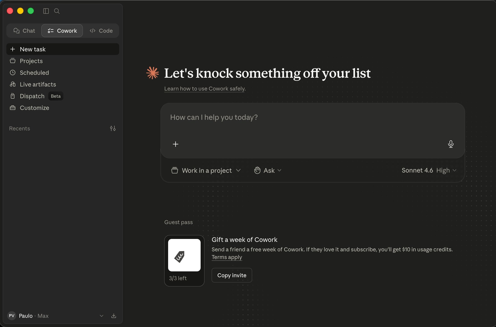

# Thesis

**Claim:** Partiendo del chat de IA que ya usás todos los días, aprendés a extenderlo paso a paso — conectores para que vea tu mundo real, tareas programadas para que trabaje solo — hasta llegar a Claude Cowork, donde ese mismo agente trabaja sobre tus carpetas y archivos y cambia por completo la forma de trabajar: delegás resultados combinando sus piezas (Instrucciones, Projects, archivos .md, Schedule y Live Artifacts) sin escribir una línea de código.

**Why it matters:** El salto de "chatear un mensaje a la vez" a "entregar un resultado y guiarlo" es el cambio de paradigma que vuelve útil a un agente en el trabajo real; quien lo domina automatiza horas de trabajo manual con la barrera de entrada en cero — y el camino empieza en la herramienta que ya tenés abierta.

**Presenter feedback:**

---

# Agenda

**Narrative arc:** Arrancamos por la herramienta que ya usás todos los días — el chat de IA — y hacemos explícitos sus límites: responde de memoria de entrenamiento (1). Después lo extendemos con conectores, un concepto transversal a todas las IAs: de la búsqueda web (el primer conector) al mail y el calendario, y de traer información a *actuar* (2). Con el chat extendido, lo volvemos proactivo con tareas programadas desde el chat (3). Recién ahí damos el salto grande: Claude Cowork, que es mucho más que "Claude instalado en tu computadora" — cambia por completo la forma de trabajar: la interfaz, Instrucciones, Projects, el rol central de los archivos .md, Schedule sobre tus carpetas y Live Artifacts (4). Cerramos con las piezas avanzadas: Skills, Subagentes y Plugins (5). El hilo conductor es una misión concreta — "Atlas", el analista de mercado que se arma pieza por pieza.

**Sections (in delivery order):**

- 1. El chat que ya usás — y sus límites
- 2. Conectores: extender el chat
- 3. Tareas programadas: el chat trabaja solo
- 4. Cowork: cambiar la forma de trabajar
- 5. Advanced: Skills, Subagentes y Plugins

**Presenter feedback:**

---

# 1. El chat que ya usás — y sus límites

**Goal of this section:** Partir de la herramienta que toda la audiencia ya usa a diario — el chat de IA — y hacer explícito su límite estructural: responde desde su memoria de entrenamiento, con todo lo que eso implica (información desactualizada, riesgo de alucinación, cero acceso a tus datos y apps).

**Presenter feedback:**

---

## 1. El chat responde de memoria

### Content

- **Todos ya usan esto.** ChatGPT, Gemini, Claude — el chat de IA ya es parte de tu día. Esta charla arranca exactamente ahí: en la herramienta que ya tenés abierta.
- **Cómo responde el chat "como viene de fábrica":** desde su **memoria de entrenamiento** — una foto de lo que el modelo leyó hasta una **fecha de corte** (knowledge cutoff). No está "buscando" nada cuando le preguntás: está recordando.
- **Lo que eso implica (los tres límites):**
  - **Información vieja.** Todo lo posterior a la fecha de corte no existe para el modelo: precios, noticias, versiones de software, papers recientes.
  - **Riesgo de alucinación.** Cuando no sabe, puede **inventar con confianza** — cifras, citas, referencias que suenan perfectas y son falsas. Por eso toda salida se verifica.
  - **No ve TU mundo.** Tus mails, tu calendario, tus archivos, las apps de tu trabajo: nada de eso está en la memoria de entrenamiento. El chat solo, no puede tocarlos.

```ascii
        EL CHAT "COMO VIENE DE FABRICA"
                                             lo que NO ve:
   +---------------------------------+       x  noticias de hoy
   |            CHAT DE IA           |       x  tus mails
   |  +---------------------------+  |       x  tu calendario
   |  |  MEMORIA DE ENTRENAMIENTO |  |       x  tus archivos
   |  |  (foto congelada hasta la |  |       x  las apps de tu trabajo
   |  |   fecha de corte)         |  |
   |  +---------------------------+  |
   |     responde "de memoria"       |
   +---------------------------------+
```
<!-- ascii-note:
intent: mostrar que el chat de IA sin extensiones responde solo desde su memoria de entrenamiento (foto congelada hasta la fecha de corte) y no tiene acceso al mundo del usuario.
emphasize: la caja interna "MEMORIA DE ENTRENAMIENTO (foto congelada)"; la lista de lo que NO ve (noticias de hoy, mails, calendario, archivos, apps) fuera de la caja.
labels: caja exterior = CHAT DE IA; caja interior = memoria de entrenamiento / fecha de corte; columna derecha = lo que no ve.
-->

### Sources

- Anthropic Support — Enabling and using web search: https://support.claude.com/en/articles/10684626-enabling-and-using-web-search — el encuadre oficial: sin búsqueda web, Claude responde limitado a su información de entrenamiento; la búsqueda le da acceso a información actual (referencia también para la Sección 2).
- (concepto general de LLM: fecha de corte / respuestas desde entrenamiento / alucinaciones — material introductorio estándar del curso; sin claim específico de producto.)

### Speaker notes

Arrancar desde lo conocido: pedir a mano alzada quién usó un chat de IA esta semana — van a ser todos. La idea a instalar: ese chat, tal como viene, responde *de memoria*. Es como un colega brillante que leyó muchísimo hasta una fecha... y desde entonces está incomunicado. Tres consecuencias que ya sufrieron sin saberlo: datos viejos, inventos con cara de verdad (alucinaciones — insistir en verificar), y la más limitante para el trabajo real: no ve nada tuyo. Ese tercer límite es el que abre toda la charla: ¿y si pudiéramos conectarlo? Tiempo objetivo: ~6 min.

### Presenter feedback

---

# 2. Conectores: extender el chat

**Goal of this section:** Instalar el concepto transversal de conector — válido para todas las IAs, no solo Claude: el chat deja de responder solo de memoria y pasa a consultar información real (búsqueda web, mail, calendario) e incluso a actuar (mandar mails, agendar reuniones). Distinción clave: memoria de entrenamiento vs información viva.

**Presenter feedback:**

---

## 1. Chat solo vs chat con conectores

### Content

- **La idea (transversal, no es solo de Claude).** Un **conector** es una extensión que le da al chat acceso a un sistema externo: buscar en la web, leer tu mail, ver tu calendario, consultar tus documentos. Todas las IAs grandes van por este mismo camino — el concepto te sirve para cualquiera que uses.
- **El cambio de régimen:**
  - **Chat solo** → responde de su memoria de entrenamiento (lo de la sección 1).
  - **Chat con conectores** → antes de responder, puede **ir a buscar información real** a la fuente: la web, tu inbox, tu agenda.
- **No es programar.** Los conectores se activan con un clic o un toggle en la configuración del chat — están pensados para el usuario final.

```ascii
   CHAT SOLO                        CHAT CON CONECTORES
+----------------+              +----------------+
|     CHAT       |              |     CHAT       |----> [ web ]
|  responde de   |              |  consulta      |----> [ mail ]
|  memoria de    |              |  fuentes       |----> [ calendario ]
|  entrenamiento |              |  REALES antes  |----> [ documentos ]
+----------------+              |  de responder  |
   (aislado)                    +----------------+
                                  (conectado a tu mundo)
```
<!-- ascii-note:
intent: contrastar lado a lado el chat aislado (responde de memoria de entrenamiento) contra el chat con conectores (consulta fuentes reales — web, mail, calendario, documentos — antes de responder).
emphasize: el lado derecho con las flechas hacia web/mail/calendario/documentos; la etiqueta "(conectado a tu mundo)" vs "(aislado)".
labels: izquierda = CHAT SOLO (aislado, memoria de entrenamiento); derecha = CHAT CON CONECTORES (web, mail, calendario, documentos).
-->

### Sources

- Anthropic Support — Enabling and using web search: https://support.claude.com/en/articles/10684626-enabling-and-using-web-search — la búsqueda web como capacidad integrada del chat de Claude.
- Claude blog — Connectors directory: https://claude.com/blog/connectors-directory — el catálogo oficial de conectores de Claude (referencia ampliada en la slide 2.4; verificado 2026-07-09).

### Speaker notes

Esta slide instala el concepto que ordena toda la sección: conector = extensión que saca al chat de su aislamiento. Subrayar dos veces que es transversal: lo que aprendan acá vale para ChatGPT, para Gemini, para Claude — los nombres cambian ("connectors", "apps", "extensiones"), la idea es la misma. Usar el diagrama para el contraste de régimen: mismo chat, pero ahora con líneas hacia afuera. Y bajar la barrera de entrada de entrada: esto se activa con un clic, no se programa. Tiempo objetivo: ~5 min.

### Presenter feedback

---

## 2. El primer conector: búsqueda web

### Content

- **El conector más universal.** La **búsqueda web** viene integrada en casi todos los chats de IA — Claude, ChatGPT, Gemini — y es el más fácil de activar: un toggle en la configuración (en varios ya viene activo por defecto).
- **LA distinción clave de esta charla** (grabársela):
  - **Responder de memoria** → el modelo *recuerda* lo que leyó hasta su fecha de corte. Puede estar viejo o mal.
  - **Responder con búsqueda / conector** → el modelo **va a buscar información real, ahora**, y te responde citando lo que encontró.
- **Cómo lo notás:** cuando el chat busca, lo muestra ("buscando...") y suele **citar las fuentes**. Esa cita es tu punto de verificación.
- **Regla práctica:** para cualquier pregunta donde la respuesta pueda haber cambiado (precios, noticias, versiones, papers, normativa), activá/exigí búsqueda — no te conformes con la memoria.

```ascii
   la MISMA pregunta: "¿ultima version de X?"

   DE MEMORIA                        CON BUSQUEDA WEB
+------------------+             +------------------+
| entrenamiento    |             | busca AHORA en   |
| hasta fecha de   |             | la web           |
| corte            |             |   |              |
|   |              |             |   v              |
|   v              |             | info REAL y      |
| respuesta        |             | actual + fuentes |
| (quizas vieja o  |             | citadas          |
|  inventada)      |             +------------------+
+------------------+
```
<!-- ascii-note:
intent: contrastar, para una misma pregunta, la respuesta de memoria de entrenamiento (posiblemente vieja o inventada) contra la respuesta con búsqueda web (información real y actual, con fuentes citadas).
emphasize: que es la MISMA pregunta con dos caminos; el lado derecho termina en "info REAL y actual + fuentes citadas"; el lado izquierdo en "quizás vieja o inventada".
labels: izquierda = DE MEMORIA (fecha de corte); derecha = CON BÚSQUEDA WEB (busca ahora, cita fuentes).
-->

### Sources

- Anthropic Support — Enabling and using web search: https://support.claude.com/en/articles/10684626-enabling-and-using-web-search — "Web search expands Claude's knowledge with real-time data"; "Every response includes citations, so you can easily verify sources yourself" (verificado 2026-07-09).
- OpenAI Help — ChatGPT search: https://help.openai.com/en/articles/9237897-chatgpt-search — búsqueda web integrada en ChatGPT, automática cuando la pregunta lo amerita, con citas inline (evidencia de que el concepto es transversal; verificado 2026-07-09).

### Speaker notes

Esta es la slide para martillar LA distinción de la charla: memoria vs información viva. Hacerlo con una demo de 2 minutos si hay conexión: la misma pregunta ("¿cuál es la última versión de X?" o "¿qué pasó ayer con Y?") con búsqueda apagada y prendida, y comparar. Señalar el indicador de "buscando..." y las fuentes citadas — enseñarles a mirar eso siempre. La regla práctica que se llevan: si la respuesta pudo haber cambiado desde el entrenamiento, exigí búsqueda. Es el primer conector porque es el más fácil: ya lo tienen, solo hay que saber cuándo está actuando. Tiempo objetivo: ~7 min (con demo).

### Presenter feedback

---

## 3. Conectores y MCP: las "manos" del chat

### Content

- **Qué son los conectores (más allá de la web).** Son lo que le permite al chat tocar sistemas que de otro modo no podría: Drive, Gmail, Calendar, Slack, bases de datos, APIs. "Las manos: lo que la IA puede tocar que de otro modo no podría."
- **Qué es MCP (Model Context Protocol).** El estándar detrás de los conectores de Claude: una forma estandarizada de conectar la IA con sistemas externos. Cualquier app que exponga un servidor MCP se vuelve algo con lo que podés "hablar" (Figma, Vercel, Cal.com, Home Assistant…). El patrón: la plataforma abre sus internals como herramientas; la IA no gana una capacidad nueva, **la plataforma se vuelve conversacional**.
- **Se pueden desarrollar conectores propios** (custom connectors, vía MCP) — existe y es accesible para un equipo técnico, pero no lo desarrollamos acá: a nivel usuario alcanza con el directorio (próxima slide).
- En la próxima slide vemos **de dónde salen y cómo se conectan** en la práctica (directorio + un clic).

```ascii
+--------+   pide datos    +-----------+   protocolo   +--------------+
| CHAT / | --------------> | Connector |  -- MCP -->   | Servicio ext |
| agente |                 |  (1 clic) |               | Gmail/Calendar|
+--------+ <-------------- +-----------+ <-----------  +--------------+
            devuelve datos
```
<!-- ascii-note:
intent: mostrar el flujo de una llamada a un Connector: el chat/agente pide datos, el Connector traduce vía el protocolo MCP, el servicio externo responde.
emphasize: la etiqueta "MCP" sobre la flecha del medio; el Connector como puente de un clic.
labels: Chat/agente -> Connector (1 clic) -> Servicio externo (Gmail / Calendar); flecha de ida "pide datos", flecha de vuelta "devuelve datos".
-->

### Sources

- corpus/agentic-ai-deck.zip.md — definición de Connector (MCP): "The hands"; slide 5.4 (rango de MCP; "any app that exposes an MCP server").
- "corpus/mision - auto.zip.md" — MT Newswires "ya tiene un connector listo" (Step 2.1); Gmail connector de un clic (M3).
- Model Context Protocol (sitio oficial del estándar): https://modelcontextprotocol.io — qué es MCP y cómo las plataformas exponen herramientas; base de los conectores personalizados.
- Anthropic Support — Getting started with custom connectors using remote MCP: https://support.claude.com/en/articles/11175166-getting-started-with-custom-connectors-using-remote-mcp — los conectores personalizados existen y se agregan vía MCP (mención, sin profundizar).

### Speaker notes

Desarmar el miedo: conectar un servicio externo no es programar — es darle "manos" al chat. Usar el diagrama para explicar qué pasa por debajo: la IA pide datos, el conector los trae vía el protocolo MCP. MCP es el estándar que hace que cualquier plataforma con API pueda volverse conversacional — mencionar dos o tres ejemplos del ecosistema y seguir. Dejar caído al pasar que un equipo técnico puede desarrollar conectores propios (custom, vía MCP) — existe, no lo vemos hoy. Los ejemplos guía de la sección son **mail y calendario**, porque son los que todos tienen. Tiempo objetivo: ~8 min.

### Presenter feedback
- [closed] 2026-06-09 — "Esto - **Cómo se llama / registra un Connector.** En Cowork hay un **directorio de Connectors** con conexión de un clic ("Connect"), configurado por la UI de Settings — no hay archivo local que editar. Ejemplo (Atlas): **MT Newswires** ya tiene un connector listo; lo buscás y le das Connect, como cualquier app. Gmail, igual: un clic en el directorio. vamos a moverlo a un nuevo slide."
  Resolution: SPLIT: el bloque 'Como se llama/registra un Connector' se movio de 4.1 a una nueva slide 4.2 'Como se registra un Connector' (directorio de Connectors, conexion de un clic 'Connect', ejemplo MT Newswires + Gmail). Cableadas las dos imagenes nuevas images/connectors_directory.png y images/connector_browser.png. 4.1 queda con lo conceptual (Connectors + MCP) y un puntero a la slide siguiente; Schedule renumerada 4.2->4.3.
  - Added two images to include in this slide: connectors_directory.png & connector_browser

---

## 4. El directorio de conectores: mail, calendario y compañía

### Content

- **No estás programando: te conectás.** Registrar un conector es como conectar Gmail a una app nueva — buscás el servicio en un **directorio** y le das **Connect**. Configurado por la UI; no hay archivo local que editar.
- **De dónde salen los conectores:**
  - **El directorio oficial de Claude** — un catálogo curado de conectores listos para conectar de un clic.
  - **Conectores no oficiales / de la comunidad** — servicios de terceros que exponen MCP; mismos pasos, criterio extra: conectá solo lo que sea de confianza.
  - *(Mención: también se pueden **desarrollar conectores propios** — lo dijimos en la slide anterior, no profundizamos.)*


- **Conexión de un clic.** Buscás el servicio, le das **Connect** y autorizás — y queda disponible para el chat:


- **Los ejemplos guía: mail y calendario.** Con **Gmail** conectado, el chat puede leer y resumir tu inbox; con **Calendar**, ver tu agenda. ("¿Qué tengo esta semana? ¿Qué mails importantes me perdí ayer?") — preguntas que el chat solo *jamás* podría responder.
- **Ejemplo (Atlas).** **MT Newswires** (noticias de mercado) ya tiene un connector listo: lo buscás y le das Connect, como cualquier app. Con eso, Atlas pasa a leer noticias reales del día — sin que vos programes nada.

### Sources

- Claude blog — Discover tools that work with Claude (Connectors directory): https://claude.com/blog/connectors-directory — anuncio oficial del directorio; navegar y conectar de un clic vía claude.ai/directory (verificado 2026-07-09; el directorio en sí requiere login).
- Anthropic Support — Use connectors to extend Claude's capabilities: https://support.claude.com/en/articles/11176164-use-connectors-to-extend-claude-s-capabilities — cómo se conectan y usan los conectores desde la configuración.
- corpus/agentic-ai-deck.zip.md — matriz 5.6 (Connectors configurados por la Settings UI; directorio + un clic).
- "corpus/mision - auto.zip.md" — MT Newswires "ya tiene un connector listo" (Step 2.1); Gmail connector de un clic (M3); "no estás programando: te conectás a un servicio que ya existe".
- Anthropic Support — Getting started with custom connectors using remote MCP: https://support.claude.com/en/articles/11175166-getting-started-with-custom-connectors-using-remote-mcp — la vía de los conectores no oficiales / propios.

### Speaker notes

Slide práctica: mostrar las dos capturas — el directorio de conectores y la pantalla de conexión — para desarmar el miedo de "esto es técnico". El mensaje es: conectar un servicio es buscar + Connect + autorizar, igual que cuando conectás Gmail a cualquier app. Insistir en los dos ejemplos guía de la sección, mail y calendario, porque son los que toda la audiencia tiene y va a usar mañana mismo. Sobre los no oficiales: mismos pasos, pero criterio — autorizar un conector es darle acceso a tus datos, conectá solo lo confiable. Ejemplo de la misión: MT Newswires (noticias). Nota: las capturas son de la app de Claude (Cowork); el flujo buscar+Connect es el mismo concepto en el chat. Tiempo objetivo: ~6 min.

### Presenter feedback

---

## 5. Los conectores también actúan: del leer al hacer

### Content

- **Hasta acá, los conectores traían información.** Pero la mitad del valor está del otro lado: un conector también puede exponer **acciones** — y entonces la IA no solo consulta: **hace**.
- **Capacidad ejecutiva — ejemplos:**
  - **Mandar (o dejar redactado) un mail** — el chat escribe el borrador en tu Gmail, listo para revisar y enviar.
  - **Agendar una reunión** — crear el evento en tu calendario con invitados y horario.
  - **Abrir un ticket** — en tu sistema de gestión (Jira, ServiceNow, etc.).
  - **Mandar un mensaje** — a un canal de Slack o similar.
- **Con control.** Las acciones pasan por tu **autorización**: conectaste el servicio vos, y las acciones sensibles se revisan/aprueban. La buena práctica: preferí "dejar borrador" a "enviar directo" mientras aprendés.
- **Por qué importa:** este es el pre-anuncio del resto de la charla — si el chat puede *informarse* y *actuar*, el paso siguiente es que trabaje **solo** (tareas programadas, sección 3) y sobre **tus archivos** (Cowork, sección 4).

```ascii
        CONECTOR: dos direcciones

   LEER (traer info)          ACTUAR (hacer)
   <------------------        ------------------>
+------+           +----------+           +----------+
| CHAT |  <------- | conector |  ------>  | tu mundo |
+------+   inbox,  +----------+  mandar   | mail     |
           agenda,              mail,     | calendario|
           noticias             agendar,  | tickets  |
                                ticket    | mensajes |
                                          +----------+
```
<!-- ascii-note:
intent: mostrar que un conector funciona en dos direcciones: leer (traer información: inbox, agenda, noticias) y actuar (ejecutar acciones: mandar mail, agendar reunión, abrir ticket, mandar mensaje).
emphasize: las dos flechas opuestas LEER vs ACTUAR sobre el mismo conector; que ACTUAR es la capacidad ejecutiva nueva de esta slide.
labels: izquierda = CHAT; centro = conector; derecha = tu mundo (mail, calendario, tickets, mensajes); flecha de lectura y flecha de acción.
-->

### Sources

- Model Context Protocol — https://modelcontextprotocol.io — el estándar define herramientas que ejecutan acciones sobre sistemas externos, no solo lectura: "AI applications ... which can access your data and take actions on your behalf" (verificado 2026-07-09).
- Anthropic Support — Getting started with custom connectors using remote MCP: https://support.claude.com/en/articles/11175166-getting-started-with-custom-connectors-using-remote-mcp — los conectores permiten a Claude "access and take action in these services" (verificado 2026-07-09).
- "corpus/mision - auto.zip.md" — el connector de Gmail **deja un borrador de correo** para el equipo (capacidad ejecutiva en acción, M3 y loop final).
- Verificación de primera mano del presentador (2026-07-09): la acción de **agendar/crear eventos vía el connector de Calendar** está chequeada y funciona.
- corpus/agentic-ai-deck.zip.md — Connectors como "las manos" del agente (tocar sistemas, no solo leerlos).

### Speaker notes

El giro de la sección: hasta acá el conector era una antena (traer info); ahora es una mano (actuar). Recorrer los cuatro ejemplos ejecutivos — mail, reunión, ticket, mensaje — que son universales en cualquier trabajo. Dos de los cuatro están verificados de primera mano: el borrador de Gmail (misión Atlas) y agendar por Calendar (chequeado por el docente — se puede demostrar en vivo). Para tickets y mensajes, presentarlos como capacidad del ecosistema (el estándar MCP y los conectores lo permiten) sin prometer un conector puntual que no probamos. Balancear con el control: nada de esto pasa sin que hayas conectado y autorizado el servicio, y la práctica sana mientras aprenden es "borrador, no envío directo" (el ejemplo de Atlas hace exactamente eso: deja el borrador en Gmail, no lo manda). Cerrar sembrando lo que viene: una IA que se informa y actúa, más una agenda... es una IA que puede trabajar sola — puente directo a la sección 3. Tiempo objetivo: ~6 min.

### Presenter feedback

---

# 3. Tareas programadas: el chat trabaja solo

**Goal of this section:** Que la audiencia entienda qué es una tarea programada — describir un trabajo una vez, fijar una cadencia y que corra solo — y cómo se potencia combinada con conectores (ej.: el resumidor semanal de mails), todavía desde el mundo del chat.

**Presenter feedback:**

---

## 1. Tareas programadas desde el chat

### Content

- **Qué es.** Una **tarea programada** es un pedido que describís **una sola vez** + una **cadencia** (diaria, semanal, a demanda). El chat la corre solo cuando toca y te avisa con el resultado. Pasás de "preguntar cada vez" a "suscribirte a una respuesta".
- **La combinación poderosa: tarea programada + conectores.** La tarea corre con los mismos conectores que ya configuraste — puede buscar en la web, leer tu mail, mirar tu agenda.
- **El ejemplo canónico: el resumidor de mails.** "Todos los días a las 8:00, leé mi inbox de las últimas 24 h y dejame un resumen con lo urgente arriba." Una vez escrito, tu resumen aparece solo, cada mañana.
  - Variante semanal: "los lunes a las 8:00, resumime la semana del calendario + los mails sin responder."
- **Transversal, otra vez — y Claude ya las tiene en el chat.** Las tareas programadas existen en los principales chats de IA:
  - **ChatGPT** las ofrece como "tasks" (recordatorios, briefings diarios, monitoreo).
  - **Claude**: tareas programadas disponibles **en claude.ai, desde el navegador** — y **corren en la nube**: no hace falta tener la computadora prendida ni ninguna app abierta. En beta, rollout gradual desde julio 2026 empezando por el plan Max.
  - En Cowork (sección 4) las volvemos a ver, ahora sobre tus carpetas y archivos — el concepto es el mismo.

```ascii
        TAREA PROGRAMADA (se describe UNA vez)

  [reloj: lunes 8:00]
        |
        v
  +-----------+   usa conectores   +--------------+
  |  la tarea | -----------------> | mail / web / |
  |  corre    | <----------------- | calendario   |
  |  sola     |    trae la info    +--------------+
  +-----------+
        |
        v
  resumen listo en tu chat, cada semana,
  sin que lo pidas de nuevo
```
<!-- ascii-note:
intent: mostrar el ciclo de una tarea programada: un disparador de calendario (lunes 8:00) ejecuta la tarea, que usa los conectores (mail/web/calendario) para traer información y deja el resultado listo sin intervención del usuario.
emphasize: que se describe UNA vez y corre sola; el reloj como disparador; el uso de conectores dentro de la corrida; el resultado que "aparece" cada semana.
labels: reloj (cadencia) -> la tarea corre sola -> conectores (mail/web/calendario) -> resumen listo en tu chat.
-->

### Sources

- OpenAI Help — Tasks in ChatGPT: https://help.openai.com/en/articles/10291617-tasks-in-chatgpt — tareas programadas en el chat de ChatGPT (evidencia transversal del concepto; verificado 2026-07-09).
- Anthropic Support — Release notes (entrada del 7 de julio de 2026): https://support.claude.com/en/articles/12138966 — "scheduled tasks run with no device online"; sesiones remotas (beta); rollout empezando por Max (verificado 2026-07-09).
- Observación de primera mano del presentador (2026-07-09): tareas programadas activas en claude.ai en el navegador.
- TechCrunch (2026-07-07) — "The coding agent wars are spilling into the rest of the office": https://techcrunch.com/2026/07/07/the-coding-agent-wars-are-spilling-into-the-rest-of-the-office-claude-cowork/ — cobertura de prensa: expansión a web/mobile, corridas en background sin dispositivo activo, rollout Max (encuadre de terceros).
- Anthropic Support — Schedule recurring tasks in Claude Cowork: https://support.claude.com/en/articles/13854387-schedule-recurring-tasks-in-claude-cowork — la forma Cowork (se desarrolla en la sección 4).
- "corpus/mision - auto.zip.md" — el flujo programado de Atlas (Step 3.3): la semilla del "resumidor que corre solo".

### Speaker notes

Slide-concepto único de la sección, y el último peldaño antes de Cowork. La idea con sus dos mitades: (1) describís el trabajo una vez + cadencia → corre solo; (2) la tarea hereda tus conectores, y ahí está la magia — el ejemplo del resumidor de mails es imbatible porque todos tienen un inbox desbordado. Contarlo en primera persona si es posible ("mi resumen de las 8:00"). Marcar la transversalidad: ChatGPT lo llama "tasks", y Claude ya las ofrece en claude.ai desde el navegador — si el rollout lo permite, mostrarlas EN VIVO desde la cuenta del docente (el presentador ya las usa). El detalle que vale la pena decir: en Claude corren EN LA NUBE — no hace falta la computadora prendida (desde el update del 7 de julio de 2026; beta, empezando por Max — aclarar que puede no estar disponible aún en todos los planes de la audiencia). En la próxima sección las vemos de nuevo, sobre carpetas y archivos de verdad. Tiempo objetivo: ~7 min.

### Presenter feedback

---

# 4. Cowork: cambiar la forma de trabajar

**Goal of this section:** El salto grande de la charla: Cowork es mucho más que "Claude instalado en tu computadora" — cambia por completo la forma de trabajar. Ubicar las tres superficies de Claude, internalizar el paso de chatear a delegar resultados, y dominar las piezas del día a día: interfaz, Instrucciones, Projects, el rol central de los archivos .md, Schedule sobre tus carpetas y Live Artifacts.

**Presenter feedback:**

---

## 1. Las tres superficies de Claude

### Content

- **Ya extendiste el chat** — conectores, tareas programadas. Ahora, el salto: ¿qué pasa cuando esa misma IA baja a tu computadora y trabaja sobre tus carpetas y archivos? Para eso hay que ubicar el mapa de superficies.
- Mismos modelos, distinta superficie: las tres caras — **Web/Chat**, **Claude Code** y **Cowork** — corren sobre **los mismos modelos Claude**. El matiz importa: **Cowork está construido sobre las mismas bases que Claude Code** (el **Claude Agent SDK**), así que Code y Cowork comparten el mismo *engine de agente* — los mismos archivos, las mismas Skills, el mismo MCP y el mismo loop de plan → aprobar → redirigir. **Web/Chat** es ese mismo modelo en una **superficie de chat**, no el loop agéntico completo.
- **Web/Chat** — navegador o app, sin instalar; chat, preguntas y tareas puntuales; público: todos. **Es donde estuvimos hasta ahora.**
- **Claude Code** — app de escritorio (pestaña Code + terminal); escribir, editar y publicar código; público: perfiles técnicos / developers.
- **Cowork** — app de escritorio (pestaña Cowork), GUI sin terminal; trabajo de varios pasos sobre archivos reales; público: knowledge workers sin terminal. **El resto de la charla vive acá.**

```ascii
+----------------+   +----------------+   +----------------+
|   Web / Chat   |   |  Claude Code   |   |     Cowork     |
| superficie de  |   | terminal+Code  |   |  GUI, escritorio|
|   chat         |   | escribir codigo|   | trabajo multipaso|
+----------------+   +----------------+   +----------------+
        |              \________  ________/
        |                  Agent SDK (engine de agente)
        |                  archivos / Skills / MCP / loop
        \________________   |   ________________/
                         \  |  /
                  +--------------------+
                  | MISMOS MODELOS     |
                  |     CLAUDE         |
                  +--------------------+
```
<!-- ascii-note:
intent: mostrar que las tres superficies corren sobre los mismos modelos Claude, y que Code+Cowork además comparten el mismo engine de agente (Claude Agent SDK), mientras Web/Chat es la superficie de chat de ese modelo.
emphasize: la caja base "MISMOS MODELOS CLAUDE" como cimiento de las tres; el lazo "Agent SDK" que une Claude Code y Cowork (no Web/Chat); resaltar Cowork como el foco de la charla.
labels: tres columnas (Web/Chat = chat, Claude Code y Cowork = Agent SDK) sobre una base de modelos Claude compartida.
-->

### Sources

- corpus/agentic-ai-deck.zip.md — "Same engine. Different surface." (key claims; slide 7.1 "Claude Code vs Cowork — the close").
- "corpus/mision - auto.zip.md" — framing de arquitectura Cowork (local, GUI, sin terminal).
- Anthropic — Claude Cowork (product page): https://www.anthropic.com/product/claude-cowork — "built on the very same foundations as Claude Code" (confirma que Cowork comparte base con Claude Code).
- Anthropic Engineering — Building agents with the Claude Agent SDK: https://www.anthropic.com/engineering/building-agents-with-the-claude-agent-sdk — el engine de agente común (Agent SDK) sobre el que se construyen Claude Code y Cowork.

### Speaker notes

Abrir la sección conectando con el recorrido: "hasta acá, todo pasó en la superficie de chat — ahora cambiamos de superficie". No son tres productos distintos, es el mismo agente con tres caras; lo único que cambia es la superficie y para quién está pensada. Dejar claro que el resto de la charla vive en Cowork — la cara pensada para quien no vive en una terminal. Claude Code aparece solo como contraste; no vamos a entrar en sus internals. Tiempo objetivo: ~5 min.

### Presenter feedback

- [closed] 2026-06-08 — "No estoy tan seguro si es correcto que es el mismo motor. Hhay distintos motores agenticos que empujan todo. Revisar esto y conformarlo con fuentes."
  Resolution: Claim verificado y precisado: las tres superficies comparten los mismos modelos Claude; Claude Code y Cowork comparten el engine de agente (Claude Agent SDK, Cowork está construido sobre las bases de Claude Code); Web/Chat es ese modelo en superficie de chat. Reescrito el primer bullet de Content y el ASCII (base = MISMOS MODELOS CLAUDE + lazo Agent SDK Code↔Cowork) y ascii-note; añadidas dos fuentes externas de Anthropic.

---

## 2. El superpoder de Cowork: la herramienta de propósito general del knowledge worker

### Content

- **Cowork no es "Claude instalado en tu computadora".** Es mucho más: **cambia por completo la forma de trabajar** — dejás de operar una herramienta y pasás a dirigir a un colega que trabaja sobre tus carpetas y archivos reales.
- **La idea grande.** **Cowork** es la **herramienta de propósito general del knowledge worker** — de quien *no* programa. No un asistente de una tarea puntual: una herramienta horizontal para casi cualquier trabajo de conocimiento. Sin base técnica: el "lenguaje de programación" es el español.
- **La analogía que "pega" — "el nuevo Excel"** *(encuadre de analistas / industria, no un claim de Anthropic).* Así como Excel fue ~40 años la habilidad base del trabajo de oficina, las herramientas agénticas apuntan a ser **la nueva habilidad base**.
- **El encuadre oficial de Anthropic:** Cowork como **"Claude Code para el resto de tu trabajo"**.
- **Por qué te importa (bioingeniería).** La habilidad base del trabajo del conocimiento se redefine ahora; llegar temprano es ventaja concreta y portable.

```ascii
TRABAJO DE OFICINA: la herramienta de proposito general

 ~40 anios                              ahora
+----------------------+    ===>    +-----------------------------+
| EXCEL                |            | HERRAMIENTAS AGENTICAS      |
| lingua franca del    |            | Claude Code  (developers)   |
| trabajo de oficina   |            | Cowork       (knowledge     |
| (sin programar)      |            |               worker)       |
+----------------------+            +-----------------------------+
 la habilidad base de ayer           la nueva habilidad base
```
<!-- ascii-note:
intent: encuadrar el "superpoder" de Cowork como herramienta de propósito general del knowledge worker, usando la analogía Excel (40 años, habilidad base de oficina) -> herramientas agénticas (Claude Code para developers, Cowork para knowledge workers) como la nueva habilidad base.
emphasize: la flecha temporal de Excel (ayer) a las herramientas agénticas (ahora); el paralelo Claude Code=developers / Cowork=knowledge worker; que la analogía Excel es encuadre de industria, no claim oficial.
labels: dos cajas — EXCEL (lingua franca, sin programar) a la izquierda; HERRAMIENTAS AGENTICAS (Claude Code = developers, Cowork = knowledge worker) a la derecha; pie "habilidad base de ayer" -> "nueva habilidad base".
-->

### Sources

- corpus/agentic-ai-deck.zip.md — posicionamiento Cowork vs Claude Code ("Same engine. Different surface."; Cowork = la cara para knowledge workers sin terminal; slide 7.1 "Claude Code vs Cowork — the close").
- Anthropic — Claude Cowork (product page): https://www.anthropic.com/product/claude-cowork — encuadre oficial: Cowork como "Claude Code para el resto de tu trabajo"; construido sobre las mismas bases que Claude Code.
- Claude blog — Cowork research preview ("Claude Code power for knowledge work"): https://claude.com/blog/cowork-research-preview — la ambición de llevar el poder de Claude Code al trabajo del conocimiento; Cowork generaliza un éxito probado primero con developers.
- CNBC — Anthropic's Claude Cowork targets the office worker: https://www.cnbc.com/2026/02/24/anthropic-claude-cowork-office-worker.html — encuadre de público general / office worker.
- "Claude Code is the New Excel" (ensayo de analista): https://nextword.substack.com/p/claude-code-is-the-new-excel — origen de la analogía del "nuevo Excel" (atribuir AQUÍ, NO a Anthropic).

### Speaker notes

Este es el beat de "¿y a mí por qué me importa?". Abrir con el mensaje que pidió el presentador, en esas palabras: Cowork NO es "Claude instalado en tu computadora" — es un cambio completo en la forma de trabajar. Hasta acá la audiencia extendió un chat; esta slide les dice que lo que viene es otra categoría de herramienta. Tono motivacional y de alto nivel — la mecánica viene después.

El gancho que mejor funciona es la analogía del Excel, pero hay que decirla con cuidado: durante unas cuatro décadas, saber Excel fue *la* habilidad base del trabajo de oficina — no programabas, pero con Excel resolvías el 80% del trabajo de conocimiento. La tesis de varios analistas de la industria es que las herramientas agénticas (Claude Code para los que programan, Cowork para los que no) están en camino de ser esa nueva habilidad base. Atribuirlo explícitamente como encuadre de analistas/industria — "hay quien lo llama el nuevo Excel" — y NO como un claim oficial de Anthropic.

Lo que sí es de Anthropic, y conviene citarlo como su framing propio, es "Claude Code para el resto de tu trabajo": la idea de que cualquier knowledge worker sienta con Cowork lo que los ingenieros ya sienten con Claude Code. Subrayar que Cowork no salió de la nada — es la generalización de algo que ya funcionó muy bien primero con developers.

Cerrar aterrizándolo en la audiencia: ellos son ingenieros biomédicos, no necesariamente developers, y exactamente por eso esto les sirve — la habilidad base del trabajo del conocimiento se está redefiniendo ahora mismo, y llegar temprano es ventaja. Después de este beat motivacional pasamos a la mecánica: cómo se delega de verdad (próxima slide). Tiempo objetivo: ~4-5 min.

### Presenter feedback

- [closed] 2026-06-09 — "El contenido esta bien pero es mucho texto, necesitamos hacerla mas compacto. No pierdas el core."
  Resolution: Compactado el Content de 1.2 al core (Cowork = herramienta de proposito general del knowledge worker / 'Claude Code para el resto de tu trabajo'; analogia 'nuevo Excel' atribuida a analistas; por que importa para bioingenieria), reduciendo de 5 bullets largos a 4 concisos. El detalle de soporte (publico, paralelo developers, 'nacido generalizando') ya vive en Speaker notes. Visual ASCII conservado.
---

## 3. De chat a agente: el cambio de paradigma

### Content

- **El puente.** Ya extendiste el chat: conectores para que vea tu mundo, tareas programadas para que corra solo. El salto que falta es de *rol*: dejar de chatear y empezar a **delegar**.
- La frase que resume toda la sesión: **"Dejás de tipear un mensaje a la vez y empezás a entregar un resultado."** El agente lo planifica, trabaja sobre tus archivos reales, y vos lo guiás — en lugar de hacer cada paso vos mismo.
- Cómo lo describe la propia Anthropic: trabajar con Cowork *"se parece menos a una sesión de chat y más a asignarle tareas a un colega"* ("less like a chat session and more like assigning tasks to a colleague"). Esa es exactamente la mudanza de paradigma de esta slide.
- Chatear vs delegar (no son dos productos, son dos formas de trabajar):

| | Chatear | Delegar a un agente |
|---|---|---|
| Cómo trabajás | Un mensaje a la vez | Describís un resultado |
| Los pasos | Los hacés vos | El agente planifica y ejecuta |
| La salida | Texto en la ventana | Archivos en tu disco |
| Tu rol | Tipear el próximo prompt | Leer el plan, guiar a mitad de camino |

```ascii
ANTES (chat)                    AHORA (agente / Cowork)
+----------+                    +------------------------+
| vos: msg | --> respuesta      | vos: "entrega X"       |
| vos: msg | --> respuesta      |        |               |
| vos: msg | --> respuesta      |        v               |
| vos: msg | --> respuesta      | agente: planifica      |
+----------+                    | agente: toca archivos  |
 paso a paso, lo hacés vos      | vos: leés y guiás      |
                                +------------------------+
                                 entregás un resultado
```
<!-- ascii-note:
intent: contrastar el modo "chat" (un mensaje a la vez, vos hacés cada paso) contra el modo "agente" (delegás un resultado, el agente planifica y ejecuta sobre tus archivos).
emphasize: la flecha de paradigma de izquierda (ANTES) a derecha (AHORA); que en AHORA el agente hace el trabajo y vos guiás.
labels: ANTES (chat) vs AHORA (agente / Cowork).
-->

### Sources

- corpus/agentic-ai-deck.zip.md — "Stop prompting. Start delegating." (slide 2.3 the reframe); tabla "Chatting vs Delegating" (slide 3.16).
- "corpus/mision - auto.zip.md" — "el verdadero premio no es Atlas: sos vos, dominando Claude Cowork"; "Conversá, no programes."
- Anthropic — Claude Cowork (product page): https://www.anthropic.com/product/claude-cowork — refuerza el paradigma: trabajar con Cowork "se parece menos a una sesión de chat y más a asignarle tareas a un colega".
- (técnico, opcional) Anthropic Engineering — Building agents with the Claude Agent SDK: https://www.anthropic.com/engineering/building-agents-with-the-claude-agent-sdk — por qué el loop plan→ejecutar→guiar es lo que define a un agente frente a un chat.

### Speaker notes

Este es el concepto-ancla de la charla. Conectarlo con el recorrido: los conectores y las tareas programadas ya eran pasos hacia acá — extendieron *qué* puede hacer el chat; el agente cambia *tu rol*. Si se llevan una sola idea, que sea esta: el valor no está en escribir mejores mensajes, está en aprender a delegar un resultado y guiar el proceso. Usar la tabla para hacerlo concreto: la salida deja de ser texto en una ventana y pasa a ser archivos reales en tu disco. Anticipar la misión: vamos a "contratar" a Atlas, un analista de mercado virtual, y entrenarlo una vez para que después trabaje solo. Como cierre del concepto, citar el framing de la propia Anthropic — "menos una sesión de chat, más asignarle tareas a un colega" — para reforzar que esto no es marketing nuestro sino la forma en que el producto está pensado. Tiempo objetivo: ~5 min.

### Presenter feedback

- [closed] 2026-06-08 — "Existe algin ling adicional que podriamos poner que refuerze este paradigma ?"
  Resolution: Añadidas referencias externas que refuerzan el paradigma de delegación: cita de la product page de Cowork ('menos una sesión de chat, más asignarle tareas a un colega') como bullet quotable en Content y como remate en Speaker notes, más el enlace de Anthropic Engineering sobre el Agent SDK. Ambas sumadas a Sources.

---

## 4. El mapa de la charla: bloques que se apilan

### Content

- **La idea.** Todo lo de hoy se aprende como **bloques que se apilan**: cada bloque resuelve un problema concreto y recurrente, y al sumarse vuelven a la IA cada vez más rica y autónoma. **Importante:** no son una escalera estricta — usás solo los que tu tarea necesita; se combinan, no se exigen unos a otros.
- **Este es el mapa de toda la charla — y ya recorrimos los primeros tres.** Volvé a esta slide como "estamos acá" cuando quieras ubicarte.
- **Cada bloque = un problema que ya tuviste:**
  - **El chat** *(visto, sección 1)* → *respondía solo de memoria.*
  - **Conectores** *(visto, sección 2)* → *quiero información real de mis herramientas — y que actúe.*
  - **Tareas programadas** *(visto, sección 3)* → *quiero que corra solo.*
  - **Cowork: carpetas y archivos** *(estamos acá)* → *quiero que trabaje sobre mis archivos reales.*
  - **Instrucciones** → *no quiero repetir el contexto en cada prompt.*
  - **Projects** → *quiero guardar y organizar todo en un lugar fijo.*
  - **Archivos .md** → *quiero que la IA entienda y edite mi material de trabajo.*
  - **Live Artifacts** → *quiero compartir el resultado vivo.*
  - **Skills / Subagentes** *(avanzado, sección 5)* → *no quiero repetir la misma tarea / quiero delegar en paralelo.*
- **Plugins, transversal.** Hay una pieza que no es un bloque más en la pila: los **Plugins** son la **capa transversal de distribución** — empaquetan y reparten Skills, agentes y connectors a todos a la vez. La vemos al final (sección 5).

```ascii
+============== PLUGINS (capa transversal: empaquetan y distribuyen) ==============+
||                                                                                ||
||  +----------------------+  "quiero compartir el resultado vivo"                ||
||  | LIVE ARTIFACTS       |                                                      ||
||  +----------------------+                                                      ||
||  +----------------------+  "no quiero repetir la tarea / delegar en paralelo"  ||
||  | SKILLS / SUBAGENTES  |  (avanzado, seccion 5)                               ||
||  +----------------------+                                                      ||
||  +----------------------+  "quiero que la IA entienda mi material"             ||
||  | ARCHIVOS .MD         |                                                      ||
||  +----------------------+                                                      ||
||  +----------------------+  "contexto fijo + todo en un lugar"                  ||
||  | INSTRUCCIONES +      |                                                      ||
||  | PROJECTS             |                                                      ||
||  +----------------------+                                                      ||
||  +----------------------+  "quiero que trabaje sobre mis archivos"   <== ACA   ||
||  | COWORK: carpetas     |                                                      ||
||  +----------------------+                                                      ||
||  +----------------------+  "quiero que corra solo"                   (visto)   ||
||  | TAREAS PROGRAMADAS   |                                                      ||
||  +----------------------+                                                      ||
||  +----------------------+  "quiero info real + que actue"            (visto)   ||
||  | CONECTORES           |                                                      ||
||  +----------------------+                                                      ||
||  +----------------------+  "respondia solo de memoria"               (visto)   ||
||  | EL CHAT              |                                                      ||
||  +----------------------+                                                      ||
+==================================================================================+
   los bloques se apilan (cada uno suma autonomia); PLUGINS los distribuye a todos
```
<!-- ascii-note:
intent: presentar el arco completo de la charla como bloques que se apilan (no una pirámide/escalera estricta): el chat (base) -> conectores -> tareas programadas -> Cowork (carpetas/archivos) -> Instrucciones+Projects -> archivos .md -> Skills/Subagentes -> Live Artifacts, con Plugins como BANDA TRANSVERSAL que envuelve/distribuye todo. Los tres bloques de abajo están marcados "(visto)" y el bloque Cowork lleva el marcador "estamos acá".
emphasize: el marcador "<== ACÁ" en el bloque Cowork; los "(visto)" en chat/conectores/tareas programadas; que Plugins es transversal (banda que rodea la pila, distinto color), NO un nivel más; el par bloque↔problema en cada nivel.
labels: banda exterior = PLUGINS (capa transversal, distribución). Bloques apilados (base→cima): El chat · Conectores · Tareas programadas · Cowork: carpetas · Instrucciones+Projects · Archivos .md · Skills/Subagentes · Live Artifacts, cada uno con su frase-problema a la derecha.
-->

### Sources

- corpus/agentic-ai-deck.zip.md — progresión de building blocks del deck (Instrucciones → Projects → Skills → Connectors/MCP → Schedule → Live Artifacts); la idea de "pila" es la lectura ordenada de esa progresión, re-secuenciada al arco chat-primero de esta charla.
- "corpus/mision - auto.zip.md" — la misión Atlas arma estas piezas una por una.

### Speaker notes

Esta slide es el mapa de toda la sesión, actualizado al nuevo arco: ya no arranca en Cowork — arranca en el chat que todos usan. Aprovechar el efecto acumulado: "los tres bloques de abajo ya los recorrimos" (chat → conectores → tareas programadas), y señalar el marcador de "estamos acá": Cowork, donde la IA empieza a trabajar sobre carpetas y archivos reales. El gancho sigue siendo el problema, no la feature: cada bloque nace de una frustración concreta.

Cuidado con la metáfora: NO es una pirámide donde cada capa depende de todas las de abajo. Son bloques que se apilan y se combinan — usás solo los que tu tarea necesita.

Decir explícitamente la promesa de roadmap: "lo que queda de la charla recorre los bloques de acá para arriba, en este orden" — y que pueden volver a esta slide como "estamos acá" entre secciones. Al final, la pila entera es Atlas.

Plugins como transversal: marcar que Plugins NO es un bloque más en la pila, sino la banda que la envuelve — la forma de empaquetar y distribuir varias de estas piezas a la vez (a un equipo, p. ej.). No desarrollarlo acá: lo vemos en la sección 5. Tiempo objetivo: ~3-4 min.

### Presenter feedback
- [closed] 2026-06-09 — "Es la represnetacion como piramide la correcta ?."
  Resolution: Revisado: la piramide estricta implicaba erroneamente que cada capa depende de todas las de abajo. Cambiado a un diagrama de 'bloques que se apilan' (se combinan, no se exigen), con texto que lo aclara, y Plugins como banda transversal. ascii-note y Speaker notes actualizados para quitar la lectura de piramide-dependencia.
- [closed] 2026-06-09 — "Tenemos que hacer claro que vamos a ir sobre cada uno de estos conceptos."
  Resolution: Agregada linea explicita en Content y Speaker notes: 'este es el mapa de la charla; vamos a recorrer cada bloque, uno por uno, en este orden' — y que se puede volver a la slide como 'estamos aca' entre secciones.
- [closed] 2026-06-09 — "deberiamos aregar tal vez plugins como transversar como una forma de distribuir parte de todo esto.  Agregar un slide si no existe sobre esto."
  Resolution: Plugins representado como CAPA TRANSVERSAL de distribucion en el diagrama (banda que envuelve la pila de bloques, no un peldano mas), con bullet dedicado en Content. La slide de Plugins ya existe (6.2) y ademas se agrego una slide nueva de ciclo de vida de Plugins en Team (6.3); ascii-note actualizado para marcar Plugins como transversal.

---

## 5. (Demo time) Conozcamos la interfaz de Cowork

### Content

```ascii
   __________________________________________
  /                                          /|
 /            >   D E M O   T I M E          / |
/__________________________________________/  |
|                                          |   |
|     [ Pasamos a la app real de Cowork ]  |  /
|__________________________________________| /
|__________________________________________|/
```
<!-- ascii-note:
intent: tarjeta/banner de "DEMO TIME" como señal visual fuerte al tope de la slide, para marcar el corte de conceptos a demo en vivo sobre la app real.
emphasize: el texto grande "> DEMO TIME"; sensación de cartel/placa (no un diagrama de flujo); que abajo se lee "pasamos a la app real de Cowork".
labels: banner DEMO TIME; subtítulo "Pasamos a la app real de Cowork".
-->

- **SLIDE DE DEMO EN VIVO** — Tour rápido de la pestaña Cowork sobre la app real, no sobre la slide.
- Anatomía de la pestaña Cowork (referencia anotada):



- Elementos a señalar en vivo: el selector de modo **"Ask"** (Ask before acting / Act without asking), el selector de carpeta de trabajo, la pestaña **Scheduled**, la pestaña **Live artifacts**, el panel de un **Project**.
- Control en Cowork = el dropdown de modo + los prompts de aprobar/redirigir por acción + el selector de carpeta. **No hay slash commands**: Cowork es GUI.

### Sources

- corpus/agentic-ai-deck.zip.md — "screenshot-cowork-tab.png" (anatomía Cowork, 14 elementos anotados; el asset más Cowork-funcional de la fuente); slide 3.19 (modelo de aprobación Cowork).

### Speaker notes

Momento de demo en vivo — bajar de los conceptos a la app real. Abrir Cowork y hacer un recorrido de 2-3 minutos señalando: dónde está el selector de modo (Ask before acting por defecto), cómo se concede una carpeta de trabajo, y dónde viven Scheduled y Live artifacts (que vamos a usar más adelante). Demo sugerida de arranque (la del deck): "Organizá esta carpeta de 8 PDFs por tema y dame un resumen de un párrafo de cada uno." Dejarlos ver a Claude planificar, tocar archivos y entregar — sin explicar la mecánica todavía. La imagen anotada queda como respaldo por si la demo en vivo falla. Tiempo objetivo: ~8 min (incluida la demo).

### Presenter feedback

- [closed] 2026-06-08 — "Antes de ir a "Instrucciones: ajustar el comportamiento sin repetirte", me gustaria algun especie de grafico introductorio que describa el problema (eg: no me quierio repetir -> Skill) y que ejemplifique esto tal vez en una especie de piramide de conceptors que se van apilando y proveyendo algo mas rico."
  Resolution: Insertada nueva slide 2.2 'Los bloques de Cowork: cada problema, una pieza' entre la demo y Instrucciones, con pirámide ASCII (base→cima: chatear, Instrucciones, Projects, Skills, Connectors/MCP, Schedule, Live Artifacts) que empareja cada capa con su problema recurrente ('no me quiero repetir → Skill') y la enmarca como el roadmap de la charla. Instrucciones renumerada a 2.3 y Projects a 2.4; sección 2 ahora tiene 4 slides.

- [closed] 2026-06-09 — "Agregar alguna imagen diga algo asi como "Demo time" !"
  Resolution: Agregado un banner ASCII render-driving '> DEMO TIME' (tipo tarjeta/placa, con ascii-note) al tope de la slide 2.1 como senal visual fuerte del corte a demo en vivo. No existe un asset con ese nombre; el banner ASCII es el deliverable que el ilustrador renderiza.

---

## 6. Instrucciones: ajustar el comportamiento sin repetirte

### Content

- **Concepto.** Las Instrucciones son el "contrato de trabajo" del agente: reglas en lenguaje natural que valen para todo lo que hagas, sin tener que repetirlas en cada prompt.
- **Ejemplo (Atlas) — qué podría decir un Instructions.** Quién es Atlas, qué empresas sigue, su audiencia, su tono y su regla de oro:

```text
Sos Atlas, el analista de mercado de un equipo de trabajo.
Preparás un pulso semanal para colegas NO técnicos (incluido el jefe),
que se lee en 2 minutos antes de la reunión de los lunes.

· Empresas que seguís: Apple, Microsoft, Nvidia.
· Escribís en español, claro y breve, sin jerga financiera.
  Si usás un término técnico, lo explicás en una línea.
· REGLA DE ORO: tus reportes son informativos y de uso interno.
  NUNCA son recomendaciones de inversión ni asesoramiento financiero.
  Siempre incluís esa aclaración al final.
```

  Una sola vez escribís esto; vale para todos los prompts del Project.
- **Cosas importantes a tener en cuenta.**
  - Mantenelas cortas y claras; son lenguaje natural, no código.
  - Sirven para evitar repetir lo mismo en cada prompt: lo que decís una vez vale para todo el Project.
  - Es el lugar para fijar reglas no negociables (como el disclaimer legal).

### Sources

- corpus/agentic-ai-deck.zip.md — "the project context panel (GUI)" como lugar de las Instrucciones en Cowork; matriz de disponibilidad 3.3 (Persistent instructions, Cowork ⚠️).
- "corpus/mision - auto.zip.md" — texto exacto de las Project Instructions de Atlas (Step 1.1); "las Instrucciones son su contrato de trabajo".

### Speaker notes

Conectar con el paradigma: en lugar de re-explicarle a Claude el contexto cada vez, lo escribís una vez en las Instrucciones y queda fijo. Mostrar el texto real de las Instrucciones de Atlas como ejemplo concreto — destacar la regla de oro del disclaimer financiero, que es exactamente el tipo de regla no negociable que conviene pinear acá. Dónde viven: en el panel de contexto del Project (en la GUI) — no es un archivo que edités a mano; lo escribís en el panel y queda asociado al Project. Tiempo objetivo: ~7 min.

### Presenter feedback
- [closed] 2026-06-09 — "Sacar "En Cowork viven en el panel de contexto del Project (la GUI), no en un archivo `.md` editable. Equivalen al `CLAUDE.md` de Claude Code — mismo concepto, distinto mecanismo." Dejarlo en las notas. Re-revisa que la audiencia no tiene contacto con Claude Code asi que es conveniente no connectar o mencionar en el resto de la presentacion."
  Resolution: Removida de Content la frase 'En Cowork viven en el panel de contexto del Project (la GUI), no en un archivo .md editable. Equivalen al CLAUDE.md de Claude Code...'. Movida a Speaker notes en forma neutral ('viven en el panel de contexto del Project, no es un archivo que edites') SIN la equivalencia con Claude Code/CLAUDE.md, por la directiva de minimizar Claude Code fuera de la Seccion 1. Tambien limpiada la mencion a CLAUDE.md en Sources.
- [closed] 2026-06-09 — "Agregar un ejemplo en el slide de que podria ser un Instructions."
  Resolution: Agregado en Content un bloque de ejemplo concreto de Project Instructions (Atlas, de corpus/'mision - auto.zip.md'): quien es Atlas, empresas que sigue (Apple/Microsoft/Nvidia), audiencia no tecnica, tono espanol sin jerga, y la REGLA DE ORO 'nunca recomendaciones de inversion / no asesoramiento financiero'.

---

## 7. Projects: guardar todo en un lugar fijo

### Content

- **Concepto.** Un Project es un espacio de trabajo autocontenido: le da al agente una **carpeta propia**, **memoria** dentro del proyecto y un **lugar fijo** para sus tareas. Tiene tres capas persistentes: Instrucciones, base de conocimiento (Knowledge base) y Chats.
- **Ventajas.** Todo queda organizado y reutilizable: las Instrucciones valen para todo el Project, la memoria recuerda tus correcciones y preferencias, y los archivos viven en una carpeta concreta de tu disco.
- **Cosas importantes a tener en cuenta.**
  - Los chats dentro de un mismo Project **no comparten contexto entre sí** — solo se comparte la base de conocimiento.
  - En Cowork, qué carpetas se conceden lo controla el **selector de carpetas del sistema operativo**, no un archivo de configuración.
  - Buena práctica: una carpeta de trabajo dedicada, para saber siempre qué está en alcance (y nunca conceder una carpeta con datos confidenciales o credenciales).

### Sources

- corpus/agentic-ai-deck.zip.md — definición de "Project (Chat/Cowork)" (tres capas; chats no comparten contexto); "Working directory + permissions" (folder picker del sistema).
- "corpus/mision - auto.zip.md" — "el Proyecto le da a Atlas una carpeta propia, memoria y un lugar fijo" (Step 1.1).

### Speaker notes

El Project es el contenedor de todo lo demás: Instrucciones, archivos, memoria. En la misión, el Project "Inteligencia de Mercado Semanal" apunta a la carpeta `Documentos/Atlas-Mercado`. Subrayar dos puntos prácticos: (1) los chats no se hablan entre sí dentro del Project — si querés que recuerde algo, va a las Instrucciones o a la base de conocimiento; (2) el control de qué carpetas toca Claude es el folder picker del sistema operativo, que es a la vez la garantía de seguridad (Cowork solo ve lo que le concedés) y el límite. La slide siguiente muestra ese selector y el panel de contexto en pantalla. Tiempo objetivo: ~7 min.

### Presenter feedback
- [closed] 2026-06-09 — "Borrar no hay `settings.json` que editar."
  Resolution: Borrada la clausula 'no hay settings.json que editar' de Content; tambien limpiadas las menciones a settings.json en Sources y Speaker notes (referencia incidental a Claude Code) — queda 'lo controla el selector de carpetas del sistema operativo, no un archivo de configuracion'.
- [closed] 2026-06-09 — "Agregar un slide donde vamos a mostrar screenshoot de el selector de archivos y contecto como screenshoot. Usa project.png que esta en images."
  Resolution: Insertada nueva slide 2.5 'El selector de carpetas y el panel de contexto' tras Projects: como se concede una carpeta de trabajo (folder picker del sistema), donde vive el contexto del Project, y nota de seguridad (nunca conceder carpetas con datos sensibles). Cableadas ambas imagenes: images/project.png y images/context.png (ambas existen en disco).

---

## 8. El selector de carpetas y el panel de contexto

### Content

- **Conceder una carpeta de trabajo.** Cowork no toca tu disco por sí solo: vos le concedés una carpeta con el **selector de carpetas del sistema operativo** (el mismo folder picker que usás para abrir cualquier archivo). Lo que quede fuera de esa carpeta, Cowork no lo ve.


- **El panel de contexto del Project.** Es donde viven las Instrucciones, la base de conocimiento y la carpeta concedida — la "foto" de todo lo que el agente tiene a mano para ese Project.


- **Nota de seguridad.** El selector es a la vez tu garantía y tu límite: Cowork solo trabaja sobre lo que le concedés. **Nunca concedas una carpeta con datos sensibles, credenciales o información bajo NDA.** Buena práctica: una carpeta dedicada por Project, para saber siempre qué está en alcance.

### Sources

- corpus/agentic-ai-deck.zip.md — "Working directory + permissions" (folder picker del sistema; lo concedido define el alcance); definición del panel de contexto del Project.
- "corpus/mision - auto.zip.md" — el Project "Inteligencia de Mercado Semanal" apunta a `Documentos/Atlas-Mercado` (Step 1.1).

### Speaker notes

Slide de apoyo visual, corta y concreta — bajar a pantalla lo que en la slide anterior fue conceptual. Mostrar las dos capturas: (1) el folder picker del sistema cuando concedés una carpeta; (2) el panel de contexto del Project con sus capas. El mensaje de seguridad es el que no hay que saltear: Cowork solo ve lo que le concedés, así que la elección de carpeta ES el control de privacidad — nunca una carpeta con datos sensibles. Aterrizarlo en la misión: Atlas trabaja sobre `Documentos/Atlas-Mercado`, nada más. Tiempo objetivo: ~3 min.

### Presenter feedback

---

## 9. Archivos .md: el lenguaje en el que la IA piensa mejor

### Content

- **Qué es un archivo `.md` (Markdown).** **Texto plano** — se abre con cualquier editor, en cualquier máquina — más una **estructura liviana** que se lee a ojo: `#` para títulos, `-` para listas, `**negrita**`, tablas con barras. Nada de formato propietario: lo que ves es lo que hay.
- **Cómo se lee.** Literalmente como texto: un `.md` es legible por un humano sin ninguna app especial, y a la vez tiene la estructura justa (títulos, listas, tablas) para que una máquina entienda qué es cada cosa.
- **La metadata / los headers.** Muchos archivos del mundo LLM arrancan con un bloque de **metadata** (un "header" en YAML entre `---`): declara *qué es* el archivo y *cuándo* usarlo. Lo vamos a ver en acción con las Skills (sección 5): la `description` del header es lo que dispara la Skill — de forma semántica, no por palabra clave.
- **Por qué es la lingua franca del mundo LLM.**
  - El modelo lee texto: si tu material es texto plano legible, el agente lo entiende directamente, sin capas de formato en el medio.
  - Es portable y versionable: el mismo estándar funciona entre herramientas.
- *Nota de alcance:* qué es y por qué importa — no entramos en el detalle fino del formato.

### Sources

- corpus/agentic-ai-deck.zip.md — "Markdown is the lingua franca"; definición de Skill (SKILL.md con YAML frontmatter: name + description; "Description drives triggering — semantic, not keyword").
- "corpus/mision - auto.zip.md" — "mismo estándar SKILL.md" entre Cowork y Codex (Cowork vs Codex).

### Speaker notes

Este es un beat de enseñanza propio, no un paréntesis: en el mundo de agentes, el formato de tus archivos importa muchísimo, y el formato ganador es el más simple. Abrir un `.md` real en pantalla si se puede: mostrar que es texto plano con marcas mínimas — un `#`, unas listas — y que igual se ve estructurado. La idea a transmitir: el modelo lee texto; cuanto menos formato "opaco" haya entre tu contenido y el modelo, mejor trabaja. Presentar la metadata (header YAML) como "la etiqueta del frasco": dice qué es el archivo y cuándo usarlo — y anticipar que la vamos a ver en acción con las Skills en la sección avanzada. La próxima slide baja esto a la práctica del día a día: en qué formato conviene trabajar. Tiempo objetivo: ~5 min.

### Presenter feedback

- [closed] 2026-06-09 — "Agregar un slide que muestre como es un skill que muestren un poco la anatomia de MD y metadata."
  Resolution: Insertada nueva slide 3.3 'Anatomia de un SKILL.md' tras el sideway, con ASCII render-driving de un SKILL.md real: bloque de metadata/header YAML (name/description = 'que es / cuando se activa') vs cuerpo Markdown (instrucciones = 'que hace'), usando reporte-semanal como ejemplo. ascii-note incluido. Alto nivel, refuerza el sideway MD/metadata sin deep dive de formato.

---

## 10. Trabajá en .md, exportá al final

### Content

- **La práctica que cambia tu flujo de trabajo:** llevá tu **información de trabajo** a `.md` — y dejá el formato final para el último paso.
- **Por qué.** La IA **interpreta, edita y crea mejor sobre `.md`** que sobre un `.docx` o un `.xlsx`: en texto plano ve la estructura directamente; en formatos ricos tiene que atravesar capas de formato que agregan ruido y errores.
- **Vale para las dos cosas que el agente toca:**
  - **Su memoria.** Las instrucciones y la memoria del agente son, por debajo, texto plano/Markdown — el mismo formato que ya viste. Lo que quieras que el agente "sepa" de forma estable, escribilo ahí.
  - **Tus archivos de trabajo.** Notas, borradores, datos de referencia, el material que el agente va a leer y editar una y otra vez: mantenelos en `.md` dentro de la carpeta del Project.
- **El formato final, al último.** Cuando el contenido está listo, *recién ahí* le pedís al agente que genere el entregable: **.docx, .xlsx, PDF, slides**. El documento "lindo" es la salida, no el medio de trabajo.
- **Regla de bolsillo:** *editá en `.md`, entregá en el formato que pida tu jefe.*

```ascii
   FLUJO DE TRABAJO CON LA IA

  fuentes            TRABAJO (muchas idas       entrega (1 vez,
  (lo que llega)     y vueltas con la IA)       al final)
+--------------+     +-----------------+      +---------------+
| .docx  pdf   | --> |    ARCHIVOS     | -->  | .docx  .xlsx  |
| mails  webs  |     |      .MD        |      | PDF    slides |
+--------------+     | la IA lee/edita |      +---------------+
                     | /crea MEJOR aca |
  "convertime        +-----------------+        "generame el
   esto a .md"        iterás acá, barato          entregable"
```
<!-- ascii-note:
intent: mostrar el flujo de trabajo recomendado con la IA: las fuentes (docx, pdf, mails, webs) se convierten a archivos .md, TODO el trabajo iterativo con la IA pasa sobre los .md (donde interpreta/edita/crea mejor), y el formato final (.docx/.xlsx/PDF/slides) se genera una sola vez al final.
emphasize: la caja central "ARCHIVOS .MD" como el lugar donde vive el trabajo (la IA trabaja MEJOR acá); que la entrega es un paso único al final, no el medio de trabajo.
labels: izquierda = fuentes (lo que llega); centro = archivos .md (trabajo iterativo); derecha = entrega final (.docx/.xlsx/PDF/slides); leyendas "convertime esto a .md" y "generame el entregable".
-->

### Sources

- corpus/agentic-ai-deck.zip.md — "Markdown is the lingua franca" (la configuración y el material del mundo LLM es texto plano; el modelo lee texto).
- "corpus/mision - auto.zip.md" — el flujo de Atlas trabaja sobre archivos `.md` en el Project (reporte `.md` consolidado) y el entregable final se genera al último (borrador de mail, tablero).

### Speaker notes

Esta es LA slide de práctica de la sección — el hábito concreto que se llevan. La analogía útil: el `.md` es tu mesa de trabajo; el `.docx`/PDF es la vitrina. Nadie construye dentro de la vitrina. Recorrer el flujo con el diagrama: llega material en cualquier formato → primer pedido al agente: "convertime esto a `.md`" → todas las idas y vueltas (resumir, corregir, reescribir, fusionar) pasan sobre los `.md`, donde la IA es más precisa y barata de iterar → cuando está listo, un único pedido final: "generame el `.docx`/Excel/PDF". Aplicarlo a la memoria también: lo que el agente debe recordar de forma estable vive como texto plano (Instrucciones, memoria del Project) — mismo principio. Aterrizar con Atlas: su reporte se consolida como `.md` en el Project, y las salidas "lindas" (mail, tablero) se generan al final. Tiempo objetivo: ~6 min.

### Presenter feedback

---

## 11. Schedule en Cowork: lo mismo que viste en el chat, ahora con carpetas y archivos

### Content

- **Ya conocés el concepto** (sección 3): describís una tarea una vez, elegís una cadencia, corre sola. En Cowork, la tarea programada además **trabaja sobre tus carpetas y archivos** y usa todo lo que armaste: Instrucciones, Project, connectors, skills.
- **En la práctica:** cadencia por hora / diaria / semanal / o **a demanda** ("Run now"); cada corrida abre su propia sesión fresca y te avisa al terminar; vive en la pestaña **Scheduled**.
- **Corren en la nube (desde julio 2026).** Las tareas programadas corren **remoto**: se ejecutan en su cadencia **aunque tu computadora esté dormida o la app cerrada** — tu laptop apagada SÍ genera el reporte del lunes. Requiere plan pago (Pro/Max/Team/Enterprise); la ejecución remota está en **beta**, con rollout gradual que empieza por Max. *(Ojo si repasás material viejo: hasta este update, corrían local y se salteaban con la máquina dormida — eso ya no es así.)*


- **Ejemplo (Atlas).** Cada lunes 8:00: `buscar-accion` → `reporte-semanal` → dejar el reporte como borrador en Gmail, listo antes de la reunión de las 9:00. Tip de demo: no esperar al lunes, usar "Run on demand".

### Sources

- Anthropic Support — Schedule recurring tasks in Claude Cowork: https://support.claude.com/en/articles/13854387-schedule-recurring-tasks-in-claude-cowork — versión ACTUALIZADA (verificada 2026-07-09): "Scheduled tasks run remotely, so they run on their cadence even when your computer is asleep or the Claude Desktop app is closed"; planes pagos; beta con rollout Max-first.
- Anthropic Support — Release notes (7 de julio de 2026): https://support.claude.com/en/articles/12138966 — Cowork en web/mobile, sesiones remotas (beta), "scheduled tasks run with no device online", rollout empezando por Max (verificado 2026-07-09).
- TechCrunch (2026-07-07): https://techcrunch.com/2026/07/07/the-coding-agent-wars-are-spilling-into-the-rest-of-the-office-claude-cowork/ — cobertura de prensa de la expansión y las corridas en background (encuadre de terceros).
- corpus/agentic-ai-deck.zip.md — slide 6.1 (Scheduled tasks, Cowork proactivo). *(La caveat "app abierta" de 6.3 quedó desactualizada por el update del 7 de julio de 2026.)*
- "corpus/mision - auto.zip.md" — el flujo programado de Atlas (Step 3.3); "Run on demand" como tip de demo. *(Su caveat local también quedó desactualizada.)*

### Speaker notes

Slide corta a propósito: el concepto ya lo enseñamos en la sección 3 — acá solo mostramos su forma Cowork. Abrir con el puente explícito: "esto es exactamente la tarea programada que viste en el chat, pero ahora el que corre es el agente, sobre tus carpetas, con tus Instrucciones y skills". Punto de actualidad importante: desde el update del 7 de julio de 2026, las tareas programadas corren REMOTO/en la nube — se ejecutan aunque la computadora esté dormida o la app cerrada. Si algún alumno vio material anterior (o si la beta no le llegó aún a su plan — el rollout empieza por Max), aclarar que la vieja limitación "computadora despierta + app abierta" ya no aplica donde la ejecución remota está activa. Para la demo, usar "Run on demand" en lugar de esperar la cadencia real. Tiempo objetivo: ~5 min.

### Presenter feedback
- [closed] 2026-06-09 — "Buscar informacion sobre "corrida en la nueve" y links a esto. No lo he visto."
  Resolution: Corregido: el Schedule de Cowork corre LOCAL (en tu computadora), no en la nube de Anthropic; solo se dispara con la maquina despierta + app abierta; si esta dormida/cerrada se saltea y corre al volver (con aviso). Aparte de una linea: existen agentes programados hosteados en la nube pero son otra cosa, fuera de alcance. Sumada la fuente de soporte (schedule-recurring-tasks). Cableada images/schedule.png. Notes actualizadas.

---

## 12. Artifacts y Live Artifacts: del resultado a algo compartible

### Content

- **Qué es un Artifact.** Una salida viva y ejecutable que se renderiza en un panel lateral: componentes React, páginas HTML, gráficos SVG, diagramas, tablas, documentos descargables.
- **Distinción live vs no-live (breve).**
  - **Artifact estándar** (todos los planes): salida de un solo archivo, estática — lo que generás es lo que queda.
  - **Live Artifact** (Cowork, planes pagos): una **página HTML interactiva y persistente** que vive en la pestaña **"Live artifacts"** de Cowork. **Se actualiza con datos actuales** de tus apps conectadas cada vez que la abrís, y **guarda historial de versiones**.
- **Cómo se crea.** Dos formas: (1) **desde una tarea de Cowork** (le pedís que el resultado sea un Live Artifact), o (2) desde la pestaña **Live artifacts → New artifact → Chat with Claude**.
- **Estado actual del compartir — leer con cuidado.** Los Live Artifacts **todavía NO son compartibles**: en el lanzamiento son **para tu propio uso**; compartir está en el roadmap. Además son **locales, no en la nube**: viven en tu computadora y no te siguen entre dispositivos. Y **usan tus connectors sin volver a pedirte permiso** — solo los que aprobaste al crear/actualizar el artifact.
- **Ejemplo (Atlas).** El tablero `pulso-semanal-FECHA`: un Live Artifact nuevo por semana (queda un historial de versiones), con tarjetas por empresa, tabla resumen y un chip "LIVE", refrescado con los datos de la semana. Diseño basado en el boceto del jefe:


### Sources

- corpus/agentic-ai-deck.zip.md — definición de Artifact (dos tiers); slide 5.13 (Standard vs Advanced; Live Artifacts en Cowork); matriz 5.16 (Cowork ✓ full Artifacts + Live Artifacts).
- "corpus/mision - auto.zip.md" — Skill `publicar-tablero` (un artifact por semana, `pulso-semanal-FECHA`); estructura del mockup del tablero (boceto del jefe).
- Anthropic Support — Use Live Artifacts in Claude Cowork: https://support.claude.com/en/articles/14729249-use-live-artifacts-in-claude-cowork — realidad oficial: persisten en la pestaña Live artifacts, se refrescan con datos actuales, guardan versiones; limitaciones: locales (no en la nube), NO compartibles aún (en roadmap), usan los connectors aprobados sin volver a preguntar; dos formas de crearlos (desde una tarea o desde la pestaña).

### Speaker notes

Cierre de la sección Cowork: el jefe quería el reporte de dos formas — el email (que ya resolvimos con Gmail + Schedule) y una página siempre actualizada. El Live Artifact es esa página. Explicar la distinción clave: un Artifact estándar es estático; un Live Artifact persiste en la pestaña Live artifacts, se refresca con datos actuales al abrirlo y guarda versiones. Ser honesto con el estado actual del compartir, porque acá había una confusión que corregimos: hoy los Live Artifacts NO son compartibles (es del roadmap, no de hoy), son locales —no en la nube, no te siguen entre dispositivos— y usan los connectors que aprobaste sin volver a preguntar. (Nota: versiones previas de este material mencionaban un "ShareDuo" con URL pública — eso NO es una capacidad de Cowork; quitado.) Mostrar el boceto del tablero — el "napkin sketch" del jefe — como el spec de diseño que el artifact reproduce. Tiempo objetivo: ~10 min.

### Presenter feedback

- [closed] 2026-06-09 — "Busca informacion sobre ShareDuo en oficial de CoWork, me parece que esto no esta en co-work. Me parece que esto es incorrecto."
  Resolution: MAJOR FIX: removidas TODAS las referencias a ShareDuo y el mecanismo inventado share='duo' (no es capacidad de Cowork). Reescrita la realidad oficial de Live Artifacts: pagina HTML interactiva persistente en la pestania Live artifacts, se refresca con datos actuales, guarda versiones; limitaciones: local (no nube, no sigue entre dispositivos), NO compartible aun (roadmap), usa connectors aprobados sin re-preguntar; dos formas de crear. Tambien limpiada la referencia a ShareDuo en el ASCII del loop de Conclusions. Reemplazada la fuente por la URL oficial de live-artifacts; notes actualizadas.

---

# 5. Advanced: Skills, Subagentes y Plugins

**Goal of this section:** Cierre de nivel avanzado: enseñarle a Claude tareas reutilizables (Skills, con su trampa del Save y la anatomía del SKILL.md), delegar trabajo pesado en Subagentes, y empaquetar/distribuir workflows completos con Plugins (incluido el ciclo de vida en cuentas Team).

**Presenter feedback:**

---

## 1. Skills: enseñarle a Claude algo una sola vez

### Content

- **Concepto.** Una Skill es una instrucción reutilizable (+ scripts opcionales) que el agente carga cuando tu pedido coincide con su descripción. Un trabajo por Skill: "si escribís 'y además', dividila en dos". La frase clave: *"Todo lo que le explicás a Claude dos veces es una Skill que deberías escribir una vez."*
- **Cómo se crea una Skill en Cowork.** Dos caminos reales (Cowork es GUI: **no hay slash commands**):
  1. **Pedísela en lenguaje natural** — "armame una Skill que haga X". Claude **escribe el archivo `SKILL.md`**, pero Cowork **NO la registra/habilita** solo. Tenés que **habilitarla** en **Customize → Skills** (el botón **Save skill / Save to enable**). Recién ahí queda activa.
  2. **Subís un ZIP** — empaquetás la carpeta de la Skill como `.zip` y la cargás en **Customize → Skills → "+" → Create skill → Upload a skill**, y la activás con el toggle.
- **Requisito.** Las Skills necesitan **Code execution** habilitado (Settings → Capabilities).
- **OJO — la trampa del Save (camino 1).** Es el error más común: pedís la Skill, Claude escribe el archivo… pero si no le das **Save / enable** en Customize, no queda habilitada y parece que "no funciona".
- **Ejemplo (Atlas).** La Skill `reporte-semanal`: lee TODOS los archivos crudos de una carpeta `fuentes/` (uno por portal), consolida por empresa y genera un reporte con formato fijo. La empresa más relevante va primera (⭐). Guarda con sufijo `-new` para no pisar el ejemplo.

### Sources

- corpus/agentic-ai-deck.zip.md — definición de Skill (folder + SKILL.md, "one job per skill"); "Anything you explain to Claude twice is a skill you should write once."
- "corpus/mision - auto.zip.md" — el ejemplo `reporte-semanal` (lee la carpeta `fuentes/`, consolida por empresa, formato fijo, sufijo `-new`).
- Anthropic Support — Use Skills in Claude: https://support.claude.com/en/articles/12512180-use-skills-in-claude — habilitar Skills en Customize → Skills; requiere Code execution.
- Anthropic Support — How to create custom skills: https://support.claude.com/en/articles/12512198-how-to-create-custom-skills — los dos caminos en Cowork (pedírsela en lenguaje natural y habilitarla; o subir un ZIP).

### Speaker notes

Arranca el bloque avanzado. La Skill es la materialización directa del paradigma "enseñá una vez, reutilizá siempre". Mostrar los dos caminos reales en Cowork: (1) pedírsela en lenguaje natural — Claude escribe el `SKILL.md`, y vos la habilitás en Customize → Skills; (2) subir un ZIP de la carpeta de la Skill por Customize → Skills. Aclarar de entrada que Cowork es GUI: no hay slash commands. El punto que NO hay que saltear es la trampa del Save: es un error real y muy común — pedís la Skill, Claude escribe el archivo, pero si no le das Save / enable no queda habilitada y parece que "no funciona". Mencionar que las Skills requieren Code execution (Settings → Capabilities). Usar `reporte-semanal` como ejemplo concreto: convierte varios archivos desordenados en un reporte prolijo. Conectar con la sección anterior: el SKILL.md es exactamente el tipo de archivo `.md` con metadata que ya vieron — la próxima slide lo abre. Tiempo objetivo: ~8 min.

### Presenter feedback
- [closed] 2026-06-09 — "Revisar (2) pidiéndole la creación durante el prompt, en lenguaje natural. No estoy seguro que co-work funcione."
  Resolution: Confirmado el camino (2): en Cowork pedir la Skill en lenguaje natural SI funciona — Claude escribe el SKILL.md, pero NO queda habilitada hasta darle Save/enable en Customize > Skills (la trampa del Save, que se conserva). Removido '/create-skill' / '/skill-creator' como metodo de Cowork (son slash commands de Claude Code, no existen en la GUI de Cowork). Reescrito el bloque 'Como se crea una Skill en Cowork' con los dos caminos reales + requisito Code execution; notes actualizadas.
- [closed] 2026-06-09 — "Busca mas info sobre cowork y skill creation en la documentacion para estar seguros que esto sea correcto."
  Resolution: Verificado contra documentacion oficial de Anthropic (support.claude.com): en Cowork (GUI, sin slash commands) los dos caminos reales son pedir la Skill en lenguaje natural (Claude escribe el SKILL.md y vos la habilitas en Customize > Skills) o subir un ZIP (Customize > Skills > + > Create skill > Upload). Requiere Code execution (Settings > Capabilities). Sumadas dos fuentes de soporte (use-skills + create-custom-skills).


---

## 2. Anatomía de un SKILL.md

### Content

- Así se ve un `SKILL.md` por dentro: un **bloque de metadata** arriba y el **cuerpo de instrucciones** abajo. Nada más — es texto plano. (Es el archivo `.md` con metadata que vimos en la sección 4, en acción.)

```ascii
+--------------------------------------------------------------+
| ---                                                          |  <-- METADATA / HEADER (YAML)
| name: reporte-semanal                                        |      "que es" + "cuando se activa"
| description: Genera el pulso semanal de mercado a partir     |
|   de la carpeta fuentes/ de la semana. Usar cuando pidan     |
|   "reporte semanal" o "pulso de la semana".                  |
| ---                                                          |
+--------------------------------------------------------------+
| # Reporte semanal                                            |  <-- CUERPO (Markdown)
|                                                              |      "que hace": las instrucciones
| 1. Leé TODOS los archivos de fuentes/ y consolidá           |
|    por empresa.                                              |
| 2. Generá el reporte con esta estructura exacta...          |
| 3. Guardá con sufijo -new (no pises el original).           |
+--------------------------------------------------------------+
```
<!-- ascii-note:
intent: mostrar la anatomía de un SKILL.md — un bloque de metadata (YAML frontmatter: name + description) arriba y el cuerpo de instrucciones en Markdown abajo. Refuerza el beat de archivos .md/metadata de la sección Cowork.
emphasize: la separación visual en dos zonas — METADATA/HEADER (name, description; "qué es / cuándo se activa") vs CUERPO (las instrucciones; "qué hace"); que la `description` es lo que dispara la Skill.
labels: zona superior = metadata/header (YAML, name + description); zona inferior = cuerpo (instrucciones en Markdown); etiquetas laterales "cuándo se activa" y "qué hace".
-->

- **La metadata (el header).** `name` identifica la Skill; `description` es lo que **decide cuándo se activa** — de forma semántica, no por palabra clave exacta. Una buena `description` = la Skill se dispara cuando corresponde.
- **El cuerpo.** Markdown común: los pasos que el agente sigue cuando la Skill se activa.
- *Nota de alcance:* reforzamos el beat de archivos .md (sección 4) con un ejemplo tangible — no entramos en el detalle fino del formato.

### Sources

- corpus/agentic-ai-deck.zip.md — definición de Skill (SKILL.md con YAML frontmatter: name + description; "Description drives triggering — semantic, not keyword").
- "corpus/mision - auto.zip.md" — la Skill `reporte-semanal` (entrada `fuentes/`, consolida por empresa, estructura fija, sufijo `-new`).

### Speaker notes

Slide-ejemplo que aterriza dos cosas a la vez: la anatomía de una Skill y el beat de archivos `.md` + metadata que enseñamos en la sección de Cowork — este es aquel concepto, en acción. Mostrar el `SKILL.md` partido en dos zonas: arriba el header YAML (`name`, `description`) entre `---`; abajo las instrucciones en Markdown. El punto a martillar: la `description` no es decoración — es exactamente lo que el sistema lee para decidir si esta Skill aplica a tu pedido (activación semántica). Usar `reporte-semanal` para que sea concreto. Mantenerlo alto nivel: es para que "vean cómo se ve", no un tutorial de formato. Tiempo objetivo: ~3-4 min.

### Presenter feedback

---

## 3. Subagentes: delegar sub-tareas en paralelo

### Content

- **Concepto.** Un Subagente es un asistente aislado, con su propio contexto, instrucciones y acceso a herramientas, al que el agente principal le delega un trabajo y del que recibe **un resumen** (no la transcripción completa).
- **Skill vs Subagente (la regla de una línea).** Chico, y debe quedar frente a vos → **Skill** (corre *dentro* de tu conversación). Grande o ruidoso, y debe correr en un proceso aparte → **Subagente** (corre *al lado*, en su propio contexto).
- **En Cowork.** Los Subagentes se coordinan "por debajo" (under the hood): el agente principal los lanza cuando le conviene, y pueden correr **varios en paralelo**.
- **Cómo se agrega un subagente.** Se define igual que una Skill — una **descripción de cuándo usarlo** + sus **instrucciones**. Dos caminos: **pedile a Claude que lo arme** (escribe el archivo del agente, como con las Skills, y lo gestionás en el directorio **Customize**), o viene **empaquetado dentro de un Plugin**. No hace falta tocar archivos a mano.

```ascii
                +------------------+
                | agente principal |
                +------------------+
                  /      |       \
                 v       v        v
          +--------+ +--------+ +--------+
          | sub A  | | sub B  | | sub C  |
          |contexto| |contexto| |contexto|
          |propio  | |propio  | |propio  |
          +--------+ +--------+ +--------+
                 \       |       /
                  v      v      v
                +------------------+
                | resumen combinado|
                +------------------+
```
<!-- ascii-note:
intent: mostrar el patron fan-out/fan-in: el agente principal reparte una tarea entre varios subagentes que corren en paralelo con contexto propio, y junta los resultados en un resumen combinado.
emphasize: el paralelismo (tres subagentes a la vez) y que cada uno tiene contexto aislado; el resumen combinado al final.
labels: agente principal -> sub A / sub B / sub C (contexto propio) -> resumen combinado.
-->

### Sources

- corpus/agentic-ai-deck.zip.md — definición de Subagent (aislado, devuelve un resumen); "Skill vs Subagent" (slide 4.9 tabla); matriz 4.10 (Cowork ⚠️, under the hood); demo 4.8 (8 propuestas en paralelo).
- Claude Docs — Subagents: https://code.claude.com/docs/en/sub-agents — concepto general de subagente (un spec: cuándo usarlo + instrucciones).

### Speaker notes

Nivel avanzado — presentarlo como "para cuando crezcas". La distinción mental útil: si la sub-tarea es chica y querés verla, es una Skill; si es grande o ruidosa y querés que corra aparte sin ensuciar tu conversación, es un Subagente. El ejemplo del deck (8 propuestas de proveedores revisadas en paralelo por tres especialistas → tabla combinada) ilustra el fan-out. Cómo se agrega: explicarlo en paralelo a las Skills — un subagente se define con una descripción (cuándo usarlo) + instrucciones; le pedís a Claude que lo arme (igual que una Skill, se gestiona en Customize) o viene dentro de un Plugin. Mantenerlo alto nivel: no entrar en rutas de archivos ni internals de persistencia. Tiempo objetivo: ~7 min.

### Presenter feedback
- [closed] 2026-06-09 — "Agregar como se agrega un agente."
  Resolution: Agregado beat 'Como se agrega un subagente' en Content (alto nivel): se define como una Skill (descripcion de cuando usarlo + instrucciones); le pedis a Claude que lo arme (se gestiona en Customize) o viene dentro de un Plugin; sin rutas de archivo ni internals. Reescrito el bullet 'En Cowork' (quitada la referencia a config /agents de Claude Code). Sumada fuente de docs de Subagents.

---

## 4. Plugins: empaquetar y distribuir un workflow completo

### Content

- **Concepto.** Un Plugin es la unidad de distribución de un workflow completo: empaqueta Skills + agentes + hooks + MCP en una sola instalación. "Ship the whole thing."
- **En Cowork.** Se instalan desde un **marketplace de plugins** en la GUI. Un Plugin es una de las vías para **distribuir Skills (y agentes/connectors)**: para usar una Skill en Cowork, la habilitás como skill de usuario (Customize → Skills) o la enviás **dentro de un plugin**. Las skills provistas por plugin funcionan en Chat y en Cowork.
- **Dónde encontrarlos.** Marketplaces oficiales (`anthropics/claude-plugins-official`, `anthropics/knowledge-work-plugins`) y de la comunidad.

### Sources

- corpus/agentic-ai-deck.zip.md — definición de Plugin ("Ship the whole thing"; "the way to get a skill into Cowork"); slide 4.5 (caveat de project-skills en Cowork); matriz 5.11 (Cowork ✓ GUI marketplace); slide 5.10 (marketplaces).

### Speaker notes

Cerrar el avanzado con la idea de empaquetado: cuando un workflow está maduro (varias skills + connectors + agentes), un Plugin lo vuelve instalable de una. El punto importante para Cowork: la forma robusta de distribuir una skill (o un agente) a otros es dentro de un plugin; los plugins distribuidos aparecen tanto en Chat como en Cowork. Mencionar los marketplaces oficiales como punto de partida. Recordar el mapa: Plugins es la banda transversal que envuelve todos los bloques de la charla. Tiempo objetivo: ~6 min.

### Presenter feedback

- [closed] 2026-06-09 — "Agregar un Slide the life-cycle de pluggin en la cuenta Team y que se peude hacer. Buscar en la documencaion de Claude."
  Resolution: Insertada nueva slide 6.3 'Plugins en una cuenta Team: ciclo de vida': Owner crea marketplace privado (subir ZIP o sync repo GitHub que auto-actualiza) -> fija preferencia de instalacion por plugin (opcional/auto-install/provisionar) -> distribucion a miembros (aparece en chat y en Cowork) -> miembros instalan/habilitan desde el directorio, updates sincronizan. ASCII render-driving del ciclo + ascii-note. 3 fuentes de soporte/blog de Anthropic.

---

## 5. Plugins en una cuenta Team: ciclo de vida

### Content

- **Quién lo maneja.** En cuentas **Team / Enterprise**, los **Owners** gestionan los plugins de la organización desde **Organization settings → Plugins**. El resto de los miembros los reciben listos.
- **El ciclo de vida, de punta a punta:**

```ascii
+-----------------+     +------------------------+     +----------------------+
| OWNER crea un   | --> | agrega plugins:        | --> | fija preferencia de  |
| marketplace     |     | · subir ZIP            |     | instalacion por      |
| privado (org)   |     | · sync repo GitHub     |     | plugin (opcional /   |
|                 |     |   (auto-actualiza)     |     | auto-install / prov.)|
+-----------------+     +------------------------+     +----------------------+
                                                                  |
                                                                  v
+---------------------------+     +-----------------------------------------+
| MIEMBROS instalan/        | <-- | se DISTRIBUYE a los miembros            |
| habilitan desde el        |     | (aparece en chat Y en Cowork)          |
| directorio de la org      |     |                                         |
| (updates se sincronizan)  |     |                                         |
+---------------------------+     +-----------------------------------------+
```
<!-- ascii-note:
intent: mostrar el ciclo de vida de un plugin en una cuenta Team/Enterprise — del Owner que crea un marketplace privado a los miembros que lo instalan, con updates que se sincronizan.
emphasize: el rol del OWNER (marketplace privado: subir ZIP o sync GitHub) y la preferencia de instalación por plugin; que se distribuye a chat Y a Cowork; que los miembros instalan desde el directorio y las actualizaciones se sincronizan solas.
labels: flujo de 5 pasos — Owner crea marketplace privado -> agrega plugins (ZIP / sync GitHub) -> fija preferencia de instalación (opcional/auto-install/provisionar) -> distribución (chat + Cowork) -> miembros instalan/habilitan (updates sincronizan).
-->

- **Qué se puede hacer.**
  - El Owner crea un **marketplace privado** de la organización y agrega plugins de dos formas: **subir un ZIP**, o **sincronizar desde un repo de GitHub** (privado) — esta segunda vía **auto-actualiza** cuando cambia el repo.
  - Por cada plugin se fija una **preferencia de instalación**: opcional (el miembro decide), **auto-install** o provisionado por usuario.
  - Los plugins distribuidos aparecen en **chat y en Cowork** para los miembros; cada uno **instala/habilita** desde el directorio de la org, y las **actualizaciones se sincronizan** solas.

### Sources

- Anthropic Support — Manage Claude Cowork plugins for your organization: https://support.claude.com/en/articles/13837433-manage-claude-cowork-plugins-for-your-organization — Owners gestionan plugins en Organization settings; marketplace privado (ZIP o sync GitHub); preferencia de instalación por plugin.
- Anthropic Support — Use plugins in Claude: https://support.claude.com/en/articles/13837440-use-plugins-in-claude — miembros instalan/habilitan desde el directorio; updates sincronizan; disponibles en chat y Cowork.
- Claude blog — Cowork plugins across the enterprise: https://claude.com/blog/cowork-plugins-across-enterprise — distribución de plugins a nivel organización (chat + Cowork).

### Speaker notes

Slide de cierre del bloque avanzado, orientada a quien algún día administre una cuenta de equipo. La idea: los Plugins no son solo para instalar de a uno; en una cuenta Team, un Owner puede armar un marketplace privado de la organización y repartir workflows a todo el equipo. Recorrer el ciclo con el diagrama: el Owner crea el marketplace y sube plugins (ZIP o, mejor, sincronizando un repo de GitHub que auto-actualiza), fija cómo se instala cada uno (opcional / auto-install / provisionado), y desde ahí se distribuye —aparece tanto en chat como en Cowork— y los miembros lo habilitan desde su directorio, con las actualizaciones sincronizadas. Mantenerlo alto nivel: es el "para cuando esto escala a un equipo". Tiempo objetivo: ~4 min.

### Presenter feedback

---

# Conclusions

## 1. El loop completo y la idea para llevarse

### Content

- Lo que construimos, punta a punta — el loop de Atlas combinando todas las piezas:

```ascii
Lunes 8:00
   |
   v
[Schedule] dispara
   |
   v
[Skill buscar-accion] --(Connector MT Newswires + web_fetch Yahoo)--> guarda fuentes/
   |
   v
[Skill reporte-semanal] consolida --> reporte .md en el Project
   |
   +--> [Connector Gmail] deja borrador para el equipo
   |
   v
[Skill publicar-tablero] --> Live Artifact pulso-semanal-FECHA (pestaña Live artifacts)
```
<!-- ascii-note:
intent: mostrar el loop completo de la mision Atlas, encadenando todas las piezas vistas en la charla, disparado por Schedule cada lunes.
emphasize: la secuencia de izquierda a/arriba-abajo Schedule -> Skills -> Connectors -> Live Artifact; que todo arranca de un solo disparador.
labels: pasos del loop (Schedule, buscar-accion, reporte-semanal, Gmail, publicar-tablero) y las piezas usadas en cada uno.
-->

- **El arco completo de hoy, en una línea:** del chat que respondía de memoria → conectores (información real + acción) → tareas programadas (corre solo) → Cowork (tus carpetas, tus archivos `.md`) → Skills, Subagentes y Plugins.
- **Las piezas, una línea cada una:** Conectores/MCP (las manos) · Tareas programadas / Schedule (que corra solo) · Instrucciones (el contrato) · Projects (el lugar fijo) · Archivos .md (el lenguaje de trabajo) · Skills (enseñar una vez) · Live Artifacts (compartir el resultado).
- **La idea para llevarse:** *"Todo lo que le explicás a Claude dos veces es una Skill que deberías escribir una vez."* Y el gancho: *"Acaban de automatizar un reporte que les iba a comer la mañana de cada lunes. ¿Qué otra tarea recurrente podrían delegarle a su propio Atlas?"*

### Sources

- "corpus/mision - auto.zip.md" — "el loop completo (Cowork version)"; gancho de cierre.
- corpus/agentic-ai-deck.zip.md — "Anything you explain to Claude twice is a skill you should write once" (slide 7.3).

### Speaker notes

Cierre integrador: mostrar el diagrama del loop completo para que vean cómo cada pieza que aprendimos se engancha con la siguiente. Recordar el arco de la sesión: arrancamos en el chat que ya usaban (y sus límites), lo extendimos con conectores y tareas programadas, y dimos el salto a Cowork y sus piezas. Repasar las piezas en una línea cada una. Cerrar con las dos frases ancla: la de la Skill ("enseñá una vez") y el gancho que los invita a pensar qué tarea propia delegarían. Tiempo objetivo: ~5 min + Q&A.

### Presenter feedback

---

## 2. Gobernanza y advertencias (antes de Q&A)

### Content

- **Cowork no tiene audit trail** — no es apto para datos regulados o sensibles.
- **Toda salida es un borrador** — verificá cifras, citas y afirmaciones contra la fuente.
- **No metas datos confidenciales / PII / bajo NDA** en la superficie equivocada.
- **Reproducibilidad:** mantené juntos prompt + entradas + salidas, para que el trabajo sea auditable.
- **Capas de guardarraíles:** permisos de carpeta → reglas en Instrucciones → solo plugins verificados → revisión humana.
- *Contexto biomédico:* lo anterior es especialmente relevante si alguna vez aplican esto con datos de pacientes — Cowork no es la herramienta para datos clínicos sensibles.

### Sources

- corpus/agentic-ai-deck.zip.md — slide 7.2 (Governance & verification, verbatim); "No audit trail in Cowork."

### Speaker notes

Slide de cierre responsable, breve pero no opcional. Para esta audiencia (bioingeniería), conectar explícitamente: Cowork es excelente para trabajo recurrente de oficina, pero NO para datos de pacientes ni nada regulado — no tiene audit trail. Recordar que toda salida es un borrador que hay que verificar — y que eso conecta con el límite estructural de la sección 1: el modelo puede alucinar; el conector cita fuentes; el humano verifica. Dejar esto antes de abrir Q&A. Tiempo objetivo: ~3 min.

### Presenter feedback

---

# Open questions

- Fecha de la clase sin confirmar — frontmatter `date: 2026-06-XX` es un placeholder; el presentador debe confirmar antes de finalizar.
- Imágenes diferidas (Phase 2 del librarian no corrida): las imágenes citadas desde el corpus (`screenshot-cowork-tab.png` en slide 4.5, `mockup-tablero.png` en slide 4.12) provienen de registros con `<!-- pending: process_images -->`. Las imágenes existen en disco y se referencian; re-verificar depiction/relevance tras correr librarian Phase 2.
- Slide 4.5 (Demo time) cita pending stub corpus/agentic-ai-deck.zip.md — re-verify after librarian Phase 2.
- Slide 4.12 (Live Artifacts) cita pending stub "corpus/mision - auto.zip.md" (mockup-tablero) — re-verify after librarian Phase 2.
- Falta la carpeta `skills/` con los tres skills pre-armados (`reporte-semanal`, `buscar-accion`, `publicar-tablero`) en el export — confirmado por el librarian en Step 3. No se inventa su contenido. Si la clase incluye una demo en vivo de las skills ya armadas, confirmar con el presentador si las tiene aparte.
- Vigencia de features vs docs oficiales: fechas/versiones (Live Artifacts abril 2026, planes pagos, etc.) son point-in-time; re-verificar contra docs oficiales antes de presentar.
- **Slide 4.5 — interacción pipeline del banner DEMO TIME:** la slide tiene un bloque ```ascii (banner "DEMO TIME") Y un image ref (`screenshot-cowork-tab.png`, respaldo). El pipeline de Polish marca como documentation-only TODO bloque ASCII en una slide que tiene image ref → el banner NO se renderizará a SVG en Step 6 tal como está. Decisión a confirmar con el presentador en Polish: (a) mover el banner a su propia slide-interstitial, (b) quitar el screenshot de respaldo, o (c) aceptarlo solo como ASCII en el draft.
- Nuevas URLs externas (round 3) a re-verificar en Polish si se quiere snapshot/cita estable: support.claude.com (use-skills, create-custom-skills, schedule-recurring-tasks, use-live-artifacts, manage-org-plugins, use-plugins), claude.com/blog (cowork-plugins-across-enterprise), code.claude.com/docs (sub-agents).
- ~~URLs nuevas de round 4~~ — **RESUELTO en round 5 (2026-07-09):** las 6 citas se verificaron online. Resultados: web search 10684626 OK; ChatGPT search 9237897 OK (existencia+contenido corroborados vía búsqueda; el fetch directo da 403 por bloqueo anti-bot de help.openai.com); ChatGPT tasks OK con slug canónico corregido a `10291617-tasks-in-chatgpt`; directorio de conectores: claude.ai/directory requiere login → cita reemplazada por el anuncio oficial claude.com/blog/connectors-directory + support 11176164; custom connectors 11175166 OK; modelcontextprotocol.io OK.
- ~~Tareas programadas en el chat de Claude~~ — **RESUELTO en round 5:** claude.ai SÍ tiene tareas programadas en el navegador (observación de primera mano del presentador 2026-07-09 + release notes del 7 de julio de 2026, support article 12138966: corren en la nube sin dispositivo online, beta, rollout Max-first). Slide 3.1 actualizada con Claude como ejemplo de primera clase.
- **Capacidad ejecutiva por conector (slide 2.5), estado por acción:** Gmail-borrador verificado (corpus/misión); **Calendar-agendar VERIFICADO por el presentador (2026-07-09)**; tickets (Jira/ServiceNow) y mensajes (Slack) siguen presentados como capacidad del ecosistema (MCP/conectores lo permiten — fuentes oficiales citadas) sin verificación por conector puntual — no prometer demos en vivo de esos dos sin chequear antes.
- Claim "búsqueda web integrada en casi todos los chats" (slide 2.2): verificado citable para Claude y ChatGPT; Gemini se menciona de pasada sin fuente propia — agregar fuente oficial de Google o suavizar la mención al presentar.
- **Live Artifacts y el update del 7 de julio de 2026:** la locality de Live Artifacts ("viven en tu computadora, no compartibles aún") se RE-VERIFICÓ el 2026-07-09 contra support article 14729249 (actualizado recientemente) y sigue vigente pese a que las sesiones de Cowork ahora pueden correr remotas. Vigilar este punto: es el candidato más probable a quedar desactualizado con el rollout web/mobile.

# Cut material

- **Detalles internos de Claude Code** (Plan mode, slash commands completos, project-directory skills, config de `/agents`, dynamic workflows, las dos misiones hands-on basadas en Code, árboles `~/.claude/...`): fuera de foco por diseño de esta charla (companion funcional/alto nivel). Claude Code aparece solo como contraste en la sección de Cowork. — fuente: corpus/agentic-ai-deck.zip.md (Code-related slides preservadas pero marcadas fuera de foco).
- **Comparación detallada Cowork vs Codex** (las dos tablas y el re-solución completa de Codex): disponible en el corpus para un ángulo "vs la alternativa", pero excluida para no diluir el foco en *usar* Cowork. Podría incorporarse como un slide opcional si el presentador lo pide en Review. — fuente: "corpus/mision - auto.zip.md" (cowork-vs-codex).
- **`buscar-accion` con Claude in Chrome / web_fetch a Yahoo Finance** como tema técnico propio: mencionado de pasada en el loop completo (Conclusions) pero no desarrollado como slide, para mantener el nivel alto. — fuente: "corpus/mision - auto.zip.md" (M2).
- **Auto memory** como concepto separado: absorbido dentro de Projects (la memoria es una de las tres capas del Project) en lugar de un slide propio, para no fragmentar el básico. — fuente: corpus/agentic-ai-deck.zip.md (Auto memory 3.7).
- **Detalle mecánico del Schedule de Cowork** (round 4, al adelgazar la ex-slide 4.3 a la nueva 4.11 por decisión C2): los sub-bullets "Describís la tarea una vez; Claude guarda el prompt como las instrucciones de la tarea" y "Tiene los mismos poderes que una tarea normal: connectors, skills, plugins instalados", y el aparte explícito sobre agentes programados alojados en la nube como funcionalidad separada (conservado solo en Speaker notes). El concepto general de tarea programada ahora se enseña en la sección 3 (desde el chat). — fuente: draft round 3, slide 4.3 "Schedule: que Cowork trabaje solo".
- **Framing "sideway" de los archivos MD** (round 4): la ex-slide 3.2 "(Sideway) Archivos MD y metadata" dejó de ser un aparte y se expandió a un beat de enseñanza de dos slides dentro de la sección Cowork (4.9 "qué es un .md / cómo se lee" + 4.10 "trabajá en .md, exportá al final"); la nota original "esto es un sideway de alto nivel — es contexto, no el plato principal" se retiró porque el presentador lo promovió a contenido central. — fuente: draft round 3, slide 3.2.
- **Título/encuadre original del roadmap** (round 4): la ex-slide 2.2 "Los bloques de Cowork: cada problema, una pieza" codificaba el arco viejo (solo bloques de Cowork, empezando en "un prompt/chatear" como bloque de Cowork). Reescrita como 4.4 "El mapa de la charla: bloques que se apilan" con el arco nuevo (chat → conectores → tareas programadas → Cowork → avanzado) y marcadores "(visto)" / "estamos acá". Los pares problema↔bloque originales de Instrucciones/Projects/Skills/Connectors/Schedule/Live Artifacts se conservan (reformulados) en el diagrama nuevo. — fuente: draft round 3, slide 2.2.
