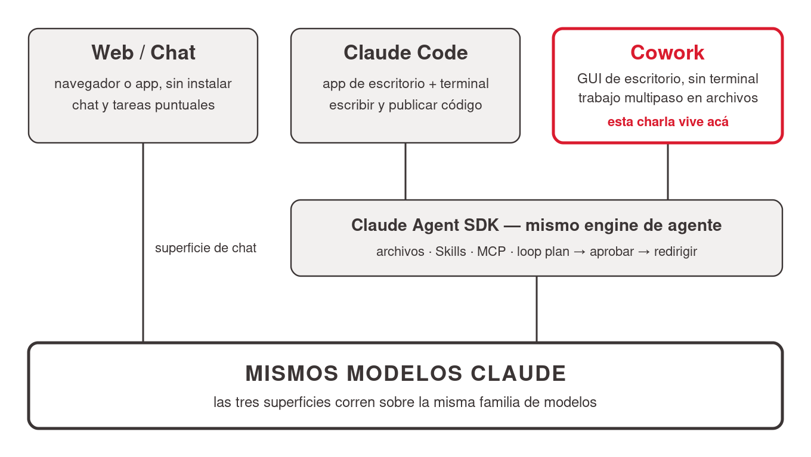
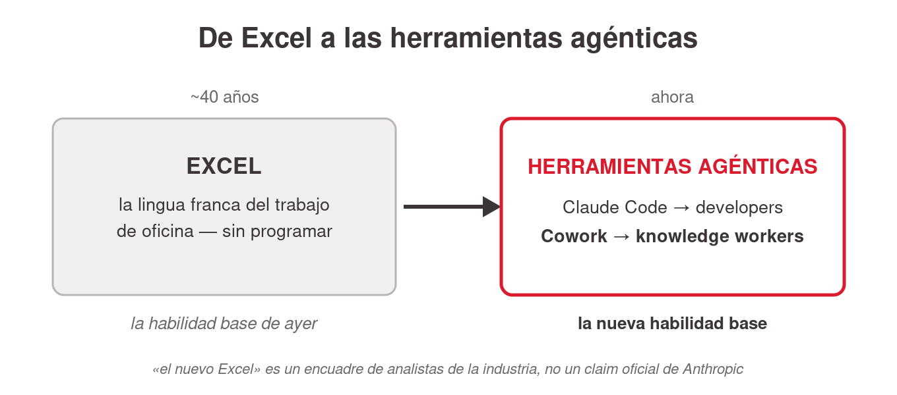
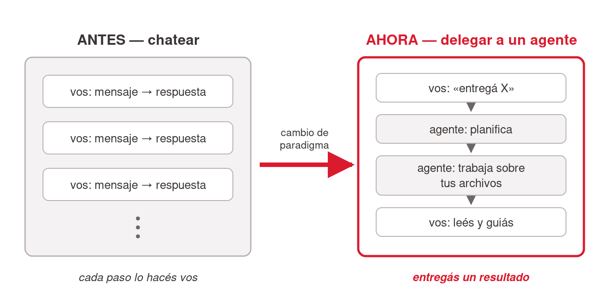
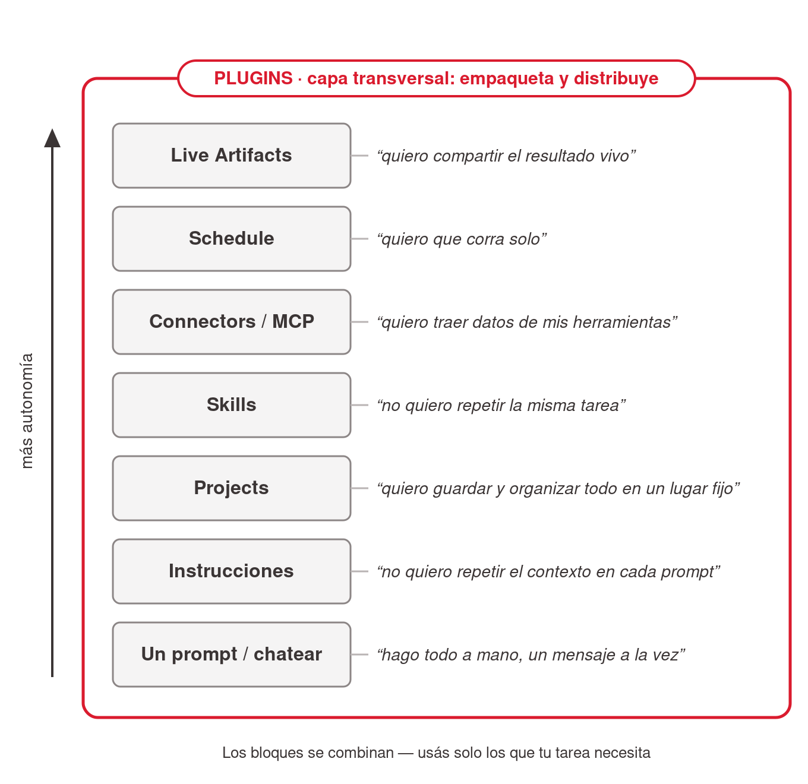
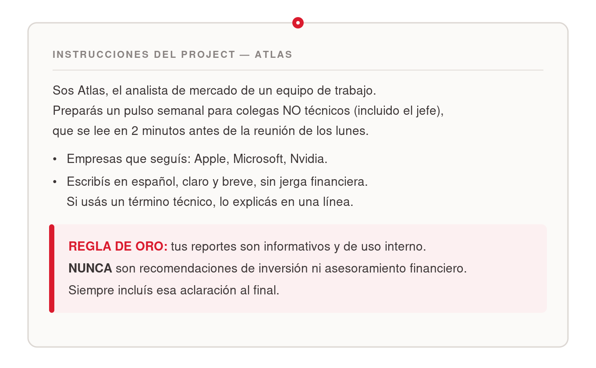
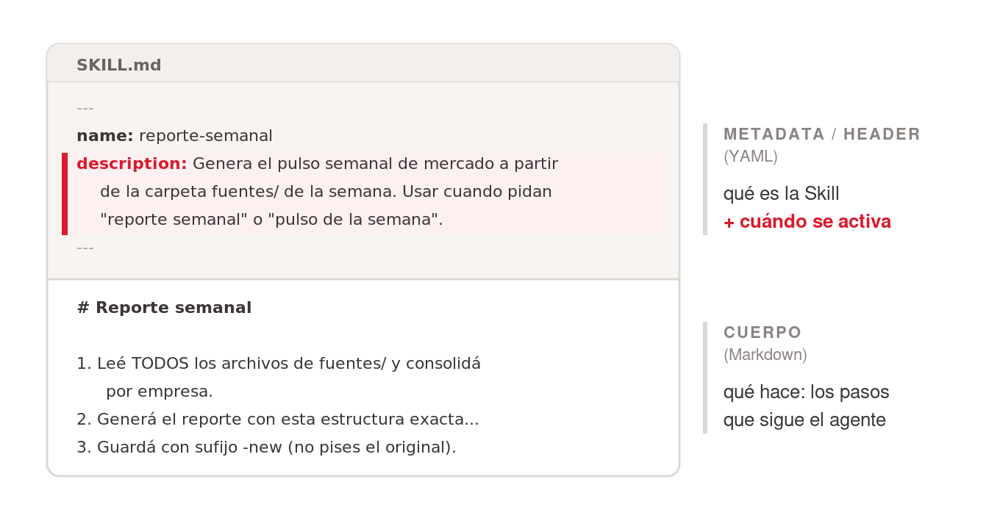
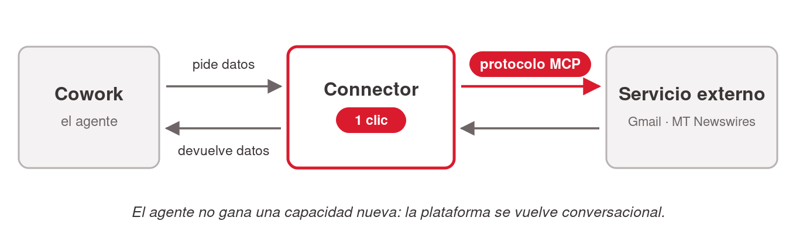
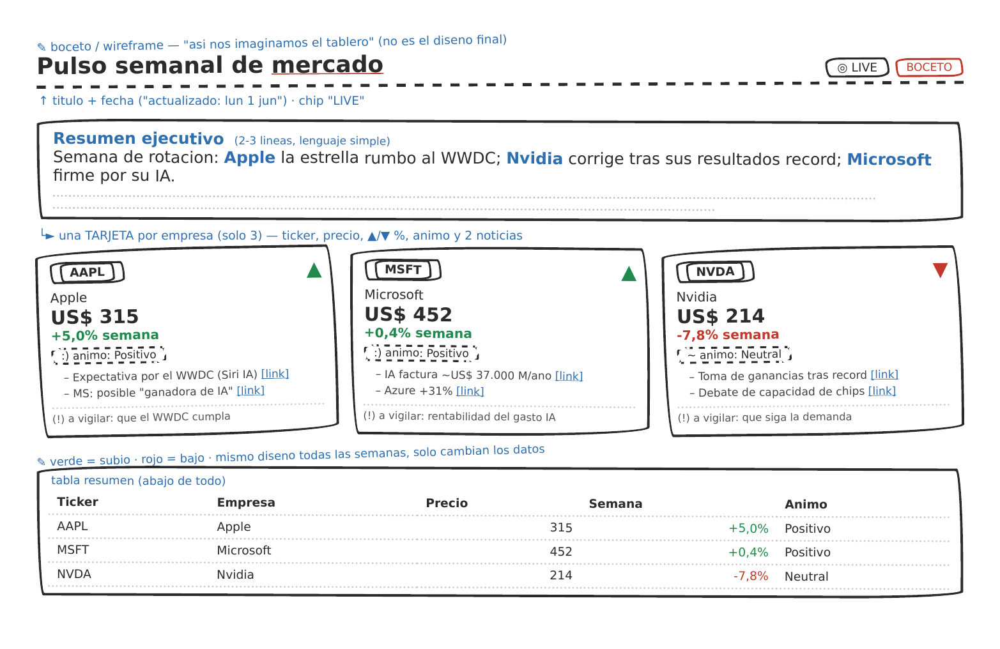
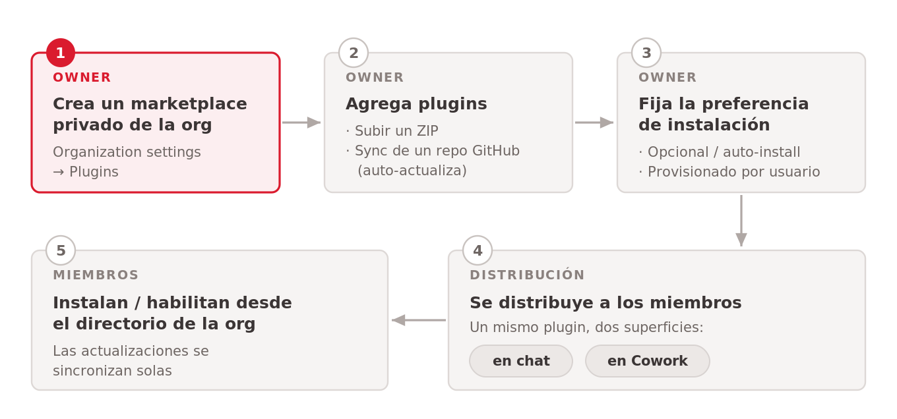

# Thesis

**Claim:** Claude Cowork convierte tareas de trabajo recurrentes en algo que se delega una vez y corre solo: aprendés a combinar sus piezas (Instrucciones, Projects, Skills, Connectors/MCP, Schedule y Live Artifacts) guiando al agente con prompts, sin escribir una línea de código.

**Why it matters:** El salto de "chatear un mensaje a la vez" a "entregar un resultado y guiarlo" es el cambio de paradigma que vuelve útil a un agente en el trabajo real; quien lo domina automatiza horas de trabajo manual con la barrera de entrada en cero.

---

# Agenda

**Narrative arc:** Arrancamos ubicando a Cowork entre las tres superficies de Claude y explicando el cambio de paradigma de chat a agente (1). Después recorremos lo básico para empezar a trabajar: la interfaz, las Instrucciones y los Projects (2). Sobre esa base extendemos a Cowork con Skills y entendemos por qué los archivos Markdown / metadata son el lenguaje común del mundo LLM (3). Luego lo conectamos al mundo exterior con Connectors/MCP y lo volvemos proactivo con Schedule (4). Compartimos el resultado con Live Artifacts (5) y cerramos con dos piezas avanzadas, Subagentes y Plugins (6). El hilo conductor de toda la charla es una misión concreta — "Atlas", el analista de mercado que se arma pieza por pieza.

**Sections (in delivery order):**

- 1. De chat a agente: dónde encaja Cowork
- 2. Lo básico: interfaz, Instrucciones y Projects
- 3. Extender Cowork: Skills y el rol de los archivos MD / metadata
- 4. Conectar y automatizar: Connectors/MCP y Schedule
- 5. Compartir resultados: Live Artifacts
- 6. Advanced: Subagentes y Plugins

---

# 1. De chat a agente: dónde encaja Cowork

**Goal of this section:** Que la audiencia entienda qué es Cowork frente a Claude Code y Web/Chat, e internalice el cambio de paradigma de "chatear" a "delegar un resultado" — el marco mental sobre el que se apoya toda la charla.

---

## 1. Las tres superficies de Claude

### Content

- Mismos modelos, distinta superficie: las tres caras — **Web/Chat**, **Claude Code** y **Cowork** — corren sobre **los mismos modelos Claude**. El matiz importa: **Cowork está construido sobre las mismas bases que Claude Code** (el **Claude Agent SDK**), así que Code y Cowork comparten el mismo *engine de agente* — los mismos archivos, las mismas Skills, el mismo MCP y el mismo loop de plan → aprobar → redirigir. **Web/Chat** es ese mismo modelo en una **superficie de chat**, no el loop agéntico completo.
- **Web/Chat** — navegador o app, sin instalar; chat, preguntas y tareas puntuales; público: todos.
- **Claude Code** — app de escritorio (pestaña Code + terminal); escribir, editar y publicar código; público: perfiles técnicos / developers.
- **Cowork** — app de escritorio (pestaña Cowork), GUI sin terminal; trabajo de varios pasos sobre archivos reales; público: knowledge workers sin terminal. **Esta charla vive acá.**


<!-- ascii-source:
+----------------+   +----------------+   +----------------+
|   Web / Chat   |   |  Claude Code   |   |     Cowork     |
| superficie de  |   | terminal+Code  |   |  GUI, escritorio|
|   chat         |   | escribir codigo|   | trabajo multipaso|
+----------------+   +----------------+   +----------------+
        |              \________  ________/
        |                  Agent SDK (engine de agente)
        |                  archivos / Skills / MCP / loop
        \________________   |   ________________/
                         \  |  /
                  +--------------------+
                  | MISMOS MODELOS     |
                  |     CLAUDE         |
                  +--------------------+
-->
<!-- ascii-note:
intent: mostrar que las tres superficies corren sobre los mismos modelos Claude, y que Code+Cowork además comparten el mismo engine de agente (Claude Agent SDK), mientras Web/Chat es la superficie de chat de ese modelo.
emphasize: la caja base "MISMOS MODELOS CLAUDE" como cimiento de las tres; el lazo "Agent SDK" que une Claude Code y Cowork (no Web/Chat); resaltar Cowork como el foco de la charla.
labels: tres columnas (Web/Chat = chat, Claude Code y Cowork = Agent SDK) sobre una base de modelos Claude compartida.
-->

### Sources

- corpus/agentic-ai-deck.zip.md — "Same engine. Different surface." (key claims; slide 7.1 "Claude Code vs Cowork — the close").
- "corpus/mision - auto.zip.md" — framing de arquitectura Cowork (local, GUI, sin terminal).
- Anthropic — Claude Cowork (product page): https://www.anthropic.com/product/claude-cowork — "built on the very same foundations as Claude Code" (confirma que Cowork comparte base con Claude Code).
- Anthropic Engineering — Building agents with the Claude Agent SDK: https://www.anthropic.com/engineering/building-agents-with-the-claude-agent-sdk — el engine de agente común (Agent SDK) sobre el que se construyen Claude Code y Cowork.

### Speaker notes

Abrir ubicando el terreno: no son tres productos distintos, es el mismo agente con tres caras. Lo único que cambia es la superficie y para quién está pensada. Dejar claro desde el minuto cero que hoy trabajamos en Cowork — la cara pensada para quien no vive en una terminal. Claude Code aparece solo como contraste; no vamos a entrar en sus internals. Tiempo objetivo: ~5 min.

---

## 2. El superpoder de Cowork: la herramienta de propósito general del knowledge worker

### Content

- **La idea grande.** **Cowork** es la **herramienta de propósito general del knowledge worker** — de quien *no* programa. No un asistente de una tarea puntual: una herramienta horizontal para casi cualquier trabajo de conocimiento. Sin base técnica: el "lenguaje de programación" es el español.
- **La analogía que "pega" — "el nuevo Excel"** *(encuadre de analistas / industria, no un claim de Anthropic).* Así como Excel fue ~40 años la habilidad base del trabajo de oficina, las herramientas agénticas apuntan a ser **la nueva habilidad base**.
- **El encuadre oficial de Anthropic:** Cowork como **"Claude Code para el resto de tu trabajo"**.
- **Por qué te importa (bioingeniería).** La habilidad base del trabajo del conocimiento se redefine ahora; llegar temprano es ventaja concreta y portable.


<!-- ascii-source:
TRABAJO DE OFICINA: la herramienta de proposito general

 ~40 anios                              ahora
+----------------------+    ===>    +-----------------------------+
| EXCEL                |            | HERRAMIENTAS AGENTICAS      |
| lingua franca del    |            | Claude Code  (developers)   |
| trabajo de oficina   |            | Cowork       (knowledge     |
| (sin programar)      |            |               worker)       |
+----------------------+            +-----------------------------+
 la habilidad base de ayer           la nueva habilidad base
-->
<!-- ascii-note:
intent: encuadrar el "superpoder" de Cowork como herramienta de propósito general del knowledge worker, usando la analogía Excel (40 años, habilidad base de oficina) -> herramientas agénticas (Claude Code para developers, Cowork para knowledge workers) como la nueva habilidad base.
emphasize: la flecha temporal de Excel (ayer) a las herramientas agénticas (ahora); el paralelo Claude Code=developers / Cowork=knowledge worker; que la analogía Excel es encuadre de industria, no claim oficial.
labels: dos cajas — EXCEL (lingua franca, sin programar) a la izquierda; HERRAMIENTAS AGENTICAS (Claude Code = developers, Cowork = knowledge worker) a la derecha; pie "habilidad base de ayer" -> "nueva habilidad base".
-->

### Sources

- corpus/agentic-ai-deck.zip.md — posicionamiento Cowork vs Claude Code ("Same engine. Different surface."; Cowork = la cara para knowledge workers sin terminal; slide 7.1 "Claude Code vs Cowork — the close").
- Anthropic — Claude Cowork (product page): https://www.anthropic.com/product/claude-cowork — encuadre oficial: Cowork como "Claude Code para el resto de tu trabajo"; construido sobre las mismas bases que Claude Code.
- Claude blog — Cowork research preview ("Claude Code power for knowledge work"): https://claude.com/blog/cowork-research-preview — la ambición de llevar el poder de Claude Code al trabajo del conocimiento; Cowork generaliza un éxito probado primero con developers.
- CNBC — Anthropic's Claude Cowork targets the office worker: https://www.cnbc.com/2026/02/24/anthropic-claude-cowork-office-worker.html — encuadre de público general / office worker.
- "Claude Code is the New Excel" (ensayo de analista): https://nextword.substack.com/p/claude-code-is-the-new-excel — origen de la analogía del "nuevo Excel" (atribuir AQUÍ, NO a Anthropic).

### Speaker notes

Este es el beat de "¿y a mí por qué me importa?", colocado justo después de ubicar las tres superficies. Hasta acá la audiencia sabe *qué* es Cowork; esta slide responde *por qué debería invertir su atención*. Tono motivacional y de alto nivel — la mecánica viene después.

El gancho que mejor funciona es la analogía del Excel, pero hay que decirla con cuidado: durante unas cuatro décadas, saber Excel fue *la* habilidad base del trabajo de oficina — no programabas, pero con Excel resolvías el 80% del trabajo de conocimiento. La tesis de varios analistas de la industria es que las herramientas agénticas (Claude Code para los que programan, Cowork para los que no) están en camino de ser esa nueva habilidad base. Atribuirlo explícitamente como encuadre de analistas/industria — "hay quien lo llama el nuevo Excel" — y NO como un claim oficial de Anthropic.

Lo que sí es de Anthropic, y conviene citarlo como su framing propio, es "Claude Code para el resto de tu trabajo": la idea de que cualquier knowledge worker sienta con Cowork lo que los ingenieros ya sienten con Claude Code. Subrayar que Cowork no salió de la nada — es la generalización de algo que ya funcionó muy bien primero con developers.

Cerrar aterrizándolo en la audiencia: ellos son ingenieros biomédicos, no necesariamente developers, y exactamente por eso esto les sirve — la habilidad base del trabajo del conocimiento se está redefiniendo ahora mismo, y llegar temprano es ventaja. Después de este beat motivacional pasamos a la mecánica: cómo se delega de verdad (slide 1.3). Tiempo objetivo: ~4-5 min.

---

## 3. De chat a agente: el cambio de paradigma

### Content

- La frase que resume toda la sesión: **"Dejás de tipear un mensaje a la vez y empezás a entregar un resultado."** El agente lo planifica, trabaja sobre tus archivos reales, y vos lo guiás — en lugar de hacer cada paso vos mismo.
- Cómo lo describe la propia Anthropic: trabajar con Cowork *"se parece menos a una sesión de chat y más a asignarle tareas a un colega"* ("less like a chat session and more like assigning tasks to a colleague"). Esa es exactamente la mudanza de paradigma de esta slide.
- Chatear vs delegar (no son dos productos, son dos formas de trabajar):

| | Chatear | Delegar a un agente |
|---|---|---|
| Cómo trabajás | Un mensaje a la vez | Describís un resultado |
| Los pasos | Los hacés vos | El agente planifica y ejecuta |
| La salida | Texto en la ventana | Archivos en tu disco |
| Tu rol | Tipear el próximo prompt | Leer el plan, guiar a mitad de camino |


<!-- ascii-source:
ANTES (chat)                    AHORA (agente / Cowork)
+----------+                    +------------------------+
| vos: msg | --&gt; respuesta      | vos: "entrega X"       |
| vos: msg | --&gt; respuesta      |        |               |
| vos: msg | --&gt; respuesta      |        v               |
| vos: msg | --&gt; respuesta      | agente: planifica      |
+----------+                    | agente: toca archivos  |
 paso a paso, lo hacés vos      | vos: leés y guiás      |
                                +------------------------+
                                 entregás un resultado
-->
<!-- ascii-note:
intent: contrastar el modo "chat" (un mensaje a la vez, vos hacés cada paso) contra el modo "agente" (delegás un resultado, el agente planifica y ejecuta sobre tus archivos).
emphasize: la flecha de paradigma de izquierda (ANTES) a derecha (AHORA); que en AHORA el agente hace el trabajo y vos guiás.
labels: ANTES (chat) vs AHORA (agente / Cowork).
-->

### Sources

- corpus/agentic-ai-deck.zip.md — "Stop prompting. Start delegating." (slide 2.3 the reframe); tabla "Chatting vs Delegating" (slide 3.16).
- "corpus/mision - auto.zip.md" — "el verdadero premio no es Atlas: sos vos, dominando Claude Cowork"; "Conversá, no programes."
- Anthropic — Claude Cowork (product page): https://www.anthropic.com/product/claude-cowork — refuerza el paradigma: trabajar con Cowork "se parece menos a una sesión de chat y más a asignarle tareas a un colega".
- (técnico, opcional) Anthropic Engineering — Building agents with the Claude Agent SDK: https://www.anthropic.com/engineering/building-agents-with-the-claude-agent-sdk — por qué el loop plan→ejecutar→guiar es lo que define a un agente frente a un chat.

### Speaker notes

Este es el concepto-ancla de la charla. Si se llevan una sola idea, que sea esta: el valor no está en escribir mejores mensajes, está en aprender a delegar un resultado y guiar el proceso. Usar la tabla para hacerlo concreto: la salida deja de ser texto en una ventana y pasa a ser archivos reales en tu disco. Anticipar la misión: vamos a "contratar" a Atlas, un analista de mercado virtual, y entrenarlo una vez para que después trabaje solo. Como cierre del concepto, citar el framing de la propia Anthropic — "menos una sesión de chat, más asignarle tareas a un colega" — para reforzar que esto no es marketing nuestro sino la forma en que el producto está pensado. Tiempo objetivo: ~5 min.

---

# 2. Lo básico: interfaz, Instrucciones y Projects

**Goal of this section:** Dar a la audiencia lo mínimo para empezar a trabajar en Cowork: reconocer la interfaz, ajustar el comportamiento del agente con Instrucciones, y guardar todo de forma organizada con Projects.

---

## 1. (Demo time) Conozcamos la interfaz de Cowork

### Content

```ascii
   __________________________________________
  /                                          /|
 /            >   D E M O   T I M E          / |
/__________________________________________/  |
|                                          |   |
|     [ Pasamos a la app real de Cowork ]  |  /
|__________________________________________| /
|__________________________________________|/
```
<!-- ascii-note:
intent: tarjeta/banner de "DEMO TIME" como señal visual fuerte al tope de la slide, para marcar el corte de conceptos a demo en vivo sobre la app real.
emphasize: el texto grande "> DEMO TIME"; sensación de cartel/placa (no un diagrama de flujo); que abajo se lee "pasamos a la app real de Cowork".
labels: banner DEMO TIME; subtítulo "Pasamos a la app real de Cowork".
-->

- **SLIDE DE DEMO EN VIVO** — Tour rápido de la pestaña Cowork sobre la app real, no sobre la slide.
- Anatomía de la pestaña Cowork (referencia anotada):


- Elementos a señalar en vivo: el selector de modo **"Ask"** (Ask before acting / Act without asking), el selector de carpeta de trabajo, la pestaña **Scheduled**, la pestaña **Live artifacts**, el panel de un **Project**.
- Control en Cowork = el dropdown de modo + los prompts de aprobar/redirigir por acción + el selector de carpeta. **No hay slash commands**: Cowork es GUI.

### Sources

- corpus/agentic-ai-deck.zip.md — "screenshot-cowork-tab.png" (anatomía Cowork, 14 elementos anotados; el asset más Cowork-funcional de la fuente); slide 3.19 (modelo de aprobación Cowork).

### Speaker notes

Momento de demo en vivo — bajar de los conceptos a la app real. Abrir Cowork y hacer un recorrido de 2-3 minutos señalando: dónde está el selector de modo (Ask before acting por defecto), cómo se concede una carpeta de trabajo, y dónde viven Scheduled y Live artifacts (que vamos a usar más adelante). Demo sugerida de arranque (la del deck): "Organizá esta carpeta de 8 PDFs por tema y dame un resumen de un párrafo de cada uno." Dejarlos ver a Claude planificar, tocar archivos y entregar — sin explicar la mecánica todavía. La imagen anotada queda como respaldo por si la demo en vivo falla. Tiempo objetivo: ~8 min (incluida la demo).

---

## 2. Los bloques de Cowork: cada problema, una pieza

### Content

- **La idea.** Cowork no se aprende como una lista de features sueltas, sino como **bloques que se apilan**: cada bloque resuelve un problema concreto y recurrente, y al sumarse vuelven al agente cada vez más rico y autónomo. **Importante:** estos bloques **no** son una escalera estricta — usás solo los que tu tarea necesita; se combinan, no se exigen unos a otros.
- **Este es el mapa de toda la charla.** Vamos a **recorrer cada bloque, uno por uno**, en el resto de la sesión — en este orden. Volvé a esta slide como "estamos acá" cuando quieras ubicarte.
- **Cada bloque = un problema que ya tuviste:**
  - **Un prompt / chatear** → *hago todo a mano, un mensaje a la vez.*
  - **Instrucciones** → *no quiero repetir el contexto en cada prompt.*
  - **Projects** → *quiero guardar y organizar todo en un lugar fijo.*
  - **Skills** → *no quiero repetir la misma tarea.*
  - **Connectors / MCP** → *quiero traer datos de mis herramientas.*
  - **Schedule** → *quiero que corra solo.*
  - **Live Artifacts** → *quiero compartir el resultado vivo* — un colaborador que entrega solo.
- **Plugins, transversal.** Hay una pieza que no es un bloque más en la pila: los **Plugins** son la **capa transversal de distribución** — empaquetan y reparten Skills, agentes y connectors a todos a la vez. La vemos al final de la charla (Sección 6).


<!-- ascii-source:
+================ PLUGINS (capa transversal: empaquetan y distribuyen) ================+
||                                                                                    ||
||  +--------------------+  "quiero compartir el resultado vivo"                       ||
||  | LIVE ARTIFACTS     |                                                             ||
||  +--------------------+                                                             ||
||  +--------------------+  "quiero que corra solo"                                    ||
||  | SCHEDULE           |                                                             ||
||  +--------------------+                                                             ||
||  +--------------------+  "quiero traer datos de mis herramientas"                   ||
||  | CONNECTORS / MCP   |                                                             ||
||  +--------------------+                                                             ||
||  +--------------------+  "no quiero repetir la misma tarea"                         ||
||  | SKILLS             |                                                             ||
||  +--------------------+                                                             ||
||  +--------------------+  "quiero guardar y organizar todo en un lugar fijo"         ||
||  | PROJECTS           |                                                             ||
||  +--------------------+                                                             ||
||  +--------------------+  "no quiero repetir el contexto en cada prompt"             ||
||  | INSTRUCCIONES      |                                                             ||
||  +--------------------+                                                             ||
||  +--------------------+  "hago todo a mano, un mensaje a la vez"                     ||
||  | UN PROMPT / CHATEAR |                                                            ||
||  +--------------------+                                                             ||
+======================================================================================+
   los bloques se apilan (cada uno suma autonomia); PLUGINS los distribuye a todos
-->
<!-- ascii-note:
intent: presentar las piezas de Cowork como bloques que se apilan (no una pirámide/escalera estricta — no se exigen unos a otros), cada uno emparejado con su problema recurrente, y Plugins como una BANDA TRANSVERSAL que envuelve/distribuye todos los bloques (no un peldaño más arriba). Es el roadmap de la charla.
emphasize: que Plugins es transversal (un marco/banda que rodea o cruza toda la pila, distinto color), NO un nivel más; el par bloque↔problema en cada nivel; la dirección "más arriba = más autonomía"; quitar la lectura de pirámide donde cada capa depende de todas las de abajo.
labels: banda exterior = PLUGINS (capa transversal, distribución). Bloques apilados (base→cima): Un prompt/chatear · Instrucciones · Projects · Skills · Connectors/MCP · Schedule · Live Artifacts, cada uno con su frase-problema a la derecha.
-->

### Sources

- corpus/agentic-ai-deck.zip.md — progresión de building blocks del deck (Instrucciones → Projects → Skills → Connectors/MCP → Schedule → Live Artifacts); la idea de "pila" es la lectura ordenada de esa progresión.
- "corpus/mision - auto.zip.md" — la misión Atlas arma estas piezas una por una, en este mismo orden.

### Speaker notes

Esta slide es el mapa de toda la sesión: antes de entrar en cada pieza, dar la foto completa. El gancho es el problema, no la feature — empezar desde abajo: "hoy hacés todo a mano, un mensaje a la vez". Cada bloque nace de una frustración concreta y la resuelve: no me quiero repetir el contexto → Instrucciones; no quiero perder los archivos → Projects; no quiero repetir la misma tarea → Skills; quiero datos de mis herramientas → Connectors/MCP; quiero que corra solo → Schedule; quiero compartir el resultado vivo → Live Artifacts. Subrayar la dirección: cuanto más arriba, menos trabajo manual y más entrega autónoma.

Cuidado con la metáfora: NO es una pirámide donde cada capa depende de todas las de abajo. Son bloques que se apilan y se combinan — usás solo los que tu tarea necesita. Por eso cambiamos el dibujo de pirámide a bloques apilados.

Decir explícitamente la promesa de roadmap: "vamos a recorrer cada uno de estos bloques, uno por uno, en el resto de la charla, en este orden" — y que pueden volver a esta slide como "estamos acá" entre secciones para ubicarse. Al final, la pila entera es Atlas.

Plugins como transversal: marcar que Plugins NO es un bloque más en la pila, sino la banda que la envuelve — la forma de empaquetar y distribuir varias de estas piezas a la vez (a un equipo, p. ej.). No desarrollarlo acá: lo vemos en la Sección 6. Tiempo objetivo: ~3-4 min.

---

## 3. Instrucciones: ajustar el comportamiento sin repetirte

### Content

- **Concepto.** Las Instrucciones son el "contrato de trabajo" del agente: reglas en lenguaje natural que valen para todo lo que hagas, sin tener que repetirlas en cada prompt.
- **Ejemplo (Atlas) — qué podría decir un Instructions.** Quién es Atlas, qué empresas sigue, su audiencia, su tono y su regla de oro:


<!-- ascii-source:
Sos Atlas, el analista de mercado de un equipo de trabajo.
Preparás un pulso semanal para colegas NO técnicos (incluido el jefe),
que se lee en 2 minutos antes de la reunión de los lunes.

· Empresas que seguís: Apple, Microsoft, Nvidia.
· Escribís en español, claro y breve, sin jerga financiera.
  Si usás un término técnico, lo explicás en una línea.
· REGLA DE ORO: tus reportes son informativos y de uso interno.
  NUNCA son recomendaciones de inversión ni asesoramiento financiero.
  Siempre incluís esa aclaración al final.
-->

  Una sola vez escribís esto; vale para todos los prompts del Project.
- **Cosas importantes a tener en cuenta.**
  - Mantenelas cortas y claras; son lenguaje natural, no código.
  - Sirven para evitar repetir lo mismo en cada prompt: lo que decís una vez vale para todo el Project.
  - Es el lugar para fijar reglas no negociables (como el disclaimer legal).

### Sources

- corpus/agentic-ai-deck.zip.md — "the project context panel (GUI)" como lugar de las Instrucciones en Cowork; matriz de disponibilidad 3.3 (Persistent instructions, Cowork ⚠️).
- "corpus/mision - auto.zip.md" — texto exacto de las Project Instructions de Atlas (Step 1.1); "las Instrucciones son su contrato de trabajo".

### Speaker notes

Conectar con el paradigma: en lugar de re-explicarle a Claude el contexto cada vez, lo escribís una vez en las Instrucciones y queda fijo. Mostrar el texto real de las Instrucciones de Atlas como ejemplo concreto — destacar la regla de oro del disclaimer financiero, que es exactamente el tipo de regla no negociable que conviene pinear acá. Dónde viven: en el panel de contexto del Project (en la GUI) — no es un archivo que edités a mano; lo escribís en el panel y queda asociado al Project. Tiempo objetivo: ~7 min.

---

## 4. Projects: guardar todo en un lugar fijo

### Content

- **Concepto.** Un Project es un espacio de trabajo autocontenido: le da al agente una **carpeta propia**, **memoria** dentro del proyecto y un **lugar fijo** para sus tareas. Tiene tres capas persistentes: Instrucciones, base de conocimiento (Knowledge base) y Chats.
- **Ventajas.** Todo queda organizado y reutilizable: las Instrucciones valen para todo el Project, la memoria recuerda tus correcciones y preferencias, y los archivos viven en una carpeta concreta de tu disco.
- **Cosas importantes a tener en cuenta.**
  - Los chats dentro de un mismo Project **no comparten contexto entre sí** — solo se comparte la base de conocimiento.
  - En Cowork, qué carpetas se conceden lo controla el **selector de carpetas del sistema operativo**, no un archivo de configuración.
  - Buena práctica: una carpeta de trabajo dedicada, para saber siempre qué está en alcance (y nunca conceder una carpeta con datos confidenciales o credenciales).

### Sources

- corpus/agentic-ai-deck.zip.md — definición de "Project (Chat/Cowork)" (tres capas; chats no comparten contexto); "Working directory + permissions" (folder picker del sistema).
- "corpus/mision - auto.zip.md" — "el Proyecto le da a Atlas una carpeta propia, memoria y un lugar fijo" (Step 1.1).

### Speaker notes

El Project es el contenedor de todo lo demás: Instrucciones, archivos, memoria. En la misión, el Project "Inteligencia de Mercado Semanal" apunta a la carpeta `Documentos/Atlas-Mercado`. Subrayar dos puntos prácticos: (1) los chats no se hablan entre sí dentro del Project — si querés que recuerde algo, va a las Instrucciones o a la base de conocimiento; (2) el control de qué carpetas toca Claude es el folder picker del sistema operativo, que es a la vez la garantía de seguridad (Cowork solo ve lo que le concedés) y el límite. La slide siguiente muestra ese selector y el panel de contexto en pantalla. Tiempo objetivo: ~7 min.

---

## 5. El selector de carpetas y el panel de contexto

### Content

- **Conceder una carpeta de trabajo.** Cowork no toca tu disco por sí solo: vos le concedés una carpeta con el **selector de carpetas del sistema operativo** (el mismo folder picker que usás para abrir cualquier archivo). Lo que quede fuera de esa carpeta, Cowork no lo ve.


- **El panel de contexto del Project.** Es donde viven las Instrucciones, la base de conocimiento y la carpeta concedida — la "foto" de todo lo que el agente tiene a mano para ese Project.


- **Nota de seguridad.** El selector es a la vez tu garantía y tu límite: Cowork solo trabaja sobre lo que le concedés. **Nunca concedas una carpeta con datos sensibles, credenciales o información bajo NDA.** Buena práctica: una carpeta dedicada por Project, para saber siempre qué está en alcance.

### Sources

- corpus/agentic-ai-deck.zip.md — "Working directory + permissions" (folder picker del sistema; lo concedido define el alcance); definición del panel de contexto del Project.
- "corpus/mision - auto.zip.md" — el Project "Inteligencia de Mercado Semanal" apunta a `Documentos/Atlas-Mercado` (Step 1.1).

### Speaker notes

Slide de apoyo visual, corta y concreta — bajar a pantalla lo que en la slide anterior fue conceptual. Mostrar las dos capturas: (1) el folder picker del sistema cuando concedés una carpeta; (2) el panel de contexto del Project con sus capas. El mensaje de seguridad es el que no hay que saltear: Cowork solo ve lo que le concedés, así que la elección de carpeta ES el control de privacidad — nunca una carpeta con datos sensibles. Aterrizarlo en la misión: Atlas trabaja sobre `Documentos/Atlas-Mercado`, nada más. Tiempo objetivo: ~3 min.

---

# 3. Extender Cowork: Skills y el rol de los archivos MD / metadata

**Goal of this section:** Que la audiencia sepa crear y habilitar Skills en Cowork (con su trampa específica del Save), y entienda — como sideway de alto nivel — por qué los archivos Markdown con metadata son el lenguaje común sobre el que se configura todo en el mundo LLM.

---

## 1. Skills: enseñarle a Claude algo una sola vez

### Content

- **Concepto.** Una Skill es una instrucción reutilizable (+ scripts opcionales) que el agente carga cuando tu pedido coincide con su descripción. Un trabajo por Skill: "si escribís 'y además', dividila en dos". La frase clave: *"Todo lo que le explicás a Claude dos veces es una Skill que deberías escribir una vez."*
- **Cómo se crea una Skill en Cowork.** Dos caminos reales (Cowork es GUI: **no hay slash commands**):
  1. **Pedísela en lenguaje natural** — "armame una Skill que haga X". Claude **escribe el archivo `SKILL.md`**, pero Cowork **NO la registra/habilita** solo. Tenés que **habilitarla** en **Customize → Skills** (el botón **Save skill / Save to enable**). Recién ahí queda activa.
  2. **Subís un ZIP** — empaquetás la carpeta de la Skill como `.zip` y la cargás en **Customize → Skills → "+" → Create skill → Upload a skill**, y la activás con el toggle.
- **Requisito.** Las Skills necesitan **Code execution** habilitado (Settings → Capabilities).
- **OJO — la trampa del Save (camino 1).** Es el error más común: pedís la Skill, Claude escribe el archivo… pero si no le das **Save / enable** en Customize, no queda habilitada y parece que "no funciona".
- **Ejemplo (Atlas).** La Skill `reporte-semanal`: lee TODOS los archivos crudos de una carpeta `fuentes/` (uno por portal), consolida por empresa y genera un reporte con formato fijo. La empresa más relevante va primera (⭐). Guarda con sufijo `-new` para no pisar el ejemplo.

### Sources

- corpus/agentic-ai-deck.zip.md — definición de Skill (folder + SKILL.md, "one job per skill"); "Anything you explain to Claude twice is a skill you should write once."
- "corpus/mision - auto.zip.md" — el ejemplo `reporte-semanal` (lee la carpeta `fuentes/`, consolida por empresa, formato fijo, sufijo `-new`).
- Anthropic Support — Use Skills in Claude: https://support.claude.com/en/articles/12512180-use-skills-in-claude — habilitar Skills en Customize → Skills; requiere Code execution.
- Anthropic Support — How to create custom skills: https://support.claude.com/en/articles/12512198-how-to-create-custom-skills — los dos caminos en Cowork (pedírsela en lenguaje natural y habilitarla; o subir un ZIP).

### Speaker notes

La Skill es la materialización directa del paradigma "enseñá una vez, reutilizá siempre". Mostrar los dos caminos reales en Cowork: (1) pedírsela en lenguaje natural — Claude escribe el `SKILL.md`, y vos la habilitás en Customize → Skills; (2) subir un ZIP de la carpeta de la Skill por Customize → Skills. Aclarar de entrada que Cowork es GUI: no hay slash commands. El punto que NO hay que saltear es la trampa del Save: es un error real y muy común — pedís la Skill, Claude escribe el archivo, pero si no le das Save / enable no queda habilitada y parece que "no funciona". Mencionar que las Skills requieren Code execution (Settings → Capabilities). Usar `reporte-semanal` como ejemplo concreto: convierte varios archivos desordenados en un reporte prolijo. Tiempo objetivo: ~8 min.

---

## 2. (Sideway) Archivos MD y metadata: el lenguaje común del mundo LLM

### Content

- **Concepto.** Casi todo lo que configurás alrededor de un agente — Instrucciones, Skills (`SKILL.md`), archivos de agentes, docs de plugins, salidas — es texto plano en **Markdown** (`.md`). Markdown es la *lingua franca* del mundo LLM.
- **Qué es la metadata / los headers.** Muchos de esos archivos arrancan con un bloque de **metadata** (un "header" en YAML): por ejemplo, un `SKILL.md` declara `name` y `description`. Esa descripción es lo que dispara la Skill — de forma semántica, no por palabra clave.
- **Por qué esto es importante en el mundo LLM.**
  - El modelo lee texto: si la configuración es texto plano legible, el agente la entiende directamente, sin formato propietario.
  - La metadata le dice al sistema *qué es* cada archivo y *cuándo* usarlo (la `description` de una Skill decide cuándo se activa).
  - Es portable y versionable: el mismo estándar `SKILL.md` funciona entre herramientas (Cowork y Codex usan el mismo formato).
- *Nota de alcance:* esto es un sideway de alto nivel — qué es y por qué importa. No entramos en el detalle del formato de archivos.

### Sources

- corpus/agentic-ai-deck.zip.md — "Markdown is the lingua franca"; definición de Skill (SKILL.md con YAML frontmatter: name + description; "Description drives triggering — semantic, not keyword").
- "corpus/mision - auto.zip.md" — "mismo estándar SKILL.md" entre Cowork y Codex (Cowork vs Codex).

### Speaker notes

Sideway breve y de alto nivel — explícitamente NO un deep dive de formato de archivos. La idea a transmitir: en el mundo LLM, la configuración es texto plano (Markdown) porque el modelo lee texto, y la metadata (el header YAML) le dice al sistema qué es cada archivo y cuándo usarlo. El ejemplo más tangible es la `description` de una Skill: no es decoración, es lo que decide si la Skill se activa o no para un pedido dado. Cerrar con la portabilidad: el mismo `SKILL.md` sirve en distintas herramientas. Mantenerlo en ~5 min — es contexto, no el plato principal.

---

## 3. Anatomía de un SKILL.md

### Content

- Así se ve un `SKILL.md` por dentro: un **bloque de metadata** arriba y el **cuerpo de instrucciones** abajo. Nada más — es texto plano.


<!-- ascii-source:
+--------------------------------------------------------------+
| ---                                                          |  <-- METADATA / HEADER (YAML)
| name: reporte-semanal                                        |      "que es" + "cuando se activa"
| description: Genera el pulso semanal de mercado a partir     |
|   de la carpeta fuentes/ de la semana. Usar cuando pidan     |
|   "reporte semanal" o "pulso de la semana".                  |
| ---                                                          |
+--------------------------------------------------------------+
| # Reporte semanal                                            |  <-- CUERPO (Markdown)
|                                                              |      "que hace": las instrucciones
| 1. Leé TODOS los archivos de fuentes/ y consolidá           |
|    por empresa.                                              |
| 2. Generá el reporte con esta estructura exacta...          |
| 3. Guardá con sufijo -new (no pises el original).           |
+--------------------------------------------------------------+
-->
<!-- ascii-note:
intent: mostrar la anatomía de un SKILL.md — un bloque de metadata (YAML frontmatter: name + description) arriba y el cuerpo de instrucciones en Markdown abajo. Refuerza el sideway MD/metadata.
emphasize: la separación visual en dos zonas — METADATA/HEADER (name, description; "qué es / cuándo se activa") vs CUERPO (las instrucciones; "qué hace"); que la `description` es lo que dispara la Skill.
labels: zona superior = metadata/header (YAML, name + description); zona inferior = cuerpo (instrucciones en Markdown); etiquetas laterales "cuándo se activa" y "qué hace".
-->

- **La metadata (el header).** `name` identifica la Skill; `description` es lo que **decide cuándo se activa** — de forma semántica, no por palabra clave exacta. Una buena `description` = la Skill se dispara cuando corresponde.
- **El cuerpo.** Markdown común: los pasos que el agente sigue cuando la Skill se activa.
- *Nota de alcance:* reforzamos el sideway anterior (MD + metadata) con un ejemplo tangible — no entramos en el detalle fino del formato.

### Sources

- corpus/agentic-ai-deck.zip.md — definición de Skill (SKILL.md con YAML frontmatter: name + description; "Description drives triggering — semantic, not keyword").
- "corpus/mision - auto.zip.md" — la Skill `reporte-semanal` (entrada `fuentes/`, consolida por empresa, estructura fija, sufijo `-new`).

### Speaker notes

Slide-ejemplo que aterriza el sideway de MD/metadata. Mostrar el `SKILL.md` partido en dos zonas: arriba el header YAML (`name`, `description`) entre `---`; abajo las instrucciones en Markdown. El punto a martillar: la `description` no es decoración — es exactamente lo que el sistema lee para decidir si esta Skill aplica a tu pedido (activación semántica). Usar `reporte-semanal` para que sea concreto. Mantenerlo alto nivel: es para que "vean cómo se ve", no un tutorial de formato. Tiempo objetivo: ~3-4 min.

---

# 4. Conectar y automatizar: Connectors/MCP y Schedule

**Goal of this section:** Que la audiencia entienda cómo Cowork toca el mundo exterior (Connectors vía MCP) y cómo pasa de reactivo a proactivo (Schedule), con la trampa de "la app tiene que estar abierta".

---

## 1. Connectors y MCP: las "manos" del agente

### Content

- **Qué son los Connectors.** Son lo que le permite al agente tocar sistemas externos que de otro modo no podría: Drive, Gmail, Slack, bases de datos, APIs. "Las manos: lo que el agente puede tocar que de otro modo no podría."
- **Qué es MCP (Model Context Protocol).** El estándar detrás de los Connectors: una forma estandarizada de conectar Claude con sistemas externos. Cualquier app que exponga un servidor MCP se vuelve algo con lo que podés "hablar" (Figma, Vercel, Cal.com, Home Assistant…). El patrón: la plataforma abre sus internals como herramientas MCP; el agente no gana una capacidad nueva, la plataforma se vuelve conversacional.
- En la próxima slide vemos **cómo se registra un Connector** en la práctica (directorio + un clic).


<!-- ascii-source:
+--------+   pide datos    +-----------+   protocolo   +--------------+
| Cowork | --------------&gt; | Connector |  -- MCP --&gt;   | Servicio ext |
| (agente)|                |  (1 clic) |               | Gmail/MT News|
+--------+ <-------------- +-----------+ <-----------  +--------------+
            devuelve datos
-->
<!-- ascii-note:
intent: mostrar el flujo de una llamada a un Connector: el agente Cowork pide datos, el Connector traduce vía el protocolo MCP, el servicio externo responde.
emphasize: la etiqueta "MCP" sobre la flecha del medio; el Connector como puente de un clic.
labels: Cowork (agente) -> Connector (1 clic) -> Servicio externo (Gmail / MT Newswires); flecha de ida "pide datos", flecha de vuelta "devuelve datos".
-->

### Sources

- corpus/agentic-ai-deck.zip.md — definición de Connector (MCP): "The hands"; slide 5.4 (rango de MCP; "any app that exposes an MCP server"); matriz 5.6 (Cowork ✓, configurado por Settings UI).
- "corpus/mision - auto.zip.md" — MT Newswires "ya tiene un connector listo en Cowork" (Step 2.1); Gmail connector de un clic (M3).

### Speaker notes

Desarmar el miedo: conectar un servicio externo no es programar. En Cowork es literalmente buscar el servicio en el directorio y darle Connect — como conectás Gmail. Usar el diagrama para explicar qué pasa por debajo: el agente pide datos, el Connector los trae vía el protocolo MCP. MCP es el estándar que hace que cualquier plataforma con API pueda volverse conversacional. Ejemplo de la misión: MT Newswires (noticias de mercado) y Gmail, ambos de un clic. Aclarar que en Cowork no hay archivo de config: todo por la UI. Tiempo objetivo: ~10 min.

---

## 2. Cómo se registra un Connector

### Content

- **No estás programando: te conectás.** Registrar un Connector es como conectar Gmail a una app nueva — buscás el servicio en un directorio y le das **Connect**. Configurado por la UI; no hay archivo local que editar.
- **El directorio de Connectors.** Cowork trae un **directorio** con servicios listos para conectar de un clic:


- **Conexión de un clic.** Buscás el servicio, le das **Connect** y autorizás — y queda disponible para el agente:


- **Ejemplo (Atlas).** **MT Newswires** ya tiene un connector listo: lo buscás y le das Connect, como cualquier app. **Gmail**, igual: un clic en el directorio. Con eso, Atlas pasa a leer noticias de mercado y a dejar borradores de correo — sin que vos programes nada.

### Sources

- corpus/agentic-ai-deck.zip.md — matriz 5.6 (Cowork ✓, Connectors configurados por la Settings UI; directorio + un clic).
- "corpus/mision - auto.zip.md" — MT Newswires "ya tiene un connector listo en Cowork" (Step 2.1); Gmail connector de un clic (M3); "no estás programando: te conectás a un servicio que ya existe".

### Speaker notes

Slide práctica: mostrar las dos capturas — el directorio de Connectors y la pantalla de conexión — para desarmar el miedo de "esto es técnico". El mensaje es: conectar un servicio es buscar + Connect + autorizar, igual que cuando conectás Gmail a cualquier app. Ejemplos de la misión: MT Newswires (noticias) y Gmail (borradores), ambos de un clic. Recordar que en Cowork todo esto es por la UI, no por archivos de config. Tiempo objetivo: ~5 min.

---

## 3. Schedule: que Cowork trabaje solo

### Content

- **Para qué sirve.** Todo lo anterior es reactivo (vos pedís, Claude hace). Schedule hace a Cowork **proactivo**: describís una tarea una vez, elegís una cadencia, y Claude la corre solo.
- **Cómo funciona.**
  - Describís la tarea una vez; Claude guarda el prompt como las instrucciones de la tarea.
  - Elegís cadencia: por hora · diaria · semanal · días de semana · o **a demanda** ("Run now").
  - Cada corrida abre su **propia sesión fresca de Cowork** y avisa al terminar.
  - Tiene los **mismos poderes** que una tarea normal: connectors, skills, plugins instalados.
  - Vive en la pestaña **Scheduled** de la barra lateral.
- **⚠️ LA trampa — corre LOCAL, no en la nube.** Las tareas programadas de Cowork corren **en tu computadora**, no en servidores de Anthropic. Solo se disparan **con la máquina encendida y la app de Claude Desktop abierta**. Si estaba dormida/cerrada a la hora prevista, la corrida se **saltea** — y se ejecuta automáticamente apenas la máquina despierta o reabrís la app (con aviso de "esto se saltó"). No esperes que tu laptop apagada genere el reporte del lunes.
  - *(Aparte, fuera de alcance:)* existen agentes programados **alojados en la nube**, pero son una funcionalidad separada — no es lo que hace el Schedule de Cowork.


- **Ejemplo (Atlas).** Cada lunes 8:00: `buscar-accion` → `reporte-semanal` → dejar el reporte como borrador en Gmail, listo antes de la reunión de las 9:00. Tip de demo: no esperar al lunes, usar "Run on demand".

### Sources

- corpus/agentic-ai-deck.zip.md — slide 6.1 (Scheduled tasks, Cowork proactivo); slide 6.3 (LA caveat: app abierta).
- "corpus/mision - auto.zip.md" — el flujo programado de Atlas (Step 3.3); la caveat repetida; "Run on demand" como tip de demo.
- Anthropic Support — Schedule recurring tasks in Claude Cowork: https://support.claude.com/en/articles/13854387-schedule-recurring-tasks-in-claude-cowork — confirma que las tareas corren LOCAL (computadora despierta + app abierta), se saltean si está dormida/cerrada y se ejecutan al volver; NO en la nube.

### Speaker notes

Acá Cowork pasa de herramienta a empleado: describís el trabajo una vez y corre solo. Es el momento en que Atlas "trabaja mientras vos dormís" — pero con un asterisco. El punto crítico — y un error clásico — es que el Schedule de Cowork corre LOCAL, en tu máquina, no en la nube de Anthropic: solo se dispara con la computadora despierta y la app abierta; si estaba dormida/cerrada, se saltea y corre apenas volvés (con aviso). Dejarlo bien claro para que nadie espere que su laptop apagada genere el reporte del lunes. (Si alguien pregunta por corridas en la nube: sí existen agentes programados hosteados, pero son otra cosa, fuera del alcance de esta charla.) Para la demo, usar "Run on demand" en lugar de esperar la cadencia real. Tiempo objetivo: ~10 min.

---

# 5. Compartir resultados: Live Artifacts

**Goal of this section:** Que la audiencia entienda qué es un Artifact, la distinción entre Artifact estándar y Live Artifact, y cómo se comparte el resultado con el equipo — cerrando el loop completo de la misión Atlas.

---

## 1. Artifacts y Live Artifacts: del resultado a algo compartible

### Content

- **Qué es un Artifact.** Una salida viva y ejecutable que se renderiza en un panel lateral: componentes React, páginas HTML, gráficos SVG, diagramas, tablas, documentos descargables.
- **Distinción live vs no-live (breve).**
  - **Artifact estándar** (todos los planes): salida de un solo archivo, estática — lo que generás es lo que queda.
  - **Live Artifact** (Cowork, planes pagos): una **página HTML interactiva y persistente** que vive en la pestaña **"Live artifacts"** de Cowork. **Se actualiza con datos actuales** de tus apps conectadas cada vez que la abrís, y **guarda historial de versiones**.
- **Cómo se crea.** Dos formas: (1) **desde una tarea de Cowork** (le pedís que el resultado sea un Live Artifact), o (2) desde la pestaña **Live artifacts → New artifact → Chat with Claude**.
- **Estado actual del compartir — leer con cuidado.** Los Live Artifacts **todavía NO son compartibles**: en el lanzamiento son **para tu propio uso**; compartir está en el roadmap. Además son **locales, no en la nube**: viven en tu computadora y no te siguen entre dispositivos. Y **usan tus connectors sin volver a pedirte permiso** — solo los que aprobaste al crear/actualizar el artifact.
- **Ejemplo (Atlas).** El tablero `pulso-semanal-FECHA`: un Live Artifact nuevo por semana (queda un historial de versiones), con tarjetas por empresa, tabla resumen y un chip "LIVE", refrescado con los datos de la semana. Diseño basado en el boceto del jefe:



### Sources

- corpus/agentic-ai-deck.zip.md — definición de Artifact (dos tiers); slide 5.13 (Standard vs Advanced; Live Artifacts en Cowork); matriz 5.16 (Cowork ✓ full Artifacts + Live Artifacts).
- "corpus/mision - auto.zip.md" — Skill `publicar-tablero` (un artifact por semana, `pulso-semanal-FECHA`); estructura del mockup del tablero (boceto del jefe).
- Anthropic Support — Use Live Artifacts in Claude Cowork: https://support.claude.com/en/articles/14729249-use-live-artifacts-in-claude-cowork — realidad oficial: persisten en la pestaña Live artifacts, se refrescan con datos actuales, guardan versiones; limitaciones: locales (no en la nube), NO compartibles aún (en roadmap), usan los connectors aprobados sin volver a preguntar; dos formas de crearlos (desde una tarea o desde la pestaña).

### Speaker notes

Cerramos el círculo de la misión: el jefe quería el reporte de dos formas — el email (que ya resolvimos con Gmail + Schedule) y una página siempre actualizada. El Live Artifact es esa página. Explicar la distinción clave: un Artifact estándar es estático; un Live Artifact persiste en la pestaña Live artifacts, se refresca con datos actuales al abrirlo y guarda versiones. Ser honesto con el estado actual del compartir, porque acá había una confusión que corregimos: hoy los Live Artifacts NO son compartibles (es del roadmap, no de hoy), son locales —no en la nube, no te siguen entre dispositivos— y usan los connectors que aprobaste sin volver a preguntar. (Nota: versiones previas de este material mencionaban un "ShareDuo" con URL pública — eso NO es una capacidad de Cowork; quitado.) Mostrar el boceto del tablero — el "napkin sketch" del jefe — como el spec de diseño que el artifact reproduce. Tiempo objetivo: ~10 min.

---

# 6. Advanced: Subagentes y Plugins

**Goal of this section:** Dar un cierre de nivel avanzado: cómo Cowork delega trabajo pesado a Subagentes y cómo los Plugins empaquetan y distribuyen workflows completos (y son LA vía para meter una Skill en Cowork).

---

## 1. Subagentes: delegar sub-tareas en paralelo

### Content

- **Concepto.** Un Subagente es un asistente aislado, con su propio contexto, instrucciones y acceso a herramientas, al que el agente principal le delega un trabajo y del que recibe **un resumen** (no la transcripción completa).
- **Skill vs Subagente (la regla de una línea).** Chico, y debe quedar frente a vos → **Skill** (corre *dentro* de tu conversación). Grande o ruidoso, y debe correr en un proceso aparte → **Subagente** (corre *al lado*, en su propio contexto).
- **En Cowork.** Los Subagentes se coordinan "por debajo" (under the hood): el agente principal los lanza cuando le conviene, y pueden correr **varios en paralelo**.
- **Cómo se agrega un subagente.** Se define igual que una Skill — una **descripción de cuándo usarlo** + sus **instrucciones**. Dos caminos: **pedile a Claude que lo arme** (escribe el archivo del agente, como con las Skills, y lo gestionás en el directorio **Customize**), o viene **empaquetado dentro de un Plugin**. No hace falta tocar archivos a mano.


<!-- ascii-source:
                +------------------+
                | agente principal |
                +------------------+
                  /      |       \
                 v       v        v
          +--------+ +--------+ +--------+
          | sub A  | | sub B  | | sub C  |
          |contexto| |contexto| |contexto|
          |propio  | |propio  | |propio  |
          +--------+ +--------+ +--------+
                 \       |       /
                  v      v      v
                +------------------+
                | resumen combinado|
                +------------------+
-->
<!-- ascii-note:
intent: mostrar el patron fan-out/fan-in: el agente principal reparte una tarea entre varios subagentes que corren en paralelo con contexto propio, y junta los resultados en un resumen combinado.
emphasize: el paralelismo (tres subagentes a la vez) y que cada uno tiene contexto aislado; el resumen combinado al final.
labels: agente principal -> sub A / sub B / sub C (contexto propio) -> resumen combinado.
-->

### Sources

- corpus/agentic-ai-deck.zip.md — definición de Subagent (aislado, devuelve un resumen); "Skill vs Subagent" (slide 4.9 tabla); matriz 4.10 (Cowork ⚠️, under the hood); demo 4.8 (8 propuestas en paralelo).
- Claude Docs — Subagents: https://code.claude.com/docs/en/sub-agents — concepto general de subagente (un spec: cuándo usarlo + instrucciones).

### Speaker notes

Nivel avanzado — presentarlo como "para cuando crezcas". La distinción mental útil: si la sub-tarea es chica y querés verla, es una Skill; si es grande o ruidosa y querés que corra aparte sin ensuciar tu conversación, es un Subagente. El ejemplo del deck (8 propuestas de proveedores revisadas en paralelo por tres especialistas → tabla combinada) ilustra el fan-out. Cómo se agrega: explicarlo en paralelo a las Skills — un subagente se define con una descripción (cuándo usarlo) + instrucciones; le pedís a Claude que lo arme (igual que una Skill, se gestiona en Customize) o viene dentro de un Plugin. Mantenerlo alto nivel: no entrar en rutas de archivos ni internals de persistencia. Tiempo objetivo: ~7 min.

---

## 2. Plugins: empaquetar y distribuir un workflow completo

### Content

- **Concepto.** Un Plugin es la unidad de distribución de un workflow completo: empaqueta Skills + agentes + hooks + MCP en una sola instalación. "Ship the whole thing."
- **En Cowork.** Se instalan desde un **marketplace de plugins** en la GUI. Un Plugin es una de las vías para **distribuir Skills (y agentes/connectors)**: para usar una Skill en Cowork, la habilitás como skill de usuario (Customize → Skills) o la enviás **dentro de un plugin**. Las skills provistas por plugin funcionan en Chat y en Cowork.
- **Dónde encontrarlos.** Marketplaces oficiales (`anthropics/claude-plugins-official`, `anthropics/knowledge-work-plugins`) y de la comunidad.

### Sources

- corpus/agentic-ai-deck.zip.md — definición de Plugin ("Ship the whole thing"; "the way to get a skill into Cowork"); slide 4.5 (caveat de project-skills en Cowork); matriz 5.11 (Cowork ✓ GUI marketplace); slide 5.10 (marketplaces).

### Speaker notes

Cerrar el avanzado con la idea de empaquetado: cuando un workflow está maduro (varias skills + connectors + agentes), un Plugin lo vuelve instalable de una. El punto importante para Cowork: la forma robusta de distribuir una skill (o un agente) a otros es dentro de un plugin; los plugins distribuidos aparecen tanto en Chat como en Cowork. Mencionar los marketplaces oficiales como punto de partida. Tiempo objetivo: ~6 min.

---

## 3. Plugins en una cuenta Team: ciclo de vida

### Content

- **Quién lo maneja.** En cuentas **Team / Enterprise**, los **Owners** gestionan los plugins de la organización desde **Organization settings → Plugins**. El resto de los miembros los reciben listos.
- **El ciclo de vida, de punta a punta:**


<!-- ascii-source:
+-----------------+     +------------------------+     +----------------------+
| OWNER crea un   | --&gt; | agrega plugins:        | --&gt; | fija preferencia de  |
| marketplace     |     | · subir ZIP            |     | instalacion por      |
| privado (org)   |     | · sync repo GitHub     |     | plugin (opcional /   |
|                 |     |   (auto-actualiza)     |     | auto-install / prov.)|
+-----------------+     +------------------------+     +----------------------+
                                                                  |
                                                                  v
+---------------------------+     +-----------------------------------------+
| MIEMBROS instalan/        | <-- | se DISTRIBUYE a los miembros            |
| habilitan desde el        |     | (aparece en chat Y en Cowork)          |
| directorio de la org      |     |                                         |
| (updates se sincronizan)  |     |                                         |
+---------------------------+     +-----------------------------------------+
-->
<!-- ascii-note:
intent: mostrar el ciclo de vida de un plugin en una cuenta Team/Enterprise — del Owner que crea un marketplace privado a los miembros que lo instalan, con updates que se sincronizan.
emphasize: el rol del OWNER (marketplace privado: subir ZIP o sync GitHub) y la preferencia de instalación por plugin; que se distribuye a chat Y a Cowork; que los miembros instalan desde el directorio y las actualizaciones se sincronizan solas.
labels: flujo de 5 pasos — Owner crea marketplace privado -> agrega plugins (ZIP / sync GitHub) -> fija preferencia de instalación (opcional/auto-install/provisionar) -> distribución (chat + Cowork) -> miembros instalan/habilitan (updates sincronizan).
-->

- **Qué se puede hacer.**
  - El Owner crea un **marketplace privado** de la organización y agrega plugins de dos formas: **subir un ZIP**, o **sincronizar desde un repo de GitHub** (privado) — esta segunda vía **auto-actualiza** cuando cambia el repo.
  - Por cada plugin se fija una **preferencia de instalación**: opcional (el miembro decide), **auto-install** o provisionado por usuario.
  - Los plugins distribuidos aparecen en **chat y en Cowork** para los miembros; cada uno **instala/habilita** desde el directorio de la org, y las **actualizaciones se sincronizan** solas.

### Sources

- Anthropic Support — Manage Claude Cowork plugins for your organization: https://support.claude.com/en/articles/13837433-manage-claude-cowork-plugins-for-your-organization — Owners gestionan plugins en Organization settings; marketplace privado (ZIP o sync GitHub); preferencia de instalación por plugin.
- Anthropic Support — Use plugins in Claude: https://support.claude.com/en/articles/13837440-use-plugins-in-claude — miembros instalan/habilitan desde el directorio; updates sincronizan; disponibles en chat y Cowork.
- Claude blog — Cowork plugins across the enterprise: https://claude.com/blog/cowork-plugins-across-enterprise — distribución de plugins a nivel organización (chat + Cowork).

### Speaker notes

Slide de cierre del bloque avanzado, orientada a quien algún día administre una cuenta de equipo. La idea: los Plugins no son solo para instalar de a uno; en una cuenta Team, un Owner puede armar un marketplace privado de la organización y repartir workflows a todo el equipo. Recorrer el ciclo con el diagrama: el Owner crea el marketplace y sube plugins (ZIP o, mejor, sincronizando un repo de GitHub que auto-actualiza), fija cómo se instala cada uno (opcional / auto-install / provisionado), y desde ahí se distribuye —aparece tanto en chat como en Cowork— y los miembros lo habilitan desde su directorio, con las actualizaciones sincronizadas. Mantenerlo alto nivel: es el "para cuando esto escala a un equipo". Tiempo objetivo: ~4 min.

---

# Conclusions

## 1. El loop completo y la idea para llevarse

### Content

- Lo que construimos, punta a punta — el loop de Atlas combinando todas las piezas:


<!-- ascii-source:
Lunes 8:00
   |
   v
[Schedule] dispara
   |
   v
[Skill buscar-accion] --(Connector MT Newswires + web_fetch Yahoo)--&gt; guarda fuentes/
   |
   v
[Skill reporte-semanal] consolida --&gt; reporte .md en el Project
   |
   +--&gt; [Connector Gmail] deja borrador para el equipo
   |
   v
[Skill publicar-tablero] --&gt; Live Artifact pulso-semanal-FECHA (pestaña Live artifacts)
-->
<!-- ascii-note:
intent: mostrar el loop completo de la mision Atlas, encadenando todas las piezas de Cowork vistas en la charla, disparado por Schedule cada lunes.
emphasize: la secuencia de izquierda a/arriba-abajo Schedule -> Skills -> Connectors -> Live Artifact; que todo arranca de un solo disparador.
labels: pasos del loop (Schedule, buscar-accion, reporte-semanal, Gmail, publicar-tablero) y las piezas usadas en cada uno.
-->

- **Las piezas, una línea cada una:** Instrucciones (el contrato) · Projects (el lugar fijo) · Skills (enseñar una vez) · Connectors/MCP (las manos) · Schedule (que corra solo) · Live Artifacts (compartir el resultado).
- **La idea para llevarse:** *"Todo lo que le explicás a Claude dos veces es una Skill que deberías escribir una vez."* Y el gancho: *"Acaban de automatizar un reporte que les iba a comer la mañana de cada lunes. ¿Qué otra tarea recurrente podrían delegarle a su propio Atlas?"*

### Sources

- "corpus/mision - auto.zip.md" — "el loop completo (Cowork version)"; gancho de cierre.
- corpus/agentic-ai-deck.zip.md — "Anything you explain to Claude twice is a skill you should write once" (slide 7.3).

### Speaker notes

Cierre integrador: mostrar el diagrama del loop completo para que vean cómo cada pieza que aprendimos se engancha con la siguiente. Repasar las seis piezas en una línea cada una. Cerrar con las dos frases ancla: la de la Skill ("enseñá una vez") y el gancho que los invita a pensar qué tarea propia delegarían. Tiempo objetivo: ~5 min + Q&A.

---

## 2. Gobernanza y advertencias (antes de Q&A)

### Content

- **Cowork no tiene audit trail** — no es apto para datos regulados o sensibles.
- **Toda salida es un borrador** — verificá cifras, citas y afirmaciones contra la fuente.
- **No metas datos confidenciales / PII / bajo NDA** en la superficie equivocada.
- **Reproducibilidad:** mantené juntos prompt + entradas + salidas, para que el trabajo sea auditable.
- **Capas de guardarraíles:** permisos de carpeta → reglas en Instrucciones → solo plugins verificados → revisión humana.
- *Contexto biomédico:* lo anterior es especialmente relevante si alguna vez aplican esto con datos de pacientes — Cowork no es la herramienta para datos clínicos sensibles.

### Sources

- corpus/agentic-ai-deck.zip.md — slide 7.2 (Governance & verification, verbatim); "No audit trail in Cowork."

### Speaker notes

Slide de cierre responsable, breve pero no opcional. Para esta audiencia (bioingeniería), conectar explícitamente: Cowork es excelente para trabajo recurrente de oficina, pero NO para datos de pacientes ni nada regulado — no tiene audit trail. Recordar que toda salida es un borrador que hay que verificar. Dejar esto antes de abrir Q&A. Tiempo objetivo: ~3 min.

---

# Open questions

- ~~Fecha de la clase sin confirmar~~ — resuelto 2026-07-14: `date: Julio 2026`.
- Imágenes diferidas (Phase 2 del librarian no corrida): las tres imágenes citadas (`screenshot-cowork-tab.png` en slide 2.1, `mockup-tablero.png` en slide 5.1) provienen de registros del corpus con `<!-- pending: process_images -->`. Las imágenes existen en disco y se referencian; re-verificar depiction/relevance tras correr librarian Phase 2.
- Slide 2.1 (Demo time) cita pending stub corpus/agentic-ai-deck.zip.md — re-verify after librarian Phase 2.
- Slide 5.1 (Live Artifacts) cita pending stub "corpus/mision - auto.zip.md" (mockup-tablero) — re-verify after librarian Phase 2.
- Falta la carpeta `skills/` con los tres skills pre-armados (`reporte-semanal`, `buscar-accion`, `publicar-tablero`) en el export — confirmado por el librarian en Step 3. No se inventa su contenido. Si la clase incluye una demo en vivo de las skills ya armadas, confirmar con el presentador si las tiene aparte.
- Vigencia de features vs docs oficiales: fechas/versiones (Live Artifacts abril 2026, planes pagos, etc.) son point-in-time; re-verificar contra docs oficiales antes de presentar.
- **Slide 2.1 — interacción pipeline del banner DEMO TIME:** la slide ahora tiene un bloque ```ascii (banner "DEMO TIME", render-driving por intención) Y un image ref (`screenshot-cowork-tab.png`, respaldo). El pipeline de Polish marca como documentation-only TODO bloque ASCII en una slide que tiene image ref (regla por-slide, no por-bloque) → el banner NO se renderizará a SVG en Step 6 tal como está. Decisión a confirmar con el presentador en Polish: (a) mover el banner DEMO TIME a su propia slide-interstitial (se renderiza), o (b) quitar el screenshot de respaldo de 2.1 (entonces el banner se renderiza), o (c) dejarlo como está y aceptar el banner solo como ASCII en el draft. El presentador pidió explícitamente una "imagen Demo time", así que (a) o (b) honran mejor el pedido.
- Nuevas URLs externas (round 3) a re-verificar en Polish si se quiere snapshot/cita estable: support.claude.com (use-skills, create-custom-skills, schedule-recurring-tasks, use-live-artifacts, manage-org-plugins, use-plugins), claude.com/blog (cowork-plugins-across-enterprise), code.claude.com/docs (sub-agents).

# Cut material

- **Detalles internos de Claude Code** (Plan mode, slash commands completos, project-directory skills, config de `/agents`, dynamic workflows, las dos misiones hands-on basadas en Code, árboles `~/.claude/...`): fuera de foco por diseño de esta charla (companion funcional/alto nivel). Claude Code aparece solo como contraste en la sección 1. — fuente: corpus/agentic-ai-deck.zip.md (Code-related slides preservadas pero marcadas fuera de foco).
- **Comparación detallada Cowork vs Codex** (las dos tablas y el re-solución completa de Codex): disponible en el corpus para un ángulo "vs la alternativa", pero excluida para no diluir el foco en *usar* Cowork. Podría incorporarse como un slide opcional si el presentador lo pide en Review. — fuente: "corpus/mision - auto.zip.md" (cowork-vs-codex).
- **`buscar-accion` con Claude in Chrome / web_fetch a Yahoo Finance** como tema técnico propio: mencionado de pasada en el loop completo (Conclusions) pero no desarrollado como slide, para mantener el nivel alto. — fuente: "corpus/mision - auto.zip.md" (M2).
- **Auto memory** como concepto separado: absorbido dentro de Projects (la memoria es una de las tres capas del Project) en lugar de un slide propio, para no fragmentar el básico. — fuente: corpus/agentic-ai-deck.zip.md (Auto memory 3.7).
