# Thesis

**Claim:** La charla parte del chat de IA de uso diario y lo extiende paso a paso, con conectores para que vea el mundo real del usuario y tareas programadas para que trabaje solo. El destino es Claude Cowork, donde ese mismo agente trabaja sobre carpetas y archivos reales y cambia por completo la forma de trabajar: el usuario delega resultados combinando sus piezas (Instrucciones, Projects, archivos .md, Schedule y Live Artifacts) sin escribir una línea de código.

**Why it matters:** Un agente se vuelve útil en el trabajo real cuando se le delega un resultado completo y se guía su proceso, en vez de chatearle un mensaje por vez. Quien domina esa forma de delegar automatiza horas de trabajo manual con la barrera de entrada en cero, y el camino empieza en la herramienta de uso diario.

---

# Agenda

**Narrative arc:** Arrancamos por la herramienta de uso diario, el chat de IA, y hacemos explícitos sus límites: responde de memoria de entrenamiento (1). Después lo extendemos con conectores, un concepto que vale para todas las IAs, de la búsqueda web al mail y el calendario, y de traer información a actuar (2). Con el chat extendido, lo volvemos proactivo con tareas programadas (3). Recién ahí llega el salto grande, Claude Cowork, Claude instalado en la computadora y trabajando sobre carpetas y archivos reales, con la interfaz, Instrucciones, Projects, el rol central de los archivos .md, Schedule sobre las carpetas y Live Artifacts (4). Cerramos con las piezas avanzadas, Skills, Subagentes y Plugins (5). El hilo conductor es una misión concreta, "Atlas", el analista de mercado que se arma pieza por pieza. La clase se dicta en dos partes con un corte entre ambas: la parte 1 cubre las secciones 1 a 3 (el chat extendido) y la parte 2 las secciones 4 y 5 (Cowork y avanzado); una slide de corte al final de la sección 3 marca la división.

**Sections (in delivery order):**

- 1. El chat como viene y sus límites
- 2. Conectores: extender el chat
- 3. Tareas programadas: el chat trabaja solo
- 4. Cowork: cambiar la forma de trabajar
- 5. Advanced: Skills, Subagentes y Plugins

---

# 1. El chat como viene y sus límites

**Goal of this section:** Partir de la herramienta que la audiencia ya usa a diario, el chat de IA, y hacer explícito su límite: responde desde su memoria de entrenamiento, con información desactualizada, riesgo de alucinación y cero acceso a los datos y apps del usuario.

---

## 1. El chat responde de memoria

### Content

- Todos ya usan un chat de IA.
- De fábrica responde de su **memoria de entrenamiento**: una foto que llega hasta la **fecha de entrenamiento**. No busca información nueva.
- Tres límites:
  - **Información vieja**: lo posterior al corte no existe.
  - **Alucinación**: inventa con confianza.
  - **No ve el mundo del usuario**: mails, calendario, archivos, apps.

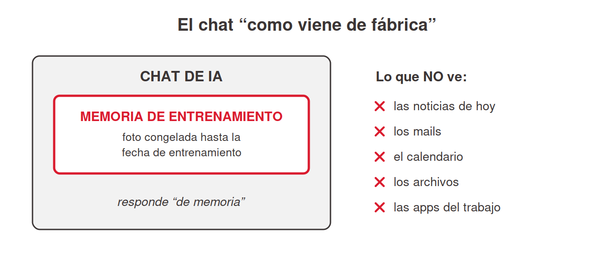
<!-- ascii-source:
        EL CHAT "COMO VIENE DE FABRICA"
                                             lo que NO ve:
   +---------------------------------+       x  noticias de hoy
   |            CHAT DE IA           |       x  los mails
   |  +---------------------------+  |       x  el calendario
   |  |  MEMORIA DE ENTRENAMIENTO |  |       x  los archivos
   |  |  (foto congelada hasta la |  |       x  las apps del trabajo
   |  |   fecha de entrenamiento) |  |
   |  +---------------------------+  |
   |     responde "de memoria"       |
   +---------------------------------+
-->
<!-- ascii-note:
intent: mostrar que el chat de IA sin extensiones responde solo desde su memoria de entrenamiento (foto congelada hasta la fecha de entrenamiento) y no tiene acceso al mundo del usuario.
emphasize: la caja interna "MEMORIA DE ENTRENAMIENTO (foto congelada)"; la lista de lo que NO ve (noticias de hoy, mails, calendario, archivos, apps) fuera de la caja.
labels: caja exterior = CHAT DE IA; caja interior = memoria de entrenamiento / fecha de entrenamiento; columna derecha = lo que no ve.
-->

### Sources

- Anthropic Support, Enabling and using web search: https://support.claude.com/en/articles/10684626-enabling-and-using-web-search; el encuadre oficial: sin búsqueda web, Claude responde limitado a su información de entrenamiento; la búsqueda le da acceso a información actual (referencia también para la Sección 2).
- (concepto general de LLM: fecha de corte / respuestas desde entrenamiento / alucinaciones; material introductorio estándar del curso; sin claim específico de producto.)

### Speaker notes

Arrancar desde lo conocido: pedir a mano alzada quién usó un chat de IA esta semana. Van a levantar la mano casi todos (ChatGPT, Gemini, Claude). La idea a instalar: ese chat, tal como viene, responde de memoria. Cuando le preguntás no busca nada; recuerda lo que leyó hasta su fecha de entrenamiento (knowledge cutoff). Un colega brillante que leyó muchísimo hasta una fecha y desde entonces está incomunicado. Tres consecuencias que ya sufrieron sin saberlo. Una, datos viejos: precios, noticias, versiones de software y papers posteriores al corte no existen para el modelo. Dos, inventos con cara de verdad: cifras, citas y referencias que suenan perfectas y son falsas (insistir en verificar toda salida). Tres, la más limitante para el trabajo real: no ve nada tuyo, ni mails, ni calendario, ni archivos, ni apps. Ese tercer límite abre la charla: ¿y si pudiéramos conectarlo? Tiempo objetivo: ~6 min.

---

# 2. Conectores: extender el chat

**Goal of this section:** Instalar el concepto de conector, válido para todas las IAs: con conectores, el chat consulta información real (búsqueda web, mail, calendario) y hasta actúa (mandar mails, agendar reuniones); sin ellos, responde de memoria. La distinción a fijar es memoria de entrenamiento vs información viva.

---

## 1. Chat solo vs chat con conectores

### Content

- **Conector** = extensión que conecta el chat a un sistema externo: web, mail, calendario, documentos.
- Vale igual en ChatGPT, Gemini y Claude.
- **Chat solo** → responde de memoria. **Chat con conectores** → consulta fuentes reales antes de responder.
- Se activa a través de la biblioteca de conectores. Muchos requieren autenticación.

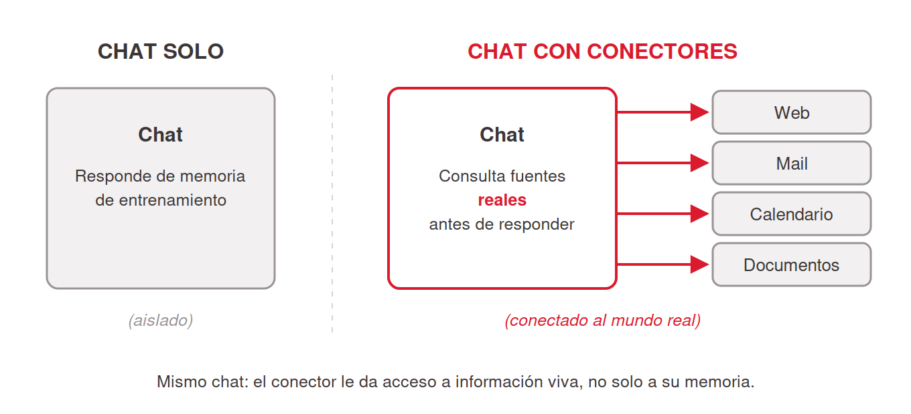
<!-- ascii-source:
   CHAT SOLO                        CHAT CON CONECTORES
+----------------+              +----------------+
|     CHAT       |              |     CHAT       |----&gt; [ web ]
|  responde de   |              |  consulta      |----&gt; [ mail ]
|  memoria de    |              |  fuentes       |----&gt; [ calendario ]
|  entrenamiento |              |  REALES antes  |----&gt; [ documentos ]
+----------------+              |  de responder  |
   (aislado)                    +----------------+
                                  (conectado al mundo real)
-->
<!-- ascii-note:
intent: contrastar lado a lado el chat aislado (responde de memoria de entrenamiento) contra el chat con conectores (consulta fuentes reales; web, mail, calendario, documentos; antes de responder).
emphasize: el lado derecho con las flechas hacia web/mail/calendario/documentos; la etiqueta "(conectado a tu mundo)" vs "(aislado)".
labels: izquierda = CHAT SOLO (aislado, memoria de entrenamiento); derecha = CHAT CON CONECTORES (web, mail, calendario, documentos).
-->

### Sources

- Anthropic Support, Enabling and using web search: https://support.claude.com/en/articles/10684626-enabling-and-using-web-search; la búsqueda web como capacidad integrada del chat de Claude.
- Claude blog, Connectors directory: https://claude.com/blog/connectors-directory; el catálogo oficial de conectores de Claude (referencia ampliada en la slide 2.4; verificado 2026-07-09).

### Speaker notes

La slide instala el concepto que ordena la sección: un conector saca al chat de su aislamiento y le da acceso a buscar en la web, leer tu mail, ver tu calendario, consultar tus documentos. Repetir que es transversal: lo que aprendan acá vale para ChatGPT, Gemini y Claude. Los nombres cambian ("connectors", "apps", "extensiones"), la idea es la misma. Usar el diagrama para el contraste: mismo chat, ahora con líneas hacia afuera, y antes de responder puede ir a buscar información real a la fuente (la web, tu inbox, tu agenda). Cerrar bajando la barrera de entrada: esto se activa con un clic o un toggle en la configuración, sin programar. Tiempo objetivo: ~5 min.

---

## 2. El primer conector: búsqueda web

### Content

- El conector más universal: viene en casi todos los chats (Claude, ChatGPT, Gemini). Se activa con un toggle.
- **Dos modos de responder:**
  - **De memoria** → recuerda hasta la fecha de entrenamiento. Puede estar viejo o mal.
  - **Con búsqueda** → busca información real, actualizada, y **cita fuentes**.
- El "buscando..." y las fuentes citadas marcan el punto de verificación.
- Regla: si la respuesta pudo cambiar → búsqueda obligada.


<!-- ascii-source:
   la MISMA pregunta: "¿ultima version de X?"

   DE MEMORIA                        CON BUSQUEDA WEB
+------------------+             +------------------+
| entrenamiento    |             | busca ahora en   |
| hasta fecha de   |             | la web           |
| entrenamiento    |             |   |              |
|   |              |             |   v              |
|   v              |             | info REAL y      |
| respuesta        |             | actual + fuentes |
| (quizas vieja o  |             | citadas          |
|  inventada)      |             +------------------+
+------------------+
-->
<!-- ascii-note:
intent: contrastar, para una misma pregunta, la respuesta de memoria de entrenamiento (posiblemente vieja o inventada) contra la respuesta con búsqueda web (información real y actual, con fuentes citadas).
emphasize: que es la MISMA pregunta con dos caminos; el lado derecho termina en "info REAL y actual + fuentes citadas"; el lado izquierdo en "quizás vieja o inventada".
labels: izquierda = DE MEMORIA (fecha de entrenamiento); derecha = CON BÚSQUEDA WEB (busca ahora, cita fuentes).
-->

### Sources

- Anthropic Support, Enabling and using web search: https://support.claude.com/en/articles/10684626-enabling-and-using-web-search; "Web search expands Claude's knowledge with real-time data"; "Every response includes citations, so you can easily verify sources yourself" (verificado 2026-07-09).
- OpenAI Help, ChatGPT search: https://help.openai.com/en/articles/9237897-chatgpt-search; búsqueda web integrada en ChatGPT, automática cuando la pregunta lo amerita, con citas inline (evidencia de que el concepto es transversal; verificado 2026-07-09).

### Speaker notes

Acá se fija la distinción memoria vs información viva. Con conexión, hacerlo en demo de 2 minutos: la misma pregunta ("¿cuál es la última versión de X?" o "¿qué pasó ayer con Y?") con búsqueda apagada y prendida, y comparar. Señalar el indicador de "buscando..." y las fuentes citadas; enseñarles a mirar eso cada vez. Es el conector más fácil de activar (un toggle en la configuración; en varios chats ya viene activo por defecto). La regla práctica que se llevan: si la respuesta pudo haber cambiado desde el entrenamiento (precios, noticias, versiones, papers, normativa), exigí búsqueda. Arrancamos por este conector porque ya lo tienen; falta saber cuándo está actuando. Tiempo objetivo: ~7 min (con demo).

---

## 3. Conectores y MCP: las "manos" del chat

### Content

- Conectores = **las "manos"**: lo que la IA puede tocar que de otro modo no podría (Drive, Gmail, Calendar, Slack, bases de datos).
- **MCP**: el nombre técnico que se le da a los conectores. Son una forma de hacer que la IA traduzca las solicitudes del usuario en código que interactúa con el servicio conectado.
- Un equipo técnico puede armar **conectores propios** (custom, vía MCP).

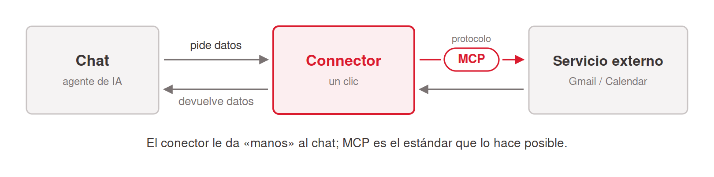
<!-- ascii-source:
+--------+   pide datos    +-----------+   protocolo   +--------------+
| CHAT / | --------------&gt; | Connector |  -- MCP --&gt;   | Servicio ext |
| agente |                 |  (1 clic) |               | Gmail/Calendar|
+--------+ <-------------- +-----------+ <-----------  +--------------+
            devuelve datos
-->
<!-- ascii-note:
intent: mostrar el flujo de una llamada a un Connector: el chat/agente pide datos, el Connector traduce vía el protocolo MCP, el servicio externo responde.
emphasize: la etiqueta "MCP" sobre la flecha del medio; el Connector como puente de un clic.
labels: Chat/agente -> Connector (1 clic) -> Servicio externo (Gmail / Calendar); flecha de ida "pide datos", flecha de vuelta "devuelve datos".
-->

### Sources

- corpus/agentic-ai-deck.zip.md, definición de Connector (MCP): "The hands"; slide 5.4 (rango de MCP; "any app that exposes an MCP server").
- "corpus/mision - auto.zip.md", MT Newswires "ya tiene un connector listo" (Step 2.1); Gmail connector de un clic (M3).
- Model Context Protocol (sitio oficial del estándar): https://modelcontextprotocol.io; qué es MCP y cómo las plataformas exponen herramientas; base de los conectores personalizados.
- Anthropic Support, Getting started with custom connectors using remote MCP: https://support.claude.com/en/articles/11175166-getting-started-with-custom-connectors-using-remote-mcp; los conectores personalizados existen y se agregan vía MCP (mención, sin profundizar).

### Speaker notes

Desarmar el miedo: conectar un servicio externo le da "manos" al chat, sin programar nada. Usar el diagrama para explicar qué pasa por debajo: la IA pide datos y el conector los trae vía MCP (Model Context Protocol), el estándar que vuelve conversacional a cualquier plataforma con API. El patrón: la plataforma abre sus internals como herramientas. Mencionar dos o tres ejemplos del ecosistema (Figma, Vercel, Cal.com, Home Assistant) y seguir. Decir al pasar que un equipo técnico puede desarrollar conectores propios (custom, vía MCP); a nivel usuario alcanza con el directorio, que viene en la próxima slide. Los ejemplos guía de la sección son mail y calendario, porque son los que la audiencia ya tiene. Tiempo objetivo: ~8 min.

---

## 4. El directorio de conectores: mail, calendario y compañía

### Content

- Sin programar: **buscar + Connect + autorizar**. Como conectar Gmail a una app nueva.
- De dónde salen: **directorio oficial de Claude** · comunidad (solo lo confiable) · propios (custom).

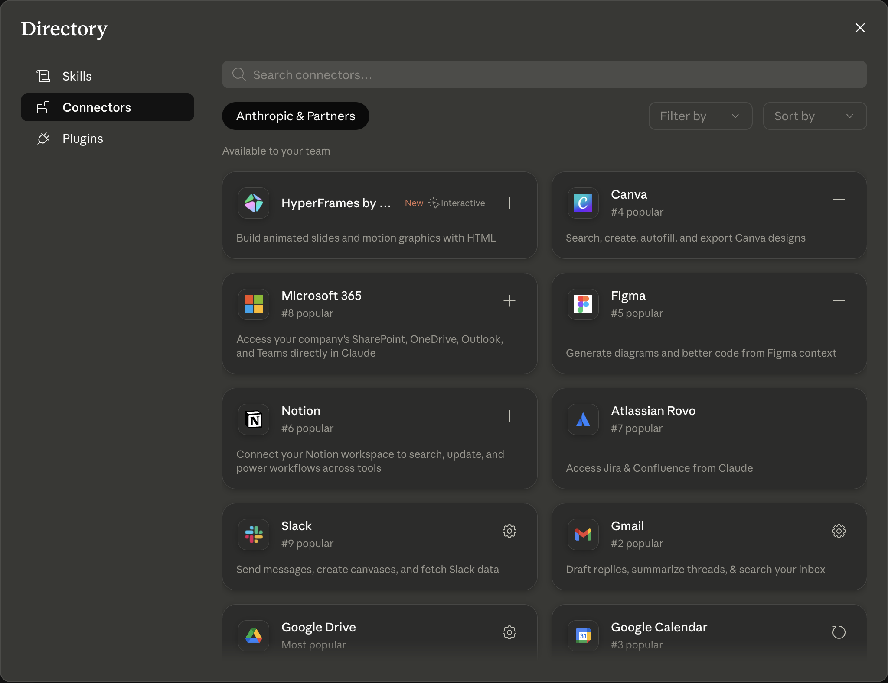

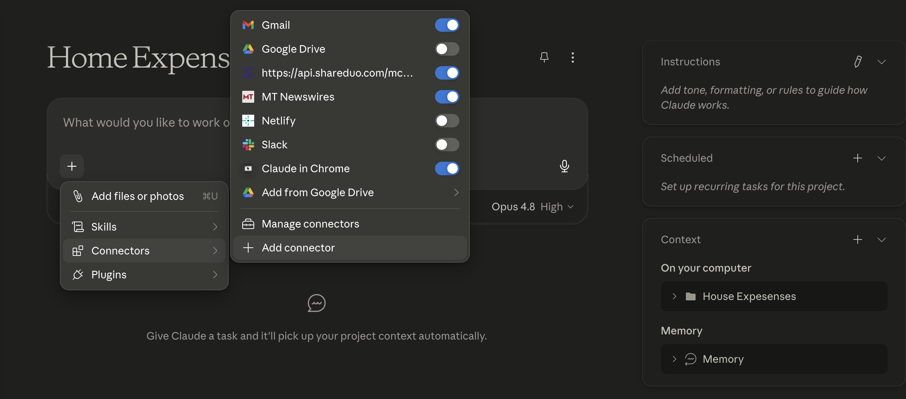

- Ejemplos guía: **mail y calendario**. "¿Qué mails me perdí ayer? ¿Qué tengo esta semana?"
- Atlas: **MT Newswires** ya está en el directorio y se conecta con un clic.
- Un conector no oficial, al autorizarse, **accede a los datos del usuario**. Conectar solo fuentes confiables.

### Sources

- Claude blog, Discover tools that work with Claude (Connectors directory): https://claude.com/blog/connectors-directory; anuncio oficial del directorio; navegar y conectar de un clic vía claude.ai/directory (verificado 2026-07-09; el directorio en sí requiere login).
- Anthropic Support, Use connectors to extend Claude's capabilities: https://support.claude.com/en/articles/11176164-use-connectors-to-extend-claude-s-capabilities; cómo se conectan y usan los conectores desde la configuración.
- corpus/agentic-ai-deck.zip.md, matriz 5.6 (Connectors configurados por la Settings UI; directorio + un clic).
- "corpus/mision - auto.zip.md", MT Newswires "ya tiene un connector listo" (Step 2.1); Gmail connector de un clic (M3); "no estás programando: te conectás a un servicio que ya existe".
- Anthropic Support, Getting started with custom connectors using remote MCP: https://support.claude.com/en/articles/11175166-getting-started-with-custom-connectors-using-remote-mcp; la vía de los conectores no oficiales / propios y la base del criterio de confianza: "allow you to connect Claude to services that have not been verified by Anthropic, and allow Claude to access and take action in these services" (verificado 2026-07-09).

### Speaker notes

Slide práctica. Mostrar las dos capturas (el directorio de conectores y la pantalla de conexión) para desarmar el "esto es técnico". Conectar un servicio es buscar + Connect + autorizar, igual que cuando conectás Gmail a cualquier app; se configura por la UI, sin archivo local que editar. Insistir en mail y calendario, los ejemplos guía de la sección: con Gmail conectado el chat lee y resume tu inbox, con Calendar ve tu agenda. Son preguntas que el chat aislado no puede responder. Sobre los no oficiales (servicios de terceros que exponen MCP): mismos pasos, más criterio. Autorizar un conector le da acceso a tus datos; conectá solo lo confiable. Ejemplo de la misión: MT Newswires (noticias), con el que Atlas lee noticias reales del día. Nota: las capturas son de la app de Claude (Cowork); el flujo buscar+Connect es el mismo en el chat. Tiempo objetivo: ~6 min.

---

## 5. Los conectores también actúan: del leer al hacer

### Content

- Además de traer info, un conector expone **acciones**: la IA **hace**.
- Ejemplos:
  - **Mandar / dejar redactado un mail** (borrador en Gmail).
  - **Agendar una reunión** (evento en el calendario).
  - **Abrir un ticket** (Jira, ServiceNow…).
  - **Mandar un mensaje** (Slack o similar).
- Cuidado con las autorizaciones y ser cauteloso con los permisos que le damos. **Un mail enviado automáticamente sin revisar por un ser humano puede generar muchos problemas.**
- Un chat que se informa y actúa puede trabajar **solo** (sección 3).


<!-- ascii-source:
        CONECTOR: dos direcciones

   LEER (traer info)          ACTUAR (hacer)
   <------------------        ------------------&gt;
+------+           +----------+           +----------+
| CHAT |  <------- | conector |  ------&gt;  | el mundo |
+------+   inbox,  +----------+  mandar   | mail     |
           agenda,              mail,     | calendario|
           noticias             agendar,  | tickets  |
                                ticket    | mensajes |
                                          +----------+
-->
<!-- ascii-note:
intent: mostrar que un conector funciona en dos direcciones: leer (traer información: inbox, agenda, noticias) y actuar (ejecutar acciones: mandar mail, agendar reunión, abrir ticket, mandar mensaje).
emphasize: las dos flechas opuestas LEER vs ACTUAR sobre el mismo conector; que ACTUAR es la capacidad ejecutiva nueva de esta slide.
labels: izquierda = CHAT; centro = conector; derecha = tu mundo (mail, calendario, tickets, mensajes); flecha de lectura y flecha de acción.
-->

### Sources

- Model Context Protocol, https://modelcontextprotocol.io; el estándar define herramientas que ejecutan acciones sobre sistemas externos, no solo lectura: "AI applications ... which can access your data and take actions on your behalf" (verificado 2026-07-09).
- Anthropic Support, Getting started with custom connectors using remote MCP: https://support.claude.com/en/articles/11175166-getting-started-with-custom-connectors-using-remote-mcp; los conectores permiten a Claude "access and take action in these services" (verificado 2026-07-09).
- "corpus/mision - auto.zip.md", el connector de Gmail **deja un borrador de correo** para el equipo (capacidad ejecutiva en acción, M3 y loop final).
- Verificación de primera mano del presentador (2026-07-09): la acción de **agendar/crear eventos vía el connector de Calendar** está chequeada y funciona.
- corpus/agentic-ai-deck.zip.md, Connectors como "las manos" del agente (tocar sistemas, no solo leerlos).

### Speaker notes

El giro de la sección: hasta acá el conector era una antena que traía info; ahora es una mano que actúa. Recorrer los cuatro ejemplos (mail, reunión, ticket, mensaje), comunes a cualquier trabajo. Dos están verificados de primera mano: el borrador de Gmail (misión Atlas) y agendar por Calendar, que el docente chequeó y puede demostrar en vivo. Tickets y mensajes se presentan como capacidad del ecosistema (el estándar MCP y los conectores lo permiten), sin prometer un conector puntual que no probamos. Balancear con el control: nada de esto pasa sin que hayas conectado y autorizado el servicio. La práctica sana mientras aprenden es "borrador, no envío directo"; Atlas hace eso, deja el borrador en Gmail y no lo manda. Cerrar sembrando la sección 3: una IA que se informa y actúa, más una agenda, puede trabajar sola. Tiempo objetivo: ~6 min.

---

# 3. Tareas programadas: el chat trabaja solo

**Goal of this section:** Que la audiencia entienda qué es una tarea programada (describir un trabajo una vez, fijar una cadencia, que corra sola), cómo se potencia con conectores (el resumidor semanal de mails) y la pregunta práctica antes de confiarle algo: ¿dónde corre? Local, con la computadora prendida, o nube. Todavía desde el mundo del chat.

---

## 1. Tareas programadas desde el chat

### Content

- **Tarea programada** = un prompt que se ejecuta automáticamente en un momento preestablecido, y con frecuencia definida.
- La tarea usa los **conectores** ya configurados (mail, web, calendario).
- El ejemplo: *"todos los días 8:00, resumí mi inbox, lo urgente arriba."*
- Existe en **ChatGPT** ("tasks") y en **Claude** (claude.ai, desde el navegador).

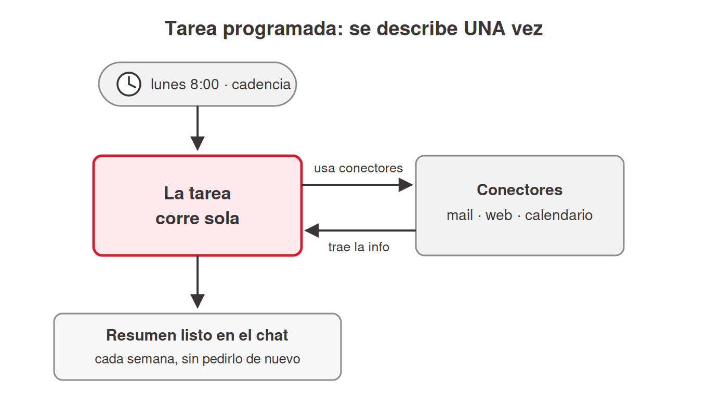
<!-- ascii-source:
        TAREA PROGRAMADA (se describe UNA vez)

  [reloj: lunes 8:00]
        |
        v
  +-----------+   usa conectores   +--------------+
  |  la tarea | -----------------&gt; | mail / web / |
  |  corre    | <----------------- | calendario   |
  |  sola     |    trae la info    +--------------+
  +-----------+
        |
        v
  resumen listo en el chat, cada semana,
  sin pedirlo de nuevo
-->
<!-- ascii-note:
intent: mostrar el ciclo de una tarea programada: un disparador de calendario (lunes 8:00) ejecuta la tarea, que usa los conectores (mail/web/calendario) para traer información y deja el resultado listo sin intervención del usuario.
emphasize: que se describe UNA vez y corre sola; el reloj como disparador; el uso de conectores dentro de la corrida; el resultado que "aparece" cada semana.
labels: reloj (cadencia) -> la tarea corre sola -> conectores (mail/web/calendario) -> resumen listo en tu chat.
-->

### Sources

- OpenAI Help, Tasks in ChatGPT: https://help.openai.com/en/articles/10291617-tasks-in-chatgpt; tareas programadas en el chat de ChatGPT (evidencia transversal del concepto; verificado 2026-07-09).
- Anthropic Support, Release notes (entrada del 7 de julio de 2026): https://support.claude.com/en/articles/12138966; "scheduled tasks run with no device online"; sesiones remotas (beta); rollout empezando por Max (verificado 2026-07-09).
- Observación de primera mano del presentador (2026-07-09): tareas programadas activas en claude.ai en el navegador.
- TechCrunch (2026-07-07), "The coding agent wars are spilling into the rest of the office": https://techcrunch.com/2026/07/07/the-coding-agent-wars-are-spilling-into-the-rest-of-the-office-claude-cowork/; cobertura de prensa: expansión a web/mobile, corridas en background sin dispositivo activo, rollout Max (encuadre de terceros).
- Anthropic Support, Schedule recurring tasks in Claude Cowork: https://support.claude.com/en/articles/13854387-schedule-recurring-tasks-in-claude-cowork; la forma Cowork (se desarrolla en la sección 4).
- "corpus/mision - auto.zip.md", el flujo programado de Atlas (Step 3.3): la semilla del "resumidor que corre solo".

### Speaker notes

Slide-concepto de la sección, en dos mitades. Primera: describís el trabajo una vez, elegís cadencia (diaria, semanal, a demanda) y corre solo, avisándote con el resultado. Segunda: la tarea hereda tus conectores. El resumidor de mails funciona como ejemplo porque el inbox desbordado es un problema que la audiencia vive. Variante semanal: "los lunes a las 8:00, resumime la semana del calendario + los mails sin responder". Contarlo en primera persona si se puede ("mi resumen de las 8:00"). Marcar que existe en los dos mundos: ChatGPT lo llama "tasks" (recordatorios, briefings diarios, monitoreo) y Claude ya las ofrece en claude.ai desde el navegador. Si el rollout lo permite, mostrarlas EN VIVO desde la cuenta del docente, que ya las usa. La pregunta de dónde corre la tarea (nube o local, computadora prendida) viene en la próxima slide; no adelantarla. En la sección 4 vuelven, sobre carpetas y archivos de verdad. Tiempo objetivo: ~6 min.

---

## 2. ¿Dónde corre la tarea? Local vs nube

### Content

- Antes de confiarle algo a una tarea programada: **saber dónde corre**.
- **Nube** (lo nuevo, julio 2026): corre **sin la computadora prendida**. Beta, rollout gradual, Max primero.
- **Local**: la computadora **prendida** y la app **abierta**.
- Cuidados del modo local:
  - Apagada/suspendida a la hora → la tarea **se saltea** y corre al volver.
  - Las laptops **se suspenden solas** (config de energía).
- Tareas que usan **archivos o apps locales** → corren local **siempre**.

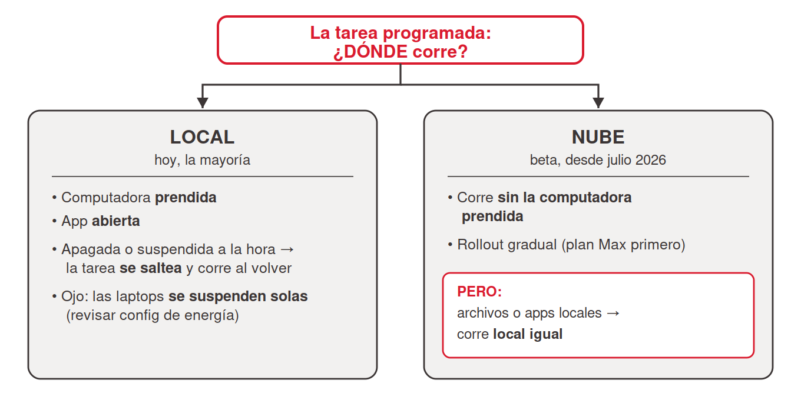
<!-- ascii-source:
   la tarea programada: ¿DONDE corre?
              |
      +-------+----------------------+
      v                              v
  LOCAL (hoy, la mayoria)      NUBE (beta, jul 2026 ->)
  · computadora prendida       · sin computadora prendida
  · app abierta                · rollout gradual (Max 1ro)
  · apagada => se saltea,      · PERO: archivos/apps
    corre al volver              locales => local igual
  · ojo laptops suspendidas
-->
<!-- ascii-note:
intent: mostrar la bifurcación práctica de una tarea programada según dónde corre: LOCAL (computadora prendida + app abierta; si está apagada se saltea y corre al volver; cuidado con laptops que se suspenden) vs NUBE (sin computadora prendida, beta desde julio 2026, rollout Max primero; excepción: tareas con archivos/apps locales corren local igual).
emphasize: la bifurcación como pregunta ("¿DÓNDE corre?"); en LOCAL los tres cuidados prácticos (prendida, app abierta, se saltea); en NUBE que no hace falta la computadora prendida pero es beta/rollout gradual, con la excepción de archivos locales.
labels: raíz = tu tarea programada ¿dónde corre?; rama izquierda = LOCAL (hoy, la mayoría) con cuidados; rama derecha = NUBE (beta, julio 2026) con condiciones.
-->

### Sources

- Anthropic Support, Schedule recurring tasks in Claude Cowork: https://support.claude.com/en/articles/13854387-schedule-recurring-tasks-in-claude-cowork; ejecución remota ("run on their cadence even when your computer is asleep or the Claude Desktop app is closed") y la excepción local: "If a scheduled task requires local files or apps, it will only run locally" (verificado 2026-07-09).
- Anthropic Support, Release notes (7 de julio de 2026): https://support.claude.com/en/articles/12138966; "scheduled tasks run with no device online"; beta, rollout gradual empezando por Max (verificado 2026-07-09).
- TechCrunch (2026-07-07): https://techcrunch.com/2026/07/07/the-coding-agent-wars-are-spilling-into-the-rest-of-the-office-claude-cowork/; corridas en background sin dispositivo activo, disponible primero para suscriptores Max (encuadre de terceros).
- Comportamiento local "se saltea y corre al volver": documentado en la versión anterior del artículo 13854387 (verificada en junio 2026, cuando la ejecución era solo local); la versión actual ya no lo detalla; mantenido como cuidado práctico del modo local, con esa atribución.

### Speaker notes

La slide del consejo práctico que pidió el presentador: "tengan en cuenta que la computadora esté prendida". Hoy conviven dos realidades y hay que enseñar las dos. Una: la ejecución en la nube existe desde el 7 de julio de 2026, la tarea corre sin tu computadora, pero es beta y llega de a poco, empezando por el plan Max. Dos: mientras a tu cuenta no le llegue, la tarea corre local. Computadora prendida y app abierta, o no corre. Los cuidados del modo local son los que la mayoría de la audiencia va a vivir este cuatrimestre. Si la computadora está apagada o suspendida a la hora programada, la corrida se saltea y se ejecuta al volver (comportamiento documentado cuando la ejecución era solo local; el artículo actual ya no lo detalla, decirlo como cuidado práctico y no como spec). Las laptops se suspenden solas; revisar la configuración de energía si el resumen de las 8:00 nunca aparece. Cerrar con la excepción que sobrevive incluso con nube: una tarea que necesita tus archivos o apps locales corre local siempre. Eso anticipa la sección 4, donde las tareas de Cowork viven de tus carpetas. Antes de confiarle el reporte del lunes a una tarea, contestá "¿dónde corre esto?". Tiempo objetivo: ~5 min.

---

## 3. Fin de la parte 1

### Content

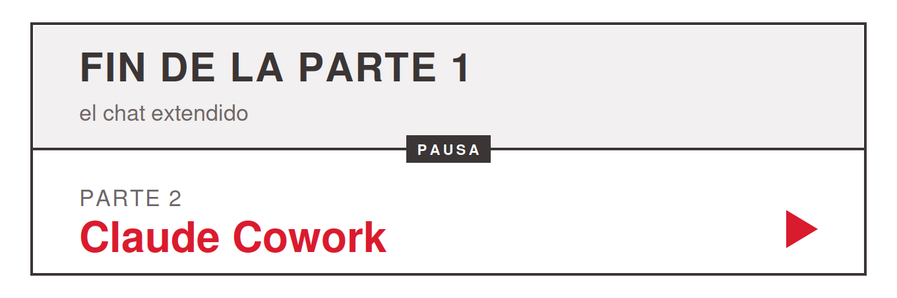
<!-- ascii-source:
   ______________________________________________
  |                                              |
  |   FIN DE LA PARTE 1                          |
  |   el chat extendido                          |
  |                                              |
  |   PARTE 2                                    |
  |   Claude Cowork                              |
  |______________________________________________|
-->
<!-- ascii-note:
intent: placa/cartel de corte entre las dos partes de la clase: cierra la parte 1 (el chat extendido) y anuncia la parte 2 (Claude Cowork). Señal visual de pausa, no un diagrama de flujo.
emphasize: el corte en dos mitades de la placa; "FIN DE LA PARTE 1" arriba y "PARTE 2: Claude Cowork" abajo.
labels: arriba = FIN DE LA PARTE 1 (el chat extendido); abajo = PARTE 2 (Claude Cowork).
-->

- La clase se dicta en dos partes. Acá termina la primera.
- **Parte 1:** el chat, sus límites, los conectores y las tareas programadas.
- **Parte 2:** Claude Cowork. La IA baja a la computadora y trabaja sobre carpetas y archivos reales.

### Sources

- (slide organizativa de la clase; sin claims de producto.)

### Speaker notes

Marcar el corte del día: acá termina el primer bloque de la clase y conviene hacer la pausa. Todo lo visto hasta este punto (conectores, capacidad ejecutiva, tareas programadas) pasa en el chat que la audiencia ya tiene, sin instalar nada; la primera parte de la misión Atlas se resuelve solo con estas piezas. Al volver de la pausa arranca la parte 2 con Claude Cowork. Tiempo objetivo: ~2 min + pausa.

---

# 4. Cowork: cambiar la forma de trabajar

**Goal of this section:** El salto grande de la charla. Cowork es Claude instalado en la computadora, trabajando sobre carpetas y archivos reales; eso cambia la forma de trabajar. Ubicar las tres superficies de Claude, pasar de chatear a delegar resultados y dominar las piezas del día a día (interfaz, Instrucciones, Projects, archivos .md, Schedule sobre carpetas reales, Live Artifacts).

---

## 1. Las tres superficies de Claude

### Content

- El chat ya quedó extendido. Ahora la IA baja a la computadora. Primero el mapa:
- **Mismos modelos Claude** en las tres caras; **Code y Cowork** comparten además la misma base técnica. Web/Chat = superficie de chat.
- **Web/Chat**: navegador, tareas puntuales. *Donde estuvimos hasta ahora.*
- **Claude Code**: terminal; developers.
- **Cowork**: Claude Code hecho para ofimática y tareas que no tratan de programar. GUI de escritorio, trabajo multipaso sobre archivos reales. *El foco del resto de la charla.*

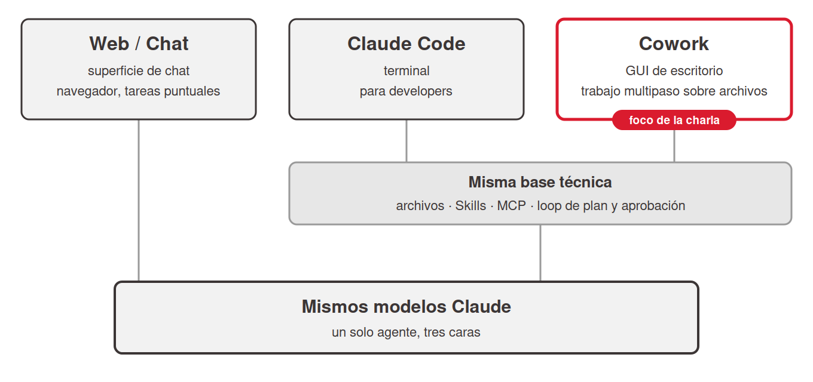
<!-- ascii-source:
+----------------+   +----------------+   +----------------+
|   Web / Chat   |   |  Claude Code   |   |     Cowork     |
| superficie de  |   | terminal+Code  |   |  GUI, escritorio|
|   chat         |   | escribir codigo|   | trabajo multipaso|
+----------------+   +----------------+   +----------------+
        |              \________  ________/
        |                  misma base tecnica
        |                  archivos / Skills / MCP / loop
        \________________   |   ________________/
                         \  |  /
                  +--------------------+
                  | MISMOS MODELOS     |
                  |     CLAUDE         |
                  +--------------------+
-->
<!-- ascii-note:
intent: mostrar que las tres superficies corren sobre los mismos modelos Claude, y que Code+Cowork además comparten la misma base técnica, mientras Web/Chat es la superficie de chat de ese modelo.
emphasize: la caja base "MISMOS MODELOS CLAUDE" como cimiento de las tres; el lazo "misma base técnica" que une Claude Code y Cowork (no Web/Chat); resaltar Cowork como el foco de la charla.
labels: tres columnas (Web/Chat = chat, Claude Code y Cowork = misma base técnica) sobre una base de modelos Claude compartida.
-->

### Sources

- corpus/agentic-ai-deck.zip.md, "Same engine. Different surface." (key claims; slide 7.1 "Claude Code vs Cowork — the close").
- "corpus/mision - auto.zip.md", framing de arquitectura Cowork (local, GUI, sin terminal).
- Anthropic, Claude Cowork (product page): https://www.anthropic.com/product/claude-cowork; "built on the very same foundations as Claude Code" (confirma que Cowork comparte base con Claude Code).
- Anthropic Engineering, Building agents with the Claude Agent SDK: https://www.anthropic.com/engineering/building-agents-with-the-claude-agent-sdk; el engine de agente común (Agent SDK) sobre el que se construyen Claude Code y Cowork.

### Speaker notes

Abrir la sección conectando con el recorrido: "hasta acá, todo pasó en la superficie de chat; ahora cambiamos de superficie". Es el mismo agente con tres caras; cambia la superficie y para quién está pensada. El matiz técnico, para decir y no para la slide: Cowork está construido sobre las mismas bases que Claude Code (el Claude Agent SDK), así que Code y Cowork comparten el mismo engine de agente, con los mismos archivos, las mismas Skills, el mismo MCP y el mismo loop de plan, aprobar y redirigir. Web/Chat es ese mismo modelo en una superficie de chat, sin el loop agéntico completo. Dejar claro que el resto de la charla vive en Cowork, la cara para quien no vive en una terminal. Claude Code aparece solo como contraste; no entramos en sus internals. Tiempo objetivo: ~5 min.

---

## 2. El superpoder de Cowork: la herramienta de propósito general del knowledge worker

### Content

- Cowork = Claude instalado en la computadora, trabajando sobre las carpetas y archivos del usuario. **Eso cambia la forma de trabajar.**
- La **herramienta de propósito general del knowledge worker**. El "lenguaje de programación" es el español.
- **"El nuevo Excel"**: la nueva habilidad base de oficina.
- Anthropic: **"Claude Code para el resto de tu trabajo"**.

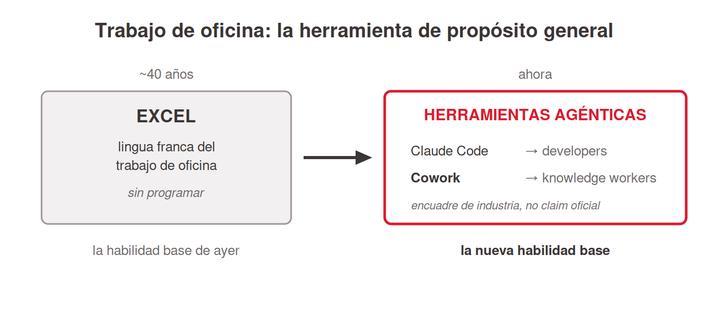
<!-- ascii-source:
TRABAJO DE OFICINA: la herramienta de proposito general

 ~40 anios                              ahora
+----------------------+    ===>    +-----------------------------+
| EXCEL                |            | HERRAMIENTAS AGENTICAS      |
| lingua franca del    |            | Claude Code  (developers)   |
| trabajo de oficina   |            | Cowork       (knowledge     |
| (sin programar)      |            |               worker)       |
+----------------------+            +-----------------------------+
 la habilidad base de ayer           la nueva habilidad base
-->
<!-- ascii-note:
intent: encuadrar el "superpoder" de Cowork como herramienta de propósito general del knowledge worker, usando la analogía Excel (40 años, habilidad base de oficina) -> herramientas agénticas (Claude Code para developers, Cowork para knowledge workers) como la nueva habilidad base.
emphasize: la flecha temporal de Excel (ayer) a las herramientas agénticas (ahora); el paralelo Claude Code=developers / Cowork=knowledge worker; que la analogía Excel es encuadre de industria, no claim oficial.
labels: dos cajas; EXCEL (lingua franca, sin programar) a la izquierda; HERRAMIENTAS AGENTICAS (Claude Code = developers, Cowork = knowledge worker) a la derecha; pie "habilidad base de ayer" -> "nueva habilidad base".
-->

### Sources

- corpus/agentic-ai-deck.zip.md, posicionamiento Cowork vs Claude Code ("Same engine. Different surface."; Cowork = la cara para knowledge workers sin terminal; slide 7.1 "Claude Code vs Cowork — the close").
- Anthropic, Claude Cowork (product page): https://www.anthropic.com/product/claude-cowork; encuadre oficial: Cowork como "Claude Code para el resto de tu trabajo"; construido sobre las mismas bases que Claude Code.
- Claude blog, Cowork research preview ("Claude Code power for knowledge work"): https://claude.com/blog/cowork-research-preview; la ambición de llevar el poder de Claude Code al trabajo del conocimiento; Cowork generaliza un éxito probado primero con developers.
- CNBC, Anthropic's Claude Cowork targets the office worker: https://www.cnbc.com/2026/02/24/anthropic-claude-cowork-office-worker.html; encuadre de público general / office worker.
- "Claude Code is the New Excel" (ensayo de analista): https://nextword.substack.com/p/claude-code-is-the-new-excel; origen de la analogía del "nuevo Excel" (atribuir AQUÍ, NO a Anthropic).

### Speaker notes

El beat de "¿y a mí por qué me importa?". Cowork es, literalmente, Claude instalado en la computadora, con acceso a las carpetas y archivos del usuario; y eso habilita una forma de trabajar distinta de la del chat. Hasta acá la audiencia extendió un chat; esta slide anuncia otra categoría de herramienta. Tono motivacional y de alto nivel; la mecánica viene después.

El gancho que mejor funciona es la analogía del Excel, dicha con cuidado. Durante unas cuatro décadas, saber Excel fue la habilidad base del trabajo de oficina: sin programar, con Excel resolvías el 80% del trabajo de conocimiento. La tesis de varios analistas de la industria es que las herramientas agénticas (Claude Code para los que programan, Cowork para los que no) van camino a ser esa nueva habilidad base. Atribuirlo a analistas e industria, "hay quien lo llama el nuevo Excel", y NO a Anthropic.

Lo que sí es de Anthropic, y conviene citarlo como su framing propio, es "Claude Code para el resto de tu trabajo": que cualquier knowledge worker sienta con Cowork lo que los ingenieros ya sienten con Claude Code. Cowork generaliza algo que ya funcionó primero con developers.

Cerrar aterrizándolo en la audiencia: son alumnos de management, la mayoría no programa, y justamente por eso Cowork les sirve. Después de este beat pasamos a la mecánica, cómo se delega (próxima slide). Tiempo objetivo: ~4-5 min.

---

## 3. De chat a agente: el cambio de paradigma

### Content

- El chat ya quedó extendido. Lo que cambia ahora es el rol: **delegar**.
- Anthropic: *"menos una sesión de chat, más asignarle tareas a un colega."*
- Chatear vs delegar:

| | Chatear | Delegar a un agente |
|---|---|---|
| La forma de trabajo | Un mensaje a la vez | Se describe un resultado |
| Los pasos | Los hace la persona | El agente planifica y ejecuta |
| La salida | Texto en la ventana | Archivos en el disco |
| El rol humano | Hacer cada paso intermedio | Revisar el plan y corregir el rumbo |

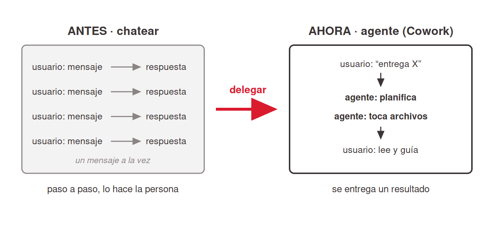
<!-- ascii-source:
ANTES (chat)                    AHORA (agente / Cowork)
+----------+                    +------------------------+
| vos: msg | --&gt; respuesta      | vos: "entrega X"       |
| vos: msg | --&gt; respuesta      |        |               |
| vos: msg | --&gt; respuesta      |        v               |
| vos: msg | --&gt; respuesta      | agente: planifica      |
+----------+                    | agente: toca archivos  |
 paso a paso, lo hacés vos      | vos: leés y guiás      |
                                +------------------------+
                                 entregás un resultado
-->
<!-- ascii-note:
intent: contrastar el modo "chat" (un mensaje a la vez, vos hacés cada paso) contra el modo "agente" (delegás un resultado, el agente planifica y ejecuta sobre tus archivos).
emphasize: la flecha de paradigma de izquierda (ANTES) a derecha (AHORA); que en AHORA el agente hace el trabajo y vos guiás.
labels: ANTES (chat) vs AHORA (agente / Cowork).
-->

### Sources

- corpus/agentic-ai-deck.zip.md, "Stop prompting. Start delegating." (slide 2.3 the reframe); tabla "Chatting vs Delegating" (slide 3.16).
- "corpus/mision - auto.zip.md", "el verdadero premio no es Atlas: sos vos, dominando Claude Cowork"; "Conversá, no programes."
- Anthropic, Claude Cowork (product page): https://www.anthropic.com/product/claude-cowork; refuerza el paradigma: trabajar con Cowork "se parece menos a una sesión de chat y más a asignarle tareas a un colega".
- (técnico, opcional) Anthropic Engineering, Building agents with the Claude Agent SDK: https://www.anthropic.com/engineering/building-agents-with-the-claude-agent-sdk; por qué el loop plan→ejecutar→guiar define a un agente frente a un chat.

### Speaker notes

El concepto-ancla de la charla. Conectarlo con el recorrido: los conectores y las tareas programadas extendieron qué puede hacer el chat; el agente cambia tu rol. En los dos modos se escriben prompts; lo que cambia es qué pide cada prompt: un paso intermedio, o un resultado completo que el agente planifica y ejecuta sobre archivos reales mientras vos supervisás. Son dos formas de trabajar, no dos productos. Si se llevan una sola idea, que sea esta: el valor está en aprender a delegar un resultado y guiar el proceso. Usar la tabla para hacerlo concreto: la salida son archivos en el disco, no texto en una ventana. Anticipar la misión: vamos a "contratar" a Atlas, un analista de mercado virtual, y entrenarlo una vez para que después trabaje solo. Cerrar citando a Anthropic, "menos una sesión de chat, más asignarle tareas a un colega": el producto está pensado así. Tiempo objetivo: ~5 min.

---

## 4. El mapa de la charla: bloques que se apilan

### Content

- **Bloques que se apilan**: cada uno resuelve un problema. No es una escalera; cada tarea usa solo los bloques que necesita.
- El mapa de la charla.
- Cada bloque = un problema conocido:
  - **El chat** *(visto)* → *respondía solo de memoria.*
  - **Conectores** *(visto)* → *quiero info real, y que actúe.*
  - **Tareas programadas** *(visto)* → *quiero que corra solo.*
  - **Cowork: carpetas y archivos** *(estamos acá)* → *quiero que trabaje sobre mis archivos.*
  - **Instrucciones** → *no repetir el contexto.*
  - **Projects** → *agrupar todo el trabajo de un tema.*
  - **Archivos .md** → *que la IA entienda mi material.*
  - **Live Artifacts** → *compartir el resultado vivo.*
  - **Skills / Subagentes** *(avanzado)* → *no repetir la tarea / delegar en paralelo.*
- **Plugins** = capa transversal de distribución (sección 5).

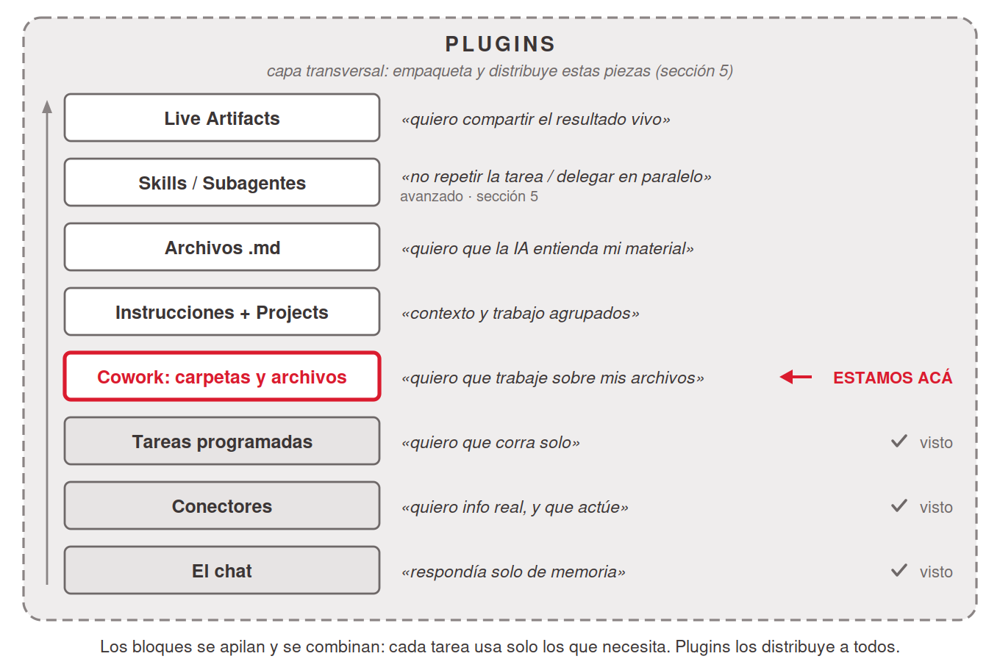
<!-- ascii-source:
+============== PLUGINS (capa transversal: empaquetan y distribuyen) ==============+
||                                                                                ||
||  +----------------------+  "quiero compartir el resultado vivo"                ||
||  | LIVE ARTIFACTS       |                                                      ||
||  +----------------------+                                                      ||
||  +----------------------+  "no quiero repetir la tarea / delegar en paralelo"  ||
||  | SKILLS / SUBAGENTES  |  (avanzado, seccion 5)                               ||
||  +----------------------+                                                      ||
||  +----------------------+  "quiero que la IA entienda mi material"             ||
||  | ARCHIVOS .MD         |                                                      ||
||  +----------------------+                                                      ||
||  +----------------------+  "contexto y trabajo agrupados"                      ||
||  | INSTRUCCIONES +      |                                                      ||
||  | PROJECTS             |                                                      ||
||  +----------------------+                                                      ||
||  +----------------------+  "quiero que trabaje sobre mis archivos"   <== ACA   ||
||  | COWORK: carpetas     |                                                      ||
||  +----------------------+                                                      ||
||  +----------------------+  "quiero que corra solo"                   (visto)   ||
||  | TAREAS PROGRAMADAS   |                                                      ||
||  +----------------------+                                                      ||
||  +----------------------+  "quiero info real + que actue"            (visto)   ||
||  | CONECTORES           |                                                      ||
||  +----------------------+                                                      ||
||  +----------------------+  "respondia solo de memoria"               (visto)   ||
||  | EL CHAT              |                                                      ||
||  +----------------------+                                                      ||
+==================================================================================+
   los bloques se apilan (cada uno suma autonomia); PLUGINS los distribuye a todos
-->
<!-- ascii-note:
intent: presentar el arco completo de la charla como bloques que se apilan (no una pirámide/escalera estricta): el chat (base) -> conectores -> tareas programadas -> Cowork (carpetas/archivos) -> Instrucciones+Projects -> archivos .md -> Skills/Subagentes -> Live Artifacts, con Plugins como BANDA TRANSVERSAL que envuelve/distribuye todo. Los tres bloques de abajo están marcados "(visto)" y el bloque Cowork lleva el marcador "estamos acá".
emphasize: el marcador "<== ACÁ" en el bloque Cowork; los "(visto)" en chat/conectores/tareas programadas; que Plugins es transversal (banda que rodea la pila, distinto color), NO un nivel más; el par bloque↔problema en cada nivel.
labels: banda exterior = PLUGINS (capa transversal, distribución). Bloques apilados (base→cima): El chat · Conectores · Tareas programadas · Cowork: carpetas · Instrucciones+Projects · Archivos .md · Skills/Subagentes · Live Artifacts, cada uno con su frase-problema a la derecha.
-->

### Sources

- corpus/agentic-ai-deck.zip.md, progresión de building blocks del deck (Instrucciones → Projects → Skills → Connectors/MCP → Schedule → Live Artifacts); la idea de "pila" es la lectura ordenada de esa progresión, re-secuenciada al arco chat-primero de esta charla.
- "corpus/mision - auto.zip.md", la misión Atlas arma estas piezas una por una.

### Speaker notes

El mapa de toda la sesión, con el arco nuevo: arranca en el chat que la audiencia ya usa, no en Cowork. Aprovechar el efecto acumulado: "los tres bloques de abajo ya los recorrimos" (chat, conectores, tareas programadas), y señalar el marcador de "estamos acá": Cowork, donde la IA empieza a trabajar sobre carpetas y archivos reales. Arrancar cada bloque por el problema; cada uno nace de una frustración concreta.

Cuidado con la metáfora: no es una pirámide donde cada capa depende de todas las de abajo. Son bloques que se apilan y se combinan; usás solo los que tu tarea necesita.

Decir la promesa de roadmap: "lo que queda de la charla recorre los bloques de acá para arriba, en este orden", y que pueden volver a esta slide entre secciones para ubicarse. Al final, la pila entera es Atlas.

Plugins es la banda que envuelve la pila, no un bloque más: empaqueta y distribuye varias de estas piezas a la vez (a un equipo, por ejemplo). No desarrollarlo acá; lo vemos en la sección 5. Tiempo objetivo: ~3-4 min.

---

## 5. (Demo time) Conozcamos la interfaz de Cowork

### Content

```ascii
   __________________________________________
  /                                          /|
 /            >   D E M O   T I M E          / |
/__________________________________________/  |
|                                          |   |
|     [ Pasamos a la app de Cowork ]       |  /
|__________________________________________| /
|__________________________________________|/
```
<!-- ascii-note:
intent: tarjeta/banner de "DEMO TIME" como señal visual fuerte al tope de la slide, para marcar el corte de conceptos a demo en vivo sobre la app.
emphasize: el texto grande "> DEMO TIME"; sensación de cartel/placa (no un diagrama de flujo); que abajo se lee "pasamos a la app de Cowork".
labels: banner DEMO TIME; subtítulo "Pasamos a la app de Cowork".
-->

- **DEMO EN VIVO**: tour de la pestaña Cowork sobre la app.


- Señalar en vivo: modo **"Ask"** vs modo automático, selector de carpeta, pestañas **Scheduled** y **Live artifacts**, panel de **Project**.
- Control = modo + aprobar/redirigir + carpeta.

### Sources

- corpus/agentic-ai-deck.zip.md, "screenshot-cowork-tab.png" (anatomía Cowork, 14 elementos anotados; el asset más Cowork-funcional de la fuente); slide 3.19 (modelo de aprobación Cowork).

### Speaker notes

Momento de demo en vivo, de los conceptos a la app. Abrir Cowork y hacer un recorrido de 2-3 minutos señalando dónde está el selector de modo (Ask before acting por defecto), cómo se concede una carpeta de trabajo y dónde viven Scheduled y Live artifacts, que usamos más adelante. Demo sugerida de arranque (la del deck): "Organizá esta carpeta de 8 PDFs por tema y dame un resumen de un párrafo de cada uno." Dejarlos ver a Claude planificar, tocar archivos y entregar, sin explicar la mecánica todavía. La imagen anotada queda de respaldo por si la demo falla. Tiempo objetivo: ~8 min (incluida la demo).

---

## 6. Instrucciones: ajustar el comportamiento sin repetir contexto

### Content

- Instrucciones = el **"contrato de trabajo"**: reglas en lenguaje natural que aplican a todo el Project.
- Ejemplo (Atlas):

```text
Sos Atlas, el analista de mercado de un equipo de trabajo.
Preparás un pulso semanal para colegas NO técnicos (incluido el jefe),
que se lee en 2 minutos antes de la reunión de los lunes.

· Empresas que seguís: Apple, Microsoft, Nvidia.
· Escribís en español, claro y breve, sin jerga financiera.
  Si usás un término técnico, lo explicás en una línea.
· REGLA DE ORO: tus reportes son informativos y de uso interno.
  NUNCA son recomendaciones de inversión ni asesoramiento financiero.
  Siempre incluís esa aclaración al final.
```

  Se escriben una sola vez.
- Conviene que sean cortas y claras.
- El lugar de las **reglas no negociables**.

### Sources

- corpus/agentic-ai-deck.zip.md, "the project context panel (GUI)" como lugar de las Instrucciones en Cowork; matriz de disponibilidad 3.3 (Persistent instructions, Cowork ⚠️).
- "corpus/mision - auto.zip.md", texto exacto de las Project Instructions de Atlas (Step 1.1); "las Instrucciones son su contrato de trabajo".

### Speaker notes

Conectar con el paradigma: en lugar de re-explicarle a Claude el contexto cada vez, lo escribís una vez en las Instrucciones y queda fijo. Mostrar el texto real de las Instrucciones de Atlas y destacar la regla de oro del disclaimer financiero, el tipo de regla no negociable que conviene pinear acá. Dónde viven: en el panel de contexto del Project (en la GUI). No es un archivo que edités a mano; lo escribís en el panel y queda asociado al Project. Tiempo objetivo: ~7 min.

---

## 7. Projects: un espacio de trabajo autocontenido

### Content

- Project = espacio de trabajo autocontenido: **carpeta propia + memoria + instrucciones**.
- Tres capas persistentes: Instrucciones · Knowledge base · Chats.
- Los chats del Project **no comparten contexto entre sí** (solo la base de conocimiento).
- El usuario concede las carpetas con el **explorador de archivos del sistema operativo**.
- Buena práctica: usar una carpeta dedicada y asegurarse de que no contenga datos confidenciales.

### Sources

- corpus/agentic-ai-deck.zip.md, definición de "Project (Chat/Cowork)" (tres capas; chats no comparten contexto); "Working directory + permissions" (folder picker del sistema).
- "corpus/mision - auto.zip.md", "el Proyecto le da a Atlas una carpeta propia, memoria y un lugar fijo" (Step 1.1).

### Speaker notes

El Project es el contenedor de todo lo demás: Instrucciones, archivos, memoria. Las ventajas, para desarrollar a viva voz: todo queda organizado y reutilizable. Las Instrucciones valen para todo el Project, la memoria recuerda tus correcciones y preferencias, y los archivos viven en una carpeta concreta de tu disco. En la misión, el Project "Inteligencia de Mercado Semanal" apunta a la carpeta `Documentos/Atlas-Mercado`. Dos puntos prácticos. Uno: los chats no se hablan entre sí dentro del Project; si querés que recuerde algo, va a las Instrucciones o a la base de conocimiento. Dos: el control de qué carpetas toca Claude es el explorador de archivos del sistema operativo, garantía de seguridad (Cowork solo ve lo que le concedés) y límite a la vez. La slide siguiente muestra ese selector y el panel de contexto en pantalla. Tiempo objetivo: ~7 min.

---

## 8. El selector de carpetas y el panel de contexto

### Content

- El usuario concede la carpeta con el **explorador de archivos del sistema**. Cowork no tiene acceso a nada fuera de ella salvo que le permitamos hacerlo.

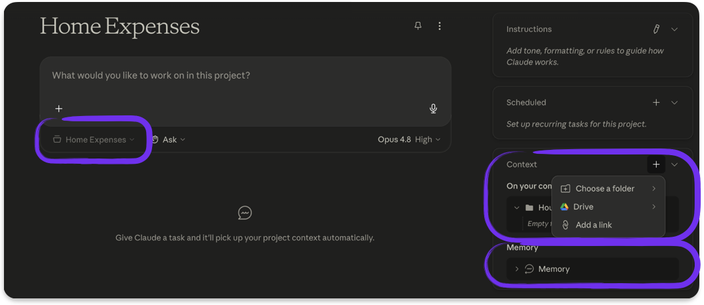

- El **panel de contexto**: Instrucciones + base de conocimiento + carpeta concedida.


- Seguridad: la carpeta ES el control de privacidad. **Nunca datos sensibles, credenciales o NDA.**

### Sources

- corpus/agentic-ai-deck.zip.md, "Working directory + permissions" (folder picker del sistema; lo concedido define el alcance); definición del panel de contexto del Project.
- "corpus/mision - auto.zip.md", el Project "Inteligencia de Mercado Semanal" apunta a `Documentos/Atlas-Mercado` (Step 1.1).

### Speaker notes

Slide de apoyo visual, corta y concreta: baja a pantalla lo que la slide anterior contó. Mostrar las dos capturas, el explorador de archivos del sistema cuando concedés una carpeta y el panel de contexto del Project con sus capas. No saltear el mensaje de seguridad: Cowork solo ve lo que le concedés, así que la elección de carpeta ES el control de privacidad. Nunca una carpeta con datos sensibles. Aterrizarlo en la misión: Atlas trabaja sobre `Documentos/Atlas-Mercado`, nada más. Tiempo objetivo: ~3 min.

---

## 9. Archivos .md: el lenguaje en el que la IA piensa mejor

### Content

- Un `.md` (Markdown) = **texto plano** + estructura liviana: `#` títulos, `-` listas, `**negrita**`, tablas.
- Se abre y se lee con cualquier editor de texto. La IA está especialmente entrenada para comprender su estructura.
- **Metadata (header YAML)**: declara *qué es* el archivo y *cuándo* usarlo. Vuelve con las Skills (sección 5).
- La **lingua franca** del mundo LLM: el modelo lee texto. Portable y versionable.

### Sources

- corpus/agentic-ai-deck.zip.md, "Markdown is the lingua franca"; definición de Skill (SKILL.md con YAML frontmatter: name + description; "Description drives triggering — semantic, not keyword").
- "corpus/mision - auto.zip.md", "mismo estándar SKILL.md" entre Cowork y Codex (Cowork vs Codex).

### Speaker notes

Beat de enseñanza propio, no un paréntesis: en el mundo de agentes el formato de tus archivos importa, y gana el más simple. Abrir un `.md` real en pantalla si se puede. Mostrar que es texto plano con marcas mínimas (un `#`, unas listas) y que igual se ve estructurado; se abre con cualquier editor, en cualquier computadora, sin formato propietario. Lo que ves es lo que hay. La idea a transmitir: el modelo lee texto, y cuanto menos formato opaco haya entre tu contenido y el modelo, mejor trabaja. Por eso es portable y versionable; el mismo estándar funciona entre herramientas. Presentar la metadata (header YAML entre `---`) como la etiqueta del frasco: dice qué es el archivo y cuándo usarlo. La `description` de una Skill es eso (activación semántica, no por palabra clave; sección 5). Alcance: qué es y por qué importa, sin detalle fino de formato. La próxima slide lo baja a la práctica: en qué formato conviene trabajar. Tiempo objetivo: ~5 min.

---

## 10. Trabajar en .md, exportar al final

### Content

- **La información de trabajo va en archivos `.md` durante todo el proceso.**
- La IA **interpreta, edita y crea mejor sobre `.md`** que sobre .docx/.xlsx.
- Aplica tanto a la **memoria** del agente como a los **archivos de trabajo** del Project.
- El entregable (**.docx, .xlsx, PDF, slides**) se genera una sola vez cuando el trabajo está listo.
- Regla de bolsillo: *se edita en `.md` y se entrega en el formato que pida el jefe.*

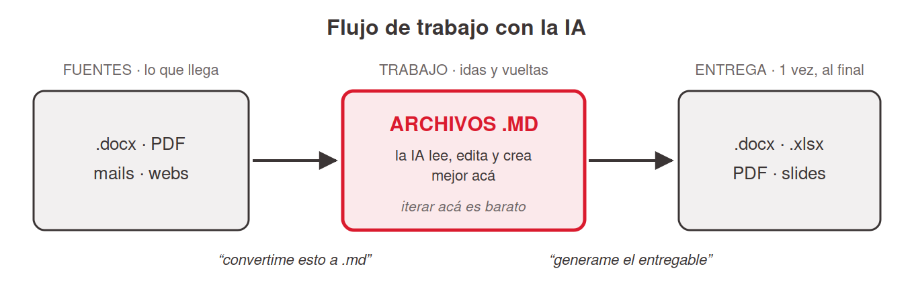
<!-- ascii-source:
   FLUJO DE TRABAJO CON LA IA

  fuentes            TRABAJO (muchas idas       entrega (1 vez,
  (lo que llega)     y vueltas con la IA)       al final)
+--------------+     +-----------------+      +---------------+
| .docx  pdf   | --&gt; |    ARCHIVOS     | --&gt;  | .docx  .xlsx  |
| mails  webs  |     |      .MD        |      | PDF    slides |
+--------------+     | la IA lee/edita |      +---------------+
                     | /crea MEJOR aca |
  "convertime        +-----------------+        "generame el
   esto a .md"        iterás acá, barato          entregable"
-->
<!-- ascii-note:
intent: mostrar el flujo de trabajo recomendado con la IA: las fuentes (docx, pdf, mails, webs) se convierten a archivos .md, TODO el trabajo iterativo con la IA pasa sobre los .md (donde interpreta/edita/crea mejor), y el formato final (.docx/.xlsx/PDF/slides) se genera una sola vez al final.
emphasize: la caja central "ARCHIVOS .MD" como el lugar donde vive el trabajo (la IA trabaja MEJOR acá); que la entrega es un paso único al final, no el medio de trabajo.
labels: izquierda = fuentes (lo que llega); centro = archivos .md (trabajo iterativo); derecha = entrega final (.docx/.xlsx/PDF/slides); leyendas "convertime esto a .md" y "generame el entregable".
-->

### Sources

- corpus/agentic-ai-deck.zip.md, "Markdown is the lingua franca" (la configuración y el material del mundo LLM es texto plano; el modelo lee texto).
- "corpus/mision - auto.zip.md", el flujo de Atlas trabaja sobre archivos `.md` en el Project (reporte `.md` consolidado) y el entregable final se genera al último (borrador de mail, tablero).

### Speaker notes

La slide de práctica de la sección, el hábito concreto que se llevan. La analogía útil: el `.md` es tu mesa de trabajo y el `.docx`/PDF es la vitrina. Nadie construye dentro de la vitrina. El porqué, para decir: en texto plano la IA ve la estructura directa; en formatos ricos atraviesa capas que agregan ruido y errores. Recorrer el flujo con el diagrama. Llega material en cualquier formato y el primer pedido al agente es "convertime esto a `.md`". Todas las idas y vueltas (resumir, corregir, reescribir, fusionar) pasan sobre los `.md`, donde la IA es más precisa y barata de iterar. Cuando está listo, un único pedido final: "generame el `.docx`/Excel/PDF". El documento "lindo" es la salida, no el medio de trabajo. Aplica a la memoria también: lo que el agente debe recordar de forma estable vive como texto plano (Instrucciones, memoria del Project), y los archivos que va a leer y editar una y otra vez (notas, borradores, datos de referencia) van en `.md` dentro de la carpeta del Project. Aterrizar con Atlas: su reporte se consolida como `.md` en el Project y las salidas "lindas" (mail, tablero) se generan al final. Tiempo objetivo: ~6 min.

---

## 11. Schedule en Cowork: tareas programadas sobre carpetas y archivos

### Content

- El concepto es el de la sección 3: una vez + cadencia → corre sola. En Cowork, además, **sobre carpetas y archivos reales**, con las Instrucciones, connectors y skills del Project.
- Cadencias: por hora / diaria / semanal / **"Run now"**. Se gestiona desde la pestaña **Scheduled**.
- **¿Dónde corre? Igual que en el chat (slide 3.2):** nube en beta (Max primero); sin la beta → **local: computadora prendida + app abierta**.
- Las tareas de Cowork usan **archivos locales** → corren local. Conviene planificar con la computadora prendida.

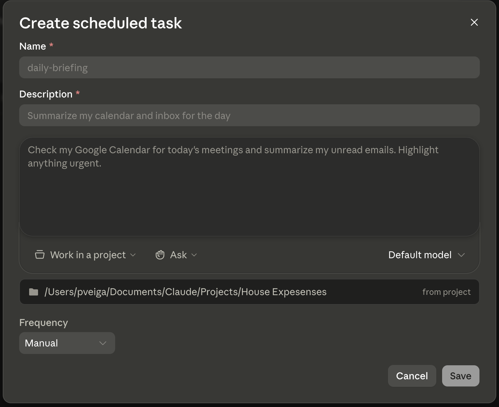

- Atlas, lunes 8:00: `buscar-accion` → `reporte-semanal` → borrador en Gmail antes de la reunión de las 9:00.

### Sources

- Anthropic Support, Schedule recurring tasks in Claude Cowork: https://support.claude.com/en/articles/13854387-schedule-recurring-tasks-in-claude-cowork; versión ACTUALIZADA (verificada 2026-07-09): "Scheduled tasks run remotely, so they run on their cadence even when your computer is asleep or the Claude Desktop app is closed"; planes pagos; beta con rollout Max-first. Excepción clave para Cowork: "If a scheduled task requires local files or apps, it will only run locally".
- Anthropic Support, Release notes (7 de julio de 2026): https://support.claude.com/en/articles/12138966; Cowork en web/mobile, sesiones remotas (beta), "scheduled tasks run with no device online", rollout empezando por Max (verificado 2026-07-09).
- TechCrunch (2026-07-07): https://techcrunch.com/2026/07/07/the-coding-agent-wars-are-spilling-into-the-rest-of-the-office-claude-cowork/; cobertura de prensa de la expansión y las corridas en background (encuadre de terceros).
- corpus/agentic-ai-deck.zip.md, slide 6.1 (Scheduled tasks, Cowork proactivo). *(La caveat "app abierta" de 6.3 quedó desactualizada por el update del 7 de julio de 2026.)*
- "corpus/mision - auto.zip.md", el flujo programado de Atlas (Step 3.3); "Run on demand" como tip de demo. *(Su caveat local también quedó desactualizada.)*

### Speaker notes

Slide corta a propósito: el concepto y los cuidados de dónde-corre ya se enseñaron en la sección 3; acá se muestra la forma Cowork. Abrir con el puente: "es la tarea programada que viste en el chat, pero ahora el que corre es el agente, sobre tus carpetas, con tus Instrucciones y skills". Cada corrida abre su propia sesión fresca y avisa al terminar. Repetir el marco de la slide 3.2 en una línea: desde el update del 7 de julio de 2026 hay ejecución remota en la nube (beta, planes pagos, rollout que empieza por Max), y mientras no te llegue corre local, computadora prendida + app abierta; si estaba apagada, la corrida se saltea y se recupera al volver. El matiz propio de Cowork: como estas tareas trabajan sobre archivos de tu disco, caen en la excepción documentada "requiere archivos/apps locales, corre local". Para las tareas típicas de Cowork, planificá con la computadora prendida aunque tengas la beta de nube. Para la demo, usar "Run on demand" en lugar de esperar la cadencia real. Tiempo objetivo: ~5 min.

---

## 12. Artifacts y Live Artifacts: del resultado a algo compartible

### Content

- **Artifact** = salida viva en un panel lateral: HTML, gráficos, tablas, documentos.
- **Estándar** (todos los planes): estático. **Live** (Cowork, pago): página interactiva y persistente que **se refresca con datos actuales** y guarda **versiones** (pestaña "Live artifacts").
- Se crea desde una tarea, o desde la pestaña (**New artifact**).
- Estado hoy: **NO compartibles aún** (roadmap) · **locales** (no siguen al usuario entre dispositivos) · usan los connectors aprobados **sin re-preguntar**.

### Sources

- corpus/agentic-ai-deck.zip.md, definición de Artifact (dos tiers); slide 5.13 (Standard vs Advanced; Live Artifacts en Cowork); matriz 5.16 (Cowork ✓ full Artifacts + Live Artifacts).
- Anthropic Support, Use Live Artifacts in Claude Cowork: https://support.claude.com/en/articles/14729249-use-live-artifacts-in-claude-cowork; realidad oficial: persisten en la pestaña Live artifacts, se refrescan con datos actuales, guardan versiones; limitaciones: locales (no en la nube), NO compartibles aún (en roadmap), usan los connectors aprobados sin volver a preguntar; dos formas de crearlos (desde una tarea o desde la pestaña).

### Speaker notes

El jefe quería el reporte de dos formas: el email, que ya resolvimos con Gmail + Schedule, y una página siempre actualizada. El Live Artifact es esa página. Explicar la distinción: un Artifact estándar es una salida de un solo archivo, estática: se genera una vez y queda así; un Live Artifact persiste en la pestaña Live artifacts, se refresca con datos actuales de tus apps conectadas al abrirlo y guarda historial de versiones. Ser honesto con el estado del compartir, porque acá corregimos una confusión: hoy los Live Artifacts NO son compartibles (es del roadmap), son locales (no te siguen entre dispositivos) y usan los connectors que aprobaste sin volver a preguntar. Nota: versiones previas de este material mencionaban un "ShareDuo" con URL pública; eso NO es una capacidad de Cowork y se quitó. Tiempo objetivo: ~7 min.

---

# 5. Advanced: Skills, Subagentes y Plugins

**Goal of this section:** Cierre de nivel avanzado. Enseñarle a Claude tareas reutilizables (Skills, con su trampa del Save y la anatomía del SKILL.md), delegar trabajo pesado en Subagentes y distribuir workflows completos con Plugins, incluido el ciclo de vida en cuentas Team.

---

## 1. Skills: enseñarle a Claude algo una sola vez

### Content

- **Skill** = instrucción reutilizable que se carga cuando el pedido coincide con su descripción. **Un trabajo por Skill.**
- *"Todo lo que le explicás a Claude más de una vez es una Skill que deberías escribir una vez."*
- Dos caminos, los dos desde la interfaz:
  1. **Pedirla en lenguaje natural** → Claude escribe el `SKILL.md` → se habilita en **Customize → Skills** ("Save to enable").
  2. **Subir un ZIP** (Customize → Skills → "+").
- Requisito: **Code execution** habilitado.
- **La trampa del Save:** sin Save/enable, la Skill "no funciona".

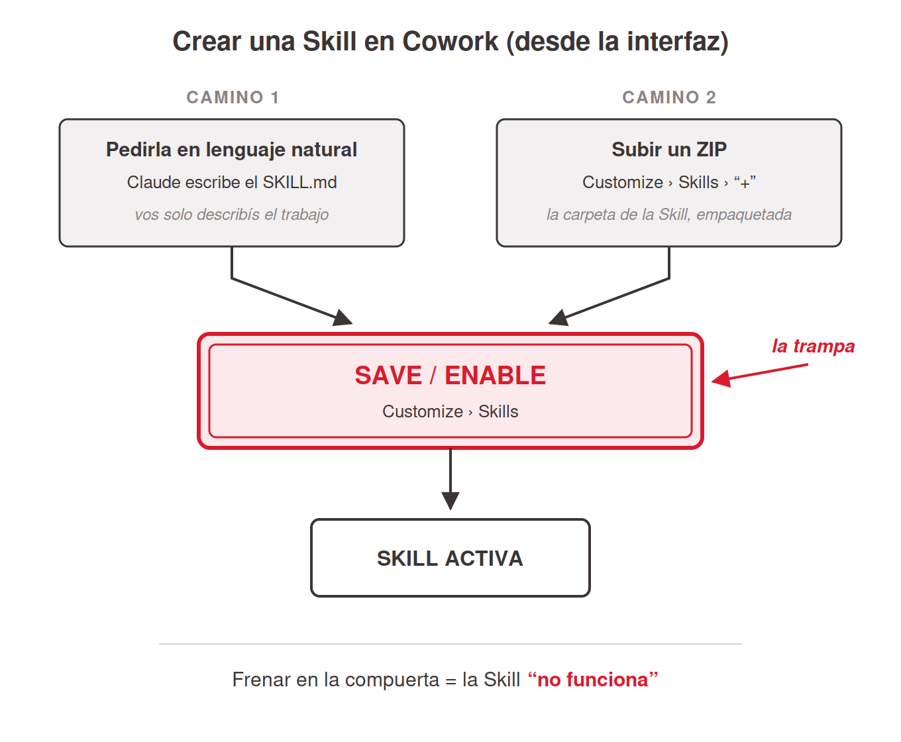
<!-- ascii-source:
     CREAR UNA SKILL EN COWORK (desde la interfaz)

 CAMINO 1                       CAMINO 2
 +---------------------+        +---------------------+
 | pedirla en lenguaje |        | subir un ZIP        |
 | natural: Claude     |        | Customize > Skills  |
 | escribe el SKILL.md |        | > "+"               |
 +---------------------+        +---------------------+
            \                          /
             v                        v
        +==================================+
        |   SAVE / ENABLE                  |  <== la trampa
        |   (Customize > Skills)           |
        +==================================+
                        |
                        v
               +-----------------+
               |  SKILL ACTIVA   |
               +-----------------+

   frenar en la compuerta = la Skill "no funciona"
-->
<!-- ascii-note:
intent: mostrar los dos caminos reales para crear una Skill en Cowork (pedirla en lenguaje natural, con Claude escribiendo el SKILL.md; o subir un ZIP) y que los dos convergen en la misma compuerta, Save / enable en Customize > Skills. Solo pasada esa compuerta la Skill queda activa.
emphasize: la compuerta "SAVE / ENABLE" como cuello de botella del dibujo (caja de doble línea, marcada "la trampa") y la leyenda inferior "frenar en la compuerta = la Skill no funciona"; que los dos caminos convergen en ella y ninguno la esquiva.
labels: camino 1 = pedirla en lenguaje natural (Claude escribe el SKILL.md); camino 2 = subir un ZIP (Customize > Skills > "+"); compuerta = Save / enable (Customize > Skills); salida = Skill activa.
-->

- Atlas: `reporte-semanal` consolida la carpeta `fuentes/` en un reporte con formato fijo.

### Sources

- corpus/agentic-ai-deck.zip.md, definición de Skill (folder + SKILL.md, "one job per skill"); "Anything you explain to Claude twice is a skill you should write once."
- "corpus/mision - auto.zip.md", el ejemplo `reporte-semanal` (lee la carpeta `fuentes/`, consolida por empresa, formato fijo, sufijo `-new`).
- Anthropic Support, Use Skills in Claude: https://support.claude.com/en/articles/12512180-use-skills-in-claude; habilitar Skills en Customize → Skills; requiere Code execution ("This feature requires code execution to be enabled"; re-verificado 2026-07-15).
- Anthropic Support, How to create custom skills: https://support.claude.com/en/articles/12512198-how-to-create-custom-skills; la versión ACTUAL del artículo (re-verificada 2026-07-15) documenta solo el camino ZIP + habilitación en Customize → Skills. El camino en lenguaje natural estaba documentado en la versión de junio 2026 y está verificado de primera mano por el presentador (registros [closed] del 2026-06-09 abajo); atribuido a esa verificación, no al artículo actual.

### Speaker notes

Arranca el bloque avanzado. La Skill materializa el "enseñá una vez, reutilizá siempre". Mostrar los dos caminos reales en Cowork. Uno: pedírsela en lenguaje natural; Claude escribe el `SKILL.md` y vos la habilitás en Customize → Skills. Dos: subir un ZIP de la carpeta de la Skill por Customize → Skills. No saltear la trampa del Save, un error real y común: pedís la Skill, Claude escribe el archivo, y si no le das Save / enable no queda habilitada y parece que "no funciona". Mencionar que las Skills requieren Code execution (Settings → Capabilities) y que el camino ZIP completo es Customize → Skills → "+" → Create skill → Upload a skill, activando con el toggle. Usar `reporte-semanal` como ejemplo concreto: lee TODOS los archivos crudos de `fuentes/` (uno por portal), consolida por empresa, la más relevante primera (⭐), y guarda con sufijo `-new` para no pisar el ejemplo. Convierte varios archivos desordenados en un reporte prolijo. El criterio "un trabajo por Skill": si escribís "y además", dividila en dos. Conectar con la sección anterior: el SKILL.md es el archivo `.md` con metadata que ya vieron, y la próxima slide lo abre. Tiempo objetivo: ~8 min.

---

## 2. Anatomía de un SKILL.md

### Content

- Un `SKILL.md` por dentro: **metadata** arriba, **instrucciones** abajo. Es el `.md` con metadata de la sección 4.

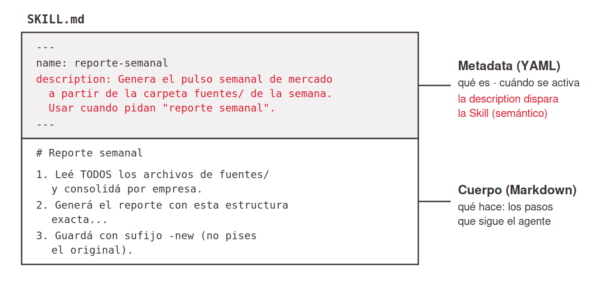
<!-- ascii-source:
+--------------------------------------------------------------+
| ---                                                          |  <-- METADATA / HEADER (YAML)
| name: reporte-semanal                                        |      "que es" + "cuando se activa"
| description: Genera el pulso semanal de mercado a partir     |
|   de la carpeta fuentes/ de la semana. Usar cuando pidan     |
|   "reporte semanal" o "pulso de la semana".                  |
| ---                                                          |
+--------------------------------------------------------------+
| # Reporte semanal                                            |  <-- CUERPO (Markdown)
|                                                              |      "que hace": las instrucciones
| 1. Leé TODOS los archivos de fuentes/ y consolidá           |
|    por empresa.                                              |
| 2. Generá el reporte con esta estructura exacta...          |
| 3. Guardá con sufijo -new (no pises el original).           |
+--------------------------------------------------------------+
-->
<!-- ascii-note:
intent: mostrar la anatomía de un SKILL.md; un bloque de metadata (YAML frontmatter: name + description) arriba y el cuerpo de instrucciones en Markdown abajo. Refuerza el beat de archivos .md/metadata de la sección Cowork.
emphasize: la separación visual en dos zonas; METADATA/HEADER (name, description; "qué es / cuándo se activa") vs CUERPO (las instrucciones; "qué hace"); que la `description` dispara la Skill.
labels: zona superior = metadata/header (YAML, name + description); zona inferior = cuerpo (instrucciones en Markdown); etiquetas laterales "cuándo se activa" y "qué hace".
-->

- **Metadata:** `name` identifica; `description` **decide cuándo se activa** (semántico, no por palabra clave).
- **Cuerpo:** Markdown común, los pasos que sigue el agente.

### Sources

- corpus/agentic-ai-deck.zip.md, definición de Skill (SKILL.md con YAML frontmatter: name + description; "Description drives triggering — semantic, not keyword").
- "corpus/mision - auto.zip.md", la Skill `reporte-semanal` (entrada `fuentes/`, consolida por empresa, estructura fija, sufijo `-new`).

### Speaker notes

Slide-ejemplo que aterriza dos cosas a la vez: la anatomía de una Skill y el beat de archivos `.md` + metadata de la sección de Cowork. Mostrar el `SKILL.md` partido en dos zonas: arriba el header YAML (`name`, `description`) entre `---`, abajo las instrucciones en Markdown. El punto a fijar: el sistema lee la `description` para decidir si esta Skill aplica a tu pedido (activación semántica). Usar `reporte-semanal` para que sea concreto. Mantenerlo alto nivel: es para que vean cómo se ve, no un tutorial de formato. Tiempo objetivo: ~3-4 min.

---

## 3. Subagentes: delegar sub-tareas en paralelo

### Content

- **Subagente** = asistente aislado, contexto propio; devuelve **un resumen** (no la transcripción).
- Regla de una línea: chico y visible → **Skill**. Grande o ruidoso → **Subagente**.
- En Cowork corren "por debajo", **varios en paralelo**.
- Se agrega como una Skill (descripción + instrucciones): se le pide a Claude, o llega en un **Plugin**.

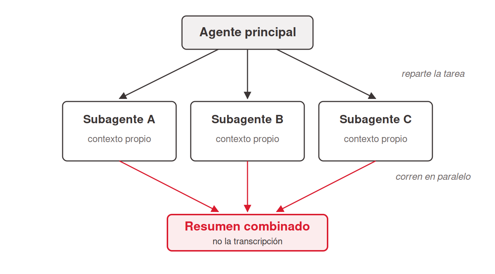
<!-- ascii-source:
                +------------------+
                | agente principal |
                +------------------+
                  /      |       \
                 v       v        v
          +--------+ +--------+ +--------+
          | sub A  | | sub B  | | sub C  |
          |contexto| |contexto| |contexto|
          |propio  | |propio  | |propio  |
          +--------+ +--------+ +--------+
                 \       |       /
                  v      v      v
                +------------------+
                | resumen combinado|
                +------------------+
-->
<!-- ascii-note:
intent: mostrar el patron fan-out/fan-in: el agente principal reparte una tarea entre varios subagentes que corren en paralelo con contexto propio, y junta los resultados en un resumen combinado.
emphasize: el paralelismo (tres subagentes a la vez) y que cada uno tiene contexto aislado; el resumen combinado al final.
labels: agente principal -> sub A / sub B / sub C (contexto propio) -> resumen combinado.
-->

### Sources

- corpus/agentic-ai-deck.zip.md, definición de Subagent (aislado, devuelve un resumen); "Skill vs Subagent" (slide 4.9 tabla); matriz 4.10 (Cowork ⚠️, under the hood); demo 4.8 (8 propuestas en paralelo).
- Claude Docs, Subagents: https://code.claude.com/docs/en/sub-agents; concepto general de subagente (un spec: cuándo usarlo + instrucciones).

### Speaker notes

Nivel avanzado, presentarlo como "para cuando crezcas". La distinción mental útil: si la sub-tarea es chica y querés verla, es una Skill; si es grande o ruidosa y querés que corra aparte sin ensuciar tu conversación, es un Subagente. El ejemplo del deck ilustra el fan-out: 8 propuestas de proveedores revisadas en paralelo por tres especialistas, con tabla combinada al final. Cómo se agrega, en paralelo a las Skills: un subagente se define con una descripción (cuándo usarlo) más instrucciones; le pedís a Claude que lo arme (se gestiona en Customize, igual que una Skill) o viene dentro de un Plugin. Mantenerlo alto nivel, sin rutas de archivos ni internals de persistencia. Tiempo objetivo: ~7 min.

---

## 4. Plugins: empaquetar y distribuir un workflow completo

### Content

- **Plugin** = la unidad de distribución: empaqueta Skills + agentes + connectors en una instalación. *"Ship the whole thing."*
- En Cowork se instalan desde un **marketplace** en la GUI; lo que traen funciona en Chat y en Cowork.
- Dónde: marketplaces oficiales de Anthropic y de la comunidad.

### Sources

- corpus/agentic-ai-deck.zip.md, definición de Plugin ("Ship the whole thing"; "the way to get a skill into Cowork"); slide 4.5 (caveat de project-skills en Cowork); matriz 5.11 (Cowork ✓ GUI marketplace); slide 5.10 (marketplaces).

### Speaker notes

Cerrar el avanzado con la idea de empaquetado: cuando un workflow madura (varias skills, connectors, agentes, incluso hooks y MCP), un Plugin lo vuelve instalable de una. El punto para Cowork: la forma robusta de distribuir una skill o un agente a otros es dentro de un plugin. Para usar una Skill en Cowork la habilitás como skill de usuario (Customize → Skills) o la recibís dentro de un plugin, y los plugins distribuidos aparecen en Chat y en Cowork. Mencionar los marketplaces oficiales (`anthropics/claude-plugins-official`, `anthropics/knowledge-work-plugins`) y los de la comunidad. Recordar el mapa: Plugins es la banda que envuelve todos los bloques de la charla. Tiempo objetivo: ~6 min.

---

## 5. Plugins en una cuenta Team: ciclo de vida

### Content

- En Team/Enterprise, los **Owners** gestionan los plugins de la org (Organization settings → Plugins).
- El ciclo completo:

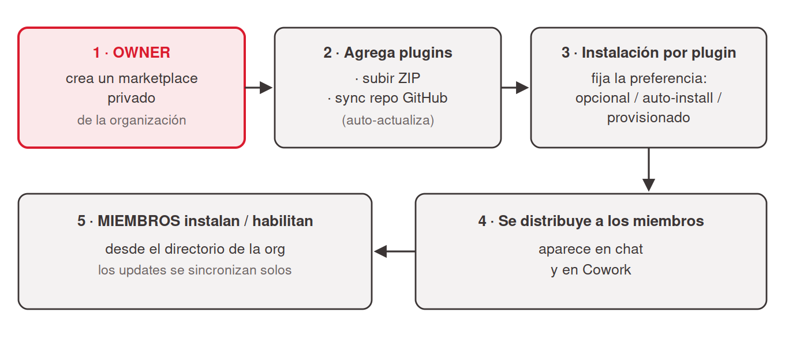
<!-- ascii-source:
+-----------------+     +------------------------+     +----------------------+
| OWNER crea un   | --&gt; | agrega plugins:        | --&gt; | fija preferencia de  |
| marketplace     |     | · subir ZIP            |     | instalacion por      |
| privado (org)   |     | · sync repo GitHub     |     | plugin (opcional /   |
|                 |     |   (auto-actualiza)     |     | auto-install / prov.)|
+-----------------+     +------------------------+     +----------------------+
                                                                  |
                                                                  v
+---------------------------+     +-----------------------------------------+
| MIEMBROS instalan/        | <-- | se DISTRIBUYE a los miembros            |
| habilitan desde el        |     | (aparece en chat Y en Cowork)          |
| directorio de la org      |     |                                         |
| (updates se sincronizan)  |     |                                         |
+---------------------------+     +-----------------------------------------+
-->
<!-- ascii-note:
intent: mostrar el ciclo de vida de un plugin en una cuenta Team/Enterprise; del Owner que crea un marketplace privado a los miembros que lo instalan, con updates que se sincronizan.
emphasize: el rol del OWNER (marketplace privado: subir ZIP o sync GitHub) y la preferencia de instalación por plugin; que se distribuye a chat Y a Cowork; que los miembros instalan desde el directorio y las actualizaciones se sincronizan solas.
labels: flujo de 5 pasos; Owner crea marketplace privado -> agrega plugins (ZIP / sync GitHub) -> fija preferencia de instalación (opcional/auto-install/provisionar) -> distribución (chat + Cowork) -> miembros instalan/habilitan (updates sincronizan).
-->

- **Marketplace privado**: se carga por ZIP o sync de repo GitHub (**auto-actualiza**).
- Por plugin: preferencia de instalación (opcional / **auto-install** / provisionado).
- Llega a **chat y Cowork**; los miembros habilitan y los **updates se sincronizan** solos.

### Sources

- Anthropic Support, Manage Claude Cowork plugins for your organization: https://support.claude.com/en/articles/13837433-manage-claude-cowork-plugins-for-your-organization; Owners gestionan plugins en Organization settings; marketplace privado (ZIP o sync GitHub); preferencia de instalación por plugin.
- Anthropic Support, Use plugins in Claude: https://support.claude.com/en/articles/13837440-use-plugins-in-claude; miembros instalan/habilitan desde el directorio; updates sincronizan; disponibles en chat y Cowork.
- Claude blog, Cowork plugins across the enterprise: https://claude.com/blog/cowork-plugins-across-enterprise; distribución de plugins a nivel organización (chat + Cowork).

### Speaker notes

Slide de cierre del bloque avanzado, orientada a quien algún día administre una cuenta de equipo. En una cuenta Team, un Owner puede armar un marketplace privado de la organización y repartir workflows a todo el equipo. Recorrer el ciclo con el diagrama: el Owner crea el marketplace y sube plugins (ZIP o, mejor, sincronizando un repo de GitHub que auto-actualiza), fija cómo se instala cada uno (opcional / auto-install / provisionado), el plugin se distribuye y aparece en chat y en Cowork, y los miembros lo habilitan desde su directorio con las actualizaciones sincronizadas. Mantenerlo alto nivel: es el "para cuando esto escala a un equipo". Tiempo objetivo: ~4 min.

---

# Conclusions

## 1. El loop completo y la idea para llevarse

### Content

- El loop completo de Atlas:

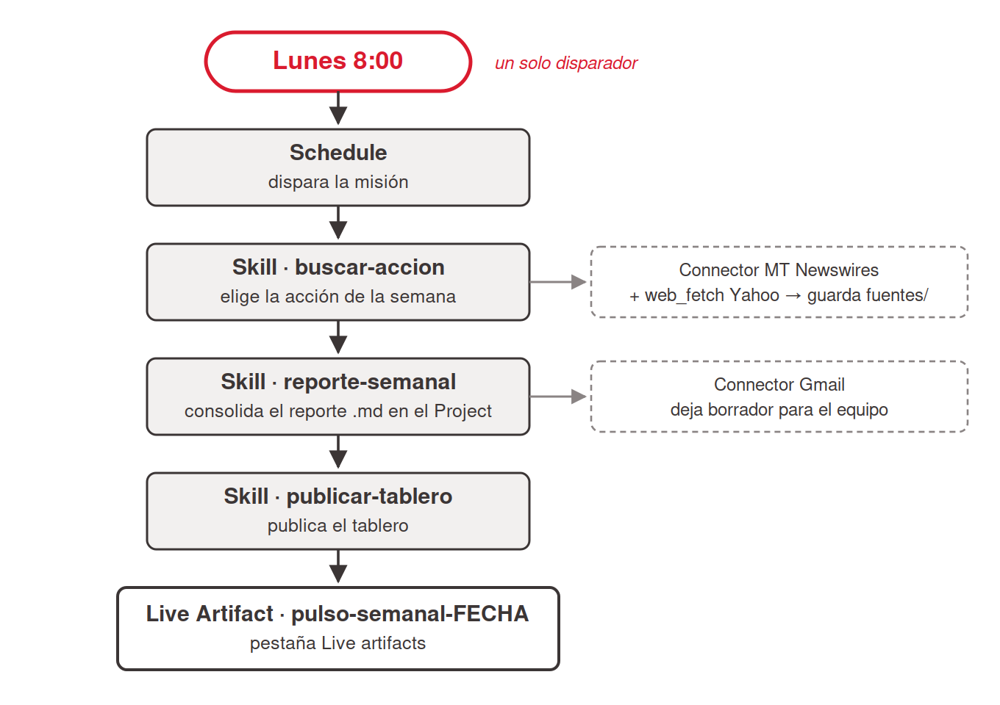
<!-- ascii-source:
Lunes 8:00
   |
   v
[Schedule] dispara
   |
   v
[Skill buscar-accion] --(Connector MT Newswires + web_fetch Yahoo)--&gt; guarda fuentes/
   |
   v
[Skill reporte-semanal] consolida --&gt; reporte .md en el Project
   |
   +--&gt; [Connector Gmail] deja borrador para el equipo
   |
   v
[Skill publicar-tablero] --&gt; Live Artifact pulso-semanal-FECHA (pestaña Live artifacts)
-->
<!-- ascii-note:
intent: mostrar el loop completo de la mision Atlas, encadenando todas las piezas vistas en la charla, disparado por Schedule cada lunes.
emphasize: la secuencia de izquierda a/arriba-abajo Schedule -> Skills -> Connectors -> Live Artifact; que todo arranca de un solo disparador.
labels: pasos del loop (Schedule, buscar-accion, reporte-semanal, Gmail, publicar-tablero) y las piezas usadas en cada uno.
-->

- **El arco de hoy:** chat de memoria → conectores → tareas programadas → Cowork (`.md`) → Skills, Subagentes y Plugins.
- **Las piezas:** Conectores (las manos) · Schedule (corre solo) · Instrucciones (el contrato) · Projects (el espacio de trabajo) · `.md` (el lenguaje) · Skills (enseñar una vez) · Live Artifacts (compartir).
- **Para llevarse:** *"Todo lo que le explicás a Claude más de una vez es una Skill que deberías escribir una vez."* ¿Qué tarea recurrente le delegarías a tu propio Atlas?

### Sources

- "corpus/mision - auto.zip.md", "el loop completo (Cowork version)"; gancho de cierre.
- corpus/agentic-ai-deck.zip.md, "Anything you explain to Claude twice is a skill you should write once" (slide 7.3).

### Speaker notes

Cierre integrador: mostrar el diagrama del loop completo para que vean cómo cada pieza que aprendimos se engancha con la siguiente. Recordar el arco de la sesión: arrancamos en el chat que ya usaban (y sus límites), lo extendimos con conectores y tareas programadas, y dimos el salto a Cowork y sus piezas. Repasar las piezas en una línea cada una. Cerrar con las dos frases ancla: la de la Skill ("enseñá una vez") y el gancho completo, dicho en voz alta: "Acaban de automatizar un reporte que les iba a comer la mañana de cada lunes. ¿Qué otra tarea recurrente podrían delegarle a su propio Atlas?". Tiempo objetivo: ~5 min + Q&A.

---

## 2. Gobernanza y advertencias (antes de Q&A)

### Content

- **Cowork no tiene audit trail**: no sirve para datos regulados o sensibles.
- **Toda salida es un borrador**: cifras, citas y afirmaciones se verifican contra la fuente.
- **Nada de datos confidenciales / PII / bajo NDA** en la superficie equivocada.
- **Reproducibilidad:** prompt + entradas + salidas se guardan juntos, para que el trabajo sea auditable.
- **Capas de guardarraíles:** permisos de carpeta → reglas en Instrucciones → solo plugins verificados → revisión humana.
- *En el trabajo real:* con datos confidenciales de la empresa o de clientes, nada de esto sin aprobación del área correspondiente.

### Sources

- corpus/agentic-ai-deck.zip.md, slide 7.2 (Governance & verification, verbatim); "No audit trail in Cowork."

### Speaker notes

Slide de cierre responsable, breve y obligatoria. Decirlo sin vueltas: Cowork sirve para trabajo recurrente de oficina y NO para datos regulados, confidenciales o de clientes, porque no tiene audit trail. Recordar que toda salida es un borrador que hay que verificar, lo mismo que enseñó la sección 1: el modelo puede alucinar, el conector cita fuentes, el humano verifica. Dejar esto antes de abrir Q&A. Tiempo objetivo: ~3 min.

---

# Open questions

- ~~Fecha de la clase sin confirmar~~; resuelto 2026-07-14: `date: Julio 2026`.
- Imágenes diferidas (Phase 2 del librarian no corrida): la imagen citada desde el corpus (`screenshot-cowork-tab.png` en slide 4.5) proviene de un registro con `<!-- pending: process_images -->`. La imagen existe en disco y se referencia; re-verificar depiction/relevance tras correr librarian Phase 2. (`mockup-tablero.png` ya no se usa: la slide del tablero de Atlas se eliminó en review 2026-07-16.)
- Slide 4.5 (Demo time) cita pending stub corpus/agentic-ai-deck.zip.md; re-verify after librarian Phase 2.
- **Camino "lenguaje natural" de creación de Skills (slide 5.1):** la versión actual de support 12512198 (re-verificada 2026-07-15) ya no lo documenta; solo el camino ZIP. El camino se mantiene en la slide atribuido a la versión de junio 2026 del artículo + verificación de primera mano del presentador (registros [closed] 2026-06-09). Re-chequear en el producto antes de la clase; si Cowork lo quitó, corregir slide y diagrama.
- Falta la carpeta `skills/` con los tres skills pre-armados (`reporte-semanal`, `buscar-accion`, `publicar-tablero`) en el export; confirmado por el librarian en Step 3. No se inventa su contenido. Si la clase incluye una demo en vivo de las skills ya armadas, confirmar con el presentador si las tiene aparte.
- Vigencia de features vs docs oficiales: fechas/versiones (Live Artifacts abril 2026, planes pagos, etc.) son point-in-time; re-verificar contra docs oficiales antes de presentar.
- **Slide 4.5; interacción pipeline del banner DEMO TIME:** la slide tiene un bloque ```ascii (banner "DEMO TIME") Y un image ref (`screenshot-cowork-tab.png`, respaldo). El pipeline de Polish marca como documentation-only TODO bloque ASCII en una slide que tiene image ref → el banner NO se renderizará a SVG en Step 6 tal como está. Decisión a confirmar con el presentador en Polish: (a) mover el banner a su propia slide-interstitial, (b) quitar el screenshot de respaldo, o (c) aceptarlo solo como ASCII en el draft.
- Nuevas URLs externas (round 3) a re-verificar en Polish si se quiere snapshot/cita estable: support.claude.com (use-skills, create-custom-skills, schedule-recurring-tasks, use-live-artifacts, manage-org-plugins, use-plugins), claude.com/blog (cowork-plugins-across-enterprise), code.claude.com/docs (sub-agents).
- ~~URLs nuevas de round 4~~; **RESUELTO en round 5 (2026-07-09):** las 6 citas se verificaron online. Resultados: web search 10684626 OK; ChatGPT search 9237897 OK (existencia+contenido corroborados vía búsqueda; el fetch directo da 403 por bloqueo anti-bot de help.openai.com); ChatGPT tasks OK con slug canónico corregido a `10291617-tasks-in-chatgpt`; directorio de conectores: claude.ai/directory requiere login → cita reemplazada por el anuncio oficial claude.com/blog/connectors-directory + support 11176164; custom connectors 11175166 OK; modelcontextprotocol.io OK.
- ~~Tareas programadas en el chat de Claude~~; **RESUELTO en round 5:** claude.ai SÍ tiene tareas programadas en el navegador (observación de primera mano del presentador 2026-07-09 + release notes del 7 de julio de 2026, support article 12138966: corren en la nube sin dispositivo online, beta, rollout Max-first). Slide 3.1 actualizada con Claude como ejemplo de primera clase.
- **Capacidad ejecutiva por conector (slide 2.5), estado por acción:** Gmail-borrador verificado (corpus/misión); **Calendar-agendar VERIFICADO por el presentador (2026-07-09)**; tickets (Jira/ServiceNow) y mensajes (Slack) siguen presentados como capacidad del ecosistema (MCP/conectores lo permiten; fuentes oficiales citadas) sin verificación por conector puntual; no prometer demos en vivo de esos dos sin chequear antes.
- Claim "búsqueda web integrada en casi todos los chats" (slide 2.2): verificado citable para Claude y ChatGPT; Gemini se menciona de pasada sin fuente propia; agregar fuente oficial de Google o suavizar la mención al presentar.
- **Live Artifacts y el update del 7 de julio de 2026:** la locality de Live Artifacts ("viven en tu computadora, no compartibles aún") se RE-VERIFICÓ el 2026-07-09 contra support article 14729249 (actualizado recientemente) y sigue vigente pese a que las sesiones de Cowork ahora pueden correr remotas. Vigilar este punto: es el candidato más probable a quedar desactualizado con el rollout web/mobile.

# Cut material

- **Detalles internos de Claude Code** (Plan mode, slash commands completos, project-directory skills, config de `/agents`, dynamic workflows, las dos misiones hands-on basadas en Code, árboles `~/.claude/...`): fuera de foco por diseño de esta charla (companion funcional/alto nivel). Claude Code aparece solo como contraste en la sección de Cowork. Fuente: corpus/agentic-ai-deck.zip.md (Code-related slides preservadas pero marcadas fuera de foco).
- **Comparación detallada Cowork vs Codex** (las dos tablas y el re-solución completa de Codex): disponible en el corpus para un ángulo "vs la alternativa", pero excluida para no diluir el foco en *usar* Cowork. Podría incorporarse como un slide opcional si el presentador lo pide en Review. Fuente: "corpus/mision - auto.zip.md" (cowork-vs-codex).
- **`buscar-accion` con Claude in Chrome / web_fetch a Yahoo Finance** como tema técnico propio: mencionado de pasada en el loop completo (Conclusions) pero no desarrollado como slide, para mantener el nivel alto. Fuente: "corpus/mision - auto.zip.md" (M2).
- **Auto memory** como concepto separado: absorbido dentro de Projects (la memoria es una de las tres capas del Project) en lugar de un slide propio, para no fragmentar el básico. Fuente: corpus/agentic-ai-deck.zip.md (Auto memory 3.7).
- **Detalle mecánico del Schedule de Cowork** (round 4, al adelgazar la ex-slide 4.3 a la nueva 4.11 por decisión C2): los sub-bullets "Describís la tarea una vez; Claude guarda el prompt como las instrucciones de la tarea" y "Tiene los mismos poderes que una tarea normal: connectors, skills, plugins instalados", y el aparte explícito sobre agentes programados alojados en la nube como funcionalidad separada (conservado solo en Speaker notes). El concepto general de tarea programada ahora se enseña en la sección 3 (desde el chat). Fuente: draft round 3, slide 4.3 "Schedule: que Cowork trabaje solo".
- **Framing "sideway" de los archivos MD** (round 4): la ex-slide 3.2 "(Sideway) Archivos MD y metadata" dejó de ser un aparte y se expandió a un beat de enseñanza de dos slides dentro de la sección Cowork (4.9 "qué es un .md / cómo se lee" + 4.10 "trabajá en .md, exportá al final"); la nota original "esto es un sideway de alto nivel — es contexto, no el plato principal" se retiró porque el presentador lo promovió a contenido central. Fuente: draft round 3, slide 3.2.
- **Título/encuadre original del roadmap** (round 4): la ex-slide 2.2 "Los bloques de Cowork: cada problema, una pieza" codificaba el arco viejo (solo bloques de Cowork, empezando en "un prompt/chatear" como bloque de Cowork). Reescrita como 4.4 "El mapa de la charla: bloques que se apilan" con el arco nuevo (chat → conectores → tareas programadas → Cowork → avanzado) y marcadores "(visto)" / "estamos acá". Los pares problema↔bloque originales de Instrucciones/Projects/Skills/Connectors/Schedule/Live Artifacts se conservan (reformulados) en el diagrama nuevo. Fuente: draft round 3, slide 2.2.
