# Thesis

**Claim:** Partís del chat de IA que ya usás todos los días y lo extendés paso a paso, con conectores para que vea tu mundo real y tareas programadas para que trabaje solo. El destino es Claude Cowork, donde ese mismo agente trabaja sobre tus carpetas y archivos y cambia por completo la forma de trabajar: delegás resultados combinando sus piezas (Instrucciones, Projects, archivos .md, Schedule y Live Artifacts) sin escribir una línea de código.

**Why it matters:** El salto de chatear un mensaje a la vez a entregar un resultado y guiarlo es lo que vuelve útil a un agente en el trabajo real. Quien lo domina automatiza horas de trabajo manual con la barrera de entrada en cero, y el camino empieza en la herramienta que ya tenés abierta.

---

# Agenda

**Narrative arc:** Arrancamos por la herramienta que ya usás todos los días, el chat de IA, y hacemos explícito su límite: responde de memoria de entrenamiento (1). Lo extendemos con conectores, un concepto que vale para todas las IAs: el chat consulta la web, tu mail y tu calendario, y además actúa (2). Con el chat extendido, lo volvemos proactivo con tareas programadas (3). Recién ahí llega el salto grande, Claude Cowork, que es más que "Claude instalado en tu computadora", y lo recorremos en tres tiempos: qué cambia en tu rol cuando dejás de tipear un mensaje a la vez y empezás a entregar un resultado (4), cómo montás tu espacio con la interfaz, las Instrucciones, el Project y la carpeta que le concedés (5), y cómo trabaja ahí adentro y qué te entrega, con los archivos .md, Schedule sobre tus carpetas y Live Artifacts (6). Cerramos con las piezas avanzadas, Skills, Subagentes y Plugins (7). El hilo conductor es una misión concreta, "Atlas", el analista de mercado que se arma pieza por pieza.

**Sections (in delivery order):**

- 1. El chat y sus límites
- 2. Extender el chat
- 3. El chat trabaja solo
- 4. Qué cambia con Cowork
- 5. Tu espacio en Cowork
- 6. Trabajar y entregar
- 7. Piezas avanzadas

---

# 1. El chat y sus límites

**Goal of this section:** Partir de la herramienta que la audiencia ya usa a diario, el chat de IA, y hacer explícito su límite: responde desde su memoria de entrenamiento, con información desactualizada, riesgo de alucinación y cero acceso a tus datos y apps.

---

## 1. El chat responde de memoria

### Content

- De fábrica responde de su **memoria de entrenamiento**: recuerda, no busca (foto hasta la **fecha de corte**).
- Tres límites:
  - **Información vieja**: lo posterior al corte no existe.
  - **Alucinación**: inventa con confianza.
  - **No ve TU mundo**.

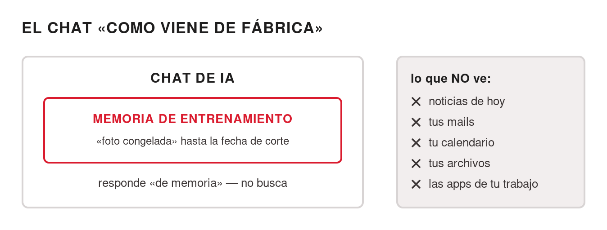
<!-- ascii-source:
        EL CHAT "COMO VIENE DE FABRICA"
                                             lo que NO ve:
   +---------------------------------+       x  noticias de hoy
   |            CHAT DE IA           |       x  tus mails
   |  +---------------------------+  |       x  tu calendario
   |  |  MEMORIA DE ENTRENAMIENTO |  |       x  tus archivos
   |  |  (foto congelada hasta la |  |       x  las apps de tu trabajo
   |  |   fecha de corte)         |  |
   |  +---------------------------+  |
   |     responde "de memoria"       |
   +---------------------------------+
-->
<!-- ascii-note:
intent: mostrar que el chat de IA sin extensiones responde solo desde su memoria de entrenamiento (foto congelada hasta la fecha de corte) y no tiene acceso al mundo del usuario.
emphasize: la caja interna "MEMORIA DE ENTRENAMIENTO (foto congelada)"; la lista de lo que NO ve (noticias de hoy, mails, calendario, archivos, apps) fuera de la caja.
labels: caja exterior = CHAT DE IA; caja interior = memoria de entrenamiento / fecha de corte; columna derecha = lo que no ve.
-->

### Sources

- Anthropic Support — Enabling and using web search: https://support.claude.com/en/articles/10684626-enabling-and-using-web-search — el encuadre oficial: sin búsqueda web, Claude responde limitado a su información de entrenamiento; la búsqueda le da acceso a información actual (referencia también para la Sección 2).
- (concepto general de LLM: fecha de corte / respuestas desde entrenamiento / alucinaciones — material introductorio estándar del curso; sin claim específico de producto.)

### Speaker notes

Arrancar desde lo conocido: pedir a mano alzada quién usó un chat de IA esta semana. Levantan casi todos (ChatGPT, Gemini, Claude). La idea a instalar: ese chat, tal como viene, responde de memoria. No busca nada; recuerda lo que leyó hasta su fecha de corte (knowledge cutoff). Un colega brillante, incomunicado desde esa fecha. Tres consecuencias que ya sufrieron sin saberlo. Datos viejos: precios, noticias, versiones y papers posteriores al corte no existen. Inventos con cara de verdad: cifras y citas que suenan perfectas y son falsas; insistir en verificar toda salida. Y la más limitante: no ve nada tuyo, ni mails, ni calendario, ni archivos, ni apps. Ese tercer límite abre la charla. Tiempo objetivo: ~6 min.

---

# 2. Extender el chat

**Goal of this section:** Instalar el concepto de conector, válido para todas las IAs: el chat deja de responder de memoria y pasa a consultar información real (búsqueda web, mail, calendario) y hasta a actuar (mandar mails, agendar reuniones). La distinción a fijar es memoria de entrenamiento vs información viva.

---

## 1. Chat solo vs chat con conectores

### Content

- **Conector** = extensión que conecta el chat a un sistema externo: web, mail, calendario, documentos.
- Vale igual en ChatGPT, Gemini y Claude.
- Se activa con un clic, sin programar.


<!-- ascii-source:
   CHAT SOLO                        CHAT CON CONECTORES
+----------------+              +----------------+
|     CHAT       |              |     CHAT       |----&gt; [ web ]
|  responde de   |              |  consulta      |----&gt; [ mail ]
|  memoria de    |              |  fuentes       |----&gt; [ calendario ]
|  entrenamiento |              |  REALES antes  |----&gt; [ documentos ]
+----------------+              |  de responder  |
   (aislado)                    +----------------+
                                  (conectado a tu mundo)
-->
<!-- ascii-note:
intent: contrastar lado a lado el chat aislado (responde de memoria de entrenamiento) contra el chat con conectores (consulta fuentes reales — web, mail, calendario, documentos — antes de responder).
emphasize: el lado derecho con las flechas hacia web/mail/calendario/documentos; la etiqueta "(conectado a tu mundo)" vs "(aislado)".
labels: izquierda = CHAT SOLO (aislado, memoria de entrenamiento); derecha = CHAT CON CONECTORES (web, mail, calendario, documentos).
-->

### Sources

- Anthropic Support — Enabling and using web search: https://support.claude.com/en/articles/10684626-enabling-and-using-web-search — la búsqueda web como capacidad integrada del chat de Claude.
- Claude blog — Connectors directory: https://claude.com/blog/connectors-directory — el catálogo oficial de conectores de Claude (referencia ampliada en la slide 2.4; verificado 2026-07-09).

### Speaker notes

La slide instala el concepto que ordena la sección: un conector saca al chat de su aislamiento y le da acceso a buscar en la web, leer tu mail, ver tu calendario, consultar tus documentos. Repetir que es transversal: lo que aprendan acá vale para ChatGPT, Gemini y Claude. Los nombres cambian ("connectors", "apps", "extensiones"), la idea es la misma. Usar el diagrama para el contraste: el chat solo responde de memoria; el chat con conectores consulta fuentes reales antes de responder, la web, tu inbox, tu agenda. Cerrar bajando la barrera de entrada: esto se activa con un clic o un toggle en la configuración, sin programar. Tiempo objetivo: ~5 min.

---

## 2. El primer conector: búsqueda web

### Content

- El conector más universal: viene en casi todos los chats (Claude, ChatGPT, Gemini). Se activa con un toggle.
- Mirá el "buscando..." y las fuentes citadas; ahí verificás.
- Regla: si la respuesta pudo cambiar → exigí búsqueda.

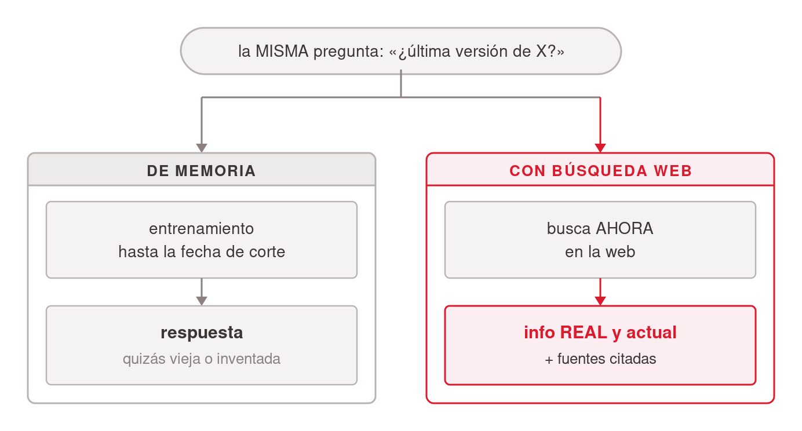
<!-- ascii-source:
   la MISMA pregunta: "¿ultima version de X?"

   DE MEMORIA                        CON BUSQUEDA WEB
+------------------+             +------------------+
| entrenamiento    |             | busca AHORA en   |
| hasta fecha de   |             | la web           |
| corte            |             |   |              |
|   |              |             |   v              |
|   v              |             | info REAL y      |
| respuesta        |             | actual + fuentes |
| (quizas vieja o  |             | citadas          |
|  inventada)      |             +------------------+
+------------------+
-->
<!-- ascii-note:
intent: contrastar, para una misma pregunta, la respuesta de memoria de entrenamiento (posiblemente vieja o inventada) contra la respuesta con búsqueda web (información real y actual, con fuentes citadas).
emphasize: que es la MISMA pregunta con dos caminos; el lado derecho termina en "info REAL y actual + fuentes citadas"; el lado izquierdo en "quizás vieja o inventada".
labels: izquierda = DE MEMORIA (fecha de corte); derecha = CON BÚSQUEDA WEB (busca ahora, cita fuentes).
-->

### Sources

- Anthropic Support — Enabling and using web search: https://support.claude.com/en/articles/10684626-enabling-and-using-web-search — "Web search expands Claude's knowledge with real-time data"; "Every response includes citations, so you can easily verify sources yourself" (verificado 2026-07-09).
- OpenAI Help — ChatGPT search: https://help.openai.com/en/articles/9237897-chatgpt-search — búsqueda web integrada en ChatGPT, automática cuando la pregunta lo amerita, con citas inline (evidencia de que el concepto es transversal; verificado 2026-07-09).

### Speaker notes

Acá se fija la distinción de la charla: de memoria recuerda hasta la fecha de corte y puede estar viejo o mal; con búsqueda trae información real, ahora, y cita fuentes. Con conexión, demo de 2 minutos: la misma pregunta ("¿cuál es la última versión de X?") con búsqueda apagada y prendida. Señalar el indicador de "buscando..." y las fuentes citadas; enseñarles a mirar eso cada vez. En varios chats ya viene activo por defecto. La regla que se llevan: si la respuesta pudo haber cambiado desde el entrenamiento (precios, noticias, versiones, papers, normativa), exigí búsqueda. Arrancamos por este conector porque ya lo tienen; falta saber cuándo está actuando. Tiempo objetivo: ~7 min (con demo).

---

## 3. Conectores y MCP: las "manos" del chat

### Content

- Conectores = **las "manos"**: lo que la IA puede tocar que de otro modo no podría (Drive, Gmail, Calendar, Slack, bases de datos).
- **MCP**: el estándar detrás. Cualquier app con servidor MCP se vuelve conversacional.
- Un equipo técnico puede armar **conectores propios** (custom, vía MCP).


<!-- ascii-source:
+--------+   pide datos    +-----------+   protocolo   +--------------+
| CHAT / | --------------&gt; | Connector |  -- MCP --&gt;   | Servicio ext |
| agente |                 |  (1 clic) |               | Gmail/Calendar|
+--------+ <-------------- +-----------+ <-----------  +--------------+
            devuelve datos
-->
<!-- ascii-note:
intent: mostrar el flujo de una llamada a un Connector: el chat/agente pide datos, el Connector traduce vía el protocolo MCP, el servicio externo responde.
emphasize: la etiqueta "MCP" sobre la flecha del medio; el Connector como puente de un clic.
labels: Chat/agente -> Connector (1 clic) -> Servicio externo (Gmail / Calendar); flecha de ida "pide datos", flecha de vuelta "devuelve datos".
-->

### Sources

- corpus/agentic-ai-deck.zip.md — definición de Connector (MCP): "The hands"; slide 5.4 (rango de MCP; "any app that exposes an MCP server").
- "corpus/mision - auto.zip.md" — MT Newswires "ya tiene un connector listo" (Step 2.1); Gmail connector de un clic (M3).
- Model Context Protocol (sitio oficial del estándar): https://modelcontextprotocol.io — qué es MCP y cómo las plataformas exponen herramientas; base de los conectores personalizados.
- Anthropic Support — Getting started with custom connectors using remote MCP: https://support.claude.com/en/articles/11175166-getting-started-with-custom-connectors-using-remote-mcp — los conectores personalizados existen y se agregan vía MCP (mención, sin profundizar).

### Speaker notes

Desarmar el miedo: conectar un servicio externo le da "manos" al chat, sin programar nada. Usar el diagrama para explicar qué pasa por debajo: la IA pide datos y el conector los trae vía MCP (Model Context Protocol), el estándar que vuelve conversacional a cualquier plataforma con API. El patrón: la plataforma abre sus internals como herramientas. Mencionar dos o tres ejemplos del ecosistema (Figma, Vercel, Cal.com, Home Assistant) y seguir. Decir al pasar que un equipo técnico puede desarrollar conectores propios (custom, vía MCP); a nivel usuario alcanza con el directorio, que viene en la próxima slide. Los ejemplos guía de la sección son mail y calendario, porque son los que la audiencia ya tiene. Tiempo objetivo: ~8 min.

---

## 4. Buscá, conectá, autorizá

### Content

- No programás: **buscás + Connect + autorizás**. Como conectar Gmail a una app nueva.
- De dónde salen: **directorio oficial de Claude** · comunidad · propios (custom).


### Sources

- Claude blog — Discover tools that work with Claude (Connectors directory): https://claude.com/blog/connectors-directory — anuncio oficial del directorio; navegar y conectar de un clic vía claude.ai/directory (verificado 2026-07-09; el directorio en sí requiere login).
- Anthropic Support — Use connectors to extend Claude's capabilities: https://support.claude.com/en/articles/11176164-use-connectors-to-extend-claude-s-capabilities — cómo se conectan y usan los conectores desde la configuración.
- corpus/agentic-ai-deck.zip.md — matriz 5.6 (Connectors configurados por la Settings UI; directorio + un clic).
- "corpus/mision - auto.zip.md" — "no estás programando: te conectás a un servicio que ya existe".
- Anthropic Support — Getting started with custom connectors using remote MCP: https://support.claude.com/en/articles/11175166-getting-started-with-custom-connectors-using-remote-mcp — la vía de los conectores propios.

### Speaker notes

Slide práctica. Mostrar las dos capturas (el directorio de conectores y la pantalla de conexión) para desarmar el "esto es técnico". Conectar un servicio es buscar + Connect + autorizar, igual que cuando conectás Gmail a cualquier app; se configura por la UI, sin archivo local que editar. De dónde salen los conectores: el directorio oficial de Claude, servicios de terceros que exponen MCP, y los propios que puede armar un equipo técnico. Nota: las capturas son de la app de Claude (Cowork); el flujo buscar+Connect es el mismo en el chat. Tiempo objetivo: ~3 min.

---

## 5. Mail y calendario, los ejemplos

### Content

- Ejemplos guía: **mail y calendario**. "¿Qué mails me perdí ayer? ¿Qué tengo esta semana?"
- Preguntas que el chat aislado no puede responder.
- Atlas: **MT Newswires** listo en el directorio, un clic.
- Conector no oficial: autorizarlo le da acceso a tus datos. **Conectá solo lo confiable.**

### Sources

- "corpus/mision - auto.zip.md" — MT Newswires "ya tiene un connector listo" (Step 2.1); Gmail connector de un clic (M3).
- Anthropic Support — Use connectors to extend Claude's capabilities: https://support.claude.com/en/articles/11176164-use-connectors-to-extend-claude-s-capabilities — cómo se usan los conectores de mail y calendario desde la configuración.
- Anthropic Support — Getting started with custom connectors using remote MCP: https://support.claude.com/en/articles/11175166-getting-started-with-custom-connectors-using-remote-mcp — la vía de los conectores no oficiales / propios (base del criterio de confianza).

### Speaker notes

Insistir en mail y calendario, los ejemplos guía de la sección: con Gmail conectado el chat lee y resume tu inbox, con Calendar ve tu agenda. "¿Qué mails me perdí ayer?", "¿Qué tengo esta semana?" son preguntas que el chat aislado no puede responder. Ejemplo de la misión: MT Newswires (noticias), ya listo en el directorio, con el que Atlas lee noticias reales del día. Sobre los no oficiales (servicios de terceros que exponen MCP): mismos pasos, más criterio. Autorizar un conector le da acceso a tus datos; conectá solo lo confiable. Tiempo objetivo: ~3 min.

---

## 6. Los conectores también actúan

### Content

- Además de traer info, un conector expone **acciones**: la IA **hace**.
- Ejemplos:
  - **Mandar / dejar redactado un mail** (borrador en tu Gmail).
  - **Agendar una reunión** (evento en tu calendario).
- Vos conectás y autorizás cada servicio. Mientras aprendés, **borrador antes que envío directo**.

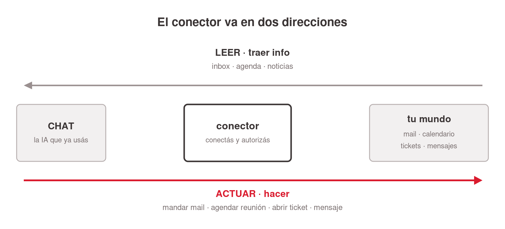
<!-- ascii-source:
        CONECTOR: dos direcciones

   LEER (traer info)          ACTUAR (hacer)
   <------------------        ------------------&gt;
+------+           +----------+           +----------+
| CHAT |  <------- | conector |  ------&gt;  | tu mundo |
+------+   inbox,  +----------+  mandar   | mail     |
           agenda,              mail,     | calendario|
           noticias             agendar,  | tickets  |
                                ticket    | mensajes |
                                          +----------+
-->
<!-- ascii-note:
intent: mostrar que un conector funciona en dos direcciones: leer (traer información: inbox, agenda, noticias) y actuar (ejecutar acciones: mandar mail, agendar reunión, abrir ticket, mandar mensaje).
emphasize: las dos flechas opuestas LEER vs ACTUAR sobre el mismo conector; que ACTUAR es la capacidad ejecutiva nueva de esta slide.
labels: izquierda = CHAT; centro = conector; derecha = tu mundo (mail, calendario, tickets, mensajes); flecha de lectura y flecha de acción.
-->

### Sources

- Model Context Protocol — https://modelcontextprotocol.io — el estándar define herramientas que ejecutan acciones sobre sistemas externos, no solo lectura: "AI applications ... which can access your data and take actions on your behalf" (verificado 2026-07-09).
- Anthropic Support — Getting started with custom connectors using remote MCP: https://support.claude.com/en/articles/11175166-getting-started-with-custom-connectors-using-remote-mcp — los conectores permiten a Claude "access and take action in these services" (verificado 2026-07-09).
- "corpus/mision - auto.zip.md" — el connector de Gmail **deja un borrador de correo** para el equipo (capacidad ejecutiva en acción, M3 y loop final).
- Verificación de primera mano del presentador (2026-07-09): la acción de **agendar/crear eventos vía el connector de Calendar** está chequeada y funciona.
- corpus/agentic-ai-deck.zip.md — Connectors como "las manos" del agente (tocar sistemas, no solo leerlos).

### Speaker notes

El giro de la sección: el conector era una antena que traía info; ahora es una mano que actúa. Los dos ejemplos de la lámina están verificados de primera mano: el borrador de Gmail (misión Atlas) y agendar por Calendar, que el docente chequeó y puede demostrar en vivo. El diagrama suma tickets y mensajes: nombrarlos como capacidad del ecosistema (el estándar MCP y los conectores lo permiten), sin prometer un conector puntual que no probamos. La práctica sana mientras aprenden es "borrador, no envío directo"; Atlas deja el borrador en Gmail y no lo manda. Cerrar sembrando la sección 3: una IA que se informa y actúa, más una agenda, puede trabajar sola. Tiempo objetivo: ~6 min.

---

# 3. El chat trabaja solo

**Goal of this section:** Que la audiencia entienda qué es una tarea programada (describir un trabajo una vez, fijar una cadencia, que corra sola), cómo se potencia con conectores (el resumidor semanal de mails) y la pregunta práctica antes de confiarle algo: ¿dónde corre? Local, con la computadora prendida, o nube. Todavía desde el mundo del chat.

---

## 1. Tareas programadas desde el chat

### Content

- Te **suscribís a una respuesta** en vez de preguntar cada vez.
- El ejemplo: *"todos los días 8:00, resumí mi inbox, lo urgente arriba."*
- Existe en **ChatGPT** ("tasks") y en **Claude** (claude.ai, desde el navegador).


<!-- ascii-source:
        TAREA PROGRAMADA (se describe UNA vez)

  [reloj: lunes 8:00]
        |
        v
  +-----------+   usa conectores   +--------------+
  |  la tarea | -----------------&gt; | mail / web / |
  |  corre    | <----------------- | calendario   |
  |  sola     |    trae la info    +--------------+
  +-----------+
        |
        v
  resumen listo en tu chat, cada semana,
  sin que lo pidas de nuevo
-->
<!-- ascii-note:
intent: mostrar el ciclo de una tarea programada: un disparador de calendario (lunes 8:00) ejecuta la tarea, que usa los conectores (mail/web/calendario) para traer información y deja el resultado listo sin intervención del usuario.
emphasize: que se describe UNA vez y corre sola; el reloj como disparador; el uso de conectores dentro de la corrida; el resultado que "aparece" cada semana.
labels: reloj (cadencia) -> la tarea corre sola -> conectores (mail/web/calendario) -> resumen listo en tu chat.
-->

### Sources

- OpenAI Help — Tasks in ChatGPT: https://help.openai.com/en/articles/10291617-tasks-in-chatgpt — tareas programadas en el chat de ChatGPT (evidencia transversal del concepto; verificado 2026-07-09).
- Anthropic Support — Release notes (entrada del 7 de julio de 2026): https://support.claude.com/en/articles/12138966 — "scheduled tasks run with no device online"; sesiones remotas (beta); rollout empezando por Max (verificado 2026-07-09).
- Observación de primera mano del presentador (2026-07-09): tareas programadas activas en claude.ai en el navegador.
- TechCrunch (2026-07-07) — "The coding agent wars are spilling into the rest of the office": https://techcrunch.com/2026/07/07/the-coding-agent-wars-are-spilling-into-the-rest-of-the-office-claude-cowork/ — cobertura de prensa: expansión a web/mobile, corridas en background sin dispositivo activo, rollout Max (encuadre de terceros).
- Anthropic Support — Schedule recurring tasks in Claude Cowork: https://support.claude.com/en/articles/13854387-schedule-recurring-tasks-in-claude-cowork — la forma Cowork (se desarrolla en la sección 6).
- "corpus/mision - auto.zip.md" — el flujo programado de Atlas (Step 3.3): la semilla del "resumidor que corre solo".

### Speaker notes

Describís el trabajo una vez, elegís cadencia (diaria, semanal, a demanda) y corre sola avisándote con el resultado. Además hereda tus conectores: mail, web, calendario. El resumidor de mails engancha porque el inbox desbordado lo viven todos. Variante semanal: "los lunes a las 8:00, resumime la semana del calendario + los mails sin responder". Contarlo en primera persona ("mi resumen de las 8:00"). ChatGPT lo llama "tasks" (recordatorios, briefings, monitoreo); Claude ya las ofrece en claude.ai desde el navegador. Si el rollout lo permite, mostrarlas en vivo desde la cuenta del docente. La pregunta de dónde corre la tarea viene en la próxima slide; no adelantarla. En la sección 6 vuelven, sobre carpetas y archivos reales. Tiempo objetivo: ~6 min.

---

## 2. ¿Dónde corre tu tarea? Local vs nube

### Content

- Antes de confiarle algo a una tarea programada, **sabé dónde corre**.
- Si la tarea necesita **archivos o apps locales**, corre **local siempre**.

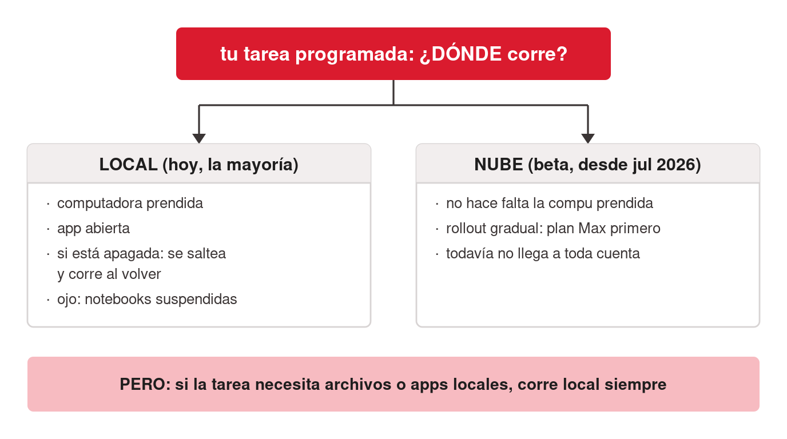
<!-- ascii-source:
   tu tarea programada: ¿DONDE corre?
              |
      +-------+----------------------+
      v                              v
  LOCAL (hoy, la mayoria)      NUBE (beta, jul 2026 ->)
  · compu prendida             · sin compu prendida
  · app abierta                · rollout gradual (Max 1ro)
  · apagada => se saltea,      · PERO: archivos/apps
    corre al volver              locales => local igual
  · ojo notebooks suspendidas
-->
<!-- ascii-note:
intent: mostrar la bifurcación práctica de una tarea programada según dónde corre: LOCAL (computadora prendida + app abierta; si está apagada se saltea y corre al volver; cuidado con notebooks que se suspenden) vs NUBE (sin computadora, beta desde julio 2026, rollout Max primero; excepción: tareas con archivos/apps locales corren local igual).
emphasize: la bifurcación como pregunta ("¿DÓNDE corre?"); en LOCAL los tres cuidados prácticos (prendida, app abierta, se saltea); en NUBE que no hace falta la compu pero es beta/rollout gradual, con la excepción de archivos locales.
labels: raíz = tu tarea programada ¿dónde corre?; rama izquierda = LOCAL (hoy, la mayoría) con cuidados; rama derecha = NUBE (beta, julio 2026) con condiciones.
-->

### Sources

- Anthropic Support — Schedule recurring tasks in Claude Cowork: https://support.claude.com/en/articles/13854387-schedule-recurring-tasks-in-claude-cowork — ejecución remota ("run on their cadence even when your computer is asleep or the Claude Desktop app is closed") y la excepción local: "If a scheduled task requires local files or apps, it will only run locally" (verificado 2026-07-09).
- Anthropic Support — Release notes (7 de julio de 2026): https://support.claude.com/en/articles/12138966 — "scheduled tasks run with no device online"; beta, rollout gradual empezando por Max (verificado 2026-07-09).
- TechCrunch (2026-07-07): https://techcrunch.com/2026/07/07/the-coding-agent-wars-are-spilling-into-the-rest-of-the-office-claude-cowork/ — corridas en background sin dispositivo activo, disponible primero para suscriptores Max (encuadre de terceros).
- Comportamiento local "se saltea y corre al volver": documentado en la versión anterior del artículo 13854387 (verificada en junio 2026, cuando la ejecución era solo local); la versión actual ya no lo detalla — mantenido como cuidado práctico del modo local, con esa atribución.

### Speaker notes

Hoy conviven dos realidades. Una: la nube existe desde el 7 de julio de 2026, la tarea corre sin tu compu, pero es beta y llega de a poco, empezando por el plan Max. Dos: mientras a tu cuenta no le llegue, la tarea corre local. Computadora prendida y app abierta, o no corre. Es lo que la mayoría va a vivir este cuatrimestre. Si la máquina está apagada o suspendida a la hora programada, la corrida se saltea y se ejecuta al volver (comportamiento documentado cuando la ejecución era solo local; el artículo actual ya no lo detalla, decirlo como cuidado práctico y no como spec). Las notebooks se suspenden solas; revisar la configuración de energía si el resumen de las 8:00 nunca aparece. La excepción que sobrevive incluso con nube: una tarea que necesita tus archivos o apps locales corre local siempre. Anticipa la sección 6: las tareas de Cowork viven de tus carpetas. Antes de confiarle el reporte del lunes, contestá "¿dónde corre esto?". Tiempo objetivo: ~5 min.

---

# 4. Qué cambia con Cowork

**Goal of this section:** El salto grande de la charla. Mostrar por qué Cowork es otra categoría de herramienta y qué cambia en tu rol: dejás de tipear un mensaje a la vez y empezás a delegar un resultado. Ubicar las tres superficies de Claude, instalar el superpoder (la herramienta de propósito general del knowledge worker, con el español como lenguaje) y la nueva habilidad base. Cierra con el mapa de lo que viene.

---

## 1. Las tres superficies de Claude

### Content

- **Web/Chat**: navegador, tareas puntuales. *Donde estuvimos hasta ahora.*
- **Claude Code**: terminal; developers.
- **Cowork**: GUI de escritorio, trabajo multipaso sobre archivos reales. *El resto de la charla vive acá.*

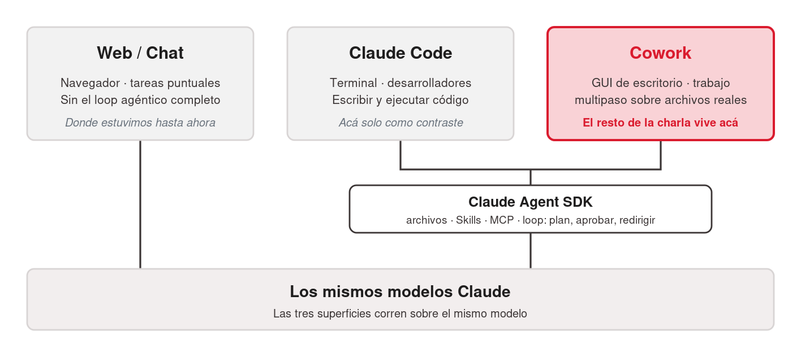
<!-- ascii-source:
+----------------+   +----------------+   +----------------+
|   Web / Chat   |   |  Claude Code   |   |     Cowork     |
| superficie de  |   | terminal+Code  |   |  GUI, escritorio|
|   chat         |   | escribir codigo|   | trabajo multipaso|
+----------------+   +----------------+   +----------------+
        |              \________  ________/
        |                  Agent SDK (engine de agente)
        |                  archivos / Skills / MCP / loop
        \________________   |   ________________/
                         \  |  /
                  +--------------------+
                  | MISMOS MODELOS     |
                  |     CLAUDE         |
                  +--------------------+
-->
<!-- ascii-note:
intent: mostrar que las tres superficies corren sobre los mismos modelos Claude, y que Code+Cowork además comparten el mismo engine de agente (Claude Agent SDK), mientras Web/Chat es la superficie de chat de ese modelo.
emphasize: la caja base "MISMOS MODELOS CLAUDE" como cimiento de las tres; el lazo "Agent SDK" que une Claude Code y Cowork (no Web/Chat); resaltar Cowork como el foco de la charla.
labels: tres columnas (Web/Chat = chat, Claude Code y Cowork = Agent SDK) sobre una base de modelos Claude compartida.
-->

### Sources

- corpus/agentic-ai-deck.zip.md — "Same engine. Different surface." (key claims; slide 7.1 "Claude Code vs Cowork — the close").
- "corpus/mision - auto.zip.md" — framing de arquitectura Cowork (local, GUI, sin terminal).
- Anthropic — Claude Cowork (product page): https://www.anthropic.com/product/claude-cowork — "built on the very same foundations as Claude Code" (confirma que Cowork comparte base con Claude Code).
- Anthropic Engineering — Building agents with the Claude Agent SDK: https://www.anthropic.com/engineering/building-agents-with-the-claude-agent-sdk — el engine de agente común (Agent SDK) sobre el que se construyen Claude Code y Cowork.

### Speaker notes

Abrir conectando con el recorrido: hasta acá todo pasó en la superficie de chat, ahora la IA baja a tu computadora. Primero, el mapa. La precisión técnica, para decir y no para la lámina: las tres caras corren sobre los mismos modelos Claude. Cowork está construido sobre las mismas bases que Claude Code (el Claude Agent SDK), así que Code y Cowork comparten además el engine de agente, con los mismos archivos, Skills, MCP y el mismo loop de plan, aprobar y redirigir. Web/Chat es ese mismo modelo en una superficie de chat, sin el loop agéntico completo. El resto de la charla vive en Cowork, la cara para quien no vive en una terminal. Claude Code aparece solo como contraste. Tiempo objetivo: ~5 min.

---

## 2. El superpoder de Cowork

### Content

- Cowork **no** es "Claude instalado en tu compu": **cambia por completo la forma de trabajar.**
- La **herramienta de propósito general del knowledge worker**. El "lenguaje de programación" es el español.
- Anthropic: **"Claude Code para el resto de tu trabajo"**.

### Sources

- corpus/agentic-ai-deck.zip.md — posicionamiento Cowork vs Claude Code ("Same engine. Different surface."; Cowork = la cara para knowledge workers sin terminal; slide 7.1 "Claude Code vs Cowork — the close").
- Anthropic — Claude Cowork (product page): https://www.anthropic.com/product/claude-cowork — encuadre oficial: Cowork como "Claude Code para el resto de tu trabajo"; construido sobre las mismas bases que Claude Code.
- Claude blog — Cowork research preview ("Claude Code power for knowledge work"): https://claude.com/blog/cowork-research-preview — la ambición de llevar el poder de Claude Code al trabajo del conocimiento; Cowork generaliza un éxito probado primero con developers.
- CNBC — Anthropic's Claude Cowork targets the office worker: https://www.cnbc.com/2026/02/24/anthropic-claude-cowork-office-worker.html — encuadre de público general / office worker (tercero, no Anthropic).

### Speaker notes

El beat de "¿y a mí por qué me importa?". Abrir con las palabras del presentador: Cowork NO es "Claude instalado en tu computadora", es un cambio completo en la forma de trabajar. Hasta acá la audiencia extendió un chat; esta lámina anuncia otra categoría de herramienta. El "lenguaje de programación" acá es el español: describís lo que querés y el agente lo hace. Lo que sí es de Anthropic, y va citado como framing propio, es "Claude Code para el resto de tu trabajo": que cualquier knowledge worker sienta con Cowork lo que los ingenieros ya sienten con Claude Code. Cowork generaliza algo que funcionó primero con developers. La analogía que engancha viene en la próxima lámina. Tiempo objetivo: ~2-3 min.

---

## 3. La nueva habilidad base

### Content

- **"El nuevo Excel"** *(encuadre de analistas e industria, no de Anthropic)*.
- Gestión: la habilidad base se redefine **ahora**; llegar temprano es ventaja.

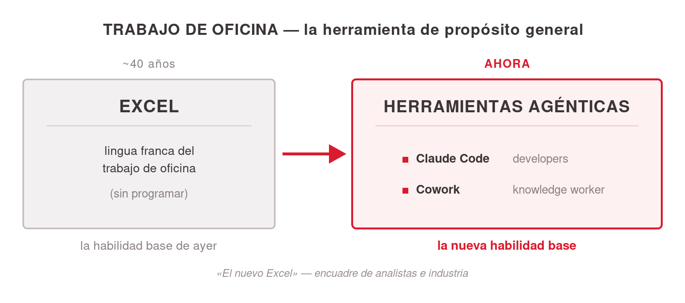
<!-- ascii-source:
TRABAJO DE OFICINA: la herramienta de proposito general

 ~40 anios                              ahora
+----------------------+    ===>    +-----------------------------+
| EXCEL                |            | HERRAMIENTAS AGENTICAS      |
| lingua franca del    |            | Claude Code  (developers)   |
| trabajo de oficina   |            | Cowork       (knowledge     |
| (sin programar)      |            |               worker)       |
+----------------------+            +-----------------------------+
 la habilidad base de ayer           la nueva habilidad base
-->
<!-- ascii-note:
intent: encuadrar el "superpoder" de Cowork como herramienta de propósito general del knowledge worker, usando la analogía Excel (40 años, habilidad base de oficina) -> herramientas agénticas (Claude Code para developers, Cowork para knowledge workers) como la nueva habilidad base.
emphasize: la flecha temporal de Excel (ayer) a las herramientas agénticas (ahora); el paralelo Claude Code=developers / Cowork=knowledge worker; que la analogía Excel es encuadre de industria, no claim oficial.
labels: dos cajas — EXCEL (lingua franca, sin programar) a la izquierda; HERRAMIENTAS AGENTICAS (Claude Code = developers, Cowork = knowledge worker) a la derecha; pie "habilidad base de ayer" -> "nueva habilidad base".
-->

### Sources

- "Claude Code is the New Excel" (ensayo de analista): https://nextword.substack.com/p/claude-code-is-the-new-excel — origen de la analogía del "nuevo Excel" (atribuir AQUÍ, NO a Anthropic).
- CNBC — Anthropic's Claude Cowork targets the office worker: https://www.cnbc.com/2026/02/24/anthropic-claude-cowork-office-worker.html — encuadre de terceros sobre el trabajo de oficina como destino de la herramienta (prensa, no Anthropic).
- corpus/agentic-ai-deck.zip.md — el paralelo que dibuja el diagrama: Claude Code = developers, Cowork = la cara para knowledge workers sin terminal (slide 7.1 "Claude Code vs Cowork — the close").

### Speaker notes

El gancho es la analogía del Excel, dicha con cuidado. Durante unas cuatro décadas, saber Excel fue la habilidad base del trabajo de oficina: sin programar, resolvías el 80% del trabajo de conocimiento. La tesis de varios analistas de la industria es que las herramientas agénticas, Claude Code para los que programan y Cowork para los que no, van camino a ser esa nueva habilidad base. Atribuirlo a analistas e industria, "hay quien lo llama el nuevo Excel", y NO a Anthropic. Cerrar aterrizándolo en la audiencia: vienen del mundo de la gestión, no programan, y por eso les sirve. La habilidad base se está redefiniendo ahora y llegar temprano es ventaja. Ahora pasamos a la mecánica: cómo se delega. Tiempo objetivo: ~2-3 min.

---

## 4. El cambio de paradigma

### Content

- La frase de la sesión: **"Dejás de tipear un mensaje a la vez y empezás a entregar un resultado."**
- Anthropic: *"menos una sesión de chat, más asignarle tareas a un colega."*
- Chatear vs delegar:

| | Chatear | Delegar a un agente |
|---|---|---|
| Cómo trabajás | Un mensaje a la vez | Describís un resultado |
| Los pasos | Los hacés vos | El agente planifica y ejecuta |
| La salida | Texto en la ventana | Archivos en tu disco |
| Tu rol | Tipear el próximo prompt | Leer el plan, guiar a mitad de camino |

### Sources

- corpus/agentic-ai-deck.zip.md — "Stop prompting. Start delegating." (slide 2.3 the reframe); tabla "Chatting vs Delegating" (slide 3.16).
- "corpus/mision - auto.zip.md" — "el verdadero premio no es Atlas: sos vos, dominando Claude Cowork"; "Conversá, no programes."
- Anthropic — Claude Cowork (product page): https://www.anthropic.com/product/claude-cowork — refuerza el paradigma: trabajar con Cowork "se parece menos a una sesión de chat y más a asignarle tareas a un colega".
- (técnico, opcional) Anthropic Engineering — Building agents with the Claude Agent SDK: https://www.anthropic.com/engineering/building-agents-with-the-claude-agent-sdk — por qué el loop plan→ejecutar→guiar es lo que define a un agente frente a un chat.

### Speaker notes

El concepto-ancla de la charla. Los conectores y las tareas programadas extendieron qué puede hacer el chat; el agente cambia tu rol. Desarrollar la frase de la sesión: el agente planifica y trabaja sobre tus archivos reales, y vos lo guiás en lugar de hacer cada paso. Son dos formas de trabajar, no dos productos. Usar la tabla para hacerlo concreto: la salida deja de ser texto en una ventana y pasa a ser archivos en tu disco. Anticipar la misión: vamos a "contratar" a Atlas, un analista de mercado virtual, y entrenarlo una vez para que después trabaje solo. Cerrar citando a Anthropic, "menos una sesión de chat, más asignarle tareas a un colega". Tiempo objetivo: ~5 min.

---

## 5. Bloques que se apilan

### Content

- **Bloques que se apilan**: no es una escalera; usás solo los que necesitás.
- El mapa de la charla: ya recorrimos los tres primeros y **estamos acá**. Volvé para ubicarte.
- **Plugins** = capa transversal de distribución (sección 7).

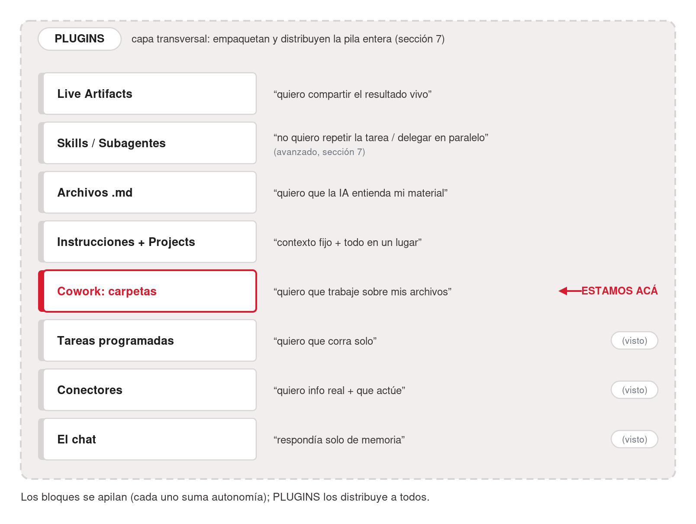
<!-- ascii-source:
+============== PLUGINS (capa transversal: empaquetan y distribuyen) ==============+
||                                                                                ||
||  +----------------------+  "quiero compartir el resultado vivo"                ||
||  | LIVE ARTIFACTS       |                                                      ||
||  +----------------------+                                                      ||
||  +----------------------+  "no quiero repetir la tarea / delegar en paralelo"  ||
||  | SKILLS / SUBAGENTES  |  (avanzado, seccion 7)                               ||
||  +----------------------+                                                      ||
||  +----------------------+  "quiero que la IA entienda mi material"             ||
||  | ARCHIVOS .MD         |                                                      ||
||  +----------------------+                                                      ||
||  +----------------------+  "contexto fijo + todo en un lugar"                  ||
||  | INSTRUCCIONES +      |                                                      ||
||  | PROJECTS             |                                                      ||
||  +----------------------+                                                      ||
||  +----------------------+  "quiero que trabaje sobre mis archivos"   <== ACA   ||
||  | COWORK: carpetas     |                                                      ||
||  +----------------------+                                                      ||
||  +----------------------+  "quiero que corra solo"                   (visto)   ||
||  | TAREAS PROGRAMADAS   |                                                      ||
||  +----------------------+                                                      ||
||  +----------------------+  "quiero info real + que actue"            (visto)   ||
||  | CONECTORES           |                                                      ||
||  +----------------------+                                                      ||
||  +----------------------+  "respondia solo de memoria"               (visto)   ||
||  | EL CHAT              |                                                      ||
||  +----------------------+                                                      ||
+==================================================================================+
   los bloques se apilan (cada uno suma autonomia); PLUGINS los distribuye a todos
-->
<!-- ascii-note:
intent: presentar el arco completo de la charla como bloques que se apilan (no una pirámide/escalera estricta): el chat (base) -> conectores -> tareas programadas -> Cowork (carpetas/archivos) -> Instrucciones+Projects -> archivos .md -> Skills/Subagentes -> Live Artifacts, con Plugins como BANDA TRANSVERSAL que envuelve/distribuye todo. Los tres bloques de abajo están marcados "(visto)" y el bloque Cowork lleva el marcador "estamos acá".
emphasize: el marcador "<== ACÁ" en el bloque Cowork; los "(visto)" en chat/conectores/tareas programadas; que Plugins es transversal (banda que rodea la pila, distinto color), NO un nivel más; el par bloque↔problema en cada nivel.
labels: banda exterior = PLUGINS (capa transversal, distribución). Bloques apilados (base→cima): El chat · Conectores · Tareas programadas · Cowork: carpetas · Instrucciones+Projects · Archivos .md · Skills/Subagentes · Live Artifacts, cada uno con su frase-problema a la derecha.
-->

### Sources

- corpus/agentic-ai-deck.zip.md — progresión de building blocks del deck (Instrucciones → Projects → Skills → Connectors/MCP → Schedule → Live Artifacts); la idea de "pila" es la lectura ordenada de esa progresión, re-secuenciada al arco chat-primero de esta charla.
- "corpus/mision - auto.zip.md" — la misión Atlas arma estas piezas una por una.

### Speaker notes

El mapa de toda la sesión: arranca en el chat que ya usan, no en Cowork. Aprovechar el efecto acumulado: los tres de abajo ya los recorrimos; señalar "estamos acá", Cowork, donde la IA trabaja sobre carpetas y archivos reales. Leer cada bloque por su problema, que el diagrama trae al lado: cada pieza nace de una frustración concreta. Cuidado con la metáfora: no es una pirámide donde cada capa depende de todas las de abajo; los bloques se apilan y se combinan. Prometer el roadmap: vamos a recorrer cada bloque, uno por uno, en este orden, y pueden volver acá entre secciones para ubicarse. Al final, la pila entera es Atlas. Plugins envuelve la pila y no es un bloque más: empaqueta y distribuye varias piezas a la vez. Lo vemos en la sección 7. Tiempo objetivo: ~3-4 min.

---

# 5. Tu espacio en Cowork

**Goal of this section:** Montar el lugar donde trabaja el agente: la interfaz de Cowork, las Instrucciones como contrato de trabajo, el Project como espacio fijo con su carpeta y su memoria, y la carpeta que le concedés, que es tu control de privacidad.

---

## 1. Demo time

### Content

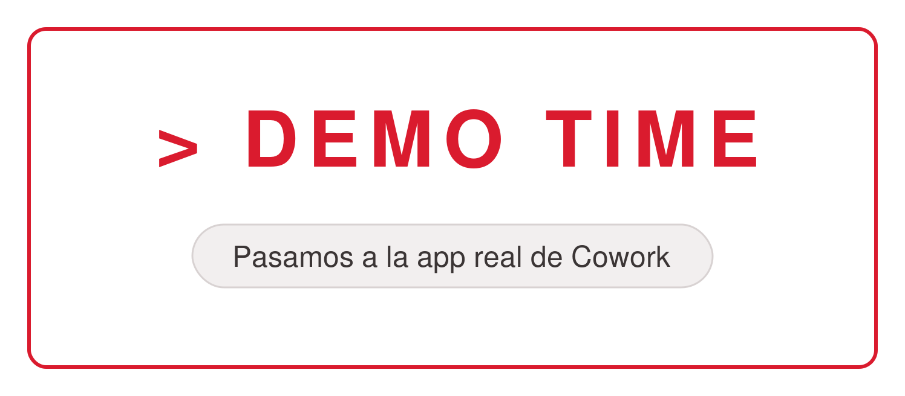
<!-- ascii-source:
   __________________________________________
  /                                          /|
 /            >   D E M O   T I M E          / |
/__________________________________________/  |
|                                          |   |
|     [ Pasamos a la app real de Cowork ]  |  /
|__________________________________________| /
|__________________________________________|/
-->
<!-- ascii-note:
intent: tarjeta/banner de "DEMO TIME" como señal visual fuerte al tope de la slide, para marcar el corte de conceptos a demo en vivo sobre la app real.
emphasize: el texto grande "> DEMO TIME"; sensación de cartel/placa (no un diagrama de flujo); que abajo se lee "pasamos a la app real de Cowork".
labels: banner DEMO TIME; subtítulo "Pasamos a la app real de Cowork".
-->

### Sources

- corpus/agentic-ai-deck.zip.md — slide 3.19 (modelo de aprobación Cowork); la demo de arranque sugerida ("organizá esta carpeta de 8 PDFs por tema y dame un resumen de un párrafo de cada uno").

### Speaker notes

Momento de demo en vivo. Cerrás los conceptos y abrís Cowork. Demo sugerida de arranque, la del deck: "Organizá esta carpeta de 8 PDFs por tema y dame un resumen de un párrafo de cada uno." Dejarlos ver a Claude planificar, tocar archivos y entregar, sin explicar la mecánica todavía. Que la sorpresa haga el trabajo. La anatomía de la pantalla viene en la lámina siguiente. Si la conexión falla o la demo se cuelga, saltar directo a esa lámina, que tiene la captura anotada de respaldo. Tiempo objetivo: ~5 min (la demo).

---

## 2. La interfaz de Cowork

### Content


- Señalar en vivo: modo **"Ask"**, selector de carpeta, pestañas **Scheduled** y **Live artifacts**, panel de **Project**.
- El control es la terna: **modo + aprobar/redirigir + carpeta concedida**.
- **Sin slash commands**: Cowork es GUI.

### Sources

- corpus/agentic-ai-deck.zip.md — "screenshot-cowork-tab.png" (anatomía Cowork, 14 elementos anotados; el asset más Cowork-funcional de la fuente); slide 3.19 (modelo de aprobación Cowork).

### Speaker notes

Recorrido de 2-3 minutos por la pantalla, sobre la app real, o sobre la captura anotada si la demo falló. Señalar el selector de modo, que viene en "Ask before acting" por defecto, cómo se concede una carpeta de trabajo, y dónde viven Scheduled y Live artifacts, que usamos más adelante. El control que tienen es esa terna: el modo, aprobar o redirigir cada paso, y qué carpeta le concediste. Aclarar de entrada que Cowork es GUI: no hay slash commands que memorizar, todo se hace con el mouse y en español. Tiempo objetivo: ~3 min.

---

## 3. Instrucciones: el contrato

### Content

- Instrucciones = el **"contrato de trabajo"**: reglas en lenguaje natural que valen para todo, sin repetirlas.
- Ejemplo (Atlas):

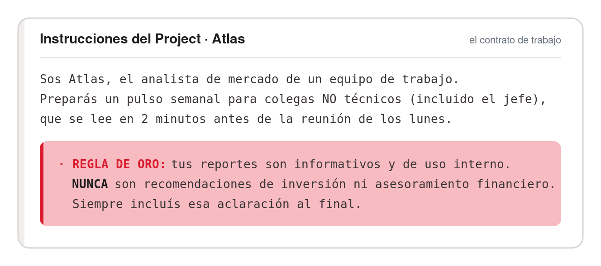
<!-- ascii-source:
Sos Atlas, el analista de mercado de un equipo de trabajo.
Preparás un pulso semanal para colegas NO técnicos (incluido el jefe),
que se lee en 2 minutos antes de la reunión de los lunes.

· REGLA DE ORO: tus reportes son informativos y de uso interno.
  NUNCA son recomendaciones de inversión ni asesoramiento financiero.
  Siempre incluís esa aclaración al final.
-->

### Sources

- corpus/agentic-ai-deck.zip.md — "the project context panel (GUI)" como lugar de las Instrucciones en Cowork; matriz de disponibilidad 3.3 (Persistent instructions, Cowork ⚠️).
- "corpus/mision - auto.zip.md" — texto exacto de las Project Instructions de Atlas (Step 1.1); "las Instrucciones son su contrato de trabajo".

### Speaker notes

Conectar con el paradigma: en lugar de re-explicarle el contexto cada vez, lo escribís una vez y vale para todo el Project. Mostrar el texto real de las Instrucciones de Atlas. Leer en voz alta lo que no entró en la lámina: Atlas sigue Apple, Microsoft y Nvidia, escribe en español claro y breve, sin jerga financiera, y si usa un término técnico lo explica en una línea. Destacar la regla de oro del disclaimer: acá van las reglas no negociables. Consejo de escritura: cortas y claras, en lenguaje natural. Dónde viven: en el panel de contexto del Project. No es un archivo que edités a mano; lo escribís en el panel y queda asociado al Project. Tiempo objetivo: ~7 min.

---

## 4. Projects: guardar todo en un lugar fijo

### Content

- Project = espacio autocontenido: **carpeta propia + memoria + lugar fijo**.
- Tres capas persistentes: Instrucciones · Knowledge base · Chats.
- Los chats del Project **no comparten contexto entre sí** (solo la base de conocimiento).

### Sources

- corpus/agentic-ai-deck.zip.md — definición de "Project (Chat/Cowork)" (tres capas; chats no comparten contexto).
- "corpus/mision - auto.zip.md" — "el Proyecto le da a Atlas una carpeta propia, memoria y un lugar fijo" (Step 1.1).

### Speaker notes

El Project es el contenedor de todo lo demás: Instrucciones, archivos, memoria. Las ventajas, para desarrollar a viva voz: todo queda organizado y reutilizable. Las Instrucciones valen para todo el Project, la memoria recuerda tus correcciones y preferencias, y los archivos viven en una carpeta concreta de tu disco. En la misión, el Project "Inteligencia de Mercado Semanal" apunta a `Documentos/Atlas-Mercado`. El punto práctico que sorprende: los chats no se hablan entre sí dentro del Project; si querés que recuerde algo, va a las Instrucciones o a la base de conocimiento. Las dos láminas que siguen bajan a pantalla cómo le concedés la carpeta y qué ve en el panel de contexto. Tiempo objetivo: ~6 min.

---

## 5. Concedé una carpeta

### Content

- Vos concedés la carpeta con el **selector del sistema operativo**. Lo de afuera, Cowork no lo ve.


- La carpeta ES tu control de privacidad: **nunca datos sensibles, credenciales o NDA.**
- Buena práctica: una **carpeta dedicada** al Project.

### Sources

- corpus/agentic-ai-deck.zip.md — "Working directory + permissions" (folder picker del sistema; lo concedido define el alcance).
- "corpus/mision - auto.zip.md" — el Project "Inteligencia de Mercado Semanal" apunta a `Documentos/Atlas-Mercado` (Step 1.1).

### Speaker notes

Baja a pantalla lo que contó la lámina anterior. Mostrar la captura del selector: es el mismo diálogo de carpetas del sistema operativo que ya usan todos los días. Ese es el control de qué toca Claude, y también su límite: Cowork solo ve lo que le concedés. No saltear el mensaje de seguridad: nunca una carpeta con datos sensibles, credenciales o material bajo NDA. La práctica sana es una carpeta dedicada al Project y nada más. Aterrizarlo en la misión: Atlas trabaja sobre `Documentos/Atlas-Mercado`. Tiempo objetivo: ~2 min.

---

## 6. El panel de contexto

### Content


- El **panel de contexto** muestra qué sabe el Project: Instrucciones + base de conocimiento + carpeta concedida.

### Sources

- corpus/agentic-ai-deck.zip.md — definición del panel de contexto del Project ("the project context panel (GUI)").

### Speaker notes

Mostrar la captura del panel de contexto. Es donde el Project te muestra qué sabe: las Instrucciones que escribiste, la base de conocimiento que le cargaste y la carpeta que le concediste. Las tres capas del contexto, ahora en pantalla. El valor práctico: de un vistazo auditás qué contexto tiene el Project antes de pedirle nada. Tiempo objetivo: ~2 min.

---

# 6. Trabajar y entregar

**Goal of this section:** Cómo trabaja el agente dentro de ese espacio: los archivos `.md` como material de trabajo, las tareas programadas corriendo solas sobre tus carpetas, y lo que te entrega al final.

---

## 1. Archivos .md: la lingua franca

### Content

- Un `.md` (Markdown) = **texto plano** + estructura liviana: `#` títulos, `-` listas, `**negrita**`, tablas.
- Se lee a ojo con cualquier editor, y la máquina entiende la estructura.
- **Metadata (header YAML)**: declara *qué es* el archivo y *cuándo* usarlo. Vuelve con las Skills (sección 7).
- La **lingua franca** del mundo LLM: el modelo lee texto. Portable y versionable.

### Sources

- corpus/agentic-ai-deck.zip.md — "Markdown is the lingua franca"; definición de Skill (SKILL.md con YAML frontmatter: name + description; "Description drives triggering — semantic, not keyword").
- "corpus/mision - auto.zip.md" — "mismo estándar SKILL.md" entre Cowork y Codex (Cowork vs Codex).

### Speaker notes

Beat de enseñanza propio, no un paréntesis: en el mundo de agentes el formato de tus archivos importa, y gana el más simple. Abrir un `.md` real en pantalla si se puede. Mostrar que es texto plano con marcas mínimas (un `#`, unas listas) y que igual se ve estructurado; se abre con cualquier editor, en cualquier máquina, sin formato propietario. Lo que ves es lo que hay. La idea a transmitir: el modelo lee texto, y cuanto menos formato opaco haya entre tu contenido y el modelo, mejor trabaja. Por eso es portable y versionable; el mismo estándar funciona entre herramientas. Presentar la metadata (header YAML entre `---`) como la etiqueta del frasco: dice qué es el archivo y cuándo usarlo. La `description` de una Skill es eso (activación semántica, no por palabra clave; sección 7). Alcance: qué es y por qué importa, sin detalle fino de formato. La próxima slide lo baja a la práctica: en qué formato conviene trabajar. Tiempo objetivo: ~5 min.

---

## 2. Trabajá en .md, exportá al final

### Content

- Vale doble: la **memoria** del agente (texto plano) y tus **archivos de trabajo** (en el Project).
- Regla de bolsillo: *editá en `.md`, entregá en lo que pida tu jefe.*

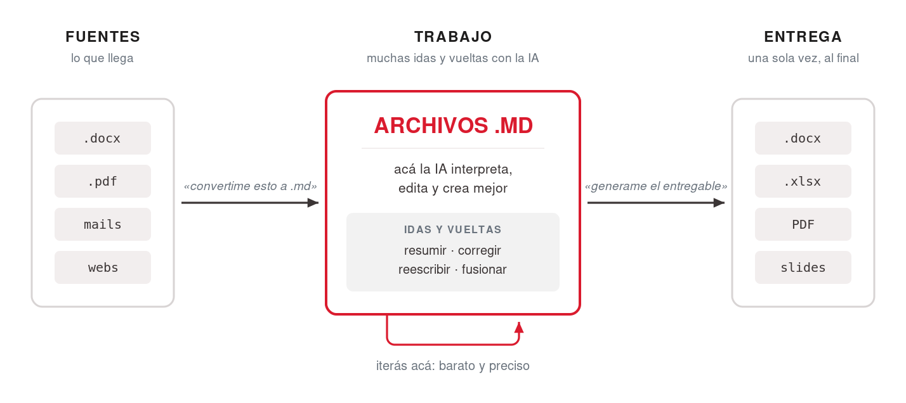
<!-- ascii-source:
   FLUJO DE TRABAJO CON LA IA

  fuentes            TRABAJO (muchas idas       entrega (1 vez,
  (lo que llega)     y vueltas con la IA)       al final)
+--------------+     +-----------------+      +---------------+
| .docx  pdf   | --&gt; |    ARCHIVOS     | --&gt;  | .docx  .xlsx  |
| mails  webs  |     |      .MD        |      | PDF    slides |
+--------------+     | la IA lee/edita |      +---------------+
                     | /crea MEJOR aca |
  "convertime        +-----------------+        "generame el
   esto a .md"        iterás acá, barato          entregable"
-->
<!-- ascii-note:
intent: mostrar el flujo de trabajo recomendado con la IA: las fuentes (docx, pdf, mails, webs) se convierten a archivos .md, TODO el trabajo iterativo con la IA pasa sobre los .md (donde interpreta/edita/crea mejor), y el formato final (.docx/.xlsx/PDF/slides) se genera una sola vez al final.
emphasize: la caja central "ARCHIVOS .MD" como el lugar donde vive el trabajo (la IA trabaja MEJOR acá); que la entrega es un paso único al final, no el medio de trabajo.
labels: izquierda = fuentes (lo que llega); centro = archivos .md (trabajo iterativo); derecha = entrega final (.docx/.xlsx/PDF/slides); leyendas "convertime esto a .md" y "generame el entregable".
-->

### Sources

- corpus/agentic-ai-deck.zip.md — "Markdown is the lingua franca" (la configuración y el material del mundo LLM es texto plano; el modelo lee texto).
- "corpus/mision - auto.zip.md" — el flujo de Atlas trabaja sobre archivos `.md` en el Project (reporte `.md` consolidado) y el entregable final se genera al último (borrador de mail, tablero).

### Speaker notes

El hábito concreto que se llevan. La analogía: el `.md` es tu mesa de trabajo y el `.docx`/PDF es la vitrina. Nadie construye dentro de la vitrina. El porqué: en texto plano la IA ve la estructura directa, y por eso interpreta, edita y crea mejor ahí; en .docx/.xlsx atraviesa capas que agregan ruido y errores. Recorrer el flujo con el diagrama. Llega material en cualquier formato y el primer pedido es "convertime esto a `.md`". Las idas y vueltas (resumir, corregir, reescribir, fusionar) pasan sobre los `.md`, más precisas y baratas de iterar. Cuando está listo, un único pedido: "generame el `.docx`/Excel/PDF", una sola vez al final. El "vale doble": lo que debe recordar vive como texto plano (Instrucciones, memoria del Project); los archivos que lee y edita van en `.md` en la carpeta. Atlas: su reporte se consolida como `.md` y las salidas lindas (mail, tablero) salen al último. Tiempo objetivo: ~6 min.

---

## 3. Schedule sobre tus carpetas

### Content

- Ya lo conocés (sección 3): una vez + cadencia → corre sola. En Cowork, además, **sobre tus carpetas y archivos**, con tus Instrucciones, connectors y skills.
- Cadencias: por hora / diaria / semanal / **"Run now"**. Vive en la pestaña **Scheduled**.


- Atlas, lunes 8:00: `buscar-accion` → `reporte-semanal` → borrador en Gmail antes de la reunión de las 9:00.

### Sources

- Anthropic Support — Schedule recurring tasks in Claude Cowork: https://support.claude.com/en/articles/13854387-schedule-recurring-tasks-in-claude-cowork — versión ACTUALIZADA (verificada 2026-07-09): "Scheduled tasks run remotely, so they run on their cadence even when your computer is asleep or the Claude Desktop app is closed"; planes pagos; beta con rollout Max-first. Excepción clave para Cowork: "If a scheduled task requires local files or apps, it will only run locally".
- Anthropic Support — Release notes (7 de julio de 2026): https://support.claude.com/en/articles/12138966 — Cowork en web/mobile, sesiones remotas (beta), "scheduled tasks run with no device online", rollout empezando por Max (verificado 2026-07-09).
- TechCrunch (2026-07-07): https://techcrunch.com/2026/07/07/the-coding-agent-wars-are-spilling-into-the-rest-of-the-office-claude-cowork/ — cobertura de prensa de la expansión y las corridas en background (encuadre de terceros).
- corpus/agentic-ai-deck.zip.md — slide 6.1 (Scheduled tasks, Cowork proactivo). *(La caveat "app abierta" de 6.3 quedó desactualizada por el update del 7 de julio de 2026.)*
- "corpus/mision - auto.zip.md" — el flujo programado de Atlas (Step 3.3); "Run on demand" como tip de demo. *(Su caveat local también quedó desactualizada.)*

### Speaker notes

Slide corta a propósito: dónde-corre ya se enseñó en la sección 3; acá, la forma Cowork. Abrir con el puente: "es la tarea programada que viste en el chat, pero ahora el que corre es el agente, sobre tus carpetas, con tus Instrucciones y skills". Cada corrida abre su sesión fresca y avisa al terminar. El marco de la slide 3.2 en una línea: desde el update del 7 de julio de 2026 hay ejecución remota en la nube (beta, planes pagos, rollout que empieza por Max); mientras no te llegue, corre local, computadora prendida + app abierta. El matiz Cowork: como estas tareas trabajan sobre archivos de tu disco, caen en la excepción documentada "requiere archivos/apps locales, corre local". Planificá con la compu prendida aunque tengas la beta de nube. Para la demo, "Run on demand". Tiempo objetivo: ~5 min.

---

## 4. Artifacts y Live Artifacts

### Content

- **Artifact** = salida viva en un panel lateral: HTML, gráficos, tablas, documentos.
- **Estándar** (todos los planes): estático. **Live** (Cowork, pago): página interactiva y persistente que **se refresca con datos actuales** y guarda **versiones** (pestaña "Live artifacts").
- Se crea desde una tarea, o desde la pestaña (**New artifact**).
- Estado hoy: **NO compartibles aún** (roadmap) · **locales** (no te siguen entre dispositivos) · usan tus connectors **sin re-preguntar**.

### Sources

- corpus/agentic-ai-deck.zip.md — definición de Artifact (dos tiers); slide 5.13 (Standard vs Advanced; Live Artifacts en Cowork); matriz 5.16 (Cowork ✓ full Artifacts + Live Artifacts).
- Anthropic Support — Use Live Artifacts in Claude Cowork: https://support.claude.com/en/articles/14729249-use-live-artifacts-in-claude-cowork — realidad oficial: persisten en la pestaña Live artifacts, se refrescan con datos actuales, guardan versiones; limitaciones: locales (no en la nube), NO compartibles aún (en roadmap), usan los connectors aprobados sin volver a preguntar; dos formas de crearlos (desde una tarea o desde la pestaña) (verificado 2026-07-09).

### Speaker notes

El jefe quería el reporte de dos formas: el email, que ya resolvimos con Gmail + Schedule, y una página siempre actualizada. El Live Artifact es esa página. La distinción: el estándar es un solo archivo estático, lo que generás es lo que queda; el Live persiste en la pestaña Live artifacts, se refresca con datos actuales de tus apps conectadas al abrirlo y guarda historial de versiones. Ser honesto con el estado, porque acá corregimos una confusión: hoy los Live Artifacts NO son compartibles (es del roadmap), son locales (no te siguen entre dispositivos) y usan los connectors que aprobaste sin volver a preguntar. Nota: versiones previas de este material mencionaban un "ShareDuo" con URL pública; eso NO es una capacidad de Cowork y se quitó. El tablero de Atlas viene en la lámina siguiente. Tiempo objetivo: ~6 min.

---

## 5. El tablero de Atlas

### Content

- Atlas: un Live Artifact nuevo por semana, `pulso-semanal-FECHA`. Queda el historial.
- El boceto del jefe es el spec:


### Sources

- "corpus/mision - auto.zip.md" — Skill `publicar-tablero` (un artifact por semana, `pulso-semanal-FECHA`); estructura del mockup del tablero (boceto del jefe).

### Speaker notes

Desarrollar el ejemplo: un Live Artifact nuevo por semana, con el ID `pulso-semanal-FECHA`, así queda historial de tableros. Adentro, tarjetas por empresa, tabla resumen y un chip "LIVE", refrescado con los datos de la semana. Mostrar el boceto del jefe, el "napkin sketch", como el spec de diseño que el artifact reproduce: lo dibujó a mano y el agente lo construye. El cierre de la sección: el jefe pidió mail y tablero, y las dos entregas ya están. Tiempo objetivo: ~4 min.

---

# 7. Piezas avanzadas

**Goal of this section:** Cierre de nivel avanzado, con las tres piezas: **Skills** (enseñarle a Claude tareas reutilizables, cómo se crean, su trampa del Save y la anatomía del SKILL.md), **Subagentes** (delegar trabajo pesado en paralelo) y **Plugins** (distribuir workflows completos, incluido el ciclo de vida en cuentas Team).

---

## 1. Skills: enseñar una vez

### Content

- **Skill** = instrucción reutilizable que se carga cuando tu pedido coincide con su descripción. **Un trabajo por Skill.**
- *"Todo lo que le explicás a Claude dos veces es una Skill que deberías escribir una vez."*
- Atlas: `reporte-semanal` consolida la carpeta `fuentes/` en un reporte con formato fijo.

### Sources

- corpus/agentic-ai-deck.zip.md — definición de Skill (folder + SKILL.md, "one job per skill"); "Anything you explain to Claude twice is a skill you should write once."
- "corpus/mision - auto.zip.md" — el ejemplo `reporte-semanal` (lee la carpeta `fuentes/`, consolida por empresa, formato fijo, sufijo `-new`).

### Speaker notes

Arranca el bloque avanzado. La Skill materializa el "enseñá una vez, reutilizá siempre": una instrucción escrita una sola vez, que Claude carga cuando tu pedido coincide con su descripción. Usar `reporte-semanal` para que sea concreto: lee TODOS los archivos crudos de `fuentes/` (uno por portal), consolida por empresa, la más relevante primera (⭐), y guarda con sufijo `-new` para no pisar el ejemplo. Convierte varios archivos desordenados en un reporte prolijo. El criterio "un trabajo por Skill": si escribís "y además", dividila en dos. La frase de la lámina es el filtro que se llevan: lo que explicás dos veces, escribilo una. Cómo se crea viene en la próxima. Tiempo objetivo: ~4 min.

---

## 2. Cómo se crea una Skill

### Content

- Requisito: **Code execution** habilitado (Settings → Capabilities).

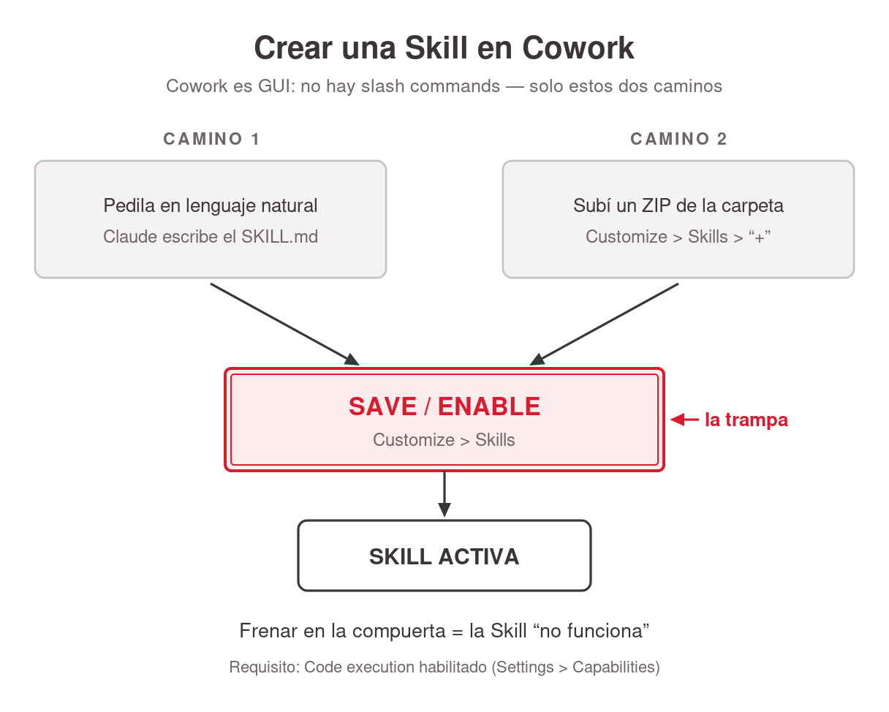
<!-- ascii-source:
     CREAR UNA SKILL EN COWORK (GUI, sin slash commands)

 CAMINO 1                       CAMINO 2
 +---------------------+        +---------------------+
 | pedila en lenguaje  |        | subi un ZIP         |
 | natural: Claude     |        | Customize > Skills  |
 | escribe el SKILL.md |        | > "+"               |
 +---------------------+        +---------------------+
            \                          /
             v                        v
        +==================================+
        |   SAVE / ENABLE                  |  <== la trampa
        |   (Customize > Skills)           |
        +==================================+
                        |
                        v
               +-----------------+
               |  SKILL ACTIVA   |
               +-----------------+

   frenar en la compuerta = la Skill "no funciona"
-->
<!-- ascii-note:
intent: mostrar los dos caminos reales para crear una Skill en Cowork (pedirla en lenguaje natural, con Claude escribiendo el SKILL.md; o subir un ZIP) y que los dos convergen en la misma compuerta, Save / enable en Customize → Skills. Solo pasada esa compuerta la Skill queda activa.
emphasize: la compuerta "SAVE / ENABLE" como cuello de botella del dibujo (caja de doble línea, marcada "la trampa") y la leyenda de abajo "frenar en la compuerta = la Skill no funciona"; que los dos caminos convergen en ella y ninguno la esquiva; que Cowork es GUI y no hay un tercer camino por slash command.
labels: camino 1 = pedila en lenguaje natural (Claude escribe el SKILL.md); camino 2 = subí un ZIP (Customize → Skills → "+"); compuerta = Save / enable (Customize → Skills); salida = Skill activa.
-->

### Sources

- Anthropic Support — Use Skills in Claude: https://support.claude.com/en/articles/12512180-use-skills-in-claude — habilitar Skills en Customize → Skills; requiere Code execution.
- Anthropic Support — How to create custom skills: https://support.claude.com/en/articles/12512198-how-to-create-custom-skills — los dos caminos en Cowork (pedírsela en lenguaje natural y habilitarla; o subir un ZIP).

### Speaker notes

Los dos caminos reales en Cowork, que es GUI y no tiene slash commands. Uno: pedírsela en lenguaje natural; Claude escribe el `SKILL.md` y vos la habilitás en Customize → Skills. Dos: subir un ZIP de la carpeta de la Skill; el camino completo es Customize → Skills → "+" → Create skill → Upload a skill, activando con el toggle. No saltear la trampa del Save, un error real y común: pedís la Skill, Claude escribe el archivo, y si no le das Save / enable no queda habilitada y parece que "no funciona". Los dos caminos terminan en la misma compuerta, y ahí es donde la gente se frena. Las Skills requieren Code execution (Settings → Capabilities). El `SKILL.md` es el archivo `.md` con metadata que ya vieron; la próxima lámina lo abre. Tiempo objetivo: ~4 min.

---

## 3. Anatomía de un SKILL.md

### Content

- Un `SKILL.md` por dentro: es el `.md` con metadata de la sección 6, abierto.

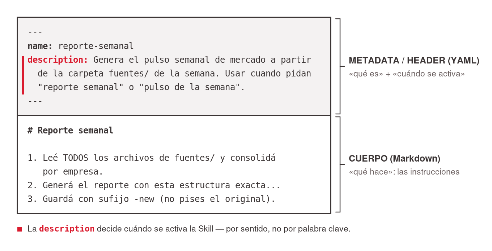
<!-- ascii-source:
+--------------------------------------------------------------+
| ---                                                          |  <-- METADATA / HEADER (YAML)
| name: reporte-semanal                                        |      "que es" + "cuando se activa"
| description: Genera el pulso semanal de mercado a partir     |
|   de la carpeta fuentes/ de la semana. Usar cuando pidan     |
|   "reporte semanal" o "pulso de la semana".                  |
| ---                                                          |
+--------------------------------------------------------------+
| # Reporte semanal                                            |  <-- CUERPO (Markdown)
|                                                              |      "que hace": las instrucciones
| 1. Leé TODOS los archivos de fuentes/ y consolidá           |
|    por empresa.                                              |
| 2. Generá el reporte con esta estructura exacta...          |
| 3. Guardá con sufijo -new (no pises el original).           |
+--------------------------------------------------------------+
-->
<!-- ascii-note:
intent: mostrar la anatomía de un SKILL.md — un bloque de metadata (YAML frontmatter: name + description) arriba y el cuerpo de instrucciones en Markdown abajo. Refuerza el beat de archivos .md/metadata de la sección Cowork.
emphasize: la separación visual en dos zonas — METADATA/HEADER (name, description; "qué es / cuándo se activa") vs CUERPO (las instrucciones; "qué hace"); que la `description` es lo que dispara la Skill.
labels: zona superior = metadata/header (YAML, name + description); zona inferior = cuerpo (instrucciones en Markdown); etiquetas laterales "cuándo se activa" y "qué hace".
-->

- La `description` activa la Skill por **sentido**, no por palabra clave.

### Sources

- corpus/agentic-ai-deck.zip.md — definición de Skill (SKILL.md con YAML frontmatter: name + description; "Description drives triggering — semantic, not keyword").
- "corpus/mision - auto.zip.md" — la Skill `reporte-semanal` (entrada `fuentes/`, consolida por empresa, estructura fija, sufijo `-new`).

### Speaker notes

Slide-ejemplo que aterriza dos cosas a la vez: la anatomía de una Skill y el beat de archivos `.md` + metadata de la sección 6. Mostrar el `SKILL.md` partido en dos zonas: arriba el header YAML entre `---`, con `name`, que identifica, y `description`, que decide cuándo se activa; abajo el cuerpo, Markdown común, los pasos que sigue el agente. El punto a fijar: el sistema lee la `description` para decidir si esta Skill aplica a tu pedido, por sentido y no por palabra clave. Usar `reporte-semanal` para que sea concreto. Mantenerlo alto nivel: es para que vean cómo se ve, no un tutorial de formato. Tiempo objetivo: ~3-4 min.

---

## 4. Subagentes: delegar en paralelo

### Content

- **Subagente** = asistente aislado, contexto propio; devuelve **un resumen** (no la transcripción).
- Regla de una línea: chico y visible → **Skill**. Grande o ruidoso → **Subagente**.
- En Cowork corren "por debajo", **varios en paralelo**.
- Se agrega como una Skill (descripción + instrucciones): pedíselo a Claude, o viene en un **Plugin**.

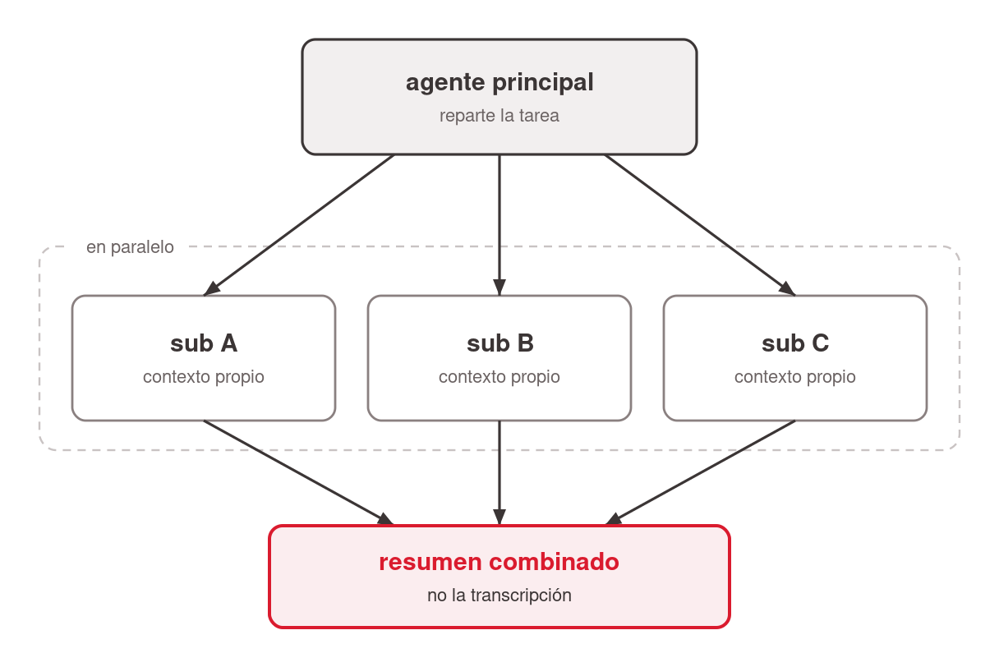
<!-- ascii-source:
                +------------------+
                | agente principal |
                +------------------+
                  /      |       \
                 v       v        v
          +--------+ +--------+ +--------+
          | sub A  | | sub B  | | sub C  |
          |contexto| |contexto| |contexto|
          |propio  | |propio  | |propio  |
          +--------+ +--------+ +--------+
                 \       |       /
                  v      v      v
                +------------------+
                | resumen combinado|
                +------------------+
-->
<!-- ascii-note:
intent: mostrar el patron fan-out/fan-in: el agente principal reparte una tarea entre varios subagentes que corren en paralelo con contexto propio, y junta los resultados en un resumen combinado.
emphasize: el paralelismo (tres subagentes a la vez) y que cada uno tiene contexto aislado; el resumen combinado al final.
labels: agente principal -> sub A / sub B / sub C (contexto propio) -> resumen combinado.
-->

### Sources

- corpus/agentic-ai-deck.zip.md — definición de Subagent (aislado, devuelve un resumen); "Skill vs Subagent" (slide 4.9 tabla); matriz 4.10 (Cowork ⚠️, under the hood); demo 4.8 (8 propuestas en paralelo).
- Claude Docs — Subagents: https://code.claude.com/docs/en/sub-agents — concepto general de subagente (un spec: cuándo usarlo + instrucciones).

### Speaker notes

Nivel avanzado, presentarlo como "para cuando crezcas". La distinción mental útil: si la sub-tarea es chica y querés verla, es una Skill; si es grande o ruidosa y querés que corra aparte sin ensuciar tu conversación, es un Subagente. El ejemplo del deck ilustra el fan-out: 8 propuestas de proveedores revisadas en paralelo por tres especialistas, con tabla combinada al final. Cómo se agrega, en paralelo a las Skills: un subagente se define con una descripción (cuándo usarlo) más instrucciones; le pedís a Claude que lo arme (se gestiona en Customize, igual que una Skill) o viene dentro de un Plugin. Mantenerlo alto nivel, sin rutas de archivos ni internals de persistencia. Tiempo objetivo: ~7 min.

---

## 5. Plugins: empaquetar y distribuir

### Content

- **Plugin** = la unidad de distribución: empaqueta Skills + agentes + connectors en una instalación. *"Ship the whole thing."*
- En Cowork se instalan desde un **marketplace** en la GUI; lo que traen funciona en Chat y en Cowork.
- Dónde: marketplaces oficiales de Anthropic y de la comunidad.

### Sources

- corpus/agentic-ai-deck.zip.md — definición de Plugin ("Ship the whole thing"; "the way to get a skill into Cowork"); slide 4.5 (caveat de project-skills en Cowork); matriz 5.11 (Cowork ✓ GUI marketplace); slide 5.10 (marketplaces).

### Speaker notes

Cerrar el avanzado con la idea de empaquetado: cuando un workflow madura (varias skills, connectors, agentes, incluso hooks y MCP), un Plugin lo vuelve instalable de una. El punto para Cowork: la forma robusta de distribuir una skill o un agente a otros es dentro de un plugin. Para usar una Skill en Cowork la habilitás como skill de usuario (Customize → Skills) o la recibís dentro de un plugin, y los plugins distribuidos aparecen en Chat y en Cowork. Mencionar los marketplaces oficiales (`anthropics/claude-plugins-official`, `anthropics/knowledge-work-plugins`) y los de la comunidad. Recordar el mapa: Plugins es la banda que envuelve todos los bloques de la charla. Tiempo objetivo: ~6 min.

---

## 6. Plugins en una cuenta Team

### Content

- En Team/Enterprise, los **Owners** gestionan los plugins de la org (Organization settings → Plugins).
- El ciclo, punta a punta:

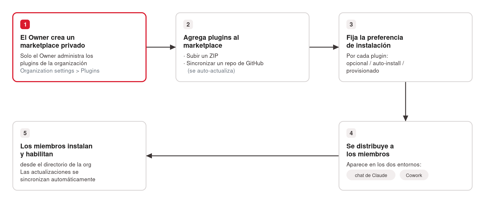
<!-- ascii-source:
+-----------------+     +------------------------+     +----------------------+
| OWNER crea un   | --&gt; | agrega plugins:        | --&gt; | fija preferencia de  |
| marketplace     |     | · subir ZIP            |     | instalacion por      |
| privado (org)   |     | · sync repo GitHub     |     | plugin (opcional /   |
|                 |     |   (auto-actualiza)     |     | auto-install / prov.)|
+-----------------+     +------------------------+     +----------------------+
                                                                  |
                                                                  v
+---------------------------+     +-----------------------------------------+
| MIEMBROS instalan/        | <-- | se DISTRIBUYE a los miembros            |
| habilitan desde el        |     | (aparece en chat Y en Cowork)          |
| directorio de la org      |     |                                         |
| (updates se sincronizan)  |     |                                         |
+---------------------------+     +-----------------------------------------+
-->
<!-- ascii-note:
intent: mostrar el ciclo de vida de un plugin en una cuenta Team/Enterprise — del Owner que crea un marketplace privado a los miembros que lo instalan, con updates que se sincronizan.
emphasize: el rol del OWNER (marketplace privado: subir ZIP o sync GitHub) y la preferencia de instalación por plugin; que se distribuye a chat Y a Cowork; que los miembros instalan desde el directorio y las actualizaciones se sincronizan solas.
labels: flujo de 5 pasos — Owner crea marketplace privado -> agrega plugins (ZIP / sync GitHub) -> fija preferencia de instalación (opcional/auto-install/provisionar) -> distribución (chat + Cowork) -> miembros instalan/habilitan (updates sincronizan).
-->

### Sources

- Anthropic Support — Manage Claude Cowork plugins for your organization: https://support.claude.com/en/articles/13837433-manage-claude-cowork-plugins-for-your-organization — Owners gestionan plugins en Organization settings; marketplace privado (ZIP o sync GitHub); preferencia de instalación por plugin.
- Anthropic Support — Use plugins in Claude: https://support.claude.com/en/articles/13837440-use-plugins-in-claude — miembros instalan/habilitan desde el directorio; updates sincronizan; disponibles en chat y Cowork.
- Claude blog — Cowork plugins across the enterprise: https://claude.com/blog/cowork-plugins-across-enterprise — distribución de plugins a nivel organización (chat + Cowork).

### Speaker notes

Slide de cierre del bloque avanzado, orientada a quien algún día administre una cuenta de equipo. En una cuenta Team, un Owner puede armar un marketplace privado de la organización y repartir workflows a todo el equipo. Recorrer el ciclo con el diagrama: el Owner crea el marketplace y sube plugins (ZIP o, mejor, sincronizando un repo de GitHub que auto-actualiza), fija cómo se instala cada uno (opcional / auto-install / provisionado), el plugin se distribuye y aparece en chat y en Cowork, y los miembros lo habilitan desde su directorio con las actualizaciones sincronizadas. Mantenerlo alto nivel: es el "para cuando esto escala a un equipo". Tiempo objetivo: ~4 min.

---

# Conclusions

## 1. El loop completo de Atlas

### Content

- Todas las piezas de hoy, enganchadas en un solo loop:


<!-- ascii-source:
Lunes 8:00
   |
   v
[Schedule] dispara
   |
   v
[Skill buscar-accion] --(Connector MT Newswires + web_fetch Yahoo)--&gt; guarda fuentes/
   |
   v
[Skill reporte-semanal] consolida --&gt; reporte .md en el Project
   |
   +--&gt; [Connector Gmail] deja borrador para el equipo
   |
   v
[Skill publicar-tablero] --&gt; Live Artifact pulso-semanal-FECHA (pestaña Live artifacts)
-->
<!-- ascii-note:
intent: mostrar el loop completo de la mision Atlas, encadenando todas las piezas vistas en la charla, disparado por Schedule cada lunes.
emphasize: la secuencia de izquierda a/arriba-abajo Schedule -> Skills -> Connectors -> Live Artifact; que todo arranca de un solo disparador.
labels: pasos del loop (Schedule, buscar-accion, reporte-semanal, Gmail, publicar-tablero) y las piezas usadas en cada uno.
-->

- Lo que el loop no dibuja y lo sostiene: las **Instrucciones** (el contrato), el **Project** con su carpeta (el lugar fijo) y los archivos `.md` (el material). **Subagentes** y **Plugins**, para cuando esto crezca.

### Sources

- "corpus/mision - auto.zip.md" — "el loop completo (Cowork version)".

### Speaker notes

Cierre integrador: recorrer el diagrama para que vean cómo cada pieza engancha con la siguiente. Un solo disparador, el lunes a las 8:00, y el resto cae solo. Repasar en una línea lo que se ve: Schedule dispara, las Skills hacen el trabajo, los conectores traen y entregan, el Live Artifact publica. Y nombrar lo que no se ve y lo sostiene: las Instrucciones que escribieron una vez, el Project con su carpeta, y los `.md` donde vive todo. Tiempo objetivo: ~3 min.

---

## 2. La idea para llevarse

### Content

- **El arco de hoy:** el chat que responde de memoria → conectores → tareas programadas → Cowork (qué cambia, tu espacio, trabajar y entregar) → piezas avanzadas.

- *"Todo lo que le explicás a Claude dos veces es una Skill que deberías escribir una vez."*

- ¿Qué tarea recurrente le delegarías a tu propio Atlas?

### Sources

- corpus/agentic-ai-deck.zip.md — "Anything you explain to Claude twice is a skill you should write once" (slide 7.3).
- "corpus/mision - auto.zip.md" — gancho de cierre.

### Speaker notes

Recordar el arco en una línea: el chat que ya usaban y respondía de memoria, los conectores, las tareas programadas, el salto a Cowork, las piezas avanzadas. Después la frase ancla y el gancho, dicho en voz alta: "Acaban de automatizar un reporte que les iba a comer la mañana de cada lunes. ¿Qué otra tarea recurrente podrían delegarle a su propio Atlas?". Dejar la pregunta en el aire. Queda una lámina más, la de gobernanza, y ahí sí Q&A. Tiempo objetivo: ~2 min.

---

## 3. Gobernanza y advertencias

### Content

- **Sin audit trail**: con información de clientes, datos financieros, PII o material bajo NDA, nada de esto. Cowork no es la herramienta.
- **Toda salida es un borrador**: verificá cifras, citas y afirmaciones contra la fuente.
- **Reproducibilidad:** mantené juntos prompt + entradas + salidas, para que el trabajo sea auditable.
- **Capas de guardarraíles:** permisos de carpeta → reglas en Instrucciones → solo plugins verificados → revisión humana.

### Sources

- corpus/agentic-ai-deck.zip.md — slide 7.2 (Governance & verification, verbatim); "No audit trail in Cowork."

### Speaker notes

Slide de cierre responsable, breve y obligatoria. Para esta audiencia de gestión, decirlo sin vueltas: Cowork sirve para trabajo recurrente de oficina y NO para datos de clientes, información financiera ni nada regulado o bajo NDA, porque no tiene audit trail. Aplica igual a dónde lo pegás: elegir mal la superficie es el mismo error. Recordar que toda salida es un borrador que hay que verificar, lo mismo que enseñó la sección 1: el modelo puede alucinar, el conector cita fuentes, el humano verifica. Leer los guardarraíles de afuera hacia adentro: la carpeta concedida marca el límite, las Instrucciones marcan las reglas, los plugins verificados marcan de quién te fiás, y al final siempre hay un humano. Dejar esto antes de abrir Q&A. Tiempo objetivo: ~3 min.

---

# Open questions

- ~~Fecha de la clase sin confirmar~~ — resuelto 2026-07-14: `date: Julio 2026`.
- Imágenes diferidas (Phase 2 del librarian no corrida): las imágenes citadas desde el corpus (`screenshot-cowork-tab.png` en slide 5.2, `mockup-tablero.png` en slide 6.5) provienen de registros con `<!-- pending: process_images -->`. Las imágenes existen en disco y se referencian; re-verificar depiction/relevance tras correr librarian Phase 2. *(Renumeradas desde 4.5 / 4.12 en round 8, al partirse la sección 4; desde 5.1 / 5.8 al partirse la sección 5; y `mockup-tablero.png` desde 6.4 al partirse esa lámina en 6.4 + 6.5.)*
- Slides 5.1 (Demo time) y 5.2 (La interfaz de Cowork) citan pending stub corpus/agentic-ai-deck.zip.md — re-verify after librarian Phase 2. *(Las dos mitades de la ex 5.1 / ex 4.5 citan el mismo registro.)*
- Slide 6.5 "El tablero de Atlas" (ex 6.4 mitad B / ex 5.8 / ex 4.12) cita pending stub "corpus/mision - auto.zip.md" (mockup-tablero) — re-verify after librarian Phase 2.
- Falta la carpeta `skills/` con los tres skills pre-armados (`reporte-semanal`, `buscar-accion`, `publicar-tablero`) en el export — confirmado por el librarian en Step 3. No se inventa su contenido. Si la clase incluye una demo en vivo de las skills ya armadas, confirmar con el presentador si las tiene aparte.
- Vigencia de features vs docs oficiales: fechas/versiones (Live Artifacts abril 2026, planes pagos, etc.) son point-in-time; re-verificar contra docs oficiales antes de presentar.
- ~~**Slide 5.1 (ex 4.5) — interacción pipeline del banner DEMO TIME**~~ — **RESUELTO en round 8 (2026-07-15), opción (a):** la slide se partió en 5.1 "Demo time" (banner ASCII solo, sin image ref) y 5.2 "La interfaz de Cowork" (`screenshot-cowork-tab.png`). Al no compartir lámina con una imagen, el banner vuelve a ser el único bloque ASCII de su slide y el pipeline de Polish lo trata como render-driving: el ilustrador lo renderiza en Step 6.
- ~~**Interacción pipeline del ASCII archivado en `# Cut material` (round 8)**~~ — **RESUELTO en round 8 (2026-07-15):** aplicado el fix recomendado; la fence del diagrama ANTES/AHORA archivado se re-etiquetó de ```ascii a ```text. Cero bytes del ASCII cambiaron; `polish-ascii scan` (que detecta por tag) ya no lo levanta como diagrama huérfano sin slide contenedora.
- **Cross-refs stale tras la renumeración de rounds 8** (sección 4 partida en 4/5/6; ex-sección 5 "Advanced" → 7). Estado tras el dispatch final (Conclusions + Agenda + Thesis), que barrió el deck entero por grep:
  - ~~`Agenda` → **Narrative arc**: el "(4)" enumera interfaz, Instrucciones, Projects, `.md`, Schedule y Live Artifacts, que hoy se reparten entre las secciones 4, 5 y 6~~ — **RESUELTO en round 8 (2026-07-15), dispatch final:** arco reescrito para las 7 secciones; el salto a Cowork se cuenta en tres tiempos, uno por sección (4 / 5 / 6). Los 7 bullets de la lista se verificaron contra los H1: presentes, contiguos y con texto idéntico.
  - ~~`Agenda` → **Sections**: falta la sección 6~~ — **RESUELTO en round 8 (2026-07-15):** agregada "- 6. Trabajar y entregar"; la lista ya no salta de 5 a 7.
  - ~~Conclusions.1 → recap de piezas y arco escritos para la estructura de 5 secciones~~ — **RESUELTO en round 8 (2026-07-15), dispatch final:** la lámina se partió; el recap de piezas (mitad A) se reemplazó por el complemento del diagrama y el arco (mitad B) se reescribió a las 7 secciones. De paso se corrigió un claim que la reestructura había dejado falso: "Live Artifacts (compartir)" contra la 6.4, que enseña con fuente oficial que hoy NO son compartibles.
  - ~~Slide 4.5 ("Bloques que se apilan") → ASCII del mapa: el bloque `SKILLS / SUBAGENTES` dice `(avanzado, seccion 5)`; hoy es la sección 7~~ — **RESUELTO en round 8 (2026-07-15), última escritura a `draft.md` antes del freeze de Step 6:** corregido a `(avanzado, seccion 7)` en el ASCII. Se arregló en el draft y no en el render porque una etiqueta con el número de sección equivocado es un defecto de contenido de Step 4: el ilustrador nunca corrige contenido, así que un fix aguas abajo reaparecería en cada re-render. Sustitución de un carácter, mismo ancho: geometría intacta (28 líneas de caja × 84 caracteres, bordes sin mover). El `ascii-note` no citaba número de sección y no se tocó. **Ya no queda ningún cross-ref stale vivo en el deck**, ni en prosa ni dentro de un diagrama.
  - ~~Conclusions.1 → ASCII del loop de Atlas: verificar si referencia la estructura vieja~~ — **VERIFICADO en round 8 (2026-07-15), dispatch final: NO está stale.** El diagrama y su ascii-note nombran solo piezas y pasos del loop (Schedule, `buscar-accion`, MT Newswires, `reporte-semanal`, Gmail, `publicar-tablero`, Live Artifact), sin un solo número de sección ni de slide. No requiere pase del ilustrador. La 4.5 es el único ASCII con el problema.
  - ~~Slide 5.6 ("El panel de contexto") → Speaker notes: "Las tres capas de la lámina anterior"~~ — **RESUELTO en round 8 (2026-07-15), dispatch final:** ref doblemente rota tras la partición de la ex 5.4 (la lámina anterior es hoy 5.5, que no tiene tres capas; y las tres capas de 5.4 son otra terna). Corregida a "Las tres capas del contexto".
  - ~~Slide 6.1 (ex 5.5 / ex 4.9, "Archivos .md") → Content: "Vuelve con las Skills (sección 5)" y Speaker notes: "activación semántica, no por palabra clave; sección 5"~~ — **RESUELTO en round 8 (2026-07-15), dispatch de la sección 6:** las dos refs apuntan hoy a la sección 7 ("Advanced: Skills, Subagentes y Plugins").
  - ~~Slide 7.2 ("Anatomía de un SKILL.md") → Content: "Es el `.md` con metadata de la sección 4"~~ — **RESUELTO en round 8 (2026-07-15), dispatch de la sección 7:** corregido a "sección 6" en Content y en Speaker notes. La slide es hoy la **7.3** (la ex 7.1 se partió en 7.1 + 7.2).
  - ~~Slide 7.1 ("Skills") → Speaker notes: "Conectar con la sección anterior..."~~ — **RESUELTO en round 8 (2026-07-15) por la reestructura:** la sección anterior a la 7 es ahora la 6 "Trabajar y entregar", que sí contiene el beat `.md` (6.1 y 6.2). La ref volvió a resolver sin editar una sola palabra.
  - ~~Slide 3.1 ("Tareas programadas") → Speaker notes: "En la sección 4 vuelven, sobre carpetas y archivos reales" y Sources: "la forma Cowork (se desarrolla en la sección 4)"~~ — **RESUELTO en round 8 (2026-07-15), dispatch de la sección 6:** las dos refs apuntan hoy a la sección 6 "Trabajar y entregar", donde vive Schedule sobre tus carpetas (6.3).
  - ~~Slide 3.2 ("¿Dónde corre tu tarea?") → Speaker notes: "Anticipa la sección 4: las tareas de Cowork viven de tus carpetas"~~ — **RESUELTO en round 8 (2026-07-15), dispatch de la sección 6:** hoy sección 6. La ref inversa de 6.3 a la slide 3.2 se verificó y resuelve: la sección 3 no se renumeró.
  - Refs históricas dentro de `[closed]` (6.2 / 6.3 / 2.2 / 2.5 / 3.3 / 1.2 / 5.x) y en `# Cut material` (ex-slide 4.3, nueva 4.11, ex-slide 3.2, 4.9, 4.10, ex-slide 2.2): son registro de rounds pasados, no punteros vivos. **No se tocan** (audit trail append-only).
- Nuevas URLs externas (round 3) a re-verificar en Polish si se quiere snapshot/cita estable: support.claude.com (use-skills, create-custom-skills, schedule-recurring-tasks, use-live-artifacts, manage-org-plugins, use-plugins), claude.com/blog (cowork-plugins-across-enterprise), code.claude.com/docs (sub-agents).
- ~~URLs nuevas de round 4~~ — **RESUELTO en round 5 (2026-07-09):** las 6 citas se verificaron online. Resultados: web search 10684626 OK; ChatGPT search 9237897 OK (existencia+contenido corroborados vía búsqueda; el fetch directo da 403 por bloqueo anti-bot de help.openai.com); ChatGPT tasks OK con slug canónico corregido a `10291617-tasks-in-chatgpt`; directorio de conectores: claude.ai/directory requiere login → cita reemplazada por el anuncio oficial claude.com/blog/connectors-directory + support 11176164; custom connectors 11175166 OK; modelcontextprotocol.io OK.
- ~~Tareas programadas en el chat de Claude~~ — **RESUELTO en round 5:** claude.ai SÍ tiene tareas programadas en el navegador (observación de primera mano del presentador 2026-07-09 + release notes del 7 de julio de 2026, support article 12138966: corren en la nube sin dispositivo online, beta, rollout Max-first). Slide 3.1 actualizada con Claude como ejemplo de primera clase.
- **Capacidad ejecutiva por conector (slide 2.6), estado por acción:** Gmail-borrador verificado (corpus/misión); **Calendar-agendar VERIFICADO por el presentador (2026-07-09)**; tickets (Jira/ServiceNow) y mensajes (Slack) siguen presentados como capacidad del ecosistema (MCP/conectores lo permiten — fuentes oficiales citadas) sin verificación por conector puntual — no prometer demos en vivo de esos dos sin chequear antes.
- Claim "búsqueda web integrada en casi todos los chats" (slide 2.2): verificado citable para Claude y ChatGPT; Gemini se menciona de pasada sin fuente propia — agregar fuente oficial de Google o suavizar la mención al presentar.
- **Live Artifacts y el update del 7 de julio de 2026:** la locality de Live Artifacts ("viven en tu computadora, no compartibles aún") se RE-VERIFICÓ el 2026-07-09 contra support article 14729249 (actualizado recientemente) y sigue vigente pese a que las sesiones de Cowork ahora pueden correr remotas. Vigilar este punto: es el candidato más probable a quedar desactualizado con el rollout web/mobile.

# Cut material

- **ASCII "ANTES (chat) / AHORA (agente / Cowork)"** de la ex-slide 4.3, hoy 4.4 "El cambio de paradigma" (round 8): duplica la tabla Chatear vs Delegar, que cubre lo mismo con cuatro dimensiones en vez de dos. La lámina estaba sobre el techo de densidad (3 bullets + tabla + ASCII) y el ASCII era la versión pobre del contraste. — fuente: draft round 7, slide 4.3 "De chat a agente: el cambio de paradigma". Fuente del diagrama y su intención de render, preservadas verbatim:

```text
ANTES (chat)                    AHORA (agente / Cowork)
+----------+                    +------------------------+
| vos: msg | --> respuesta      | vos: "entrega X"       |
| vos: msg | --> respuesta      |        |               |
| vos: msg | --> respuesta      |        v               |
| vos: msg | --> respuesta      | agente: planifica      |
+----------+                    | agente: toca archivos  |
 paso a paso, lo hacés vos      | vos: leés y guiás      |
                                +------------------------+
                                 entregás un resultado
```
<!-- ascii-note:
intent: contrastar el modo "chat" (un mensaje a la vez, vos hacés cada paso) contra el modo "agente" (delegás un resultado, el agente planifica y ejecuta sobre tus archivos).
emphasize: la flecha de paradigma de izquierda (ANTES) a derecha (AHORA); que en AHORA el agente hace el trabajo y vos guiás.
labels: ANTES (chat) vs AHORA (agente / Cowork).
-->

- **Detalles internos de Claude Code** (Plan mode, slash commands completos, project-directory skills, config de `/agents`, dynamic workflows, las dos misiones hands-on basadas en Code, árboles `~/.claude/...`): fuera de foco por diseño de esta charla (companion funcional/alto nivel). Claude Code aparece solo como contraste en la sección de Cowork. — fuente: corpus/agentic-ai-deck.zip.md (Code-related slides preservadas pero marcadas fuera de foco).
- **Comparación detallada Cowork vs Codex** (las dos tablas y el re-solución completa de Codex): disponible en el corpus para un ángulo "vs la alternativa", pero excluida para no diluir el foco en *usar* Cowork. Podría incorporarse como un slide opcional si el presentador lo pide en Review. — fuente: "corpus/mision - auto.zip.md" (cowork-vs-codex).
- **`buscar-accion` con Claude in Chrome / web_fetch a Yahoo Finance** como tema técnico propio: mencionado de pasada en el loop completo (Conclusions) pero no desarrollado como slide, para mantener el nivel alto. — fuente: "corpus/mision - auto.zip.md" (M2).
- **Auto memory** como concepto separado: absorbido dentro de Projects (la memoria es una de las tres capas del Project) en lugar de un slide propio, para no fragmentar el básico. — fuente: corpus/agentic-ai-deck.zip.md (Auto memory 3.7).
- **Detalle mecánico del Schedule de Cowork** (round 4, al adelgazar la ex-slide 4.3 a la nueva 4.11 por decisión C2): los sub-bullets "Describís la tarea una vez; Claude guarda el prompt como las instrucciones de la tarea" y "Tiene los mismos poderes que una tarea normal: connectors, skills, plugins instalados", y el aparte explícito sobre agentes programados alojados en la nube como funcionalidad separada (conservado solo en Speaker notes). El concepto general de tarea programada ahora se enseña en la sección 3 (desde el chat). — fuente: draft round 3, slide 4.3 "Schedule: que Cowork trabaje solo".
- **Framing "sideway" de los archivos MD** (round 4): la ex-slide 3.2 "(Sideway) Archivos MD y metadata" dejó de ser un aparte y se expandió a un beat de enseñanza de dos slides dentro de la sección Cowork (4.9 "qué es un .md / cómo se lee" + 4.10 "trabajá en .md, exportá al final"); la nota original "esto es un sideway de alto nivel — es contexto, no el plato principal" se retiró porque el presentador lo promovió a contenido central. — fuente: draft round 3, slide 3.2.
- **Título/encuadre original del roadmap** (round 4): la ex-slide 2.2 "Los bloques de Cowork: cada problema, una pieza" codificaba el arco viejo (solo bloques de Cowork, empezando en "un prompt/chatear" como bloque de Cowork). Reescrita como 4.4 "El mapa de la charla: bloques que se apilan" con el arco nuevo (chat → conectores → tareas programadas → Cowork → avanzado) y marcadores "(visto)" / "estamos acá". Los pares problema↔bloque originales de Instrucciones/Projects/Skills/Connectors/Schedule/Live Artifacts se conservan (reformulados) en el diagrama nuevo. — fuente: draft round 3, slide 2.2.
