# Thesis

**Claim:** En la clase anterior el chat quedó extendido: conectores para que vea el mundo real y Schedule para que trabaje solo. Esta clase da el salto siguiente, Claude Cowork, donde ese mismo agente baja a la computadora y trabaja sobre carpetas y archivos reales. Eso cambia la forma de trabajar: el usuario delega resultados completos combinando sus piezas (archivos `.md`, Projects, Instrucciones, Skills y Subagentes) sin escribir una línea de código.

**Why it matters:** Un agente se vuelve útil en el trabajo real cuando se le delega un resultado y se guía su proceso, en vez de chatearle un mensaje por vez. Quien domina esa forma de delegar automatiza horas de trabajo manual con la barrera de entrada en cero. La clase asume el chat extendido como punto de partida y no vuelve sobre él: arranca donde terminó la anterior.

---

# Agenda

**Narrative arc:** La clase arranca donde terminó la anterior, con el chat ya extendido por conectores y Schedule, y da el salto grande de una: Claude Cowork instalado en la computadora, trabajando sobre carpetas y archivos reales. La primera sección ubica ese salto: Cowork como herramienta de propósito general del knowledge worker, con la analogía del Excel como habilidad base de la oficina; el cambio de rol de chatear a delegar un resultado, el mapa de piezas que se apilan y el primer contacto con la interfaz sobre una captura anotada de la app (1). De ahí las piezas se recorren una por una, en el orden en que se apilan. Los archivos `.md` primero, porque son el formato en el que la IA lee, edita y entrega. La sección abre con el porqué, que lo que hay en una carpeta de trabajo es conocimiento e instrucciones y le hace falta un formato que la máquina lea bien, sigue con qué es un `.md`, mostrando el mismo archivo lado a lado como texto plano y ya formateado, y cierra con el hábito de iterar sobre `.md` —el trabajo con la IA son muchas vueltas y ahí es donde salen baratas— y exportar recién al final (2). Después el espacio de trabajo: qué agrupa un Project, cómo se le concede una carpeta real del disco con el explorador del sistema, dónde vive su contexto, qué hace la herramienta con el material que hay adentro según cuánto sea, que con poco material lee todo y con mucho busca y trae los fragmentos que necesita, qué son las Instrucciones y dónde viven, en el panel de contexto de la interfaz, y un ejemplo completo que muestra cómo fijan de una vez el comportamiento del agente adentro de ese espacio (3). Con el espacio armado llegan las Skills, la forma de enseñar una tarea una sola vez: qué es una Skill, cómo se usa una vez creada (tipeando `/` como comando, o dejando que Claude la reconozca por su descripción) y las tres formas de crearla, presentadas juntas en una lámina índice y después recorridas una por una, el panel de Habilidades, el prompt de un chat donde se describe la tarea y Claude arma la Skill, y la grabación de pantalla, el camino con la barrera más baja, donde alguien hace la tarea narrándola en voz alta; la trampa del Save es la compuerta común de los tres caminos de creación (4). La última pieza, ya de nivel avanzado, son los Subagentes, en dos láminas: para qué tipo de sub-tarea conviene delegar en paralelo y cómo aparecen en Cowork, coordinados por debajo y sin panel propio; y para quien quiera uno propio, de qué está hecho —un archivo `.md` con un encabezado corto, donde la descripción vuelve a ser el disparador— y por qué en Cowork lo que lo hace durar es empaquetarlo en un plugin (5). Después de las cinco piezas viene el cierre, en dos láminas: un wrap-up que nombra el cambio de rol, engancha las piezas de las dos clases y deja una consigna concreta para la semana, y las advertencias de gobernanza. Con la charla ya cerrada, la última lámina es la placa divisoria que manda a resolver la parte 2 de la misión de Faro, el analista de mercado virtual de Atlas, ya en Cowork y sobre la carpeta real del equipo, sin exigir la parte 1 resuelta (6). La clase termina ahí, en la consigna de la misión, con Q&A abierto sobre esa placa.

**Sections (in delivery order):**

- 1. Claude Cowork
- 2. Knowledge & Output
- 3. Projects
- 4. Skills
- 5. Subagentes
- Conclusions (va antes de la Sección 6: las conclusiones cierran la charla)
- 6. La misión · parte 2 (última: después de la misión termina la clase)

---

# 1. Claude Cowork

**Goal of this section:** El salto grande de la charla. Cowork es Claude instalado en la computadora, trabajando sobre carpetas y archivos reales; eso cambia la forma de trabajar. Ubica el superpoder de Cowork como herramienta de propósito general, el paso de chatear a delegar resultados, el mapa de piezas que se apilan y el primer contacto con la interfaz.

---

## 1. Cowork, de propósito general

### Content

- Cowork = Claude instalado en la computadora, trabajando sobre las carpetas y archivos del usuario.
- La **herramienta de propósito general del knowledge worker**. El "lenguaje de programación" es el español.
- Hay analistas que la llaman **"el nuevo Excel"**: la habilidad base del trabajo de oficina para los próximos años (encuadre de la industria, no de Anthropic).
- Anthropic: **"Claude Code para el resto de tu trabajo"**.

<!-- generate-image: right | el salto de escala del trabajo de oficina cuando la herramienta deja de ser un accesorio y pasa a ser la base -->

### Sources

- corpus/agentic-ai-deck.zip.md, posicionamiento Cowork vs Claude Code ("Same engine. Different surface."; Cowork = la cara para knowledge workers sin terminal; slide 7.1 "Claude Code vs Cowork — the close").
- Anthropic, Claude Cowork (product page): https://www.anthropic.com/product/claude-cowork; encuadre oficial: Cowork como "Claude Code para el resto de tu trabajo"; construido sobre las mismas bases que Claude Code.
- Claude blog, Cowork research preview ("Claude Code power for knowledge work"): https://claude.com/blog/cowork-research-preview; la ambición de llevar el poder de Claude Code al trabajo del conocimiento; Cowork generaliza un éxito probado primero con developers.
- CNBC, Anthropic's Claude Cowork targets the office worker: https://www.cnbc.com/2026/02/24/anthropic-claude-cowork-office-worker.html; encuadre de público general / office worker.
- "Claude Code is the New Excel" (ensayo de analista): https://nextword.substack.com/p/claude-code-is-the-new-excel; origen de la analogía del "nuevo Excel" (atribuir AQUÍ, NO a Anthropic).

### Speaker notes

El beat de "¿y a mí por qué me importa?". Cowork es Claude instalado en la computadora, con acceso a las carpetas y archivos del usuario; eso habilita una forma de trabajar distinta de la del chat. En la clase anterior la audiencia extendió un chat; esta slide anuncia otra categoría de herramienta. Tono motivacional y de alto nivel; la mecánica viene después.

El gancho de la analogía del Excel va acá, dicho con cuidado. Durante unas cuatro décadas Excel fue la habilidad base del trabajo de oficina, la herramienta de propósito general que se usaba sin escribir código. Varios analistas sostienen que las herramientas agénticas van camino a ese mismo lugar, Claude Code para quien programa y Cowork para quien no. Atribuirlo cada vez que se dice: "hay quien lo llama el nuevo Excel" es encuadre de analistas y de la industria, NO de Anthropic.

Lo que sí es de Anthropic, y conviene citarlo como su framing propio, es "Claude Code para el resto de tu trabajo": que cualquier knowledge worker sienta con Cowork lo que los ingenieros ya sienten con Claude Code. Cowork generaliza algo que ya funcionó primero con developers.

Aterrizarlo en la audiencia: son alumnos de management y la mayoría no programa; por eso Cowork les sirve. Después de este beat viene la mecánica, cómo se delega. Tiempo objetivo: ~3 min.

---

## 2. De chatear a delegar

<!-- template: value-columns -->
<!-- layout: image-left -->
<!-- Desde el plugin 0.75.0 esta lámina ya no tiene que elegir. `value-columns` (el ex
     `comparison`, renombrado sin alias) acepta `image`, `layout` y `lead`, así que la tabla
     chatear/delegar se renderiza como GRILLA de dos columnas alineadas —que es lo que la
     lámina enseña— y el diagrama va a la izquierda.
     Historia, para que nadie lo revierta: hasta 0.74.1 `comparison` no tenía ranura de
     imagen, así que acá estaba pineado `content+cards+image` y cada fila de la tabla
     colapsaba a una tarjeta con las dos columnas concatenadas dentro del mismo `body`.
     La grilla al lado de una imagen quiere <=3 columnas x <=5 filas: esta es 3 x 4, entra.
     RECOMENDACIÓN para el FILL: la bajada "Lo que cambia ahora es el rol" es el `lead`.
     La lámina NO lleva `highlights`: el presentador sacó de la cara la cita de Anthropic
     ("menos una sesión de chat, más asignarle tareas a un colega") el 2026-08-01. Sigue
     viva en Sources y en las speaker notes, para decirla al cerrar — no la devuelvas
     a la lámina. -->

### Content

-  Lo que cambia ahora es el rol: **delegar**. ¿Qué delegamos?. Chatear vs delegar:

| | Chatear | Delegar a un agente |
|---|---|---|
| La forma de trabajo | Un mensaje a la vez | Se describe un resultado |
| Los pasos | Los hace la persona | El agente planifica y ejecuta |
| La salida | Texto en la ventana | Archivos en el disco |
| El rol humano | Hacer cada paso intermedio | Revisar el plan y corregir el rumbo |

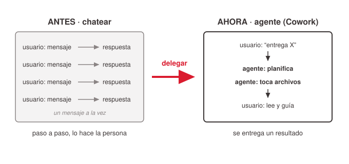
<!-- ascii-source:
ANTES (chat)                    AHORA (agente / Cowork)
+----------+                    +------------------------+
| vos: msg | --&gt; respuesta      | vos: "entrega X"       |
| vos: msg | --&gt; respuesta      |        |               |
| vos: msg | --&gt; respuesta      |        v               |
| vos: msg | --&gt; respuesta      | agente: planifica      |
+----------+                    | agente: toca archivos  |
 paso a paso, lo hacés vos      | vos: leés y guiás      |
                                +------------------------+
                                 entregás un resultado
-->
<!-- ascii-note:
intent: contrastar el modo "chat" (un mensaje a la vez, vos hacés cada paso) contra el modo "agente" (delegás un resultado, el agente planifica y ejecuta sobre tus archivos).
emphasize: la flecha de paradigma de izquierda (ANTES) a derecha (AHORA); que en AHORA el agente hace el trabajo y vos guiás.
labels: ANTES (chat) vs AHORA (agente / Cowork).
-->

### Sources

- corpus/agentic-ai-deck.zip.md, "Stop prompting. Start delegating." (slide 2.3 the reframe); tabla "Chatting vs Delegating" (slide 3.16).
- "corpus/mision - auto.zip.md", "el verdadero premio no es Atlas: sos vos, dominando Claude Cowork"; "Conversá, no programes."
- Anthropic, Claude Cowork (product page): https://www.anthropic.com/product/claude-cowork; refuerza el paradigma: trabajar con Cowork "se parece menos a una sesión de chat y más a asignarle tareas a un colega".
- (técnico, opcional) Anthropic Engineering, Building agents with the Claude Agent SDK: https://www.anthropic.com/engineering/building-agents-with-the-claude-agent-sdk; por qué el loop plan→ejecutar→guiar define a un agente frente a un chat.

### Speaker notes

El concepto-ancla de la charla. En la clase anterior, los conectores y Schedule extendieron qué puede hacer el chat; el agente cambia tu rol: en vez de pedir un paso intermedio, se describe un resultado completo que el agente planifica y ejecuta sobre archivos reales mientras vos supervisás. La lámina deja abierta la pregunta "¿qué delegamos?"; contestarla con la tabla y con un ejemplo concreto de ellos, el informe mensual del equipo entero. Pedir un dato suelto sigue siendo chat. Si se llevan una sola idea, que sea esta: el valor está en aprender a delegar un resultado y guiar el proceso. Usar la tabla para hacerlo concreto: la salida son archivos en el disco, no texto en una ventana. Anticipar la misión: vamos a "contratar" a Faro y entrenarlo una vez para que después trabaje solo. Cerrar citando a Anthropic: "menos una sesión de chat, más asignarle tareas a un colega". Tiempo objetivo: ~4 min.

---

## 3. El mapa: piezas que se apilan

<!-- RECOMENDACIÓN para el FILL: la línea "Idea clave" es el `lead` de la lámina —
     INTRODUCE el diagrama, no lo comenta. No mandarla a `highlights` (en el render del
     2026-07-31 se fue a la banda de abajo y dejó la caja de arriba vacía). El plugin 0.72.0
     ya trae esta regla en la guía de FILL; el hint queda como refuerzo. -->

### Content

**Idea clave:** cada bloque resuelve un problema conocido y se apila sobre el anterior; cada tarea usa solo los que necesita.

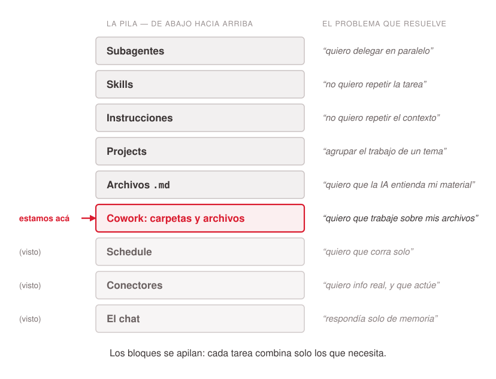
<!-- ascii-source:
   +----------------------+  "quiero delegar en paralelo"
   | SUBAGENTES           |
   +----------------------+
   +----------------------+  "no quiero repetir la tarea"
   | SKILLS               |
   +----------------------+
   +----------------------+  "no quiero repetir el contexto"
   | INSTRUCCIONES        |
   +----------------------+
   +----------------------+  "agrupar el trabajo de un tema"
   | PROJECTS             |
   +----------------------+
   +----------------------+  "quiero que la IA entienda mi material"
   | ARCHIVOS .MD         |
   +----------------------+
   +----------------------+  "quiero que trabaje sobre mis archivos"   <== ACA
   | COWORK: carpetas     |
   +----------------------+
   +----------------------+  "quiero que corra solo"                   (visto)
   | SCHEDULE             |
   +----------------------+
   +----------------------+  "quiero info real + que actue"            (visto)
   | CONECTORES           |
   +----------------------+
   +----------------------+  "respondia solo de memoria"               (visto)
   | EL CHAT              |
   +----------------------+

   los bloques se apilan: cada tarea combina solo los que necesita
-->
<!-- ascii-note:
intent: presentar el arco completo de las dos clases como bloques que se apilan (no una pirámide/escalera estricta): el chat (base) -> conectores -> Schedule -> Cowork (carpetas/archivos) -> archivos .md -> Projects -> Instrucciones -> Skills -> Subagentes. Los tres bloques de abajo son los de la clase anterior y están marcados "(visto)"; el bloque Cowork lleva el marcador "estamos acá".
emphasize: el marcador "<== ACÁ" en el bloque Cowork; los "(visto)" en chat/conectores/Schedule, que son de la clase anterior; el par bloque↔problema en cada nivel.
labels: bloques apilados (base→cima): El chat · Conectores · Schedule · Cowork: carpetas · Archivos .md · Projects · Instrucciones · Skills · Subagentes, cada uno con su frase-problema a la derecha.
-->

### Sources

- corpus/agentic-ai-deck.zip.md, progresión de building blocks del deck (Instrucciones → Projects → Skills → Connectors/MCP); la idea de "pila" es la lectura ordenada de esa progresión, re-secuenciada al arco chat-primero de esta charla.
- "corpus/mision - auto.zip.md", la misión Atlas arma estas piezas una por una.

### Speaker notes

El mapa del arco completo, que empieza antes de esta clase: la base es el chat que la audiencia ya usa. La lámina es el diagrama y una línea de lead destacada, así que todo lo demás va hablado. Esa línea es la moraleja del mapa y conviene leerla en voz alta apenas aparece la lámina, antes de recorrer los bloques. La lectura en voz alta es bloque por bloque, cada uno con su frase-problema al lado. La mitad de abajo es la clase anterior y la de arriba lo que queda por recorrer, y ese corte conviene nombrarlo de entrada. De abajo hacia arriba, los tres que trajimos de la clase anterior: el chat respondía solo de memoria, los conectores traen información real y actúan, Schedule hace que corra solo. Un repaso de una línea por bloque alcanza; no volver a enseñarlos. Señalar "estamos acá": Cowork, donde la IA empieza a trabajar sobre carpetas y archivos reales. Los cinco de arriba son el roadmap de esta clase y cada uno tiene su sección: archivos `.md` para que la IA entienda el material (sección 2), Projects para agrupar el trabajo de un tema e Instrucciones para no repetir el contexto (sección 3), Skills para no repetir la tarea (sección 4) y Subagentes para delegar en paralelo (sección 5). Cuidado con la metáfora: los bloques se apilan y se combinan, cada tarea usa solo los que necesita. Decir que pueden volver a esta slide entre secciones para ubicarse. Al final, la pila entera es Faro. Tiempo objetivo: ~3 min.

---

## 4. Dónde se empieza en Cowork

<!-- Lámina de IMAGEN SOLA, por pedido del presentador ("solo dejá la imagen, no pongas el
     texto"): sin `lead` y sin `facts`, todo el recorrido va hablado sobre la captura.
     Desde el plugin 0.72.0 esta forma es de primera clase — `content-image` sin texto no
     emite la columna vacía y la imagen ocupa el ancho completo. NO forzarla a `image-grid`
     (ese parche se usó en el render del 2026-07-31 y ya no hace falta). -->

### Content


### Sources

- Captura propia de los presentadores (`images/cowork.png`, 2026-07-31): la ventana de Claude Desktop en su versión actual, con `+ New`, el toggle `Chat` / `Cowork` y el selector `Project or folder` circulados a mano.
- corpus/agentic-ai-deck.zip.md, slide 3.19 (modelo de aprobación de Cowork); sostiene el beat de control, no los nombres de los modos de la versión actual de la app.

### Speaker notes

Primer contacto con la app. La lámina es la captura sola, así que todo el recorrido va hablado, señalando en pantalla. Los tres círculos marcan el orden en que se usa la interfaz. Primero **`+ New`**, arriba en la barra lateral, que abre la sesión. Después el toggle **`Chat` / `Cowork`** del compositor, que elige el modo de trabajo. Y tercero **`Project or folder`**, que concede la carpeta o el Project sobre el que Cowork va a trabajar. Ese tercer paso es el que engancha con todo lo anterior, porque es el momento en que Claude pasa a trabajar sobre archivos reales.

El cuarto elemento de esa fila es el **selector de modo**, donde se decide si el agente pide permiso en cada acción o corre solo, y ahí conviene ser prudente. Decir el beat de control sin comprometerse con el nombre del modo ni con cuál viene por defecto: la app viene cambiando y en esta captura dice `Auto`. Confirmar contra la app el día de la clase antes de decir nada más preciso.

La barra lateral tiene otras entradas que esta clase no cubre (Artifacts, Scheduled, Dispatch); mencionarlas al pasar solo si preguntan.

Opcional, si sobra tiempo o para el workshop: la carpeta `missions/CoWork/escritorio-del-pasante/` (Misión 0) sirve para mostrar esto vivo. Conceder la carpeta, pedir "¿qué hay acá y en qué estado está?" y un ordenamiento con renombres, aprobando cada acción (ejercicios 1 y 2 de intro-escritorio-pasante.md; 3 a 5 quedan para el workshop). La carpeta es regenerable por script. Fuera del presupuesto de tiempo de la lámina. Tiempo objetivo: ~2 min.

---

# 2. Knowledge & Output

**Goal of this section:** El rol central de los archivos .md en el trabajo con Cowork. Abre con el porqué, que lo que vive en una carpeta de trabajo es conocimiento e instrucciones y necesita un formato que la máquina lea bien; sigue con qué es un `.md`, mostrando el mismo archivo como texto plano y ya formateado, y cierra con por qué conviene iterar en ese formato, que es donde cada vuelta con la IA sale barata, y exportar al final al que pida el destinatario. Tres láminas.

---

## 1. Qué lee el agente en la carpeta

### Content

- Delegar un resultado significa que el agente trabaja sobre la carpeta. **Lee** el material que hay ahí y **escribe** ahí mismo sus entregables y sus notas.
- Y lo que hay en la carpeta es, casi siempre, **conocimiento e instrucciones**. Notas, material de referencia, cómo se hace acá cada tarea.
- Ese material necesita un formato pensado para que **lo lea la máquina**. Las apps de notas están hechas para lectura humana.

> **Nota.** El **"LLM wiki"** de Andrej Karpathy guarda el conocimiento propio en archivos `.md` estructurados que el modelo consulta directo. https://www.mindstudio.ai/blog/andrej-karpathy-llm-wiki-knowledge-base-claude-code

### Sources

- MindStudio (blog del equipo, 6 de abril de 2026), post sobre el "LLM wiki" de Andrej Karpathy: https://www.mindstudio.ai/blog/andrej-karpathy-llm-wiki-knowledge-base-claude-code (verificado 2026-07-31). El post es de MindStudio y RECOGE la propuesta de Karpathy; no es un texto de él, así que la idea se nombra pero no se le atribuye una cita textual. Argumentos de formato que aporta: Markdown es portable y no propietario, los modelos lo leen de forma nativa, obliga a estructurar con claridad y no ata a ninguna plataforma; funciona sin base de datos vectorial ni embeddings. La línea aprovechable es que un wiki así está optimizado para que el modelo lea en tu nombre, a diferencia de las apps de notas, hechas para lectura humana.
- corpus/agentic-ai-deck.zip.md, "Markdown is the lingua franca"; el material y la configuración del mundo LLM son texto plano.
- `missions/CoWork/mission.md`, "la herencia del pasante en `reportes/`": la carpeta con la que arranca la parte 2 son notas y material de referencia en crudo, el caso concreto de lo que esta lámina describe.

### Speaker notes

La bisagra entre el cambio de rol y la mecánica. La audiencia ya sabe que delega un resultado; falta decir sobre qué trabaja el agente mientras lo hace. La respuesta es la carpeta, y lo que hay en una carpeta de trabajo casi nunca son datos sueltos: son notas, material de referencia y procedimientos, o sea conocimiento e instrucciones. Ese es el punto que justifica las tres láminas que siguen, así que conviene decirlo despacio.

Insistir en que la carpeta se usa en las dos direcciones. El agente lee lo que hay adentro para entender el trabajo, y también deja ahí lo que produce: el borrador, el informe consolidado, las notas que va tomando en el camino. La carpeta es el material de entrada y el lugar donde aparece la entrega, así que conviene elegirla pensando en las dos cosas.

De ahí sale la pregunta del formato. Un `.docx` está hecho para que lo lea una persona y el agente lo atraviesa perdiendo estructura por el camino. El `.md` es texto plano con marcas simples, que es lo que el modelo lee mejor.

La nota al pie de la lámina deja el encuadre que a esta audiencia le va a sonar, el "LLM wiki" de Karpathy: el conocimiento propio en archivos `.md` estructurados que el modelo consulta directo, sin base de datos vectorial ni embeddings de por medio. Nombrarla al pasar y no detenerse ahí; el link está proyectado para quien quiera el detalle después. Atribuirla bien si alguien pregunta, porque la propuesta es de él y el artículo que la desarrolla es del equipo de MindStudio. Tiempo objetivo: ~2 min.

---

## 2. Qué es un .md: el texto y lo que se ve

<!-- RECOMENDACIÓN DEL PRESENTADOR (2026-07-31), sin aplicar:
     usar acá el mismo estilo de lámina que "Un ejemplo de Instrucciones" (3.5),
     que renderiza como `code-example` — superficie de código monoespaciada.

     Para aplicarlo alcanza con pinear el template: un hint de autor `template:` con el
     valor `code-example`, en su propia línea de comentario debajo de esta (escrito acá
     sin los delimitadores a propósito, porque los comentarios HTML no anidan y cerraría
     este bloque antes de tiempo).

     ATENCIÓN ANTES DE APLICARLO: `code-example` tiene `code` + `explanation` y
     NO tiene ranura de imagen. Pinearlo tal cual **deja afuera el diagrama de dos
     paneles**, que es el contenido central de esta lámina: la mitad derecha, el
     archivo ya formateado, es lo que la lámina viene a mostrar. Una superficie de
     código sola muestra el `.md` crudo y nada más, o sea la lámina que esta reemplazó.

     REVISADO CONTRA EL PLUGIN 0.72.0: sigue sin haber un template que combine superficie
     de código con imagen. `code-example` mejoró (ya no emite el panel oscuro vacío y una
     sola columna colapsa a ancho completo), pero su contrato sigue siendo `code` +
     `explanation`, sin imagen. Así que la disyuntiva no cambió.

     Tres salidas posibles, a decidir con el presentador:
       (a) Pinear igual, asumiendo que la lámina pasa a ser solo el texto plano.
       (b) Partirla: una lámina `code-example` con el `.md` crudo y otra con el render.
           Es exactamente el precedente de 3.4 / 3.5 y de 5.2 / 5.3.
       (c) Dejar el diagrama como está y pedirle al plugin una variante de
           `content-image` con la columna de texto tratada como superficie de código
           (misma tipografía y fondo que `code-example`, conservando la imagen).
           Es el pedido más chico si lo que se busca es la ESTÉTICA de la 3.5 y no
           su estructura.
-->

### Content

- Un `.md` (Markdown) = **texto plano** + unas pocas marcas de estructura: `#` para títulos, `-` para listas, `**negrita**`, `|` para tablas.
- Se escribe y se lee con **cualquier editor de texto**, en cualquier computadora, sin formato propietario. Y la IA lo lee nativo: está entrenada para entender esas marcas.

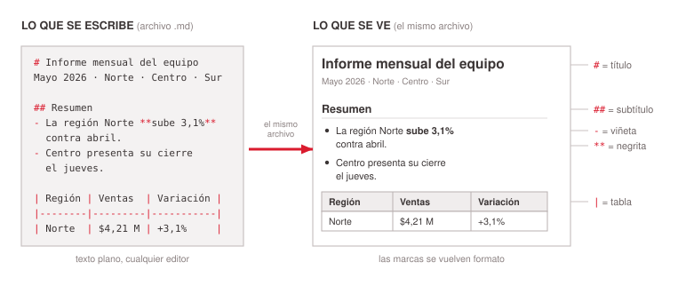
<!-- ascii-source:
  LO QUE SE ESCRIBE  (archivo .md)          LO QUE SE VE  (mismo archivo)
+----------------------------------+        +-----------------------------------+
| # Informe mensual del equipo     |        |  INFORME MENSUAL DEL EQUIPO       |  <- "#" = titulo
| Mayo 2026 · Norte · Centro · Sur |        |  Mayo 2026 · Norte · Centro · Sur |
|                                  |        |                                   |
| ## Resumen                       |        |  Resumen                          |  <- "##" = subtitulo
| - La region Norte **sube 3,1%**  |        |   • La region Norte sube 3,1%     |  <- "-" = viñeta
|   contra abril.                  |        |     contra abril.                 |  <- ** = negrita
| - Centro presenta su cierre      |  ==>   |   • Centro presenta su cierre     |
|   el jueves.                     |        |     el jueves.                    |
|                                  |        |                                   |
| | Region | Ventas  | Variacion | |        |  +--------+---------+-----------+ |
| |--------|---------|-----------| |        |  | Region | Ventas  | Variacion | |  <- "|" = tabla
| | Norte  | $4,21 M | +3,1%     | |        |  | Norte  | $4,21 M | +3,1%     | |
|                                  |        |  +--------+---------+-----------+ |
+----------------------------------+        +-----------------------------------+
  texto plano, cualquier editor             las marcas se vuelven formato
-->
<!-- ascii-note:
intent: presentar qué es un archivo .md mostrando el MISMO archivo dos veces, lado a lado: a la izquierda el texto plano tal como se escribe (con #, ##, -, ** y las barras de tabla visibles) y a la derecha ese archivo ya formateado en un visor de Markdown, unidos por una flecha en el medio.
emphasize: la equivalencia entre los dos paneles (es un solo archivo, no dos); las etiquetas laterales que conectan cada marca de sintaxis con el elemento visual que produce (# -> título, ## -> subtítulo, - -> viñeta, ** -> negrita, | -> tabla); la flecha central "==>".
labels: panel izquierdo = LO QUE SE ESCRIBE (archivo .md), pie "texto plano, cualquier editor"; panel derecho = LO QUE SE VE (mismo archivo), pie "las marcas se vuelven formato"; a la derecha del todo, la marca que genera cada elemento.
-->

- Además puede llevar arriba una **metadata (header YAML)** que declara *qué es* el archivo y *cuándo* usarlo. Vuelve con las Skills (sección 4).

### Sources

- corpus/agentic-ai-deck.zip.md, "Markdown is the lingua franca"; definición de Skill (SKILL.md con YAML frontmatter: name + description; "Description drives triggering — semantic, not keyword"), que sostiene el bullet de metadata.
- "corpus/mision - auto.zip.md", el reporte semanal de la misión como archivo `.md`; sirvió de molde para la forma del ejemplo. El ejemplo de la lámina es genérico (un informe mensual de equipo) y el caso de la misión se trata en la Sección 6.
- "corpus/mision - auto.zip.md", "mismo estándar SKILL.md" entre Cowork y Codex (Cowork vs Codex); sostiene que el formato es portable entre herramientas.

### Speaker notes

La sintaxis, después del porqué de la lámina anterior. La lámina contesta las dos preguntas de una: qué es un `.md` y qué pasa cuando se abre. El diagrama muestra el mismo archivo dos veces, un informe mensual de equipo cualquiera: a la izquierda tal como se escribe, a la derecha tal como se ve.

Recorrer la correspondencia de izquierda a derecha, rápido y sin detenerse en detalle fino de formato: un `#` marca el título, `##` un subtítulo, `-` una viñeta, los asteriscos la negrita y las barras verticales una tabla. La idea es que las marcas son pocas y se aprenden en minutos. Insistir en que es un solo archivo, no dos: nadie "convierte" nada, el visor interpreta las marcas.

Señalar que es texto plano, sin formato propietario: se abre con cualquier editor, en cualquier computadora, y el mismo estándar funciona entre herramientas. Por eso es portable y versionable, y por eso el modelo trabaja mejor así: cuanto menos formato opaco haya entre el contenido y el modelo, mejor. Si hay conexión, mejor en vivo: abrir el archivo en un visor de Markdown y alternar entre fuente y render.

La metadata (el header YAML entre `---`) es la etiqueta del frasco: dice qué es el archivo y cuándo usarlo. La `description` de una Skill cumple exactamente esa función, con activación semántica y no por palabra clave; se retoma en la sección 4. La próxima slide baja todo esto a la práctica: en qué formato conviene trabajar. Tiempo objetivo: ~3 min.

---

## 3. Iterar en .md, exportar al final

### Content

**Idea clave:** con la IA nada sale bien a la primera. El trabajo son **muchas vueltas** sobre el mismo archivo, y el `.md` es el formato donde esa vuelta sale barata.

- **Cada vuelta es un pedido chico** sobre el archivo que ya existe: *"sumá la región Sur"*, *"acortá el resumen a cinco líneas"*, *"poné la tabla antes del texto"*.
- En `.md` la IA **reescribe el archivo entero sin romper nada**, porque ve la estructura directa. En `.docx`/`.xlsx` cada vuelta atraviesa capas de formato y se degrada.
- Regla de bolsillo: *se itera en `.md` y se entrega en el formato que pida el destinatario.*
- El entregable se genera **una sola vez, al final**: `.docx`, PDF o slides salen de un único pedido cuando el trabajo ya está.

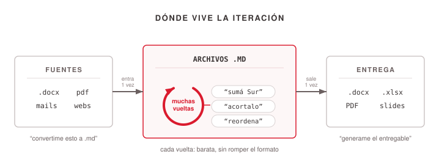
<!-- ascii-source:
   DONDE VIVE LA ITERACION

  fuentes                ITERACION                  entrega (1 vez,
  (lo que llega)         (muchas vueltas)           al final)
+--------------+     +---------------------+      +---------------+
| .docx  pdf   | --&gt; |    ARCHIVOS .MD     | --&gt;  | .docx  .xlsx  |
| mails  webs  |     |                     |      | PDF    slides |
+--------------+     |  <--+  "sumá Sur"   |      +---------------+
                     |     |  "acortalo"   |
  "convertime        |     +--  "reordena" |        "generame el
   esto a .md"       +---------------------+         entregable"
                       cada vuelta: barata,
                       sin romper el formato
-->
<!-- ascii-note:
intent: mostrar DONDE vive la iteración con la IA. Las fuentes (docx, pdf, mails, webs) entran una vez y se convierten a .md; TODAS las vueltas de trabajo (pedidos chicos y sucesivos sobre el mismo archivo) pasan adentro de la caja de los .md, marcada con una flecha que vuelve sobre sí misma; el formato final se genera una sola vez, a la salida.
emphasize: el bucle de la caja central (la flecha que retorna con los tres pedidos de ejemplo) como el corazón del diagrama — es lo que distingue esta lámina de un flujo lineal; el contraste entre las MUCHAS vueltas del centro y la UNA entrada y UNA salida de los costados.
labels: izquierda = fuentes (lo que llega), leyenda "convertime esto a .md"; centro = ARCHIVOS .MD con el bucle de iteración y los pedidos de ejemplo ("sumá Sur", "acortalo", "reordena"), pie "cada vuelta: barata, sin romper el formato"; derecha = entrega final (.docx/.xlsx/PDF/slides), leyenda "generame el entregable".
-->

### Sources

- corpus/agentic-ai-deck.zip.md, "Markdown is the lingua franca" (la configuración y el material del mundo LLM es texto plano; el modelo lee texto).
- "corpus/mision - auto.zip.md", el flujo de Atlas trabaja sobre archivos `.md` en el Project (reporte `.md` consolidado) y el entregable final se genera al último (borrador de mail, tablero); ahí se verificó el patrón. El ejemplo de la lámina es genérico y el caso de la misión se trata en la Sección 6.

### Speaker notes

La lámina de práctica de la sección, y el hábito concreto que se llevan. El beat que la sostiene es la iteración, no el trabajo en general: **con la IA nada sale bien a la primera**, y eso no es un defecto, es el modo de uso. Se pide, se lee lo que salió, se corrige, se vuelve a pedir. Decirlo de entrada y sin vergüenza, porque el que espera el resultado perfecto en el primer prompt se frustra y abandona.

De ahí sale la pregunta útil: si el trabajo son veinte vueltas, ¿sobre qué archivo conviene darlas? Esa es la lámina. Recorrer el diagrama en tres tiempos, cargando el peso en el del medio: el material entra **una vez** (primer pedido, "convertime esto a `.md`"), las vueltas pasan **todas** adentro de la caja de los `.md` —ahí está el bucle del dibujo— y el entregable sale **una vez**, al final.

Los pedidos de ejemplo del diagrama conviene decirlos en voz alta porque son el tipo de vuelta real: "sumá la región Sur", "acortá el resumen a cinco líneas", "poné la tabla antes del texto". Ninguno es un pedido grande; el trabajo se construye acumulando pedidos chicos sobre el mismo archivo.

El porqué técnico, en una frase: en texto plano la IA ve la estructura directa y reescribe el archivo entero sin romper nada; en `.docx` o `.xlsx` cada vuelta atraviesa capas de formato que agregan ruido y errores, y a la quinta vuelta el documento está sucio. La analogía que cierra: el `.md` es la mesa de trabajo y el `.docx`/PDF es la vitrina. Nadie construye dentro de la vitrina.

Aterrizarlo con el ejemplo de la sección: el informe mensual vive como `.md` en el Project mientras el trabajo sigue abierto, y el PDF que recibe el jefe sale de un único pedido al final. Aplica igual a lo que el agente recuerda: Instrucciones y memoria del Project también son texto plano. Este mecanismo se da por enseñado más adelante, cuando la placa de la misión (6.1) nombre su entregable. Tiempo objetivo: ~4 min.

---

# 3. Projects

**Goal of this section:** El espacio de trabajo de Cowork: qué agrupa un Project, cómo se le concede una carpeta real del disco, dónde vive su contexto, qué hace la herramienta con el material que hay adentro según cuánto sea (lee todo cuando es poco, busca y trae fragmentos cuando es mucho), qué son las Instrucciones y dónde viven en la interfaz, y un ejemplo completo que muestra cómo fijan de una vez el comportamiento del agente en ese espacio. Cinco láminas.

---

## 1. Qué es un Project

### Content

- Project = espacio de trabajo autocontenido: **carpeta propia + memoria + instrucciones**.
- Un ejemplo de oficina: **"Informe mensual del equipo"**, apuntado a la carpeta `Documentos/Informe-Mensual`.
- Tres capas persistentes: Instrucciones · Knowledge base · Chats.
- Los chats del Project **no comparten contexto entre sí** (solo la base de conocimiento).

**Nota:** Cowork trabaja la carpeta concedida con herramientas de archivo: abre, busca y escribe los archivos que la tarea necesita, en lugar de traer el contenido entero a la conversación.

### Sources

- corpus/agentic-ai-deck.zip.md, definición de "Project (Chat/Cowork)" (tres capas; chats no comparten contexto); "Working directory + permissions" (folder picker del sistema).
- Claude docs, "Desktop and filesystem access": https://claude.com/docs/cowork/3p/local-access (verificado 2026-07-31). Sostiene la nota al pie: "the agent can then read, create, and modify files anywhere inside those folders" y "The agent can read, write, and search files … with its file tools". La doc **no** habla de memoria ni de consumo de contexto, así que la nota describe el modelo de acceso por herramientas y no afirma ningún mecanismo interno.
- "corpus/mision - auto.zip.md", "el Proyecto le da a Atlas una carpeta propia, memoria y un lugar fijo" (Step 1.1); ahí se verificó la definición de las tres capas. El ejemplo de la lámina es genérico y el caso de la misión se trata en la Sección 6.

### Speaker notes

El Project es el contenedor de todo lo demás: Instrucciones, archivos, memoria. Todo queda organizado y reutilizable: las Instrucciones valen para todo el Project, la memoria recuerda preferencias, los archivos viven en una carpeta concreta del disco. En el ejemplo, el Project "Informe mensual del equipo" apunta a `Documentos/Informe-Mensual`. Un punto práctico que sorprende: los chats no comparten contexto entre sí, solo las Instrucciones y la base de conocimiento. La carpeta se concede con el explorador de archivos del sistema, garantía de seguridad y límite a la vez, y la slide siguiente lo muestra en pantalla, así que acá solo anticiparlo.

La nota al pie marca la diferencia con la lámina de acá a dos. Acá se habla de la carpeta concedida, donde el agente abre, busca y escribe archivos con sus herramientas según lo que pida la tarea, sin volcar la carpeta en la conversación. La 3.3 trata el otro caso, la base de conocimiento del Project, donde la herramienta elige sola entre leer todo y buscar fragmentos. Si alguien pregunta cuánto material aguanta una carpeta grande, mandarlo a esa lámina. Tiempo objetivo: ~3 min.

---

## 2. Conceder una carpeta y ver el contexto

### Content

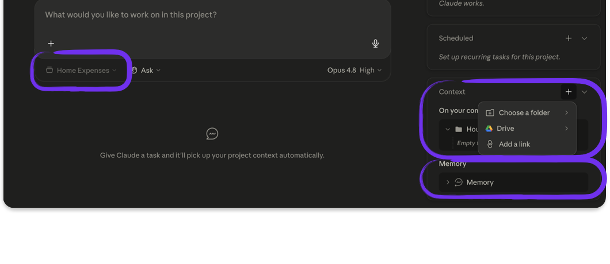

### Sources

- corpus/agentic-ai-deck.zip.md, "Working directory + permissions" (folder picker del sistema; lo concedido define el alcance); definición del panel de contexto del Project.
- "corpus/mision - auto.zip.md", el Project "Inteligencia de Mercado Semanal" apunta a `Documentos/Faro-Mercado` (Step 1.1); ahí se verificó cómo se concede la carpeta. El ejemplo de la lámina es genérico y el caso de la misión se trata en la Sección 6.

### Speaker notes

Slide de apoyo visual, con una sola captura: el panel de contexto del Project. El explorador de archivos ya no se proyecta, así que ese paso va hablado — contar que la carpeta se concede con el explorador del sistema y que Cowork no ve nada fuera de ella. Después señalar en la captura las tres cosas que conviven: Instrucciones, base de conocimiento y la carpeta concedida. Mensaje de seguridad: Cowork solo ve lo que le concedés, así que la carpeta ES el control de privacidad, nunca datos sensibles. De ahí la buena práctica que conviene decir en voz alta: usar una carpeta dedicada al trabajo del Project y revisar antes que no tenga adentro nada confidencial. El Project del informe mensual trabaja sobre `Documentos/Informe-Mensual`, nada más. Tiempo objetivo: ~1,5 min.

---

## 3. ¿Los lee todos?

### Content

**Cuando se le dan archivos a la IA, ¿los lee todos?** Dos formas de trabajar, y cuál conviene en cada caso.

- **Pocos archivos** Claude los lee completos, todos, cada vez que llega una pregunta. Máxima precisión, a costa de ocupar la ventana de contexto entera en cada vuelta.
- **Muchos archivos** Claude cambia solo de estrategia. En lugar de leer todo, busca y trae los fragmentos que hacen falta. Multiplica por 10 la capacidad del Project, y la respuesta pasa a apoyarse en esos fragmentos.
- **Trabajar sobre los archivos** Consultarlos no alcanza. Claude abre, modifica y guarda dentro de la carpeta concedida, como lo haría una persona.

**Tres reglas prácticas**

- **Subir lo que importa** El relleno "por las dudas" empeora las respuestas.
- **Nombres de archivo claros** Un nombre que no dice qué hay adentro tampoco le sirve a la IA.
- **PDFs escaneados** Sin capa de texto son imágenes vacías. Conviene convertirlos antes.

### Sources

- Anthropic Support, "Retrieval augmented generation (RAG) for projects": https://support.claude.com/en/articles/11473015-retrieval-augmented-generation-rag-for-projects (verificado 2026-07-31). Sostiene los tres datos de los dos primeros bloques: el cambio de modo es automático y ocurre cuando el conocimiento del Project se acerca al límite de la ventana de contexto ("When your project knowledge approaches the context window limit, Claude will automatically enable RAG mode"), sin umbral numérico documentado; la capacidad se multiplica por 10 ("expand your project's capacity by up to 10x"); y el usuario no configura nada ("Automatic activation when needed, no setup required"). La misma fuente afirma que la calidad de las respuestas se mantiene ("Response accuracy remains consistent with in-context processing"), así que la lámina describe el cambio de mecanismo y no afirma pérdida de fiabilidad; el matiz está en las Speaker notes y anotado en Open questions.
- corpus/agentic-ai-deck.zip.md, definición de "Project (Chat/Cowork)" (la base de conocimiento como una de las tres capas) y "Working directory + permissions" (el agente abre, edita y guarda dentro de la carpeta concedida): sostiene el tercer bloque, el de trabajar sobre los archivos y no solo consultarlos.
- Las tres reglas prácticas son experiencia de los presentadores, no recomendación documentada por Anthropic. La regla de los PDFs escaneados se apoya en el mismo criterio de formato de la lámina 2.1 (el modelo lee texto; lo que no tiene capa de texto no se lee).

### Speaker notes

La lámina contesta la pregunta que aparece apenas alguien sube su primera carpeta. La analogía que conviene usar: es la diferencia entre un colega que leyó todo el expediente antes de la reunión y uno que sabe exactamente en qué carpeta buscar. El primero es más preciso pero no escala; el segundo escala pero puede abrir el cajón equivocado. La herramienta elige sola cuál de los dos modos usar según cuánto material haya, sin que nadie configure nada, y ahí está lo accionable: no se elige el modo, se elige qué material entra.

Enganchar con la lámina 2.1, que ya explicó qué hay en una carpeta de trabajo (conocimiento e instrucciones) y por qué conviene el `.md`. Esta lámina agrega el otro lado: qué hace la herramienta con ese material según cuánto haya. Una frase alcanza para hacer el puente.

El matiz de fuentes, para tenerlo a mano si alguien pregunta. La documentación de Anthropic sostiene que la calidad se mantiene cuando entra el modo de búsqueda ("Response accuracy remains consistent with in-context processing"). La intuición práctica de la casa es otra: cuando la respuesta se arma con los fragmentos que trajo una búsqueda, aparece un paso del que antes no se dependía, y ese paso puede traer lo que no era. La lámina no toma partido a propósito. Si sale el tema, decir las dos cosas y quedarse ahí.

Sobre los PDFs escaneados: la regla vale sobre todo para el material que se carga como base de conocimiento del Project. En Cowork el agente tiene herramientas y puede abrir un PDF y trabajarlo igual, así que el consejo es una buena práctica de carga, no un límite duro de la herramienta.

Cierre sugerido, para decir en voz alta: "La calidad de lo que sale depende menos del modelo que de cómo ordenaste lo que entra." Tiempo objetivo: ~3 min.

---

## 4. Instrucciones: el contrato de trabajo

### Content

- Instrucciones = el **"contrato de trabajo"**: reglas en lenguaje natural que aplican a todo el Project.
- El usuario las escribe **una vez** y valen para todos los chats.
- **Dónde viven:** el panel de contexto del Project, en la interfaz. No es un archivo que se edite a mano.

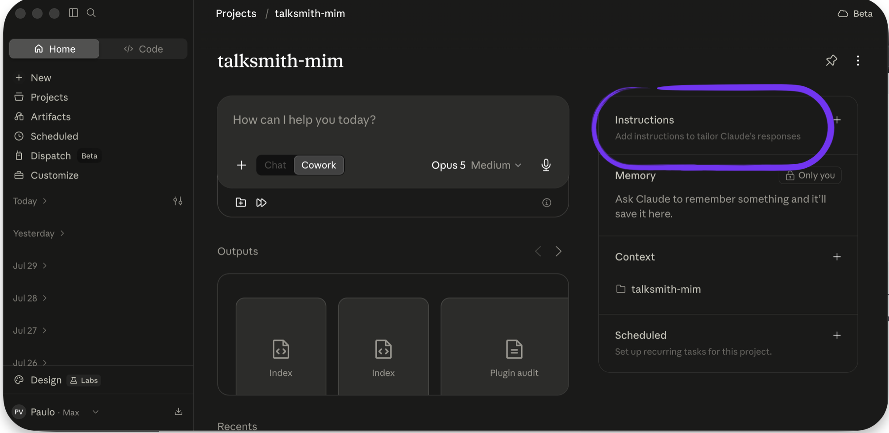

- Conviene que sean **cortas y claras**.
- Es el lugar de las **reglas no negociables**.

### Sources

- corpus/agentic-ai-deck.zip.md, "the project context panel (GUI)" como lugar de las Instrucciones en Cowork; matriz de disponibilidad 3.3 (Persistent instructions, Cowork ⚠️).
- Captura propia `images/instructions.png` (app de escritorio, 2026-07-31): el panel derecho de un Project, con **Instructions** rodeado en violeta y debajo **Memory**, **Context** (con la carpeta concedida) y **Scheduled**. Sostiene el bullet de dónde viven las Instrucciones y muestra en una sola pantalla las tres capas que enumera 3.1 y la carpeta que trata 3.2.

### Speaker notes

En lugar de re-explicarle el contexto a Claude cada vez, el usuario lo escribe una vez en las Instrucciones y queda fijo. Dónde viven: en el panel de contexto del Project (GUI), no un archivo que se edita a mano. La captura lo muestra, con Instructions rodeado arriba y debajo Memory, Context con la carpeta concedida y Scheduled.

Aprovechar la captura para cerrar las dos láminas anteriores. En esa misma pantalla están las tres capas que se enumeraron en 3.1 y la carpeta concedida de 3.2, así que sirve para que la audiencia ubique dónde vive cada cosa antes de entrar al ejemplo.

Un detalle de forma, para decir al pasar: esta captura tiene la app en inglés ("Instructions") y la de la Sección 4 en español ("Habilidades"). Conviene avisarlo o unificar el idioma de la app antes de sacar capturas nuevas.

La lámina que sigue muestra unas Instrucciones completas. Tiempo objetivo: ~2 min.

---

## 5. Un ejemplo de Instrucciones

### Content

<!-- ascii-render: documentation-only -->
```text
Sos el asistente de informes del equipo comercial.
Preparás el informe mensual para colegas NO técnicos (incluido el jefe),
que se lee en 5 minutos antes de la reunión de cierre de mes.

· Regiones que cubrís: Norte, Centro y Sur.
· Escribís en español, claro y breve, sin jerga.
  Si usás un término técnico, lo explicás en una línea.
· Trabajás con las notas que están en la carpeta notas/.
· REGLA DE ORO: toda cifra lleva su fuente y su fecha.
  NUNCA publicás un número sin decir de dónde salió.
  Si el dato no está en las notas, lo aclarás en el informe.
```

### Sources

- "corpus/mision - auto.zip.md", texto exacto de las Project Instructions de Atlas (Step 1.1); "las Instrucciones son su contrato de trabajo". De ahí sale la forma del ejemplo (rol, destinatario, reglas con viñeta y una regla de oro). El ejemplo de la lámina es genérico y el caso de la misión se trata en la Sección 6.

### Speaker notes

Recorrer el ejemplo de arriba abajo: quién es el agente, para quién escribe, con qué material trabaja. No hace falta leerlo palabra por palabra, alcanza con señalar las cuatro zonas.

Detenerse en la regla de oro, que toda cifra lleve su fuente y su fecha. Ese es el tipo de restricción dura que conviene fijar acá, la que el agente nunca puede saltear aunque el pedido del momento empuje para otro lado. Cada equipo tiene la suya, y en áreas reguladas suele ser un disclaimer obligatorio al pie. Tiempo objetivo: ~3 min.

---

# 4. Skills

**Goal of this section:** Enseñarle a Claude tareas reutilizables. Qué es una Skill, cómo se usa una vez creada (explícita con `/`, o automática cuando el pedido coincide con su descripción) y las tres formas de crearla. La lámina 3 las presenta juntas y las tres que siguen las recorren una por una, el menú Agregar del panel de Habilidades (donde el ZIP importa una existente), la creación desde el prompt de un chat (se describe la tarea, Claude pregunta por el proceso y arma la Skill) y la grabación de pantalla (se hace la tarea narrándola y Claude arma la Skill). Los tres caminos terminan en la misma compuerta, la trampa del Save, guardar y habilitar la Skill en la lista. Seis láminas.

---

## 1. Qué es una Skill

### Content

*"Todo lo que le explicás a Claude más de una vez es una Skill que deberías escribir una vez."*

- **Es un instructivo escrito** Una tarea explicada en pasos, guardada en un archivo. Se escribe en español, no es código.
- **Se enseña una vez** Después la tarea se pide y sale siempre igual: mismos pasos, mismo formato de salida.
- **Un trabajo por Skill** Si al describirla aparece un "y además", son dos Skills.
- **Queda disponible** Vive en la lista de Habilidades y está a mano en cualquier chat, no dentro de uno.

**Ejemplo del que vamos a hablar toda la sección:** la Skill `informe-mensual` lee la carpeta `notas/` y devuelve el informe del mes con el formato de siempre.

### Sources

- corpus/agentic-ai-deck.zip.md, definición de Skill (folder + SKILL.md, "one job per skill"); "Anything you explain to Claude twice is a skill you should write once."
- "corpus/mision - auto.zip.md", el ejemplo `reporte-semanal` (lee la carpeta `fuentes/`, consolida por empresa, formato fijo, sufijo `-new`); de ahí sale la forma del ejemplo. El ejemplo de la lámina es genérico (`informe-mensual` sobre `notas/`) y el caso de la misión se trata en la Sección 6.

### Speaker notes

Arranca el bloque avanzado, partido por tema: esta sección cubre Skills y la siguiente, Subagentes. Abrir con la frase, que es el resumen de todo: lo que le explicás a Claude más de una vez conviene escribirlo una sola vez.

Las cuatro tarjetas se recorren de a una, sin apurarse, porque son la definición completa. **Es un instructivo escrito**: una tarea explicada en pasos y guardada en un archivo, en español y sin una línea de código — bajar la barrera acá, porque la palabra "Skill" suena a programación y no lo es. **Se enseña una vez**: la primera vez cuesta escribirla, todas las siguientes la tarea sale igual, con los mismos pasos y el mismo formato de salida; ese es el retorno. **Un trabajo por Skill**: el criterio práctico para saber si está bien recortada — si al describirla aparece un "y además", son dos Skills, no una. **Queda disponible**: vive en la lista de Habilidades, no adentro de un chat, así que está a mano la próxima vez sin volver a buscarla.

El ejemplo es el hilo del resto de la sección, así que conviene presentarlo bien acá y no volver a explicarlo después: `informe-mensual` lee todos los archivos crudos de `notas/` (uno por región), consolida por región y devuelve el informe con el formato de siempre. Convierte varios archivos desordenados en un documento prolijo, sin que nadie tenga que repetir las indicaciones.

Lo que esta lámina **no** contesta, a propósito, es cómo se dispara una Skill; eso es la lámina que sigue. Después vienen los tres caminos de creación: el panel de Habilidades, el prompt de un chat y la grabación de pantalla. Tiempo objetivo: ~4 min.

---

## 2. Cómo se usa una Skill

### Content

- Una vez guardada y habilitada, una Skill se usa de **dos formas**.
- **Explícita:** se tipea `/` en el chat y se elige la Skill como comando. Ejemplo: `/informe-mensual`.
- **Automática:** se pide la tarea en español y Claude reconoce que el pedido coincide con la **descripción** de la Skill, y la carga solo. Ejemplo: *"armame el informe de mayo con lo que hay en `notas/`"*.
- Por eso la **descripción** de una Skill importa tanto: es lo que decide si se dispara sin que nadie la nombre.

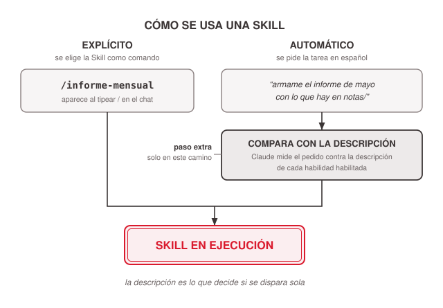
<!-- ascii-source:
        COMO SE USA UNA SKILL

  EXPLICITO                    AUTOMATICO
  tipeas "/" y la elegis       pedis la tarea en español
 +----------------------+    +----------------------------+
 | /informe-mensual     |    | "armame el informe de mayo |
 |                      |    |  con lo que hay en notas/" |
 +----------------------+    +----------------------------+
            |                             |
            |                             v
            |                +----------------------------+
            |                | Claude compara el pedido   |
            |                | con la DESCRIPCION de las  |
            |                | habilidades habilitadas    |
            |                +----------------------------+
            |                             |
            +--------------+--------------+
                           |
                           v
              +==============================+
              |     SKILL EN EJECUCION       |
              +==============================+

   la descripcion es lo que decide si se dispara sola
-->
<!-- ascii-note:
intent: mostrar los dos caminos de invocación de una Skill ya guardada — el explícito (tipear "/" y elegirla como comando) y el automático (pedir la tarea en lenguaje natural y que Claude la reconozca por su descripción) — convergiendo los dos en la misma caja de ejecución.
emphasize: la caja de doble línea "SKILL EN EJECUCION" donde convergen los dos caminos; el paso intermedio que solo tiene el camino automático, donde Claude compara el pedido contra la DESCRIPCION; la leyenda de abajo.
labels: columna izquierda = EXPLICITO (/informe-mensual); columna derecha = AUTOMATICO (pedido en español) con el paso de comparación por descripción; salida común = SKILL EN EJECUCION.
-->

### Sources

- Anthropic Support, Use Skills in Claude: https://support.claude.com/en/articles/12512180-use-skills-in-claude; las Skills se habilitan desde el panel de Habilidades y requieren Code execution. Sostiene el marco de "Skill habilitada = Skill disponible", no el detalle de los dos modos de invocación.
- Verificación de primera mano de los presentadores (2026-07-21, menú "+" del chat y prompt de Cowork): Cowork incluye un set reducido de slash commands y las habilidades quedan a mano desde el chat. Sostiene el camino explícito (tipear `/` y elegir la Skill).
- corpus/agentic-ai-deck.zip.md, definición de Skill ("Description drives triggering — semantic, not keyword"). Es la única evidencia disponible del mecanismo de activación automática por descripción, y es un deck interno, no documentación de producto. **Pendiente de verificación** contra una fuente oficial; ver Speaker notes y Open questions.
- El ejemplo `informe-mensual` sobre `notas/` es el hilo genérico del deck (mismo ejemplo de 4.1), no un caso documentado por Anthropic.

### Speaker notes

La lámina que faltaba entre "qué es una Skill" y "cómo se crea": una Skill guardada no se usa de una sola manera. Decirlo con el ejemplo que ya conocen, `informe-mensual`.

El camino explícito es el que se demuestra más rápido: se tipea `/` en el chat, aparece la lista y se elige la Skill como si fuera un comando. Es el modo a usar cuando uno quiere estar seguro de que corre esa Skill y no otra. Vale el mismo tip de siempre: tipear `/` es la forma de ver qué hay disponible, y en Cowork la lista es corta.

El camino automático es el que más sorprende: no hace falta nombrarla. Se pide la tarea en español, "armame el informe de mayo con lo que hay en `notas/`", y Claude carga la Skill solo porque el pedido se parece a lo que dice su descripción. De ahí sale el consejo práctico que se llevan: al escribir una Skill, la descripción no es decoración, es el disparador. Una descripción vaga hace que la Skill nunca se active sola; una que nombra la tarea y las palabras con que la gente la pide, sí.

**Nivel de certeza, para ser honestos si alguien pregunta.** El camino explícito está verificado de primera mano en la app. El mecanismo del camino automático —que la activación se decide comparando el pedido contra la `description`, de forma semántica y no por palabra clave— lo sostiene hoy el deck interno del equipo y no una fuente oficial de producto que tengamos citada. Es consistente con cómo se comporta la herramienta, pero conviene decirlo como "así funciona en la práctica" y no como una especificación publicada. **Pendiente de verificación** contra la documentación oficial antes de la clase.

Las láminas que siguen recorren los caminos de creación; esta explica qué pasa una vez que la Skill existe. Tiempo objetivo: ~2 min.

---

## 3. Tres formas de crear una Skill

### Content

Cuando la Skill que hace falta no existe todavía, hay tres caminos para crearla.

- **Desde el panel** Configuración → Habilidades → Agregar. Dos entradas crean una Skill nueva. "Crear con Claude" la arma en un ida y vuelta de chat y "Escribir las instrucciones" se edita directo en la interfaz. Es el camino explícito, donde se ve cada paso.
- **Desde el prompt** Se abre un chat y se describe lo que se quiere. Claude pregunta por el proceso, arma la Skill y la empaqueta. Es el camino con menos fricción para quien ya está trabajando.
- **Grabando la pantalla** Se hace la tarea narrándola en voz alta, Claude mira la grabación y propone la Skill. Es la barrera más baja de las tres, porque no hay nada que escribir.

**Los tres terminan en la misma compuerta:** guardar y habilitar la Skill en la lista de Habilidades, o parece que "no funciona".

### Sources

- Verificación de primera mano de los presentadores (2026-07-21, captura del panel Configuración → Habilidades): el menú **Agregar** ofrece "Cree con Claude", "Escribe las instrucciones de la habilidad" y "Subir una habilidad". Sostiene las dos entradas de creación del camino del panel.
- Anthropic Support, How to create custom skills: https://support.claude.com/en/articles/12512198-how-to-create-custom-skills (verificada 2026-08-01). Sostiene la cuarta entrada del menú Agregar, "Grabá tu pantalla", y el camino de la grabación que desarrolla la lámina 4.6. **No documenta** el camino conversacional desde el prompt.
- Anthropic, How to create a skill with Claude through conversation: https://claude.com/resources/tutorials/how-to-create-a-skill-with-claude-through-conversation (verificada 2026-08-01; la URL de support `support.claude.com/en/articles/12599426` redirige acá). Es la única fuente del camino desde el prompt, que desarrolla la lámina 4.5.
- La compuerta de guardar y habilitar es la misma que marca el diagrama de la lámina 4.4; acá se anuncia y ahí se desarrolla.

### Speaker notes

La lámina índice de la sección. Acá se nombran los tres caminos y no se desarrollan, porque cada uno tiene su propia lámina y llega enseguida.

Recorrer las tarjetas en el orden en que van a aparecer. El panel es el camino explícito, el que muestra el menú entero y sirve para ubicar dónde vive la lista de Habilidades. El prompt es el que menos interrumpe a alguien que ya está trabajando, porque la Skill se pide en el mismo chat donde estaba la tarea. La grabación es la que más baja la barrera para esta audiencia: la tarea que cada uno repite todas las semanas la tiene en los dedos y no escrita en pasos.

El cierre conviene fijarlo antes de pasar de lámina. Los tres caminos desembocan en el mismo lugar, la Skill guardada y habilitada en la lista, que es la compuerta que el diagrama de la lámina siguiente desarrolla y la razón número uno de que a alguien "no le funcione".

Tiempo objetivo: ~1,5 min.

---

## 4. Metodo 1: Crear desde el panel

### Content

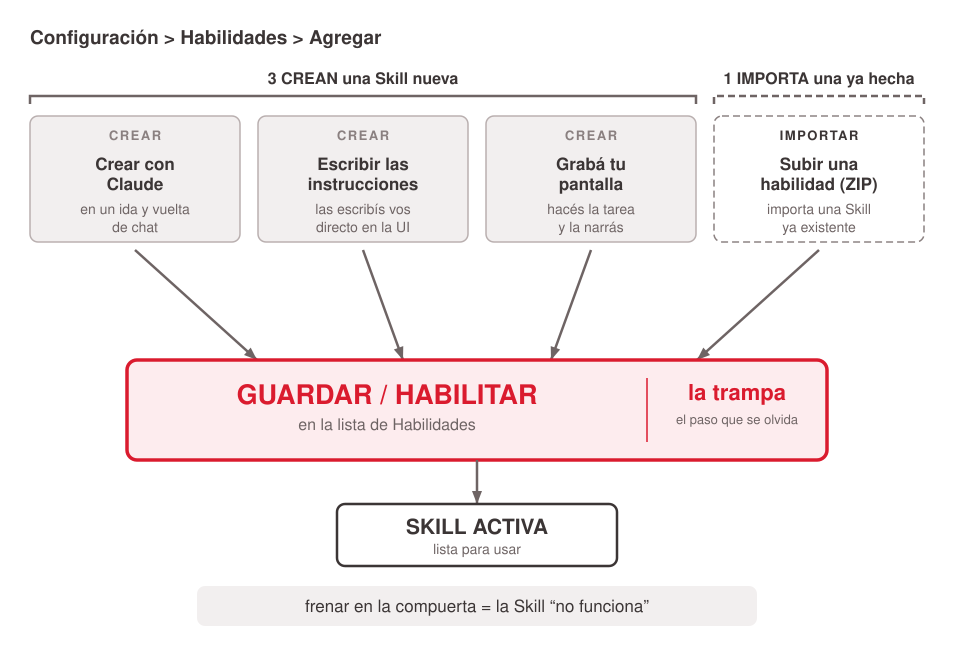
<!-- ascii-source:
     CREAR UNA SKILL EN COWORK

 Configuracion > Habilidades > AGREGAR
 +-------------------+---------------------+
 | Crear con Claude  | Escribir las        |  crear
 | (ida y vuelta de  | instrucciones en    |
 |  chat)            | la UI               |
 +-------------------+---------------------+
 | Grabar tu pantalla:                     |  crear
 | hacés la tarea y la narrás              |
 +-----------------------------------------+
 | Subir una habilidad (ZIP):              |  importar
 | importa una Skill ya existente          |
 +-----------------------------------------+
        \              |              /
         v             v             v
   +====================================+
   |   GUARDAR / HABILITAR              |  <== la trampa
   |   (lista de Habilidades)           |
   +====================================+
                   |
                   v
          +-----------------+
          |  SKILL ACTIVA   |
          +-----------------+

   frenar en la compuerta = la Skill "no funciona"
-->
<!-- ascii-note:
intent: mostrar las CUATRO entradas del menú Agregar del panel Habilidades y separarlas por lo que hacen. Tres CREAN una Skill nueva (Crear con Claude, en un ida y vuelta de chat; escribir las instrucciones directo en la UI; grabar la pantalla haciendo la tarea y narrándola) y una IMPORTA una ya existente (subir un ZIP). Las cuatro desembocan en la misma compuerta: guardar y habilitar la Skill en la lista.
emphasize: la compuerta "GUARDAR / HABILITAR" como cuello de botella (caja de doble línea, marcada "la trampa") y la leyenda inferior; el corte entre las tres entradas marcadas "crear" y la marcada "importar", que es la distinción que la lámina enseña; las flechas que convergen en la compuerta desde el bloque de la UI.
labels: bloque UI = menú Agregar, con las cuatro entradas y su marca al costado (crear / crear / crear / importar); compuerta = guardar/habilitar en la lista de Habilidades; salida = Skill activa.
-->

### Sources

- Verificación de primera mano de los presentadores (2026-07-21, captura del panel Configuración → Habilidades): el menú **Agregar** ofrece "Cree con Claude", "Escribe las instrucciones de la habilidad" y "Subir una habilidad".
- Anthropic Support, How to create custom skills: https://support.claude.com/en/articles/12512198-how-to-create-custom-skills (re-verificada 2026-07-31); sostiene la **cuarta entrada del menú**, "Grabá tu pantalla" (Configuración → Habilidades → Agregar), que la captura del 2026-07-21 todavía no mostraba y que la lámina 4.6 desarrolla. La misma fuente documenta el camino ZIP; los dos caminos de creación asistida (Crear con Claude / Escribir las instrucciones) siguen sin aparecer ahí, así que esos dos se atribuyen a la captura (doc atrasada respecto del producto).
- La captura `images/skills-panel.png` es del 2026-07-21 y **puede no mostrar la entrada de grabación**, que se desplegó después; el diagrama sí la incluye. Re-mirar el panel antes de la clase y resacar si hace falta.

### Speaker notes

El primero de los tres caminos que anunció la lámina índice: la creación por el panel. Con conexión, hacerlo en vivo, Configuración → Habilidades → Agregar, y nombrar las entradas del menú mientras se ven en la captura.

El corte que conviene marcar es **crear contra importar**, que es lo que el diagrama separa al costado. Tres de las cuatro entradas crean una Skill nueva: "Crear con Claude" abre un ida y vuelta de chat donde Claude escribe el `SKILL.md`; "Escribir las instrucciones" edita la habilidad directo en la UI; y "Grabá tu pantalla" es el camino de la grabación, que se nombra acá al pasar porque tiene lámina propia dos slides más adelante — decir solo que existe y que se entra por el mismo menú. La cuarta, "Subir una habilidad", **no crea nada**: importa una Skill ya hecha desde su ZIP, por ejemplo una que compartió un colega.

El diagrama desarrolla la compuerta de guardar y habilitar que la lámina índice anunció, y donde desembocan las cuatro entradas. Es el diagrama que las dos láminas siguientes retoman al cerrar, así que acá conviene contarlo entero.

Un cuidado con la captura: es del 21 de julio y puede no mostrar todavía la entrada de grabación, que se desplegó después. Si el panel proyectado y el diagrama no coinciden, decirlo al pasar en vez de dejar que lo noten. La doc oficial va detrás del producto en este punto; re-mirar el panel el día de la clase, y resacar la captura si ya cambió. Tiempo objetivo: ~3 min (con demo).

---

## 5. Metodo 2: Crear desde el prompt

### Content

- **Se describe lo que se quiere** Se abre un chat nuevo y se pide la Skill en una línea, por ejemplo *"quiero armar una Skill para el informe mensual del equipo"*.
- **Claude pregunta por el proceso** Hay que contarlo con el detalle que necesitaría alguien capaz que nunca hizo esa tarea. También pregunta por los casos de uso concretos y por cómo se reconoce un buen resultado.
- **Se le suben los materiales** En la misma conversación entran las plantillas, los ejemplos de trabajos anteriores, las guías de estilo y los archivos de datos.
- **Claude arma la Skill** Escribe el `SKILL.md`, el archivo de instrucciones que toda Skill necesita, ordena los materiales que recibió y genera el código de las operaciones descritas. No hay ningún comando que tipear.
- **Se prueba** Se le pide una tarea que la Skill debería resolver. Si se activó, aparece **"Usando [nombre de la Skill]"** en el razonamiento de Claude. Si algo no cierra, se le pide el ajuste a Claude y se prueba de nuevo.

**Antes de probar, la compuerta de siempre:** guardar y habilitar en Configuración → Capacidades → Habilidades, o parece que "no funciona".

### Sources

- Anthropic, How to create a skill with Claude through conversation: https://claude.com/resources/tutorials/how-to-create-a-skill-with-claude-through-conversation (verificada 2026-08-01; la URL de support `support.claude.com/en/articles/12599426` redirige acá). Sostiene el flujo completo de la lámina y las dos citas textuales que se traducen acá: el pedido inicial ("I want to create a skill for quarterly business reviews") y el criterio de detalle ("Claude will ask about your process. Provide enough detail that someone capable but unfamiliar could follow your approach"). También la subida de materiales durante la conversación (plantillas, trabajos anteriores, guías de estilo, archivos de datos), las preguntas por casos de uso y estándar de calidad, la escritura del `SKILL.md` con organización de materiales y generación de código, el guardado y habilitado en Configuración → Capacidades → Habilidades, la prueba con una tarea real y la señal "Usando [nombre de la Skill]" en el razonamiento.
- Anthropic Support, How to create custom skills: https://support.claude.com/en/articles/12512198-how-to-create-custom-skills (verificada 2026-08-01). Sostiene el camino del panel (4.4) y el de la grabación (4.6). **Procedencia a tener presente:** este artículo **no documenta** el camino conversacional, que sale del tutorial citado arriba.
- Por debajo, la creación conversacional se apoya en una herramienta interna de creación de skills. **No es un comando que el usuario tipee:** en Cowork no existe un `/skill-creator` (verificado por el presentador, 2026-07-31), y el deck no lo afirma en ninguna lámina.

### Speaker notes

El camino que menos se conoce y el que más le sirve a alguien que ya está trabajando, porque no pide salir del chat. Si hay conexión, conviene hacerlo en vivo con el ejemplo del deck.

El pedido inicial es corto y no hace falta que sea preciso, alcanza con nombrar la tarea. Lo que decide la calidad de la Skill es lo que viene después, cuando Claude pregunta por el proceso. La doc trae un criterio que conviene repetir tal cual desde el escenario: contalo con el detalle que necesitaría alguien capaz que nunca hizo esa tarea. El error típico es contestar en dos líneas y después quejarse de que la Skill quedó genérica.

Los materiales son la otra mitad del trabajo. Una plantilla vieja, dos informes anteriores y la guía de estilo del equipo enseñan más que cualquier descripción escrita en el momento. Claude además pregunta por los casos de uso concretos y por cómo se reconoce un buen resultado, así que conviene llegar con esa respuesta pensada.

Lo que hace Claude por debajo se cuenta en una frase y sin abrir el capó. Escribe el `SKILL.md`, que es el archivo de instrucciones que toda Skill necesita, ordena los materiales que recibió y arma el código de las operaciones que se le describieron. Decir en voz alta que no hay ningún comando que tipear, porque alguien que vio Claude Code va a preguntar por `/skill-creator` y en Cowork esa opción no existe.

Cerrar en la compuerta de siempre, guardar y habilitar en Configuración → Capacidades → Habilidades, y en la prueba. La señal de que la Skill se activó es la línea "Usando [nombre de la Skill]" en el razonamiento, y vale la pena mostrarla porque es la respuesta visual a la pregunta de cómo saber que la está usando. Si el resultado no cierra, se le pide el ajuste a Claude en el mismo chat y se prueba otra vez; son varias vueltas y salen baratas.

**Procedencia, por si alguien pregunta.** El camino conversacional lo documenta el tutorial de Anthropic; el artículo de support que sostiene el panel y la grabación no lo menciona. Tiempo objetivo: ~3 min.

---

## 6. Metodo 3: Crear grabando una Skill

### Content

- **Tercer camino de creación:** grabar la pantalla mientras se hace la tarea y narrarla en voz alta. Claude mira la grabación y propone la Skill.
- **Dónde:** el botón **"+"** del compositor del chat, en **"Record a skill"**; también en Configuración → Habilidades → Agregar → "Grabá tu pantalla", la cuarta entrada del menú de la lámina 4.4.
- **Para qué sirve:** la tarea que uno ya hace de memoria y le costaría escribir en pasos. Es el camino con la barrera más baja de los tres.
- **Qué captura:** pantalla, clicks, tipeo y voz, hasta unos 10 minutos.
- **Cuidado:** no tipear contraseñas ni información sensible mientras corre la grabación.
- **Disponibilidad:** planes Pro, Max y Team, en Cowork en Claude para Mac.

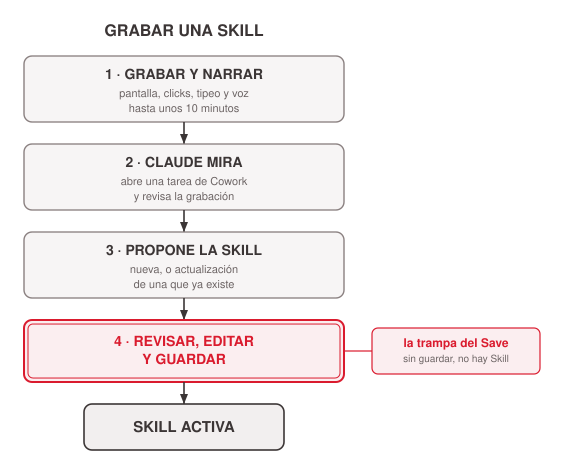
<!-- ascii-source:
        GRABAR UNA SKILL

 +----------------------------+
 | 1. GRABAR Y NARRAR         |
 | pantalla + clicks +        |
 | tipeo + voz  (~10 min)     |
 +----------------------------+
               |
               v
 +----------------------------+
 | 2. CLAUDE MIRA             |
 | abre una tarea de Cowork   |
 | y revisa la grabacion      |
 +----------------------------+
               |
               v
 +----------------------------+
 | 3. PROPONE LA SKILL        |
 | nueva, o update de una     |
 | que ya existe              |
 +----------------------------+
               |
               v
 +============================+
 | 4. REVISAR, EDITAR         |
 |    Y GUARDAR               |  <== la trampa del Save
 +============================+
               |
               v
      +------------------+
      |   SKILL ACTIVA   |
      +------------------+
-->
<!-- ascii-note:
intent: mostrar el flujo de cuatro tiempos de una Skill grabada, desde la grabación narrada hasta la Skill activa, y que la última etapa es la misma compuerta de guardar y habilitar que marca el diagrama de 4.4.
emphasize: la caja de doble línea "REVISAR, EDITAR Y GUARDAR" marcada como la trampa del Save; la bajada vertical de los cuatro pasos numerados, uno debajo del otro.
labels: 1 grabar y narrar (pantalla, clicks, tipeo, voz, ~10 min); 2 Claude mira (abre una tarea de Cowork); 3 propone la Skill (nueva o actualización de una existente); 4 revisar, editar y guardar; salida = Skill activa.
-->

### Sources

- Anthropic Support, How to create custom skills: https://support.claude.com/en/articles/12512198-how-to-create-custom-skills (documentación oficial, verificada 2026-07-31). Sostiene todos los datos de la lámina: disponible en los planes Pro, Max y Team, en Cowork en Claude para Mac; los dos puntos de entrada (botón "+" del compositor → "Record a skill", y Configuración → Habilidades → Agregar → "Grabá tu pantalla"); la grabación captura pantalla, clicks, tipeo y voz, hasta unos 10 minutos; la advertencia de no tipear contraseñas ni información sensible durante la grabación; al terminar, Claude abre una tarea de Cowork, revisa la grabación y propone una Skill, nueva o una actualización de una que ya existe; la Skill grabada se edita como cualquier otra, desde el panel de Habilidades y desde el chat con "Editar con Claude".
- Cuenta oficial de Claude en X, anuncio del 21 de julio de 2026: "Record your screen while you do a task, talk through it as you go, and Claude turns it into a skill it can run again". Se cita como cobertura del anuncio, para el encuadre de "para qué sirve"; no es documentación de producto y no sostiene ningún dato de la lámina.
- Ninguna de las dos fuentes dice qué pasa con la grabación después (retención, uso para entrenamiento), así que la lámina no afirma nada sobre eso. Ver Speaker notes y Open questions.

### Speaker notes

El tercero de los tres caminos. Tiene dos puertas de entrada y conviene mostrar las dos, el botón "+" del compositor del chat, en "Record a skill", y la cuarta entrada del menú Agregar que se vio en 4.4. El pitch en una frase: se hace la tarea una vez con la grabación andando y Claude escribe la Skill a partir de eso. Para esta audiencia es el camino más accesible de los tres, porque la tarea que cada uno repite todas las semanas la tiene en los dedos y no en un instructivo.

Recorrer el diagrama en cuatro tiempos, rápido. Uno, se graba mientras se trabaja y se narra en voz alta qué se hace y por qué; esa narración es la mitad del valor, porque una grabación muda deja a Claude adivinando el porqué de cada click. Dos, Claude abre una tarea de Cowork y revisa la grabación. Tres, propone una Skill, que puede ser nueva o una actualización de una que ya existe. Y cuatro, vuelve la trampa del Save de la lámina anterior: la Skill propuesta hay que revisarla, editarla y guardarla habilitada. Una vez guardada es una Skill como cualquier otra, editable desde el panel de Habilidades y también desde el chat con "Editar con Claude".

Los límites, dichos en voz alta antes de que alguien lo intente en el recreo: Pro, Max y Team; por ahora solo en Cowork en Claude para Mac; unos 10 minutos de tope, así que conviene elegir una tarea corta o partirla en dos. Y el cuidado que más importa, nada de contraseñas ni de información sensible en pantalla mientras la grabación corre, que es el mismo criterio de la lámina de cuidados del cierre, donde la carpeta concedida es el control de privacidad.

Si alguien pregunta qué pasa con la grabación después (si queda guardada, si se usa para entrenar), la documentación no lo dice y la respuesta honesta es que no lo sabemos; recomendar tratarla como cualquier material sensible y no afirmar nada más. Tiempo objetivo: ~3 min.

---

# 5. Subagentes

**Goal of this section:** La pieza avanzada del cierre, en dos láminas: qué es un Subagente, para qué tipo de sub-tarea conviene y cómo aparece en Cowork (coordinado por debajo, sin panel); y después, para quien quiera uno propio, de qué está hecho un subagente —un archivo `.md` con encabezado— y por qué en Cowork el camino para que persista es empaquetarlo en un plugin. La segunda es la lámina más técnica del deck y es opcional en el recorrido.

---

## 1. Subagentes: varios trabajando a la vez

### Content

- **Subagente** = asistente aislado, contexto propio; devuelve **un resumen** (no la transcripción).
- Ejemplo: **8 propuestas de proveedores**, un subagente por propuesta; los 8 corren en paralelo y el agente principal arma la tabla comparativa final.
- En Cowork corren "por debajo", **varios en paralelo**.
- **No se configuran a mano:** los coordina Claude solo, según la tarea. No hay panel de subagentes en Cowork.
- Lo que sí está en la mano del usuario: **pedir el trabajo en partes separables** ("compará estas 8 propuestas"), que es lo que habilita el paralelo.

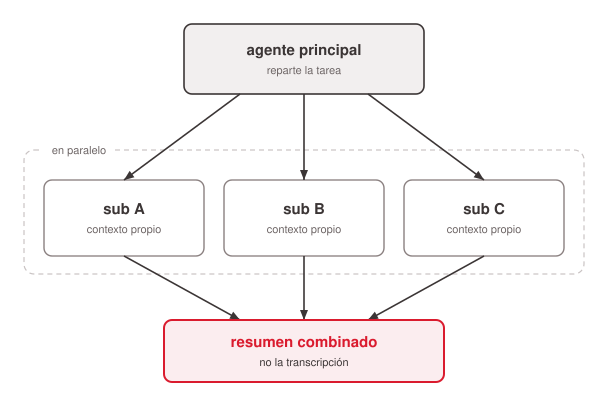
<!-- ascii-source:
                +------------------+
                | agente principal |
                +------------------+
                  /      |       \
                 v       v        v
          +--------+ +--------+ +--------+
          | sub A  | | sub B  | | sub C  |
          |contexto| |contexto| |contexto|
          |propio  | |propio  | |propio  |
          +--------+ +--------+ +--------+
                 \       |       /
                  v      v      v
                +------------------+
                | resumen combinado|
                +------------------+
-->
<!-- ascii-note:
intent: mostrar el patron fan-out/fan-in: el agente principal reparte una tarea entre varios subagentes que corren en paralelo con contexto propio, y junta los resultados en un resumen combinado.
emphasize: el paralelismo (tres subagentes a la vez) y que cada uno tiene contexto aislado; el resumen combinado al final.
labels: agente principal -> sub A / sub B / sub C (contexto propio) -> resumen combinado.
-->

### Sources

- corpus/agentic-ai-deck.zip.md, definición de Subagent (aislado, devuelve un resumen); "Skill vs Subagent" (slide 4.9 tabla); demo 4.8 (8 propuestas en paralelo). Para el comportamiento en Cowork: "Cowork subagents are coordinated under the hood — no manual `/agents` config exposed in the GUI" y la matriz 4.10 (Cowork ⚠️, misma frase).
- **Documentación de Claude Code** (no de Cowork), Subagents: https://code.claude.com/docs/en/sub-agents. Se usa **solo para el concepto general** de subagente (contexto propio, devuelve un resumen). La configuración manual que describe (`/agents`, archivos en `.claude/agents/`) **es de Claude Code y no está expuesta en Cowork**; no se cita como evidencia sobre Cowork.

### Speaker notes

Nivel avanzado: un subagente conviene cuando una sub-tarea es pesada o genera mucho texto intermedio que nadie necesita leer — corre aparte y vuelve con el resumen. No es opuesto de las Skills (se combinan); acá solo se enseña qué es. El ejemplo del fan-out: 8 propuestas de proveedores, un subagente por propuesta, corren en paralelo y el agente principal arma la tabla comparativa. Ser claro con el límite: en este caso todo pasa por debajo, lo decide Claude según la tarea, y **no hay pantalla** donde el usuario arme o edite estos subagentes. Lo accionable para la audiencia es cómo se pide el trabajo: si la tarea se puede partir en pedazos independientes, conviene decirlo así, porque es lo que habilita el paralelo. Alto nivel, sin internals. Si alguien pregunta por armarse uno propio, no contestarlo acá: es exactamente la lámina que sigue.

La transición a la lámina que sigue es la pregunta que alguien ya se está haciendo: "¿y si yo quiero un subagente mío, con instrucciones fijas?". Ahí va la respuesta. Tiempo objetivo: ~4 min.

---

## 2. Armar un subagente propio

### Content

**En Cowork no hay un botón de "crear subagente".** Un subagente es un archivo de texto, y para que quede disponible siempre se lo empaqueta en un **plugin**.

- **Es un archivo `.md`** Arriba, un encabezado con cuatro campos: `name`, `description`, `tools` y `model`. Abajo, en prosa, las instrucciones del asistente.
- **La `description` es el disparador** Es lo único que decide cuándo Claude lo delega. Conviene ser explícito: *"usar cuando el usuario pida una revisión"*.
- **Corre aparte** Ventana de contexto propia, sus instrucciones, sus herramientas. Devuelve el resumen, no la transcripción.
- **Para que persista, un plugin** Los archivos de una sesión de Cowork no le sobreviven. Un plugin —manifiesto `plugin.json` + carpeta `agents/`— los deja instalados y disponibles siempre, junto con las Skills y conectores que se le sumen.

> **No confundir con la lámina anterior.** Para paralelizar, Claude lanza subagentes **solo**, sin que nadie configure nada. Esto es el otro caso: cuando uno quiere un asistente **propio**, con instrucciones fijas, disponible siempre.

### Sources

- Claude Code docs, *Create custom subagents*: https://code.claude.com/docs/en/sub-agents (verificado 2026-07-31). Sostiene la anatomía completa: "Subagents are Markdown files with YAML frontmatter"; los campos del encabezado, con `name` y `description` como **los dos únicos obligatorios** y `tools` / `model` opcionales; que la `description` define "when Claude should delegate to this subagent"; y que "Each subagent runs in its own context window with a custom system prompt, specific tool access, and independent permissions". El ejemplo de la lámina está calcado en forma del `code-improver` de esa página, con el caso cambiado al hilo del deck.
- Claude Code docs, *Create plugins*: https://code.claude.com/docs/en/plugins (verificado 2026-07-31). Sostiene la estructura del plugin: el manifiesto en `.claude-plugin/plugin.json` y la carpeta `agents/` **en la raíz del plugin** (la doc marca explícitamente que `agents/` no va adentro de `.claude-plugin/`), y que los plugins son el camino para reusar agentes y skills entre proyectos en vez de dejarlos sueltos.
- Claude docs, *Install plugins* (Cowork): https://claude.com/docs/cowork/guide/plugins (verificado 2026-07-31). Es la fuente que ata lo anterior a Cowork: "A plugin is a package that extends what Claude can do in Cowork. Installing one can add skills, MCP connectors, subagents, slash commands, or hooks in a single step", con `Agents` en su tabla de componentes descripto como "Specialized subagents Claude can delegate to".
- Las rutas `.claude/agents/` (proyecto) y `~/.claude/agents/` (usuario) que documenta la primera fuente son de **Claude Code**, no de Cowork, y por eso **no aparecen en la lámina**: se mencionan en las Speaker notes solo por si alguien pregunta.

### Speaker notes

La lámina que contesta la pregunta que deja abierta la anterior: "¿y si yo quiero uno mío?". Arrancar por la frase de arriba, que es la que ordena todo: en Cowork **no hay una pantalla de crear subagente**. Eso no significa que no se pueda; significa que la pieza es un archivo, no un formulario.

Recorrer las cuatro tarjetas sin tecnicismos. **Es un archivo `.md`**: el mismo formato que vieron en la sección 2, con un encabezado corto de cuatro campos y abajo, en español, las instrucciones. **La `description` es el disparador**: exactamente la misma idea que en las Skills (4.2), y conviene decirlo así, porque es el segundo lugar donde aparece el mismo principio — el texto de la descripción es lo que hace que la pieza se active sola. **Corre aparte**: ventana propia, y devuelve el resumen; eso ya se explicó en la lámina anterior, alcanza con nombrarlo. **Para que persista, un plugin**: acá está el punto práctico, y es el que se olvida — un archivo que quedó en la sesión de ayer no está mañana, así que si el subagente vale la pena, se empaqueta.

El bloque de ejemplo no se lee palabra por palabra. Señalar tres cosas y seguir: el nombre, la línea de descripción (que es la importante) y que lo de abajo es prosa en español, no código. Si la audiencia se pone incómoda con el formato, decir en voz alta lo que corresponde: nadie tiene que escribir esto a mano, se le pide a Claude que lo escriba.

La cita al pie es la que evita el malentendido más probable, así que conviene no saltearla: **son dos cosas distintas**. Los subagentes que Claude lanza solo para paralelizar (lámina anterior) no requieren configuración ninguna. Esto de acá es querer un asistente propio con instrucciones fijas. Nadie necesita lo segundo para aprovechar lo primero.

Si preguntan por Claude Code: ahí los subagentes viven sueltos en `.claude/agents/` del proyecto o `~/.claude/agents/` del usuario, sin necesidad de plugin. Es otra herramienta y queda fuera de esta clase; contestarlo en una línea y volver.

Nivel de la lámina: es la más técnica del deck y es opcional en el recorrido. Si el tiempo aprieta, se puede dar en un minuto quedándose solo con las dos ideas ancla (es un archivo, y para que dure va en un plugin) y dejar el resto para quien pregunte. La lámina que sigue muestra el archivo entero. Tiempo objetivo: ~2 min.

---

## 3. Un subagente, por dentro

### Content

Así se ve el archivo completo. Arriba el encabezado, abajo las instrucciones en prosa.

<!-- ascii-render: documentation-only -->
```markdown

---
name: revisor-de-informes
description: Revisa un informe y marca cifras sin fuente. Usar cuando pidan una revisión.
tools: Read, Grep, Glob
model: sonnet

---

Sos un revisor de informes. Para cada problema: nombrá la cifra,
mostrá dónde está y proponé la corrección.
```

**Nadie escribe esto a mano:** se le pide a Claude que lo escriba, y se revisa que la `description` diga bien cuándo usarlo.

### Sources

- Claude Code docs, *Create custom subagents*: https://code.claude.com/docs/en/sub-agents (verificado 2026-07-31). El ejemplo está calcado en forma del `code-improver` de esa página —los mismos cuatro campos, en el mismo orden, con el cuerpo en prosa debajo— con el caso cambiado al hilo genérico del deck. La doc también sostiene que la Skill resultante se edita como cualquier archivo y que `name` y `description` son los dos únicos campos obligatorios.

### Speaker notes

El ejemplo completo, después de las cuatro tarjetas. **No se lee palabra por palabra.** Señalar tres cosas y seguir.

Uno, el bloque de arriba entre las dos líneas de guiones es el encabezado, y son cuatro renglones: cómo se llama, cuándo usarlo, qué herramientas puede tocar y con qué modelo corre. Dos, el renglón de `description` es el importante, porque es el que decide cuándo Claude lo llama —el mismo principio que la `description` de una Skill en 4.2, dicho por segunda vez a propósito. Tres, todo lo de abajo es **prosa en español**, no código: son las instrucciones del asistente, escritas como se las explicarías a una persona.

El cierre es el que baja la ansiedad de la sala, y conviene decirlo mirando a la audiencia y no a la pantalla: **nadie escribe esto a mano**. Se le pide a Claude que lo escriba y uno revisa que la descripción diga bien cuándo usarlo. Lo mismo que ya vieron con "Crear con Claude" en la Sección 4.

Si el tiempo aprieta, esta lámina es la primera candidata a saltearse: la anterior ya dejó las dos ideas ancla. Tiempo objetivo: ~1 min.

---

# Conclusions

## 1. Lo que se llevan: cambió el rol

### Content

- **El rol cambió.** Ahora se delega un resultado completo y se guía el proceso mientras corre.
- Los archivos `.md`, el Project, las Instrucciones, las Skills y los Subagentes son piezas al servicio de eso. **Cada trabajo usa solo las que necesita.**
- El chat extendido de la clase anterior sigue en pie y ahora se le suma la computadora.
- **Para el lunes:** elegir una tarea propia que se repite todas las semanas y armarla una sola vez, para que después corra sola.
- La barrera de entrada está en cero: se opera en español y no hace falta escribir código.

### Sources

- Sin material nuevo: cierre de las secciones 1 a 5; cada afirmación conserva la fuente de su slide de origen (1.1, 1.2, 1.3, 2.3, 3.1, 3.4, 4.1, 5.1).
- corpus/agentic-ai-deck.zip.md, progresión de building blocks; es la misma pila del mapa de 1.3.
- "corpus/mision - auto.zip.md", la misión Atlas arma estas piezas una por una; la parte 2 es donde la audiencia las combina por su cuenta.

### Speaker notes

Primera lámina del cierre y última de contenido antes de los cuidados. Se llega desde los Subagentes, la última pieza; acá se sube un escalón y se deja de hablar de piezas para hablar de qué significan juntas para el trabajo de cada uno. No re-explicar ninguna: la audiencia acaba de verlas todas.

El punto que conviene decir despacio es el primero. Antes se pedían pasos, uno por vez; ahora se delega un resultado y se guía el proceso. Las cinco piezas de la clase existen para sostener eso, y nadie necesita las cinco para empezar: con un Project y un par de archivos `.md` ya se trabaja distinto.

De ahí sale la consigna, y conviene plantearla como pregunta antes de darla: "¿qué tarea de las que hacen todas las semanas le delegarían a un agente?". Dejar que la piensen dos segundos y recién ahí bajar la consigna concreta: elegir esa tarea y armarla una sola vez, para que después corra sola. La misión parte 2 es el lugar para practicarlo, y la barrera de entrada es la que ya conocen desde la primera lámina, el español.

Si alguien pide apoyo visual, volver un momento al mapa de la slide 1.3, que es esta misma idea dibujada como bloques apilados. No hace falta un diagrama nuevo acá.

El caveat de que lo que se arma una vez después hay que revisarlo se deja para la lámina que sigue, la de cuidados, que es la que cierra el contenido de la charla. Después de esa queda una sola lámina, la placa de la misión. Tiempo objetivo: ~2 min.

---

## 2. Antes de cerrar: cuidados

### Content

- **Toda salida es un borrador**: cifras, citas y afirmaciones se verifican contra la fuente.
- **Nada de datos de clientes, financieros, PII ni bajo NDA.** La actividad de Cowork no queda en el registro de auditoría estándar: solo hay rastro si la organización lo configura aparte (Team/Enterprise), y por defecto no se registra nada.
- **Capas de guardarraíles:** permisos de carpeta → reglas en Instrucciones → solo conectores verificados → revisión humana.

### Sources

- Anthropic Support, Use Claude Cowork safely: https://support.claude.com/en/articles/13364135-use-claude-cowork-safely (verificado 2026-07-31): "Cowork activity is **not captured** in the Compliance API at this time"; recomienda evitar conceder acceso a archivos locales con información sensible.
- Anthropic Support, Monitor Claude Cowork activity with OpenTelemetry: https://support.claude.com/en/articles/14477985-monitor-claude-cowork-activity-with-opentelemetry (verificado 2026-07-31): el registro de actividad de Cowork existe vía OpenTelemetry, solo en planes Team y Enterprise, y "Events are only exported when an admin configures an OTLP endpoint. No data flows by default."
- corpus/agentic-ai-deck.zip.md, slide 7.2 (Governance & verification, verbatim); la afirmación "No audit trail in Cowork" de ese deck interno quedó corregida contra las dos fuentes oficiales de arriba.

### Speaker notes

Slide de cierre responsable, breve y obligatoria: acá la audiencia tiene que estar escuchando, no leyendo. Decirlo sin vueltas: Cowork sirve para trabajo recurrente de oficina y no para datos regulados, confidenciales o de clientes. El matiz que conviene decir bien, porque es el que se van a repetir en la oficina: no es que Cowork no deje ningún rastro, es que su actividad no entra en el registro de auditoría estándar de la cuenta (la Compliance API), y el registro que sí existe (OpenTelemetry hacia el SIEM de la empresa) es de planes Team y Enterprise y solo funciona si un administrador lo configura; por defecto no se exporta nada. Traducción para ellos: en una cuenta personal, nadie va a poder reconstruir después qué hizo el agente. Recordar que toda salida es un borrador que hay que verificar, lo mismo que se dijo en la clase anterior sobre el chat: el modelo puede alucinar, el conector cita fuentes, el humano verifica. Dos cosas que no están en la lámina y sí conviene decir: guardar juntos el prompt, las entradas y las salidas es lo que vuelve reproducible el trabajo, y en el trabajo real, con datos de la empresa o de clientes, nada de esto sin aprobación del área que corresponda. Los guardarraíles se leen de afuera hacia adentro. Con esto cierra la charla; lo que sigue es la placa de la misión, que ya no agrega contenido y queda proyectada mientras se abre el Q&A. Tiempo objetivo: ~2 min.

---

# 6. La misión · parte 2

**Goal of this section:** Placa de misión y última lámina de la clase, ya después de las conclusiones. Manda a resolver la parte 2 en Cowork, sobre la carpeta real del equipo, con Projects, Instrucciones, archivos .md, Skills y Subagentes, y deja claro que no exige la parte 1 (que se mandó en la clase anterior) resuelta. Sin contenido nuevo: la charla ya cerró y la placa queda proyectada durante el Q&A.

---

## 1. La misión, parte 2: Faro en Cowork

### Content

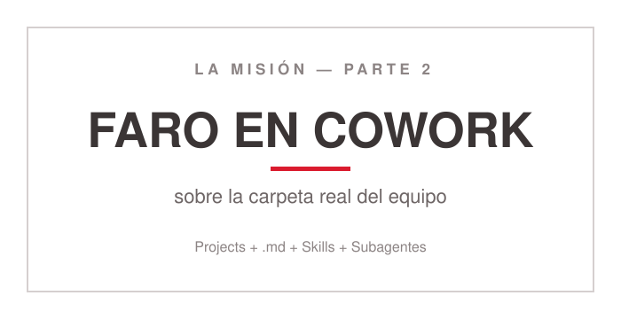
<!-- ascii-source:
   ______________________________________________
  |                                              |
  |   LA MISION - PARTE 2                        |
  |                                              |
  |   FARO EN COWORK                             |
  |   sobre la carpeta real del equipo           |
  |                                              |
  |   Projects + .md + Skills + Subagentes       |
  |______________________________________________|
-->
<!-- ascii-note:
intent: placa divisoria de misión, gemela de la placa de la parte 1 que va en la clase anterior. Cartel, no diagrama de flujo: manda a resolver la parte 2 en Cowork con las piezas recién enseñadas.
emphasize: "LA MISION - PARTE 2" arriba y "FARO EN COWORK" en el centro, en el tipo más grande de la placa; el mismo diseño que la placa de la parte 1 de la clase anterior.
labels: arriba = LA MISION, PARTE 2; centro = FARO EN COWORK (sobre la carpeta real del equipo); abajo = Projects, archivos .md, Skills y Subagentes.
-->

- **Parte 2, en Cowork:** Faro baja a la computadora y trabaja sobre la carpeta real del equipo.
- Las piezas de esta mitad: **Projects, Instrucciones, archivos `.md`, Skills y Subagentes.**
- El entregable final es **el tablero para el jefe**: se arma en `.md` y se exporta al formato de entrega, con el flujo de la sección 2.
- **No hace falta haber resuelto la parte 1** de la clase anterior: la parte 2 arranca del material que ya viene con la misión.

### Sources

- `missions/CoWork/mission.md`, tabla "Las dos partes" y la nota "La Parte 2 no exige la Parte 1 resuelta": arranca de los materiales incluidos, la herencia del pasante en `reportes/`.
- "corpus/mision - auto.zip.md", el flujo de Faro en Cowork: carpeta del Project, reporte consolidado y Skills reutilizables.

### Speaker notes

Placa de misión con el mismo formato que la de la parte 1 de la clase anterior, para que se lea como el cierre del arco entero. Llega después de las conclusiones, así que la charla ya cerró y esto es la consigna con la que se van. Acá ya están todas las piezas sobre la mesa. Decir qué cambia respecto de la parte 1: Faro deja de vivir en el chat y pasa a trabajar sobre la carpeta real del equipo, con su Project, sus Instrucciones, sus archivos `.md` y sus Skills. Nombrar el entregable con el que cierra la misión, el tablero que se le lleva al jefe, y decir de dónde sale: no es una pieza nueva, se arma con el flujo de la sección 2, se consolida en `.md` mientras el trabajo está abierto y recién al final se le pide a Claude el formato de entrega. Decirlo con todas las letras, porque ahora importa más que antes: **la parte 2 no exige tener resuelta la parte 1**, que quedó como tarea de la clase anterior. Arranca del material incluido en la misión, la pila de notas en crudo que dejó el pasante, así que quien no la hizo entra igual. Si alguien sí viene de la parte 1, los conectores ya autorizados se reutilizan y el arranque es más corto. Cerrar la clase mandando al material de la misión y dejar la placa proyectada durante el Q&A. Tiempo objetivo: ~2 min.

---

# Open questions
