# Thesis

**Claim:** La charla parte del chat de IA de uso diario y lo extiende paso a paso, con conectores para que vea el mundo real del usuario y Schedule para que trabaje solo. El destino es Claude Cowork, donde ese mismo agente trabaja sobre carpetas y archivos reales y cambia por completo la forma de trabajar: el usuario delega resultados combinando sus piezas (archivos .md, Projects, Instrucciones, Skills y Subagentes) sin escribir una línea de código.

**Why it matters:** Un agente se vuelve útil en el trabajo real cuando se le delega un resultado completo y se guía su proceso, en vez de chatearle un mensaje por vez. Quien domina esa forma de delegar automatiza horas de trabajo manual con la barrera de entrada en cero, y el camino empieza en la herramienta de uso diario.

---

# Agenda

**Narrative arc:** La Introducción encuadra la clase: qué se propone (Claude Desktop - Chat & Cowork: usar las dos caras de la app de escritorio para automatizar tareas y analizar datos en el trabajo diario), quién es Anthropic, los cuatro sabores de Claude (Code, Cowork, Chat/Web, Design) y cómo se relacionan sus tres superficies (1). De ahí baja a la superficie que la audiencia ya usa, el chat, y explicita su límite: responde de memoria de entrenamiento; cierra nombrando las dos capacidades que lo extienden, Conectores y Search (2). Los conectores se abren en profundidad como concepto transversal a todas las IAs: qué son, cómo además de traer información actúan sobre el mundo del usuario, dos casos concretos (el conector de búsqueda web y Claude in Chrome, con su cuidado de prompt injection) y la división entre los conectores que vienen listos y los externos, que se conectan por MCP (3). Con el chat extendido, Schedule lo vuelve proactivo: describir un trabajo una vez, fijar cadencia y saber dónde corre (4). Una placa divisoria presenta la misión que hilvana el resto, Faro, el analista de mercado virtual de la empresa Atlas, y manda a resolver su parte 1 con lo ya visto (5). Recién ahí llega el salto grande, Claude Cowork instalado en la computadora, con su superpoder como herramienta de propósito general, el paso de chatear a delegar, el mapa de piezas y el primer contacto con la interfaz (6). Las piezas se recorren una por una en secciones propias: los archivos .md como formato de trabajo y entrega (7), Projects como espacio de trabajo sobre carpetas reales, con las Instrucciones como contrato de comportamiento dentro de ese espacio (8), Skills para enseñar una vez (9) y Subagentes para delegar en paralelo (10). Una segunda placa gemela manda a resolver la parte 2 de la misión, ya en Cowork y sobre la carpeta real del equipo (11). El cierre recorre el loop completo de Faro y las advertencias de gobernanza antes de Q&A.

**Sections (in delivery order):**

- 1. Introducción
- 2. Claude Chat (Desktop)
- 3. Conectores
- 4. Schedule
- 5. La misión · parte 1
- 6. Claude Cowork
- 7. Knowledge & Output
- 8. Projects
- 9. Skills
- 10. Subagentes
- 11. La misión · parte 2

---

# 1. Introducción

**Goal of this section:** Ubicar el terreno antes de arrancar: qué se propone la clase, quién construye la herramienta y qué es Claude Desktop, con sus superficies y sus sabores.

---

## 1. Qué vamos a hacer hoy

### Content

- **Claude Desktop - Chat & Cowork**: esta charla arranca en el chat de IA que la audiencia ya usa a diario y lo lleva un paso más allá.
- El foco es concreto: usar esas dos superficies para automatizar tareas y analizar datos en el trabajo de todos los días.
- Todo lo que sigue construye, pieza por pieza, hacia ese objetivo.

### Sources

- (slide organizativa de la clase; sin claims de producto.)

### Speaker notes

Abrir la clase con esta slide antes de bajar al detalle: un minuto para decir de qué se trata todo lo que sigue. El foco de la charla, y el título con el que abre la portada, es Claude Desktop - Chat & Cowork: empezar a usar las dos caras de la app de escritorio para automatizar tareas y analizar datos en el trabajo real. El resto de la charla arma esa capacidad pieza por pieza. Tiempo objetivo: ~1-2 min.

---

## 2. Quién es Anthropic

### Content

- **Anthropic** es una empresa de IA (Public Benefit Corporation) fundada en enero de 2021 por Dario y Daniela Amodei junto a un equipo de ex investigadores de OpenAI.
- Misión declarada: desarrollo responsable de IA, con foco fuerte en sistemas confiables, interpretables y dirigibles ("steerable").
- **Claude** es la familia de modelos de Anthropic, diseñada bajo el criterio "útil, inofensivo y honesto" (helpful, harmless, honest).

### Sources

- Anthropic, company page: https://www.anthropic.com/company; "Anthropic is an AI safety and research company... building reliable, interpretable, and steerable AI systems"; Anthropic es una Public Benefit Corporation (verificado 2026-07-30).
- Wikipedia, "Anthropic": https://en.wikipedia.org/wiki/Anthropic; fundación en enero de 2021 por siete ex empleados de OpenAI, entre ellos Dario y Daniela Amodei (verificado 2026-07-30; fuente secundaria para el dato de fundación, no cubierto en detalle por la company page oficial).

### Speaker notes

Slide de contexto, corta: quién está detrás de la herramienta que van a usar toda la charla. Anthropic se fundó en 2021, con los hermanos Amodei entre sus fundadores, varios venidos de OpenAI. Es una Public Benefit Corporation: su estatuto la obliga a perseguir el desarrollo responsable de la IA, no solo el retorno financiero. Claude es su familia de modelos, con el criterio de diseño "útil, inofensivo y honesto". No hace falta profundizar en historia corporativa; alcanza con ubicar quién construye lo que van a usar. Tiempo objetivo: ~2 min.

---

## 3. Las cuatro herramientas de Claude

### Content

- **Claude Code**: CLI agéntico para developers. Coding de punta a punta.
- **Claude Cowork**: Claude instalado en la computadora, para quien no programa. Gestión de archivos y automatización del trabajo de oficina. *El ángulo de esta charla.*
- **Claude Chat/Web** (claude.ai): el asistente conversacional de uso diario, para cualquier usuario.
- **Claude Design**: prototipos, mockups y slides a partir de una idea, para quien no tiene formación de diseño (founders, product managers).

### Sources

- Anthropic, Claude Cowork (product page): https://www.anthropic.com/product/claude-cowork; "built on the very same foundations as Claude Code" (ya citada en la Sección 6).
- Anthropic, Introducing Claude Design by Anthropic Labs: https://www.anthropic.com/news/claude-design-anthropic-labs; lanzamiento en research preview, abril de 2026; "lets you collaborate with Claude to create polished visual work like designs, prototypes, slides, one-pagers, and more"; pensado para quien no tiene trasfondo de diseño (founders, product managers, marketers) (verificado 2026-07-30).
- corpus/agentic-ai-deck.zip.md, "Same engine. Different surface." (distinción Code vs Cowork; slide 7.1).

### Speaker notes

El catálogo rápido, antes de entrar en el mapa técnico de la próxima slide. Cuatro sabores, cuatro públicos: Code para quien programa, en la terminal; Cowork para quien no programa, instalado en la computadora, el ángulo de esta charla; Chat/Web el asistente de uso diario en claude.ai, para cualquiera; Design, el más nuevo (research preview de abril de 2026), para armar prototipos, mockups y slides sin formación de diseño. No hace falta demo acá; es el mapa antes de elegir dónde se para la charla. Tiempo objetivo: ~3 min.

---

## 4. El mismo motor, tres formas de usarlo

### Content

- Ya vimos los sabores de Claude. Acá el mapa de cómo se relacionan sus tres superficies:
- **Mismos modelos Claude** en las tres caras; **Code y Cowork** comparten además la misma base técnica. Web/Chat = superficie de chat.
- **Web/Chat**: navegador, tareas puntuales. *El punto de partida de la charla.*
- **Claude Code**: terminal; developers.
- **Cowork**: Claude Code hecho para ofimática y tareas que no tratan de programar. GUI de escritorio, trabajo multipaso sobre archivos reales. *El foco del resto de la charla.*

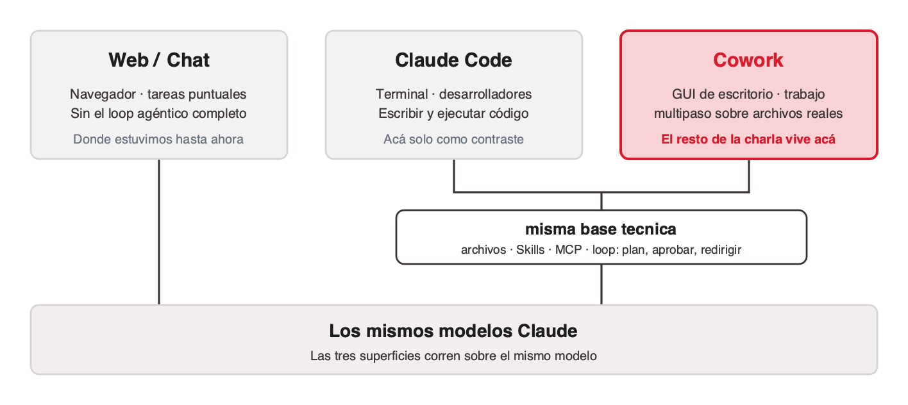
<!-- ascii-source:
+----------------+   +----------------+   +----------------+
|   Web / Chat   |   |  Claude Code   |   |     Cowork     |
| superficie de  |   | terminal+Code  |   |  GUI, escritorio|
|   chat         |   | escribir codigo|   | trabajo multipaso|
+----------------+   +----------------+   +----------------+
        |              \________  ________/
        |                  misma base tecnica
        |                  archivos / Skills / MCP / loop
        \________________   |   ________________/
                         \  |  /
                  +--------------------+
                  | MISMOS MODELOS     |
                  |     CLAUDE         |
                  +--------------------+
-->
<!-- ascii-note:
intent: mostrar que las tres superficies corren sobre los mismos modelos Claude, y que Code+Cowork además comparten la misma base técnica, mientras Web/Chat es la superficie de chat de ese modelo.
emphasize: la caja base "MISMOS MODELOS CLAUDE" como cimiento de las tres; el lazo "misma base técnica" que une Claude Code y Cowork (no Web/Chat); resaltar Cowork como el foco de la charla.
labels: tres columnas (Web/Chat = chat, Claude Code y Cowork = misma base técnica) sobre una base de modelos Claude compartida.
-->

### Sources

- corpus/agentic-ai-deck.zip.md, "Same engine. Different surface." (key claims; slide 7.1 "Claude Code vs Cowork — the close").
- "corpus/mision - auto.zip.md", framing de arquitectura Cowork (local, GUI, sin terminal).
- Anthropic, Claude Cowork (product page): https://www.anthropic.com/product/claude-cowork; "built on the very same foundations as Claude Code" (confirma que Cowork comparte base con Claude Code).
- Anthropic Engineering, Building agents with the Claude Agent SDK: https://www.anthropic.com/engineering/building-agents-with-the-claude-agent-sdk; el engine de agente común (Agent SDK) sobre el que se construyen Claude Code y Cowork.

### Speaker notes

Abrir conectando con la slide anterior, los sabores de Claude: mismo agente, tres caras; ahora se muestra cómo se relacionan entre sí. Es el mismo agente con tres caras; cambia la superficie y para quién está pensada. El matiz técnico, para decir y no para la slide: Cowork está construido sobre las mismas bases que Claude Code (el Claude Agent SDK), así que Code y Cowork comparten el mismo engine de agente, con los mismos archivos, las mismas Skills, el mismo MCP y el mismo loop de plan, aprobar y redirigir. Web/Chat es ese mismo modelo en una superficie de chat, sin el loop agéntico completo. Dejar claro que el resto de la charla vive en Cowork, la cara para quien no vive en una terminal. Claude Code aparece solo como contraste; no entramos en sus internals. Tiempo objetivo: ~5 min.

---

# 2. Claude Chat (Desktop)

**Goal of this section:** Partir de la superficie que la audiencia ya usa a diario, el chat, y hacer explícito su límite: responde desde su memoria de entrenamiento, con información desactualizada, riesgo de alucinación y cero acceso a los datos y apps del usuario. Cierra nombrando las dos capacidades que lo extienden: Conectores y Search.

---

## 1. El chat responde de memoria

### Content

- El chat de IA ya es una herramienta de uso diario.
- De fábrica responde de su **memoria de entrenamiento**: una foto que llega hasta la **fecha de entrenamiento**. No busca información nueva.
- Tres límites:
  - **Información vieja**: lo posterior al corte no existe.
  - **Alucinación**: inventa con confianza.
  - **No ve el mundo del usuario**: mails, calendario, archivos, apps.


<!-- ascii-source:
        EL CHAT "COMO VIENE DE FABRICA"
                                             lo que NO ve:
   +---------------------------------+       x  noticias de hoy
   |            CHAT DE IA           |       x  los mails
   |  +---------------------------+  |       x  el calendario
   |  |  MEMORIA DE ENTRENAMIENTO |  |       x  los archivos
   |  |  (foto congelada hasta la |  |       x  las apps del trabajo
   |  |   fecha de entrenamiento) |  |
   |  +---------------------------+  |
   |     responde "de memoria"       |
   +---------------------------------+
-->
<!-- ascii-note:
intent: mostrar que el chat de IA sin extensiones responde solo desde su memoria de entrenamiento (foto congelada hasta la fecha de entrenamiento) y no tiene acceso al mundo del usuario.
emphasize: la caja interna "MEMORIA DE ENTRENAMIENTO (foto congelada)"; la lista de lo que NO ve (noticias de hoy, mails, calendario, archivos, apps) fuera de la caja.
labels: caja exterior = CHAT DE IA; caja interior = memoria de entrenamiento / fecha de entrenamiento; columna derecha = lo que no ve.
-->

### Sources

- Anthropic Support, Enabling and using web search: https://support.claude.com/en/articles/10684626-enabling-and-using-web-search; el encuadre oficial: sin búsqueda web, Claude responde limitado a su información de entrenamiento; la búsqueda le da acceso a información actual (referencia también para la Sección 3).
- (concepto general de LLM: fecha de corte / respuestas desde entrenamiento / alucinaciones; material introductorio estándar del curso; sin claim específico de producto.)

### Speaker notes

Arrancar desde lo conocido: pedir a mano alzada quién usó un chat de IA esta semana. Van a levantar la mano casi todos (ChatGPT, Gemini, Claude). La idea a instalar: ese chat, tal como viene, responde de memoria. Cuando le preguntás no busca nada; recuerda lo que leyó hasta su fecha de entrenamiento (knowledge cutoff). Un colega brillante que leyó muchísimo hasta una fecha y desde entonces está incomunicado. Tres consecuencias que ya sufrieron sin saberlo. Una, datos viejos: precios, noticias, versiones de software y papers posteriores al corte no existen para el modelo. Dos, inventos con cara de verdad: cifras, citas y referencias que suenan perfectas y son falsas (insistir en verificar toda salida). Tres, la más limitante para el trabajo real: no ve nada tuyo, ni mails, ni calendario, ni archivos, ni apps. Ese tercer límite abre la charla: ¿y si pudiéramos conectarlo? Tiempo objetivo: ~6 min.

---

## 2. Lo que viene: conectores y búsqueda

### Content

- El chat de memoria tiene un techo. Dos capacidades lo extienden y recorren el resto de la charla.
- **Conectores**: el chat deja de estar aislado y accede a fuentes reales (web, mail, calendario, documentos), y hasta actúa.
- **Search**: el primer conector, el más universal, ya integrado en casi todos los chats. Trae información actual y cita sus fuentes.
- Los dos conceptos se profundizan en la próxima sección.

### Sources

- Anthropic Support, Enabling and using web search: https://support.claude.com/en/articles/10684626-enabling-and-using-web-search; ya citada en esta sección y desarrollada en la Sección 3.
- Claude blog, Connectors directory: https://claude.com/blog/connectors-directory; el catálogo oficial de conectores de Claude, desarrollado en la Sección 3.

### Speaker notes

Slide puente, corta a propósito: recién vimos que el chat de memoria tiene un techo; acá se nombra, sin desarrollar, lo que lo levanta. Dos ideas para instalar antes de seguir: Conectores (el chat deja de estar aislado) y Search (el primero y más universal de los conectores). La Sección 3 recién ahí los abre en profundidad, con demo incluida. No adelantar contenido de esa sección; el objetivo de esta slide es solo nombrar el mapa. Tiempo objetivo: ~2 min.

---

# 3. Conectores

**Goal of this section:** Instalar el concepto de conector, válido para todas las IAs: con conectores, el chat consulta información real (búsqueda web, mail, calendario) y también actúa sobre el mundo del usuario (mandar mails, agendar reuniones); sin ellos, responde de memoria. Sobre esa base, dos casos concretos (el conector de búsqueda web y Claude in Chrome, con su cuidado de seguridad) y la división entre los conectores que vienen listos y los externos, que se conectan por MCP.

---

## 1. Qué es un conector

### Content

- **Conector** = extensión que conecta el chat a un sistema externo: web, mail, calendario, documentos.
- Vale igual en ChatGPT, Gemini y Claude.
- **Chat solo** → responde de memoria. **Chat con conectores** → consulta fuentes reales antes de responder.
- Se activa a través de la biblioteca de conectores. Muchos requieren autenticación.

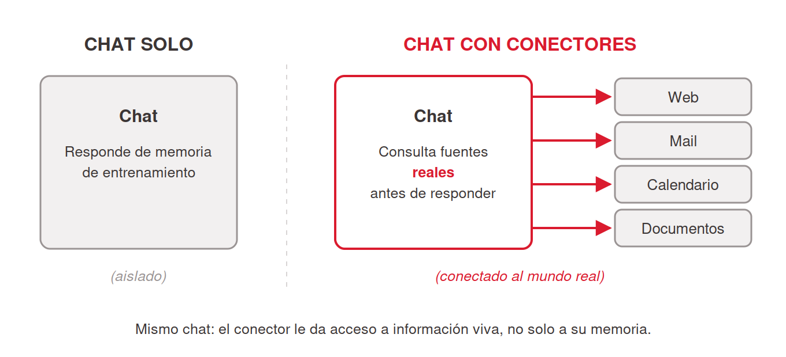
<!-- ascii-source:
   CHAT SOLO                        CHAT CON CONECTORES
+----------------+              +----------------+
|     CHAT       |              |     CHAT       |----&gt; [ web ]
|  responde de   |              |  consulta      |----&gt; [ mail ]
|  memoria de    |              |  fuentes       |----&gt; [ calendario ]
|  entrenamiento |              |  REALES antes  |----&gt; [ documentos ]
+----------------+              |  de responder  |
   (aislado)                    +----------------+
                                  (conectado al mundo real)
-->
<!-- ascii-note:
intent: contrastar lado a lado el chat aislado (responde de memoria de entrenamiento) contra el chat con conectores (consulta fuentes reales; web, mail, calendario, documentos; antes de responder).
emphasize: el lado derecho con las flechas hacia web/mail/calendario/documentos; la etiqueta "(conectado a tu mundo)" vs "(aislado)".
labels: izquierda = CHAT SOLO (aislado, memoria de entrenamiento); derecha = CHAT CON CONECTORES (web, mail, calendario, documentos).
-->

### Sources

- Anthropic Support, Enabling and using web search: https://support.claude.com/en/articles/10684626-enabling-and-using-web-search; la búsqueda web como capacidad integrada del chat de Claude.
- Claude blog, Connectors directory: https://claude.com/blog/connectors-directory; el catálogo oficial de conectores de Claude (referencia ampliada en la slide 3.7; verificado 2026-07-09).

### Speaker notes

La slide instala el concepto que ordena la sección: un conector saca al chat de su aislamiento y le da acceso a buscar en la web, leer mail, ver calendario, consultar documentos. Repetir que es transversal: vale para ChatGPT, Gemini y Claude. Los nombres cambian ("connectors", "apps", "extensiones"), la idea es la misma. Usar el diagrama para el contraste: mismo chat, ahora con líneas hacia afuera, y antes de responder puede ir a buscar información a la fuente (la web, inbox, agenda). Cerrar bajando la barrera de entrada: esto se activa desde la configuración o desde la biblioteca de conectores; algunos conectores piden autenticación. Tiempo objetivo: ~5 min.

---

## 2. Los conectores también actúan

### Content

- Además de traer info, un conector expone **acciones**: la IA **hace**.
- Ejemplos:
  - **Mandar / dejar redactado un mail** (borrador en Gmail).
  - **Agendar una reunión** (evento en el calendario).
  - **Abrir un ticket** (Jira, ServiceNow…).
  - **Mandar un mensaje** (Slack o similar).
- Cuidado con las autorizaciones y los permisos. **Un mail enviado sin revisión humana puede generar muchos problemas.**

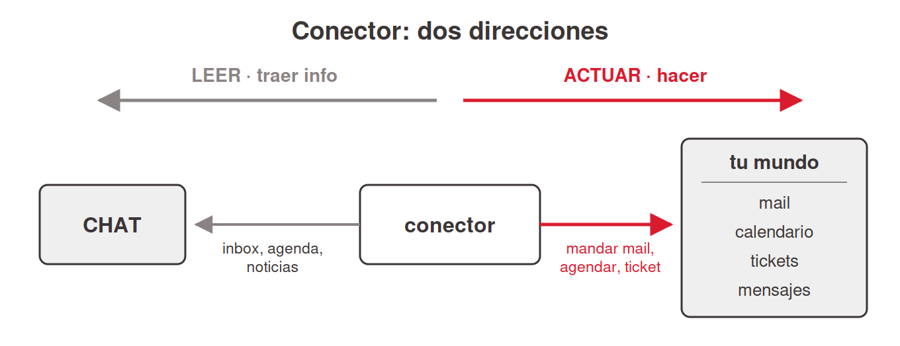
<!-- ascii-source:
        CONECTOR: dos direcciones

   LEER (traer info)          ACTUAR (hacer)
   <------------------        ------------------&gt;
+------+           +----------+           +----------+
| CHAT |  <------- | conector |  ------&gt;  | el mundo |
+------+   inbox,  +----------+  mandar   | mail     |
           agenda,              mail,     | calendario|
           noticias             agendar,  | tickets  |
                                ticket    | mensajes |
                                          +----------+
-->
<!-- ascii-note:
intent: mostrar que un conector funciona en dos direcciones: leer (traer información: inbox, agenda, noticias) y actuar (ejecutar acciones: mandar mail, agendar reunión, abrir ticket, mandar mensaje).
emphasize: las dos flechas opuestas LEER vs ACTUAR sobre el mismo conector; que ACTUAR es la capacidad ejecutiva nueva de esta slide.
labels: izquierda = CHAT; centro = conector; derecha = tu mundo (mail, calendario, tickets, mensajes); flecha de lectura y flecha de acción.
-->

### Sources

- Model Context Protocol, https://modelcontextprotocol.io; el estándar define herramientas que ejecutan acciones sobre sistemas externos, no solo lectura: "AI applications ... which can access your data and take actions on your behalf" (verificado 2026-07-09).
- Anthropic Support, Getting started with custom connectors using remote MCP: https://support.claude.com/en/articles/11175166-getting-started-with-custom-connectors-using-remote-mcp; los conectores permiten a Claude "access and take action in these services" (verificado 2026-07-09).
- "corpus/mision - auto.zip.md", el connector de Gmail **deja un borrador de correo** para el equipo (capacidad ejecutiva en acción, M3 y loop final).
- Verificación de primera mano del presentador (2026-07-09): la acción de **agendar/crear eventos vía el connector de Calendar** está chequeada y funciona.
- corpus/agentic-ai-deck.zip.md, Connectors como "las manos" del agente (tocar sistemas, no solo leerlos).

### Speaker notes

Segunda idea de la sección, pegada a la definición: el conector no se queda en traer información, también ejecuta acciones sobre los sistemas conectados. Recorrer los cuatro ejemplos (mail, reunión, ticket, mensaje), comunes a cualquier trabajo. Dos están verificados de primera mano: el borrador de Gmail (misión de Faro) y agendar por Calendar, que el docente chequeó y puede demostrar en vivo. Tickets y mensajes se presentan como capacidad del ecosistema (el estándar MCP y los conectores lo permiten), sin prometer un conector puntual que no probamos. Balancear con el control: nada de esto pasa sin que hayas conectado y autorizado el servicio. La práctica sana mientras aprenden es "borrador, no envío directo"; Faro hace eso, deja el borrador en Gmail y no lo manda. Cerrar anunciando que las dos slides que siguen bajan a casos concretos, empezando por el conector que ya tienen. Tiempo objetivo: ~6 min.

---

## 3. Caso 1: Web Search Connector

### Content

- El conector más universal: viene en casi todos los chats (Claude, ChatGPT, Gemini). Se activa con un toggle.
- **Dos modos de responder:**
  - **De memoria** → recuerda hasta la fecha de entrenamiento. Puede estar viejo o mal.
  - **Con búsqueda** → busca información real, actualizada, y **cita fuentes**.
- El "buscando..." y las fuentes citadas marcan el punto de verificación.
- Regla: si la respuesta pudo cambiar → búsqueda obligada.

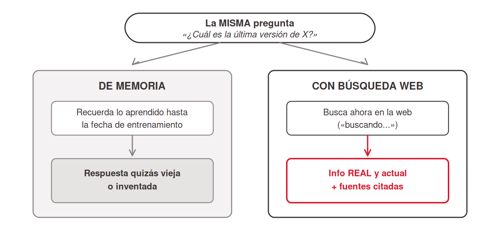
<!-- ascii-source:
   la MISMA pregunta: "¿ultima version de X?"

   DE MEMORIA                        CON BUSQUEDA WEB
+------------------+             +------------------+
| entrenamiento    |             | busca ahora en   |
| hasta fecha de   |             | la web           |
| entrenamiento    |             |   |              |
|   |              |             |   v              |
|   v              |             | info REAL y      |
| respuesta        |             | actual + fuentes |
| (quizas vieja o  |             | citadas          |
|  inventada)      |             +------------------+
+------------------+
-->
<!-- ascii-note:
intent: contrastar, para una misma pregunta, la respuesta de memoria de entrenamiento (posiblemente vieja o inventada) contra la respuesta con búsqueda web (información real y actual, con fuentes citadas).
emphasize: que es la MISMA pregunta con dos caminos; el lado derecho termina en "info REAL y actual + fuentes citadas"; el lado izquierdo en "quizás vieja o inventada".
labels: izquierda = DE MEMORIA (fecha de entrenamiento); derecha = CON BÚSQUEDA WEB (busca ahora, cita fuentes).
-->

### Sources

- Anthropic Support, Enabling and using web search: https://support.claude.com/en/articles/10684626-enabling-and-using-web-search; "Web search expands Claude's knowledge with real-time data"; "Every response includes citations, so you can easily verify sources yourself" (verificado 2026-07-09).
- OpenAI Help, ChatGPT search: https://help.openai.com/en/articles/9237897-chatgpt-search; búsqueda web integrada en ChatGPT, automática cuando la pregunta lo amerita, con citas inline (evidencia de que el concepto es transversal; verificado 2026-07-09).

### Speaker notes

Acá se fija la distinción memoria vs información viva. Con conexión, hacerlo en demo de 2 minutos: la misma pregunta ("¿cuál es la última versión de X?" o "¿qué pasó ayer con Y?") con búsqueda apagada y prendida, y comparar. Señalar el indicador de "buscando..." y las fuentes citadas; enseñarles a mirar eso cada vez. Es el conector más fácil de activar (un toggle en la configuración; en varios chats ya viene activo por defecto). La regla práctica que se llevan: si la respuesta pudo haber cambiado desde el entrenamiento (precios, noticias, versiones, papers, normativa), exigí búsqueda. Arrancamos por este conector porque ya lo tienen; falta saber cuándo está actuando. Tiempo objetivo: ~7 min (con demo).

---

## 4. Caso 2: Claude in Chrome

### Content

- **Claude in Chrome**: una extensión de Chrome. Claude abre un panel al costado de la página y ve lo mismo que ve el usuario.
- Trabaja dentro de la sesión del navegador ya iniciada, en los sitios donde el usuario ya está identificado.
- Qué hace ahí: navega, hace clic, completa formularios y encadena varios pasos entre pestañas.
- Trae conocimiento incorporado de **Slack, Google Calendar, Gmail, Google Docs y GitHub**, así que responde a un pedido en lenguaje corriente ("agendá una reunión").
- Se habilita desde Connectors en Claude Desktop, como cualquier otro conector.
- Disponibilidad: planes pagos (Pro, Max, Team, Enterprise), solo en Chrome de escritorio.

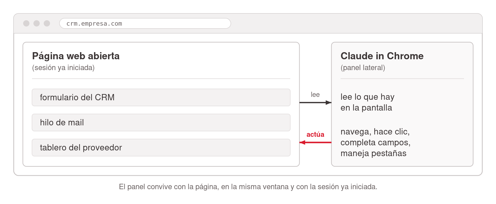
<!-- ascii-source:
   PAGINA WEB ABIERTA          CLAUDE IN CHROME
   (sesion ya iniciada)        (panel lateral)
+------------------------+   +--------------------+
|                        |   |                    |
|  formulario del CRM    |--&gt;| lee lo que hay     |
|  hilo de mail          |   | en la pantalla     |
|  tablero del proveedor |   |                    |
|                        |<--| navega, hace clic, |
|                        |   | completa campos,   |
+------------------------+   | maneja pestanas    |
                             +--------------------+
-->
<!-- ascii-note:
intent: mostrar que Claude in Chrome trabaja en un panel al costado de la página abierta, dentro de la sesión que el usuario ya tiene iniciada: lee lo que aparece en pantalla y ejecuta acciones sobre ese mismo sitio.
emphasize: las dos flechas opuestas (de la página hacia Claude = leer; de Claude hacia la página = actuar); que el panel convive con la página en la misma ventana.
labels: izquierda = página web abierta (sesión ya iniciada); derecha = Claude in Chrome (panel lateral), con lo que lee y lo que hace.
-->

### Sources

- Anthropic Support, Get started with Claude in Chrome: https://support.claude.com/en/articles/12012173-get-started-with-claude-in-chrome; "Claude in Chrome is a browser extension that allows Claude to read, click, and navigate websites alongside you"; panel lateral que acompaña la navegación; manejo de varias pestañas; "Claude has built-in knowledge of how to navigate popular platforms including Slack, Google Calendar, Gmail, Google Docs, and GitHub"; disponible en todos los planes pagos (Pro, Max, Team, Enterprise), solo en Chrome de escritorio ("not supported on other Chromium-based web browsers or mobile devices"); se habilita como conector desde Settings → Connectors en Claude Desktop (fuente oficial del proveedor; verificado 2026-07-30).

### Speaker notes

Segundo caso concreto, y el que más sorprende a esta audiencia. La idea a instalar: hasta acá el conector traía datos de un servicio; Claude in Chrome opera el navegador que el usuario ya tiene abierto, con las sesiones ya iniciadas. Por eso entra a sistemas que no tienen API ni integración: si el usuario puede hacerlo con el mouse, Claude puede hacerlo. Mostrar el panel lateral en la pantalla si hay conexión; con eso solo se entiende. Matiz de disponibilidad, para decir y no para la lámina: dentro del navegador está en beta, y ya es general dentro de Claude Cowork y Claude Code, así que la misma capacidad aparece en la app de escritorio como un conector más de la lista. El cuidado de seguridad viene en la próxima slide, después de los casos de uso; no adelantarlo acá. Tiempo objetivo: ~5 min.

---

## 5. Cuándo sirve Claude in Chrome

### Content

- **Cargar datos en un sistema web**: pasar al CRM o al ERP lo que llegó por mail o en una planilla, campo por campo.
- **Comparar proveedores**: precios y condiciones abiertos en varias pestañas, consolidados en un cuadro.
- **Coordinar agenda y correo**: leer el hilo, agendar la reunión en Google Calendar y dejar la respuesta escrita.
- **Relevar un portal que no exporta**: listados de precios, licitaciones o estados de pedido, volcados a una tabla.
- **Cuidado, prompt injection**: una página, un mail o un documento pueden traer instrucciones ocultas que Claude tome como pedidos del usuario.
- Anthropic lo documenta como riesgo vigente y recomienda sitios confiables, un perfil de navegador separado de las cuentas sensibles y revisión humana antes de aprobar cada acción.

### Sources

- Anthropic Support, Get started with Claude in Chrome: https://support.claude.com/en/articles/12012173-get-started-with-claude-in-chrome; completado de formularios y campos, consolidación entre varias pestañas, workflows multipaso que siguen corriendo en segundo plano, conocimiento incorporado de Gmail y Google Calendar (base de los cuatro casos; fuente oficial del proveedor; verificado 2026-07-30).
- Anthropic Support, Use Claude in Chrome safely: https://support.claude.com/en/articles/12902428-use-claude-in-chrome-safely; "The biggest risk facing browser-using AI tools is prompt injection attacks where malicious instructions hidden in web content (websites, emails, documents) could trick Claude into taking unintended actions"; clasificadores que revisan el contenido entrante y cada acción antes de ejecutarla; "the chances of an attack are still non-zero"; recomendaciones de sitios confiables, perfil de navegador separado y revisión de las acciones propuestas (fuente oficial del proveedor, que documenta el riesgo como abierto; verificado 2026-07-30).
- (los cuatro casos son adaptación del presentador al perfil de gestión de la audiencia, apoyados en las capacidades documentadas arriba; no son casos publicados por Anthropic.)

### Speaker notes

Los cuatro casos están elegidos para un perfil de gestión, no de desarrollo. El denominador común es un sitio web sin exportación ni integración y una tarea repetitiva de copiar y pegar. Preguntar a mano alzada quién carga datos a mano en un sistema interno: ahí aterriza el primer caso. El segundo es el que mejor muestra el manejo de varias pestañas a la vez. El tercero se apoya en que Claude ya sabe moverse dentro de Gmail y Google Calendar. El cuarto es el clásico portal del proveedor o del organismo público sin botón de exportar. Después de los cuatro, frenar y dar el cuidado con seriedad. Prompt injection es el riesgo central de cualquier IA que navegue, y lo documenta el propio Anthropic: una página o un mail pueden traer texto oculto con instrucciones, y Claude puede leerlas como si vinieran del usuario. Anthropic corre clasificadores que revisan el contenido entrante y cada acción antes de ejecutarla, y aun así aclara que el riesgo no es cero. La postura que enseña esta charla es la de siempre: sitios confiables, un perfil de navegador separado de las cuentas sensibles, y el humano aprueba antes de que se ejecute algo que importa. Tiempo objetivo: ~5 min.

---

## 6. Out of the box y externos

### Content

- Los conectores se dividen en dos familias, según quién los prepara.
- **Out of the box**: vienen listos con el producto. Búsqueda web, Claude in Chrome, Gmail, Google Calendar, Drive. Se activan desde la biblioteca de conectores.
- **Externos**: los conecta el equipo, contra los sistemas de la empresa o los de un tercero (CRM, ERP, una base interna).
- Todos los conectores externos se conectan por el **protocolo MCP**.
- Autorizar un conector externo le da acceso a los datos del usuario, así que conviene reservarlo para servicios confiables.

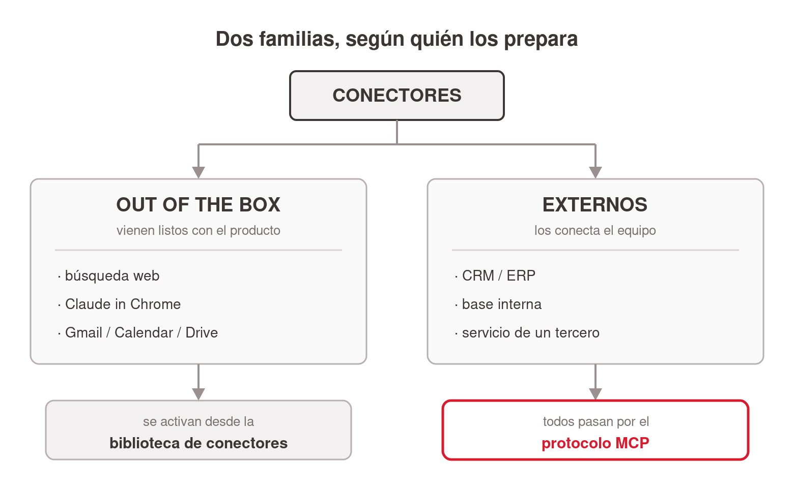
<!-- ascii-source:
                  CONECTORES
                       |
        +--------------+---------------+
        v                              v
  OUT OF THE BOX                   EXTERNOS
  vienen listos                    los conecta el equipo
  · busqueda web                   · CRM / ERP
  · Claude in Chrome               · base interna
  · Gmail / Calendar / Drive       · servicio de un tercero
        |                              |
        v                              v
  se activan desde la              todos por el
  biblioteca de conectores         protocolo MCP
-->
<!-- ascii-note:
intent: separar los conectores en dos familias según quién los prepara: los que vienen listos con el producto (out of the box) y los externos que conecta un equipo, y marcar que toda la rama externa pasa por el protocolo MCP.
emphasize: las dos ramas como categorías paralelas; el remate de cada rama (biblioteca de conectores a la izquierda, protocolo MCP a la derecha).
labels: raíz = CONECTORES; rama izquierda = OUT OF THE BOX (búsqueda web, Claude in Chrome, Gmail/Calendar/Drive); rama derecha = EXTERNOS (CRM/ERP, base interna, servicio de un tercero).
-->

### Sources

- Claude blog, Discover tools that work with Claude (Connectors directory): https://claude.com/blog/connectors-directory; el catálogo oficial de conectores listos para usar (verificado 2026-07-09).
- Anthropic Support, Use connectors to extend Claude's capabilities: https://support.claude.com/en/articles/11176164-use-connectors-to-extend-claude-s-capabilities; los conectores listos se activan desde la configuración de Claude.
- Anthropic Support, Getting started with custom connectors using remote MCP: https://support.claude.com/en/articles/11175166-getting-started-with-custom-connectors-using-remote-mcp; los conectores fuera del catálogo se agregan vía MCP y "allow you to connect Claude to services that have not been verified by Anthropic, and allow Claude to access and take action in these services" (verificado 2026-07-09).
- Model Context Protocol (sitio oficial del estándar): https://modelcontextprotocol.io; el protocolo por el que se conectan los servicios externos.

### Speaker notes

El ordenador mental de la sección: no todos los conectores salen del mismo lugar. Los out of the box vienen con el producto y el usuario solo los activa; los dos casos vistos hasta acá, búsqueda web y Claude in Chrome, están en esa familia, igual que Gmail, Calendar y Drive. Los externos son los que una empresa monta contra sus propios sistemas, y ahí aparece el estándar: todos hablan MCP. Para esta audiencia el mensaje es de rol. La familia out of the box la maneja cualquier usuario desde la biblioteca de conectores; la externa la arma un equipo técnico y después el usuario la usa desde el mismo lugar que las otras. Aclarar también el criterio de confianza, que cambia entre las dos: un conector del catálogo pasó por Anthropic, uno externo no. Las dos slides que siguen bajan a cada familia, una por vez. Tiempo objetivo: ~3 min.

---

## 7. Out of the box: dónde se buscan y cómo se conectan

### Content

- Flujo básico: **buscar + Connect + autorizar**. Como conectar Gmail a una app nueva.
- El **directorio oficial de Claude** lista los conectores listos para usar.


- Ejemplos guía: **mail y calendario**. "¿Qué mails me perdí ayer? ¿Qué tengo esta semana?"
- Faro: **MT Newswires** ya está en el directorio. El usuario pide "las noticias de YPF de esta semana" y el conector las trae.
- Un conector no oficial, al autorizarse, **accede a los datos del usuario**. Conectar solo fuentes confiables.

### Sources

- Claude blog, Discover tools that work with Claude (Connectors directory): https://claude.com/blog/connectors-directory; anuncio oficial del directorio; navegar y conectar de un clic vía claude.ai/directory (verificado 2026-07-09; el directorio en sí requiere login).
- Anthropic Support, Use connectors to extend Claude's capabilities: https://support.claude.com/en/articles/11176164-use-connectors-to-extend-claude-s-capabilities; cómo se conectan y usan los conectores desde la configuración.
- corpus/agentic-ai-deck.zip.md, matriz 5.6 (Connectors configurados por la Settings UI; directorio + un clic).
- "corpus/mision - auto.zip.md", MT Newswires "ya tiene un connector listo" (Step 2.1); Gmail connector de un clic (M3); "no estás programando: te conectás a un servicio que ya existe".
- Anthropic Support, Getting started with custom connectors using remote MCP: https://support.claude.com/en/articles/11175166-getting-started-with-custom-connectors-using-remote-mcp; la vía de los conectores no oficiales y la base del criterio de confianza: "allow you to connect Claude to services that have not been verified by Anthropic, and allow Claude to access and take action in these services" (verificado 2026-07-09).

### Speaker notes

Slide práctica de la familia out of the box. Mostrar las dos capturas (el directorio de conectores y la pantalla de conexión) para desarmar el "esto es técnico". Conectar un servicio implica buscarlo, tocar Connect y autorizarlo, igual que cuando conectás Gmail a cualquier app; se configura por la UI, sin archivo local que editar. Insistir en mail y calendario, los ejemplos guía de la sección: con Gmail conectado el chat lee y resume tu inbox, con Calendar ve tu agenda. Son preguntas que el chat aislado no puede responder. Sobre los no oficiales, que vienen en la próxima slide: mismos pasos, más criterio. Autorizar un conector le da acceso a tus datos; conectá solo lo confiable. Ejemplo de la misión: MT Newswires (noticias), con el que Faro lee noticias del día. Nota: las capturas son de la app de Claude (Cowork); el flujo buscar+Connect es el mismo en el chat. Tiempo objetivo: ~5 min.

---

## 8. External connectors: todo pasa por MCP

### Content

- **Conectores externos**: los que una empresa conecta contra sus propios sistemas o los de un tercero, fuera del catálogo listo para usar.
- Todos se conectan por **MCP** (Model Context Protocol), el estándar que traduce el pedido del usuario en llamadas al servicio conectado.
- Conectores = **las "manos"**: lo que la IA puede tocar que de otro modo no podría (Drive, Gmail, Calendar, Slack, bases de datos).
- Ejemplo: el usuario pide "los pedidos abiertos del cliente X" → el conector consulta el ERP de la empresa y devuelve la respuesta al chat.
- El equipo técnico expone un servidor MCP y ese servicio queda disponible como un conector más.
- Un chat que se informa y actúa puede trabajar **solo** (sección 4).

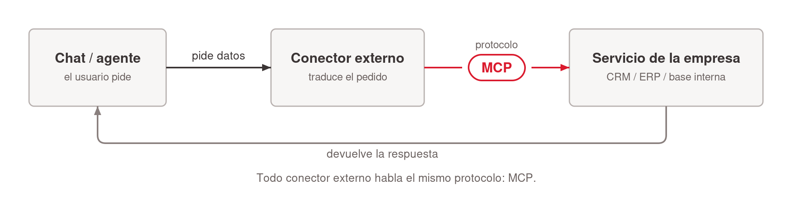
<!-- ascii-source:
+--------+   pide datos    +-----------+   protocolo   +----------------+
| CHAT / | --------------&gt; | Connector |  -- MCP --&gt;   | Servicio       |
| agente |                 |  externo  |               | CRM/ERP/base   |
+--------+ <-------------- +-----------+ <-----------  +----------------+
            devuelve datos
-->
<!-- ascii-note:
intent: mostrar el flujo de una llamada a un conector externo: el chat/agente pide datos, el conector traduce el pedido vía el protocolo MCP, el servicio de la empresa responde.
emphasize: la etiqueta "MCP" sobre la flecha del medio, como el estándar único de toda la familia externa; el conector como puente entre el chat y el servicio.
labels: Chat/agente -> Connector externo -> Servicio (CRM / ERP / base interna); flecha de ida "pide datos", flecha de vuelta "devuelve datos".
-->

### Sources

- corpus/agentic-ai-deck.zip.md, definición de Connector (MCP): "The hands"; slide 5.4 (rango de MCP; "any app that exposes an MCP server").
- Model Context Protocol (sitio oficial del estándar): https://modelcontextprotocol.io; qué es MCP y cómo las plataformas exponen herramientas; base de los conectores externos.
- Anthropic Support, Getting started with custom connectors using remote MCP: https://support.claude.com/en/articles/11175166-getting-started-with-custom-connectors-using-remote-mcp; los conectores fuera del catálogo se agregan vía MCP remoto.
- "corpus/mision - auto.zip.md", MT Newswires "ya tiene un connector listo" (Step 2.1); Gmail connector de un clic (M3).

### Speaker notes

Cierre técnico de la sección, sin asustar a nadie. La familia externa es la que una empresa arma contra sus propios sistemas, y toda ella pasa por el mismo estándar: MCP, el Model Context Protocol. Usar el diagrama para explicar qué pasa por debajo: el chat pide datos, el conector traduce ese pedido en llamadas al servicio, el servicio responde. El patrón se repite siempre: la plataforma expone sus acciones como herramientas y la IA las usa. Mencionar dos o tres ejemplos del ecosistema (Figma, Vercel, Cal.com, Home Assistant) y seguir. A nivel usuario alcanza con saber que la vía existe y que el equipo de sistemas puede armarla; nadie de esta clase va a escribir un servidor MCP. Los ejemplos guía de la sección siguen siendo mail y calendario, porque son los que la audiencia ya tiene. Cerrar sembrando la sección 4: un chat que se informa y actúa, más una cadencia fija, trabaja solo. Tiempo objetivo: ~6 min.

---

# 4. Schedule

**Goal of this section:** Que la audiencia entienda qué es Schedule (describir un trabajo una vez, fijar una cadencia, que corra sola), cómo se potencia con conectores (el resumidor semanal de mails) y la pregunta práctica antes de confiarle algo: ¿dónde corre? Local, con la computadora prendida, o nube. Todavía desde el mundo del chat.

---

## 1. Schedule

### Content

- **Schedule** = describir un trabajo una vez y fijarle una cadencia; el prompt se ejecuta solo, sin volver a pedirlo.
- El Schedule usa los **conectores** ya configurados (mail, web, calendario).
- El ejemplo: *"todos los días 8:00, resumí mi inbox, lo urgente arriba."*
- Existe en **ChatGPT** ("tasks") y en **Claude** (claude.ai, desde el navegador).

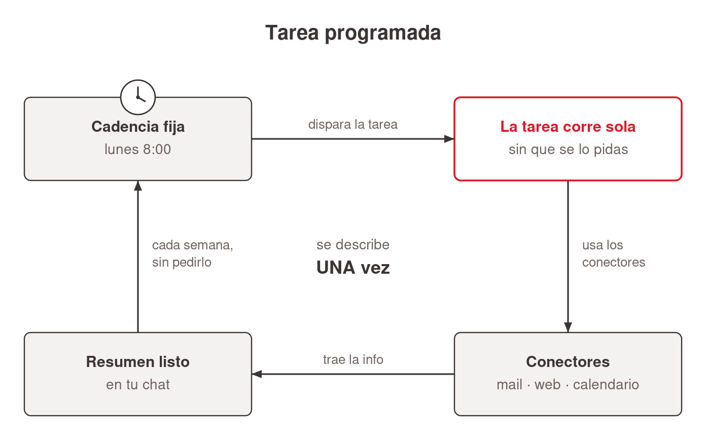
<!-- ascii-source:
        TAREA PROGRAMADA (se describe UNA vez)

  [reloj: lunes 8:00]
        |
        v
  +-----------+   usa conectores   +--------------+
  |  la tarea | -----------------&gt; | mail / web / |
  |  corre    | <----------------- | calendario   |
  |  sola     |    trae la info    +--------------+
  +-----------+
        |
        v
  resumen listo en el chat, cada semana,
  sin pedirlo de nuevo
-->
<!-- ascii-note:
intent: mostrar el ciclo de un Schedule: un disparador de calendario (lunes 8:00) ejecuta la tarea, que usa los conectores (mail/web/calendario) para traer información y deja el resultado listo sin intervención del usuario.
emphasize: que se describe UNA vez y corre sola; el reloj como disparador; el uso de conectores dentro de la corrida; el resultado que "aparece" cada semana.
labels: reloj (cadencia) -> la tarea corre sola -> conectores (mail/web/calendario) -> resumen listo en tu chat.
-->

### Sources

- OpenAI Help, Tasks in ChatGPT: https://help.openai.com/en/articles/10291617-tasks-in-chatgpt; tareas programadas en el chat de ChatGPT (evidencia transversal del concepto; verificado 2026-07-09).
- Anthropic Support, Release notes (entrada del 7 de julio de 2026): https://support.claude.com/en/articles/12138966; "scheduled tasks run with no device online"; sesiones remotas (beta); rollout empezando por Max (verificado 2026-07-09).
- Observación de primera mano del presentador (2026-07-09): tareas programadas activas en claude.ai en el navegador.
- TechCrunch (2026-07-07), "The coding agent wars are spilling into the rest of the office": https://techcrunch.com/2026/07/07/the-coding-agent-wars-are-spilling-into-the-rest-of-the-office-claude-cowork/; cobertura de prensa: expansión a web/mobile, corridas en background sin dispositivo activo, rollout Max (encuadre de terceros).
- Anthropic Support, Schedule recurring tasks in Claude Cowork: https://support.claude.com/en/articles/13854387-schedule-recurring-tasks-in-claude-cowork; la forma Cowork del Schedule.
- "corpus/mision - auto.zip.md", el flujo programado de Atlas (Step 3.3): la semilla del "resumidor que corre solo".

### Speaker notes

Slide-concepto de la sección, en dos mitades. Primera: describís el trabajo una vez, elegís cadencia (diaria, semanal, a demanda) y corre solo, avisándote con el resultado. Segunda: la tarea hereda tus conectores. El resumidor de mails funciona como ejemplo porque el inbox desbordado es un problema que la audiencia vive. Variante semanal: "los lunes a las 8:00, resumime la semana del calendario + los mails sin responder". Contarlo en primera persona si se puede ("mi resumen de las 8:00"). Marcar que existe en los dos mundos: ChatGPT lo llama "tasks" (recordatorios, briefings diarios, monitoreo) y Claude ya las ofrece en claude.ai desde el navegador. Si el rollout lo permite, mostrarlas EN VIVO desde la cuenta del docente, que ya las usa. La pregunta de dónde corre la tarea (nube o local, computadora prendida) viene en la próxima slide; no adelantarla. Tiempo objetivo: ~6 min.

---

## 2. ¿Dónde corre? Local o nube

### Content

- Antes de confiarle algo a un Schedule: **saber dónde corre**.
- **Nube** (lo nuevo, julio 2026): corre **sin la computadora prendida**. Beta, rollout gradual, Max primero.
- **Local**: la computadora **prendida** y la app **abierta**.
- Cuidados del modo local:
  - Apagada/suspendida a la hora → la tarea **se saltea** y corre al volver.
  - Las laptops **se suspenden solas** (config de energía).
- Los Schedule que usan **archivos o apps locales** → corren local **siempre**.

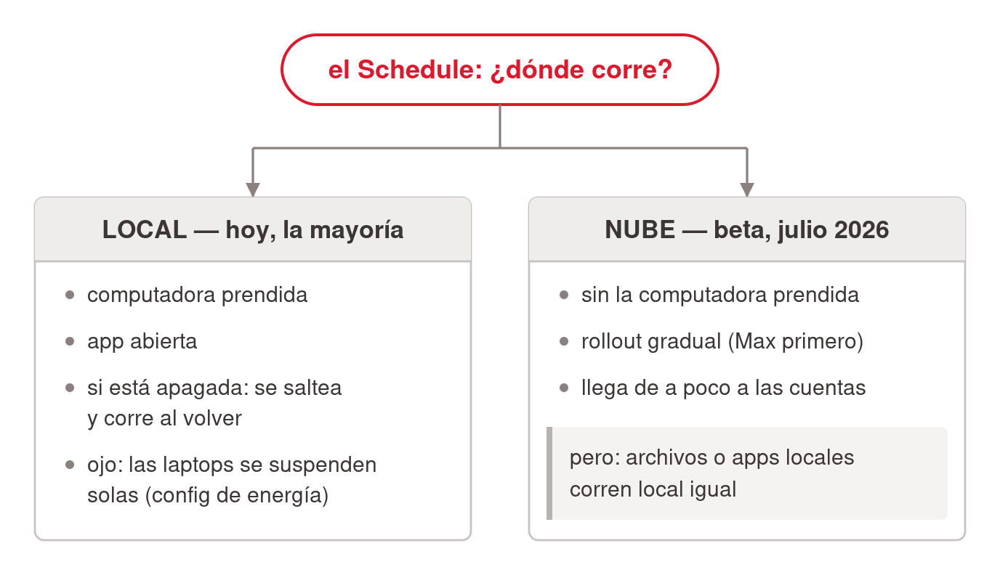
<!-- ascii-source:
   el Schedule: ¿DONDE corre?
              |
      +-------+----------------------+
      v                              v
  LOCAL (hoy, la mayoria)      NUBE (beta, jul 2026 ->)
  · computadora prendida       · sin computadora prendida
  · app abierta                · rollout gradual (Max 1ro)
  · apagada => se saltea,      · PERO: archivos/apps
    corre al volver              locales => local igual
  · ojo laptops suspendidas
-->
<!-- ascii-note:
intent: mostrar la bifurcación práctica de un Schedule según dónde corre: LOCAL (computadora prendida + app abierta; si está apagada se saltea y corre al volver; cuidado con laptops que se suspenden) vs NUBE (sin computadora prendida, beta desde julio 2026, rollout Max primero; excepción: tareas con archivos/apps locales corren local igual).
emphasize: la bifurcación como pregunta ("¿DÓNDE corre?"); en LOCAL los tres cuidados prácticos (prendida, app abierta, se saltea); en NUBE que no hace falta la computadora prendida pero es beta/rollout gradual, con la excepción de archivos locales.
labels: raíz = el Schedule ¿dónde corre?; rama izquierda = LOCAL (hoy, la mayoría) con cuidados; rama derecha = NUBE (beta, julio 2026) con condiciones.
-->

### Sources

- Anthropic Support, Schedule recurring tasks in Claude Cowork: https://support.claude.com/en/articles/13854387-schedule-recurring-tasks-in-claude-cowork; ejecución remota ("run on their cadence even when your computer is asleep or the Claude Desktop app is closed") y la excepción local: "If a scheduled task requires local files or apps, it will only run locally" (verificado 2026-07-09).
- Anthropic Support, Release notes (7 de julio de 2026): https://support.claude.com/en/articles/12138966; "scheduled tasks run with no device online"; beta, rollout gradual empezando por Max (verificado 2026-07-09).
- TechCrunch (2026-07-07): https://techcrunch.com/2026/07/07/the-coding-agent-wars-are-spilling-into-the-rest-of-the-office-claude-cowork/; corridas en background sin dispositivo activo, disponible primero para suscriptores Max (encuadre de terceros).
- Comportamiento local "se saltea y corre al volver": documentado en la versión anterior del artículo 13854387 (verificada en junio 2026, cuando la ejecución era solo local); la versión actual ya no lo detalla; mantenido como cuidado práctico del modo local, con esa atribución.

### Speaker notes

La slide del consejo práctico que pidió el presentador: "tengan en cuenta que la computadora esté prendida". Hoy conviven dos realidades y hay que enseñar las dos. Una: la ejecución en la nube existe desde el 7 de julio de 2026, la tarea corre sin tu computadora, pero es beta y llega de a poco, empezando por el plan Max. Dos: mientras a tu cuenta no le llegue, la tarea corre local. Computadora prendida y app abierta, o no corre. Los cuidados del modo local son los que la mayoría de la audiencia va a vivir este cuatrimestre. Si la computadora está apagada o suspendida a la hora programada, la corrida se saltea y se ejecuta al volver (comportamiento documentado cuando la ejecución era solo local; el artículo actual ya no lo detalla, decirlo como cuidado práctico y no como spec). Las laptops se suspenden solas; revisar la configuración de energía si el resumen de las 8:00 nunca aparece. Cerrar con la excepción que sobrevive incluso con nube: una tarea que necesita tus archivos o apps locales corre local siempre. Eso anticipa la sección 6, donde Cowork trabaja sobre carpetas y archivos reales. Antes de confiarle el reporte del lunes a una tarea, contestá "¿dónde corre esto?". Tiempo objetivo: ~5 min.

---

# 5. La misión · parte 1

**Goal of this section:** Primera de las dos placas de misión. Presenta a Faro, el analista de mercado virtual de Atlas, y manda a resolver la parte 1 con lo ya visto: el chat, los conectores y Schedule. Sin contenido nuevo.

---

## 1. La misión, parte 1: Faro en el chat

### Content

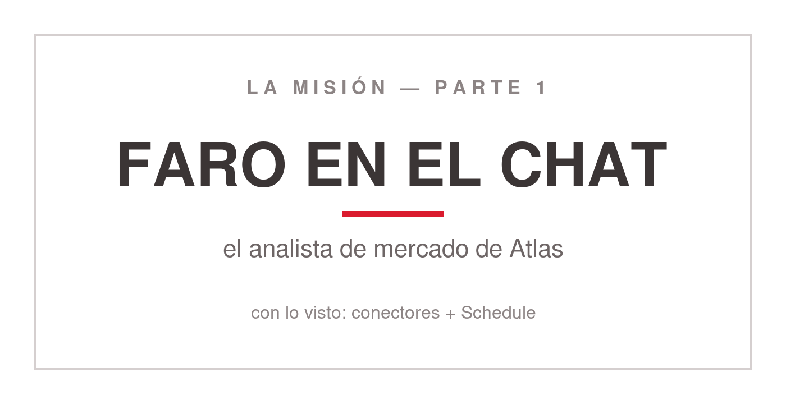
<!-- ascii-source:
   ______________________________________________
  |                                              |
  |   LA MISION - PARTE 1                        |
  |                                              |
  |   FARO EN EL CHAT                            |
  |   el analista de mercado de Atlas            |
  |                                              |
  |   con lo visto: conectores + Schedule        |
  |______________________________________________|
-->
<!-- ascii-note:
intent: primera placa divisoria de misión. Cartel, no diagrama de flujo: presenta a Faro y manda a resolver la parte 1 con las piezas que ya se enseñaron (chat, conectores, Schedule).
emphasize: "LA MISION - PARTE 1" arriba y "FARO EN EL CHAT" en el centro, en el tipo más grande de la placa.
labels: arriba = LA MISION, PARTE 1; centro = FARO EN EL CHAT (el analista de mercado de Atlas); abajo = con lo visto, conectores y Schedule.
-->

- **Faro** es el analista de mercado virtual de Atlas: sigue la actualidad del sector, arma un reporte semanal y lo deja listo para la reunión del lunes.
- **Parte 1, en el chat que ya usan:** el correo semanal llega solo al inbox del jefe, con conectores y Schedule.
- Nadie escribe código. Se arma combinando piezas.

### Sources

- "corpus/mision - auto.zip.md", la misión completa de punta a punta: el analista virtual, el reporte semanal y el borrador de correo antes de la reunión.
- `missions/CoWork/mission.md`, tabla "Las dos partes": parte 1 en claude.ai (conectores y tareas programadas), parte 2 en Cowork.

### Speaker notes

Primera placa de misión, corta. Hasta acá se vieron capacidades sueltas: conectores, capacidad ejecutiva, Schedule, todo dentro del chat que la audiencia ya tiene y sin instalar nada. Esta slide le pone un destino concreto a lo aprendido. Presentar a Faro en dos frases: el analista de mercado virtual de Atlas, que sigue la actualidad del sector, consolida un reporte semanal y deja el borrador de correo listo antes de la reunión del lunes. Decir con qué se resuelve la parte 1: solo con el chat, los conectores y Schedule, sin instalar nada. Aclarar que hay una parte 2 más adelante, en Cowork, y que no depende de esta. Si la clase se dicta en dos bloques, este es un buen punto para la pausa. Tiempo objetivo: ~2 min.

---

# 6. Claude Cowork

**Goal of this section:** El salto grande de la charla. Cowork es Claude instalado en la computadora, trabajando sobre carpetas y archivos reales; eso cambia la forma de trabajar. Ubica el superpoder de Cowork como herramienta de propósito general, el paso de chatear a delegar resultados, el mapa de piezas que se apilan y el primer contacto con la interfaz.

---

## 1. Cowork: la herramienta de propósito general

### Content

- Cowork = Claude instalado en la computadora, trabajando sobre las carpetas y archivos del usuario. **Eso cambia la forma de trabajar.**
- La **herramienta de propósito general del knowledge worker**. El "lenguaje de programación" es el español.
- **"El nuevo Excel"**: la nueva habilidad base de oficina.
- Anthropic: **"Claude Code para el resto de tu trabajo"**.

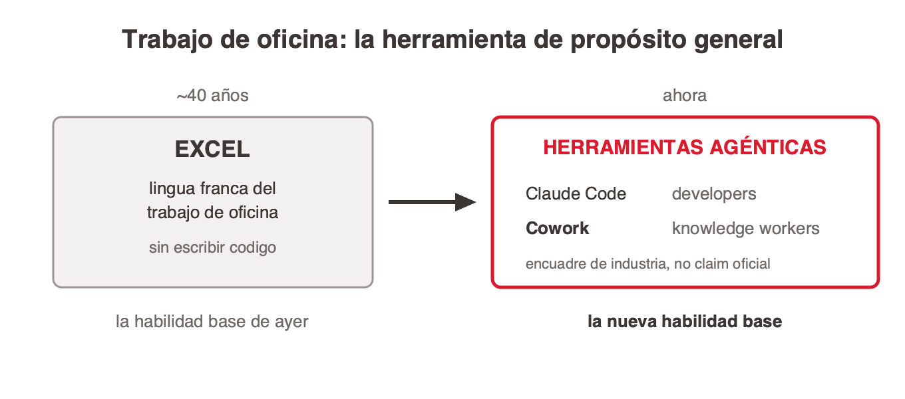
<!-- ascii-source:
TRABAJO DE OFICINA: la herramienta de proposito general

 ~40 anios                              ahora
+----------------------+    ===>    +-----------------------------+
| EXCEL                |            | HERRAMIENTAS AGENTICAS      |
| lingua franca del    |            | Claude Code  (developers)   |
| trabajo de oficina   |            | Cowork       (knowledge     |
| (sin escribir codigo)|            |               worker)       |
+----------------------+            +-----------------------------+
 la habilidad base de ayer           la nueva habilidad base
-->
<!-- ascii-note:
intent: encuadrar el "superpoder" de Cowork como herramienta de propósito general del knowledge worker, usando la analogía Excel (40 años, habilidad base de oficina) -> herramientas agénticas (Claude Code para developers, Cowork para knowledge workers) como la nueva habilidad base.
emphasize: la flecha temporal de Excel (ayer) a las herramientas agénticas (ahora); el paralelo Claude Code=developers / Cowork=knowledge worker; que la analogía Excel es encuadre de industria, no claim oficial.
labels: dos cajas; EXCEL (lingua franca, sin escribir código) a la izquierda; HERRAMIENTAS AGENTICAS (Claude Code = developers, Cowork = knowledge worker) a la derecha; pie "habilidad base de ayer" -> "nueva habilidad base".
-->

### Sources

- corpus/agentic-ai-deck.zip.md, posicionamiento Cowork vs Claude Code ("Same engine. Different surface."; Cowork = la cara para knowledge workers sin terminal; slide 7.1 "Claude Code vs Cowork — the close").
- Anthropic, Claude Cowork (product page): https://www.anthropic.com/product/claude-cowork; encuadre oficial: Cowork como "Claude Code para el resto de tu trabajo"; construido sobre las mismas bases que Claude Code.
- Claude blog, Cowork research preview ("Claude Code power for knowledge work"): https://claude.com/blog/cowork-research-preview; la ambición de llevar el poder de Claude Code al trabajo del conocimiento; Cowork generaliza un éxito probado primero con developers.
- CNBC, Anthropic's Claude Cowork targets the office worker: https://www.cnbc.com/2026/02/24/anthropic-claude-cowork-office-worker.html; encuadre de público general / office worker.
- "Claude Code is the New Excel" (ensayo de analista): https://nextword.substack.com/p/claude-code-is-the-new-excel; origen de la analogía del "nuevo Excel" (atribuir AQUÍ, NO a Anthropic).

### Speaker notes

El beat de "¿y a mí por qué me importa?". Cowork es Claude instalado en la computadora, con acceso a las carpetas y archivos del usuario; eso habilita una forma de trabajar distinta de la del chat. Hasta acá la audiencia extendió un chat; esta slide anuncia otra categoría de herramienta. Tono motivacional y de alto nivel; la mecánica viene después.

El gancho que mejor funciona es la analogía del Excel, dicha con cuidado. Durante unas cuatro décadas, saber Excel fue la habilidad base del trabajo de oficina: con Excel se resolvía gran parte del trabajo de conocimiento. La tesis de varios analistas de la industria es que las herramientas agénticas (Claude Code para los que programan, Cowork para los que no) van camino a ocupar ese lugar. Atribuirlo a analistas e industria, "hay quien lo llama el nuevo Excel", y NO a Anthropic.

Lo que sí es de Anthropic, y conviene citarlo como su framing propio, es "Claude Code para el resto de tu trabajo": que cualquier knowledge worker sienta con Cowork lo que los ingenieros ya sienten con Claude Code. Cowork generaliza algo que ya funcionó primero con developers.

Cerrar aterrizándolo en la audiencia: son alumnos de management y la mayoría no programa; por eso Cowork les sirve. Después de este beat pasamos a la mecánica, cómo se delega (próxima slide). Tiempo objetivo: ~4-5 min.

---

## 2. De chatear a delegar

### Content

- El chat ya quedó extendido. Lo que cambia ahora es el rol: **delegar**.
- Ejemplo de delegación: *"armá el pulso semanal de YPF, Vista y Tenaris con el formato del reporte de ejemplo y dejalo en la carpeta"*. Un resultado completo, no un mensaje por vez.
- Anthropic: *"menos una sesión de chat, más asignarle tareas a un colega."*
- Chatear vs delegar:

| | Chatear | Delegar a un agente |
|---|---|---|
| La forma de trabajo | Un mensaje a la vez | Se describe un resultado |
| Los pasos | Los hace la persona | El agente planifica y ejecuta |
| La salida | Texto en la ventana | Archivos en el disco |
| El rol humano | Hacer cada paso intermedio | Revisar el plan y corregir el rumbo |


<!-- ascii-source:
ANTES (chat)                    AHORA (agente / Cowork)
+----------+                    +------------------------+
| vos: msg | --&gt; respuesta      | vos: "entrega X"       |
| vos: msg | --&gt; respuesta      |        |               |
| vos: msg | --&gt; respuesta      |        v               |
| vos: msg | --&gt; respuesta      | agente: planifica      |
+----------+                    | agente: toca archivos  |
 paso a paso, lo hacés vos      | vos: leés y guiás      |
                                +------------------------+
                                 entregás un resultado
-->
<!-- ascii-note:
intent: contrastar el modo "chat" (un mensaje a la vez, vos hacés cada paso) contra el modo "agente" (delegás un resultado, el agente planifica y ejecuta sobre tus archivos).
emphasize: la flecha de paradigma de izquierda (ANTES) a derecha (AHORA); que en AHORA el agente hace el trabajo y vos guiás.
labels: ANTES (chat) vs AHORA (agente / Cowork).
-->

### Sources

- corpus/agentic-ai-deck.zip.md, "Stop prompting. Start delegating." (slide 2.3 the reframe); tabla "Chatting vs Delegating" (slide 3.16).
- "corpus/mision - auto.zip.md", "el verdadero premio no es Atlas: sos vos, dominando Claude Cowork"; "Conversá, no programes."
- Anthropic, Claude Cowork (product page): https://www.anthropic.com/product/claude-cowork; refuerza el paradigma: trabajar con Cowork "se parece menos a una sesión de chat y más a asignarle tareas a un colega".
- (técnico, opcional) Anthropic Engineering, Building agents with the Claude Agent SDK: https://www.anthropic.com/engineering/building-agents-with-the-claude-agent-sdk; por qué el loop plan→ejecutar→guiar define a un agente frente a un chat.

### Speaker notes

El concepto-ancla de la charla. Conectarlo con el recorrido: los conectores y Schedule extendieron qué puede hacer el chat; el agente cambia tu rol. En los dos modos se escriben prompts; lo que cambia es qué pide cada prompt: un paso intermedio, o un resultado completo que el agente planifica y ejecuta sobre archivos reales mientras vos supervisás. Son dos formas de trabajar, no dos productos. Si se llevan una sola idea, que sea esta: el valor está en aprender a delegar un resultado y guiar el proceso. Usar la tabla para hacerlo concreto: la salida son archivos en el disco, no texto en una ventana. Anticipar la misión: vamos a "contratar" a Faro, el analista de mercado virtual de la misión, y entrenarlo una vez para que después trabaje solo. Cerrar citando a Anthropic, "menos una sesión de chat, más asignarle tareas a un colega": el producto está pensado así. Tiempo objetivo: ~5 min.

---

## 3. El mapa: piezas que se apilan

### Content

- **Bloques que se apilan**: cada tarea combina solo los bloques que necesita.
- El mapa de la charla.
- Cada bloque = un problema conocido:
  - **El chat** *(visto)* → *respondía solo de memoria.*
  - **Conectores** *(visto)* → *quiero info real, y que actúe.*
  - **Schedule** *(visto)* → *quiero que corra solo.*
  - **Cowork: carpetas y archivos** *(estamos acá)* → *quiero que trabaje sobre mis archivos.*
  - **Archivos .md** → *que la IA entienda mi material.*
  - **Projects** → *agrupar todo el trabajo de un tema.*
  - **Instrucciones** → *no repetir el contexto.*
  - **Skills** → *no repetir la tarea.*
  - **Subagentes** → *delegar en paralelo.*


<!-- ascii-source:
   +----------------------+  "quiero delegar en paralelo"
   | SUBAGENTES           |
   +----------------------+
   +----------------------+  "no quiero repetir la tarea"
   | SKILLS               |
   +----------------------+
   +----------------------+  "no quiero repetir el contexto"
   | INSTRUCCIONES        |
   +----------------------+
   +----------------------+  "agrupar el trabajo de un tema"
   | PROJECTS             |
   +----------------------+
   +----------------------+  "quiero que la IA entienda mi material"
   | ARCHIVOS .MD         |
   +----------------------+
   +----------------------+  "quiero que trabaje sobre mis archivos"   <== ACA
   | COWORK: carpetas     |
   +----------------------+
   +----------------------+  "quiero que corra solo"                   (visto)
   | SCHEDULE             |
   +----------------------+
   +----------------------+  "quiero info real + que actue"            (visto)
   | CONECTORES           |
   +----------------------+
   +----------------------+  "respondia solo de memoria"               (visto)
   | EL CHAT              |
   +----------------------+

   los bloques se apilan: cada tarea combina solo los que necesita
-->
<!-- ascii-note:
intent: presentar el arco completo de la charla como bloques que se apilan (no una pirámide/escalera estricta): el chat (base) -> conectores -> Schedule -> Cowork (carpetas/archivos) -> archivos .md -> Projects -> Instrucciones -> Skills -> Subagentes. Los tres bloques de abajo están marcados "(visto)" y el bloque Cowork lleva el marcador "estamos acá".
emphasize: el marcador "<== ACÁ" en el bloque Cowork; los "(visto)" en chat/conectores/Schedule; el par bloque↔problema en cada nivel.
labels: bloques apilados (base→cima): El chat · Conectores · Schedule · Cowork: carpetas · Archivos .md · Projects · Instrucciones · Skills · Subagentes, cada uno con su frase-problema a la derecha.
-->

### Sources

- corpus/agentic-ai-deck.zip.md, progresión de building blocks del deck (Instrucciones → Projects → Skills → Connectors/MCP); la idea de "pila" es la lectura ordenada de esa progresión, re-secuenciada al arco chat-primero de esta charla.
- "corpus/mision - auto.zip.md", la misión Atlas arma estas piezas una por una.

### Speaker notes

El mapa de toda la sesión, con el arco nuevo: arranca en el chat que la audiencia ya usa, no en Cowork. Aprovechar el efecto acumulado: "los tres bloques de abajo ya los recorrimos" (chat, conectores, Schedule), y señalar el marcador de "estamos acá": Cowork, donde la IA empieza a trabajar sobre carpetas y archivos reales. Arrancar cada bloque por el problema; cada uno nace de una frustración concreta.

Cuidado con la metáfora: los bloques se apilan y se combinan; cada tarea usa solo los que necesita.

Decir la promesa de roadmap: "lo que queda de la charla recorre los bloques de acá para arriba, en este orden", y que pueden volver a esta slide entre secciones para ubicarse. Al final, la pila entera es Faro. Tiempo objetivo: ~3-4 min.

---

## 4. Demo: la interfaz de Cowork

### Content

```ascii
   __________________________________________
  /                                          /|
 /            >   D E M O   T I M E          / |
/__________________________________________/  |
|                                          |   |
|     [ Pasamos a la app de Cowork ]       |  /
|__________________________________________| /
|__________________________________________|/
```
<!-- ascii-note:
intent: tarjeta/banner de "DEMO TIME" como señal visual fuerte al tope de la slide, para marcar el corte de conceptos a demo en vivo sobre la app.
emphasize: el texto grande "> DEMO TIME"; sensación de cartel/placa (no un diagrama de flujo); que abajo se lee "pasamos a la app de Cowork".
labels: banner DEMO TIME; subtítulo "Pasamos a la app de Cowork".
-->

- **DEMO EN VIVO**: tour de la pestaña Cowork sobre la app.


- Señalar en vivo: modo **"Ask"** vs modo automático, selector de carpeta, panel de **Project**.
- Control = modo + aprobar/redirigir + carpeta.

### Sources

- corpus/agentic-ai-deck.zip.md, "screenshot-cowork-tab.png" (anatomía Cowork, 14 elementos anotados; el asset más Cowork-funcional de la fuente); slide 3.19 (modelo de aprobación Cowork).

### Speaker notes

Momento de demo en vivo, de los conceptos a la app. Abrir Cowork y hacer un recorrido de 2-3 minutos señalando dónde está el selector de modo (Ask before acting por defecto), cómo se concede una carpeta de trabajo y dónde vive el panel de Project, que usamos más adelante. La barra lateral tiene otras pestañas que esta clase no cubre; si alguien pregunta, mencionarlas al pasar y seguir. Demo sugerida: la carpeta `missions/CoWork/escritorio-del-pasante/` (la Misión 0): conceder la carpeta, pedir "¿qué hay acá y en qué estado está?" y después un ordenamiento con renombres, aprobando cada acción (ejercicios 1 y 2 de la guía intro-escritorio-pasante.md; los ejercicios 3 a 5 quedan para el workshop). El desorden con nombres tipo "FINAL final" no necesita explicación y la audiencia se reconoce al instante. Dejarlos ver a Claude planificar, tocar archivos y entregar, sin explicar la mecánica todavía. La carpeta es regenerable por script, así que la demo se puede romper sin costo. La imagen anotada queda de respaldo por si la demo falla. Tiempo objetivo: ~8 min (incluida la demo).

---

# 7. Knowledge & Output

**Goal of this section:** El rol central de los archivos .md en el trabajo con Cowork: cómo se escriben, cómo se ven una vez formateados y por qué conviene trabajar en ese formato y exportar al final al que pida el destinatario.

---

## 1. Cómo se escribe un .md

### Content

- Un `.md` (Markdown) = **texto plano** + marcas de estructura: `#` para títulos, `-` para listas, `**negrita**`, `|` para tablas.
- Un archivo de la misión, tal como se escribe:

```markdown
# Pulso semanal de mercado
Semana 2026-05-18 · YPF · Vista · Tenaris

## Resumen
- YPF **sube 3,1%** tras el anuncio de perforación.
- Vista presenta resultados el jueves.

| Empresa | Cierre | Variación |
|---------|--------|-----------|
| YPF     | $42,10 | +3,1%     |
```

- Se escribe y se lee con cualquier editor de texto. La IA está entrenada para comprender su estructura.

### Sources

- corpus/agentic-ai-deck.zip.md, "Markdown is the lingua franca".
- "corpus/mision - auto.zip.md", el reporte semanal de la misión como archivo `.md` (formato del reporte de ejemplo).

### Speaker notes

Beat de enseñanza propio, no un paréntesis: en el mundo de agentes el formato de los archivos importa, y gana el más simple. Esta slide muestra la sintaxis con un archivo real de la misión: un `#` marca el título, `##` un subtítulo, `-` una viñeta, los asteriscos la negrita y las barras verticales una tabla. Recorrerla rápido, sin detenerse en detalle fino de formato: la idea es que las marcas son pocas y se aprenden en minutos. Señalar que es texto plano, sin formato propietario: se abre con cualquier editor, en cualquier computadora. La próxima slide muestra el mismo archivo renderizado. Tiempo objetivo: ~3 min.

---

## 2. El mismo archivo, ya formateado

### Content

- El mismo texto, abierto en cualquier visor de Markdown:

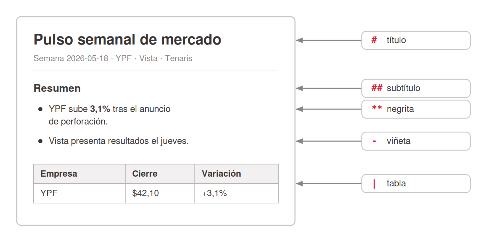
<!-- ascii-source:
+------------------------------------------------+
|  PULSO SEMANAL DE MERCADO                      |  <- "#" = titulo
|  Semana 2026-05-18 · YPF · Vista · Tenaris     |
|                                                |
|  Resumen                                       |  <- "##" = subtitulo
|   • YPF sube 3,1% tras el anuncio de           |  <- "-" = viñeta
|     perforacion.        (** = negrita)         |
|   • Vista presenta resultados el jueves.       |
|                                                |
|  +---------+--------+-----------+              |
|  | Empresa | Cierre | Variacion |              |  <- "|" = tabla
|  | YPF     | $42,10 | +3,1%     |              |
|  +---------+--------+-----------+              |
+------------------------------------------------+
-->
<!-- ascii-note:
intent: mostrar el archivo .md de la slide anterior ya renderizado (título grande, subtítulo, viñetas, negrita, tabla con bordes), con flechas laterales que conectan cada elemento visual con la marca de sintaxis que lo produce.
emphasize: la correspondencia marca -> resultado (# -> título, - -> viñeta, ** -> negrita, | -> tabla); que es el MISMO archivo de la slide anterior.
labels: documento renderizado a la izquierda; a la derecha, la marca de sintaxis que genera cada elemento.
-->

- Las marcas se convierten en formato: títulos, viñetas, negrita, tabla.
- **Metadata (header YAML)**: declara *qué es* el archivo y *cuándo* usarlo. Vuelve con las Skills (sección 9).
- La **lingua franca** del mundo LLM: el modelo lee texto. Portable y versionable.

### Sources

- corpus/agentic-ai-deck.zip.md, "Markdown is the lingua franca"; definición de Skill (SKILL.md con YAML frontmatter: name + description; "Description drives triggering — semantic, not keyword").
- "corpus/mision - auto.zip.md", "mismo estándar SKILL.md" entre Cowork y Codex (Cowork vs Codex).

### Speaker notes

El remate del par: el archivo de la slide anterior, ahora formateado. Recorrer la correspondencia con el diagrama: el `#` se volvió título, los `-` viñetas, los asteriscos negrita, las barras una tabla con bordes. Si hay conexión, mejor en vivo: abrir el archivo en un visor de Markdown y alternar entre fuente y render. La idea a transmitir: el modelo lee texto, y cuanto menos formato opaco haya entre el contenido y el modelo, mejor trabaja. Por eso es portable y versionable; el mismo estándar funciona entre herramientas. Presentar la metadata (header YAML entre `---`) como la etiqueta del frasco: dice qué es el archivo y cuándo usarlo. La `description` de una Skill cumple esa función (activación semántica, no por palabra clave; sección 9). La próxima slide baja esto a la práctica: en qué formato conviene trabajar. Tiempo objetivo: ~3 min.

---

## 3. Trabajar en .md, exportar al final

### Content

- **La información de trabajo va en archivos `.md` mientras el trabajo sigue abierto.**
- La IA **interpreta, edita y crea mejor sobre `.md`** que sobre .docx/.xlsx.
- Aplica tanto a la **memoria** del agente como a los **archivos de trabajo** del Project.
- El entregable (**.docx, .xlsx, PDF, slides**) se genera una sola vez cuando el trabajo está listo.
- Regla de bolsillo: *se edita en `.md` y se entrega en el formato que pida el jefe.*
- En la misión: el reporte se consolida como `.md` en el Project; el mail y el tablero se generan al final.

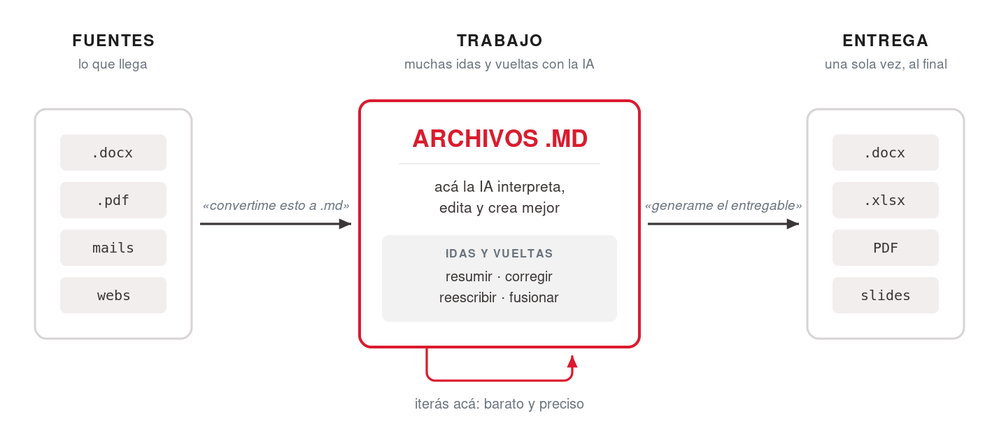
<!-- ascii-source:
   FLUJO DE TRABAJO CON LA IA

  fuentes            TRABAJO (muchas idas       entrega (1 vez,
  (lo que llega)     y vueltas con la IA)       al final)
+--------------+     +-----------------+      +---------------+
| .docx  pdf   | --&gt; |    ARCHIVOS     | --&gt;  | .docx  .xlsx  |
| mails  webs  |     |      .MD        |      | PDF    slides |
+--------------+     | la IA lee/edita |      +---------------+
                     | /crea MEJOR aca |
  "convertime        +-----------------+        "generame el
   esto a .md"        iterás acá, barato          entregable"
-->
<!-- ascii-note:
intent: mostrar el flujo de trabajo recomendado con la IA: las fuentes (docx, pdf, mails, webs) se convierten a archivos .md, TODO el trabajo iterativo con la IA pasa sobre los .md (donde interpreta/edita/crea mejor), y el formato final (.docx/.xlsx/PDF/slides) se genera una sola vez al final.
emphasize: la caja central "ARCHIVOS .MD" como el lugar donde vive el trabajo (la IA trabaja MEJOR acá); que la entrega es un paso único al final, no el medio de trabajo.
labels: izquierda = fuentes (lo que llega); centro = archivos .md (trabajo iterativo); derecha = entrega final (.docx/.xlsx/PDF/slides); leyendas "convertime esto a .md" y "generame el entregable".
-->

### Sources

- corpus/agentic-ai-deck.zip.md, "Markdown is the lingua franca" (la configuración y el material del mundo LLM es texto plano; el modelo lee texto).
- "corpus/mision - auto.zip.md", el flujo de Atlas trabaja sobre archivos `.md` en el Project (reporte `.md` consolidado) y el entregable final se genera al último (borrador de mail, tablero).

### Speaker notes

La slide de práctica de la sección, el hábito concreto que se llevan. La analogía útil: el `.md` es tu mesa de trabajo y el `.docx`/PDF es la vitrina. Nadie construye dentro de la vitrina. El porqué, para decir: en texto plano la IA ve la estructura directa; en formatos ricos atraviesa capas que agregan ruido y errores. Recorrer el flujo con el diagrama. Llega material en cualquier formato y el primer pedido al agente es "convertime esto a `.md`". Todas las idas y vueltas (resumir, corregir, reescribir, fusionar) pasan sobre los `.md`, donde la IA es más precisa y barata de iterar. Cuando está listo, un único pedido final: "generame el `.docx`/Excel/PDF". El documento "lindo" es la salida, no el medio de trabajo. Aplica a la memoria también: lo que el agente debe recordar de forma estable vive como texto plano (Instrucciones, memoria del Project), y los archivos que va a leer y editar una y otra vez (notas, borradores, datos de referencia) van en `.md` dentro de la carpeta del Project. Aterrizar con Faro: su reporte se consolida como `.md` en el Project y las salidas "lindas" (mail, tablero) se generan al final. Tiempo objetivo: ~6 min.

---

# 8. Projects

**Goal of this section:** El espacio de trabajo de Cowork: qué agrupa un Project, cómo se le concede una carpeta real del disco, dónde vive su contexto y cómo las Instrucciones fijan de una vez el comportamiento del agente en ese espacio.

---

## 1. Un Project: carpeta, memoria e instrucciones

### Content

- Project = espacio de trabajo autocontenido: **carpeta propia + memoria + instrucciones**.
- El de la misión: **"Inteligencia de Mercado Semanal"**, apuntado a la carpeta `Documentos/Faro-Mercado`.
- Tres capas persistentes: Instrucciones · Knowledge base · Chats.
- Los chats del Project **no comparten contexto entre sí** (solo la base de conocimiento).
- El usuario concede las carpetas con el **explorador de archivos del sistema operativo**.
- Buena práctica: usar una carpeta dedicada y asegurarse de que no contenga datos confidenciales.

### Sources

- corpus/agentic-ai-deck.zip.md, definición de "Project (Chat/Cowork)" (tres capas; chats no comparten contexto); "Working directory + permissions" (folder picker del sistema).
- "corpus/mision - auto.zip.md", "el Proyecto le da a Atlas una carpeta propia, memoria y un lugar fijo" (Step 1.1).

### Speaker notes

El Project es el contenedor de todo lo demás: Instrucciones, archivos, memoria. Las ventajas, para desarrollar a viva voz: todo queda organizado y reutilizable. Las Instrucciones valen para todo el Project, la memoria recuerda tus correcciones y preferencias, y los archivos viven en una carpeta concreta de tu disco. En la misión, el Project "Inteligencia de Mercado Semanal" apunta a la carpeta `Documentos/Faro-Mercado`. Dos puntos prácticos. Uno: los chats no se hablan entre sí dentro del Project; si querés que recuerde algo, va a las Instrucciones o a la base de conocimiento. Dos: el control de qué carpetas toca Claude es el explorador de archivos del sistema operativo, garantía de seguridad (Cowork solo ve lo que le concedés) y límite a la vez. La slide siguiente muestra ese selector y el panel de contexto en pantalla. Tiempo objetivo: ~7 min.

---

## 2. Conceder una carpeta y ver el contexto

### Content

- El usuario concede la carpeta con el **explorador de archivos del sistema**. Cowork no tiene acceso a nada fuera de ella salvo que le permitamos hacerlo.


- El **panel de contexto**: Instrucciones + base de conocimiento + carpeta concedida.


- Seguridad: la carpeta ES el control de privacidad. **Nunca datos sensibles, credenciales o NDA.**

### Sources

- corpus/agentic-ai-deck.zip.md, "Working directory + permissions" (folder picker del sistema; lo concedido define el alcance); definición del panel de contexto del Project.
- "corpus/mision - auto.zip.md", el Project "Inteligencia de Mercado Semanal" apunta a `Documentos/Faro-Mercado` (Step 1.1).

### Speaker notes

Slide de apoyo visual, corta y concreta: baja a pantalla lo que la slide anterior contó. Mostrar las dos capturas, el explorador de archivos del sistema cuando concedés una carpeta y el panel de contexto del Project con sus capas. No saltear el mensaje de seguridad: Cowork solo ve lo que le concedés, así que la elección de carpeta ES el control de privacidad. Nunca una carpeta con datos sensibles. Aterrizarlo en la misión: Faro trabaja sobre `Documentos/Faro-Mercado`, nada más. Tiempo objetivo: ~3 min.

---

## 3. Instrucciones: el contrato de trabajo

### Content

- Instrucciones = el **"contrato de trabajo"**: reglas en lenguaje natural que aplican a todo el Project.
- Ejemplo (Faro):

```text
Sos Faro, el analista de mercado de Atlas, una empresa de
insumos de perforación para Vaca Muerta.
Preparás un pulso semanal para colegas NO técnicos (incluido el jefe),
que se lee en 2 minutos antes de la reunión de los lunes.

· Empresas que seguís: YPF, Vista y Tenaris.
· Escribís en español, claro y breve, sin jerga financiera.
  Si usás un término técnico, lo explicás en una línea.
· REGLA DE ORO: tus reportes son informativos y de uso interno.
  NUNCA son recomendaciones de inversión ni asesoramiento financiero.
  Siempre incluís esa aclaración al final.
```

  Se escriben una sola vez.
- Conviene que sean cortas y claras.
- El lugar de las **reglas no negociables**.

### Sources

- corpus/agentic-ai-deck.zip.md, "the project context panel (GUI)" como lugar de las Instrucciones en Cowork; matriz de disponibilidad 3.3 (Persistent instructions, Cowork ⚠️).
- "corpus/mision - auto.zip.md", texto exacto de las Project Instructions de Atlas (Step 1.1); "las Instrucciones son su contrato de trabajo".

### Speaker notes

Conectar con el paradigma: en lugar de re-explicarle a Claude el contexto cada vez, lo escribís una vez en las Instrucciones y queda fijo. Mostrar el texto real de las Instrucciones de Faro y destacar la regla de oro del disclaimer financiero, el tipo de regla no negociable que conviene pinear acá. Dónde viven: en el panel de contexto del Project (en la GUI). No es un archivo que edités a mano; lo escribís en el panel y queda asociado al Project. Tiempo objetivo: ~7 min.

---

# 9. Skills

**Goal of this section:** Enseñarle a Claude tareas reutilizables: qué es una Skill, cómo se crea en Cowork (el menú Agregar del panel de Habilidades, el comando `/skill-creator` y la trampa del Save; el ZIP importa una existente) y la anatomía del SKILL.md.

---

## 1. Qué es una Skill

### Content

- **Skill** = instrucción reutilizable que se carga cuando el pedido coincide con su descripción. **Un trabajo por Skill.**
- *"Todo lo que le explicás a Claude más de una vez es una Skill que deberías escribir una vez."*
- Faro: `reporte-semanal` consolida la carpeta `fuentes/` en un reporte con formato fijo.

### Sources

- corpus/agentic-ai-deck.zip.md, definición de Skill (folder + SKILL.md, "one job per skill"); "Anything you explain to Claude twice is a skill you should write once."
- "corpus/mision - auto.zip.md", el ejemplo `reporte-semanal` (lee la carpeta `fuentes/`, consolida por empresa, formato fijo, sufijo `-new`).

### Speaker notes

Arranca el bloque avanzado, partido por tema: esta sección cubre Skills y la siguiente, Subagentes. La Skill materializa el "enseñá una vez, reutilizá siempre". Usar `reporte-semanal` como ejemplo concreto: lee TODOS los archivos crudos de `fuentes/` (uno por portal), consolida por empresa, la más relevante primera (⭐), y guarda con sufijo `-new` para no pisar el ejemplo. Convierte varios archivos desordenados en un reporte prolijo. El criterio "un trabajo por Skill": si aparece "y además", conviene dividirla en dos. La creación paso a paso viene en la próxima slide; la anatomía del archivo, en la siguiente. Tiempo objetivo: ~4 min.

---

## 2. Cómo se crea una Skill en Cowork

### Content

- Desde **Configuración → Habilidades → Agregar**, dos caminos para crear y uno para importar:
  1. **Crear con Claude**: un ida y vuelta de chat; Claude escribe el `SKILL.md`.
  2. **Escribir las instrucciones** de la habilidad directamente en la UI.
  3. **Subir una habilidad**: importa una Skill ya existente (el ZIP con su carpeta), por ejemplo una que te compartieron.


- Las habilidades también están a mano **desde el chat**: el menú **"+"** las lista, con "Administrar" y "Explorar habilidades".


- En el chat, el comando **`/skill-creator`** (una skill de Anthropic que viene preinstalada) guía la creación y revisa el resultado.
- Cowork incluye un set reducido de **slash commands** (menos que Claude Code). Tipear `/` los lista.
- Requisito: **Code execution** habilitado.
- **La trampa del Save:** la Skill tiene que quedar guardada y habilitada en la lista de Habilidades, o "no funciona".

```ascii
     CREAR UNA SKILL EN COWORK

 Configuracion > Habilidades > AGREGAR          en el chat
 +-------------------+---------------------+   +------------------+
 | Crear con Claude  | Escribir las        |   | /skill-creator   |
 | (ida y vuelta de  | instrucciones en    |   | guia y revisa    |
 |  chat)            | la UI               |   | el SKILL.md      |
 +-------------------+---------------------+   +------------------+
 | Subir una habilidad (ZIP):              |            |
 | importa una Skill ya existente          |            |
 +-----------------------------------------+            |
                      \                                /
                       v                              v
                  +==================================+
                  |   GUARDAR / HABILITAR            |  <== la trampa
                  |   (lista de Habilidades)         |
                  +==================================+
                                  |
                                  v
                         +-----------------+
                         |  SKILL ACTIVA   |
                         +-----------------+

   frenar en la compuerta = la Skill "no funciona"
```
<!-- ascii-note:
intent: mostrar los caminos del menú Agregar del panel Habilidades (Crear con Claude en un ida y vuelta de chat; escribir las instrucciones directo en la UI; subir un ZIP, que IMPORTA una Skill ya existente en vez de crear una) más el comando /skill-creator en el chat, que guía y revisa el SKILL.md. Todos convergen en la misma compuerta: guardar y habilitar la Skill en la lista.
emphasize: la compuerta "GUARDAR / HABILITAR" como cuello de botella (caja de doble línea, marcada "la trampa") y la leyenda inferior; el menú Agregar con sus tres opciones como bloque de la UI, separado del camino por comando.
labels: bloque UI = menú Agregar (Crear con Claude / Escribir instrucciones / Subir ZIP); bloque chat = /skill-creator (guía y revisa); compuerta = guardar/habilitar en la lista de Habilidades; salida = Skill activa.
-->

### Sources

- Verificación de primera mano de los presentadores (2026-07-21, captura del panel Configuración → Habilidades): el menú **Agregar** ofrece "Cree con Claude", "Escribe las instrucciones de la habilidad" y "Subir una habilidad"; `skill-creator` figura en la lista como skill de Anthropic; Cowork incluye un set reducido de slash commands.
- Anthropic Support, Use Skills in Claude: https://support.claude.com/en/articles/12512180-use-skills-in-claude; habilitar Skills desde el panel de Habilidades; requiere Code execution ("This feature requires code execution to be enabled"; re-verificado 2026-07-15).
- Anthropic Support, How to create custom skills: https://support.claude.com/en/articles/12512198-how-to-create-custom-skills; la versión actual del artículo (re-verificada 2026-07-15) documenta solo el camino ZIP; los otros dos caminos del menú Agregar y el comando `/skill-creator` todavía no aparecen ahí (doc atrasada respecto del producto; atribuido a la captura).

### Speaker notes

La slide práctica que faltaba: el paso a paso de creación. Con conexión, hacerlo en vivo desde el panel: Configuración → Habilidades → Agregar, y mostrar las tres opciones del menú. "Crear con Claude" abre un ida y vuelta de chat donde Claude escribe el SKILL.md; "Escribir las instrucciones" edita la habilidad directo en la UI; "Subir una habilidad" no crea nada nuevo: importa una Skill ya existente desde su ZIP, por ejemplo una compartida por un colega. Después el camino por chat: tipear `/` para mostrar la lista de comandos (un set reducido; los que conocen Claude Code van a notar la diferencia) y crear `reporte-semanal` con `/skill-creator`, que guía la escritura y revisa el resultado. Dos avisos prácticos. Uno: las Skills requieren Code execution. Dos: la trampa del Save; la Skill creada tiene que quedar guardada y habilitada en la lista, y sin eso parece que "no funciona". Las dos capturas (el panel de Habilidades y el menú "+" del chat) quedan de respaldo por si la demo falla; con las capturas en la slide, el diagrama de caminos pasa a ser ayuda del lector del draft. Aviso de vigencia: la doc oficial va detrás del producto en este punto; re-mirar el panel el día de la clase. Tiempo objetivo: ~6 min (con demo).

---

## 3. Un SKILL.md por dentro

### Content

- Un `SKILL.md` por dentro: **metadata** arriba, **instrucciones** abajo. Es el `.md` con metadata de la sección 7.


<!-- ascii-source:
+--------------------------------------------------------------+
| ---                                                          |  <-- METADATA / HEADER (YAML)
| name: reporte-semanal                                        |      "que es" + "cuando se activa"
| description: Genera el pulso semanal de mercado a partir     |
|   de la carpeta fuentes/ de la semana. Usar cuando pidan     |
|   "reporte semanal" o "pulso de la semana".                  |
| ---                                                          |
+--------------------------------------------------------------+
| # Reporte semanal                                            |  <-- CUERPO (Markdown)
|                                                              |      "que hace": las instrucciones
| 1. Leé TODOS los archivos de fuentes/ y consolidá           |
|    por empresa.                                              |
| 2. Generá el reporte con esta estructura exacta...          |
| 3. Guardá con sufijo -new (no pises el original).           |
+--------------------------------------------------------------+
-->
<!-- ascii-note:
intent: mostrar la anatomía de un SKILL.md; un bloque de metadata (YAML frontmatter: name + description) arriba y el cuerpo de instrucciones en Markdown abajo. Refuerza el beat de archivos .md/metadata de la sección Cowork.
emphasize: la separación visual en dos zonas; METADATA/HEADER (name, description; "qué es / cuándo se activa") vs CUERPO (las instrucciones; "qué hace"); que la `description` dispara la Skill.
labels: zona superior = metadata/header (YAML, name + description); zona inferior = cuerpo (instrucciones en Markdown); etiquetas laterales "cuándo se activa" y "qué hace".
-->

- **Metadata:** `name` identifica; `description` **decide cuándo se activa** (semántico, no por palabra clave).
- **Cuerpo:** Markdown común, los pasos que sigue el agente.

### Sources

- corpus/agentic-ai-deck.zip.md, definición de Skill (SKILL.md con YAML frontmatter: name + description; "Description drives triggering — semantic, not keyword").
- "corpus/mision - auto.zip.md", la Skill `reporte-semanal` (entrada `fuentes/`, consolida por empresa, estructura fija, sufijo `-new`).

### Speaker notes

Slide-ejemplo que aterriza dos cosas a la vez: la anatomía de una Skill y el beat de archivos `.md` + metadata de la sección de Cowork. Mostrar el `SKILL.md` partido en dos zonas: arriba el header YAML (`name`, `description`) entre `---`, abajo las instrucciones en Markdown. El punto a fijar: el sistema lee la `description` para decidir si esta Skill aplica a tu pedido (activación semántica). Usar `reporte-semanal` para que sea concreto. Mantenerlo alto nivel: es para que vean cómo se ve, no un tutorial de formato. Tiempo objetivo: ~3-4 min.

---

# 10. Subagentes

**Goal of this section:** La pieza avanzada del cierre: qué es un Subagente, para qué tipo de sub-tarea conviene y cómo se agrega.

---

## 1. Subagentes: varios trabajando a la vez

### Content

- **Subagente** = asistente aislado, contexto propio; devuelve **un resumen** (no la transcripción).
- Ejemplo: **8 propuestas de proveedores**, un subagente por propuesta; los 8 corren en paralelo y el agente principal arma la tabla comparativa final.
- En Cowork corren "por debajo", **varios en paralelo**.
- Se agrega como una Skill (descripción de cuándo usarlo + instrucciones): se le pide a Claude y se gestiona en Customize.

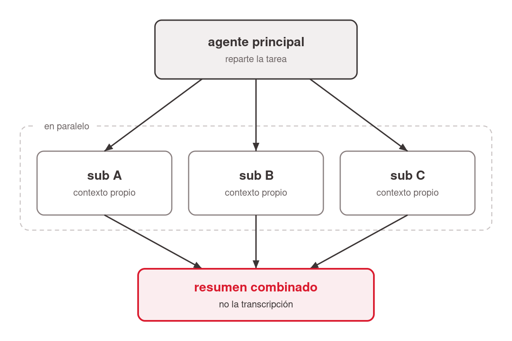
<!-- ascii-source:
                +------------------+
                | agente principal |
                +------------------+
                  /      |       \
                 v       v        v
          +--------+ +--------+ +--------+
          | sub A  | | sub B  | | sub C  |
          |contexto| |contexto| |contexto|
          |propio  | |propio  | |propio  |
          +--------+ +--------+ +--------+
                 \       |       /
                  v      v      v
                +------------------+
                | resumen combinado|
                +------------------+
-->
<!-- ascii-note:
intent: mostrar el patron fan-out/fan-in: el agente principal reparte una tarea entre varios subagentes que corren en paralelo con contexto propio, y junta los resultados en un resumen combinado.
emphasize: el paralelismo (tres subagentes a la vez) y que cada uno tiene contexto aislado; el resumen combinado al final.
labels: agente principal -> sub A / sub B / sub C (contexto propio) -> resumen combinado.
-->

### Sources

- corpus/agentic-ai-deck.zip.md, definición de Subagent (aislado, devuelve un resumen); "Skill vs Subagent" (slide 4.9 tabla); matriz 4.10 (Cowork ⚠️, under the hood); demo 4.8 (8 propuestas en paralelo).
- Claude Docs, Subagents: https://code.claude.com/docs/en/sub-agents; concepto general de subagente (un spec: cuándo usarlo + instrucciones).

### Speaker notes

Nivel avanzado, presentarlo como "para cuando crezcas". Un subagente conviene cuando una sub-tarea es pesada o genera mucho texto intermedio que nadie necesita leer: corre aparte y vuelve con el resumen. No plantearlo como opuesto de las Skills (una skill puede usar subagentes y al revés); acá se enseña qué es, sin comparaciones. El ejemplo ilustra el fan-out: 8 propuestas de proveedores, un subagente por propuesta; los 8 corren a la vez y el agente principal combina los resúmenes en la tabla comparativa. Cómo se agrega, en paralelo a las Skills: un subagente se define con una descripción (cuándo usarlo) más instrucciones, y se le pide a Claude que lo arme; se gestiona en Customize, igual que una Skill. Mantenerlo alto nivel, sin rutas de archivos ni internals de persistencia. Tiempo objetivo: ~7 min.

---

# 11. La misión · parte 2

**Goal of this section:** Segunda placa de misión y cierre del recorrido de piezas. Manda a resolver la parte 2 en Cowork, sobre la carpeta real del equipo, con Projects, Instrucciones, archivos .md, Skills y Subagentes. Sin contenido nuevo.

---

## 1. La misión, parte 2: Faro en Cowork

### Content

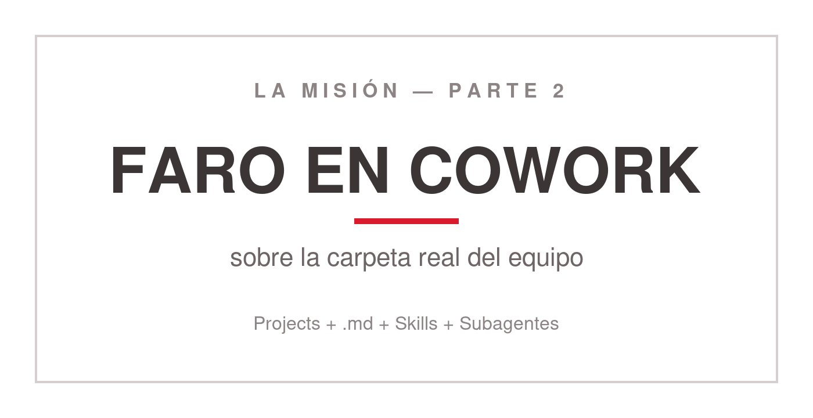
<!-- ascii-source:
   ______________________________________________
  |                                              |
  |   LA MISION - PARTE 2                        |
  |                                              |
  |   FARO EN COWORK                             |
  |   sobre la carpeta real del equipo           |
  |                                              |
  |   Projects + .md + Skills + Subagentes       |
  |______________________________________________|
-->
<!-- ascii-note:
intent: segunda placa divisoria de misión, gemela de la primera. Cartel, no diagrama de flujo: manda a resolver la parte 2 en Cowork con las piezas recién enseñadas.
emphasize: "LA MISION - PARTE 2" arriba y "FARO EN COWORK" en el centro, en el tipo más grande de la placa; el mismo diseño que la placa de la parte 1.
labels: arriba = LA MISION, PARTE 2; centro = FARO EN COWORK (sobre la carpeta real del equipo); abajo = Projects, archivos .md, Skills y Subagentes.
-->

- **Parte 2, en Cowork:** Faro baja a la computadora y trabaja sobre la carpeta real del equipo.
- Las piezas de esta mitad: **Projects, Instrucciones, archivos `.md`, Skills y Subagentes.**
- No hace falta haber resuelto la parte 1: la parte 2 arranca del material que ya viene con la misión.

### Sources

- `missions/CoWork/mission.md`, tabla "Las dos partes" y la nota "La Parte 2 no exige la Parte 1 resuelta": arranca de los materiales incluidos, la herencia del pasante en `reportes/`.
- "corpus/mision - auto.zip.md", el flujo de Faro en Cowork: carpeta del Project, reporte consolidado y Skills reutilizables.

### Speaker notes

Segunda placa de misión, gemela de la primera y con el mismo formato, para que se lea como el cierre del arco. Acá ya están todas las piezas sobre la mesa. Decir qué cambia respecto de la parte 1: Faro deja de vivir en el chat y pasa a trabajar sobre la carpeta real del equipo, con su Project, sus Instrucciones, sus archivos `.md` y sus Skills. Aclarar que la parte 2 no exige tener resuelta la parte 1: arranca del material incluido en la misión, la pila de notas en crudo que dejó el pasante. Si alguien viene de la parte 1, los conectores ya autorizados se reutilizan y el arranque es más corto. Cerrar mandando al material de la misión antes de pasar a las conclusiones. Tiempo objetivo: ~2 min.

---

# Conclusions

## 1. El loop completo de Faro

### Content

- El loop completo de Faro:

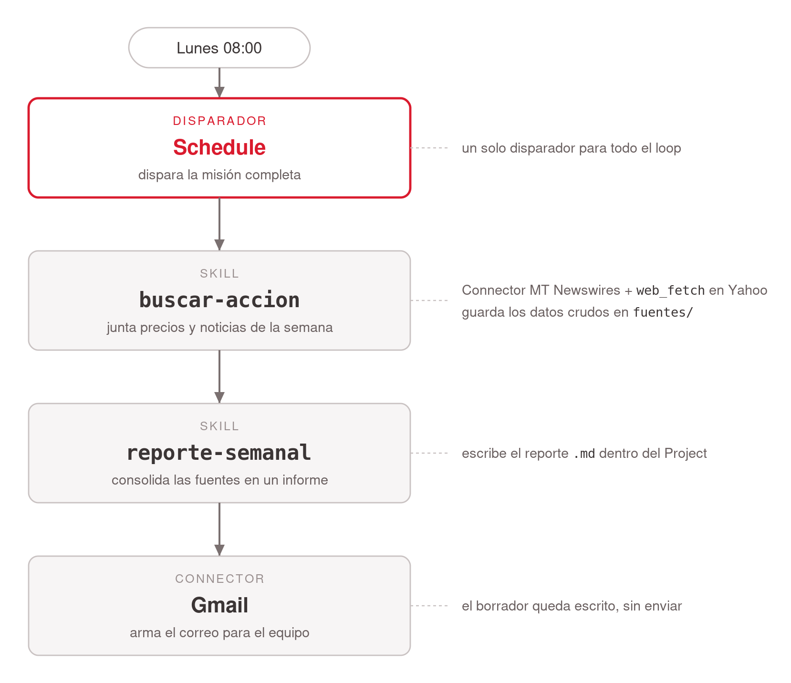
<!-- ascii-source:
Lunes 8:00
   |
   v
[Schedule] dispara
   |
   v
[Skill buscar-accion] --(Connector MT Newswires + web_fetch Yahoo)--&gt; guarda fuentes/
   |
   v
[Skill reporte-semanal] consolida --&gt; reporte .md en el Project
   |
   v
[Connector Gmail] deja el borrador listo para el equipo
-->
<!-- ascii-note:
intent: mostrar el loop completo de la misión de Faro, encadenando todas las piezas vistas en la charla, disparado por el Schedule cada lunes.
emphasize: la secuencia de arriba abajo Schedule -> Skills -> Connectors -> borrador de correo; que todo arranca de un solo disparador.
labels: pasos del loop (Schedule, buscar-accion, reporte-semanal, Gmail) y las piezas usadas en cada uno.
-->

- **El arco de hoy:** chat de memoria → conectores → Schedule → Cowork (`.md`) → Projects → Instrucciones → Skills → Subagentes.
- **Las piezas:** Conectores (las manos) · Schedule (corre solo) · `.md` (el lenguaje) · Projects (el espacio de trabajo) · Instrucciones (el contrato) · Skills (enseñar una vez) · Subagentes (delegar en paralelo).
- **Para llevarse:** *"Todo lo que le explicás a Claude más de una vez es una Skill que deberías escribir una vez."* ¿Qué tarea recurrente le delegarías a tu propio Faro?

### Sources

- "corpus/mision - auto.zip.md", "el loop completo (Cowork version)"; gancho de cierre.
- corpus/agentic-ai-deck.zip.md, "Anything you explain to Claude twice is a skill you should write once" (slide 7.3).

### Speaker notes

Cierre integrador: mostrar el diagrama del loop completo para que vean cómo cada pieza que aprendimos se engancha con la siguiente. Recordar el arco de la sesión: arrancamos en el chat que ya usaban (y sus límites), lo extendimos con conectores y Schedule, y dimos el salto a Cowork y sus piezas. Repasar las piezas en una línea cada una. Cerrar con las dos frases ancla: la de la Skill ("enseñá una vez") y el gancho completo, dicho en voz alta: "Acaban de automatizar un reporte que les iba a comer la mañana de cada lunes. ¿Qué otra tarea recurrente podrían delegarle a su propio Faro?". Tiempo objetivo: ~5 min + Q&A.

---

## 2. Antes de cerrar: cuidados

### Content

- **Cowork no tiene audit trail**: no sirve para datos regulados o sensibles.
- **Toda salida es un borrador**: cifras, citas y afirmaciones se verifican contra la fuente.
- **Nada de datos confidenciales / PII / bajo NDA** en la superficie equivocada.
- **Reproducibilidad:** prompt + entradas + salidas se guardan juntos, para que el trabajo sea auditable.
- **Capas de guardarraíles:** permisos de carpeta → reglas en Instrucciones → solo conectores verificados → revisión humana.
- *En el trabajo real:* con datos confidenciales de la empresa o de clientes, nada de esto sin aprobación del área correspondiente.

### Sources

- corpus/agentic-ai-deck.zip.md, slide 7.2 (Governance & verification, verbatim); "No audit trail in Cowork."

### Speaker notes

Slide de cierre responsable, breve y obligatoria. Decirlo sin vueltas: Cowork sirve para trabajo recurrente de oficina y NO para datos regulados, confidenciales o de clientes, porque no tiene audit trail. Recordar que toda salida es un borrador que hay que verificar, lo mismo que enseñó la sección 2: el modelo puede alucinar, el conector cita fuentes, el humano verifica. Dejar esto antes de abrir Q&A. Tiempo objetivo: ~3 min.

---

# Open questions

- ~~Fecha de la clase sin confirmar~~; resuelto 2026-07-14: `date: Julio 2026`.
- Imágenes diferidas (Phase 2 del librarian no corrida): la imagen citada desde el corpus (`screenshot-cowork-tab.png` en slide 6.4) proviene de un registro con `<!-- pending: process_images -->`. La imagen existe en disco y se referencia; re-verificar depiction/relevance tras correr librarian Phase 2. (`mockup-tablero.png` quedó sin uso tras la reestructura del 2026-07-30, que borró la slide de Artifacts.)
- Slide 6.4 (Demo time) cita pending stub corpus/agentic-ai-deck.zip.md; re-verify after librarian Phase 2.
- **Slash commands en Cowork (slides 9.1–9.2):** verificado de primera mano por los presentadores (2026-07-21): Cowork incluye un set reducido de slash commands, `/skill-creator` entre ellos, y la creación de Skills pasa por ese comando (el camino "lenguaje natural" de junio quedó subsumido ahí). La doc oficial (support 12512198) sigue documentando solo el camino ZIP. Decisión del presentador (2026-07-21): en la clase se muestra solo `/skill-creator`; `/skill-optimizer` queda fuera, y NO se releva la lista completa de comandos (alcanza con el tip de tipear `/`). Pendiente antes de la clase: probar si la Skill creada por comando también exige el Save/enable de la trampa.
- **Subagente a pedido (bonus M6 de la misión, 2026-07-28):** la creación de un subagente `investigador` a pedido del usuario en Cowork no está verificada de primera mano (la doc lo cubre para Claude Code; en Cowork "corren por debajo"). Probar en el producto antes del workshop; si no funciona, el bonus se cae sin bloquear la misión y la slide 10.1 no cambia.
- Falta la carpeta `skills/` con los tres skills pre-armados (`reporte-semanal`, `buscar-accion`, `publicar-tablero`) en el export; confirmado por el librarian en Step 3. No se inventa su contenido. Si la clase incluye una demo en vivo de las skills ya armadas, confirmar con el presentador si las tiene aparte.
- Vigencia de features vs docs oficiales: fechas/versiones (Live Artifacts abril 2026, planes pagos, etc.) son point-in-time; re-verificar contra docs oficiales antes de presentar.
- **Slide 6.4; interacción pipeline del banner DEMO TIME:** la slide tiene un bloque ```ascii (banner "DEMO TIME") Y un image ref (`screenshot-cowork-tab.png`, respaldo). El pipeline de Polish marca como documentation-only TODO bloque ASCII en una slide que tiene image ref → el banner NO se renderizará a SVG en Step 6 tal como está. Decisión ya tomada en Polish (2026-07-17): opción (c), doc-only, la slide conserva el screenshot.
- **Piezas borradas por decisión del presentador (2026-07-30):** salieron del deck las slides de Schedule en Cowork, Artifacts y Live Artifacts, y las dos de Plugins (incluida la sección Enterprise). Las fuentes y capturas asociadas siguen en disco (`schedule.png`, `mockup-tablero.png`) por si se quieren reponer. Si se reponen, hay que volver a nombrarlas en el mapa de la charla (6.3) y en el loop de Conclusions.
- Nuevas URLs externas (round 3) a re-verificar en Polish si se quiere snapshot/cita estable: support.claude.com (use-skills, create-custom-skills, schedule-recurring-tasks, use-live-artifacts, manage-org-plugins, use-plugins), claude.com/blog (cowork-plugins-across-enterprise), code.claude.com/docs (sub-agents).
- ~~URLs nuevas de round 4~~; **RESUELTO en round 5 (2026-07-09):** las 6 citas se verificaron online. Resultados: web search 10684626 OK; ChatGPT search 9237897 OK (existencia+contenido corroborados vía búsqueda; el fetch directo da 403 por bloqueo anti-bot de help.openai.com); ChatGPT tasks OK con slug canónico corregido a `10291617-tasks-in-chatgpt`; directorio de conectores: claude.ai/directory requiere login → cita reemplazada por el anuncio oficial claude.com/blog/connectors-directory + support 11176164; custom connectors 11175166 OK; modelcontextprotocol.io OK.
- ~~Tareas programadas en el chat de Claude~~; **RESUELTO en round 5:** claude.ai SÍ tiene tareas programadas en el navegador (observación de primera mano del presentador 2026-07-09 + release notes del 7 de julio de 2026, support article 12138966: corren en la nube sin dispositivo online, beta, rollout Max-first). Slide 4.1 actualizada con Claude como ejemplo de primera clase.
- **Capacidad ejecutiva por conector (slide 3.2), estado por acción:** Gmail-borrador verificado (corpus/misión); **Calendar-agendar VERIFICADO por el presentador (2026-07-09)**; tickets (Jira/ServiceNow) y mensajes (Slack) siguen presentados como capacidad del ecosistema (MCP/conectores lo permiten; fuentes oficiales citadas) sin verificación por conector puntual; no prometer demos en vivo de esos dos sin chequear antes.
- Claim "búsqueda web integrada en casi todos los chats" (slide 3.3): verificado citable para Claude y ChatGPT; Gemini se menciona de pasada sin fuente propia; agregar fuente oficial de Google o suavizar la mención al presentar.
- **Live Artifacts y el update del 7 de julio de 2026:** la locality de Live Artifacts ("viven en tu computadora, no compartibles aún") se RE-VERIFICÓ el 2026-07-09 contra support article 14729249 (actualizado recientemente) y sigue vigente pese a que las sesiones de Cowork ahora pueden correr remotas. Vigilar este punto: es el candidato más probable a quedar desactualizado con el rollout web/mobile.

# Cut material

- **Detalles internos de Claude Code** (Plan mode, slash commands completos, project-directory skills, config de `/agents`, dynamic workflows, las dos misiones hands-on basadas en Code, árboles `~/.claude/...`): fuera de foco por diseño de esta charla (companion funcional/alto nivel). Claude Code aparece solo como contraste en la sección de Cowork. Fuente: corpus/agentic-ai-deck.zip.md (Code-related slides preservadas pero marcadas fuera de foco).
- **Comparación detallada Cowork vs Codex** (las dos tablas y el re-solución completa de Codex): disponible en el corpus para un ángulo "vs la alternativa", pero excluida para no diluir el foco en *usar* Cowork. Podría incorporarse como un slide opcional si el presentador lo pide en Review. Fuente: "corpus/mision - auto.zip.md" (cowork-vs-codex).
- **`buscar-accion` con Claude in Chrome / web_fetch a Yahoo Finance** como tema técnico propio: mencionado de pasada en el loop completo (Conclusions) pero no desarrollado como slide, para mantener el nivel alto. Fuente: "corpus/mision - auto.zip.md" (M2).
- **Auto memory** como concepto separado: absorbido dentro de Projects (la memoria es una de las tres capas del Project) en lugar de un slide propio, para no fragmentar el básico. Fuente: corpus/agentic-ai-deck.zip.md (Auto memory 3.7).
- **Detalle mecánico del Schedule de Cowork** (round 4, al adelgazar la ex-slide 4.3 a la nueva 4.11 por decisión C2): los sub-bullets "Describís la tarea una vez; Claude guarda el prompt como las instrucciones de la tarea" y "Tiene los mismos poderes que una tarea normal: connectors, skills, plugins instalados", y el aparte explícito sobre agentes programados alojados en la nube como funcionalidad separada (conservado solo en Speaker notes). El concepto general de tarea programada ahora se enseña en la sección 3 (desde el chat). Fuente: draft round 3, slide 4.3 "Schedule: que Cowork trabaje solo".
- **Framing "sideway" de los archivos MD** (round 4): la ex-slide 3.2 "(Sideway) Archivos MD y metadata" dejó de ser un aparte y se expandió a un beat de enseñanza de dos slides dentro de la sección Cowork (4.9 "qué es un .md / cómo se lee" + 4.10 "trabajá en .md, exportá al final"); la nota original "esto es un sideway de alto nivel — es contexto, no el plato principal" se retiró porque el presentador lo promovió a contenido central. Fuente: draft round 3, slide 3.2.
- **Título/encuadre original del roadmap** (round 4): la ex-slide 2.2 "Los bloques de Cowork: cada problema, una pieza" codificaba el arco viejo (solo bloques de Cowork, empezando en "un prompt/chatear" como bloque de Cowork). Reescrita como 4.4 "El mapa de la charla: bloques que se apilan" con el arco nuevo (chat → conectores → tareas programadas → Cowork → avanzado) y marcadores "(visto)" / "estamos acá". Los pares problema↔bloque originales de Instrucciones/Projects/Skills/Connectors/Schedule/Live Artifacts se conservan (reformulados) en el diagrama nuevo. Fuente: draft round 3, slide 2.2.
