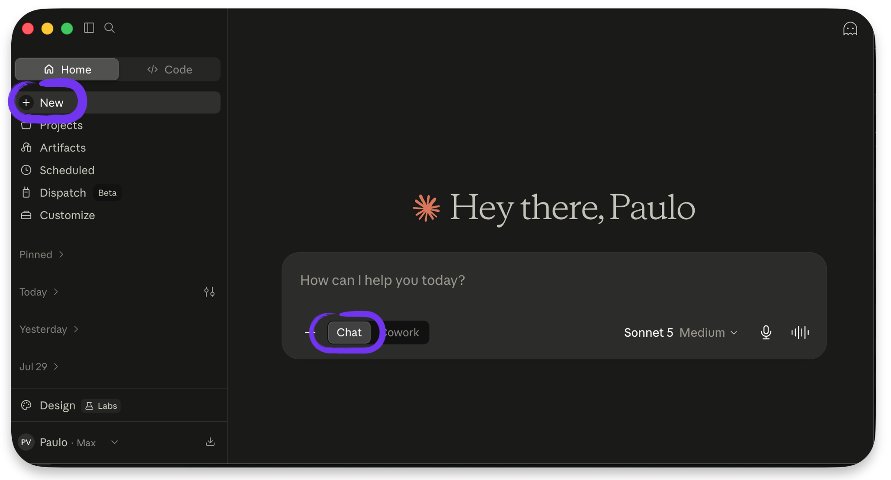
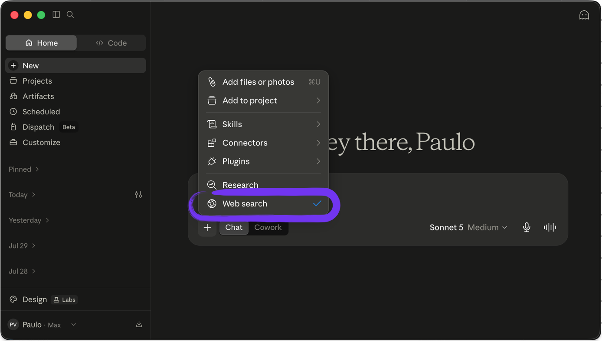
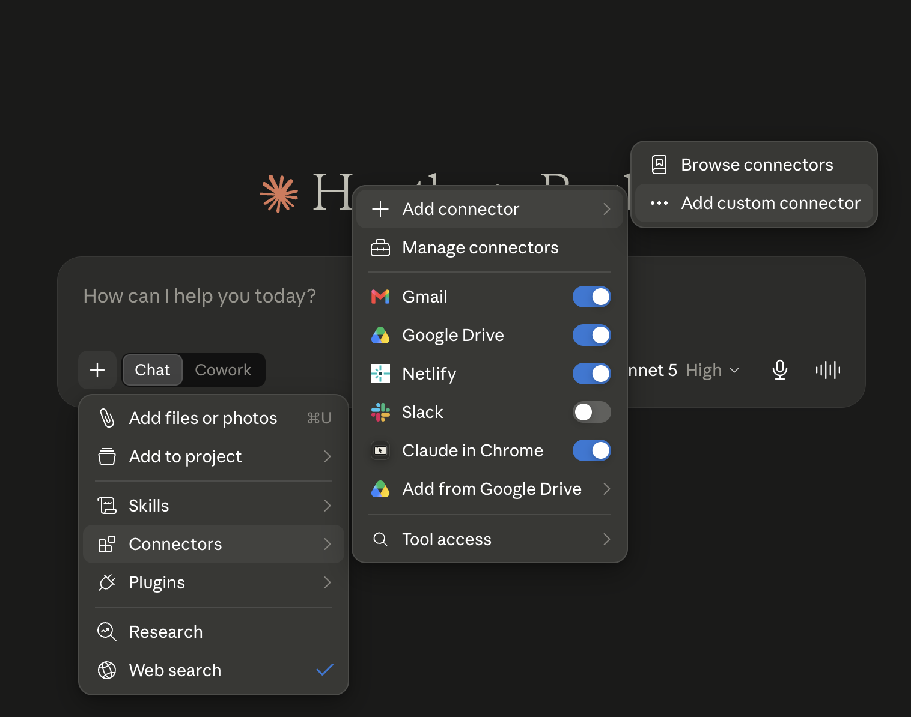
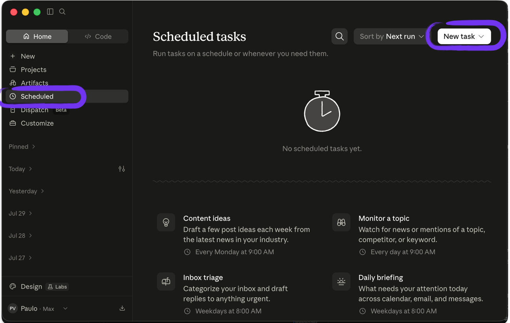

# Thesis

**Claim:** La clase parte del chat de IA de uso diario y hace explícito su límite: responde de memoria de entrenamiento, sin información actual ni acceso a los datos y las apps del usuario. Desde ahí lo extiende con las dos formas de enriquecer el contexto, la búsqueda web y los Connectors, para que consulte fuentes reales y ejecute acciones sobre el mundo del usuario, y con Schedule, para que trabaje solo con una cadencia fija. La segunda clase retoma ese chat extendido y lo lleva a Claude Cowork.

**Why it matters:** El chat que la audiencia ya usa todos los días rinde una fracción de lo que puede. Con Connectors y una tarea programada, esa misma herramienta consulta el inbox y la agenda, busca información actual con sus fuentes citadas, deja un correo redactado y entrega el resumen del lunes sin que nadie lo pida. Automatizar ese trabajo no exige escribir código ni instalar nada.

**Presenter feedback:**

---

# Agenda

**Narrative arc:** La Introducción encuadra la clase abriendo por el problema: las horas que se van en tareas repetitivas y en información dispersa que nadie logra analizar junta, con la barrera de tener que saber programar; recién después llega la respuesta (agentes de IA que ejecutan trabajo), quién es Anthropic, las cuatro herramientas de Claude y la relación entre la app de escritorio y el chat del navegador, con una vista de la pantalla real (1). De ahí baja al concepto que ordena toda la clase, Context augmentation: el chat responde de memoria de entrenamiento, el prompt es lo único que puede cambiar su comportamiento (in-context learning), y hay dos formas de enriquecer ese contexto (2). La primera se abre sola: la búsqueda web, con el contraste entre responder de memoria y responder con fuentes citadas, y la pantalla del chat buscando (3). La segunda es la familia de los Connectors, transversal a todas las IAs: qué son, cómo además de traer información actúan sobre el mundo del usuario, la división entre los que vienen listos (curados por Anthropic) y los externos (sin curación), el directorio y el flujo de autorización, y cómo se da de alta un conector propio por MCP, con los directorios donde buscar servidores publicados (4). Claude in Chrome toma sección propia: opera el navegador que el usuario ya tiene abierto, con sus casos de uso de gestión (5). Con el chat extendido, Schedule lo vuelve proactivo: describir un trabajo una vez, ver dónde se crea la tarea y saber dónde corre, local o en la nube (6). La lámina de conclusiones cierra el contenido en cuatro tiempos: la idea que queda, lo que se puede activar esta semana, la aprobación humana antes de cada acción que importa y el puente a Claude Cowork en la segunda clase. Lo último que se proyecta es la placa divisoria de la misión, que da pie a pasar a mostrar a Faro, el analista de mercado virtual de la empresa Atlas, y su parte 1 resuelta dentro del chat y sin instalar nada; la parte 2 y el salto a Claude Cowork quedan para la segunda clase (7).

**Sections (in delivery order):**

- 1. Introducción
- 2. Context augmentation
- 3. Web search
- 4. Connectors
- 5. Claude in Chrome
- 6. Schedule
- 7. La mission

**Presenter feedback:**

---

# 1. Introducción

**Goal of this section:** Ubicar el terreno antes de arrancar: el problema que la clase viene a resolver (horas de trabajo manual e información dispersa), cómo se lo va a atacar, quién construye la herramienta, cuáles son las cuatro herramientas de Claude y qué relación hay entre la app de escritorio y el chat del navegador, cerrando con la pantalla real sobre la que se trabaja.

**Presenter feedback:**

---

## 1. El problema: horas que se van en trabajo manual

### Content

- El trabajo de oficina está lleno de tareas **repetitivas**: armar el mismo reporte, pasar datos de un lado a otro, resumir el inbox, consolidar planillas.
- La información vive **dispersa**: mails, planillas, PDFs, sistemas internos. Analizarla junta cuesta horas.
- Hasta ahora, automatizar eso pedía **saber programar**, o resignarse a hacerlo a mano.

<!-- generate-image: right | un escritorio de oficina desbordado de tareas manuales: planillas, mails, reportes apilados, el reloj corriendo -->

### Sources

- (slide organizativa de la clase: encuadre del problema a partir de la realidad de trabajo de la audiencia; sin claims de producto.)

### Speaker notes

Abrir con el dolor, no con la herramienta: preguntar a mano alzada quién arma el mismo reporte todas las semanas, o pasa datos de una planilla a un sistema. La problemática tiene dos caras: tareas repetitivas que consumen horas, e información dispersa en mails, planillas y sistemas que nadie logra analizar junta. Y la barrera histórica: automatizar era territorio de quien programa. Esta clase existe porque esa barrera acaba de caer. Tiempo objetivo: ~2 min.

### Presenter feedback

---

## 2. Cómo lo vamos a atacar

### Content

- Con **agentes de IA**: no solo responden, **ejecutan trabajo**, automatizan tareas y analizan datos.
- La herramienta: **Claude Desktop** y sus dos caras, **Chat y Cowork**.
- El camino: esta clase extiende el chat que ya usan (búsqueda, Connectors, Schedule); la segunda baja a Cowork, donde se delega trabajo completo.

<!-- generate-image: right | un camino ascendente en dos tramos: del chat conocido a un agente que trabaja sobre archivos reales -->

### Sources

- (slide organizativa de la clase, mapa del recorrido; sin claims nuevos de producto.)
- Anthropic, Claude Cowork (product page): https://www.anthropic.com/product/claude-cowork; encuadre de Claude Desktop y sus dos caras, Chat y Cowork (ya citada en la slide 1.4 "Las cuatro herramientas de Claude"; Cowork se desarrolla en la segunda clase).

### Speaker notes

La respuesta al dolor de la slide anterior, en alto nivel y sin mecánica: agentes de IA que ejecutan trabajo por vos. No desarrollar acá qué es un agente: el concepto completo se enseña en la segunda clase, la de Cowork, cuando ya se vio qué le faltaba al chat. Presentar la herramienta (Claude Desktop, dos caras) y el mapa del camino: esta clase extiende el chat que ya usan, la segunda da el salto a Cowork. Todo lo que sigue construye pieza por pieza hacia eso. Tiempo objetivo: ~2 min.

### Presenter feedback

---

## 3. Quién es Anthropic

### Content

- **Qué es**: empresa de IA fundada en 2021 en San Francisco por ex-OpenAI, entre ellos los hermanos Dario y Daniela Amodei. Creadora de Claude.
- **Por qué existe**: su apuesta es que la IA va a ser transformacional y que hay que desarrollarla con foco en seguridad. El *safety-first* es su diferencial de marca frente a otros labs.
- **Cómo se estructura**: Public Benefit Corporation, con mandato de balancear ganancias y misión. Entre sus inversores están Google y Amazon.
- **Qué la distingue**: Constitutional AI, foco en interpretabilidad y alineación, y políticas de uso responsable (Acceptable Use Policy, Responsible Scaling Policy).

### Sources

- Anthropic, company page: https://www.anthropic.com/company; "Anthropic is an AI safety and research company... building reliable, interpretable, and steerable AI systems"; Anthropic es una Public Benefit Corporation (verificado 2026-07-30).
- Wikipedia, "Anthropic": https://en.wikipedia.org/wiki/Anthropic; fundación en enero de 2021 por siete ex empleados de OpenAI, entre ellos Dario y Daniela Amodei; sede en San Francisco; inversión de Google y Amazon (verificado 2026-07-30; fuente secundaria para fundación, sede e inversores, no cubiertos en detalle por la company page oficial).
- Anthropic, Constitutional AI / Claude's Constitution: https://www.anthropic.com/news/claudes-constitution; el método de entrenamiento que la empresa presenta como propio.
- Anthropic, Responsible Scaling Policy: https://www.anthropic.com/news/anthropics-responsible-scaling-policy; y Usage Policy: https://www.anthropic.com/legal/aup.
- Contenido de las cuatro cajas aportado por el presentador (2026-07-31); las URLs de Constitutional AI, RSP y AUP quedan pendientes de re-verificación (ver Open questions).

### Speaker notes

Aparte de un minuto y medio, no más: quién está detrás de la herramienta que van a usar toda la charla. Las cuatro cajas se leen como cuatro respuestas cortas. Qué es: empresa de IA fundada en 2021 en San Francisco, con los hermanos Amodei entre sus fundadores y varios de sus primeros investigadores venidos de OpenAI. Por qué existe: la apuesta declarada es que la IA va a ser transformacional y que por eso hay que construirla con foco en seguridad, y esa postura funciona además como diferencial de marca. Cómo se estructura: Public Benefit Corporation, así que el estatuto la obliga a balancear retorno financiero y misión, con Google y Amazon entre los grandes inversores. Qué la distingue: Constitutional AI como método de entrenamiento, el trabajo en interpretabilidad y alineación, y dos políticas públicas, la de uso aceptable y la de escalado responsable. Nada de historia corporativa más allá de esto: la audiencia viene a usar la herramienta. Tiempo objetivo: ~2 min.

### Presenter feedback

- [closed] 2026-07-31 — "Pongamos etas 4 cajas:"
  Resolution: Slide 1.3 reescrita con las cuatro cajas del presentador (Que es, Por que existe, Como se estructura, Que la distingue) como items etiquetados, con fuentes por caja.
Caja	Contenido
1. Qué es	Empresa de IA fundada en 2021 (San Francisco) por ex-OpenAI, entre ellos los hermanos Amodei. Creadora de Claude.
2. Por qué existe	Su apuesta es que la IA va a ser transformacional y por eso hay que desarrollarla con foco en seguridad — "safety-first" como diferencial de marca frente a otros labs.
3. Cómo se financia/estructura	Empresa con estructura de "Public Benefit Corporation" — no es una ONG, pero tiene mandato de balancear ganancias con misión. Grandes inversores: Google, Amazon, etc.
4. Qué la distingue	Constitutional AI, foco en interpretabilidad y alineación, políticas de uso responsable (Acceptable Use Policy, RSP - Responsible Scaling Policy).

- [closed] 2026-07-31 — "Que es"
  Resolution: Bullet cortado del presentador; se interpreto como el inicio de la caja 1 'Que es', ya cubierta por la reescritura de la slide.

---

## 4. Las cuatro herramientas de Claude

### Content

- **Claude Chat/Web** (claude.ai): el asistente conversacional de uso diario, en el navegador. *El tema de esta clase.*
- **Claude Code**: CLI agéntico en la terminal, para developers. Coding de punta a punta.
- **Claude Cowork**: Claude instalado en la computadora, para quien no programa. Trabajo multipaso sobre carpetas y archivos reales. *El foco de la segunda clase.*
- **Claude Design**: prototipos, mockups y slides a partir de una idea, para quien no tiene formación de diseño (founders, product managers).

```ascii
   LAS CUATRO HERRAMIENTAS DE CLAUDE

+---------------+ +---------------+ +---------------+ +---------------+
|  Web / Chat   | |  Claude Code  | |    Cowork     | |    Design     |
| navegador,    | | terminal,     | | escritorio,   | | prototipos,   |
| tareas        | | developers    | | carpetas y    | | mockups y     |
| puntuales     | |               | | archivos      | | slides        |
+---------------+ +---------------+ +---------------+ +---------------+
        |                 |                 |                 |
        |                 +-- misma base ---+                 |
        |                        |                            |
        +------------------------+----------------------------+
                                 |
                     +--------------------------+
                     |   MISMOS MODELOS CLAUDE  |
                     +--------------------------+

   misma base tecnica = mismos archivos, Skills, MCP y el mismo loop
```
<!-- ascii-note:
intent: mostrar las cuatro herramientas de Claude una al lado de la otra y cómo se relacionan por debajo: las cuatro corren sobre los mismos modelos Claude, y Claude Code y Cowork comparten además la misma base técnica.
emphasize: la caja base "MISMOS MODELOS CLAUDE" como cimiento de las cuatro; el lazo "misma base técnica" que une solo a Claude Code y Cowork; resaltar Web/Chat como el foco de esta clase y Cowork como el de la segunda.
labels: cuatro columnas (Web/Chat = navegador; Claude Code = terminal, developers; Cowork = escritorio, carpetas y archivos; Design = prototipos, mockups y slides) sobre una base de modelos Claude compartida.
-->

### Sources

- Anthropic, Claude Cowork (product page): https://www.anthropic.com/product/claude-cowork; "built on the very same foundations as Claude Code" (confirma que Cowork comparte base con Claude Code; Cowork se desarrolla en la segunda clase).
- Anthropic, Introducing Claude Design by Anthropic Labs: https://www.anthropic.com/news/claude-design-anthropic-labs; lanzamiento en research preview, abril de 2026; "lets you collaborate with Claude to create polished visual work like designs, prototypes, slides, one-pagers, and more"; pensado para quien no tiene trasfondo de diseño (founders, product managers, marketers) (verificado 2026-07-30).
- corpus/agentic-ai-deck.zip.md, "Same engine. Different surface." (distinción Code vs Cowork; key claims; slide 7.1 "Claude Code vs Cowork — the close").
- "corpus/mision - auto.zip.md", framing de arquitectura Cowork (local, GUI, sin terminal).
- Anthropic Engineering, Building agents with the Claude Agent SDK: https://www.anthropic.com/engineering/building-agents-with-the-claude-agent-sdk; el engine de agente común (Agent SDK) sobre el que se construyen Claude Code y Cowork.

### Speaker notes

El catálogo y el mapa en una sola lámina. Cuatro herramientas, cuatro públicos: Chat/Web es el asistente de uso diario en claude.ai, para cualquiera, y el tema de esta clase; Code, para quien programa, en la terminal; Cowork, para quien no programa, instalado en la computadora, el foco de la segunda clase; Design, el más nuevo (research preview de abril de 2026), para armar prototipos, mockups y slides sin formación de diseño.

Con el diagrama, la relación entre ellas: es el mismo agente con varias caras, cambia la superficie y para quién está pensada. El matiz técnico, para decir y no para la lámina: Cowork está construido sobre las mismas bases que Claude Code (el Claude Agent SDK), así que Code y Cowork comparten el mismo engine de agente, con los mismos archivos, las mismas Skills, el mismo MCP y el mismo loop de plan, aprobar y redirigir. Web/Chat es ese mismo modelo en una superficie de chat, sin el loop agéntico completo. Design corre sobre los mismos modelos pero con su propia superficie.

Dejar claro el reparto: esta clase se queda en Chat/Web, y la segunda clase entera es Cowork, la cara para quien no trabaja en una terminal. Claude Code aparece solo como contraste; no entramos en sus internals. No hace falta demo acá. Tiempo objetivo: ~4 min.

### Presenter feedback

- [closed] 2026-07-31 — "Agreguemos un slide que sea de titulo "Claude Desktop Chat". Revisa el texto y hacelo mas compacto."
  Resolution: Slide nueva 1.5 'Claude Desktop Chat', en tres bullets compactos (mismo producto, diferencias perifericas, foco en aspectos avanzados) mas la nota de que el core comun hace que todo aplique tambien a Cowork.
 * Son básicamente el mismo producto — mismo modelo, misma cuenta, misma conversación sincronizada. La diferencia es el empaquetado, no la funcionalidad de la pestaña Chat en sí.
 * Existen diferencias entre ambos en algunos puntos claves. 
 * Lo que vamos a hacer es explorar aspectos avancados
 * Agretar como nota que dado que el core es el mismo, lo que vemos aca aplica tambien a CoWork 

- [closed] 2026-07-31 — "Agreguemos otro slide "Chat en Clade desktop y muestra la imagen chat-home.png"
  Resolution: Slide nueva 1.6 'El chat en Claude Desktop', con images/chat-home.png como lamina de pantalla.

---

## 5. Claude Desktop Chat

### Content

- **El mismo producto**: mismo modelo, misma cuenta y la conversación sincronizada entre claude.ai y la app de escritorio. Cambia el empaquetado.
- **Las diferencias aparecen en la periferia**, no en la pestaña Chat: lo que la app de escritorio alcanza en la computadora y la pestaña Cowork que trae al lado.
- **El foco de esta clase**: los aspectos avanzados del chat.

*El core es el mismo, así que todo lo que se ve acá aplica también a Cowork.*

### Sources

- Anthropic, Claude Cowork (product page): https://www.anthropic.com/product/claude-cowork; Claude Desktop como la app que trae Chat y Cowork en el mismo lugar, sobre las mismas bases (verificado 2026-07-30).
- Anthropic Support, Get started with Claude in Chrome: https://support.claude.com/en/articles/12012173-get-started-with-claude-in-chrome; la extensión se habilita desde Settings → Connectors en Claude Desktop (ejemplo de capacidad que vive en la app de escritorio; verificado 2026-07-30).
- Encuadre aportado por el presentador (2026-07-31); los puntos concretos donde web y escritorio difieren quedan pendientes de precisar (ver Open questions).

### Speaker notes

Slide corta, de encuadre, para cortar la confusión antes de que aparezca. La pregunta que la audiencia trae es si el chat del navegador y el de la app de escritorio son cosas distintas. Respuesta: es el mismo producto. Mismo modelo, misma cuenta, la conversación arranca en un lado y sigue en el otro. Lo que cambia es el empaquetado.

Las diferencias existen y aparecen alrededor de la pestaña Chat: la app de escritorio alcanza la computadora del usuario y trae Cowork al lado. Marcarlas cuando aparezcan durante la clase, sin abrir el tema acá.

La nota que conviene decir en voz alta: como el core es el mismo, todo lo que se enseña hoy sobre el chat vale igual dentro de Cowork, así que la segunda clase arranca con esto ya sabido. Tiempo objetivo: ~2 min.

### Presenter feedback

---

## 6. El chat en Claude Desktop

### Content



- La pantalla sobre la que se trabaja el resto de la clase.

### Sources

- Captura de pantalla del presentador, `images/chat-home.png`: la pantalla inicial del chat en Claude Desktop.

### Speaker notes

Lámina de pantalla, casi sin texto. Mostrar dónde está cada cosa: el campo de entrada, el selector de modelo, el acceso a las herramientas y conexiones, el historial de conversaciones al costado. Es el mapa físico de todo lo que viene después, así que conviene señalar con el mouse en vivo en lugar de leer la lámina. Si la clase es presencial y hay proyección, abrir la app real y hacerlo ahí. Tiempo objetivo: ~1 min.

### Presenter feedback

---

# 2. Context augmentation

**Goal of this section:** Instalar el concepto que ordena la clase: el modelo responde desde su memoria de entrenamiento, y lo único que cambia su comportamiento en el momento es lo que entra en el prompt (in-context learning). De ahí salen las dos formas de enriquecer ese contexto, la búsqueda web y los Connectors, que ocupan las secciones siguientes.

**Presenter feedback:**

- [closed] 2026-07-31 — "Esta seccion deberia ser "Context augmentation""
  Resolution: Titulo de seccion cambiado a 'Context augmentation' y Goal reescrito alrededor del in-context learning como concepto ordenador.

---

## 1. El chat responde de memoria

### Content

- De fábrica el chat responde de su **memoria de entrenamiento**: una foto que llega hasta la **fecha de entrenamiento**. No busca información nueva.
- **Información vieja**: lo posterior al corte no existe.
- **Alucinación**: inventa con confianza.
- **In-context learning**: el modelo adapta su comportamiento con lo que ve en el prompt, sin que se actualicen sus pesos ni se lo reentrene. Enriquecer ese contexto es la única palanca disponible.

```ascii
        EL CHAT "COMO VIENE DE FABRICA"
                                             lo que NO ve:
   +---------------------------------+       x  noticias de hoy
   |            CHAT DE IA           |       x  los mails
   |  +---------------------------+  |       x  el calendario
   |  |  MEMORIA DE ENTRENAMIENTO |  |       x  los archivos
   |  |  (foto congelada hasta la |  |       x  las apps del trabajo
   |  |   fecha de entrenamiento) |  |
   |  +---------------------------+  |
   |     responde "de memoria"       |
   |                                 |
   |  lo unico que cambia su         |
   |  comportamiento: EL PROMPT      |
   +---------------------------------+
```
<!-- ascii-note:
intent: mostrar que el chat de IA sin extensiones responde solo desde su memoria de entrenamiento (foto congelada hasta la fecha de entrenamiento), no tiene acceso al mundo del usuario, y que lo único que modifica su comportamiento en el momento es el prompt (in-context learning).
emphasize: la caja interna "MEMORIA DE ENTRENAMIENTO (foto congelada)"; la línea "lo único que cambia su comportamiento: EL PROMPT"; la lista de lo que NO ve (noticias de hoy, mails, calendario, archivos, apps) fuera de la caja.
labels: caja exterior = CHAT DE IA; caja interior = memoria de entrenamiento / fecha de entrenamiento; columna derecha = lo que no ve.
-->

### Sources

- Anthropic Support, Enabling and using web search: https://support.claude.com/en/articles/10684626-enabling-and-using-web-search; el encuadre oficial: sin búsqueda web, Claude responde limitado a su información de entrenamiento; la búsqueda le da acceso a información actual (referencia también para las secciones 3 y 4).
- (concepto general de LLM: fecha de corte / respuestas desde entrenamiento / alucinaciones / in-context learning; material introductorio estándar del curso; sin claim específico de producto.)
- Definición de in-context learning aportada por el presentador (2026-07-31): "la capacidad de un modelo de lenguaje de adaptar su comportamiento o aprender una tarea nueva solo a partir de lo que ve en el prompt, sin que se le actualicen los pesos ni se reentrene".

### Speaker notes

Arrancar desde lo conocido: pedir a mano alzada quién usó un chat de IA esta semana. Van a levantar la mano casi todos (ChatGPT, Gemini, Claude). La idea a instalar: ese chat, tal como viene, responde de memoria. Cuando le preguntás no busca nada; recuerda lo que leyó hasta su fecha de entrenamiento (knowledge cutoff). Un colega brillante que leyó muchísimo hasta una fecha y desde entonces está incomunicado.

Tres consecuencias que ya sufrieron sin saberlo. Una, datos viejos: precios, noticias, versiones de software y papers posteriores al corte no existen para el modelo. Dos, inventos con cara de verdad: cifras, citas y referencias que suenan perfectas y son falsas (insistir en verificar toda salida). Tres, la más limitante para el trabajo real: no ve nada tuyo, ni mails, ni calendario, ni archivos, ni apps.

El cuarto bullet es el que da nombre a la sección y hay que decirlo despacio. Los pesos del modelo están congelados; no se reentrena por usarlo. Lo único que cambia su comportamiento en el momento es lo que entra en el prompt, y a esa capacidad se la llama in-context learning: el modelo aprende una tarea nueva solo a partir de lo que ve ahí. De ahí sale toda la clase: si el prompt es la única palanca, la pregunta es cómo meterle más y mejor contexto. Eso es context augmentation, y tiene dos formas, que vienen en la próxima lámina. Tiempo objetivo: ~5 min.

### Presenter feedback

- [closed] 2026-07-31 — "Borremos la seccion Claude Chat (Desktop) y el slide "El chat responde de memoria" es parte de connector ahora."
  Resolution: La seccion se renombro 'Context augmentation' y quedo como paraguas conceptual (memoria + ICL + las dos vias); Web search y Connectors salieron como secciones propias despues de ella.
- [closed] 2026-07-31 — "Agreguemos que esto es importante en parte de In-context learning: In-context learning (ICL) es la capacidad de un modelo de lenguaje de adaptar su comportamiento o "aprender" una tarea nueva solo a partir de lo que ve en el prompt — sin que se le actualicen los pesos ni se reentrene."
  Resolution: El in-context learning se agrego como cuarto bullet de la slide y como el concepto que da nombre a la seccion Context augmentation, con la definicion del presentador citada en Sources.

---

## 2. Dos formas de enriquecer el modelo

### Content

- El contexto es la única palanca, y hay dos maneras de llenarlo. Las dos recorren el resto de la clase.
- **Buscar en la web**: el chat consulta información actual y cita sus fuentes. Es la más universal y ya viene integrada en casi todos los chats.
- **Conectar el chat a los sistemas del usuario**: mail, calendario, documentos, sistemas internos. Además de traer información, ejecuta acciones.
- Las dos se abren en las secciones que siguen.

### Sources

- Anthropic Support, Enabling and using web search: https://support.claude.com/en/articles/10684626-enabling-and-using-web-search; la búsqueda web como capacidad integrada del chat de Claude, desarrollada en la sección 3.
- Claude blog, Connectors directory: https://claude.com/blog/connectors-directory; el catálogo oficial de conexiones de Claude, desarrollado en la sección 4.

### Speaker notes

Slide puente, corta a propósito: la lámina anterior dejó la pregunta de cómo enriquecer el contexto y esta la contesta en dos ítems, sin desarrollar ninguno. Primero, buscar en la web, que es lo más cercano a lo que la audiencia ya hace. Segundo, conectar el chat a los sistemas donde vive el trabajo de cada uno. El nombre técnico de esa segunda familia (Connectors) aparece recién en la sección 4; acá alcanza con la idea. Las secciones 3 y 4 los abren en profundidad, con demo. Tiempo objetivo: ~2 min.

### Presenter feedback

- [closed] 2026-07-31 — "Lo que viene: conectores y búsqueda. El titulo deberia ser mas "2 formas de enriquecer el modelo""
  Resolution: Slide retitulada 'Dos formas de enriquecer el modelo' y reescrita alrededor de las dos vias: buscar en la web y conectar el chat a los sistemas del usuario.

---

# 3. Web search

**Goal of this section:** La primera forma de enriquecer el contexto, y la que la audiencia ya tiene a mano: la búsqueda web. Fijar el contraste entre responder de memoria y responder con fuentes citadas, dejar la regla práctica de cuándo exigir búsqueda, y mostrar la pantalla real del chat buscando.

**Presenter feedback:**

---

## 1. La misma pregunta, dos modos de responder

### Content

- La búsqueda web viene en casi todos los chats (Claude, ChatGPT, Gemini). Se activa desde la configuración.
- La misma pregunta admite **dos modos de responder**, y el usuario decide cuál.
- El "buscando..." y las fuentes citadas marcan el punto de verificación.
- **Regla: si la respuesta pudo cambiar desde el entrenamiento, la búsqueda es obligatoria.** Precios, noticias, versiones, papers, normativa.

```ascii
   la MISMA pregunta: "¿ultima version de X?"

   DE MEMORIA                        CON BUSQUEDA WEB
+------------------+             +------------------+
| entrenamiento    |             | busca ahora en   |
| hasta fecha de   |             | la web           |
| entrenamiento    |             |   |              |
|   |              |             |   v              |
|   v              |             | info REAL y      |
| respuesta        |             | actual + fuentes |
| (quizas vieja o  |             | citadas          |
|  inventada)      |             +------------------+
+------------------+
```
<!-- ascii-note:
intent: contrastar, para una misma pregunta, la respuesta de memoria de entrenamiento (posiblemente vieja o inventada) contra la respuesta con búsqueda web (información real y actual, con fuentes citadas).
emphasize: que es la MISMA pregunta con dos caminos; el lado derecho termina en "info REAL y actual + fuentes citadas"; el lado izquierdo en "quizás vieja o inventada".
labels: izquierda = DE MEMORIA (fecha de entrenamiento); derecha = CON BÚSQUEDA WEB (busca ahora, cita fuentes).
-->

### Sources

- Anthropic Support, Enabling and using web search: https://support.claude.com/en/articles/10684626-enabling-and-using-web-search; "Web search expands Claude's knowledge with real-time data"; "Every response includes citations, so you can easily verify sources yourself" (verificado 2026-07-09).
- OpenAI Help, ChatGPT search: https://help.openai.com/en/articles/9237897-chatgpt-search; búsqueda web integrada en ChatGPT, automática cuando la pregunta lo amerita, con citas inline (evidencia de que el concepto es transversal; verificado 2026-07-09).

### Speaker notes

Acá se fija la distinción memoria vs información viva, que es la primera respuesta al problema de la sección anterior. Los dos modos, que el diagrama contrasta y la lámina no repite en texto: de memoria, recuerda hasta la fecha de entrenamiento y puede estar viejo o mal; con búsqueda, va a buscar información real y actualizada y cita fuentes.

Con conexión, hacerlo en demo de 2 minutos: la misma pregunta ("¿cuál es la última versión de X?" o "¿qué pasó ayer con Y?") con búsqueda apagada y prendida, y comparar. Señalar el indicador de "buscando..." y las fuentes citadas; enseñarles a mirar eso cada vez.

El tercer bullet es lo que tienen que anotar, y conviene decirlo como regla, no como sugerencia: si la respuesta pudo haber cambiado desde el entrenamiento, exigí búsqueda. Precios, noticias, versiones, papers, normativa. Si hay una sola cosa que se lleven de esta sección, es esa línea. Arrancamos por acá porque ya lo tienen activado; lo que falta es saber cuándo está actuando. Tiempo objetivo: ~5 min (con demo).

### Presenter feedback

- [closed] 2026-07-31 — "Elevemos esto como una seccion que es "web search". En la terminologia no usemos el termino connector. Lo vamos a introducir luego."
  Resolution: Web search es ahora la seccion 3, previa a Connectors; su prosa no usa el termino Connector, que se introduce recien en la seccion 4.
- [closed] 2026-07-31 — "Agregar un slide que muestre webseaerch.png solamente que es un screenshot."
  Resolution: Slide nueva 3.2 'La busqueda en pantalla', solo con images/websearch.png y sin texto que compita con la imagen.
- [closed] 2026-07-31 — ""Regla: si la respuesta pudo cambiar → búsqueda obligada." marcalo como algo imporante."
  Resolution: La regla paso a bullet destacado en negrita y con los ejemplos (precios, noticias, versiones, papers, normativa); las Speaker notes la marcan como lo unico que la audiencia tiene que anotar de la seccion.

---

## 2. La búsqueda en pantalla

### Content



### Sources

- Captura de pantalla del presentador, `images/websearch.png`: el chat buscando en la web y devolviendo la respuesta con sus fuentes.

### Speaker notes

Lámina de pantalla, sin texto que competir con la imagen. Señalar dos cosas y nada más: el indicador de que está buscando mientras responde, y las fuentes citadas al pie de la respuesta. Ese es el punto de verificación que se pidió mirar siempre. Si hay conexión, reemplazar la captura por la pantalla en vivo. Tiempo objetivo: ~1 min.

### Presenter feedback

---

# 4. Connectors

**Goal of this section:** Instalar el concepto de Connector, válido para todas las IAs: con Connectors, el chat consulta los sistemas donde vive el trabajo del usuario (mail, calendario, documentos) y además actúa sobre ellos (mandar mails, agendar reuniones). Sobre esa base, el directorio y el flujo de autorización, y la división entre los Connectors que vienen listos y los externos, que se conectan por MCP.

**Presenter feedback:**

- [closed] 2026-07-31 — "Usemos Connectors en vez de Conectores en toda la presentacion."
  Resolution: Terminologia unificada a 'Connector/Connectors' en todo el deck: thesis, agenda, titulos de seccion y slide, Content, ASCII, Sources y Speaker notes.

---

## 1. Qué es un Connector

### Content

- **Connector** = extensión que conecta el chat a un sistema externo: mail, calendario, documentos.
- Vale igual en ChatGPT, Gemini y Claude.
- Se activa a través de la biblioteca de Connectors. Muchos requieren autenticación.

```ascii
   CHAT SOLO                        CHAT CON CONNECTORS
+----------------+              +----------------+
|     CHAT       |              |     CHAT       |----> [ mail ]
|  responde de   |              |  consulta      |----> [ calendario ]
|  memoria de    |              |  fuentes       |----> [ documentos ]
|  entrenamiento |              |  REALES antes  |----> [ sistemas ]
+----------------+              |  de responder  |
   (aislado)                    +----------------+
                                  (conectado al mundo real)
```
<!-- ascii-note:
intent: contrastar lado a lado el chat aislado (responde de memoria de entrenamiento) contra el chat con Connectors (consulta fuentes reales; mail, calendario, documentos, sistemas internos; antes de responder).
emphasize: el lado derecho con las flechas hacia mail/calendario/documentos/sistemas; la etiqueta "(conectado al mundo real)" vs "(aislado)".
labels: izquierda = CHAT SOLO (aislado, memoria de entrenamiento); derecha = CHAT CON CONNECTORS (mail, calendario, documentos, sistemas).
-->

### Sources

- Claude blog, Connectors directory: https://claude.com/blog/connectors-directory; el catálogo oficial de Connectors de Claude (referencia ampliada en la slide 4.4; verificado 2026-07-09).
- Anthropic Support, Use connectors to extend Claude's capabilities: https://support.claude.com/en/articles/11176164-use-connectors-to-extend-claude-s-capabilities; cómo se activan y usan los Connectors desde la configuración.

### Speaker notes

La slide instala el concepto que ordena la sección: un Connector saca al chat de su aislamiento y le da acceso a leer mail, ver calendario, consultar documentos y entrar a sistemas internos. Repetir que es transversal: vale para ChatGPT, Gemini y Claude. Los nombres cambian ("connectors", "apps", "extensiones"), la idea es la misma.

Usar el diagrama para el contraste: mismo chat, ahora con líneas hacia afuera, y antes de responder puede ir a buscar información a la fuente. El contraste que la lámina ya no repite en texto y el diagrama sí dibuja: chat solo responde de memoria, chat con Connectors consulta fuentes reales antes de responder.

Cerrar bajando la barrera de entrada: esto se activa desde la configuración o desde la biblioteca de Connectors; muchos piden autenticación, así que no es instantáneo, pero tampoco es programar. Tiempo objetivo: ~3 min.

### Presenter feedback

---

## 2. Un Connector deja de ser pasivo

### Content

- Además de traer info, un Connector expone **acciones**: la IA **hace**.
- Verificado de primera mano: **dejar redactado un mail** (borrador en Gmail) y **agendar una reunión** (evento en el calendario).
- Abrir un ticket (Jira, ServiceNow) o mandar un mensaje (Slack): **capacidad del ecosistema**, sin Connector puntual probado en clase.
- Cuidado con las autorizaciones y los permisos. **Un mail enviado sin revisión humana puede generar muchos problemas.**

```ascii
        CONNECTOR: dos direcciones

   LEER (traer info)          ACTUAR (hacer)
   <------------------        ------------------>
+------+           +----------+           +----------+
| CHAT |  <------- |connector |  ------>  | el mundo |
+------+   inbox,  +----------+  mandar   | mail     |
           agenda,              mail,     |calendario|
           noticias             agendar,  | tickets  |
                                ticket    | mensajes |
                                          +----------+
```
<!-- ascii-note:
intent: mostrar que un Connector funciona en dos direcciones: leer (traer información: inbox, agenda, noticias) y actuar (ejecutar acciones: mandar mail, agendar reunión, abrir ticket, mandar mensaje).
emphasize: las dos flechas opuestas LEER vs ACTUAR sobre el mismo Connector; que ACTUAR es la capacidad ejecutiva nueva de esta slide.
labels: izquierda = CHAT; centro = Connector; derecha = el mundo del usuario (mail, calendario, tickets, mensajes); flecha de lectura y flecha de acción.
-->

### Sources

- Model Context Protocol, https://modelcontextprotocol.io; el estándar define herramientas que ejecutan acciones sobre sistemas externos, no solo lectura: "AI applications ... which can access your data and take actions on your behalf" (verificado 2026-07-09).
- Anthropic Support, Getting started with custom connectors using remote MCP: https://support.claude.com/en/articles/11175166-getting-started-with-custom-connectors-using-remote-mcp; los Connectors permiten a Claude "access and take action in these services" (verificado 2026-07-09).
- "corpus/mision - auto.zip.md", el Connector de Gmail **deja un borrador de correo** para el equipo (capacidad ejecutiva en acción, M3 y loop final).
- Verificación de primera mano del presentador (2026-07-09): la acción de **agendar/crear eventos vía el Connector de Calendar** está chequeada y funciona.
- corpus/agentic-ai-deck.zip.md, Connectors como "las manos" del agente (tocar sistemas, no solo leerlos).

### Speaker notes

Segunda idea de la sección, pegada a la definición: el Connector no se queda en traer información, también ejecuta acciones sobre los sistemas conectados. Los dos primeros ejemplos están verificados de primera mano y se pueden demostrar en vivo: el borrador de Gmail (misión de Faro) y agendar por Calendar, que el docente chequeó. Los otros dos, tickets y mensajes, son capacidad del ecosistema (el estándar MCP y los Connectors lo permiten) y así están marcados en la lámina: no prometer una demo en vivo de esos dos sin chequear antes.

Balancear con el control: nada de esto pasa sin que el usuario haya conectado y autorizado el servicio, y ninguna acción que importe debería ejecutarse sin que un humano la apruebe. La práctica sana mientras aprenden es borrador y no envío directo; Faro hace eso, deja el borrador en Gmail y no lo manda. Tiempo objetivo: ~3 min.

### Presenter feedback

---

## 3. Out of the box y externos

### Content

- Los Connectors se dividen en dos familias, según quién los prepara: los que vienen listos con el producto y los que conecta el equipo.
- Los **out of the box están curados por Anthropic**: entran al directorio oficial después de pasar por su revisión.
- Toda la familia externa se conecta por el **protocolo MCP**, y ahí la curación no existe: Anthropic no verifica esos servicios.
- De ahí el criterio de confianza. Autorizar un Connector externo le da acceso a los datos del usuario, así que conviene reservarlo para servicios confiables.

```ascii
                  CONNECTORS
                       |
        +--------------+---------------+
        v                              v
  OUT OF THE BOX                   EXTERNOS
  vienen listos                    los conecta el equipo
  · busqueda web                   · CRM / ERP
  · Claude in Chrome               · base interna
  · Gmail / Calendar / Drive       · servicio de un tercero
        |                              |
        v                              v
  se activan desde la              todos por el
  biblioteca de Connectors         protocolo MCP
  CURADOS por Anthropic            SIN curacion
```
<!-- ascii-note:
intent: separar los Connectors en dos familias según quién los prepara: los que vienen listos con el producto (out of the box) y los externos que conecta un equipo, y marcar que toda la rama externa pasa por el protocolo MCP.
emphasize: las dos ramas como categorías paralelas; el remate de cada rama (biblioteca de Connectors y curación de Anthropic a la izquierda, protocolo MCP y ausencia de curación a la derecha).
labels: raíz = CONNECTORS; rama izquierda = OUT OF THE BOX (búsqueda web, Claude in Chrome, Gmail/Calendar/Drive); rama derecha = EXTERNOS (CRM/ERP, base interna, servicio de un tercero).
-->

### Sources

- Claude blog, Discover tools that work with Claude (Connectors directory): https://claude.com/blog/connectors-directory; el catálogo oficial de Connectors listos para usar (verificado 2026-07-09).
- Anthropic Support, Use connectors to extend Claude's capabilities: https://support.claude.com/en/articles/11176164-use-connectors-to-extend-claude-s-capabilities; los Connectors listos se activan desde la configuración de Claude.
- Anthropic Support, Getting started with custom connectors using remote MCP: https://support.claude.com/en/articles/11175166-getting-started-with-custom-connectors-using-remote-mcp; la curación se lee por contraste en la fuente oficial, que describe los externos como servicios "that have not been verified by Anthropic"; los Connectors fuera del catálogo se agregan vía MCP y "allow you to connect Claude to services that have not been verified by Anthropic, and allow Claude to access and take action in these services" (verificado 2026-07-09).
- Model Context Protocol (sitio oficial del estándar): https://modelcontextprotocol.io; el protocolo por el que se conectan los servicios externos.

### Speaker notes

El ordenador mental de la sección: no todos los Connectors salen del mismo lugar. Los out of the box vienen con el producto, están curados por Anthropic (pasan por su revisión antes de entrar al directorio) y el usuario solo los activa; la búsqueda web que se vio en la sección anterior está en esa familia, igual que Gmail, Calendar, Drive y Claude in Chrome, que llega en la sección 5. Los externos son los que una empresa monta contra sus propios sistemas (CRM, ERP, una base interna), y ahí aparece el estándar: todos hablan MCP.

La curación es lo que sostiene el criterio de confianza, así que conviene decirlo con todas las letras: lo que está en el directorio pasó por Anthropic, lo que se conecta por MCP no. Eso no vuelve peligroso a lo externo, pero cambia quién responde si algo sale mal.

Para esta audiencia el mensaje es de rol. La familia out of the box la maneja cualquier usuario desde la biblioteca de Connectors; la externa la arma un equipo técnico y después el usuario la usa desde el mismo lugar que las otras. Las cuatro slides que siguen bajan a cada familia, una por vez. Tiempo objetivo: ~2 min.

### Presenter feedback
- [closed] 2026-07-31 — "Agregar que los out of the box estan curados por Anthropic"
  Resolution: La curacion de Anthropic entro como bullet propio en el Content, como linea nueva en el ASCII (CURADOS por Anthropic / SIN curacion), en las Speaker notes y en la cita de Sources por contraste con 'not been verified by Anthropic'.

---

## 4. El directorio de Connectors

### Content


- El **directorio oficial de Claude** lista los Connectors listos para usar, incluidos proveedores de datos del sector, por ejemplo un proveedor de noticias financieras.

### Sources

- Claude blog, Discover tools that work with Claude (Connectors directory): https://claude.com/blog/connectors-directory; anuncio oficial del directorio; navegar y conectar desde claude.ai/directory (verificado 2026-07-09; el directorio en sí requiere login).
- Captura de pantalla del presentador, `images/connectors_directory.png`.
- "corpus/mision - auto.zip.md", MT Newswires "ya tiene un connector listo" (Step 2.1).

### Speaker notes

Primera de las dos láminas de pantalla de esta familia, una imagen por slide para que se lea proyectada. Mostrar el directorio y recorrer con el mouse dos o tres categorías, para desarmar el "esto es técnico": lo que hay ahí es un catálogo, no una consola.

Mencionar que el directorio también trae proveedores de datos de sector, sin nombrar todavía el de la misión: el reveal de Faro es la sección 7 y adelantarlo acá lo gasta. Tiempo objetivo: ~2 min.

### Presenter feedback

- [closed] 2026-07-31 — "Mirar el layout de las imagenes. No esta quedando bien."
  Resolution: Las dos capturas se separaron en dos slides (4.4 El directorio de Connectors y 4.5 Buscar, conectar y autorizar), una imagen por lamina, para que cada una se lea proyectada.

---

## 5. Buscar, conectar y autorizar

### Content


- Flujo básico: **buscar el servicio, conectar y autorizar**. Como conectar Gmail a una app nueva.
- Ejemplos guía: **mail y calendario**. "¿Qué mails me perdí ayer? ¿Qué tengo esta semana?"

### Sources

- Anthropic Support, Use connectors to extend Claude's capabilities: https://support.claude.com/en/articles/11176164-use-connectors-to-extend-claude-s-capabilities; cómo se conectan y usan los Connectors desde la configuración.
- Captura de pantalla del presentador, `images/connector_browser.png`.
- corpus/agentic-ai-deck.zip.md, matriz 5.6 (Connectors configurados por la Settings UI; directorio + conexión).
- "corpus/mision - auto.zip.md", Gmail Connector conectado desde la UI (M3); "no estás programando: te conectás a un servicio que ya existe".

### Speaker notes

Segunda lámina de pantalla y la parte práctica: conectar un servicio implica buscarlo, tocar Connect y autorizarlo, igual que cuando se conecta Gmail a cualquier app. Se configura por la interfaz, sin archivo local que editar.

Insistir en mail y calendario, los ejemplos guía de la sección: con Gmail conectado el chat lee y resume el inbox, con Calendar ve la agenda. Son preguntas que el chat aislado no puede responder, y las dos frases del bullet funcionan bien como demo si hay cuenta conectada.

Nota: las capturas son de la app de Claude; el flujo de buscar, conectar y autorizar es el mismo en el chat del navegador. Tiempo objetivo: ~2 min.

### Presenter feedback

---

## 6. External connectors: todo pasa por MCP

### Content

- **Connectors externos**: los que una empresa conecta contra sus propios sistemas o los de un tercero, fuera del catálogo listo para usar.
- Todos se conectan por **MCP** (Model Context Protocol), el estándar que traduce el pedido del usuario en llamadas al servicio conectado.
- Ejemplo: el usuario pide "los pedidos abiertos del cliente X" y el Connector consulta el ERP de la empresa y devuelve la respuesta al chat.
- Un chat que se informa y actúa puede trabajar **solo** (sección 6).

```ascii
+--------+   pide datos    +-----------+   protocolo   +----------------+
| CHAT / | --------------> | Connector |  -- MCP -->   | Servicio       |
| agente |                 |  externo  |               | CRM/ERP/base   |
+--------+ <-------------- +-----------+ <-----------  +----------------+
            devuelve datos
```
<!-- ascii-note:
intent: mostrar el flujo de una llamada a un Connector externo: el chat/agente pide datos, el Connector traduce el pedido vía el protocolo MCP, el servicio de la empresa responde.
emphasize: la etiqueta "MCP" sobre la flecha del medio, como el estándar único de toda la familia externa; el Connector como puente entre el chat y el servicio.
labels: Chat/agente -> Connector externo -> Servicio (CRM / ERP / base interna); flecha de ida "pide datos", flecha de vuelta "devuelve datos".
-->

### Sources

- corpus/agentic-ai-deck.zip.md, definición de Connector (MCP): "The hands"; slide 5.4 (rango de MCP; "any app that exposes an MCP server").
- Model Context Protocol (sitio oficial del estándar): https://modelcontextprotocol.io; qué es MCP y cómo las plataformas exponen herramientas; base de los Connectors externos.
- Anthropic Support, Getting started with custom connectors using remote MCP: https://support.claude.com/en/articles/11175166-getting-started-with-custom-connectors-using-remote-mcp; los Connectors fuera del catálogo se agregan vía MCP remoto.
- "corpus/mision - auto.zip.md", MT Newswires "ya tiene un connector listo" (Step 2.1).

### Speaker notes

Cierre técnico de la sección, sin asustar a nadie. La familia externa es la que una empresa arma contra sus propios sistemas, y toda ella pasa por el mismo estándar: MCP, el Model Context Protocol. Usar el diagrama para explicar qué pasa por debajo: el chat pide datos, el Connector traduce ese pedido en llamadas al servicio, el servicio responde. El patrón se repite siempre: la plataforma expone sus acciones como herramientas y la IA las usa.

La imagen que mejor funciona, para decir: los Connectors son las manos de la IA, lo que puede tocar y que de otro modo no podría (Drive, Gmail, Calendar, Slack, bases de datos). Quién lo arma: el equipo técnico expone un servidor MCP y ese servicio queda disponible como un Connector más; nadie de esta clase va a escribir uno.

Cerrar anunciando la sección 5, que es un Connector con entidad propia, y sembrando la 6: un chat que se informa y actúa, más una cadencia fija, trabaja solo. Tiempo objetivo: ~2 min.

### Presenter feedback
- [closed] 2026-07-31 — "Agreguemos un slide como agregar un external connect. Usemos el screenshot custom-connector.png y el texto Y esta tabla:"
  Resolution: Dos slides nuevas al final de la seccion 4: 4.7 'Agregar un external connector' con images/custom-connector.png, y 4.8 'Donde buscar servidores MCP publicados' con la tabla de cinco directorios del presentador.
* Dónde buscar servidores MCP publicados:
Fuente	Qué encontrás
github.com/modelcontextprotocol/servers	Repo de referencia mantenido por la comunidad/Anthropic
PulseMCP (pulsemcp.com)	Directorio curado, marca cuáles son oficiales del proveedor
Smithery (smithery.ai)	Marketplace de servidores MCP, instalación asistida
Glama (glama.ai/mcp/servers)	Directorio con ranking y metadata de cada servidor
mcp.so	Listado comunitario amplio


---

## 7. Agregar un external connector

### Content



- Se agrega desde la misma biblioteca de Connectors, con la opción de conector propio.
- Lo que hay que tener a mano: la **URL del servidor MCP** y, si el servicio lo pide, sus credenciales.
- Quien monta el servidor es el equipo técnico. Quien lo agrega y lo usa, cualquiera.

### Sources

- Anthropic Support, Getting started with custom connectors using remote MCP: https://support.claude.com/en/articles/11175166-getting-started-with-custom-connectors-using-remote-mcp; el alta de un conector propio desde la configuración de Claude, con la URL del servidor MCP remoto y la advertencia de que son servicios no verificados por Anthropic (verificado 2026-07-09).
- Captura de pantalla del presentador, `images/custom-connector.png`.

### Speaker notes

Lámina de pantalla que baja a tierra la sección anterior: cómo se agrega en la práctica uno de los externos. El punto que desarma el miedo es que el alta vive en el mismo lugar que todo lo demás, la biblioteca de Connectors, con una opción para conector propio.

Lo único distinto es lo que hay que pegar ahí: la URL del servidor MCP, y credenciales si el servicio las pide. De nuevo el reparto de roles, que es lo que esta audiencia necesita: el servidor lo levanta el equipo técnico, el alta la hace cualquiera con la URL en la mano.

Repetir el cuidado de la lámina anterior antes de pasar: acá no hay curación de Anthropic, así que el servicio tiene que ser confiable. Tiempo objetivo: ~2 min.

### Presenter feedback

---

## 8. Dónde buscar servidores MCP publicados

### Content

| Fuente | Qué encontrás |
|---|---|
| github.com/modelcontextprotocol/servers | Repo de referencia mantenido por la comunidad y Anthropic |
| PulseMCP (pulsemcp.com) | Directorio curado, marca cuáles son oficiales del proveedor |
| Smithery (smithery.ai) | Marketplace de servidores MCP, instalación asistida |
| Glama (glama.ai/mcp/servers) | Directorio con ranking y metadata de cada servidor |
| mcp.so | Listado comunitario amplio |

### Sources

- Lista aportada por el presentador (2026-07-31). Las cinco fuentes son directorios de terceros, fuera del catálogo oficial de Anthropic; quedan pendientes de re-verificación antes de presentar (ver Open questions).
- Model Context Protocol (sitio oficial del estándar): https://modelcontextprotocol.io; el estándar bajo el que publican todos estos servidores.

### Speaker notes

Lámina de referencia, para que se la lleven anotada más que para leerla en voz alta. La idea de fondo: MCP es un estándar abierto, así que ya existe un ecosistema de servidores publicados y directorios que los listan.

Marcar la diferencia de criterio entre las cinco, que es lo único que importa acá. El repo de modelcontextprotocol es la referencia; PulseMCP marca cuáles son oficiales del proveedor, que es el dato más útil para decidir si conectarlo; Smithery agrega instalación asistida; Glama suma ranking y metadata; mcp.so es el listado más amplio y el menos filtrado.

Cerrar con la advertencia que ya se dio dos veces y vale la tercera: ninguno de estos directorios es Anthropic. Antes de autorizar uno, mirar quién publica el servidor. Tiempo objetivo: ~2 min.

### Presenter feedback

---

# 5. Claude in Chrome

**Goal of this section:** Dedicarle sección propia al Connector que más sorprende a esta audiencia: Claude in Chrome opera el navegador que el usuario ya tiene abierto, con las sesiones ya iniciadas, y por eso entra a sistemas web que no tienen API ni exportación. Qué es, y en qué casos de gestión conviene usarlo.

**Presenter feedback:**

- [closed] 2026-07-31 — "Borrá la slide "Cuidado: prompt injection"."
  Resolution: Slide 'Cuidado: prompt injection' eliminada del deck; el contenido completo, su ASCII y su fuente quedaron archivados en Cut material, y el tema sobrevive en las Speaker notes de 5.1 y en el tercer bullet de la lamina de cierre.

---

## 1. Que es Claude in Chrome ?

### Content

- **Claude in Chrome**: una extensión de Chrome. Claude abre un panel al costado de la página y ve lo mismo que ve el usuario.
- Trabaja dentro de la sesión del navegador ya iniciada, en los sitios donde el usuario ya está identificado.
- Qué hace ahí: navega, hace clic, completa formularios y encadena varios pasos entre pestañas.
- Trae conocimiento incorporado de **Slack, Google Calendar, Gmail y Google Docs**, así que responde a un pedido en lenguaje corriente ("agendá una reunión").
- Se habilita desde la biblioteca de **Connectors** en Claude Desktop, como cualquier otro.

```ascii
   PAGINA WEB ABIERTA          CLAUDE IN CHROME
   (sesion ya iniciada)        (panel lateral)
+------------------------+   +--------------------+
|                        |   |                    |
|  formulario del CRM    |-->| lee lo que hay     |
|  hilo de mail          |   | en la pantalla     |
|  tablero del proveedor |   |                    |
|                        |<--| navega, hace clic, |
|                        |   | completa campos,   |
+------------------------+   | maneja pestanas    |
                             +--------------------+
```
<!-- ascii-note:
intent: mostrar que Claude in Chrome trabaja en un panel al costado de la página abierta, dentro de la sesión que el usuario ya tiene iniciada: lee lo que aparece en pantalla y ejecuta acciones sobre ese mismo sitio.
emphasize: las dos flechas opuestas (de la página hacia Claude = leer; de Claude hacia la página = actuar); que el panel convive con la página en la misma ventana.
labels: izquierda = página web abierta (sesión ya iniciada); derecha = Claude in Chrome (panel lateral), con lo que lee y lo que hace.
-->

### Sources

- Anthropic Support, Get started with Claude in Chrome: https://support.claude.com/en/articles/12012173-get-started-with-claude-in-chrome; "Claude in Chrome is a browser extension that allows Claude to read, click, and navigate websites alongside you"; panel lateral que acompaña la navegación; manejo de varias pestañas; "Claude has built-in knowledge of how to navigate popular platforms including Slack, Google Calendar, Gmail, Google Docs, and GitHub"; disponible en todos los planes pagos (Pro, Max, Team, Enterprise), solo en Chrome de escritorio ("not supported on other Chromium-based web browsers or mobile devices"); se habilita como Connector desde Settings → Connectors en Claude Desktop (fuente oficial del proveedor; verificado 2026-07-30).
- Anthropic Support, Use Claude in Chrome safely: https://support.claude.com/en/articles/12902428-use-claude-in-chrome-safely; prompt injection como el riesgo principal de las IAs que navegan; clasificadores sobre el contenido entrante y sobre cada acción; "the chances of an attack are still non-zero"; recomendaciones de sitios confiables, perfil de navegador separado y revisión de las acciones propuestas (fuente del cuidado que el presentador da en voz; verificado 2026-07-30).

### Speaker notes

El caso que más sorprende a esta audiencia. La idea a instalar: hasta acá el Connector traía datos de un servicio; Claude in Chrome opera el navegador que el usuario ya tiene abierto, con las sesiones ya iniciadas. Por eso entra a sistemas que no tienen API ni integración: si el usuario puede hacerlo con el mouse, Claude puede hacerlo. Mostrar el panel lateral en la pantalla si hay conexión; con eso solo se entiende.

Disponibilidad, para decir y no para la lámina: planes pagos (Pro, Max, Team, Enterprise) y solo en Chrome de escritorio, no en otros navegadores basados en Chromium ni en móvil.

El cuidado, en voz y sin lámina propia (la slide de prompt injection salió del deck por decisión del presentador el 2026-07-31): una página o un mail pueden traer instrucciones ocultas que Claude lea como si vinieran del usuario. Anthropic lo documenta como el riesgo principal de cualquier IA que navegue, corre clasificadores sobre el contenido entrante y sobre cada acción antes de ejecutarla, y aun así aclara que el riesgo no es cero. La postura práctica: sitios confiables, un perfil de navegador separado de las cuentas sensibles, y el humano aprueba antes de que se ejecute algo que importa. Decirlo con esas palabras, sin suavizarlo, y volver sobre ello en la lámina de cierre. Tiempo objetivo: ~4 min.

### Presenter feedback

---

## 2. Cuándo sirve Claude in Chrome

### Content

- **Cargar datos en un sistema web**: pasar al CRM o al ERP lo que llegó por mail o en una planilla, campo por campo.
- **Comparar proveedores**: precios y condiciones abiertos en varias pestañas, consolidados en un cuadro.
- **Coordinar agenda y correo**: leer el hilo, agendar la reunión en Google Calendar y dejar la respuesta escrita.
- **Relevar un portal que no exporta**: listados de precios, licitaciones o estados de pedido, volcados a una tabla.

```ascii
   EL PATRON COMUN DE LOS CUATRO CASOS

   +-----------------------------+
   | un sitio web SIN exportar   |
   | ni integracion (sin API)    |
   +-----------------------------+
                 |
                 v
   +-----------------------------+      a mano: pestana por
   | una tarea repetitiva sobre  | ---> pestana, campo por
   | esa misma pantalla          |      campo, todas las semanas
   +-----------------------------+
                 |
                 v
   +-----------------------------+
   | CLAUDE IN CHROME opera el   |
   | navegador ya abierto        |
   +-----------------------------+
                 |
                 v
   el dato queda cargado / la tabla queda armada
```
<!-- ascii-note:
intent: mostrar el denominador común de los cuatro casos de uso, en vez de repetirlos en texto: un sitio web sin exportación ni integración, más una tarea repetitiva sobre esa misma pantalla, es exactamente el terreno donde Claude in Chrome opera el navegador que ya está abierto.
emphasize: la caja "CLAUDE IN CHROME opera el navegador ya abierto" como el punto de la lámina; el contraste entre el camino manual (pestaña por pestaña, campo por campo) y el resultado de abajo.
labels: cadena vertical de tres cajas (sitio sin exportar → tarea repetitiva → Claude in Chrome) con el remate "el dato queda cargado / la tabla queda armada" al pie.
-->

### Sources

- Anthropic Support, Get started with Claude in Chrome: https://support.claude.com/en/articles/12012173-get-started-with-claude-in-chrome; completado de formularios y campos, consolidación entre varias pestañas, workflows multipaso que siguen corriendo en segundo plano, conocimiento incorporado de Gmail y Google Calendar (base de los cuatro casos; fuente oficial del proveedor; verificado 2026-07-30).
- (los cuatro casos son adaptación del presentador al perfil de gestión de la audiencia, apoyados en las capacidades documentadas arriba; no son casos publicados por Anthropic.)

### Speaker notes

Los cuatro casos están elegidos para un perfil de gestión, no de desarrollo. El denominador común, que el diagrama dibuja, es un sitio web sin exportación ni integración y una tarea repetitiva de copiar y pegar. Preguntar a mano alzada quién carga datos a mano en un sistema interno: ahí aterriza el primer caso. El segundo es el que mejor muestra el manejo de varias pestañas a la vez. El tercero se apoya en que Claude ya sabe moverse dentro de Gmail y Google Calendar. El cuarto es el clásico portal del proveedor o del organismo público sin botón de exportar.

Cerrar la sección repitiendo el cuidado en una frase: el humano aprueba antes de cada acción que importa. Tiempo objetivo: ~2 min.

### Presenter feedback

---

# 6. Schedule

**Goal of this section:** Que la audiencia entienda qué es Schedule (describir un trabajo una vez, fijar una cadencia, que corra sola), cómo se potencia con los Connectors (el resumidor semanal de mails) y la pregunta práctica antes de confiarle algo: ¿dónde corre? Local, con la computadora prendida, o nube. Todavía desde el mundo del chat.

**Presenter feedback:**

---

## 1. Describir una vez, que corra sola

### Content

- **Schedule** = describir un trabajo una vez y fijarle una cadencia; el prompt se ejecuta solo, sin volver a pedirlo.
- El ejemplo: *"todos los días 8:00, resumí mi inbox, lo urgente arriba."*
- Existe en **ChatGPT** ("tasks") y en **Claude** (claude.ai, desde el navegador).

```ascii
        SCHEDULE (se describe UNA vez)

  [reloj: lunes 8:00]
        |
        v
  +-----------+   usa Connectors   +--------------+
  |  la tarea | -----------------> | mail / web / |
  |  corre    | <----------------- | calendario   |
  |  sola     |    trae la info    +--------------+
  +-----------+
        |
        v
  resumen listo en el chat, cada semana,
  sin pedirlo de nuevo
```
<!-- ascii-note:
intent: mostrar el ciclo de un Schedule: un disparador de calendario (lunes 8:00) ejecuta la tarea, que usa los Connectors (mail/web/calendario) para traer información y deja el resultado listo sin intervención del usuario.
emphasize: que se describe UNA vez y corre sola; el reloj como disparador; el uso de Connectors dentro de la corrida; el resultado que "aparece" cada semana.
labels: reloj (cadencia) -> la tarea corre sola -> Connectors (mail/web/calendario) -> resumen listo en el chat.
-->

### Sources

- OpenAI Help, Tasks in ChatGPT: https://help.openai.com/en/articles/10291617-tasks-in-chatgpt; tareas programadas en el chat de ChatGPT (evidencia transversal del concepto; verificado 2026-07-09).
- Anthropic Support, Release notes (entrada del 7 de julio de 2026): https://support.claude.com/en/articles/12138966; "scheduled tasks run with no device online"; sesiones remotas (beta); rollout empezando por Max (verificado 2026-07-09).
- Observación de primera mano del presentador (2026-07-09): tareas programadas activas en claude.ai en el navegador.
- TechCrunch (2026-07-07), "The coding agent wars are spilling into the rest of the office": https://techcrunch.com/2026/07/07/the-coding-agent-wars-are-spilling-into-the-rest-of-the-office-claude-cowork/; cobertura de prensa: expansión a web/mobile, corridas en background sin dispositivo activo, rollout Max (encuadre de terceros).
- Anthropic Support, Schedule recurring tasks in Claude Cowork: https://support.claude.com/en/articles/13854387-schedule-recurring-tasks-in-claude-cowork; la forma Cowork del Schedule.
- "corpus/mision - auto.zip.md", el flujo programado de Atlas (Step 3.3): la semilla del "resumidor que corre solo".

### Speaker notes

Slide-concepto de la sección, en dos mitades. Primera: se describe el trabajo una vez, se elige cadencia (diaria, semanal, a demanda) y corre solo, avisando con el resultado. Segunda, que el diagrama dibuja en su caja del medio y la lámina ya no repite en texto: la tarea hereda los Connectors ya configurados (mail, web, calendario).

El resumidor de mails funciona como ejemplo porque el inbox desbordado es un problema que la audiencia vive. Variante semanal: "los lunes a las 8:00, resumime la semana del calendario más los mails sin responder". Contarlo en primera persona si se puede ("mi resumen de las 8:00").

Marcar que existe en los dos mundos: ChatGPT lo llama "tasks" (recordatorios, briefings diarios, monitoreo) y Claude ya las ofrece en claude.ai desde el navegador. Si el rollout lo permite, mostrarlas EN VIVO desde la cuenta del docente, que ya las usa. La pregunta de dónde corre la tarea viene en la próxima slide; no adelantarla. Tiempo objetivo: ~5 min.

### Presenter feedback
- [closed] 2026-07-31 — "Agregar un slide con el screenshot schedule.png que es que muestra donde esta y como clearlo."
  Resolution: Slide nueva 6.2 'Donde vive el Schedule', con images/schedule.png; la vieja 6.2 paso a 6.3.
---

## 2. Dónde vive el Schedule

### Content



- Se crea desde la misma conversación: describir el trabajo, elegir la cadencia y guardar.

### Sources

- Captura de pantalla del presentador, `images/schedule.png`: la pantalla de tareas programadas y el alta de una tarea.
- Anthropic Support, Release notes (7 de julio de 2026): https://support.claude.com/en/articles/12138966; las tareas programadas en el chat de Claude (verificado 2026-07-09).

### Speaker notes

Lámina de pantalla, pegada al concepto de la anterior. Señalar dos cosas: dónde está la entrada a las tareas programadas y cómo se ve el alta de una nueva. Con eso la audiencia sabe adónde ir el lunes.

Si hay conexión, hacerlo en vivo desde la cuenta del docente en lugar de mostrar la captura: crear una tarea de prueba lleva menos de un minuto y se entiende mejor que cualquier explicación. Aprovechar para mostrar también dónde se listan las tareas ya creadas, que es donde van a volver a mirar si el resumen de las 8:00 no aparece. Tiempo objetivo: ~2 min.

### Presenter feedback

---

## 3. ¿Dónde corre? Local o nube

### Content

- Antes de confiarle algo a un Schedule: **saber dónde corre**.
- Los Schedule que usan **archivos o apps locales** corren local **siempre**, incluso con la ejecución en la nube disponible.

```ascii
   el Schedule: ¿DONDE corre?
              |
      +-------+----------------------+
      v                              v
  LOCAL (hoy, la mayoria)      NUBE (beta, jul 2026 ->)
  · computadora prendida       · sin computadora prendida
  · app abierta                · rollout gradual (Max 1ro)
  · apagada o suspendida:      · PERO: archivos/apps
    la corrida puede perderse    locales => local igual
  · ojo laptops suspendidas
```
<!-- ascii-note:
intent: mostrar la bifurcación práctica de un Schedule según dónde corre: LOCAL (computadora prendida + app abierta; si está apagada o suspendida la corrida puede perderse; cuidado con laptops que se suspenden) vs NUBE (sin computadora prendida, beta desde julio 2026, rollout Max primero; excepción: tareas con archivos/apps locales corren local igual).
emphasize: la bifurcación como pregunta ("¿DÓNDE corre?"); en LOCAL los tres cuidados prácticos (prendida, app abierta, la corrida puede perderse); en NUBE que no hace falta la computadora prendida pero es beta/rollout gradual, con la excepción de archivos locales.
labels: raíz = el Schedule ¿dónde corre?; rama izquierda = LOCAL (hoy, la mayoría) con cuidados; rama derecha = NUBE (beta, julio 2026) con condiciones.
-->

### Sources

- Anthropic Support, Schedule recurring tasks in Claude Cowork: https://support.claude.com/en/articles/13854387-schedule-recurring-tasks-in-claude-cowork; ejecución remota ("run on their cadence even when your computer is asleep or the Claude Desktop app is closed") y la excepción local: "If a scheduled task requires local files or apps, it will only run locally" (verificado 2026-07-09).
- Anthropic Support, Release notes (7 de julio de 2026): https://support.claude.com/en/articles/12138966; "scheduled tasks run with no device online"; beta, rollout gradual empezando por Max (verificado 2026-07-09).
- TechCrunch (2026-07-07): https://techcrunch.com/2026/07/07/the-coding-agent-wars-are-spilling-into-the-rest-of-the-office-claude-cowork/; corridas en background sin dispositivo activo, disponible primero para suscriptores Max (encuadre de terceros).
- Comportamiento local "se saltea y corre al volver": documentado en la versión anterior del artículo 13854387 (verificada en junio 2026, cuando la ejecución era solo local); la versión actual ya no lo detalla; mantenido como cuidado práctico del modo local, con esa atribución.

### Speaker notes

La slide del consejo práctico que pidió el presentador: "tengan en cuenta que la computadora esté prendida". Hoy conviven dos realidades y hay que enseñar las dos. Una: la ejecución en la nube existe desde el 7 de julio de 2026, la tarea corre sin la computadora del usuario, pero es beta y llega de a poco, empezando por el plan Max. Dos: mientras a la cuenta no le llegue, la tarea corre local. Computadora prendida y app abierta, o no corre.

Los cuidados del modo local son los que la mayoría de la audiencia va a vivir este cuatrimestre. Si la computadora está apagada o suspendida a la hora programada, la corrida puede perderse: la versión anterior del artículo 13854387 (verificada en junio de 2026, cuando la ejecución era solo local) documentaba que la tarea se salteaba y corría al volver, y la versión actual ya no lo detalla. Decirlo como cuidado práctico con esa atribución, nunca como spec vigente. Las laptops se suspenden solas; revisar la configuración de energía si el resumen de las 8:00 nunca aparece.

Cerrar con la excepción que sobrevive incluso con nube: una tarea que necesita archivos o apps locales corre local siempre. Eso anticipa la segunda clase, donde Cowork trabaja sobre carpetas y archivos reales. Antes de confiarle el reporte del lunes a una tarea, contestar "¿dónde corre esto?". Aviso de vigencia: la nube es beta con rollout gradual desde el 7 de julio de 2026; re-verificar el estado del rollout el día de la clase, porque es el dato más probable de haber cambiado. Tiempo objetivo: ~3 min.

### Presenter feedback

---

# Conclusions

## 1. El lunes: qué hacer con esto

### Content

- **El chat consulta información actual y ejecuta acciones sobre el mail y la agenda.** Alcanza con configurar la cuenta que ya está en uso, sin instalar nada ni escribir código.
- **Para esta semana:** activar la búsqueda, conectar el mail y la agenda, y dejar programado un trabajo recurrente.
- **Ninguna acción que importe se ejecuta sin aprobación humana.** El contenido que la IA lee puede traer instrucciones que nadie pidió, y Anthropic lo documenta como riesgo abierto.
- **La segunda clase** retoma este chat extendido y sigue en **Claude Cowork**, donde el agente trabaja sobre carpetas y archivos del usuario.

### Sources

- (slide de cierre: recapitulación de material ya presentado. Cada afirmación está sourceada en su slide de origen, en las secciones 2 a 6. Sin claims nuevos de producto.)
- Anthropic Support, Use Claude in Chrome safely: https://support.claude.com/en/articles/12902428-use-claude-in-chrome-safely; el riesgo de prompt injection documentado como abierto ("the chances of an attack are still non-zero"); respalda el tercer bullet, ya que la slide dedicada salió del deck.

### Speaker notes

Cierre del contenido. La audiencia acaba de ver todo el material, así que esta lámina no vuelve sobre el temario: contesta qué hacer con lo visto. Bajar el ritmo y darle una frase a cada bullet. Después viene la placa de la misión, que es lo último que se proyecta.

Primero, la idea que se llevan: el chat que ya usan todos los días consulta información actual y ejecuta acciones sobre el mail y la agenda, y eso se resuelve con configuración, sin instalar nada ni escribir código. Es el punto que ordena los otros tres.

Después, lo concreto para esta semana: activar la búsqueda, conectar mail y calendario y dejar una tarea programada corriendo. Se puede tener andando con la cuenta que ya tienen, y si se van con una sola cosa hecha, que sea esta.

La advertencia va acá y es la última palabra sobre el tema. El humano aprueba antes de que se ejecute algo que importa. Una página o un mail pueden traer instrucciones ocultas que la IA lea como si vinieran del usuario, y Anthropic documenta ese riesgo como abierto. La lámina dedicada salió del deck, así que este bullet es el único lugar donde el tema aparece proyectado: darle su medio minuto y las tres prácticas (sitios confiables, perfil de navegador separado, revisión humana).

Cerrar con el puente a la segunda clase, que arranca con Claude Cowork instalado, ya sobre carpetas y archivos. Después de esta lámina queda la placa de la misión, así que no cerrar del todo acá: el Q&A va después de la placa, no antes. Tiempo objetivo: ~3 min.

### Presenter feedback
- [closed] 2026-07-31 — "Mover la conclusion antes de la mission"
  Resolution: El bloque Conclusions se movio completo delante de la seccion 7; las Speaker notes de ambas laminas y el Narrative arc se reescribieron para el orden nuevo, y el Q&A queda despues de la placa de mission.
---

# 7. La mission

**Goal of this section:** Placa divisoria de cierre. Da pie a pasar a mostrar la misión: Faro, el analista de mercado virtual de Atlas, y su parte 1 resuelta con lo ya visto (el chat, la búsqueda web, los Connectors y Schedule). Sin contenido nuevo en la lámina; el desarrollo va en voz.

**Presenter feedback:**

---

## 1. La misión, parte 1: Faro en el chat

### Content

```ascii
   ______________________________________________
  |                                              |
  |   LA MISION - PARTE 1                        |
  |                                              |
  |   FARO EN EL CHAT                            |
  |   el analista de mercado de Atlas            |
  |                                              |
  |   con lo visto: Connectors + Schedule        |
  |______________________________________________|
```
<!-- ascii-note:
intent: primera placa divisoria de misión. Cartel, no diagrama de flujo: presenta a Faro y manda a resolver la parte 1 con las piezas que ya se enseñaron (chat, búsqueda web, Connectors, Schedule).
emphasize: "LA MISION - PARTE 1" arriba y "FARO EN EL CHAT" en el centro, en el tipo más grande de la placa.
labels: arriba = LA MISION, PARTE 1; centro = FARO EN EL CHAT (el analista de mercado de Atlas); abajo = con lo visto, Connectors y Schedule.
-->

- Ahora vamos a la misión.

### Sources

- "corpus/mision - auto.zip.md", la misión completa: el analista virtual, el reporte semanal y el borrador de correo antes de la reunión.
- `missions/CoWork/mission.md`, tabla "Las dos partes": parte 1 en claude.ai (Connectors y tareas programadas), parte 2 en Cowork.

### Speaker notes

Placa divisoria, sin contenido que leer. Es el pie para pasar a mostrar la misión en vivo, así que la lámina se queda en el cartel y el desarrollo va en voz.

Presentar a Faro en dos frases: el analista de mercado virtual de Atlas, que sigue la actualidad del sector, consolida un reporte semanal y deja el borrador de correo listo antes de la reunión del lunes. Decir con qué se resuelve la parte 1: solo con el chat, la búsqueda, los Connectors y Schedule, sin instalar nada. Aclarar que la parte 2 se resuelve en la segunda clase, ya en Cowork, y que no depende de esta.

Desde acá se pasa a mostrar la consigna, y el Q&A va después. Tiempo objetivo: ~2 min.

### Presenter feedback
- [closed] 2026-07-31 — "Aca borrar todo y solo mencioar que vamos a trabajar en la mission !. Es un slide que da pie a mostrar."
  Resolution: Slide reducida a la placa ASCII mas una linea ('Ahora vamos a la mission'); los tres bullets de Faro pasaron a las Speaker notes, que ahora encuadran la lamina como pie para mostrar la consigna en vivo.
---

# Open questions

- ~~Fecha de la clase sin confirmar~~; resuelto 2026-07-14: `date: Julio 2026`.
- **DURACIÓN EXCEDIDA (2026-07-31, segunda ronda):** el frontmatter dice `60 min (a confirmar)`. Con las tres slides nuevas de esta ronda la suma de los "Tiempo objetivo" pasa de 60 min sobre 25 slides, sin Q&A ni pausa. O se confirma un bloque más largo, o hay que recortar. Candidatas a recorte por orden: 4.8 (tabla de directorios MCP, es material de referencia que se puede repartir en vez de proyectar), 1.6 y 3.2 (láminas de pantalla que el presentador puede reemplazar por demo en vivo).
- **Directorios MCP de terceros (slide 4.8), sin verificar:** las cinco fuentes (repo modelcontextprotocol/servers, PulseMCP, Smithery, Glama, mcp.so) las aportó el presentador y no se verificaron online en esta ronda. Confirmar que siguen activas antes de proyectarlas.
- **Título de la sección 7 y de la slide 5.1 (2026-07-31):** el presentador renombró la sección a "La mission" y la slide a "Que es Claude in Chrome ?". La lista `Sections (in delivery order)` se sincronizó al heading tal cual. Revisar si quiere "misión" con acento y el signo de pregunta de apertura.
- **Fuentes de las cuatro cajas de Anthropic (slide 1.3), a re-verificar:** las URLs de Constitutional AI, Responsible Scaling Policy y Acceptable Use Policy se citan desde el conocimiento del presentador y del agente, sin fetch verificado en esta ronda. Confirmar antes de presentar, o citar solo la company page.
- Vigencia de features vs docs oficiales: fechas y versiones citadas (nube de Schedule beta desde el 7 de julio de 2026, planes pagos de Claude in Chrome, disponibilidad del directorio de Connectors) son point-in-time; re-verificar contra docs oficiales antes de presentar.
- URL externa a re-verificar en Polish si se quiere snapshot o cita estable: support.claude.com `13854387-schedule-recurring-tasks-in-claude-cowork` (citada en las dos slides de la sección 6).
- ~~URLs nuevas de round 4~~; **RESUELTO en round 5 (2026-07-09):** las 6 citas se verificaron online. Resultados: web search 10684626 OK; ChatGPT search 9237897 OK (existencia+contenido corroborados vía búsqueda; el fetch directo da 403 por bloqueo anti-bot de help.openai.com); ChatGPT tasks OK con slug canónico corregido a `10291617-tasks-in-chatgpt`; directorio de Connectors: claude.ai/directory requiere login → cita reemplazada por el anuncio oficial claude.com/blog/connectors-directory + support 11176164; custom connectors 11175166 OK; modelcontextprotocol.io OK.
- ~~Tareas programadas en el chat de Claude~~; **RESUELTO en round 5:** claude.ai SÍ tiene tareas programadas en el navegador (observación de primera mano del presentador 2026-07-09 + release notes del 7 de julio de 2026, support article 12138966: corren en la nube sin dispositivo online, beta, rollout Max-first).
- **Capacidad ejecutiva por Connector (slide 4.2), estado por acción:** Gmail-borrador verificado (corpus/misión); **Calendar-agendar VERIFICADO por el presentador (2026-07-09)**; tickets (Jira/ServiceNow) y mensajes (Slack) siguen presentados como capacidad del ecosistema (MCP/Connectors lo permiten; fuentes oficiales citadas) sin verificación por Connector puntual; no prometer demos en vivo de esos dos sin chequear antes.
- Claim "búsqueda web integrada en casi todos los chats" (slide 3.1): verificado citable para Claude y ChatGPT; Gemini se menciona de pasada sin fuente propia; agregar fuente oficial de Google o suavizar la mención al presentar.
- **Prompt injection sin lámina propia (2026-07-31):** el presentador borró la slide. El tema sobrevive en las Speaker notes de 5.1 y en el tercer bullet de la lámina de cierre. Si en el ensayo queda flojo, la opción es reponerla desde `# Cut material`.
- **Asides generados sin renderizar (slides 1.1 y 1.2):** las dos directivas `<!-- generate-image: ... -->` siguen sin imagen. La sesión que corrió el último Polish no tenía capacidad de generación de imágenes. Re-correr el paso de image-illustrator en una sesión que sí la tenga, o borrar las directivas.
- **Split del 2026-07-31:** esta clase salió de partir en dos el Talk combinado de 120 min. La parte 2 (Cowork, .md, Projects, Skills, Subagentes, la placa de misión parte 2 y las Conclusions) vive en `talks/claude-cowork/`. Las open questions de esas piezas quedaron allá; si una decisión de esta clase afecta a la otra, sincronizar a mano.
