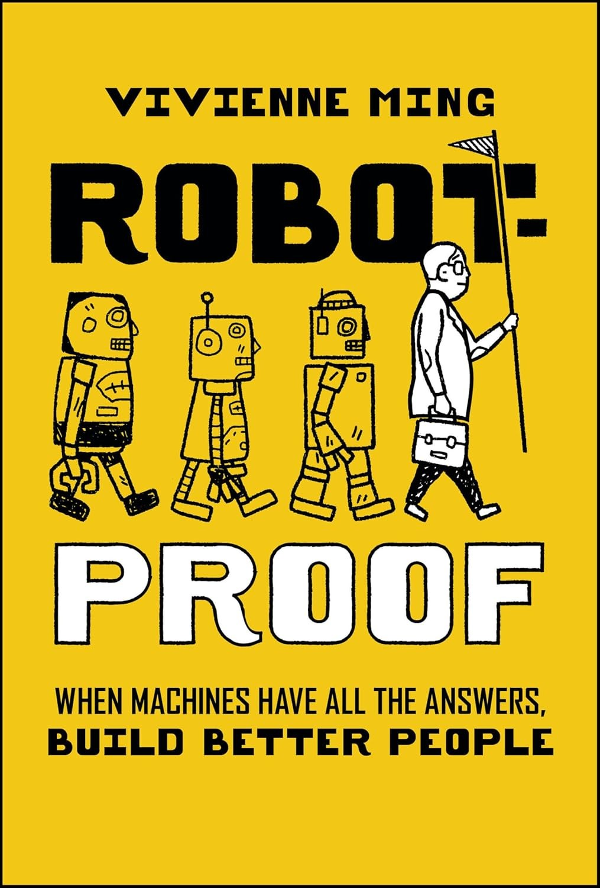

# Thesis

**Claim:** La IA y los agentes no reemplazan al manager: lo amplifican — y lo que este curso enseña no es una herramienta, sino la forma de pensar para delegar y orquestar trabajo con agentes.

**Why it matters:** El panorama de herramientas cambia más rápido de lo que se puede aprender producto por producto; lo que queda es el criterio. Sin ese criterio, la IA se usa como un chat mejor; con él, el manager rediseña su propio trabajo y el de su equipo alrededor de lo que ahora puede delegar.

**Presenter feedback:**
- [closed] 2026-07-30 — "Agregar a Claudio Righetti en la línea de autores de la presentación."
  Resolution: La línea de autoría de la presentación quedó como ‘Paulo Veiga y Claudio Righetti, IAE Business School’; el perfil general del repositorio no se modificó.
- [closed] 2026-07-30 — "Hace que los autores estén uno abajo del otro."
  Resolution: Los autores se separaron en líneas independientes — Paulo Veiga y Claudio Righetti — con IAE Business School en una tercera línea común.
- [closed] 2026-07-30 — "Deberia ser Paulo Veiga, IAE Business School y Claudio Righetti, IAE Business School"
  Resolution: La portada muestra dos líneas de autoría: ‘Paulo Veiga, IAE Business School’ y ‘Claudio Righetti, IAE Business School’.

---

# Agenda

**Narrative arc:** Abrimos con la frase que resume todo el curso y arrancamos por el porqué — cómo vemos el futuro del trabajo del conocimiento, con datos y no con opiniones. De ahí bajamos a qué se llevan al terminar (objetivos) y cómo lo vamos a recorrer (cronograma y misiones). Recién entonces viene el bloque de cómo trabajamos: las tres reglas de convivencia y las herramientas con las que van a trabajar —así, cuando el recorrido ya nombró Cowork y Paperclip, quedan presentadas enseguida. Cierra la logística pura: cómo se evalúa, y el espacio de preguntas. El orden va de la convicción a la logística: primero por qué vale la pena, después cómo se cursa y cómo se rinde.

**Sections (in delivery order):**

- 1. Qué pensamos y por qué
- 2. Objetivos de Aprendizaje
- 3. Cronograma
- 4. Cómo trabajamos
- 5. Evaluación del Curso
- 6. Preguntas

**Presenter feedback:**
- [closed] 2026-07-16 — "Antes de la agenda, empecemos con un slide con con text biemvenidos. Si podemos conseguir una imagen para poner a la izquierda seria bueno para llenar."
  Resolution: Resuelto absorbiendo el pedido en la apertura existente, no creando una segunda primera lámina: "Manos a la obra" sigue abriendo el deck, ahora con un gesto explícito de bienvenida y una directiva `generate-image: left` para crear una imagen editorial abstracta de apertura. La imagen todavía no se genera en draft; se genera en Polish (Step 6) si la sesión tiene generación de imágenes. Si el presentador quiere una lámina "Bienvenidos" separada antes de 1.1, este cierre se revierte y se crea como slide nuevo.
- [closed] 2026-07-30 — "Aplicar la pasada completa de títulos acordada después de incorporar el gancho de Robot-Proof."
  Resolution: Se aplicó la secuencia completa de títulos acordada en las seis secciones, conservando sin cambios el contenido, las fuentes y las notas de cada slide.

---

# 1. Qué pensamos y por qué

**Goal of this section:** Instalar la tesis de amplificación —no reemplazo— y respaldarla con datos, para que todo lo que viene después (objetivos, misiones, herramientas) se lea como consecuencia de esa convicción y no como un temario suelto. Abre la presentación con la frase que la resume en una línea.

**Presenter feedback:**
- [closed] 2026-07-30 — "Agregar como slides 4 y 5 un arco basado en Robot-Proof: la primera con la portada a la izquierda y tres ideas sobre problemas bien definidos, correlación/causalidad y realidades ambiguas; la segunda debe cerrar con: El capital humano se vuelve ‘tóxico’ cuando solo representa conocimiento y habilidades rutinarias. Su valor vuelve a crecer cuando desarrolla metacognición, creatividad, adaptación y juicio."
  Resolution: Se agregaron las slides 1.4 y 1.5: la primera usa la portada local de Robot-Proof a la izquierda y desarrolla problemas bien definidos, correlación/causalidad y ambigüedad; la segunda cierra con la tesis acordada sobre capital humano, metacognición, creatividad, adaptación y juicio.
- [closed] 2026-07-30 — "Mover las slides 1.6 y 1.7 inmediatamente después de la slide 1.3."
  Resolution: Las anteriores slides 1.6 y 1.7 se movieron inmediatamente después de la 1.3 y ahora son 1.4 y 1.5; el arco de Robot-Proof pasó a 1.6 y 1.7, sin cambios de contenido, fuentes ni notas.
- [closed] 2026-07-30 — "Interpretar la numeración como global: mover las slides globales 6 y 7 inmediatamente después de la slide global 3."
  Resolution: Se corrigió la interpretación a numeración global: las anteriores pantallas 6 y 7, correspondientes al arco de Robot-Proof, quedaron como pantallas 4 y 5; ‘Más ejecución, más agencia’ y ‘La IA expande, el juicio sube de precio’ pasaron a las pantallas 6 y 7.
- [closed] 2026-07-30 — "Cambiar los títulos globales 6 y 9 por ‘La ejecución se delega. La agencia crece.’ y ‘Entonces, ¿qué delegan primero los líderes?’."
  Resolution: Se cambiaron únicamente los títulos de las pantallas globales 6 y 9 por ‘La ejecución se delega. La agencia crece.’ y ‘Entonces, ¿qué delegan primero los líderes?’; contenido, fuentes y notas permanecen sin cambios.

---

## 1. Bienvenidos al trabajo aumentado

<!-- template: single-point -->
<!-- generate-image: left | imagen vertical 2:3 para columna lateral de una presentación de business school. Tema: bienvenida, comienzo de curso, managers aumentados por IA. Estética: ilustración editorial vectorial plana, abstracta y sofisticada; gran espacio negativo blanco, formas negras sólidas como ancla, fondo coral/rojo suave o acentos coral #DA1B2E, líneas paralelas y cintas de flujo que sugieren información entrando a un sistema, planos translúcidos, composición limpia con sensación de energía contenida. Mantener creatividad abierta, pero conectar visualmente con la idea de apertura y trabajo aumentado. Evitar escena literal de aula, personas realistas, muebles, paisaje, horizonte, fotografía, logos, marcas, UI legible, texto legible, letras o números. -->

### Content

**El futuro no va a ser de las empresas que simplemente usan IA. Va a ser de los managers que están aumentados por ella.**

### Sources

- `README.md` (raíz del working directory) — sección "Objective", frase de cierre: *"Because the future will not belong to companies that simply use AI. It will belong to the managers who are augmented by it."*
- **Decisión del presentador, revisión del 2026-07-16** — la lámina estaba al final del deck, como cierre; el presentador pidió moverla al frente para que **abra** la presentación.

### Speaker notes

Es la primera lámina y es una sola frase: decirla, y hacer silencio. **No explicarla** — que quede colgada un segundo antes de arrancar.

Es la tesis del curso comprimida en una línea, y funciona como promesa: todo lo que viene después —los datos, los objetivos, las misiones, las herramientas— existe para que, al terminar, esa frase los describa a ellos.

Contexto de la decisión (revisión 2026-07-16): esta lámina cerraba el deck. El presentador la movió al principio con esta nota: *"no va a ser conclusiones pero cierra perfecto toda la presentación"*. Sirve como marco de apertura, y se puede volver a ella de palabra al cerrar el Día 1 — sin lámina, sólo la frase.

### Presenter feedback
- [closed] 2026-07-16 — "Dejemos este slide como primer slide que abre la presentacion. No va a ser concluciones pero cierra perfecto toda la resentacion."
  Resolution: Movida del cierre a la apertura: es ahora la slide 1.1 y abre el deck (presentador confirmó "abre", no "cierra"). La sección Conclusions se eliminó. Speaker notes reescritas para apertura (decir la frase y hacer silencio, sin explicarla); la transición operativa al Día 1 (formación de equipos + licencia por grupo) que llevaba esta lámina se trasladó íntegra al nuevo slide Q&A (6.2), junto con su cita del README.
- [closed] 2026-07-30 — "El slide tiene dos veces bienvenido."
  Resolution: Se eliminó “Bienvenidos.” del cuerpo; la bienvenida queda expresada una sola vez en el título y el contenido comienza directamente con la tesis del curso.
- [closed] 2026-07-30 — "El text **El futuro no va a ser de las empresas que simplemente usan IA. Va a ser de los managers que están aumentados por ella.** tiene un bullet. no es necesario y genera mucha identacion"
  Resolution: En la versión HTML, la apertura conserva el callout pero oculta su icono y elimina el espacio reservado para él, reduciendo la sangría.

---

## 2. Human capital is not a toxic asset

<!-- template: icon-list -->
<!-- aside: left  -->

### Content

Vivienne Ming parte de una advertencia: entrenamos a muchas personas para competir con la IA en el terreno donde la máquina tiene ventaja. Donde queda corto AI:

- **Problemas bien definidos.** Cuando el objetivo, los datos y el criterio de éxito están claros, la IA puede buscar y evaluar respuestas a una escala que una persona no alcanza.
- **Correlación no es causalidad.** Más datos permiten encontrar más patrones, pero no garantizan una explicación de por qué ocurre algo ni qué pasará cuando cambie el contexto.
- **Realidades ambiguas.** Cuando no existe una respuesta única, el trabajo decisivo consiste en formular el problema, integrar contexto y elegir entre objetivos en tensión.

### Sources

- Vivienne Ming, *Robot-Proof: When Machines Have All the Answers, Build Better People* (Wiley, 2026), capítulo 1, extracto oficial: https://catalogimages.wiley.com/images/db/pdf/9781394397808.excerpt.pdf.
- Notas aportadas por el presentador en Review, 2026-07-30: problemas bien definidos, límites de un aprendizaje basado en correlaciones y valor humano frente a realidades ambiguas.
- Imagen: portada compartida por el presentador, preservada localmente como `images/robot-proof-cover.jpg`; original: https://i.ebayimg.com/images/g/de4AAeSw9lFp0AU1/s-l1600.jpg.

### Speaker notes

Presentar el libro y aclarar el encuadre: Ming no propone competir contra la IA acumulando más respuestas. Propone desarrollar capacidades que importan cuando la respuesta no viene dada.

Recorrer los tres bloques de izquierda a derecha. En el primero, usar un ejemplo simple: resumir miles de documentos con una consigna clara. En el segundo, marcar la precisión técnica: escalar el aprendizaje de patrones no garantiza comprensión causal. No decir que una IA jamás podrá razonar causalmente. En el tercero, llevarlo al trabajo del manager: definir qué problema vale la pena resolver, qué restricciones cuentan y quién responde por la decisión.

La transición a la próxima lámina es una pregunta: *si la IA abarata las habilidades rutinarias, ¿qué vuelve valiosa a una persona?*

### Presenter feedback
- [closed] 2026-07-30 — "Cambiar el título ‘El valor humano empieza donde la respuesta no está clara’ por ‘Human capital is not toxic asset’."
  Resolution: El título de la slide 1.4 se cambió a ‘Human capital is not a toxic asset’, incorporando el artículo requerido en inglés.
- [closed] 2026-07-30 — "Revertir el último cambio de título y volver a ‘El valor humano empieza donde la respuesta no está clara’."
  Resolution: Se revirtió el último cambio: la slide 1.4 recuperó el título ‘El valor humano empieza donde la respuesta no está clara’.
- [closed] 2026-07-30 — "Dejar ‘Human capital is not a toxic asset’ como título definitivo de la slide 1.4."
  Resolution: La slide 1.4 queda titulada ‘Human capital is not a toxic asset’; no se modificaron el contenido, la portada ni la slide siguiente.
- [closed] 2026-07-30 — "Por que el texto ': cuando el objetivo, los datos y el criterio de éxito están claros, la IA puede buscar y evaluar respuestas a una escala que una persona no alcanza.' contine ':' ?"
  Resolution: Se eliminó el separador inicial de los tres cuerpos: cada concepto termina con punto y la explicación comienza directamente con mayúscula.

---

## 3. ¿Cuando se vuelve toxico entonces?

<!-- template: single-point -->

### Content

**El capital humano se vuelve “tóxico” cuando solo representa conocimiento y habilidades rutinarias. Su valor vuelve a crecer cuando desarrolla metacognición, creatividad, adaptación y juicio.**

### Sources

- Vivienne Ming, *Robot-Proof: When Machines Have All the Answers, Build Better People* (Wiley, 2026), capítulo 1: *“human capital is an increasingly toxic asset”*; la autora propone desarrollar metacognición, mindset, regulación emocional y creatividad, y describe al trabajador del futuro como un explorador creativo y adaptativo de problemas.
- La formulación proyectada en español es una síntesis del presentador y del Editor, no una cita textual del libro.

### Speaker notes

Dejar la frase completa en pantalla y hacer una pausa. La expresión provocadora de Ming se refiere al capital humano que nuestras instituciones producen, no a que las personas sean tóxicas.

El conocimiento rutinario pierde valor cuando una máquina puede reproducirlo a menor costo. Metacognición significa observar cómo pensamos y corregir el rumbo. Creatividad permite construir hipótesis nuevas. Adaptación permite revisar el modelo cuando cambia la realidad. Juicio permite elegir y responder por las consecuencias.

Volver a la tesis de apertura: una persona aumentada usa la IA para ampliar su capacidad de acción y reserva su atención para los problemas que todavía necesitan contexto, criterio y responsabilidad.

### Presenter feedback
- [closed] 2026-07-30 — "Cambiar el título ‘El criterio es el activo’ por ‘¿Qué hace valioso al capital humano?’."
  Resolution: La slide 1.5 se tituló ‘¿Qué hace valioso al capital humano?’; el remate y las notas permanecen sin cambios.

---

## 4. La ejecución se delega. La agencia crece.

<!-- template: content+image -->

### Content

A medida que los agentes toman más de la ejecución, las personas ganan más agencia: más espacio para dirigir el trabajo, decidir y ser dueñas del resultado.

```ascii
      AGENTES                              PERSONAS
  +-------------------+              +----------------------+
  | toman la          |              | ganan AGENCIA        |
  | EJECUCION         |   ------->   |                      |
  |                   |              |  - dirigir           |
  |  - buscar datos   |              |  - decidir           |
  |  - resumir        |              |  - responder por     |
  |  - redactar       |              |    el resultado      |
  |  - repetir        |              |                      |
  +-------------------+              +----------------------+
           \                                    /
            \                                  /
             v                                v
      no es un juego de suma cero: crecen juntas
```
<!-- ascii-note:
intent: mostrar que ejecucion delegada y agencia humana crecen juntas, no en suma cero
emphasize: la flecha central AGENTES -> PERSONAS; las dos cajas con igual peso visual
labels: AGENTES (ejecucion) · PERSONAS (agencia) · pie: crecen juntas
-->

### Sources

- `corpus/explore-ground-rules-criterio-aprobacion-2026-07-15.md.md` — tesis del presentador, planteada directamente en la exploración: "no reemplazo, sino amplificación".
- `corpus/microsoft-work-trend-index-2026.web.md` — "la nueva ecuación de la agencia": *"as agents take on more of the execution, humans increasingly have more agency—more room to direct the work, make the calls, and own the outcomes."*

### Speaker notes

Esta es la slide de la que cuelga todo el curso. Vale la pena decirla despacio y en primera persona: *no creemos en el reemplazo, creemos en la amplificación* — esto es lo que pensamos nosotros, y después mostramos los datos que lo sostienen.

El punto que suele destrabar la resistencia en el aula: no es que la IA hace tu trabajo y vos hacés menos. Es que la IA hace la ejecución y vos hacés más de lo que solo vos podés hacer — dirigir, decidir, responder por el resultado. Preguntar en voz alta: *¿cuánto de lo que hicieron esta semana era ejecución y cuánto era decisión?*

La frase de la "ecuación de la agencia" es de Microsoft (Work Trend Index 2026), y la usamos como respaldo, no como autoridad única.

### Presenter feedback

---

## 5. Entonces, ¿qué delegan primero los líderes?

<!-- template: stat -->

### Content

En las encuestas de adopción empresarial aparece siempre el mismo patrón: los líderes delegan primero trabajo de alto volumen, bien definido y con mucho texto — no decisiones de criterio.

| Tarea | % de empresas que la delegan |
| :-- | :-: |
| Gestión y extracción de datos | 47% |
| Análisis y resumen de documentos | 41% |
| Generación de reportes | 36% |

*Zapier 2026*

Estas tareas comparten lo que las hace seguras de delegar: **alto volumen, estructura clara, entrada y salida mayormente de texto**.

### Sources

- `corpus/zapier-agentic-ai-adoption-survey-2026.web.md` — porcentajes de delegación por tarea (gestión de datos 47%, análisis/resumen de documentos 41%, generación de reportes 36%). Encuesta Centiment para Zapier, 23–27 oct 2025, 525 respuestas.
- `README.md` (raíz del working directory) — sección "What kind of work do leaders actually delegate?".

### Speaker notes

La tabla no es el punto: el punto es lo que las tres tareas tienen **en común**. Preguntar al aula antes de mostrar la tabla: *"¿qué creen que se delega primero?"* — casi siempre aciertan, y eso ya instala el criterio.

Ninguna de las tres es una decisión de criterio. Nadie está delegando "a quién contrato" ni "qué precio pongo". Eso es exactamente la tesis de la slide 1.4 operando en la realidad de las empresas.

Salvedad metodológica por si preguntan: la encuesta de Zapier es de C-suite de EE.UU. en empresas de 1.000+ empleados — no generaliza a PyMEs ni a otros mercados.

### Presenter feedback

---

## 6. Delegar es no volver a explicar

<!-- template: statement -->

### Content

**"Automatizar" y "delegar" son muchas veces el mismo movimiento disfrazado.** El objetivo no es hacer una tarea una vez con ayuda de un agente; es describirla **declarativamente** — una Skill, una Instruction — para que se repita sola, sin volver a explicarla cada vez.

### Sources

- `corpus/explore-ground-rules-criterio-aprobacion-2026-07-15.md.md` — encuadre de "repetición declarativa" introducido por el presentador: *"No solo queremos hacerlo, sino poder repetirlo en forma declarativa"* / *"automate and delegate are often the same move in disguise."*
- `README.md` (raíz del working directory) — sección "What kind of work do leaders actually delegate?".

### Speaker notes

Este es el patrón más profundo de la sección, y el que menos gente ve solo. Delegar una vez es pedir un favor; delegar de verdad es **escribir la tarea una vez y no volver a explicarla**.

La analogía que funciona: la diferencia entre pedirle algo a un pasante cada lunes y escribirle el procedimiento una vez. El segundo caso escala; el primero no.

Es el puente hacia los Días 1–2 (Skills en Cowork), pero **no lo conectemos explícitamente con la herramienta acá** — se queda a nivel filosofía. Decisión explícita del presentador.

### Presenter feedback

---

# 2. Objetivos de Aprendizaje

**Goal of this section:** Dejar explícito qué se llevan al terminar — y que el foco no es dominar un producto sino construir criterio propio, porque las herramientas van a cambiar.

**Presenter feedback:**

---

## 1. El vehículo, no el destino

<!-- template: statement -->

### Content

**Vas a construir agentes de verdad, con herramientas reales, para resolver los problemas que ya vimos.**

Pero el foco no es la herramienta: es la filosofía y el criterio para adaptarte a lo que venga — **lo que hoy es Cowork, mañana puede tener otro nombre**.

### Sources

- `corpus/explore-ground-rules-criterio-aprobacion-2026-07-15.md.md` — párrafo "Foco de la materia (segunda parte — Agentes Inteligentes)", redactado y aprobado por el presentador durante la exploración; y su cita directa: *"El foco es ver una herramienta pero lo mas importate es aprender el como es la filosofia y la forma de pensar para poder adaptarnos a lo que viene."*
- **Decisión del presentador, revisión del 2026-07-30** — pedido explícito de dejar claro que el curso es muy hands-on/práctico con herramientas que ayudan a construir agentes para resolver los problemas planteados en la Sección 1, pero que el foco sigue siendo el criterio, no la herramienta. Orden confirmado explícitamente: primero contar qué van a hacer (construir agentes reales), después subrayar que el foco no es la herramienta.

### Speaker notes

Esta slide gestiona una expectativa que conviene desarmar temprano: **no venimos a hacer un tutorial de Cowork**. Si alguien vino a eso, se va a frustrar; si entiende que Cowork es el vehículo y no el destino, todo el resto cierra.

El encuadre para decir en voz alta (no está en la slide): la primera parte del curso construyó el marco conceptual — dónde crea valor la IA y cómo pensarla a nivel de negocio. Esta segunda parte es sobre **la práctica de trabajar aumentado**: cómo los agentes y las herramientas de IA multiplican lo que puede hacer un knowledge worker.

Doble mensaje a sostener en el aire al mismo tiempo: va a ser **muy hands-on** — vamos a construir agentes de verdad con herramientas reales, para resolver los problemas de la Sección 1 (no ejercicios de juguete) — pero el objetivo de aprendizaje **no es la herramienta**, son los conceptos y el criterio que van a poder llevarse a cualquier herramienta nueva.

La frase "lo que hoy es Cowork, mañana puede tener otro nombre" suele generar una reacción — vale hacer una pausa ahí. Es honesta y le baja el precio a la ansiedad por elegir "la herramienta correcta". Por eso el foco está en el patrón, no en el botón: al terminar, van a saber **qué preguntarle a una herramienta nueva y cómo evaluarla**, no solo cómo usar la de hoy.

Puente hacia la siguiente slide: *"con eso en la cabeza, estos son los cinco objetivos concretos."*

### Presenter feedback
- [closed] 2026-07-30 — "Creo es importante marcar que"
  Resolution: Bullet inicial incompleto, completado por el presentador en chat: el curso es muy hands-on/práctico con herramientas que ayudan a construir agentes para resolver los problemas de la Sección 1, pero el foco sigue siendo el criterio y los conceptos, no la herramienta. La elaboración completa quedó en speaker notes (para respetar el presupuesto del pin `statement`, un claim + una línea); el Content se mantuvo corto: claim + "muy hands-on, pero el criterio es lo que se lleva". Título cambiado de "La herramienta cambia. El criterio queda." a "El vehículo, no el destino" (retoma la metáfora ya presente en las notas: "Cowork es el vehículo, no el destino"). Revisión del Composer (2026-07-30, scope=full) detectó que la primera versión del Content excedía el pin `statement` y casi duplicaba las speaker notes; corregido en la misma ronda.
- [closed] 2026-07-30 — "El texto 'El foco no es dominar una herramienta...' no es correcto. Esta el foco al reves."
  Resolution: Se invirtió el orden del Content: la frase que abre ahora cuenta qué van a hacer ("vas a construir agentes de verdad, con herramientas reales, para resolver los problemas que ya vimos"), y recién después subraya que el foco no es la herramienta sino la filosofía y el criterio. Orden confirmado explícitamente por el presentador: "Primero es contar que vamos a hacer y luego subrayar que el foco no es la herramienta." El título "El vehículo, no el destino" se mantuvo sin cambios.

---

## 2. De chatear a delegar y orquestar

<!-- template: concept-breakdown -->

### Content

- **Comprender el cambio de paradigma** — de chatear a delegar y orquestar.
- **Desarrollar criterio profesional** — la filosofía por sobre la herramienta puntual.
- **Hands-on con las misiones aplicadas** — varias misiones a lo largo de la cursada.
- **Reflexionar sobre el impacto en la gestión y los negocios** — y cómo aplicarlo a mi propio trabajo.

### Sources

- `corpus/explore-ground-rules-criterio-aprobacion-2026-07-15.md.md` — los 5 objetivos en su versión final, aprobados por el presentador ("Esta parte de objectivos esta perfecto"), incluyendo dos correcciones explícitas suyas: "Experimentar" → **"Hands-on"** en el punto 4, y el agregado de **"y cómo aplicarlo a mi propio trabajo"** en el punto 5. El objetivo 1 se extendió a "de chatear a delegar y orquestar" para nombrar el mismo arco de tres estadios que la Tesis.
- **Decisión del presentador, revisión del 2026-07-16** — el punto 4 decía *"Hands-on con la primera misión aplicada — Atlas"*; se genericizó a **"varias misiones a lo largo de la cursada"** por pedido explícito suyo: ninguna misión se nombra en esta lámina.

### Speaker notes

El quinto objetivo es el que más les importa aunque no lo digan: **"¿qué hago yo, a partir de mañana?"**. Fue un pedido explícito del presentador que estuviera. Vale enfatizarlo — la reflexión de cierre que respondía esto por escrito era parte de la lámina del portafolio, borrada en la revisión del 2026-07-30 (ver *Cut material*); hoy la pregunta queda solo planteada acá y en el espacio de Preguntas al cierre del deck.

El objetivo 1 —de chatear a delegar y orquestar— es literalmente el arco del curso: **tres** estadios, no dos. Delegar lo van a ver operar el Día 1 en el demo de Cowork; orquestar es el destino y llega recién el Día 6 con Paperclip. Anticipar acá que el tercer salto es el que casi nadie da solo.

⚠️ El deck ya **no lleva el diagrama del arco** (la lámina que lo mostraba se borró en la revisión del 2026-07-16), así que este objetivo es **el único lugar donde el arco de tres estadios se nombra**. Decirlo despacio y dejarlo instalado — sin esta línea, el curso se lee como siete temas sueltos. Se puede reforzar de palabra sobre el cronograma (3.1).

El punto 4 no nombra ninguna misión a propósito (pedido del presentador): son varias y se van a ir presentando a lo largo de la cursada. Si preguntan cuáles, el cronograma (3.1) las nombra por día.

### Presenter feedback
- [closed] 2026-07-16 — "No mencionemos atlas sino que vamos a tener varias misiones."
  Resolution: Objetivo 4 genericizado: "Hands-on con la primera misión aplicada — Atlas" → "Hands-on con las misiones aplicadas — varias misiones a lo largo de la cursada". Ninguna misión se nombra ya en la Sección 2 (barrida completa: Content, Sources y speaker notes). El nombre Atlas se registró en Cut material y sobrevive solo en el cronograma (3.1), donde el pareo día↔misión es una decisión previa deliberada — confirmación pedida en Open questions.

---

# 3. Cronograma

**Goal of this section:** Que se lleven el mapa completo — cuándo, dónde, presencial o virtual — y que entiendan que las siete sesiones son una progresión (de chatear a delegar y orquestar), no siete temas sueltos.

**Presenter feedback:**
- [closed] 2026-07-16 — "Borremos este slide."
  Resolution: Slide "De un chat a una organización de agentes" eliminada; la Sección 3 queda con 1 slide. Contenido completo archivado en Cut material (lead, diagrama ASCII con su ascii-note, y las 3 misiones con su descripción). El render `images/s3-2-1-chat-delegar-orquestar.png` queda huérfano y NO se borró. Consecuencia gestionada: el arco Chat→Delegar→Orquestar ahora sobrevive solo como texto (objetivo 1 de 2.2) — verificado que se lee bien solo, y reforzado en los speaker notes de 2.2 y 3.1.

---

## 1. Siete sesiones, un recorrido

<!-- template: timeline -->

### Content

Siete sesiones · mezcla de presencial (3,5 h) y virtual (2 h). Cada día tiene su propio foco, y el recorrido va de chatear a delegar y orquestar.

- **1 · Sáb 1 Ago · 8:30–12:00 · Presencial (3,5 h)** — Intro/Claude Desktop - Chat
- **2 · Sáb 1 Ago · 13:00–16:30 · Presencial (3,5 h)** — Claude CoWork
- **3 · Jue 6 Ago · 19:00–21:00 · Virtual (2 h)** — Agent Fundamentals: adopción, historia y métricas
- **4 · Mar 11 Ago · 19:00–21:00 · Virtual (2 h)** — *A definir*
- **5 · Vie 28 Ago · 9:00–12:30 · Presencial (3,5 h)** — Claude Cowork para la Empresa
- **6 · Sáb 29 Ago · 8:30–12:00 · Presencial (3,5 h)** — Orquestando agentes con Paperclip
- **7 · Jue 3 Sep · 19:00–21:00 · Virtual (2 h)** — Evaluación

### Sources

- `README.md` (raíz del working directory) — tabla "Schedule" de la sección Class Agenda: 7 sesiones con fecha, horario, formato, duración y título (en inglés; traducidos acá al español). Nombres de misión (Atlas / Enterprise / Paperclip) de "Mission Overview".
- `corpus/explore-ground-rules-criterio-aprobacion-2026-07-15.md.md` — el mismo calendario tal como estaba al inicio de la exploración; confirma que el Día 3 se definió en esa sesión y que el **Día 4 sigue sin definir**.

### Speaker notes

Lo que más preguntan acá: **el sábado 1 de agosto es doble jornada** (Días 1 y 2, mañana y tarde, con corte al mediodía). Decirlo explícito — es hoy.

Las misiones **ya no se nombran en lámina en ninguna parte del deck** — ni acá ni en los objetivos (2.2). Es deliberado: son varias y se van presentando a lo largo de la cursada. Si preguntan cuáles, los nombres (Atlas / Enterprise / Paperclip) están en el README y se pueden decir de palabra.

El Día 4 está a definir a propósito: lo vamos a cerrar en función de cómo venga el grupo. Si preguntan, ser directo con eso en lugar de improvisar un tema.

Marcar el ritmo: los presenciales son los de trabajo pesado (Días 1, 2, 5, 6); los virtuales son más cortos y más conceptuales.

El arco del curso —de chatear a delegar y orquestar— **ya no tiene lámina propia** (se borró en la revisión del 2026-07-16). Vale trazarlo en voz alta acá, sobre el calendario: el Día 1 es **chatear** (Claude Desktop), el punto de partida; los Días 2–3–5 son **delegar** (Cowork); el Día 6 es **orquestar** (Paperclip). Sin diagrama, esta lámina es el único lugar donde la progresión se puede ver.

### Presenter feedback
- [closed] 2026-07-16 — "El texto de Siete sesiones deberia ir arriba."
  Resolution: Pin cambiado de `timeline` a `process`: `timeline` no tiene campo de lead (su formato es un rail vertical de fecha + detalle), por eso el texto introductorio caía debajo de los 7 hitos; `process` sí admite un lead sobre los pasos, y las 7 sesiones son una secuencia numerada legítima. El texto ahora renderiza arriba. Trade-off (se pierde el rail temporal, se gana una tira de tarjetas numeradas) registrado en Open questions para confirmación del presentador.

---

# 4. Cómo trabajamos

**Goal of this section:** Bajar a tierra el día a día del curso: las tres reglas de convivencia acordadas desde el primer día y las herramientas con las que van a trabajar (y la pregunta de las licencias, antes de que aparezca sola). Abre el bloque de logística: *cómo trabajamos* antes de *cómo se aprueba*.

**Presenter feedback:**

---

## 1. Tres reglas para que el tiempo valga

<!-- template: icon-list -->

### Content

Tres reglas, y las tres apuntan a lo mismo: que el tiempo que estamos juntos valga lo que cuesta.

- **Pantallas cerradas — salvo cuando trabajamos** — Laptop, teléfono, tablet. La salvedad no es una concesión: es parte de la regla. Este curso es hands-on desde el Día 1, y cuando abrimos Cowork las pantallas se abren con él. Cerradas cuando conversamos; abiertas cuando construimos.
- **Estar presente** — Estar en la sala no es lo mismo que estar. Presencia real: escuchar, preguntar, discutir, aportarle al equipo.
- **Puntualidad — empezamos en punto** — Los presenciales son bloques de 3,5 horas y arrancan a horario. Cada minuto tarde es contenido que no se recupera.

### Sources

- **Decisión del presentador, revisión del 2026-07-15** — las tres reglas en sus palabras. La primera la formuló como *"computadoras cerradas"* y pidió generalizarla; se acordó **"pantallas cerradas"** (cubre laptop, teléfono y tablet) con la salvedad **"salvo cuando trabajamos"** explícita. Las otras dos, textuales: *"estar presente"* y *"puntualidad — empezamos en punto"* (fue enfático con el "en punto"). Contenido aportado directamente en la revisión: **no tiene registro en `research/corpus/`** porque no proviene de ninguna fuente cruda capturada.
- `corpus/explore-ground-rules-criterio-aprobacion-2026-07-15.md.md` — contexto: la exploración deja registrado que las ground rules se preguntaron dos veces y quedaron sin definir. Esta slide cierra esa parte del briefing original.

### Speaker notes

Estas tres reglas son del presentador — vale decirlas en primera persona y no leerlas como reglamento de la escuela. Son **tres** a propósito: si fueran diez, no se acuerda ninguna.

**Pantallas cerradas** es la que más fricción genera y la que más se malinterpreta. Decir la salvedad en la misma respiración que la regla: *"pantallas cerradas — salvo cuando trabajamos"*. No es un hedge para suavizar el golpe: este curso es hands-on con Cowork desde el Día 1, así que buena parte del tiempo las pantallas van a estar abiertas y eso está bien. Lo que no queremos es la pantalla abierta mientras alguien expone. Vale nombrar el gesto físico: cuando decimos "cerramos", se cierran.

**Estar presente** es la regla blanda, pero es la que sostiene a las otras dos. Si el grupo pide bajarla a tierra, se puede conectar con el 20% de Participación de la Sección 5 (Evaluación, slide 5.1): "compromiso durante las sesiones" es exactamente esto.

**Puntualidad** — el presentador fue enfático con el **"en punto"**. No hace falta amenazar; alcanza con explicar el costo: los presenciales son 3,5 horas y el Día 1 arranca 8:30 (slide 3.1). Llegar tarde no es una falta de respeto abstracta, es contenido perdido.

Puente a la slide siguiente: *"esas son las reglas de cómo trabajamos; ahora, con qué vamos a trabajar."*

### Presenter feedback

---

## 2. Qué herramienta para qué trabajo

<!-- template: icon-list -->

### Content

Tres tipos de herramienta, tres para qué. No compiten entre sí: se complementan.

- **Automatización** — **Claude Cowork**: delegar un resultado y lograr que todo eso se repita solo la próxima vez.
- **Análisis de Datos** — **Claude Cowork**: analizar los datos que hacen falta para producir ese resultado.
- **Orquestrar Agentes** — **Paperclip**: orquestar una organización de agentes hacia un objetivo, con vos aprobando los pasos sensibles.

### Sources

- `corpus/explore-ground-rules-criterio-aprobacion-2026-07-15.md.md` — tabla "Herramientas del Curso" en su versión final (v3, tras 4 iteraciones con feedback del presentador): 3 categorías — Automatización (Claude Cowork) · Agentes (Paperclip) · Producción de Contenido (NotebookLM · Gamma AI · Claude). Incluye la nota de licencia por grupo, especificada por el presentador: *"dado que vamos a trabajar con Claude Cowork durante el curso, va a haber una licencia por grupo para poder hacer el trabajo."*
- **Decisión del presentador, revisión del 2026-07-16** — tres cambios: (1) "Herramientas del Curso" deja de ser una sección propia y pasa a ser parte de "Cómo trabajamos"; (2) la categoría **"Automatización" se renombra a "Automatización y Análisis de Datos"** (*"Estaria bueno que automatizacion es realmente Autonatizacion y Analysis de datos. Burscar en todos lados."*); (3) la visualización de 3 columnas se rehizo como una lista de filas con ícono por fila (*"Tal vez una tabla simple pero manteniendo los iconos"*).
- **Decisión del presentador, revisión del 2026-07-30** — se quitó "Producción de Contenido" como fila (NotebookLM · Gamma · Claude quedan fuera del deck) y "Automatización y Análisis de Datos" se dividió en dos filas separadas, ambas sobre Claude Cowork.

### Speaker notes

Esta lámina viene justo después del cronograma a propósito: Cowork y Paperclip acaban de aparecer nombrados en el recorrido (3.1), así que la pregunta *"¿qué son esas cosas?"* ya está viva en la sala. Acá se responde.

Las tres filas responden a "¿para qué sirve cada una?", no a "¿cuál es mejor?". Son complementarias, no alternativas. Y las dos primeras (Automatización y Análisis de Datos) son Cowork — **delegar**; la tercera (Agentes) es Paperclip — **orquestar**.

Volver a la slide 2.1 en una línea: estas son las herramientas de hoy. El foco sigue siendo el patrón, no el botón — lo que hoy es Cowork, mañana puede tener otro nombre.

La nota de la licencia es la que más ruido genera si no se aclara: **una por grupo**. Conviene decirlo junto con la formación de equipos del Día 1 — quién arma el grupo, arma también el acceso.

Nota de encuadre para el presentador: la slide original de la primera parte del curso listaba herramientas genéricas (ChatGPT, Gemini, Perplexity, Canva AI); esta lámina se repobló completa con las herramientas específicas de esta segunda parte.

### Presenter feedback
- [closed] 2026-07-16 — "Borrar Herramientas del Curso como secccion y dejar herramientas del curso como parte de como trabajamos."
  Resolution: Sección "Herramientas del Curso" disuelta; la lámina sobrevive intacta como slide 4.2 dentro de "Cómo trabajamos". Deck: 7 → 6 secciones. El goal de la sección vieja se plegó al goal de la Sección 4, y la adyacencia con el Cronograma se preservó (Sección 3 → slide 4.2, misma posición relativa).
- [closed] 2026-07-16 — "Estaria bueno que automatizacion es realmente Autonatizacion y Analysis de datos. Burscar en todos lados."
  Resolution: "Automatización" → "Automatización y Análisis de Datos" en la slide 4.2, con el body ampliado para nombrar explícitamente el análisis de datos. Grep global aplicado ("buscar en todos lados"): las 2 únicas ocurrencias de la categoría (Content + Sources de la lámina) se actualizaron; "Automatizar" de la slide 1.6 y "Automatizando" del título del Día 2 en 3.1 se dejaron intactos — son otro concepto, no el nombre de la categoría.
- [closed] 2026-07-16 — "Creo que esta visualizacion no es clara. Tal vez una tabla simple pero manteniendo los iconos."
  Resolution: Visualización rehecha: de 3 tarjetas en fila (card-row) a una lista vertical de 3 filas con ícono por fila, pinneada `icon-list` — cada fila = ícono + categoría + para qué sirve. Es lo más cercano a la "tabla simple con iconos" pedida: el sistema de estilo prohíbe tablas nativas (las tablas pipe se renderizan como grillas de tarjetas). Nota de licencia por grupo preservada.
- [closed] 2026-07-30 — "borrar Producción de Contenido como item. Y parti automatizacion y analiss de datos como dos iteams."
  Resolution: Se quitó 'Producción de Contenido' como item (movido a Cut material) y 'Automatización y Análisis de Datos' se dividió en dos filas separadas: Automatización y Análisis de Datos, ambas sobre Claude Cowork. La lámina mantiene tres filas.

---

# 5. Evaluación del Curso

**Goal of this section:** Dejar cerrado desde el primer día **cómo se aprueba** —qué pesa cada componente— para que nadie descubra en septiembre cómo se evaluaba. Cierra, junto con la sección anterior, el par completo: *cómo trabajamos* y *cómo se rinde*.

**Presenter feedback:**

---

## 1. Cómo se construye la nota

<!-- template: stat -->

### Content

- **40% · Portafolio Grupal** — Misiones resueltas y reflexiones del equipo, entregadas a lo largo de la cursada, más una presentación de 5 minutos del portafolio por equipo.
- **40% · Examen Integrador** — Evaluación individual, 30 minutos la ultima clase.
- **20% · Participación** — Actividades prácticas y compromiso durante las sesiones presenciales y virtuales.

### Sources

- `corpus/explore-ground-rules-criterio-aprobacion-2026-07-15.md.md` — tabla "Evaluación del Curso" acordada en la exploración (40% Portafolio Grupal / 40% Examen Integrador / 20% Participación), adaptada de una slide de la primera parte del curso con los mismos porcentajes. Incluye la instrucción explícita del presentador de **no** listar las misiones por nombre en esta tabla.

### Speaker notes

Los dos 40% son el mensaje: **el trabajo en equipo pesa exactamente lo mismo que el examen individual**. Vale decirlo — desarma la idea de que "el portafolio es lo blando".

No listar las misiones acá por nombre (decisión explícita del presentador): el portafolio se va llenando durante la cursada y no queremos comprometernos al detalle todavía.

Pendiente antes de dictar: confirmar si el Examen Integrador de 45 minutos va en el Día 7 y qué escala de calificación se usa (aprobado/desaprobado vs. nota numérica). Si preguntan y no está cerrado, mejor decir "lo confirmamos la próxima" que improvisar.

### Presenter feedback
- [closed] 2026-07-30 — "Revisar el texto: Misiones resueltas y reflexiones del equipo que entregando a lo largo de la cursada. Presentacion de 5 MIM del profilio por el equipo.  y hacermo mas compacto."
  Resolution: Se corrigió la redacción del ítem Portafolio Grupal (errores de tipeo: 'entregando' → 'entregadas', 'profilio' → 'portafolio', '5 MIM' interpretado como '5 minutos' por consistencia con el "Pitch grupal — 5 minutos por equipo" de la Sección 6) y se compactó a una sola oración.


---

# 6. Preguntas

**Goal of this section:** Cerrar el deck abriendo el espacio real de preguntas, para que las dudas de evaluación, cronograma o logística salgan antes de arrancar la primera misión.

**Presenter feedback:**

---

## 1. ¿Preguntas?

<!-- template: single-point -->
<!-- generate-image: left | imagen vertical 2:3 para columna lateral de una presentación de business school. Tema: preguntas, apertura, reflexión y conversación final. Estética: ilustración editorial vectorial plana, abstracta y sofisticada; mucho espacio negativo blanco, masas negras mínimas como ancla, acentos coral #DA1B2E, líneas paralelas, bucles o cintas de flujo que se abren y convergen, planos translúcidos que sugieren distintas capas de pensamiento, composición limpia con tensión tranquila. Mantener creatividad abierta, pero conectar visualmente con Q&A como espacio de exploración compartida. Evitar signos de pregunta literales, personas realistas, objetos reconocibles, muebles, paisaje, horizonte, fotografía, logos, marcas, UI legible, texto legible, letras o números. -->

### Content

**Cronograma, evaluación o logística:** conversemos ahora.

### Sources

- **Decisión del presentador, revisión del 2026-07-16** — pedido explícito: *"Agregar un slide Q&A. Buscar una imagen a la izquiera para utlizar."* La lámina existe; **la imagen está pendiente** (ver *Open questions*).
- `README.md` (raíz del working directory) — "SESSION FLOW" del Día 1: formación de equipos y arranque de la primera misión. Sostiene la transición operativa de los speaker notes. (Referencia heredada de la vieja lámina de cierre "Manos a la obra", hoy en 1.1.)

### Speaker notes

Es el cierre real del deck. Dejar espacio de verdad: si quedaron dudas sobre evaluación o cronograma, es mejor que salgan ahora y no a mitad de la primera misión.

Las tres preguntas que más aparecen y que todavía **no** tienen respuesta cerrada (ver *Open questions*): escala de calificación, mínimo de asistencia, y qué está permitido usar de IA en las entregas. Si salen, decir *"lo confirmamos la próxima"* en vez de improvisar — improvisar acá se convierte en compromiso.

Cuando se apaga el Q&A, transición operativa inmediata al Día 1: formación de equipos (recordar: **una licencia de Cowork por grupo**, slide 4.2) y arranque del framing de IA y agentes.

Se puede volver de palabra a la frase de apertura (1.1) sin cambiar de lámina: *el futuro va a ser de los managers aumentados por ella* — y hoy empieza eso.

### Presenter feedback

- [closed] 2026-07-30 — "El slide de Q & A dice preguntas 3 veces. Revisaste correctamnete la asignacion ?"
  Resolution: Se mantuvo el pin single-point, pero se eliminó la duplicación entre título y punto central: la slide conserva ‘¿Preguntas?’ como título y ahora usa ‘Cronograma, evaluación o logística: conversemos ahora’ como contenido.

---

# Open questions

