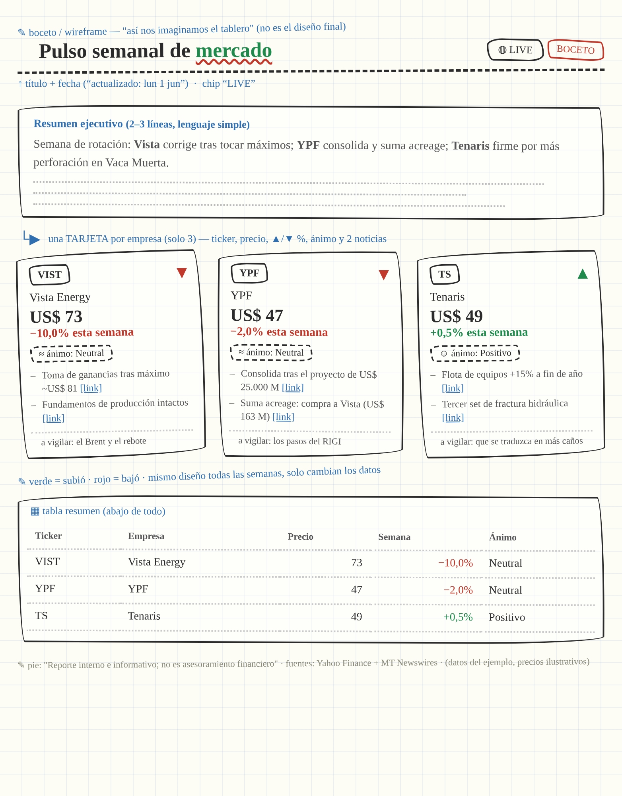
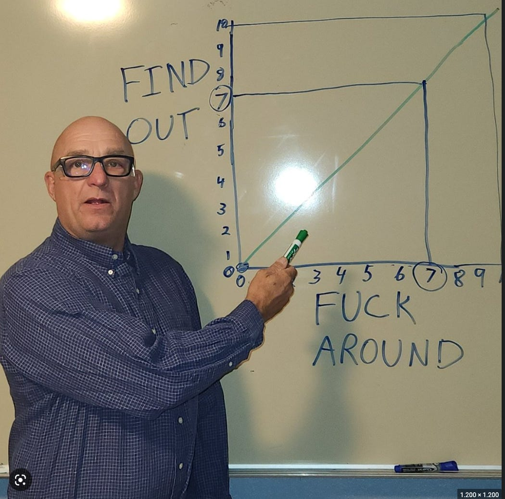

# Thesis

**Claim:** El deck abre la Parte 2 de la misión: el jefe quedó contento con el email y ahora quiere el pulso también en PDF, con el diseño de su boceto — y para armarlo Faro baja a la computadora con Claude Cowork. Verifica el setup (Cowork funcionando sobre una carpeta, Loom probado), da 1 hora de trabajo y presenta la entrega final: un Loom por grupo.

**Why it matters:** La Parte 2 es donde aparecen los problemas de entorno y donde se juega la entrega final; despejarlos en 10 minutos protege la hora de trabajo.

**Presenter feedback:**

---

# Agenda

**Narrative arc:** El encargo nuevo del jefe (1), el checklist de setup que ya tiene que estar resuelto (2), el tiempo y la entrega final en Loom (3), y preguntas.

**Sections (in delivery order):**

- 1. La misión
- 2. Setup
- 3. Entrega final

**Presenter feedback:**

---

# 1. La misión

**Goal of this section:** El encargo nuevo: el tablero en PDF del boceto del jefe, que exige a Faro trabajar sobre carpetas reales con Cowork.

**Presenter feedback:**

---

## 1. El jefe quiere más: el tablero en PDF

### Content

- El email del lunes ya llega solo, y el jefe quedó **muy contento**.
- **El encargo nuevo**: el mismo pulso, además del email, en un **PDF con mejor capacidad visual** — el boceto de la servilleta.
- **Acá entra Cowork**: para armarlo, Faro trabaja sobre las **carpetas y archivos reales** del equipo.
- Los milestones de esta parte están en el PDF del enunciado.

### Sources

- Enunciado: `missions/CoWork/mission.md` (versión de entrega: `mission-parte2.pdf`).

---

# 2. Setup

**Goal of this section:** Verificar que el entorno ya funciona antes de arrancar.

**Presenter feedback:**

---

## 1. Checklist: esto ya tiene que estar funcionando

### Content

- **Cowork instalado**: en al menos una computadora del grupo.
- **Funciona sobre una carpeta**: el archivo de prueba apareció. Si no: virtualización en Windows, macOS viejo.
- **Sonnet, pensamiento medio**: sigue igual que en la Parte 1.
- **Loom probado**: la entrega final depende de él.

### Sources

- Instructivo de setup y entrega: `missions/CoWork/instructivo-setup-entrega.md`.

---

# 3. Entrega final

**Goal of this section:** El tiempo disponible y la entrega final de la misión.

**Presenter feedback:**

---

## 1. Entrega final: un Loom

### Content

- Tienen **1 hora** para esta parte. Al final, la entrega de la misión: **un Loom por grupo** que cuenta una historia.
  - **El recorrido**: cómo fueron resolviendo, paso a paso.
  - **Los desafíos**: qué se trabó y cómo lo destrabaron.
  - **La tarea programada en vivo**: se dispara, trabaja y el resultado llega a destino.
  - **Los aprendizajes**: qué se llevan del trabajo con el agente.

### Sources

- Instructivo de setup y entrega: `missions/CoWork/instructivo-setup-entrega.md`.

---

## 2. ¿Preguntas?

### Content

- ¿Preguntas?

<!-- template: content-image -->

### Sources

- —
